# Ders 2

Önceki derste $\dot{x} = f(x), \quad x \in \mathbb{R}$ türünden sistemlere
baktık, dedik ki bu tür sistemleri analitik olarak çözmeye uğraşabilirsiniz,
fakat çoğunlukla / eğer $f$ gayrı lineer bir fonksiyon ise, ortaya çıkacak
entegralleri analitik olarak, değişkenlerin ayrılması tekniğiyle mesela çözmek
imkansız olabilir. Diğer taraftan bu çerçevede çizim kullanmak daha kolay, bu
derste kullanacağımız yaklaşım da bu olacak.

Örnek üzerinde görelim; mesela alttaki gibi berbat (!) bir $f$ var. 

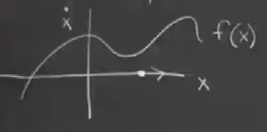

Çözmek için x ekseninde zamana göre hareket eden bir parcaçık hayal ederiz, o
parcaçığın hızı $\dot{x}$ olacaktır, yani bu hız parcaçığın x ekseninde nerede
olduğunu göre değişecek, ve tabii ki bu hız parcaçığın yerini değiştirecektir,
sonra gelinen yerde yeni bir hız olacaktır, vs.. Aslında üstteki örnekte çizilen
parcaçık hep sağa gidecek, tabii eğer $f$'in x eksenini kestiği noktanın solunda
değil ise. O zaman da hep sola giderdi.. Bir de o kesişim noktasında bir stabil
nokta var, onu unutmayalım, çünkü o noktadan başlarsam hiçbir yere hareket etmem
($\dot{x}=0$).

Çoğunlukla çizim yapacağız dedik, fakat bir analitik teknik var ki kullanması
kolay ve oldukça faydalı, tekniğin ismi sabit bir nokta etrafında lineerleştirme
(linearization around a fixed point). Bu teknikle bir sabit nokta $x^\ast$
etrafındaki (üst yıldız notasyonunu sabit noktalar için kullanıyorduk
hatırlarsak) dinamiği incelemek istiyoruz, ki sabit noktalar $f(x^\ast)=0$ şartını
yerine getirecek noktalar, çünkü o noktalarda hız sıfır. Lineerleştirmeye göre
bu noktanın "yakın komşularına'' bakarız, hemen etrafına yani, ve eğer o
noktalarda hız artıp bizi noktadan uzaklaşırıyorsa bir büyüme vardır, eğer
azalma var ise tekrar sabit noktaya döneceğiz demektir, bir çürüme (decay)
vardır. Tekniği şöyle kullanırız, diyelim ki

$$ x(t) = x^\ast + \eta(t), \qquad  |\eta| << 1 $$

olsun, $\eta$ bir çürüme terimi, ve onun büyüklüğünün, yani mutlak değerinin
çok küçük olacağını farz ettik ($a<<b$ sembolü $a$ değeri $b$'den çok küçüktür
demek), çok küçüklüğü birazdan daha iyi açıklayacağım. Neyse amacım $\eta$ için
bir denklem türetmek ki böylece büyüyor mu çürüyor mu onu görebileyim. Üstteki
$x$'ten hareketle $\dot{x}$ nedir?

$$ 
\dot{x} = \frac{d}{dt}( x^\ast + \eta \big) =
\big( x^\ast + \eta \big)^{*.*} = \dot{\eta} 
$$

Eşitliğin en sağı ortaya çıktı çünkü sabit noktada değişim sıfır demiştik,
$\dot{x^\ast} = 0$, geriye sadece $\dot{\eta}$ kaldı. Diğer yandan $\dot{x}=f(x)$
olduğu için

$$ 
\dot{x} = \dot{\eta} = f(x) = f(x^\ast + \eta) 
$$

Fakat hala tam ne olduğunu göremiyoruz çünkü $f$ karmaşık bir fonksiyon. Bu
noktada lineerleştirmeyi devreye sokuyoruz, diyoruz ki $f$ yeteri kadar
pürüzsüzdür (smooth) yani herhangi bir $x$ etrafında Taylor serisi
yaklaşıklaması yapabilirim. 

$$ 
f(x^\ast + \eta) = f(x^\ast) + \eta f'(x^\ast) + \frac{\eta^2}{2}f''(x^\ast) + ...
$$

Tabii lineerleştirmeyi herhangi bir nokta etrafında değil sabit nokta etrafında
yapıyoruz, o zaman $f(x^\ast)=0$ olduğu için

$$ 
f(x^\ast + \eta) = \cancelto{0}{f(x^\ast)} + \eta f'(x^\ast) +
\frac{\eta^2}{2}f''(x^\ast) + ...
$$

$$ f(x^\ast + \eta) =  \eta f'(x^\ast) + \frac{\eta^2}{2}f''(x^\ast) + ...$$

Geri kalan formül $\eta$'ya lineer olarak bağlı. Ama hala $f'(x^\ast)$ var?
$\eta$'nin çarptığı ibare çetrefilmiş gibi duruyor, ama unutmayalım, o ifade bir
tek sayı aslında çünkü fonksiyona bir sabit nokta değeri geçiyoruz, ve bir sayı
elde ediyoruz. $f'(x^\ast)$ sonuçta $f$'in türevinin $x^\ast$ noktasındaki değeri
değil midir? Yani $f$'in sabit noktadaki eğiminden (slope) bahsediyoruz.

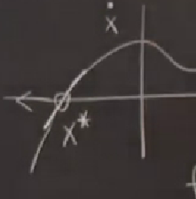

Sonuç olarak elimde eşitliğin sağında bir sayı çarpı $\eta$, bir diğer sayı
çarpı $\eta^2$ var. Matematikte bu tür argümanı daha önce görmüş olabiliriz,
$\eta$ 1'den çok küçüktür demiştik, o zaman 1'den çok küçük bir şeyin karesi
daha da küçük olacağına göre $\eta^2$'den başlayarak sağa giden tüm terimleri
atabiliriz. Lineerleşirmenin arkasında yatan fikir bu, karesel terimlerden
(quadratic term) kurtulmak.

Fakat kendimize bir daha soralım, $\eta^2$'li terimi $\eta$'li terimle
kıyaslayarak düşünürsem, atılabileceğinden emin miyim? Evet, eğer $f'(x^\ast)$
sıfır değil ise. Çünkü eğer o ilk terim sıfır olursa yokolur, ve geri kalan tek
önemli terim $\eta^2$'li terim olur, bu durumda ikinci terimi yok kabul
edemezdik. Matematiksel olarak derli toplu bunu bir daha ifade edersek, eğer
$f'(x^\ast) \ne 0$ ise, ufak $\eta$ için $|f'(x^\ast) \eta| >> |\frac{\eta^2}{2}
f''(x^\ast)|$.

Yani $O(\eta^2)$ ifadelerini formülden atarız ($O()$ notasyonu derece (order of)
demektir, yani iki ve daha büyük dereceli terimlerden bahsediyoruz),

$$ f(x^\ast + \eta) =  \eta f'(x^\ast) + \cancel{\frac{\eta^2}{2}f''(x^\ast)} + \cancel{...}$$

$$ f(x^\ast + \eta) = \eta f'(x^\ast) $$

Daha önce demiştik ki $\dot{\eta} = f(x^\ast + \eta)$, o zaman $x^\ast$ noktasında,

$$\dot{\eta} = r \cdot \eta$$

lineerizasyonunu elde ediyoruz ki $r=f'(x^\ast)$. $\dot{\eta} = r \cdot \eta$ sonucu
güzel bir sonuç, çünkü bu ifade özünde basit bir lineer diferansiyel denklem,
ODE dersinden bize tanıdık gelen bir ifade, $r$'nin pozitif ya da negatif
olmasına bağlı olarak ya büyüme ya da çürüme ortaya çıkacak. Çözüm,

$$ \eta = \eta_0 e ^{rt} $$

ki bu çözüm $r > 0$ ise büyür, $r < 0$ ise çürür. Üstteki grafikte görüyoruz ki
eğim yani $f'(x^\ast)$ sıfırdan büyük o zaman sabit nokta olduğu stabil olmalı, ki
hakikaten de böyle. Lineerizasyon tek boyutta böyle. İki ya da daha fazla
boyutta da lineerizasyon kullanacağız. 

Peki ya daha önce koyduğumuz şart $f'(x^\ast) \ne 0$ doğru değil ise ne olur? o
zaman lineerizasyondan hiçbir bilgi elde edemiyoruz, yani bu teknik ise
yaramıyor. Nokta stabil olabilir, yarı stabil olabilir, ya da her iki durumun
bir karışımı karma bir durum olan yarı-stabilite olabilir. Dört örnek vermek
gerekirse,

$$ \dot{x} = x^2, \qquad \dot{x} = -x^2 
$$

$$ \dot{x} = x^3, \qquad \dot{x} = -x^3 
$$

sistemlerini düşünelim. $x^\ast=0$ hepsi için bir sabit nokta. Bunu görmek kolay
herhalde, eşitliğin sağ tarafına sıfır verince hepsi $\dot{x} = 0$. Şimdi
$f'(x^\ast)$ şartını kontrol edersek, hepsi için $f'(x^\ast) = f'(0) = 0$. Teker teker
neler olduğuna bakalım şimdi, mesela $\dot{x} = x^2$, 

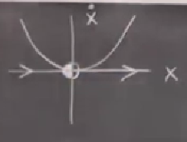

Soldan gelişte sabit noktaya "doğru'' gittiğimiz için bunu bir stabil nokta
yapmak istiyoruz, notasyonumuza göre içini dolduruyoruz. Ama sağa doğru
giderken gayrı stabillik te var, eğer o noktada sağa doğru ufak bir sarsım
uygulasak (perturb), sistem hemen sağa doğru büyüyecek. O zaman bu yarı-stabil
bir sabit nokta. Bir tarafından sabit, diğer tarafından değil.

$\dot{x} = -x^2$ için durum tam tersi,

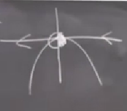

Sağdan stabil soldan değil. $\dot{x} = x^3$'e bakarsak,

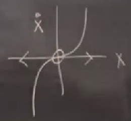

Bu tamamen gayrı stabil. Ve son olarak eğer $\dot{x} = -x^3$'e için,

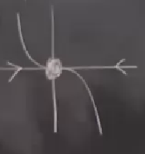

Tamamen stabil. Fakat buradaki stabillik daha önce gördüğümüzden biraz farklı;
daha önceki üstel idi, bu tür noktalara doğru üstel bir çürüme olur. Üstteki
durumdaki çürüme çok daha yavaş olurdu.

Özetle eğer $f'(x^\ast)=0$ olduğu durumda ne olup bittiğini anlamak istiyorsak,
hemen grafiği çizmek faydalı. Bir alternatif Taylor açılımında daha yüksek
derecelere bakmak (yani attığımız bazı terileri tutmak) fakat bence bu hala
yanlış bir yaklaşım. Resimlere bakmak çok daha bilgi verici.

Örnek: Lojistik Denklem

Daha önce işlediğimiz bir denklem bu, hatırlarsak,

$$ \dot{x} = rx ( 1 - \frac{x}{K}) $$

ki $x$ nüfus sayısı, $K$ taşıma kapasitesi, $r > 0$.

$x^\ast=0$, ya da $x^\ast=k$ olduğu zamanda $\dot{x}=0$ olur. Sabit noktalar
bunlar. Stabilite için $f'(x^\ast)$'e bakıyoruz,

$$ f'(x) = r - \frac{2rx}{K} $$

$f'(0) = r > 0$. Bu sonuç bize $x^\ast=0$'in gayrı stabil olduğunu söylüyor. 

$f'(0) = r - \frac{2rK}{K} = -r < 0$, demektir ki $x^\ast=K$ stabil. 

Dikkat: notasyon karışmasın, üstteki $r$ daha önce kullandığımız $r$'den
farklı.

Neyse, böylece daha önce çizdiğimiz aynı resme ulaşıyoruz.

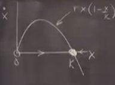

Burada lineerizasyon konusundan biraz uzaklaşıp, pür matematiğin basit
diferansiyel denklemler (ODE) için olan mevcudiyet ve özgünlük (existence and
uniqueness) kanununa değinmek istiyorum. Daha önce bir soru soruldu, bir sabit
noktaya sonlu zamanda erişmek mümkün mü? Hatta erişmek bile mümkün mü? Bu
sorunun cevabı bu kanun ile verilebilir.

Eğer $f(x)$ ve $f'(x)$ sürekli ise, $\dot{x} = f(x)$'in çözümü vardır ve bu
çözüm özgündür. Tabii süreklilik özelliği mevcut ise aynı anda $f(x)$'in arka
arkaya türevi alınabilir de demiş oluyoruz. Bu varsayımlardan yola çıkarak
ODE'nin çözümü vardır diyoruz. Tabii bu tüm zamanlar için var anlamına gelmiyor,
kısa bir süre için mevcudiyet olabilir, bir başlangıç noktasından ODE'yi
başlattık diyelim, tüm $t$'ler için çözümün varlığı garanti olmayabilir. Çözüm
$t=0$ etrafındaki bir bölgede vardır, bunu söyleyebiliriz. 

Salınımın İmkansızlığı

$t \to \infty$ iken $\dot{x} = f(x)$ sistemi için  $x(t)$ nasıl hareket eder? Ya
$x(t)$ sonsuzluğa gider, ya da bir sabit noktaya yaklaşır. Bu kadar. İmkansız
olan salınım (oscillation), periyodik bir çözüm, hatta sönümlü (damped) salınım
bile mümkün değil. 

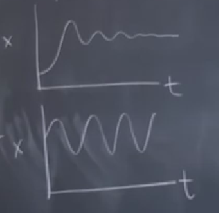

Bazılarının aklına şu soru gelebilir; "ama emin miyim, belki çok akıllıca bir
$f$ uydurursam salınım olabilir?''. Cevap, salınımın olmamasının topolojik
sebepleri var.  Sebep tüm $x(t)$ gidiş yollarının tekdüze (monotonik) şekilde
artıyor ya da azalıyor olması, ya da yerinde kalması. Bu derste teorik
ispatlarla çok uğraşmayacağız demiştim, ama mantıki, sezgisel olarak şunu
söylemek mümkün olabilir; Alttaki resme bakalım,

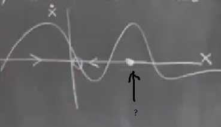

Salınım için ne gerekli? Diyelim ki okla gösterilen noktaya "doğru'' gidiş var,
sonra oradan "geriye'' dönüş var. Fakat bu o noktadaki vektör alanının iyi
tanımlanmamış (not well-defined) olduğu anlamına gelir. İyi tanımlı olmayan bir
şeyi de matematiksel olarak kullanamayız. Çünkü o noktada farklı değerlerin
olması $f(x)$'in "kafasına göre'' aynı $x$ için bir öyle bir böyle değerler
döndürdüğü anlamına gelir, bu da fonksiyon tanımına göre mümkün değildir. Yani
aynı noktadan geçerken iki farklı yöne gidemeyiz.

"Ama bir dakika'' diyebilir bazılarımız, "tek eksen üzerinde bir ileri bir
geri giden harmonik salınım var''. Evet ama bu sistem tek boyutlu değil,
$\dot{x}$ ile değil $\ddot{x}$ ile tanımlı, ve bu türden sistemleri mesela bizim
geometrik yaklaşımla çözmek için iki boyut gerekir, bir eksen $\dot{x}$ için bir
eksen de $\ddot{x}$ için. Bu sistemleri dersin ilerisinde göreceğiz, onlar
ikinci derece sistemler.

Çatallaşma (Bifurcation)

Diyelim ki bir boru üzerine bir kaya parçası koydum. Altta soldaki mesela ufakça
bir kaya,

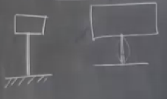

Bu kaya düşmeden yerinde durabilir, çünkü boru ona yeter. Fakat resimde sağda
koca bir koya koyarsam, herhalde çöker. Ya sağa doğru küt diye, ya da sola, ama
bir şekilde her şey aşağı iner. Bu örnek çatallaşma taşıyan sistemler için güzel
bir örnek, sistemin bir parametresi var, dışarıdan uygulanan stress / kayanın
büyüklüğü / ağırlığı mesela, ve bu parametrenin değişimi sonucu dramatik bir
sonuç ortaya çıkıyor.  Daha teknik dille şöyle diyelim: bir parametre değişirken
sistemin vektör alanı çok büyük niteliksel değişimler yaşayabilir. Büyük değişim
derken bir sabit noktanın yer değiştirmesinden bahsetmiyorum, yeni bir sabit
nokta hiç yoktan ortaya çıkabilir, ya da tamamen yokolabilir mesela, ya da
mevcut noktaların stabilitesi bile değişebilir. Bu tür değişimlere çatallaşma
diyoruz.  Çatallaşma değeri ise değişimin olduğu noktadaki parametre değeridir.

Eyer Düğümü Çatallaşması (Saddle Node Bifurcation)

Bu mekanizma yeni sabit noktaların ortaya çıkması veya yokolmasındaki en temel
mekanizmadır. Standart örnek,

$$ \dot{x} = r + x^2 $$

ki $r$ kontrol parametresi, eğer bir fizik deneycisi isem bu $r$ dışarıdan
sistemi kontrol ettiğim bir ayar düğmesi (knob), vs. Çizmek gerekirse, eşitliğin
sağ tarafında bir parabol var, ama bir kesi değeri de var, ki bu kesi $r$. Kesi
negatif olduğunda resim şöyle, 

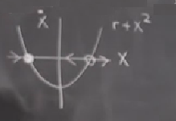

Elimizde iki tane sabit nokta var. Şimdi diyelim ki düğmeyi çeviriyoruz, ve $r$
yavaş yavaş sıfıra doğru çıkartıyoruz. Mesela sıfıra çok yaklaştık diyelim, bu
noktada

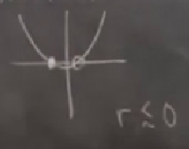

grafiği olurdu, parabol hala benzer şekilde, üste doğru açık, hala x ekseni çok
az altından geçiyor. Eğer düğmeyi çevirirken üstteki grafiklerin değişimini
izleyebilseydik, parabolun yavaş yavaş yukarı çıktığını ve iki sabit noktanın
yavaş yavaş birbirine yaklaştığını görürdük. İnsanın aklına şu soru
geliyor, sabit noktalar acaba birbirine "çarpar mı?''. Çarparsa ne olur?. $r=0$
noktasında bu oluyor, ve sonucu aslında daha önce gördük, bir tarafı stabil
diğer tarafı gayrı stabil olan bir sabit nokta. 

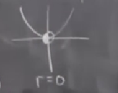

Bu acaipliğin de nereden geldiğini böylece görmüş olduk, demek ki sistemi tam
çatallaşma anında yakalamışız. Stabil ve gayrı stabil noktalar birleşmiş, bu
sebeple bu karma durum ortaya çıkmış. Ve nihayet, $r>0$ durumunda,

Bu resimde hiç stabil nokta yok. İlk başta iki tane vardı, bu noktalar çarpıştı,
ve sanki birbirlerini yok ettiler, geriye hiç bir sabit nokta kalmadı. Tüm
bunları sadece tek bir parametreyi değiştirerek gözlemledik, ve niteliksel bir
değişimi gördük.

Soru

Yarı-stabil sabit noktaların tek ortaya çıkma sebebi çatallaşma mıdır? [iyi soru
çünkü bir sistemin büyük bir değişim yaşayacağını tahmin edebilmek için belki
yarı-stabil noktalara odaklanmak iyi bir fikir].

Cevap

[Hoca şöyle bir düşündü ve] bunu söylemek yanlış olmaz, evet.

Çatallaşma Diyagramı

Çatallaşmaları birkaç figürü arka arkaya çizerek gösterebiliriz, ama tüm bu
değişimi tek bir figürde göstermeye yarayan diyagramlar var, bunlara çatallaşma
diyagramı diyoruz. $x^\ast$ ile $r$ iki eksende olacak şekilde ortaya çıkan
eğrileri çizeriz. Bizim kontrolümüzdeki $r$'dir, onu değiştirirken $x^\ast$'e ne
olduğunu gözlemleriz (ve grafikleriz).

$$ \dot{x}=0 \Rightarrow r + (x^\ast)^2 = 0  $$

$$ x^\ast = \pm \sqrt{-r} $$

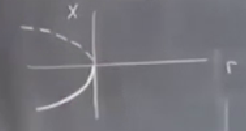

Koyu çizgi stabil noktaları temsil etmek için çizildi, kesikli olan gayrı stabil
için. Niye negatif bölgede olanlar stabil? Daha önceki resimleri hatırlarsak,
çarpışma öncesi mesela, solda (negatifte) olan sabit nokta stabil idi.

Eğer (saddle) sözünün nereden geldiğini niyahet görmüş olduk, şekil sola
yatarılmış bir eğere benziyor. Kimisi bu tür çatallaşmalara "katlanmış'' diyor,
çünkü şekilde sanki bir düz çizgiyi alıp katlamışız sanki, başkaları dönme
noktası diyor, çünkü bir daldan gelirken ötekine "dönüyoruz'', vs. Ben eğer
sözünü kullanacağım.

Bu çok temiz bir örnekti aslında, çatallaşmaları net bir şekilde
görebildik. Sizin ileride karşınıza çıkabilecek problemlerde analiz bu kadar
temiz olmayabilir. O türden bir örneği de görelim.

Örnek

$$ \dot{x} = r + x - \ln(1+x) $$

Bu oldukça okkalı, içinde gayrı lineer bir terim var, $\ln$. Bu sistemi $r$'nin
bir fonksiyonu olarak incelemek istiyoruz. Önce sabit noktaları bulmak
istiyoruz, $\dot{x}$'i sıfıra eşitliyoruz,

$$ r + x^\ast = \ln(1+x^\ast) $$

Ama şimdi başımız dönmeye başladı, eyvah, bunu $r$'nin fonksiyonu olarak nasıl
tekrar düzenleyeceğiz? Aslında problemi dersten önce öyle seçtim ki bunu yapmak
imkansız. Eğer eski analitik türden düşüncede takılıp kalmış olsaydım, şimdi
felç olmuştum, tek adım atamazdım. Fakat biz bu derste grafiksel düşünmeyi
öğrendiğimiz için çözümün aslında basit olduğunu görebiliriz, çünkü üstteki
ifadenin grafiğini çizebilirim.

İki grafik çizerim, biri $y = r + x$ için diğeri $y = \ln(1 + x)$ için. Bu arada
ilk dersin başında taslaksal olarak bir fonksiyonu hızlı bir şekilde
grafikleyebilme becerisine sahip olmak iyi olur demiştim, işte bu beceri burada
devreye giriyor, bu iki fonksiyonu pat diye çizebilmek lazım. Bilgisayarda
çizebilirsiniz onları tabii, fakat bu daha yavaş olurdu. Önce $\ln(1+x)$,

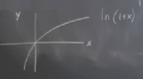

Y eksenine $y$ dedim dikkat $\dot{x}$ değil. Aynı grafiğe şimdi $y = r + x$
çiziyorum,

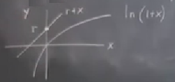

Kesi $r$, eğim 1. Şu anda bu iki eğri birbirini kesmiyor, bu ne demek?
Kesişmiyorlarsa bu iki formül hiçbir $x$ için birbirine eşit değildir demektir,
o zaman $r$ resimde görüldüğü gibi ise hiçbir sabit nokta yoktur demek.

Diğer yanda $r$'yi aşağı indirdikçe üstteki düz çizgi aşağı inmeye başlar, eğimi
hala 1'dir tabii, ama bir noktada düz çizgi eğriyle kesişecek. Alttaki resimde
bu kaydırmayı iki kez yapıyoruz, ilk kaydırma sonrası tek noktada kesişme
olacak, sonraki kaydırma ardından iki noktada.

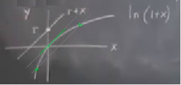

Bu sonuç daha önce işlediğimiz senaryoya benzemiyor mu? İlk başta hiç kök yok,
sonra bir tane var, sonra iki tane. Eğer çatallaşmasının temeli bu
zaten. Geometrik dilde teğetsel kesişme var ise eğer çatallaşması var
diyebiliriz. Bu ne demektir? O kesişme noktasında hem düz çizginin hem de
eğrinin eğimi aynıdır demektir, yani hem

$$ r + x = \ln(1+x) 
\qquad (1) $$

eşitliği doğru, hem de

$$
\frac{d}{dx} (r + x) = \frac{d}{dx} \bigg( \ln (1+x) \bigg)
\qquad (2)
$$

eşitliği doğru olmalı. Türev aldık çünkü türev bize belli bir noktada eğimi
verecek, ki sonra o iki eğimi karşılaştırabilelim. Bu denklemler sayesinde bize
gerekli $r,x$ kombinasyonlarını bulabiliriz. (1) formülünü çözemeyeceğimizi
biliyoruz, fakat (2)'yi çözmek kolay.

$$ 1 = \frac{1}{1+x}  \Rightarrow x^\ast = 0 $$

eğer çatallaşması anında.. Bu sonucu (1)'e sokarsak,

$$ r  - \ln(1)  = 0$$

elde ederiz. Üstteki $r$ sonucuna kritik andaki $r$ diyelim, notasyon olarak
$r_c$. İlginç bir durum, üstteki resmim fena değilmiş demek ki, çünkü o resim de
yaklaşık $r=0$ sonucunu gösteriyor. Sonuç, çatallaşma $(x,r)=(0,0)$ noktasında
ortaya çıkıyor.

Şimdi (0,0) etrafındaki vektör alanını açarsak ne olur? $\dot{x}$ üzerinde ufak
bir Taylor açılımı yaparak bunu görebiliriz belki. Önce hatırlayalım,
$\ln(1+x)$'in McLaurin açılımı

$$ \ln (1+x) = x - \frac{x^2}{2} + \frac{x^3}{3} + ... , \quad |x|<1 \textrm{ için}$$

Şimdi

$$ \dot{x} = r + x - \ln(1+x)$$

$$ \approx r + x - \big[ x - \frac{x^2}{2} + \frac{x^3}{3} + ... \big] $$

$x$'ler iptal olur,

$$ = r + \frac{x^2}{2} + O(x^3) $$

3 ve üstü derecedeki terimler diğerlerine nazaran çok daha küçüktür, onları
atabiliriz. Elde ettiğimiz formüle bakarsak, çatallaşma yakınında elde ettiğimiz
vektör alanı tanıdık aslında. Bölü 2 kısmını dikkate almayalım şimdi, geri kalan
$r + x^2$ formülü eğer noktasında elde ettiğimiz şey idi. Çatallaşmaya yakın
yine bu formülü elde ettik. Bazıları bu $r + x^2$'e bir tür şablon diyor, onu "
normal form'' olarak adlandırıyorlar. Eyer düğümleri etrafında neler olduğunu
inceleyen ciddi araştırmalar, ciddi teoriler var, şimdi burada onlara girmek
istemiyorum ama o bölgedeki dinamik her zaman $r$ artı bir sabit çarpı $x^2$
formunda oluyor.

Transkritik Çatallaşma

Bu tür çatallaşmaların normal formu

$$ \dot{x} = rx - x^2 $$

Bu form daha öncekine kıyasla niceliksel bir fark yaratıyor, eşitliğin sağ
tarafını açarsak,

$$ = x(r-x) $$

İki sabit nokta hemen ortaya çıkar, $x^\ast=0$ her $r$ için sabit noktadır. Öteki
ise $x^\ast = r$. Önceki örnekte sabit noktalar ortaya çıkıyor, yokoluyordu, burada
yokedilemez bir sabit nokta var, $x^\ast=0$, $r$'yi değiştirerek bu arkadaşı
ortadan kaldıramıyoruz.

Doğal bilimlerden örnek düşünmek gerekirse, mesela biyolojik nüfus konusunu
inceliyorsak, belli bir tür organizma bir ekolojide hiç yok ise, o organizmadan
o ekolojide gelecekte de hiç olmayacaktır; sıfır bir sabit noktadır. Neyse,
sabit noktayı yokedemiyoruz ama, onun stabilitesini değiştirmek
mümkün. Transkritik formunda olan tam da bu.

Lineerizasyona bakalım,

$$ f'(x) = \frac{d}{dx} (rx - x^2) = r - 2x, \quad f'(0) = r$$

Bu demektir ki $x^\ast = 0$ noktası eğer $r<0$ ise stabil, $r>0$ ise gayrı
stabildir. Diğer nokta $r$'yi kontrol edelim,

$$ f'(r) = r - 2r = -r $$

İlginç bir sonuç çıktı, bu noktanın $f'$ fonksiyonu diğerinin tam tersi, yani
bir nokta stabil ise diğeri değil, biri gayrı stabil ise diğeri stabil.

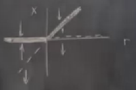

Bazı araştırmacılar bu duruma "stabilitenin değiş tokuşu'' ismini de vermişler,
biz transkritik diyoruz tabii, ama bu isimlendirme de fena değil, grafiğe
bakarsak soldan x eksen üzerinde stabil geliniyor, sonra öteki sol alttan gelen
gayrı stabilite ile "çarpışma'' var, bunun ardından stabilite değiş tokuş
ediliyor. 

Peki $r=0$ noktasında neler oluyor? Bu noktada $\dot{x}=-x^2$, iki sabit
noktanın çarpışması var, fakat birbirlerini yoketmiyorlar. Birbirleri "içinden
geçiyorlar'' sanki, ve o sırada birbirlerini değiştiriyorlar. 

Tırmık Çatallaşması

Simetrili sistemlerde ortaya çıkar. Mesela,

$$ \dot{x} = rx - x^3 $$

Burada $x$ ve $-x$ arasında simetri var. Vektör alanı $\dot{x},x$'e bakalım,
yavaş yavaş ortaya çıkartalım grafiği, eğer $r<0$ ise ve orijinde isem negatif
bir eğim var [önce orijinde sola yatık ufak bir çizgi parçası çiziyor, sonra
oradan geçen daha büyük grafiği çiziyor], 

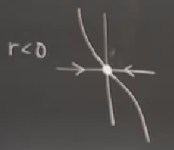

Orijinde tanıdık bildik türden bir sabit stabil nokta var. $r=0$ noktasında da
bir sabit nokta var, fakat, daha önce değindiğimiz gibi, "agresif'' bir
şekilde, yani üstel türden bir stabil nokta değil, ama yine de stabil tabii. 

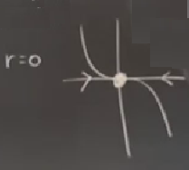

$r>0$ olduğu zaman alttaki ortaya çıkar, 

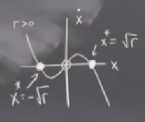

Burada ilginç olan simetrik iki sabit noktanın olması. Faktorize edince de
görebiliriz bunu, $\dot{x}=x(r-x^2)$, ve bunu sıfıra eşitleyince üstteki
noktalar ortaya çıkar. Eğer türünde sıfır düğüm bir düğüm sonra iki düğüm
oluyordu, transkritikte iki düğüm bire, oradan iki düğüme gidiyor, tırmık
türünde ise bir düğüm bir düğüm, sonra üç düğüm oluyor. İlginç. Terminolojide
üstteki örnek süperkritik tırmık (supercritical pitchfork) olarak
biliniyor. Süperkritik kelimesini dinamik sistemlerde çok duyarsınız, anlamı
şudur, çatallaşan çözümler stabildir. Üstte de görülüyor, iki uçtaki çatallaşan
sabit noktaların ikisi de stabil. 

Tırmık kelimesinin sebebi ise şu diyagramda görülüyor,

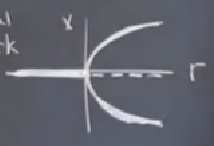

Şekil sağa dönük bir tırmığa benziyor. 

