# Ders 3

Bu derste klasik mekanikten bir problemi inceleyeceğiz; dikey duran bir halka
üzerinde hareket eden bir boncuk var, ve halkanın kendisi dikey bir boru
etrafında dönüyor (yerde döndürülen bozuk para gibi). İncelenen, halkayı ne
kadar hızlı döndürdüğümüzün bir fonksiyonu olarak boncuğun stabilitesi. Ben
ayrıca bu probleme yeni bir kavis ekleyeceğim, boncuk ile halka arasındaki
sürtünme çoğunlukla klasik mekanik derslerinde eklenmez, biz onu da
inceleyeceğiz. 

Dönen Halka Üzerinde Aşırı Sönümlü Boncuk (Overdamped Bead on a Rotating Hoop)

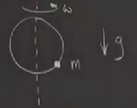

Boru etrafında halkanın dönüşü $\omega$, yerçekimi $g$, ve boncuk kütlesi
$m$. Halka rotasyonu sabit, bir motor var diyelim, sürekli işleyerek bu sabit
hızı sağlıyor. Kordinat sistemi

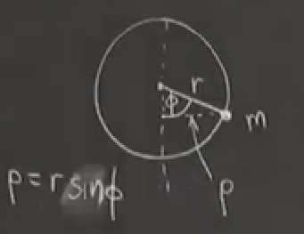

şeklinde olsun, $\phi$ açısı boncuk ile dikey eksen arasındaki açı, halkanın
merkezine uzaklık $r$, ve boncuk ile dikey eksen arasındaki uzaklık $\rho$. 

Şimdi boncuğun hareket denklemini yazmak istiyorum, şu anda çatallaşma konusunu
işliyoruz tabii, amacım görülen parametrelerin bir fonksiyonu olarak
çatallaşmaları anlamak. Ama önce bu sistemi tanımlayan denklemleri
görelim. Kullanacağımız yaklaşım üniversite ilk sene Fizik dersinden, Mekanik
dersinden daha çetrefil metotlar var, mesela Lagrange meotu gibi.

Başlangıç noktası Newton'un kanunu $F=ma$. Fakat bir problem var, arka plan,
çerçeve halkasal, peki bu denklemi dönmekte olan bir boncuğa uygulayacağız?
Çerçeveyi değiştirerek. Öyle bir eksen hayal edeceğiz ki eksen halka ile eşdeğer
ve onunla beraber dönüyor.

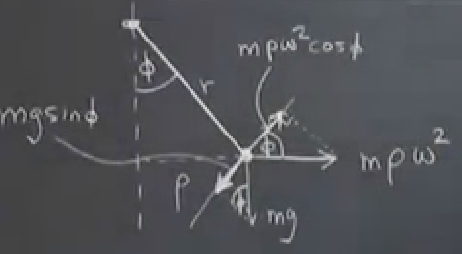

Boncuk üzerine etki eden kuvvetler şunlar: merkezkaç kuvveti $m$ çarpı hızın
karesini dikey eksene olan uzaklığına bölüyoruz, bunu $m\rho\omega^2$ olarak
yazmak daha kolay, bu formülün biraz önce söylediğim ile aynı şey olduğunu
kontrol edebilirsiniz. Sonra aşağı doğru yerçekimi var, $g$. Fakat benim
ilgilendiğim bu kuvvetlerin boncuğa teğet olarak etkileri. Teğet çizgiyi
çiziyoruz, bu teğet üzerine $m\rho\omega^2$'in yansımasını yapıyoruz, bu yansıma
merkezkaç kuvvetinin o çizgi yönündeki bileşeni. Yerçekimi aynı şekilde
yansıtılıyor. 

Bileşenlerin hesabı için tabii ki açıların bilinmesi lazım. Biraz akıl yorunca
merkezkaçın teğet ile oluşturduğu üçgenin açısının $\phi$ olduğunu görebiliriz
(aynı şekilde onun altındaki yerçekim üçgeninin alt açısı da öyle). Yerçekim
kuvvetinin teğet bileşeni $mg\sin\phi$. Bu ifade sarkaç (pendulum) dinamiğinden
tanıdık gelebilir, ve aslında bu sistem de bir anlamda sarkaç olarak
görülebilir, boncuk halkanın merkez noktasından "asılı'' bir şey sanki, ve
oradan sallanıyor. Merkezkaçın da bileşeni var, o da $m\rho\omega^2\cos\phi$. 

Son olarak sürtünmeyi de incelemek istediğimi söylemiştim, onu ekleyelim. Bu eki
iki türlü yapabiliriz, birisi boncuk ile halka arasına sürtünme koymak. Fakat
daha iyi bir düşünce yöntemi tüm mekanizmanın, yani halka, boncuk, herşeyin
ağdalı (viscous) bir sıvı madde içinde olduğunu hayal etmek. Mesela her şey bir
küp bal, ya da motor yağı içinde.. Biraz absürt gelebilir belki, ama düşünce
açısından faydalı. Ağdalı madde hayal etmemin sebebi tabii ki bana bir fayda
sağlayacak olması, bu şekilde sisteme hıza oranlı bir sürtünme eklemem yeterli.

$$ mr\ddot{\phi} = -br\dot{\phi} ... $$

$b$ ağdalık sabiti. $r\dot{\phi}$ ifadesi yer değiştirme hızı (translational
velocity), ve $b$ çarpı o hız sürtünme kuvvetine eşit. Eksi işareti orada çünkü
harekete bir karşı duruş var, parçacık ne kadar hızlı hareket ederse bu karşı
kuvvet o kadar artıyor. Not: kitabımın eski baskılarında formülde $r$ yok, o
olmadan da formül işliyor, $r$ etkisi bir anlamda $b$ sabitinin içine absorbe
ediliyor, ve o durumda halka büyüyüp küçüldükçe bunun $b$ üzerinde etkileri
oluyor. $r$'siz hali bence daha iyi, çünkü böylece $b$ direk sıvıya ait bir
sabit olarak görülebilir. Formüle terimler eklemeye devam edelim,

$$ mr\ddot{\phi} = -br\dot{\phi} - mg\sin\phi + mr\omega^2\sin\phi\cos\phi $$

Son terim merkezkaç terimi.

Soru

$m\rho\omega^2$ ifadesinin nereden geldiğini anlamadım.

Cevap

Fizik'ten hatırlarsak $r$ çapındaki çembersel bir yörüngedeki bir parçacığın
hareketine devam etmesi için $m$ çarpı hızın karesi bölü $r$ oranında bir kuvvet
uygulanması gerekir (çemberden dışa doğru). Peki bizim formülümüzde hız ne, çap
ne? İki üstteki şekildeki yuvarlak aklımızı karıştırmasın, yörünge o değil. O
yuvarlak bizim halka, ve bu halka dikey eksen etrafında dönüyor, yani parcaçığın
dairesel yörüngesi kara tahtanın dışından *içine* doğru. O zaman çapı dönüş
eksenine uzaklık olarak ölçmek gerekir ve o eksen $\rho$'dur. Nihai formül $m$
çarpı hız karesi, yani $(\rho\omega)^2$, bölü $\rho$ eşittir $m\rho\omega^2$.

Derse dönelim; elimizdeki formül gayrı-lineer. $\sin$ var, $\cos$ var, ikinci
türev var.. Şimdiye kadar sadece birinci dereceden sistemler gördük, daha
üstteki türden sistemlere hazır değiliz. Bu yüzden o ikinci türevi yoksaymak
istiyorum, ama şu soru aklımıza gelebilir, ne zaman bu yoksaymak uygundur? Yani
eşitliğin solundaki ivlenme terimi ne zaman, formülün geri kalanına kıyasla,
çok ufaktır ki onu yoksayabilelim? Bunu dersin ilerisinde göstereceğim. Şimdilik
bu terimi atarak yola devam edelim.

$$ br\dot{\phi} = mg\sin\phi \bigg(
\frac{r\omega^2}{g} \cos\phi - 1
\bigg)
$$

Analiz edelim; daha önce ne yapmıştık, sabit noktaları bulmuştuk, ve bu
noktaların stabilitesine odaklanmıştık. Eşitliğin sağının sıfır olması için

$$ \sin\phi^\ast = 0 $$

olmalı, ya da

$$ \cos\phi^\ast = \frac{g}{r\omega^2} \qquad (1)$$


olmalı. Birinci şart için $\sin\phi^\ast = 0$ durumu $\phi$ ya 0, ya da $\pi$ ise
mümkündür. Bu arada tüm açılarımız $-\pi,\pi$ arası olacak, bu sınırın dışına
çıkmaya gerek yok. O zaman $\phi$ sıfır ise demek ki boncuk en altta, eğer $\pi$
işe en üstte. Bunların sabit nokta olduğunu kabaca görmek mümkün; eğer boncuk
tam altta çökmüş duruyorsa, halka ne kadar hızlı dönerse dönsün, boncuk bir
denge durumundadır, bu noktanın stabil olduğu anlamına gelmez illa ki fakat
orada tüm kuvvetler dengededir, ve bu tam alt noktasında ise oradan hareket
etmez. Aynı argüman en tepe nokta $\pi$ için kullanılabilir, ve kabaca düşününce
en üst noktanın stabil olmayacağını hissederiz, ve bu doğru olurdu, o
noktadayken azıcık bir sarsıma uğratmak boncuğu o noktadan aşağı doğru
göndermeye başlardı. 

Stabilite analizinde daha ileri gitmeyeceğim, bunu ödev olarak kendiniz
yapabilirsiniz, lineerizasyon ile, ya da eşitliğin sağının grafiğini
çizerek. Kontrol amaçlı olarak $\phi^\ast = \pi$'in tüm parametre değerleri
$m,g,r,\omega,b$ için gayrı stabil olduğunu kontrol edebilirsiniz.

Biz derste $\cos$'lu stabil noktalara odaklanalım, mesela (1) ifadesine dikkat
edersek, (1)'in her zaman çözümü olmayabilir değil mi? $\cos$ fonksiyonu
matematiksel olarak -1/+1 değerleri arasında kalmaya mecburdur, fakat eşitliğin
sağ tarafının mutlak değeri 1'den daha büyük ise o zaman $\phi^\ast$ çözümünde
hiç kök olmaz. Çözüm sadece ve sadece $g \le r\omega^2$ ise mümkündür. Fiziksel
olarak bunun anlamı halkanın hız için yeterli büyüklükte olması gerektiği. Ya da
hızın halkanın büyüklüğüne göre yeterince fazla olması gerektiği.. Bu problemi
zihinde canlandırırsak, halkayı çok yavaş çeviriyorsak parçacık altta kalmak
isteyecek. Yeterince hızlı, yani $g/r \le \omega$ denkleminden hareketle
$g/r$'yi geçecek kadar hızlı çevirince stabil noktalar görmeye başlayacağız,
boncuk yukarı çıkacak, bu durumda daha farklı çözümler mümkün. Bu çözümlerin ne
olduğuna bakalım şimdi.

(1) formülüne yeni bir "boyutsuz'' parametre eklemek faydalı bu noktada,
$\gamma= \frac{r\omega^2}{g}$. Bu sayının hiçbir birimi yok, cm., kg. km/saniye,
vs. Şimdi $\gamma$ bağlamında düşününce aradığımız çözümler $\cos\phi^\ast =
\frac{1}{\gamma}$ şartına uyanlar olmalı. Şimdi bir resme bakalım. 

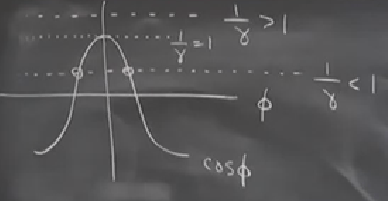

İlk şart $1/\gamma > 1$ bu dururumda hiç kök yok, yani halka çok yavaş
dönüyor. İlginç bir durum $1/\gamma = 1$ olduğu nokta, tam teğet durumu, tek kök
var. Son durumda $1/\gamma < 1$ iki kök var. O zaman $\phi=0,\gamma=1$ noktası
bir çatallaşma noktasıdır, o anda iki tane sabit nokta $\phi^\ast$
çatallaşır. Sabit noktaları halka üzerinde gösterirsek, çok hızla döndürmeye
başlayınca sağda ve solda iki sabit stabil nokta olacaktır ve en üstteki,
alttaki noktalar gayrı stabil olacaktır.

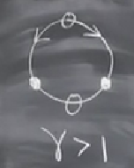

$\gamma$'yi halkanın ne kadar hızlı döndüğü olarak görebiliriz bu arada, çünkü
$\omega$'ya oranlı bir sayı sonuçta. Yine halka üzerinde, ikinci durum, $\gamma <
1$, bu sıkıcı bir durum, halka yeterince hızlı değil,

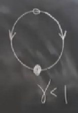

Bu iki resim arasında bir de çatallaşma var tabii, ondan bahsettik. Hangi tür
çatallaşma? Tırmık, çünkü bir simetri var, ve tırmık bu durumda ortaya çıkar. 

$\gamma,\phi$ için bir grafik çizelim şimdi,

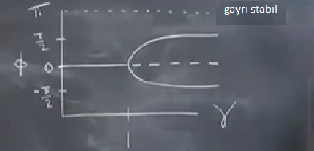

Bunu ispat etmeden veriyorum ama kontrol etmesi kolay, $\phi=\pi$ her zaman bir
gayrı stabil nokta. Bu yüzden bu nokta çatallaşma sürecine hiç etki etmiyor, bu
sürecin dışında, çatallaşma $\phi=0$ etrafında. Ayrıca $-\pi/2,\pi/2$ noktaları
ilginç, bu noktalar halkayı en hızlı çevirdiğimiz an, müthiş hızlı, tıbbi
labaratuarlarda tüpleri çevirdikleri hızda. Bu tür dönüşte ne olacağını kabaca
düşünebiliriz, kendimize soralım, daha hızlı, daha hızlı çevirince boncuklar en
tepeye mi çıkar? Bu olmaz, en fazla en sağ ve en solda kalırlar. İşte
$-\pi/2,\pi/2$ bu durum. 

Şimdi en başta atladığımız konuya gelelim; ikinci türevi, yani $mr\ddot{\phi}$
ifadesini yok saymıştık, bunu yapmanın uygun zamanı nedir?

İlk akla gelen kütle $m$'nin çok az olduğu bir durum, $m \to 0$ limit durumu
düşünülür belki.. Bu doğru ama çok sağlam bir yaklaşım sayılmaz, çünkü eğer $m$
yokoursa,

$$ mr\ddot{\phi} = -br\dot{\phi} + mg\sin\phi \bigg(\gamma \cos\phi - 1 \bigg)
$$

ifadesinde eşitliğin solu yokolur, doğru, fakat eşitliğin sağındaki $m$ içeren o
koca terim de yokolur. Bu fazla esktrem. Diğer bir açıdan $m \to 0$ ifadesinde
de problemler var, çünkü $m$ bir ölçüm, bir ölçüm birimine bağlı (gram,
kilogram, vs gibi), ama sıfır bir sayı sadece, herhangi bir ölçüm birimine bağlı
değil. Bilimde "bir şey küçük'' diyorsanız, bunu aynı ölçüm biriminde olan
başka bir şeye kıyasla belirtmeniz gerekir, yoksa ifade anlamsız olur.

O zaman üsttekini boyutsal olarak uygun şekilde tekrar belirtmemiz gerekir.

Boyutsal Analiz

Bu dersimizde önemli tekniklerden biri, bir problemin değişkenlerini azaltmak
için kullanılabilir, ve çatallaşma teorisine daha yakından bakarken bu çok
işimize yarayacak.

Diyelim ki zaman için bir skala tanımlıyoruz, bu skala $T$ olsun. Bu skalayı
öyle seçiyoruz ki tipik hız, $\dot{\phi} \propto 1/T$ olsun [$\propto$ bir şeye
  "oranlı olmak'' anlamına geliyor], tipik açısal ivme $\ddot{\phi} \propto
1/T^2$. $T$'nin ne olduğunu sonradan seçeceğim. Biraz puslu bir hava yarattım
şimdi, bazılarınızın aklında şu soru var belki de "tamam ama nasıl kullanacağım
bunu?''. Daha temiz ve net bir ifade şöyle olabilir. Yeni bir $\tau$
tanımlayalım, ki bu "boyutsuz zaman'' olsun, ve $\tau = t / T$ olacak şekilde,
öyle ki $\tau$ normal zamana oranlı, birimsiz bir yeni zaman haline gelsin.

Şimdi $\tau$'yu kullanarak ve Calculus'un Zincir Kuralı üzerinden problemimizin
türevlerini tekrar tanımlayabiliriz.

$$ 
\frac{d\phi}{dt} = \frac{d\phi}{d\tau} \frac{d\tau}{dt} 
\qquad (2) 
$$

$\frac{d\tau}{dt}$ için $\tau = t / T$ üzerinde türev alırız, ve üstteki ifade,

$$ = \frac{1}{T} \frac{d\phi}{d\tau} $$

haline gelir. Dikkat edersek, başta istediğim şeyi elde ettim, eşitliğin sol
tarafı $\dot{\phi}$, bu ifade $1/T$'ye çarpı bir şey ($d\phi/d\tau$), $1/T$'ye
oranlı olsun demiştim, üstteki ifade bunu sağladı. Şimdi öyle bir ölçekleme
arıyoruz ki $d\phi/d\tau$ değeri 1 civarı olsun - daha doğrusu $O(1)$. Bunu
yaparak, sistemdeki diğer parametreleri aşırı büyütüp, ya da küçültsem bile,
mesela kütle $m$'nin sıfıra yaklaşması, $T$ ile oynayarak $d\phi/d\tau$'yi
$O(1)$ civarında tutabileceğim.

(2)'nin ikinci türevini de görelim.

$$ \frac{d^2\phi}{dt^2} = \frac{1}{T^2} \frac{d^2\phi}{d\tau^2} $$

Ya da

$$ \ddot{\phi} = \frac{1}{T^2} \phi'' $$

O zaman

$$
\frac{mr}{T^2} \phi'' = -\frac{br}{T} \phi' +
mg\sin\phi \bigg(\gamma \cos\phi - 1 \bigg)
$$

Bu noktada çok fazla değişiklik yaptığım söylenemez, sadece yeni semboller
ekledim, $T$ gibi.. Denklemin ölçüm birimi kuvvet, yani $mg$, $mr$ ki bu $ma$
türünde bir ifade, bunlar hep kuvvet ifadeleri. Şimdi tüm denklemi kuvvet
$mg$'ye bölerek o birimi çıkartalım. Ama ondan önce, niye boyutsuzluk için bu
kadar uğraşıyorum, onu açıklayayım. Boyutsuz bir sistemde bir "ufak olma''nın
anlamı çok daha belirgin hale geliyor, ufaklık 1'e göre ufak olmak
demektir.

Devam edelim, $mg$'ye bölelim,

$$ \bigg[ \frac{r}{g\tau^2} \bigg] \phi'' = \bigg[ \frac{-br}{mgT} \bigg]\phi' +
\underbrace{f(\phi) }_{\sin\phi (\gamma \cos\phi -1 )} $$

$f(\phi)$ ile en sağdaki karışık terimi özetlemiş oldum, onun ne olduğuyla pek
ilgilenmiyorum, bu şekilde göstermek yeterli. 

Evet, böylece her şey boyutsuz hale geldi. Köşeli parantezler içinde sabit olan
terimleri göstermek için böylece neyin ufak neyin olmasının gerektiği, neyin
gerekmediği daha rahat görülecek. Eğer $T$'mi doğru seçersem, $\phi'$ ve
$\phi''$ $O(1)$ haline gelirler, $m \to 0$, ya da ağdalık sonsuzluğa giderken,
vs. $f(\phi)$ aynı şekilde. 

Şimdi $T$'nin kendisinin tanımlayabiliriz. Daha önce söylediğim gibi $m=0$
yapmak, yani küt diye bir değeri vermek çok dramatik / aşırı; $m \to 0$ iken,
boyutsuz denklemde, uygun bir $T$ üzerinden terimlerin denklemden atılması daha
iyi. O zaman, mesela $\frac{br}{mgT}$ ifadesi $O(1)$ olsun, $\frac{r}{gT^2} <<
1$ olsun istiyorsak, $T = \frac{br}{mg}$ seçebiliriz.

O zaman

$$ \frac{r}{gT^2} = \frac{r}{ g \big( \frac{br}{mg} \big)^2 }  =
\frac{r m^2 g^2}{gb^2r^2} = \frac{m^2g}{b^2r}
\qquad (3)
$$

1'den çok daha küçük olmasını istediğim şey eşitliğin en sağındaki. Kriterimizi
elde ettik böylece. Daha önce şu soruyu sormuştum, $m$'in çok küçük olması ne
demektir? Eğer $m=0$ yapmak gibi kaba bir yönteme başvurmak yerine,

$$ \frac{m^2g}{b^2r} << 1 $$

O zaman kriter,

$$ m^2 << b^2r / g  $$

Yani eğer $m^2$ üstteki şekilde küçük ise o zaman ivme / atalet (inertia)
denklemden atılabilir. Kritere değişik bir bakış açısı ağdalığın, $b$'nin çok
büyük olduğu durum, ki bu durumda normal bir $m$ bile o büyüklüğe göre küçük
kalır. Bu sıvı dinamiğinde çok iyi bilinen bir durum, eğer ağdalık yüksek ise
ivme faktörü sönüm faktörüne göre çok küçük kalacağı için yok sayılabilir.

Bir nüans daha: (3)'ün en sağındaki ifadeye $\epsilon = \frac{m^2g}{b^2r}$
diyelim. $\epsilon \to 0$ iken en yüksek dereceli türevi kaybediyoruz. Fakat bu
bir problem olabilir, çünkü ikinci türevi barındıran bir diferansiyel denklemin
iki başlangıç noktası vardır, başlangıç pozisyonu, başlangıç hızı. Fakat ikinci
türev yokolunca, hala elimde iki başlangıç noktası var, fakat artık tek dereceli
bir türev var. Bu sebeple elde edeceğim çözüm bu iki şartı tatmin
edemez. $\epsilon << 1$ olsa bile yaklaşımımız $t=0$ hemen ardından yanlıştır,
fakat bu ufak geçiş anı sonrasında yaptığımız herşey doğru hale gelir. Ne demek
istediğimi açıklayayım.

Başlangıçtaki geçiş anının farklı bir zaman ölçeğine ihtiyaçı var. Bizim $T$
seçimimiz ilk başta yanlış, ama ardından doğru. İki zaman ölçekli problemleri
duymuş olabilirsiniz, bu problemde o durum var işte.

Denklemin hiç yaklaşıksallık içermeyen hali,

$$ \epsilon \phi'' + \phi = f(\phi) $$

idi. Bu sistemi hicbir terim atmadan normal sekilde analiz etmenin yolu yeni bir
değişken eklemek, $\Omega = \phi'$. O zaman $\Omega' = \phi''$. 

$$ \Omega' = \phi'' = \frac{1}{\epsilon} [ f(\phi) - \Omega ] $$

Sistemin son hali,

$$ \phi' = \Omega $$

$$ 
\Omega'  = \frac{1}{\epsilon} \big( f(\phi) - \Omega \big) 
\qquad (4)
$$

Bu bir vektör alanı oluşturdu, her $\phi,\Omega$ kombinasyonu için bir
$\phi',\Omega'$ var, bu bir vektör alanı oluşturur. Bu vektör alanının neye
benzediğini düşünelim şimdi; en önemli nokta $\Omega$'nin $f(\phi)$'ye eşit
olduğu nokta. Orada bir eğri olacak, hatırlarsak $f(\phi)$ içinde $\cos,\sin$ vs
ifadeleri var, ama eğrinin tam neye benzediği önemli değil. 

$\Omega = f(\phi)$ eğrisi şuna benzer,

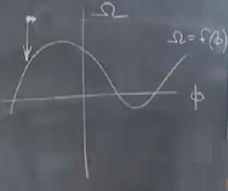

Bu eğri niye önemli? $\Omega = f(\phi)$ aynı zamanda $f(\phi) = \phi'$ demektir,
ve bu bizim baştan beri analiz ettiğimiz tek boyutlu sistemimiz. Eğer ikinci
dereceden problemin hızlı bir şekilde üstteki eğriye geçtiğini gösterebilirsek,
geçiş anı ardından doğru sisteme baktığımızı da gösterebilmiş oluruz.

Bunu göstermek aslında o kadar zor değil; tipik bir noktayı alırız, resimdeki
gibi. Zihinde fiziksel bir resim canlandırmak için, düşündüğümüz durum halka,
boncuk ve bal (ağdalı sıvı bal diyelim) durumu, bizim ilk başta yaptığımız acaip
bir şey aslında, boncuğu hızla bala sokmuşuz. Fakat sıvı bal, çok yoğun, ve
başlangıç hızı hemen sönecek. 

Resime dönersek, nokta sol üst köşede görülüyor, hızın $\phi'$ bileşeni resimde
sağa doğru giden ok olsun. Ufak bir ok, ama sebebi aslında alt doğru giden okun
çok büyük olması, o büyüklüğe göre yatay olan küçük gözüküyor. Niye dikey olan
çok büyük? Onun için (4)'e tekrar bakalım, resme göre nokta, $\Omega$,
$f(\phi)$'nin üzerinde. Bu (4)'te parantez içi artı demektir. O ifade müthiş
büyük bir sayıyla çarpılıyor, çünkü $\epsilon$ çok küçük, 1 bölü çok küçük sayı
çok büyük sayı demektir. Yani görülen nokta başlangıcın anından şimşek gibi
aşağı inecek, ve eğriye gelecek. 

Baslangıçtan kastettiğim buydu işte. 

Grafikleme Örneği

[1, 2.8.1]'deki sistemi grafikleyelim,

$$ \dot{x} = x(1-x)$$ 

```python
import numpy as np
import matplotlib.pyplot as plt
from scipy.integrate import odeint

x,y = np.meshgrid( np.linspace(0,5,20),np.linspace(0,5,20) )
f = lambda x : [x[0], x[1]*(1- x[1])]
U,V = f([x,y])

plt.streamplot(x,y,U,V, color='r',linewidth=.5)
plt.title('Phase and Trajectory plot')
plt.xlabel('x')
plt.ylabel('xdot')

def odef(vect,t):
    x =vect
    return x*(1-x)

number_of_points = 200
t = np.linspace(0,5,number_of_points)
y0 = [.2,1,5]#[(0,2.5),(2,1),(3,1.2)]
N = len(y0)
tt = odeint(odef,y0,t)

plt.plot(t, tt[:,0],'g', lw=1)
plt.plot(t, tt[:,1],'b',lw=1)
plt.plot(t, tt[:,2],'k',lw=1)

plt.savefig('03_16.png')
```


Ödev

Tüm ödev soruları [1]'den. Alttaki denklemleri grafiksel olarak
inceleyin. Çizgi üzerinde vektör alanını taslaksal olarak çizin, tüm sabit
noktaları bulun, stabilitesini gösterin, $x(t)$ grafiğini farklı başlangıç
noktalarına göre yine taslaksal çizin. Sonra bir süre denklemi analitik çözmeye
uğraşın, ama çok uğraşmayın (!), eğer takılırsanız bilin ki bazı problemlerin
analitik çözümü yok.

Soru 2.2.3

$$ \dot{x} = x - x^3 $$

Cevap

$$
\int \mathrm{d} t = \int \frac{1}{x(1-x^2)} \mathrm{d} x =
\int \frac{1}{x} \mathrm{d} x +
\frac{1}{2} \int \frac{1}{1-x} \mathrm{d} x -
\frac{1}{2} \int \frac{1}{1+x} \mathrm{d} nx
$$

$$ x = \pm \frac{Ce^t}{\sqrt{1 + C^2e^{2t}} } $$

$$ C(t=0) = \frac{x}{\sqrt{1-x^2}} $$

Üç tane sabit nokta var, $x^\ast_{1,3} = \pm 1$ (stabil), $x^\ast_2 = 0$ (gayrı
stabil). 

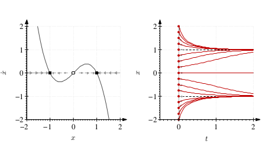

Soru 2.2.4

$$ \dot{x} = e^{-x}\sin(x) $$

Cevap

Analitik çözüm mümkün değil. Stabil sabit noktalar $x^\ast_s = (2k-1)\pi$, $\forall
k \in \mathbb{N}$, ve gayrı stabil noktalar $x^\ast_u = 2k\pi$, $\forall k \in
\mathbb{N}$.

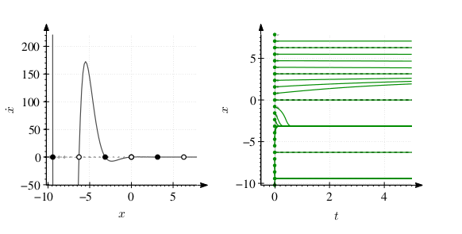

Solda: denklemin faz uzayı (phase space), sağda $x(t)$'nin sayısal olarak
çözülmüş zamana bağlı değişimi, başlangıç değerleri $x(0) =
-\frac{13}{4}:\frac{\pi}{4}:\frac{9}{4}\pi$ için. İki nokta üst üste
notasyonunda, ilk iki değer baş ve son değerler arasının üçüncü değerdeki adımlara
bölünmesinden çıkacak sayı dizisini kasteder, mesela 0:10:2 diyorsam 0,2,4,..,10
sayı dizisini kasediyorumdur. 

Soru 2.2.5

$$\dot{x} = 1 + \frac{1}{2} \cos(x)$$

Cevap

$\dot{x} = a + b \cos(x)$ formunda olan sistemlerin çözümü için birkaç numara
lazım. İlk önce $s = \tan\big(\frac{x}{2}\big)$ diyoruz, ve

$$ \cos(x) = \frac{1-s^2}{1+s^2}, \qquad dx = \frac{2}{1+s^2}ds $$

elde ediyoruz. Bunu geri ana denkleme sokunca ve entegre edince,

$$ \int \mathrm{d} t = t + C = \int \frac{1}{a+b\cos(x)} \mathrm{d} x =
\int \frac{1}{a + b \frac{1-s^2}{1+s^2}} \cdot \frac{2}{1+s^2} \mathrm{d} s
$$

$$ =
\frac{2}{\sqrt{a^2-b^2}} \arctan
\bigg( \frac{\sqrt{a-b}}{\sqrt{a+b}} \tan \bigg( \frac{x}{2} \bigg) \bigg)
$$

Bu forma ulaştıktan sonra birazdan görülecek entegrallerin analitik çözümlerini
göstermek basit. Fakat $\arctan(\psi)$'nin tanımı itibariyle analitik çözümler
$-\frac{\pi}{s} \le \psi \le \frac{\pi}{2}$'ye arasında olmaz zorunda.

Şimdi $\dot{x} = 1 + \frac{1}{2} \cos(x)$'e bakabiliriz. Üstteki formu
kullanarak,

$$ x = 2 \arctan \bigg(
\sqrt{3} \tan \bigg( \frac{\sqrt{3}}{4} (t + C)
\bigg) \bigg) 
$$

$$
C(t=0) = \frac{4}{\sqrt{3}} \arctan
\bigg( \frac{1}{\sqrt{3}} \tan \bigg( \frac{x}{2} \bigg) \bigg) 
$$

Faz portresini (ya da formülü) inceleyince hiçbir sabit nokta olmadığını
görüyoruz. 

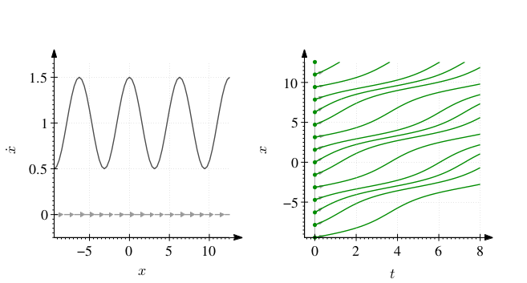

Sağda $x(t)$ çözümü, başlangıç değerleri $x(0) = -3\pi : \pi/2 : 4\pi$ olmak
üzere.

Soru 2.2.6

$$ \dot{x} = 1 - 2\cos(x) $$

Cevap

Üstteki formu kullanalım,

$$
x = 2 \arctan \bigg(
\frac{i}{\sqrt{3}}\tan \bigg( \frac{\sqrt{3}i}{2} (t + C)\bigg)
\bigg)
$$

$$
C(t=0) = \frac{2}{\sqrt{3}i} \arctan
\bigg( \frac{\sqrt{3}}{i} \tan \bigg( \frac{x}{2}\bigg) \bigg)
$$

Stabil sabit noktalar $x^\ast_s = 2k\pi - \arccos (\frac{1}{2})$,
$\forall k \in \mathbb{N}$, ve gayrı stabil sabit noktalar
$x^\ast_u = 2k\pi +\arccos(\frac{1}{2})$ $\forall k \in \mathbb{N}$. 

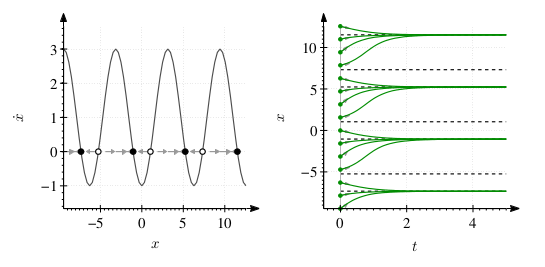

Sağda $x(t)$ çözümü, başlangıç değerleri $x(0) = -3\pi : \pi/2 : 4\pi$ olmak
üzere.

Soru 2.2.7

$$
\dot{x} = e^x - \cos x
$$

Cevap

Hiçbir analitik çözüm yok. Sıfır noktasında bir gayrı stabil sabit nokta var,
$x>0$ için hiçbir sabit nokta yok. Kordinat düzleminin sol tarafında stabil ve
gayrı stabil noktalar arasındaki mesafe $x \to \infty$ iken $\pi$'ye
yaklaşıyor.

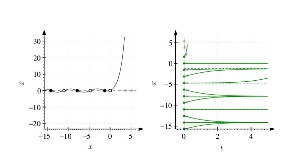

Üstte sağda $x(t)$ görülüyor, başlangıç değerleri $x(0) = 5\pi : \pi/2 : \pi/2$

Soru 2.3.1

Lojistik denklemi $\dot{N} = rN (1-N/K)$ analitik olarak herhangi bir başlangıç
noktası $N_0$ için çözmenini iki yolu vardır. a) Değişkenleri ayır, kısmi
kesirler (partial fractions) kullanarak entegre et b) Değişken değişimi $x=1/N$
yap, ve elde edilen yeni diferansiyel denklemi $x$ üzerinden çöz.

Cevap

a)

$$
\int \frac{\mathrm{d} N}{rN(1-N/K)} = t + C \Rightarrow
\frac{1}{r} \ln \frac{N}{N-K} = t + C
$$

Başlangıç şartlarını sokunca $c = \frac{1}{r} \ln \frac{N_0}{N_0 - k}$ elde
ederiz, ardından

$$
\frac{1}{r} \ln \frac{N}{N-K} = t + \frac{1}{r} \ln \frac{N_0}{N_0 - K} \Rightarrow
\frac{N}{N-K} = \frac{N_0}{N_0 - K} e^{rt} 
$$

$$
\Rightarrow
N = \frac{N_0}{N_0 - K} e^{rt} N - K \frac{N_0}{N_0 - K}e^{rt} \Rightarrow
N = \frac{-K \frac{N_0}{N_0-K} e^{rt}}{1 - \frac{N_0}{N_0-}e^{rt}} =
\frac{-K N_0 e^{rt}}{N_0 - K - N_0e^{rt}}
$$

b)

Eğer $x=1/N$ dersek,

$$ \dot{x} = N^2/\dot{N} = -\frac{1}{N^2}N\bigg( 1 - \frac{N}{K} \bigg) = $$

$$
-\frac{1}{N} \bigg( 1 - \frac{N}{K} \bigg) = -x \bigg( 1 - \frac{1}{Kx}\bigg) =
-x + \frac{1}{K}; x(0) = 1/N_0
$$

$$
\int \frac{\mathrm{d} x}{-x + 1/K} = t + C \Rightarrow
-\ln \bigg( -x + \frac{1}{K}\bigg) = t + C
$$ 

$$
\Rightarrow -x + \frac{1}{K} = \alpha e^{-t} \Rightarrow
x = \beta e^{-t} +\frac{1}{K}
$$

Başlangıç şartını sokunca,

$$
x = \bigg( \frac{1}{N_0} - \frac{1}{K} \bigg) e^{-t} + \frac{1}{K}
$$

Soru 2.3.3

Kanserojen tümörlerin büyümesi Gompertz kanunu ile modellenebilir, bu model
$\dot{N} = -a N \ln bN$ olarak tanımlanır, $N(t)$ bir tümördeki hücre sayısına
oranlı bir sayıdır, $a,b$ dış parametrelerdir. a) $a,b$ sayılarını biyolojik
olarak yorumlayın. b) Vektör alanını taslaksal olarak çizin ve $N(t)$'yi farklı
başlangıç değerlerine göre grafikleyin.

Cevap

a)

Sabitlenmiş $b,N$ üzerinden daha büyük $a$ değerleri daha büyük $\dot{N}$ mutlak
değeri anlamına gelir. O zaman $a$ parametresi bir başlangıç $N$ sabit bir $b$
için bir nüfusun ne kadar hızla büyüdüğünü kontrol ediyor denebilir. $N > 1/b$
ise $\ln bN>0$ o zaman $\dot{N} < 0$. Eger $N<1/b$ ise $\ln bN < 0$, o zaman
$\dot{N}>0$. $N=1/b$ olduğu zaman $\ln bN = 0$ yani $\dot{N}=0$.

Buradan şu sonuca varırız, $1/b$ stabil bir sabit noktadır, ve aynı zamanda
$t \to \infty$ için, yani eğer hasta sonsuza kadar yaşayabilirse, tümörün
eriştiği büyüklük bu olacaktır.

b)

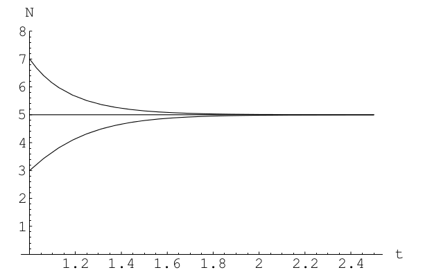

Soru 2.4.9

İstatistiki mekanikte "kritik yavaşlama'' ikinci derece faz değişiminin
habercisidir. Bu geçiş anında sistem denge noktasına normale göre çok daha yavaş
oturur. Bu etkinin matematiksel versiyonu şu şekilde gösterilebilir:

a) Herhangi bir başlangıç için $\dot{x} = -x^3$'nin analitik çözümünü bul. $t
\to \infty$ iken $x(t) \to 0$ olduğunu, fakat çürümenin üstel olmadığını
göster. Çürümenin cebirsel fonksiyon $t$'den çok daha yavaş olduğunu bulmanız
lazım.

b) Çürümenin yavaşlığını zihinde canlandırabilmek için $x_0=10$ ve $0 \le t \le
10$ için çözümün sayısal olarak doğru grafiklerini çizin. Ardından, aynı grafik
üzerinde, $\dot{x}=-x$'in çözümünü aynı başlangıç şartlarına göre çizin. 

Cevap

a)

$$
\dot{x} = -x^3 \Rightarrow \int x^{-3} \mathrm{d} x = -t + C_1 \Rightarrow
-\frac{1}{2}x^{-2} = -t + C_1 \Rightarrow 2x^2 = \frac{1}{t + C_2} \Rightarrow
x^2 = \frac{1}{2t + C_3}
$$

$$ \Rightarrow x = \pm \sqrt{\frac{1}{2t + C_3}} \to 0,
t \to \infty \textrm{ iken }$$

Yani sonuç herhangi bir başlangıç şartı için sıfıra yaklaşıyor fakat çürüme
$\frac{1}{\sqrt{t}}$'ye oranlı, üstel değil.

b)

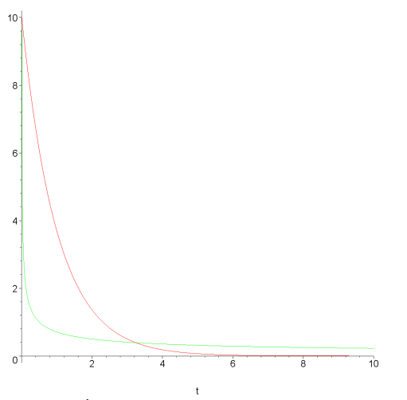

Yeşil çizgi $\dot{x} = -x^3$'un çözümü. 


Kaynaklar

[1] Strogatz, *Non-linear Dynamics and Chaos*


