# Ders 4

Sinek Nüfus Patlaması (Insect Outbreak)

Bu çatallaşma içeren modelin 2 parametresi olacak, ilginç bir özelliği ise
sistemin "zıplamalar'' içerecek olması; yani dışarıdan değiştirdiğimiz
parametre sürekli, ama ona cevaben sistemin davranışı bazen sürekli olmayan
şekilde, kesintiler içeren türden, yani değer değişiklikleri "zıplamalar''
içeriyor olacak.

Baz alacağımız bilimsel makale [1], makalede işlenen organizma bir tür kurtçuk
(spruce budworms). Bu tür kurtçuklar Kanada'da görülüyor en çok, özellikle
ormanda çalışan odun üreticileri için bir kabus, eğer bu kurtçuk bir yerde
patlama yapmışsa, bir ormanı tamamen yokedebiliyorlar. Ağaç yapraklarını
yiyorlar, ve o kadar çok yiyorlar ki (4 sene içinde tüm ormanı bitirebilirler)
ormanın gelişmesi sekteye uğruyor. Ormanın tekrar eski haline gelmesi on seneler
alıyor.

Bu felaket anlaşıldığı üzere rutin olarak olan bir şey, belki 10-20 sene kurtçuk
ortaya çıkmıyor, fakat birdenbire çıkıp çok hasar yaratıyorlar. Pek çok kişi bu
durumu nasıl idare edeceklerini düşünmeye başlamışlar, acaba ilaç mı kullansak,
ne kadar, ne zaman, kurtçuklar nasıl, ne zaman gelişiyor? Bu soruları [1]
cevaplamaya uğraşmış. Çok basit bir modelle ise başlamışlar. Tek bir değişken
var, $N(t)$ kurtçuk nüfusu, ve lojistik modeli üzerinden,

$$ \dot{N} = RN \big(1-\frac{N}{K}\big)  $$

Lojistik modelinde nüfus kendisiyle yarışır - kurtçuklar yaprakları yemek için
kendileri ile yarış halindeler, $K$ taşıma kapasitesi. Diğer yandan bu modelde
bir avcı faktörü var, onlar kuşlar. Kuşlar kurtçuk yiyorlar, ve nüfusu
eksiltiyorlar, o zaman avcılık (predation) için bir $p$ ekliyoruz,

$$ \dot{N} = RN \big(1-\frac{N}{K}\big) - p(N) $$

Biyologlar $p(N)$'i şu şekilde tarif ediyorlar, $p(N)$ basit bir fonksiyon
değil, yani daha fazla kurtçuk onların daha hızlı ölmesi (yenmesi) anlamına
gelmeyecek. Gözlemlerden anlaşılıyor ki kuşlar bu konuda ilginç davranışlar
sergiliyor, $p(N)$ gayrı lineer bir fonksiyon. Araştırmalara göre bu fonksiyon,

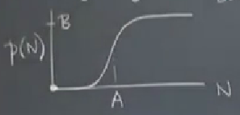

şeklinde. Çok ufak başlıyor, bu şekilde bir süre gidiyor, sonra birdenbire, bir
tipik sayı, $A$ diyelim, sonrası sert bir değişim gösteriyor. Bu bir doygunluk
noktası $B$'ye gelinceye kadar devam ediyor. Bunun niye böyle olduğu hakkında
biraz daha çetrefil bir hikaye oluşturabiliriz; ilk başta çok az kurtçuk var,
kuşlar onları görmüyor bile, bir anlamda kurtçuklar "radarın altında''
yaşıyorlar. Fakat bir kritik eşik sonrası kuşlar kurtçukları farkediyor, ve
onları avlamaya başlıyor. Belki de kuşların hassas olduğu / baktıkları şey bir
yaprak üzerindeki kurtçuk yoğunluğu. Yeterince yoğunluk varsa, kuşlar yaprağa
iniş yapıp kurtçukları yemeye başlıyor. Tabii bir süre sonra kuşlar artık
yiyebilecekleri kadar hızlı yiyorlar, bundan fazlası mümkün değil, mesela 1
milyon kurtçuk sonrası 2 milyon olabilir, ama onları daha hızlı tüketmek mümkün
değil. Bu noktaya da $B$'de ulaşılıyor.

Cebirsel olarak

$$ p(N) = \frac{BN^2}{A^2 + N^2} $$

Soru

Peki kuşların nüfusu avcılıkta önemli değil mi?

Cevap

Tabii bazı faktörleri model dışında bırakıyoruz, kuşların nüfusu bunlardan
biri. Ormanın da dinamikleri var, ağaç azaldıkça mesela farklı şeyler olabilir,
bu tür faktörleri dışarıda bıraktık. Zaman dilimi burada önemli, üstteki modeli
belki de birkaç hafta içinde olanlar üzerinden düşünmek daha uygun, orman,
kuşların nüfus dinamikleri çok daha uzun vadeli değişimler. Daha çetrefil, daha
uzun vadeli modeller bu ek parametreleri de gözönüne alabilir muhakkak. Ama
üstteki modelin de parametre uzayı oldukça geniş / zengin, $R,K,A,B$. 

Dört parametremiz var, hepsi birimli, yani boyutsuz değiller. Önceki dersten
hatırlarsak modeli boyutsuzlaştırmak, birimi olan parametrelerden kurtulmak
belli bir rahatlık sağlıyordu, cebir kolaylaşıyordu, ayrıca modelin özüne inmek
te bu şekilde mümkün oluyordu.

Sormak istediğimiz soru şu, belli parametreler çerçevesinde dinamik neye benzer?
$R$ büyüyünce kurtçukların büyüme oranı hızlanır mı? $K$ yukarı ya da aşağı
inince ne olur? Fakat öyle ki bu tüm dört parametrenin sağladığı tüm
olasılıklara bakmaya gerek yok. Önemli olan sadece belli kombinasyonlar. Bu
sonucu da boyutsuzlaştırmadan elde edeceğiz. Geniş parametre uzayı olunca bunu
otomatik olarak düşünmek iyi olur.

Taktiksel bağlamda boyutsuzlaştırma birkaç değişik şekilde yapılabilir,
bunlardan bazılarının analizi diğerlerine göre daha rahattır. Mesela $N$ var,
birimi kurtçuk sayısı. İki karakteristik nüfus parametresi var, biri ormanın
kurtçuk taşıma kapasitesi $K$, diğeri $A$ ki bu nokta sonrası avcılık hızla
artıyor. $N$'i $A$ ile mi bölsek, yoksa $K$ ile mi? İkisi de mantıklı olurdu. 

Şimdi $N$'in ölçeğini yarı tahminsel (heuristic) olarak seçelim. Öyle seçelim ki
gayrı lineer $p(N)$'in hiç parametresi olmasın. Bunun için $x = N / A$
tanımlayalım, ve herşeyi $x$ bazlı olacak şekilde değiştirelim.

$$ N = Ax $$

$$ \dot{N} = A \dot{x}$$

$$
A \frac{dx}{dt} = R A x \big(1 - \frac{Ax}{K} \big) -
\frac{BA^2x^2}{A^2(1+x^2)}
$$

Şimdi, demiştik ki eksiden sonra gelen nüfustan eksilten gayrı lineer "avcılık
teriminin'' hiç parametresi olmasın. Sebebinin birazdan anlayacağız. İlk önce
$A^2$'ler iptal oluyor. Sonra herşeyi $B$'ye bölebiliriz.

$$
\frac{A}{B}\frac{dx}{dt} = \frac{RAx}{B} \bigg( 1 - \frac{A}{K}x \bigg) -
\frac{x^2}{1+x^2}
$$

Bu birimsiz bir denklem artık, değil mi? Tabii $x$ birimsiz, onun bağlı olduğu
$t$ var, ve onun birimi hala var, gün, hafta, vs. Eğer birimsiz zaman elde etmek
isteseydik, onu nasıl yapacağımızı görüyoruz,

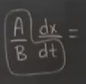

Üstteki formülün sol kısmı bu, ve birimsiz zaman 

$$ \tau = \frac{Bt}{A} $$

olur. Bu arada birimsiz bir grup daha var, mesela $A/K$. Tüm bu seçimleri
yaptıktan sonra, bakalım sistemimiz neye benzeyecek, birimsiz zamana göre olan
türevi temsil etmek için $\dot{x}$ yerine $x'$, $A/K$ yerine $1/k$ , $RA/B$
yerine $r$ kullanalım, son ikisi birimsiz büyüme hızı, birimsiz taşıma
kapasitesi olacak. Tanıdık sembolleri kullanmaya uğraşıyorum, bu problem
üzerinde düşünmemi kolaylaştırıyor, lojistik modelde $K,R$ görmeye alışığım,
onların küçük harfli halini kullanmak uygun olur.

$$ x' = rx \bigg( 1 - \frac{x}{k}\bigg) - \frac{x^2}{1+x^2} $$

Evet, daha önce reklamını yaptığımız gibi 4 parametre gitti, 2 parametre
kaldı. Bir şekilde dört parametreyi iki tane içine kattık, böylece geriye en öz
parametreler kaldı. 

Birimsizleştirmeyi anlamak için şu örneği de aklımızda tutalım; Holywood
filmlerinde mesela dalgalar içinde sallanan bir gemi görüyor olabiliriz, ama o
sahne çoğunlukla ufak maket modellerle bir stüdyoda çekilmiştir, eğer herşey
düzgün şekilde ölçeklenirse bu ufak modelin büyük modelden orantısal olarak
hiçbir farkı yoktur. Burada yaptığımız bir anlamda budur.

Dikkat edersek son eriştiğimiz model tek boyutlu tek çizgi üzerinde akış
(flow) artık. $x^\ast=0$ olunca $x'=0$. Bu bariz bir sabit nokta, başta hiç kurtçuk
yoksa ondan sonra da hiç yok. Bir diğeri için iki tarafı $x$ ile bölüyoruz,
%
$$ r \bigg(1-\frac{x}{k}\bigg) = \frac{x}{1+x^2} $$

Bu denkleme bir süre odaklanmak istiyorum şimdi; bu denklem ölçeklemeyi
niye yaptığımızı sergileyen güzel bir örnek. Niye parametreleri avcılık
teriminden çıkarttım ve lojistik terim içine kattım? İşte yapmamın sebebi
yukarıda görülüyor, parantez içindeki gayet rahat anlaşılan bir ifade, bir düz
çizgi formülü. $r,k$'yi değiştirdikçe bu değişim bir düz çizginin kesisine, ya da
eğimine yansıyacak. Ama parametreler eşitliğin sağ tarafındaki gayrı lineer
kısımda olsaydı, bu ayarlamaları gözlemek daha zor olacaktı. 

Analiz edelim. Bu arada niye direk çözmüyorum bu denklemi, eşitliğin sağının
bölenindeki ifadeyle iki tarafı çarpsam bir $x$ bazında küpsel denklem elde
ederdim. O denklemi bir bilgisayar yazılımına girebilirdim, üç tane kökü elde
ederdim, ama sonra kendi kafamı bir güzel karıştırmış olurdum, çünkü küpsel
formül arap saçı gibi karmakarışık bir şey olurdu. Ne dediğini anlamak çok zor
olacaktı. Bu doğru bir düşünce şekli değil. Biz grafiksel yaklaşacağız.

Denklemin sağ kısmını düşünürsek, ufak $x$ için $x$ gibi gider, büyük $x$ için
$1/x$ gibi davranmaya başlar, iki yandan

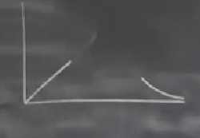

Birleştirelim, ve çizgiyi çizelim, 

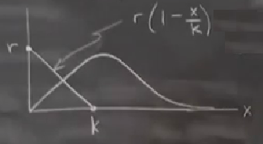

Grafiksel şekilde yaklaşmanın esas ödülünü $r,k$'yi değiştirmeye başladığımızda
elde ederiz. Eğer küpsel denklemi çözmeye uğraşsak üç tane sıfır da elde
edebilirdik, ama şu anda sadece bir sıfır var. Üç tane kök demiştik, $r,k$
değişimi üzerinden farklı bir resim ile üç kök $a,b,c$ elde edebiliriz,

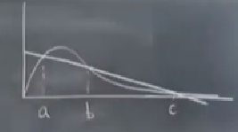

Kurtçuk sayısı bağlamında $a$ civarı az var, orta seviye $b$, $c$ seviyesinde
artık patlama yaşanıyor, bu kurtçuk istilası. 

Pek çok $r,k$ kombinasyonunu düşünmek için şu resme bakalım,

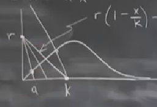

$r,k$ ne olursa olsun mutlaka bir kök oluyor (çizgi eğriyi bir yerde muhakkak
kesiyor). İki üstteki resimde çok büyük $k$ olunca üç tane kök elde
edebiliyoruz. Anlamak istediğimiz bu geçişler, tek kökten üç'e nasıl gidildiği. 

Şimdi büyük $k$ değerleri için ne olduğuna bakalım. Üstteki resmi tekrar
çizelim,

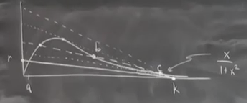

Eğer küçük $r$ sonucu eğimi az olan bir çizgi varsa, tek bir kesişim noktası
var. Şimdi diyelim ki sistemin bir düğmesi, kontrolü üzerinden $r$'yi yavaş
yavaş arttırıyorum. Bir noktada çizgi eğriye teğet hale gelecek. O kesişmeye
kadar $r$'de niceliksel değişim var ama niteliksel bir değişim yok. İlginç bir
şey olmuyor. İlk ilginç niteliksel durum teğetlik anı.

Ve daha önceki derslerden öğrendiğimiz gibi bu teğet anları bir çatallaşmanın
oluştuğuna dair bir işaret. Çizgiyi biraz daha arttırınca iki tane kesişim
noktası ortaya çıkıyor, sanki $b,c$ birbirinden ayrılıp iki ayrı nokta haline
geliyorlar. O noktada eğri çatallaşması var. İki kesişimden sonraki ilginçlik
tek nokta kesişimi, orada da eğer çatallaşması var. Daha da üste çıkınca artık
eğri kesişimi yok, sadece $c$ var. Kritik olaylar aslında $b$'de oluyor
denebilir; o nokta eğer çatallaşması bağlamında ya $a$ ya da $c$ ile çarpışıyor
/ birleşiyor.

Bu oldukça çetrefil bir olaylar zinciri; özet olarak göstermek için $r,k$
diyagramı faydalı olabilir. Bu diyagramda nerede bir, nerede iki, üç kök
olduğunu gösterebiliriz. 

İki eğri bir noktada birleşiyorlar, bu noktada eğriler kesişiyorlar, hatta
teğetsel olarak kesişiyorlar. Resimde gösterilen bölgede üç tane sabit nokta
var. Bunu derken $x^\ast=0$'da her zaman olan bariz / basit sabit noktadan
bahsetmiyorum, bariz olmayan ve iki üstteki resimde yaptığımız değişimlerden
elde edeceğimiz üç noktada bahsediyorum. Eğriler üzerinde ise sabit noktalar iki
tane.

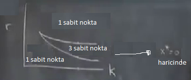

Sabit noktaların stabilitesine bakalım şimdi; daha önce sorduğumuz sorunun
cevabını da arıyoruz ayrıca, $c$ noktasının istila noktası olduğunu nasıl
anlayacağım? 

Diyelim ki elimizde 3 sabit nokta olduğu haldeyiz ($x^\ast=0$ haricinde), ve
kurtçukların artış oranı boyutsuz değişken $x'$'e bakıyoruz, ve bildiğimiz
grafiğimizi çizecegiz birazdan. Ama önceki ifadeye bir daha bakalım,

$$ x' = rx \bigg( 1 - \frac{x}{k}\bigg) - \frac{x^2}{1+x^2} $$

Eğer $x$ sıfıra yakınsa parantez içi 1'e yakın, sol taraf $rx$ (neredeyse)
haline gelir, sağdaki kısımdaki bölüm çok ufaktır çünkü $x$'in karesel bir
ifadesi, bu sebeple sağ kısım dikkate alınmayabilir. Yani sonuç olarak bu
ifadenin $x=0$ etrafındaki lineerizasyonu $rx$'tir.

Ve $rx$, ufak nüfus değerleri için üstel artış var demektir, bu mantıklı çünkü
ufak nüfusta demiştik ki kuşlar onları görmüyorlar, bu noktada büyüyebildikleri
kadar hızlı büyüyorlar, nüfusun tipik artışı üsteldir. Grafiği şöyle
çizebilirim,

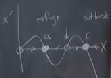

Sabit noktalarda stabilite sürekli değişiyor. Bu topolojik olarak doğru mu? Tek
çizgi üzerinde yanyana iki tane stabil sabit nokta olması mümkün değildir. Yani
okları nasıl çizerdik?

Bu anlamsız bir resim. 

İki üstteki resimde $c$ nüfus patlaması (outbreak), $a$ ise saklanma (refuge)
noktası. Eşik değeri $b$, eğer $b$'den fazla kurtçuk var ise büyümeye devam edip
$c$'ye erişirler. Ama $b$'den az kurtçuk var ise azalıp $a$ seviyesine düşüyorlar.

Zıplama fenomeni bir eyer düğümü çatallaşması ardından ortaya çıkar. Diyelim ki
$x$ değişkeni $a$ noktasında ve herhangi bir sebepten dolayı parametrelerde bir
kayma olmaya başlıyor. Orman yaşlandıkça ve içindeki ağaçlar büyüdükçe daha
fazla yaprağa sahip olacaklar. [1]'e göre bu $a$'nin yavaşça büyümesi
demektir. Niye? Hatırlarsak $r = RA / B$, büyük $A$'yi hatırlarsak bu kuşların
kurtçukları farketmeye başladığı kritik seviye idi. [1] diyor ki $A$ tüm ormanın
büyüklüğüne orantılıdır, yani eğer yaprak başı kritik kurtçuk yoğunluğu $A'$
dersek (türev değil), ve $S$ ormandaki tüm yaprak sayısı, $A' S$ bize $A$'yi
verir. O zaman $S$ yavaşça büyüyecek (orman büyüyor), bu $A$'yi yavaşça
büyütecek, ve sırasıyla $r$ formülü üzerinden $r$ değişecek.

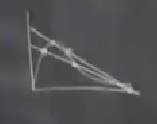

Bu değişimin sabit noktaları nasıl etkileyeceğini düşünelim, üstteki resimde düz
çizgi yavaş yavaş yukarı çıkıyor,

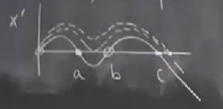

Sabit noktalar $a,b$ birbirine yaklaşıyor, teğetlik olmadığı durumda (kesikli
çizgiler) $a,b$ yok ama, ama tabii en sağda hala $c$'den geçiş var.

Bu resmin anlamı ne? Eğri yukarı çıktıkça belli bir $r$ ardından $a$ olmayacak,
sistemin $c$ sabit noktasına "zıplamaktan'' başka çaresi yoktur. Zıplama derken
bunu kastediyordum.

Histeresis (Hysteresis)

Bir parametreyi değiştirip $a$'dan $c$'ye zıplama ardından parametrenin geri
eski değerine döndürülmesinin sistemi $a$'ya döndür*me*mesine histeresis
deniyor. Pek çok gayrı lineer sistemlerde bu tür "geri dönülmezlik''
vardır. Mesela bir ormancılık kanunu geçti, bunun yan etkisi olarak kurtçuklar
patlama yaptı, $c$'ye gelindi. Çevreciler protesto etti, eski hale dönelim
dediler, fakat $r$'yi eski seviyesine getirmek bizi eski duruma döndürmez.

Zihinde canlandırmak için su resmi düşünelim,

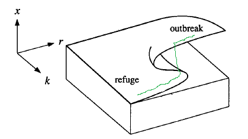

Yeşil çizgi soldan sağa doğru $r$'nin değişimi. Zıplama sonrası alttan üstteki
kavisli yüzeye geliniyor, ama bu noktada "geriye gitmek'' demek aynı yüzey
üzerinde sola gitmek demektir. Geriye gitmek için o yüzeyde sola, aşağı, sağa,
sonra tekrar sola gitmek lazım.

Ek Bölüm

Çember Üzerinde Akış

Şimdiye kadar $\dot{x} = f(x)$ formülüne odaklandık, ve bu formülü bir çizgi
üzerindeki vektör alanı olarak hayal ettik. Şimdi yeni bir diferansiyel denklem
ve onun faz uzayına bakma zamanı geldi; Alttaki formül

$$ \dot{\theta} = f(\theta) $$

bir çember üzerindeki vektör alanını temsil ediyor. Bu sistemde $\theta$ çember
üzerindeki bir nokta, ve $\dot{\theta}$ o noktadaki hız vektörü, ki bu vektör
$\dot{\theta} = f(\theta)$ ile kararlaştırılıyor. Aynen çizgi durumunda olduğu
gibi çember de tek boyutlu, fakat ek bir özelliği daha var, bir yöne sürekli
akarak başladığı noktaya dönmesi mümkün.

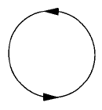

Böylece derste ikinci kez periyodik çözümlerin mümkün olduğunu görüyoruz. Başka
bir şekilde söylemek gerekirse çember üzerindeki vektör alanları salınım
halineki sistemlerin en baz halini temsil ediyor.

Birörnek Titreşir (Uniform Oscillator)

Çember üzerindeki bir noktaya çoğunlukla bir açı ya da bir faz adı verilir. O
zaman dünyanın en basit titreşiri

$$ \dot{\theta} = \omega $$

ki $\omega$ bir sabit olmak üzere. Bu sistemin çözümü

$$ \theta(t) = \omega t + \theta_0 $$

Bu çözüm çember etrafındaki açısal frekans $\omega$ ile yapılan birörnek
hareketi temsil eder. Bu çözüm periyotsal yani $\theta(t)$, $2\pi$ kadar
değişince baştaki yerine dönmüş oluyor, $T = 2\pi/\omega$ zaman sonra. $T$'ye
salınımın periyotu diyoruz.

Dikkat edersek salınımın genliği hakkında hiçbir şey söylemedim. Sistemizde
hakikaten genlik yok, eğer olsaydı o zaman 2 boyutlu bir faz uzayı elde ederdik.

Birörnek Olmayan Titreşirler

$$ \dot{\theta} = \omega - a\sin\theta $$

pek çok mühendislik / bilim dalında ortaya çıkar: elektronik, biyoloji,
mekanik. $f(\theta) = \omega - a\sin\theta$'nin tipik grafiği şöyledir,

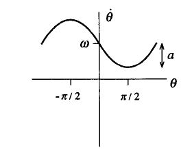

Ateş Böcekleri (Fireflies)

Senkronizasyonun doğada görülebilen en müthiş örneği herhalde ateş böceklerinin
senkronize olması. Güney Doğu Asya'nın bazı bölgelerinde binlerce erkek ateş
böceği gece vakti ağaçlarda toparlanıp senkronize bir şekilde bir ışık verip
ışık kapatırlar, dişi ateş böcekleri yukarıda uçarak aşağı bakarak kendilerine
uygun "yakışıklı'' bir ışık ararlar.

Peki bu ışık yanıp sönmesi (flaş diyelim) nasıl senkronize olur? Muhakkak ateş
böcekleri senkronize bir şekilde başlamazlar, güneş batmaya başlarken birer
ikişer mekana gelirler, ve senkronizasyon yavaş yavaş ortaya çıkar. Kilit gözlem
şudur: ateş böcekleri birbirlerini etkilerler. Bir ateş böceği diğerinin yanıp
sönmesini görünce kendi ışıldamasını ya yavaşlatır ya da hızlandırır ki bir
sonraki çevrimde aşağı yukarı aynı fazda yanıp sönebilsin. İşin ilginç tarafı
tabii ki iki, birkaç ateş böceği arasındaki lokal bir uyumlanmanın bir süre
sonra tüm böceklerde görülmesi.

Model

Diyelim ki $\theta(t)$ ateş böceğinin flaş ritminin fazı, ve $\theta=0$ bir
flaşın verildiği ana tekabül ediyor. Diyelim ki etrafta başka bir etki yok, ateş
böceği $\omega$ frekansında normal flaşını veriyor, yani $\theta = \omega$.

Şimdi dışarıdan

$$\Theta = \Omega 
\qquad (1)$$

fazında ile başka etkileyici bir flaşın görüldüğünü farzedelim, ki $\Theta=0$ o
diğer flaşın verildiği anı temsil ediyor. Modelimize göre eğer bu etki eğer
çevrim içinde daha önde ise etkilenen böcek kendi flaşını hızlandırıp senkronize
olmaya uğraşacak, ya da geride ise yavaşlayıp yine uyumlanmaya çabalayacak. Bu
durumu

$$ \dot{\theta} = \omega + A \sin(\Theta - \theta) 
\qquad (2) $$

ile modelleyebiliriz, ki $A > 0$. Mesela eğer $\Theta$, $\theta$'nin ilerisinde
ise, $0 < \Theta - \theta < \pi$ gibi, o zaman ateş böceği hızlanacak
($\dot{\theta} > \omega$). Uyumlanma gücü $A$ böceğin kendi frekansını ne oranda
değiştirebildiğini ölçüyor.

Uyumlanmanın olup olmadığını görmek için faz farkı $\phi = \Theta - \theta$'nin
dinamiklerine bakalım. (1)'den (2)'yi çıkartırsak,

$$
\dot{\phi} = \dot{\Theta} - \dot{\theta} = \Omega - \omega - A\sin\phi
\qquad (3)
$$

Denklem $\phi(t)$ birörnek olmayan titreşir denklemidir. Üstteki denklemi
birimsiz hale getirmek mümkün,

$$ \tau = At, \quad \mu = \frac{\Omega - \omega}{A} $$

O zaman

$$ \phi' = \mu - \sin\phi $$

ki $\phi' = \mathrm{d}\phi/\mathrm{d}\tau$. Boyutsuz grup $\mu$ uyumlanma gücüne kıyasla
frekans farkının bir ölçüsü. $\mu$ ufak olduğu zaman frekanslar nispeten
birbirlerine yakın, ve uyumlanma olabileceğini beklememiz lazım. Bu alttaki
grafikte doğrulanıyor, grafikte (1) için farklı $\mu \ge 0$ için vektör alanları
çizilmiştir ($\mu < 0$ durumu benzer)

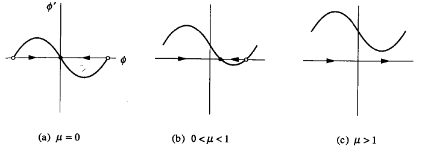

$\mu=0$ olduğu zaman tüm gidiş yolları stabil sabit nokta $\phi^\ast=0$'a doğru
akıyor, üstteki figürde (a) durumu. Bu durumda ateş böceği $\Omega=\omega$
durumunda arada sıfır faz farkı olacak şekilde uyumlanır. Yani diğer böcek ve
uyumlanan ateş böceği, uyumlanan böcek kendi frekansında etkilendiğinde, {\em
  tam uyum} halinde aynı anda yanıp sönmeye başlayacaklardır.

(b) figüründe $0 < \mu < 1$ için (a)'daki eğri yukarı çıkar, ve stabil ve
gayrı-stabil sabit noktalar birbirine yaklaşır. Tüm gidiş yolları hala stabil
bir noktaya doğru çekilirler, ama şimdi $\phi^\ast>0$. Faz farkı bir sabite
yaklaştığı için bu duruma ateş böceği ritminin etkileyiciye {\em fazsal kitlenmiş
  olduğu} adı verilir.

Faz kitlenmesi, etkileyen ve etkilenen böceğin aynı anlık frekansta
flaşladığıdır, ama artık aynı *anda* flaşlamazlar. $\phi^\ast>0$ sonucu
etkileyenin her çevrimde böcekten daha ileride (önce) flaşladığını anlamına
gelir. Bu mantıklı herhalde, $\mu>0$ farzettik, ki bu $\Omega > \omega$
demektir, etkileyen etkilenenden daha hızlı, ve böceği gitmek istediğinden daha
hızlı şekilde etkiliyor. Diğer böcek bu sebeple geriye düşüyor. Fakat etkileyen
ötekine kat kat tur farkı atmıyor, diğeri her zaman sabit bir $\phi^\ast$ kadar
geride.

Eğer $\mu$'yu arttırmaya devam edersek stabil ve gayrı-stabil sabit noktalar
sonunda biraraya gelip $\mu=1$'de bir eyer düğüm çatallaşması ortaya
çıkartacaklar. $\mu>1$ için her iki sabit nokta yokolur, ve faz kitlenmesi
ortadan kaybolur; faz farkı $\phi$ sürekli bir şekilde artacaktır, bu duruma faz
kayışı adı verilir, figürde (c) durumu (tabii faz farkı $\pi$'ye gelince
titreşirler tekrar aynı fazdadır). Dikkat edelim fazlar birbirinden birörnek
orada ayrılmıyor, $\phi$ (c) figüründe $\phi=\pi/2$'de sinüs dalgasının minimumu
altından geçerken en yavaş halde artıyor, ve en hızlı şekilde $\phi=-\pi/2$ iken
artıyor.

Bu model bazı spesifik ve test edilebilecek öngörüler yapıyor. Uyumlanmanın
sadece etkileme frekanslarının simetrik bir aralığında mümkün olacağını
öngörüyor mesela, spesifik olarak $\omega - A \le \Omega \le w + A$. Bu aralığa
uyumlanma bölgesi deniyor.

Bu bölgenin büyüklüğünü deneysel olarak ölçersek $A$ parametre değerini de
hesaplayabiliriz. O zaman model uyum sırasındaki faz farkı için nihai bir
öngörüde bulunur,

$$ \sin\phi^\ast = \frac{\Omega-\omega}{A} $$

ki $-\pi/2 \le \phi^\ast \le \pi/2$ (3)'un stabil sabit noktasına tekabül ediyor.

Dahası da var; $\mu > 1$ için faz kayışının periyotu şu şekilde tahmin
edilebiliyor. $\phi$'nin $\pi$ kadar değişmesi için gereken zaman

$$ T_{kayış} =
\int \mathrm{d} t = \int_{0}^{2\pi} \frac{\mathrm{d} t}{\mathrm{d} \phi} \mathrm{d} \phi $$

$$
= \int_{0}^{2\pi} \frac{\mathrm{d} \phi}{\Omega - \omega - A\sin\phi}
$$

Bu entegrali hesaplamak için kitabım [2]'nin 4.3 bölümündeki tekniği kullanırız,

$$ T_{kayış} = \frac{2\pi}{\sqrt{(\Omega-\omega)^2} - A^2} $$

$A,\omega$ ateş böceğinin doğasından gelen değişmeyen şeylere bağlı olduğunu
farzettiğimize göre üstteki iki denklemin tahminleri etkileyen frekans $\Omega$
değiştirilerek test edilebilir. Bu deneyler halen yapılmadı. 

Kaynaklar

[1] Ludwig et al, *Quantitative Analysis of Insect Outbreak Systems*,
J. Animal Ecology, 1978

[2] Strogatz, *Non-Linear Dynamics and Chaos*

