# Ders 5

Artık iki boyutlu sistemlere geçme zamanı geldi. Bu konuyu uzun bir süre
işleyeceğiz, ve en basit iki boyutlu sistemle ise başlayalım; çünkü tahmin
edebileceğiniz üzere işleyebileceğimiz pek çok farklı iki boyutlu yüzey
var. Düzlem (plane) bunlardan sadece biri. İlk işleyeceğimiz konu bu olacak, ama
silindir, küre yüzeyleri de var; bu tür gayrı-lineer sistemler doğada pek çok
yerde görülebiliyor.

Başlangıcı faz düzlem analiziyle (phase plane analysis) yapalım. Sistem şuna
benzeyecek,

$$ \dot{x} = f(x,y) $$

$$ \dot{y} = g(x,y) $$

$f,g$ tipik olarak gayrı lineer fonksiyonlar olur. Notasyon $(x,y) \in
\mathbb{R}^2$. $(\dot{x},\dot{y})$ çifti bir hız vektörü olarak düşünülür. Hız
derken mekanikteki hızdan bahsetmiyorum, faz uzayındaki yapay bir hız bu. Eğer
$x,y$ bir yersel kordinatı temsil ediyor olsaydı, $(\dot{x},\dot{y})$ o zaman
mekanik hızı temsil ediyor olurdu. Ama $x,y$ bir nüfus, ya da kimyasal maddlerin
konsantrasyonu gibi pek çok farklı ölçüm olabilir.

Grafiksel olarak faz düzlemi,

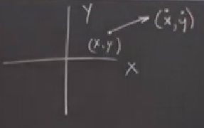

$x,y$ noktasından çıkan bir vektör o noktadaki hızı vektörsel olarak temsil
ediyor. Eğer o $x,y$'de olsaydık, bir sonraki gittiğimiz yer vektörün diğer ucu
olacaktır. Tabii o noktada da bir başka vektör olurdu, sonra o vektörü takip
ederdik, vs, bu böyle devam ederdi. Sürekli vektörleri takip ederek bir gidiş
yolu üzerinde (trajectory) hareket ediyor olurduk.

Bazen sistemi şu formda göstermek daha faydalı oluyor,

$$ \dot{\underline{x}} =
\left[\begin{array}{r} x \\ y\end{array}\right]
$$

$$ \dot{\underline{x}} = \underline{f}(\underline{x}) $$

$f,g$'nin pürüzsüzlüğü hakkında birkaç şey söyleyelim. Daha önce vurguladığım
gibi bu derste aşırı seçici olmadığımız bir konu abartılı teorik gereklilikler;
mesela $f,g$'nin yeterince pürüzsüz olduğunu farz ediyoruz, yani ODE'nin
çözümleri var ve bu çözümler özgün demiş oluyoruz. Bizim için yeterli bu şartı
şöyle ifade edebiliriz: Eğer $\underline{f}$ ardı ardına türevi alınabilir bir
fonksiyon ise (yani $\underline{f}$ ve onun türevleri sürekli ise), o zaman ardı
ardına türevi alınabilir bir vektör alanımız var demektir, ve bu da herhangi bir
başlangı noktası için $\underline{x}(t)$ çözümleri mevcut ve özgün anlamına
gelir.

Gidiş yolu kelimesini kullandım, çözüm spesifik bir gidiş yoludur,

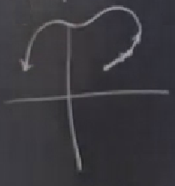

Üstte görüldüğü gibi. Bir başlangıç noktasından bir vektörü takip ederim, oradan
bir diğerini, ve faz düzleminde üstteki gibi bir gidiş yolu $x(t)$ ortaya
çıkar. Bu bir çözümdür.

Ama tekrar vurgulayayım, bu derste üstteki gibi bir çözümün *yapısını*
anlamaya uğraşıyoruz, bunu sistem denklemklerini direk çözmeden yapmaya
uğraşıyoruz. Bazı argümanlar geliştirerek çözümün şeklini görmek istiyoruz.

Mevcudiyet ve özgünlük şartının doğal bir sonucu var, bu ilginç bir durum ve
şartın kendisinden bariz olarak görülemeyebilir. Bu önemli bir kavram ve takip
eden anlatımlarda merkezi bir yeri var. Bu sonuç şudur; eğer çözümler özgün ise,
gidiş yolları birbiriyle kesişemezler. Yani faz portrelerini çizerken şöyle bir
şekil görmemiz mümkün değildir,

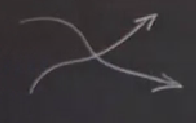

Bu mümkünsüzlüğün sebebini anlamak için herhangi bir hayali kesişme noktasında
isek bir sonraki gidişatın ne olacağını düşünmek yeterli. Öyle bir durumda
kesişme noktasından sonra iki tane farklı gelecek (gidiş yönü) olurdu, ve bu iki
seçenek varlığı çözümlerin özgünlüğü prensibine aykırıdır.

Diğer yandan gidiş yolları sabit noktalarda birbirine yaklaşabilir, alttaki gibi
bir şekil mümkündür,

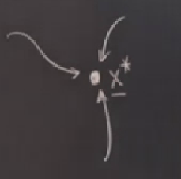

Son iki ifade arasında çelişki yok. Üstteki bir sabit nokta, ve o noktada isek,
orada kalırız (sabit nokta nihayetinde), ve ona doğru işaret eden gidiş yolları
sabit noktaya dokunmuyor aslında, sadece ona yaklaşıyorlar. Eh, tamam, sonsuz
zamanda dokunuyorlar, ama herhangi bir sonlu (finite) zaman içinde dokunma yok.

Unutmadan, iki boyutlu durumda sabit noktaların oluşmasının şartı bir $x,y$
noktası için hem $\dot{x}=0$, hem de $\dot{y}=0$ olmasıdır. Ya da vektör
notasyonu ile $\underline{f}(\underline{x}^\ast)=\underline{0}$. Eşitliğin sağındakine
dikkat, bu bir "sıfır vektörü'', içinde sadece sıfır değerleri var.

Gidiş yollarının kesişmeme şartının topolojik sonuçlarına bir bakalım. Diyelim
ki elimizde kapalı bir yörünge (closed orbit) var, $\mathbb{R}^2$ için olsun,

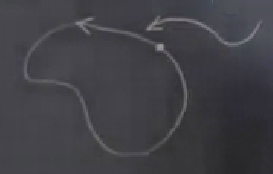

Bir noktadan başlanıyor, ama gidiş yolu gide gide tekrar kendisine dönüyor. Bu
tür bir yol diferansiyel denklemlerin dönemsel bir çözümü olduğunu
gösterir. Şimdi dışarıdan döngüye yaklaşan bir gidiş yolu düşünelim (üstteki
resimde yine), yol döngünün içine "giremez''; o zaman özgünlük prensibi ihlal
edilmiş olur. Hadi birleşim olduğunu varsayalım, ve birleşim sonrası bir
noktadan zamanı geri saralım; birleşme anında zaman hangi gidiş yoluna sapacak?
Bu bir çelişki ortaya çıkartır. Yani bir döngünün varlığı iki boyutta diğer
gidiş yolları için ciddi bazı kısıtlamalara sebep oluyor.

$\mathbb{R}^3$'te gidiş yolları birleşebilir, çünkü üç boyutta bir döngü uzayda
bir ayrım yaratamaz, ve bu durum bazı şartlarda kaos ortaya çıkartır. İki
boyutta kaos olması mümkün değildir. Hatırlarsak, tek boyutta yapılabilecekler
çok basitti, sabit noktaya, ya da sonsuzluğa doğru akıyor her şey. İki boyutta
sabit noktaya, ya da dönemsel bir yörüngeye gidilebilir.. farklı biraz daha
egzotik şeyler de mümkün, fakat kaos mümkün değil. Üç boyutta kaos olabilir,
zaten üç boyut kaosun ilk ortaya çıkabileceği yer.

Önümüzdeki bir kaç dersteki amacımız verili bir
$\dot{\underline{x}}=\underline{f}(\underline{x})$ sistemi için faz portresini
(grafiğini) çizmek, bunu niteliksel olarak farklı olan tüm gidiş yollarının
göstererek yapmak, sabit noktaları, stabilitesi, ve muhtemel kapalı yörüngeler
hakkında yine niteliksel bilgi toplamak. Bunu iki boyutta sabit nokta etrafında
lineerizasyon kullanarak yapacağız. Tek boyutta sistemi olduğu gibi analiz etmek
kolaydı fakat iki boyutta bu biraz daha zor. 

Sistemlerimizi

$$
\dot{\underline{x}} = A \underline{x}
$$

olarak yazacağız. Bu konunun standart diline atıf yapmak gerekirse, "sabit
katsayılı, homojen lineer sistemler''e bakacağız. $A$ bir sabit katsayılar
matrisi, ve sayılar reel. Bu tür sistemlerde orijin her zaman bir sabit
noktadır, $\underline{x}^\ast = \underline{0}$, kontrolü kolay - sıfır vektörü $A$
ile çarparız, ve sonuç sıfır. Tabii tüm faz portresini ve diğer sabit noktaları
da bulmak istiyoruz.

Faz portresi $A$'nin özdeğerleri ve özvektörleri üzerinden tanımlıdır, ki
özdeğer / vektörlerin lineer cebir derslerinde öğretilmesinin önemli bir sebebi
de budur, çünkü onlar sayesinde lineer diferansiyel denklemleri çözebilirsiniz.

Bu tekniği işlerken görmek için ilk önce sistemin özel bir çözümünü
ararız. Fizikçiler böyle yaklaşırlar bu tür problemlere, genel çözümü aramak
yerine, bakılan çözümler düzlem üzerindeki bir çizgi üzerinde olan çözümlere
kısıtlanır. $\underline{x}(t) = \underline{v}$ türünde çözümleri arayalım,
$\underline{v}$ bir sabit vektör, ve bir yöne işaret ediyor.

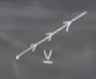

Bu arada gösterilen gidiş yolu sabit hızda olmayabilir, bazen hızlanıp, bazen
yavaşlayabilir, ama direk çizgide gider. 

Çözüm sadece bir sabit olamaz muhakkak, bir zaman bağlantısı da ekleyelim,

$$
\underline{x}(t) = \underline{v} e ^{\lambda t}
$$

Diferansiyel denklemleri bilenler üstel fonksiyonun burada doğru bir seçim
olduğunu bilirler. 

Türev ve zincir kuralını uygularsak,

$$
\dot{\underline{x}} = \underline{v} \lambda e ^{\lambda t} 
$$

Daha önceki eşitlikten hareketle,

$$
= A \underline{x} = A \big( \underline{v} e ^{\lambda t} \big)
$$

Lineerlik üzerinden $e ^{\lambda t}$'yi dışarı çekebiliriz,

$$
= e ^{\lambda t} A \underline{v}
$$

Üstteki formülde $e^{\lambda t}$ var, üç üstteki formülde de var, o zaman
üstteki türdeki çözümler mevcut olacaktır eğer $A
\underline{v}=\lambda\underline{v}$ şartına uyan bir $\underline{v}$ ve $\lambda$
bulabilirsek. Ve farketmiş olabilirsiniz, bu şart (formül) özdeğer / vektörlerin
tanımlayıcı formülüdür, $\underline{v}$ özvektör, $\lambda$ özdeğer olmak üzere.

$\underline{v},\lambda$ mevcut ise düz çizgi çözümlerimizi bulabiliriz, peki
mevcut olduklarını nasıl tespit ederiz? Cevap lineer cebir üzerinden onları
hesaplamaya uğraşmakla verilebilir. $\lambda$ için $\det (A - \lambda I) = 0$
çözülür, bizim ufak matris için

$$
0 = \left[\begin{array}{rr}
a-\lambda & b \\ c & d-\lambda
\end{array}\right]
$$

$$ 
= \lambda^2 - \tau \lambda + \Delta 
\qquad (1) 
$$

Üstte daha ileride bolca kullanacağım notasyonu tanıştırmış oldum bir
yandan. $\tau$ matrisin izi'dir (trace), yani matrisin köşegenindeki öğelerin
toplamıdır. $\Delta$ ise matris determinantı olacaktır,

$$ \tau = \mathrm{tr} A = a + d$$

$$ \Delta = \det A = ad - bc $$

Karesel formülü kullanarak (1)'i çözebiliriz,

$$ \lambda_{1,2} = \frac{\tau \pm \sqrt{\tau^2-4\Delta}}{2} $$

$$ \tau = \lambda_1 + \lambda_2 $$

$$ \Delta = \lambda_1 \lambda_2 $$

Şimdi $\lambda$'lara bağlı olarak faz portelerinin nasıl görüneceğine
bakalım. Aslında özdeğer / vektörleri hesaplamadan direk iz ve determinanta
bakmak bize çok şey söyler. 

$\dot{\underline{x}}= A \underline{x}$, $x \in \mathbb{R}^2$ İçin Sabit Noktaların
Sınıflandırılması

Durum 1) Eğer Noktaları (Saddle Points)

Bu noktaları anında bulmak mümkün çünkü negatif determinantı olan onlar. Yani
matrisimiz için determinantı hesaplarsak ve $\Delta < 0$ çıkarsa, iş bitti
demektir. Elde bir eğer noktası var. Bu da mesela $\lambda_1 > 0$, $\lambda_2<0$
anlamına gelir, ve her iki değer birbirinden farklıdır (distinct), işaretleri
birbirinin zıttı.

Lineer cebirde güzel bir teori var, bu teori der ki eğer iki farklı özdeğer elde
edersek, onlara tekabül eden özvektörler birbirinden bağımsızdır. Bu illa ki
birbirlerine dikgen anlamına gelmez, sadece aynı çizgi üzerinde değiller
demektir. 

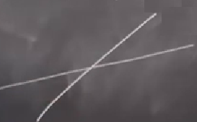

Çizersek mesela vektörler üstteki gibi olabilirdi; bu çizgiler iki özvektörün
kapsamıdır (span), yani her vektörün mümkün tüm tek sayılar ile çarpılmış hali -
aynı çizgide gösterince üstteki iki çizgiyi elde edebilirdik.

Şimdi genel çözümü yazarız, bu çözüm iki çözümün üst üste konmuş hali
olacaktır.

$$
\underline{x}(t) =
c_1 e^{\lambda_1 t} \underline{v}_1 +
c_2 e^{\lambda_2 t} \underline{v}_2
$$

$c_1,c_2$ herhangi birer sabittir. Bu ifade tanıdık gelmiştir herhalde, genel
çözüm "özçözümlerin'' lineer bir kombinasyonudur. 

Bunlar üstteki resmimiz için ne anlama geliyor? Mesela bir çizgi üzerindeysek
ve orada $\lambda_1 > 0$ ise, orijinden uzaklaşacak şekilde hareket ediyoruz, 

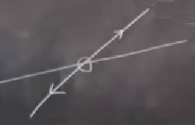

Orijindeki sabit noktanın gayrı stabil olduğunu görüyoruz. Fakat diğer "özyön''
için $\lambda < 0$, bu üstel bir çürüme var demektir, 

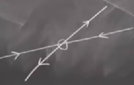

Olanlar eğer noktası tanımına tam uygun, bir sabit noktaya hem giden hem de
ondan kaçan gidiş yolları var. Diğer düz olmayan gidiş yolları da üsttekine
uyumlu olarak şu şekilde olurdu,

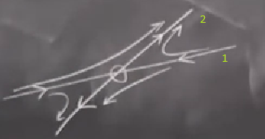

Kıvrımlı gidiş yollarını doldururken negatif ve pozitif sonsuzluğa giderken
görülecek davranışı düşünürüz, mesela üst sağ kısmında yukarı giden eğri üst sağ
yukarı doğru giden düz çizgiye yaklaşır, sonuşur (asymptotic) davranışı budur. 

Çizgilerden 1.'sine stabil özyön, 2.'sine gayrı stabil özyön ismi de verilir. 

Durum 2) Çeken (ve İten) Sabit Noktalar

Altta sadece çeken noktaları göstereceğim - iten durum topolojik olarak aynı,
tek fark okların terse çevirilmiş olması. Çeken noktaları karakterize eden bir
özellik $\Delta > 0$, $\tau < 0$. İtenler için ise $\Delta > 0$, $\tau > 0$.

Bazı alt durumlar var,

Durum 2a) Düğümler (Nodes)

Düğümleri kontrol eden karekök mevcudiyetidir, eğer bir karekök var ise, bir
düğüm var demektir, yani $\tau^2 - 4\Delta > 0$ ise. Bu durumda her iki
$\lambda$ reel olurdu, işaretleri de aynı olurdu.

Başka bir durumu görelim. Diyelim ki $\lambda_1 < \lambda_2 < 0$, ve
$\underline{v}_1$, $\underline{v}_2$ hala bağımsız.

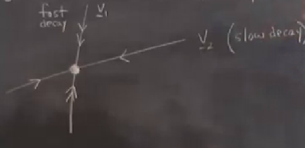

Yine iki özyön var ama bu sefer gidiş stabil noktaya doğru. Dikkat gösterilen
çizgiler $\underline{v}_1$, $\underline{v}_2$ vektörlerinin kendisi değil, onların
her türlü tek sayısal çarpımdan gelen katlarından oluşan bir uzay, yani
"özuzay''.

$\lambda_1$ daha negatif demiştik, o zaman $\underline{v}_1$'in çürümesi daha
hızlı (fast decay) olacaktır, $\underline{v}_2$ daha yavaş (slow decay)
olacaktır. Diger eğrileri de eklersek,

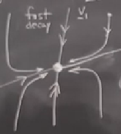

Üstteki resim stabil bir noktaya yakın olduğumuzdaki hali gösteriyor.

Bir noktayı daha vurgulamak isterim, belki resimden bariz anlaşılmamıştır;
$t\to\infty$ tipik gidiş yolları yavaş yola teğet olacak şekilde $x^\ast$'ya
yaklaşır. Eğer zamanı geri sararsam, $t\to-\infty$ iken, bu ters gidiş hızlı
yöne paralel olur.

Durum 2b) Sarmallar (Spirals)

Bu durumda $\Delta > 0$, ve nagatif iz $\tau < 0$, onları çeken (attracting)
hale getiren bu. $\tau^2 - 4\Delta < 0$ olur, o zaman kökler, $\lambda$'lar,
kompleks, ve özdeğerler reel olmayacak. Faz portresi için kompleks özvektörlerle
ilgilenmiyoruz, portrede sadece reel özvektörler görünür. Özdeğerler birbirinin
kompleks eşleniği olarak tabii ki belli ve birbirinden ayrıdır (distinct),
$\lambda = \mu \pm i\omega$ formunda gösterelim onları.

$\mu,\omega$'nin güzel fiziksel yorumlaması yapılabiliyor. $\mu < 0$ durumu
çürüme oranını kontrol ediyor, $\omega$ ise sarmalın dönme oranını temsil
ediyor. Eğer $x(t)$ çözümlerini yazarsak, lıneer cebir bize $\underline{x}$'in
her bileşeni $e^{\mu t} \cos \omega t$ ve $e^{\mu t} \sin \omega t$'nin bir
lineer kombinasyonu. Bu şekildeki formüller eğer önceden sönümlü harmonik
titreşirler (damped harmonic oscillator) konusunu öğrendiyseniz tanıdık
gelecektir. Üstel terimle çürüme var, ve $\sin$ ya da $\cos$ üzerinden salınım
terimi var. O zaman sarmallar sonumlu titreşirler geometrik karşılığıdır.

$x,y$ düzleminde tipik bir gidiş yolu suna benzer,

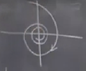

Görüntüde bir sarmal var, isim ondan seçilmiş zaten. Alttan bir gidiş yolu daha
katılabilir,

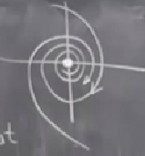

İnsanların çoğu zaman aklına "sarmalın hangi yöne döndüğünü nasıl bileceğim?''
sorusu geliyor. Üstte çizdiğim şekil saat yönü bir dönüşü gösteriyor, bunu
nereden biliyordum? Bu bilgi $\tau,\Delta$ ya da $\lambda$'dan gelmiyor, vektör
alanına bakmak lazım. Tavsiyem tek bir vektörü hesaplamak,

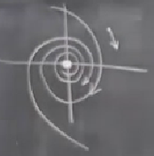

Üst sağda görüldüğü gibi, ve o vektörün yönüne bakmak. O yön hangisi ise dönüşün
o yönde olduğu anlaşılabilir.

Soru

Stabil, gayrı-stabil düğümlerin olduğu gibi stabil ya da gayrı-stabil
sarmallar da olabilir mi?

Cevap

Evet, okların yönünü değiştirerek bunu elde ederiz, mesela biraz önceki örnekte

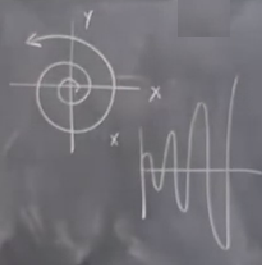

Bu gayrı-stabil bir sarmal. Eğer $x,y$ eksenlerine tekabül eden $x,t$ zaman
serisini çıkartacak olsam, alt sağdaki grafik olurdu - büyüyen bir salınım.

Soru

Sarmalı yuvarlak bir şekilde çizdiniz, şekil gerçekten böyle mi?

Cevap

Güzel soru, aslında sarmalı daha eliptik bir şekilde çizmek lazım, mesela üstten
daha basık bir yuvarlak.

Devam edelim; sarmalların özel bir hali $\mu = 0$ olduğu zamandır. Bu durumda
neler olduğuna bakalım,

Durum 3) Merkez (Center)

Bu durumda $\Delta > 0$, $\tau = 0$ ve $\lambda = \pm i\omega$, yani pür
hayali. Merkez halinde her gidiş yolu kapalı, tipik bir resim şuna benzer,


Gidiş yollarının hepsi aynı yöne işaret ediyor.  

Merkez'in en iyi bilinen örneklerinden biri, sönümsüz basit harmonik
titreşirlerin faz portresini çizince bu şekil çıkar, $\ddot{x} + x = 0$
sistemini bir faz düzlem resmine çevirince mesela. Bu sistemin resminde tam
çemberler olur. Çizelim, 

$$ y = \dot{x} $$

olsun, 

$$ \dot{x} = y $$

O zaman 

$$ \dot{y} = -x $$

İlk önce eksenlerden çıkan okları çizeriz, onları taslaklamak kolay, ardından
birkaç tane diğer yerlerden ekleriz,

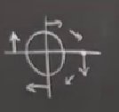

Soru

Gidiş yolları bir sabit noktaya yaklaşır mı?

Cevap

Hayır, her gidiş yolu kapalı, yani gidip gidip kendilerine dönüyorlar. Orijinde
bir sabit nokta var, fakat diğer tüm gidiş yolları onun etrafında bir kapalı
yörüngede. 

Bu örnek mükemmel periyotsal hareketi gösterdi, hatta her başlangıç şartı için
periyot olan bir örnek görmüş olduk. Gayrı-lineer sistemlerde bu çoğunlukla
ortaya çıkmaz, eğer muhafaza edilen enerji gibi ek bir özellik ortada yoksa
yani. Fakat bu tür lineer sistemlerde üstteki görüntü rahat bir şekilde ortaya
çıkabiliyor. 

Durum 4)

Bu çok acaip bir durum. Eğer $\Delta = 0$ ise o zaman matrisin determinantı
sıfır demektir, ve sabit nokta bulmak için $A \underline{x} = 0$'i çözmeye
uğraşırken bir özgün çözüm bulamayız. Mümkün çözümü oluşturan tüm sabit noktalar
bir çizgi, hatta bir düzlem oluşturacaklardır. Düzlem, yani o düzlemdeki her
nokta sabit - bu çok sıkıcı bir dinamik sistem. $\dot{\underline{x}}=0$. Nerede
olursan ol, hiç hareket edemiyorsun. Bu sistemin analizi çok kolay (!). Çizgide
sabit noktalar belki biraz daha ilginç, alttaki gibi bir durum olabilir mesela,

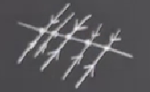

Çok yaygın olmasa da ortaya çıkabiliyor. Üstteki duruma "$\underline{0}$'da izole
olmayan sabit nokta durumu'' ismi verilir, çünkü orijinin yakınında diğer sabit
noktalar var.

Bir durum daha var, onların üzerinde çok durmayacağım çünkü pratikte karşımıza
çok çıkmıyorlar. $\tau^2 - 4\Delta = 0$ durumu bu, onun için kitabıma [1]
danışabilirsiniz. Burada tekrarlanan kökler var, ve dejenere düğümler ortaya
çıkabiliyor. Her yön bir özyön oluyor, ve mesela tüm gidiş yolları düz bir
şekilde tek bir sabit noktaya akıyorlar, bir yıldız şekli oluşturuyorlar. Ya da
tek bir özyön var, mesela

$$ \left[\begin{array}{rr}
\lambda & 1 \\ 0 & \lambda
\end{array}\right] $$

matrisinin özvektör / değerleri bunu verir. Kontrol edebilirsiniz, üstteki
matrisin iki değil sadece bir tane özyönü var. Alttaki resimde üst sağda yıldız,
alt sağda tek özyön durumu gösteriliyor. Mekanik bağlamında bu durum kritik
sönümlüdür (critically damped). 

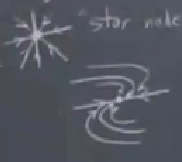

Büyük bitiş anına geldik. İşlediğimiz tüm farklı durumları akılda tutmak biraz
zor, alttaki diyagram belki yardımcı olabilir. Eksenler $\tau,\Delta$. Bu
eksenler üzerinden $\tau^2 - 4\Delta = 0$'i çizeriz, bu bir yana yatık
paraboldur, ve aynı zamanda farklı durumları birbirinden ayıran bir sınır
çizgisidir.

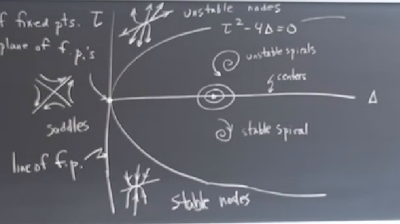

Orijinde düzlem sabit noktaları (plane of fixed points) var, $\tau$ ekseninin
tamamı çizgi üzerinde sabit noktalar (line of fixed points). 

Örnek 5.1.2 [2]

Lineer sistem $\dot{x} = Ax$'i çözün ki
$A = \left[\begin{array}{rr}a&0\\0&-1\end{array}\right]$. Faz portrelerini
$a$, $-\infty$ ile $\infty$ arasında giderkenki halini çizin.

Çözüm 

$$ 
\left[\begin{array}{r}
\dot{x} \\ \dot{y} 
\end{array}\right]
=
\left[\begin{array}{rr}
a & 0 \\ 0 & -1
\end{array}\right]
\left[\begin{array}{r}
x \\ y
\end{array}\right]
$$

Matris çarpımı 

$$ \dot{x} = ax$$

$$ \dot{y} = -y$$ 

sonucunu veriyor. Demek ki bu iki denklem bağlantısız (uncoupled), $x$
denkleminde $y$ yök, ve tersi de doğru. O zaman bu sistem ayrı ayrı
çözülebilir,

$$ x(t) = x_0 e^{at}$$

$$ y(t) = y_o e^{-t}$$

Farklı $a$'lar için faz portreleri alttadır,

```python
import numpy as np
import matplotlib.pyplot as plt
x,y = np.linspace(-10,10,100),np.linspace(-10,10,100)
X,Y = np.meshgrid(x,y)

def plot_g(a, fout):
   #a = -.5
   U = a*X
   V = -Y
   speed = np.sqrt(U*U + V*V)
   start = [[2,.75]]
   fig0, ax0 = plt.subplots()
   strm = ax0.streamplot(x,y, U, V, color=(.75,.90,.93), linewidth=.5)
   strmS = ax0.streamplot(x,y, U, V, start_points=start, color="crimson", linewidth=1)
   ax0.set_xlabel(r'$ \dot{x} $',size=14)
   ax0.set_ylabel(r'$ \dot{v} $',size=14 )
   ax0.text(-5,5,'a = {0}'.format(a))
   plt.savefig(fout)

plot_g(-2.0, '05_22.png')
plot_g(-1.0, '05_23.png')
plot_g(-0.5, '05_24.png')
plot_g(0.0, '05_25.png')
plot_g(1.0, '05_26.png')
```

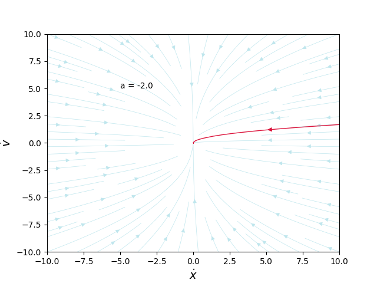


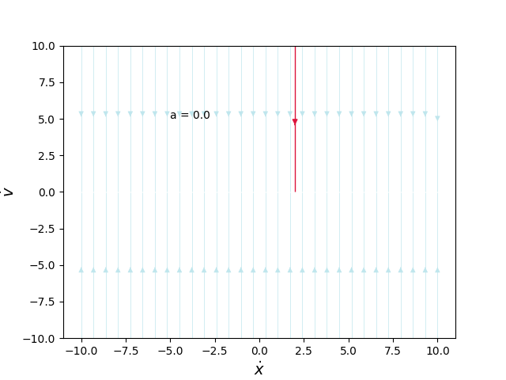

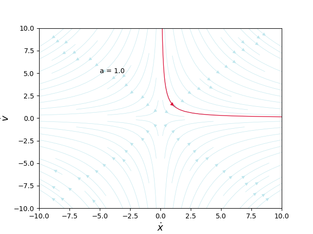

Örnek 5.2.1 [2]

$\dot{x} = x + y$, $\dot{y} = 4x-2y$ problemini çözün, başlangıç şartları
$(x_0,y_0) = (2,-3)$.

```python
import numpy as np
import matplotlib.pyplot as plt

a=1;b=1;c=4;d=-2;s1=2;s2=-3
x,y = np.linspace(-10,10,100),np.linspace(-10,10,100)
X,Y = np.meshgrid(x,y)
A = np.array([[a,b],[c,d]])

U = A[0,0]*X +A[0,1]*Y
V = A[1,0]*X + A[1,1]*Y

w,v = np.linalg.eig(A)
v = np.round(v,2)
w = np.round(w,2)
eigvects = np.dot(A,v)

speed = np.sqrt(U*U + V*V)

start = [[s1,s2]]

fig0, ax0 = plt.subplots(1,1,figsize=(8,8))
ax0.set_aspect('equal')
strm = ax0.streamplot(x,y, U, V, color=(.75,.90,.93), linewidth=.5)
strmS = ax0.streamplot(x,y, U, V, start_points=start, color="crimson", linewidth=1)
ax0.plot(start[0][0],start[0][1],'go')
ax0.set_xlim(-10,10)
ax0.set_ylim(-10,10)
ax0.plot(x,eigvects[1,0]/eigvects[0,0]*x,'b',alpha=.7)
ax0.plot(x,eigvects[1,1]/eigvects[0,1]*x,'b',alpha=.7)
ax0.set_xlabel(r'$ \dot{x} $',size=14)
ax0.set_ylabel(r'$ \dot{y} $',size=14 )
ax0.text(-9,8,r'$\dot{0}$ = {1}x + {2}y'.format('x',A[0,0],A[0,1]))
ax0.text(-9,7,'$\dot{0}$ = {1}x +{2} y'.format('y',A[1,0],A[1,1]))
ax0.text(-9,6,r'$(x_0,y_0)$ = ({0}, {1})'.format(start[0][0],start[0][1]))
ax0.text(-9,5,'$\lambda$ = {0}, {1} '.format(w[0],w[1]))
ax0.text(-9,4,'Eigenvectors = {0}, {1}'.format(v[0].T,v[1].T))
ax0.text(-9,-9,'General solution = c_1{0}e^({1}t) + c_2{2}e^({3}t)$'.format(v[0],w[0],v[1],w[1]))
plt.grid()
plt.savefig('05_27.png')
```


Kaynaklar

[1] Strogatz, *Nonlinear Dynamics and Chaos*


