# Ders 6

Önceki derste lineer sistemlerin hızlıca üzerinden geçtik; şimdi gayrı lineer
sistemlere geri döneceğiz ve gayrı lineer sistemleri analiz ederken lineer
kavramları 2 boyutta kullanmaya başlayacağız. İlk odaklanacağımız alan sabit
noktalar.

$\dot{\underline{x}} = \underline{f}(\underline{x})$'in Sabit Noktaları

Önce teorik konulardan bahsedeyim, sonra birkaç örnek üzerinde teorinin nasıl
işlediğini görebiliriz. Diyelim ki bir sabit nokta $(x^\ast,y^\ast)$ var, ve sistem

$$
\dot{x} = f(x,y) 
\qquad (1)
$$

$$
\dot{y} = g(x,y) 
\qquad (2)
$$

Hatırlarsak iki boyutta sabit nokta olması icin hem $\dot{x}=0$, hem de
$\dot{y}=0$ olmalı, sistemin denge noktasını temsil eden eşitlik bu. Bizim
bilmek istediğimiz bu sabit nokta hangi tür bir sabit nokta olduğu. Lineer
sistemlerden bahsettiğimizde farklı türde sabit nokta görmüştük: düğümler,
sarmallar, eğer noktaları, merkezler, vs. Gayrı lineer sistemleri incelerken bu
kavramları kullanabilir miyiz?

Cevap çoğunlukla evet. Göreceğiz ki gayrı lineer sistemlerin sabit noktaları
lineer sistemlerdekine oldukça benziyor - ki lineer sistemleri öğrenmemizin bir
sebebi de buydu zaten. Muhakkak gayrı lineer durumda daha egzotik başka haller
de mümkün, fakat bu egzotik durumlar çok nadir ortaya çıkıyorlar. Şimdilik o türden
nadir durumları görmeyeceğiz.

Neyse, bir sabit noktayı sınıflamak için o noktada oluşan ufak sapmaları
gözönüne alabiliriz,

$$ 
u(t) = x(t) - x^\ast 
\qquad (3)
$$

$$ 
v(t) = y(t) - y^\ast 
\qquad (4)
$$

Üstteki işlemlerle kordinat sistemimizin orijinini sabit noktaya doğru kaydırmış
oluyoruz bir bakıma; ve o noktanın yakın çevresinde neler olduğunu anlamak
istiyoruz. Şimdi $x,y$ hakkında bildiklerimizden hareketle $u,v$'nin
diferansiyel denklemlerini türetelim. Mesela $\dot{u}$'yu hesaplayalım, $x^\ast$
sabit nokta olduğu için sabit değeri vardır, $u$'nun türevini alırken yokolur,
geriye sadece $\dot{x}$ kalır, ve

$$ \dot{u} = \dot{x} = f(x,y) = f(x^\ast+u, y^\ast+v)$$

$x$'den $x^\ast+u$'e geçtik çünkü (3)'e göre bu böyle. Aynı durum (4) üzerinden $y$
için. Hala yaklaşıksallama yapmadık, yani Taylor açılımı ve yüksek dereceli
terimleri atmak, vs. gibi işlemler, ufak bir sapmayı baz alarak buraya geldik,
ve onun ardından daha önce tek boyutlu sistemlerde gördüğümüz lineerizasyon
fikrini iki boyuta genelleyerek kullanmak istiyoruz.

Şimdi iki değişkenli bir fonksiyon için Taylor açılımınının nasıl yapılacağını
hatırlamamız gereken o an geldi. $x^\ast,y^\ast$ etrafındaki açılım,

$$
\dot{u} = f(x^\ast,y^\ast) + u
\frac{\partial f}{\partial x} \vert_{x^\ast} +
v \frac{\partial f}{\partial y} \vert_{x^\ast} + \dots
$$

Noktalar yerinde yüksek dereceli terimler var, karesel, küpsel vs. gibi. Bu
terimlerin önemsiz (çok küçük) olduğunu varsayıyoruz, çünkü $u,v$ zaten çok
ufaktı, onların karesi, küpü daha da küçük olacaktır. $f(x^\ast,y^\ast)$ sıfır, çünkü
sabit noktanın tanımı buydu; (1) ve (2)'nin sıfır olması. Geriye kalanlar, 

$$
=u \frac{\partial f}{\partial x}\vert_{x^\ast} +
 v \frac{\partial f}{\partial y}\vert_{x^\ast} + ..
$$ 

Kısmi türevler komplike fonksiyonlar gibi duruyorlar, ama unutmayalım, o
fonksiyonların sabit noktalardaki değerlerini kullanıyoruz, yani kısmi
türevlerin olduğu terimler de birer sayı. Bu arada kısmi türevler zamana bağlı
değil, zamana bağlı olan sadece $u$ ve $v$.

Benzer şekilde,

$$
\dot{v} =
u \frac{\partial g}{\partial x}\vert_{x^\ast} +
v \frac{\partial g}{\partial y}\vert_{x^\ast} + ...
$$ 

Notasyon biraz kalabalıklaştı, tüm bu işlemler toparlayıp bir matris çarpı
vektör olarak yazsak daha iyi olur.

$$
\left[\begin{array}{r}
\dot{u} \\ \dot{v}
\end{array}\right]
=
\left[\begin{array}{rr}
\frac{\partial f}{\partial x} & \frac{\partial f}{\partial y} \\
\frac{\partial g}{\partial x} & \frac{\partial g}{\partial y} 
\end{array}\right]_{x^\ast,y^\ast}
\left[\begin{array}{r} u \\ v \end{array}\right]
+ ...
$$

Tam vektörel, matris formunda,

$$ \dot{\underline{u}} = A \underline{u} + ...$$

Matris $A$ ileriki derslerde de cok önümüze çıkacak, ona Jacobian matris ismi
veriliyor.  Not: $\underline{u}$ içinde hem $\dot{u}$, hem de $\dot{v}$ var,
$u$'lar biririne karışmasın.

Yüksek dereceli terimleri atarsak sabit nokta $\underline{x}^\ast$ etrafında bir
lineerizasyon elde etmiş oluruz.

Tabii dikkatli olmak lazım, acaba bu lineerizasyon $\underline{x}^\ast$ etrafındaki
niteliksel dinamiği iyi bir şekilde temsil edebiliyor mu? Niceliksel olarak bu
temsilin tamamen aynı olmasını beklemiyoruz, çünkü yüksek dereceli terimleri
attık. Bu dersteki amacımızın sistemin, onun faz portrestinin hakkında
niteliksel bir fikir edinmek olduğunu söylemiştik, yani esas sorumuz yüksek
dereceli terimleri atınca acaba niteliksel resimde değişim ortaya çıkar mı,
mesela bir merkez sarmal, ya da bir eyer düğümü haline gelir mi?

Cevap, $x^\ast$ bir eğer, düğüm, ya da sarmal ise lineerizasyon ile niteliksel
olarak doğru bir resim elde ediyoruz. Lineerizasyon bize bir sabit nokta eğer
diyorsa, hakikaten o bir eğer. Sarmal var diyorsa sarmal var. İspatı tam
matematiksel olarak görmek isteyenler teoriksel diferansiyel denklemlerin
işlendiği bir kitaba, derse danışmalı. Fakat uç nokta durumlarda, eğer dejenere
düğüm, yıldız, merkez, izole olmayan sabit nokta gibi bir durum var ise
lineerizasyon analizde değişime yol açabiliyor.

Uç nokta durumlara niye uç nokta dedim? Resmi hatırlayalım,

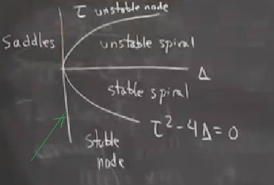

Üstteki tüm durumlar sağlam (robust) durumlar, grafikte koca koca alanları
var. Gayrı lineer terimlerle onları belki biraz yerinden oynatabiliriz, ama bu
fazla bir etki etmez. Uç nokta durumlar çoğunlukla iki büyük bölge arasında
ortaya çıkarlar, mesela yeşil okun gösterdiği dikey eksenin tam üzerinde,
hatırlarsak o çizgi izole olmayan sabit noktaların yaşadığı yerdi. Ya da eğri
üzerinde, dejenere düğümler, yıldızlar oluyordu. Merkezler ise yatay eksen
üzerinde yaşarlar. Tüm bu durumlar gayet ince, sonsuz küçük bir bölgeye aitler,
bu yüzden gayrı lineer terimler onları etkileyebilirler. Bir örnek üzerinde
görelim,

$$ \dot{x} = -y + ax(x^2 + y^2) $$

$$ \dot{y} = x + ay (x^2 + y^2) $$

Küpsel gayrı lineer terimler var görüldüğü gibi, karesel terimler de
var. Orijinin bir sabit nokta olduğunu hemen görmek mümkün. Bu sistem için
Jacobian hesaplanınca sabit nokta $(0,0)$ üzerinde,

$$ A = \left[\begin{array}{rrr}
0  & -1 \\ 1 & 0
\end{array}\right] $$

çıkıyor. Bu hesabı yapmanın iki yolu var, biri diğerine göre daha kafa
yorucu. Mesela üst soldaki öğe niye sıfır?

$$ \frac{\partial \dot{x}}{\partial x} =
3ax^2 + ay^2 \bigg|_{(0,0)} = 3a(0)^2 + a(0)^2 = 0
$$

Diğer yol ile Jacobian'ı direk görmek için Jacobian'ın neyi temsil ettiğinin
düşünürüz... Unutmayalım, Jacobian vektör alanının lineer bölümü, ve üstteki
örnekte orijin etrafında lineerize ederken şu notasyonu kullanmıştık, $u = x -
x^\ast$. Fakat eğer $x^\ast$ sıfır ise o zaman $u$ direk $x$'e eşittir, yani orijin
etrafında lineerize ederken $u$ ile $x$ aynı şeydir. O zaman üstteki sistemde
neler olduğunu hızlı bir şekilde görebilmek için $x$ yerine $u$, $y$ yerine $v$
geçiririz, ve ortaya çıkan $u,v$ bazlı küpsel terimleri gözönüne almayız, o
zaman denklemde $\dot{u} = -v$ ve $\dot{v} = u$ kalır, geri kalanlar yok
sayılabilir.

Neyse, hangi yöntemle olursa olsun Jacobian'ı elde ettik, şimdi onu
sınıflayalım. İzi köşegendeki öğelerin toplamı, 0 + 0 sonuç 0, determinant ise
köşegen öğelerinin çarpımından sağa yatık köşegen öğelerinin çarpımının
çıkartılması,

$$ \tau = 0 $$

$$ \Delta = 0(0) - 1(-1) = 1 $$

Eğer grafiklersek, bu nokta,

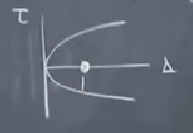

Yani (0,0) sabit noktası lineerizasyonumuza göre bir merkez. Tam terminolojiyi
kullanırsak bu nokta bir "lineer merkez'', yani lineerizasyon bu noktanın bir
merkez oldugunu tahmin ediyor. Fakat bu tam doğru değil; en azından çok şanslı
isek ve $a=0$ olsaydı bu doğru olurdu. Unutmayalım modelde bir parametre var,
$a$. Lineerizasyona göre bu nokta tüm $a$ değerlerine göre bir merkez. Fakat
bunun doğru olması mümkün değil. İşte lineerizasyonun doğru bir sonuç vermediği
bir durumu şimdi görüyoruz. Modelde gerçekte neler oluyor?

Bu gayrı lineer sistemi analiz edelim o zaman. Fakat iki boyutta
kullanılabilecek hiçbir teknik bilmiyoruz, şimdilik. Ama lise seviyesi
matematikten bir numara belki bize yardım edebilir. $x^2 + y^2$ görür görmez
hemen kutupsal kordinatları hatırlamaya başlıyoruz değil mi? Deneyelim,

$$ x = r\cos\theta $$

$$ y = r\sin\theta $$

$r,\theta$'yi $t$'nin fonksiyonları olarak düşünüyoruz, yani $r=r(t)$, $\theta =
\theta(t)$, ve amacımız $\dot{x}$, $\dot{y}$ sistemimizi kutupsal forma
çevirmek, bu sırada $\dot{r}$, $\dot{\theta}$'nin ne olacağına bakmak.

Kutupsal forma nasıl geçeriz? Tipik yaklaşım $x^2+y^2$ yazıp değişkenlerinin
yerine üstteki kutupsal karşılıklarını geçirmek, sonra $\dot{x}$ $\dot{y}$
türevlerini alırken $\dot{r}$, $\dot{\theta}$ elde etmek vs. Ama daha hızlı bir
yöntem var. $x^2 + y^2 = r^2$ olduğunu biliyoruz. Direk bu ifadenin zamana göre
türevini alırsak (bu arada her şeyin zamana indisli olduğunu tekrar
vurgulayayım),  Zincir Kuralını da uygulamak lazım tabii, şu çıkar,

$$ \frac{d}{dt} \big( x^2 + y^2 \big) = \frac{d}{dt} (r^2)$$

$$ 2x\dot{x} + 2y\dot{y} = 2r\dot{r} $$

2'ler iptal olur,

$$ r\dot{r} = x\dot{x} + y\dot{y}  $$

Bu çok faydalı bir eşitlik. Sistemimizdeki $\dot{x}$, ve $\dot{y}$'yi alıp
üstteki formülün içine sokunca, ortaya çıkan güzellikleri görelim şimdi. Ana
formül neydi ?

$$ \dot{x} = -y + ax r^2$$

$$ \dot{y} = x + ayr^2 $$

$x^2+y^2 = r^2$ olduğu için üstteki kısaltma mümkün oldu. Şimdi,

$$ r\dot{r} = x \bigg[ -y + axr^2 \bigg] + y \bigg[ x + ayr^2\bigg] $$

$xy$ terimleri iptal olur, biri negatif diğeri pozitif, geri kalan,

$$ = a (x^2+y^2)r^2 $$

$$ = ar^4 $$

O zaman

$$ \dot{r} = r^3 $$

Vay canına. Bu bayağı temiz bir formül oldu. $\theta$ icin

$$ \theta = \tan^{-1} \frac{y}{x} $$

$$ \dot{\theta} = \frac{x\dot{y} - y\dot{x}}{r^2} $$

Bu sonucu kendiniz kontrol edebilirsiniz, ters tanjantın türevini hatırlamak
lazım. Tüm bunları geri koyunca,

$$ \dot{\theta} = \frac{x (x+ayr^2) - y(-y+axr^2)}{r^2} $$

Bir sürü iptal olabilecek terim görüyorum, bu iptalleri çıkartınca,

$$ = \frac{x^2+y^2}{r^2} = 1 $$

Bu arada bu formüllerin çok temiz çıkmasının bir diğer sebebi onları bu şekilde
benim kurgulamış olmam :) Neyse, sonuç

$$ \dot{r} = ar^3 $$

$$ \dot{\theta} = 1 $$

$r$'nin $\theta$'yla bağlantısının kopmuş olmasına dikkat, bu bizim için
faydalı. Önceki $x,y$ formunda $x,y$ formülleri birbiriyle bağlantılı
idi. Üstteki formülü iki tane ayrı tek boyutsal sistem olarak görebiliriz. O
zaman bu sistemi analiz ederken daha önce gördüğümüz tek boyutta işleyen
tekniklerimizi kullanabiliriz. Ama ondan önce sağduyumuzu kullanarak bazı
sonuçlara varabiliriz belki. Tipik bir noktayı düşünelim, ve $a < 0$ için, ve
tipik bir başlangıç noktası için gidiş yolu neye benzer?

$\dot{\theta}=1$, o zaman $\theta$ sabit bir oranda sürekli artacak, tabii
$\theta$ rotasyonel bir ölçüt, o zaman sabit bir oranda sürekli saat yönüne ters
bir dönüş olacak. Diğer yandan, yarıçapsal bağlamda $a<0$ olduğu için $\dot{r}$
negatif, o zaman yarıçap sabit bir şekilde azalmalı. 

Tüm bunlar bize bir orijinde stabil sarmal verir. Eğer $a=0$ olsaydı,
$\dot{r}=0$ olurdu, yarıçapta hiç değişim olmazdı, başladığımız yarıçapta
kalırdık,

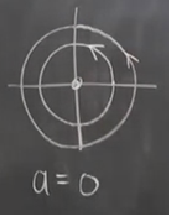

Nereden başlarsak başlayalım bu durum ortaya çıkar. 

Demek ki $a=0$ için lineerizasyon doğru sonucu buldu, tabii bu çok şaşırtıcı
olmamalı çünkü $a=0$ olduğu zaman küpsel terimler yokoluyor, ve sistem bu
noktada zaten lineer oluyor. Lineerizasyon lineer bir sistem üzerinde işliyor
doğal olarak. Neyse, $a>0$ için gayrı stabil bir sarmal var,

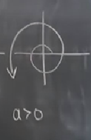

Lineerizasyonun bunların hiçbirinden haberi yok. Elindeki bilgi ile en iyisini
yapmaya uğraşıyor, fakat stabil ve gayrı stabil sarmalın mevcudiyetini tahmin
etmesi mümkün değil.

Gördüklerimizde kabaca bir sonuç çıkartmak gerekirse merkezlerin analizi
ikircikli, hassas. Gayrı lineer terimler, çok ufak gayrı lineer terimler sonuçta
büyük değişime yol açabiliyor.

Niye? Merkez durumunda ortaya çıkan kapalı, neredeyse tam çembersel bir yörünge
hayal edelim, ama bu yörünge en üste kapanamıyor, çok ufak bir farkla daha
aşağıdan gidiyor, ve gidiş yollarının kesişememesi prensibi üzerinden artık dış
büyük yuvarlağın içinde hapis kalındı, bu gidişatın kaderi çürüyen sarmal
olmaktan başka bir şey olamaz. 

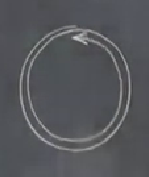

Kıssadan hisse: merkezler hassas. O zaman lineerizasyon bize bir merkez verdiği
zaman kafamızda alarm zilleri çalmalı, eğer daha fazla kanıt yoksa elimizde
gerçekten bir merkez olduğuna inanmamamız gerekir. 

Alarm vs. derken tabii bu durumu çok ta abartmaya gerek yok, dediğimiz gibi uç
nokta durumlar bunlar, çoğunlukla ortaya çıkmıyorlar. Birazdan işleyeceğimiz
örnek daha çok karşımıza çıkan türden.

Tavşanlar vs. Koyunlar (Rabbits vs Sheep, Kitap Bölüm 6.4)

Bu örnek Lota-Volterra yarış modelini kullanan bir örnek. Yarış derken avcı /
avlanan türünden bir yarıştan bahsetmiyorum, koyun tavşanı "yemiyor'', hem
tavşan, hem de koyun ot yiyorlar. Yarış her iki organizmanın aynı şey yemesi
üzerinden ortaya çıkan bir yarış, tüketilen ortak bir kaynak var. $x$ ve $y$
sırasıyla tavşan ve koyun nüfusu. Diferansiyel denklem kullanabilmek için bu
değişkenleri sürekli ortamda düşüneceğiz, gerçek dünyada bunlar tam sayı
muhakkak, çünkü yarım koyun, çeyrek tavşan olamaz.

$$ 
\dot{x} = x(3-x-2y) 
\qquad (5) 
$$

$$ \dot{y} = y(2-x-y) $$

Bu denklemler biraz uyduruldu, sadece aşağı yukarı gerçek durumu
gösteriyorlar. Fizikteki $F=ma$ gibi değiller, öyle derin prensiplerden
türetilmiş değiller, olabilecek (plausible) bir model sadece. Bu olabilirliği
ispatlamak için birkaç zihin egzersizi yapalım. Eğer hiç koyun olmasaydı,

$$ \dot{x} = x(3-x) ...$$

olurdu (noktadan sonrası birazdan geliyor). Bu denklemi hemen tanımamız lazım, o
tek organizmanın nüfusunu modelleyen lojistik denklemi. Nüfus taşıma kapasitesi
$K$'ye (burada 3) kadar büyüyor. 3 derken 3 tane tavşan değil, 3000 belki,
birimleri şimdilik fazla dikkate almayalım. Devam edelim, 

$$ \dot{x} = x(3-x) - 2xy$$

Ek terim koyunların varlığını yansıtıyor, $-2xy$ eksi işaretli, ve bir anlamda
koyunların varlığı sebebiyle tavşanların ölüm oranı. Ama demiştik ki koyunlar
tavşanları yemiyor, bu doğru, fakat koyunlar tavşanların yemeğini
yiyor. Koyunlara tekrar bakalım, biraz tekrar düzenleme ile,

$$ \dot{y} = y(2-x) - xy $$

Burada koyunların taşıma kapasitesi 2 olarak gözüküyor, tavşanların taşıma
kapasitesi daha yüksek, demek ki daha iyi ürüyorlar [hoca burada şakayla karışık
  "tavşan gibi üremek'' sözüne de bir atıf yapıyor]. Üreme oranını parantezi
açınca görüyoruz, tavşan için $3x$, koyun için $2y$. Yani formülü tavşanın daha
hızlı ürediği şeklinde de okuyabiliriz. 

Tabii koyunların da bazı avantajları var. Tavşanlar hızlı ürüyor olabilir, ama
koyunlar da büyük, okkalı hayvanlar. Tavşan formülünde $xy$ teriminin -2 ile
çarpıldığına dikkat, bu rakam koyun formülünde -1, yani birbirleri ile olan
etkileşime oranlı ölümler tavşanlar için dezavantaj. Birbirlerini yiyorlar
demiyoruz, daha önce belirttik, ama, ne bileyim, belki aynı otu yerken koyun
oraya geliyor, tavşanlar kaçıyor vs., bu yüzden daha az ot yemiş oluyorlar. Bu
bana kimyadan bir örneği hatırlattı, Kütle Aksiyon Kuralı (The Law of Mass
Action) var mesela, iki maddeli ortam düşünelim kimyasal reaksiyon oranı A
maddesinin konsantrasyonu çarpı B maddesinin konstrasyonuna eşit, çünkü o
çarpıma oranla maddenin molekülleri  birbiri ile çarpışıyor. 

Üstteki model ekoloji dersinde ilk öğretilen modellerden biri, en basit yarış
modeli bu.

Analiz edelim, sabit noktalar nerede? Faktorize edilmiş ana model (5)'e bakmak
en iyisi, her iki eşitliğin sağ tarafı ne zaman sıfır olur? 4 farklı şekilde,
$x,y$ sıfır olabilir, $x$ ve ikinci formülün ikinci büyük terimi sıfır olabilir,
vs.. Tüm bu seçenekleri teker teker irdeleyince şu sabit noktalar ortaya
çıkacak, (0,0), (3,0), (0,2), (1,1). Bu noktalar etrafinda lineerize edelim,
Jacobian,

$$
A =
\left[\begin{array}{rr}
\frac{\partial \dot{x}}{\partial x} & \frac{\partial \dot{x}}{\partial y} \\
\frac{\partial \dot{y}}{\partial x} & \frac{\partial \dot{y}}{\partial y} 
\end{array}\right]
$$

$$
= \left[\begin{array}{rr}
3-2x-2y & -2x \\
y & 2-x-2y
\end{array}\right]
$$

(0,0) noktasında Jacobian, $A = \left[\begin{array}{rr} 3 & 0 \\ 0 & 2\end{array}\right]$.

Bu analizi en kolay sonuçlardan biri, $\tau,\Delta$ ile attığımız taklalara
gerek yok çünkü köşegen bir matrisin özdeğerlerini hemen bulmak mümkün, direk
köşegen üzerindeki değerler, $\lambda_1=3,\lambda_2=2$. Her iki değer pozitif
olduğu için bu bir gayrı stabil düğüm işareti. Gayrı stabil düğümler uç nokta
durumlardan değil, o yüzden bu sonuca güveniyoruz, orijinde hakikaten gayrı
stabil düğüm var.

Lineer sistemleri işlerken bir gidiş yolunun bir düğümden çıkarken hızlı yolu mu
yavaş yolu mu takip ettiğini analiz etmiştik, gidiş yolları $\lambda_2 = 2$
yönünde çıkış yapıyorlar, bu böyle çünkü $|\lambda_2|$ sıfıra $|\lambda_1|$'den
daha yakın. Şimdi $\lambda_2$'ya tekabül eden özyön nedir onu bulalım, bu sadece
özvektör $v_2 = \left[\begin{array}{cc} 0 & 1 \end{array}\right]^T$. 

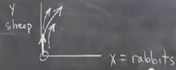

Faz portresini ortaya çıkartmak için takip edeceğimiz strateji şöyle; her sabit
nokta etrafında ufak gidiş yolları çizeceğiz, ve sonra tüm bu gidiş yollarını
bir şekilde birleştirerek tüm gidiş yollarını taslaksal şekilde ortaya çıkarmaya
uğraşacağız.  Devam edelim,

(0,2) noktasında Jacobian, $A = \left[\begin{array}{rr} -1 & 0 \\ -2 & -2\end{array}\right]$.

Bu üçgensel bir matris, bu durumda da özdeğerleri hemen okuyabiliriz, yine
köşegendeki değerler, $\lambda = -1,-2$. Demek ki stabil düğüm. Gidiş yolları
stabil düğüme $\lambda = -1$ özyönünde yaklaşıyor, bu yön
$\left[\begin{array}{cc} 1 & -2 \end{array}\right]^T$. 

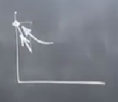

(3,0) noktasında Jacobian, $A = \left[\begin{array}{rr} -3 & -6 \\ 0 & -1\end{array}\right]$.

$\lambda = -3,-1$, yine stabil düğüm.

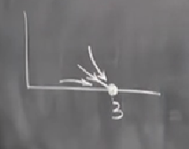

(1,1) noktasında Jacobian, $A = \left[\begin{array}{rr} -1 & -2 \\ -1 & -1\end{array}\right]$.

Bu matris köşegen ya da üçgensel değil, o zaman özdeğer / vektör için biraz daha
uğraşmak gerekecek. $\Delta = -1$, determinantta negatif bir değer görür görmez
bir eyer düğümü olduğunu biliyoruz, bu düğümler uç nokta durumlarından değil,
güvenilebilir. Özvektörleri hesaplayınca gidiş yolunun aşağı yukarı suna
benzediğini görebiliriz, 

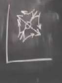

Sabit noktayı gayrı stabil gösterdik, bu doğru. 

Şimdi bütün bu yerel resimleri birleştirerek global bir resim ortaya
çıkartalım. 

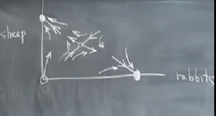

Bazı gözlemler yapalım, bir soru: eğer herhangi bir anda $x=0$ olsaydı, ne
olurdu? Bu durumda (5)'e göre yani $\dot{x}=0$, $x$ değişmez. Demek ki herhangi
bir anda $y$ ekseni üzerinde isek ($x=0$) o zaman sonsuza kadar orada takılı
kalacağız demektir bu. Biyolojik olarak bunun anlamı herhangi bir anda tavşan
yoksa ondan sonra da hiç tavşan yok. Eh bu kadar anlamsız değil herhalde,
tavşanlar gökten zembille düşmüyorlar, diğer tavşanlardan ürüyorlar. Bu oluşun
bir diğer ismi $x$ ekseni değişimsizdir (invariant) [gerçi hoca $y$ ekseni demek
  istedi herhalde ama anlaşıldı, $x=0$ ile alakalı olan eksen]. $y=0$ için aynı
durum var.

Analiz sırasında bu tür değişimsizlikleri, eğer varsa, bulmak faydalı olabilir. 

Global resim demiştik, ona devam edelim, bu resmi çizerken eyer düğümü
bilgilendirici, ilk onunla başlayalım,

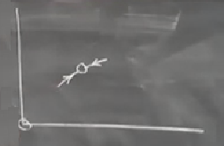

Sonra kendimize soralım, bu oklar nereden geliyorlar? Mantıklı bir açıklama
orijinden gelmeleri; diğer sabit noktalardan geliyor olamazlar çünkü gidiş
yolları o diğer noktalara yakınken onlara *doğru* gitmeli. O yolu çizince
geri kalanları

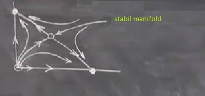

Sonsuzluktan direk ortadaki sabit noktaya giden eğriye eyer düğümünün stabil
manifoldu (stable manifold) ismi veriliyor, gerçi bu tek bir eğri, ona niye
manifold diyoruz [hakikaten manifold eğimli bir yüzeydir çoğunlukla]? Cevap bu
boyuttaki bir eğri ama daha yüksek boyutlarda bir yüzey olurdu, habire
terminoloji değiştirmemek için ona baştan manifold deniyor.

Dikkat edersek bu manifold bir tür ayraç niteliğinde, mesela noktalarla
gösterilen bölgedeki tüm başlangıç noktalarının hepsinin kaderi aynı.

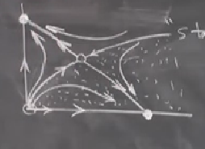

O bölgede başlayan her nokta sağ alttaki sabit noktasına akmak zorunda, bu nokta
tavşanların her şeye hakim olduğu nokta. Manifold üstündeki noktalar da aynı
kadere sahip, orada tüm akış "koyun cenneti'', tüm tavşanlar tükenmiş, sadece
koyun kalmış. "Kim kazanıyor?'' sorusunun cevabı böylece ilginç bir şekilde
cevaplanmış oldu, hem koyunların hem tavşanların bazı avantajları vardı, fakat
kimin kazandığı sadece başlangıç noktasıyla alakalı. Manifoldun altından
tavşanlar, üstünden koyunlar kazanıyor.

Tabii tam manifold üzerinde olunduğu durum çok ilginç, orada tam ortadaki sabit
noktaya bir akış olurdu ve bu nokta bir tür beraber yaşama durumudur, fakat bu
gidiş yolunun gayet gayrı stabil bir gidişat olduğunu görmek mümkün, çünkü o yol
üzerinde ufak bir sarsım (perturbation), 1 tane daha fazla ya da az tavşan
mesela bizi o gidiş yolundan çıkartıp, diğer sabit noktalara doğru gitmemize
sebep olacaktı. Biyologlar bu duruma "yarışsal dışarıda bırakmak (competitive
exclusion)'' ismi veriyorlar, eğer iki organizma aynı yarışsal niş (niche)
içinde yaşıyorlarsa stabil olarak beraber yaşamaları mümkün olmuyor. Her iki
organizma da ot yiyor, biri diğerinin tükenmesine sebep olacak.

Soru

Manifold'un denklemini bulmak mümkün mü?

Cevap

Güç serileri kullanarak onu yaklaşıksal, ve yerel bir bölgede temsil etmek
mümkün, fakat yüksek boyutlarda, tipik örneklerde global denklemi bulmak
çoğunlukla imkansızdır.

