# Ders 7

Bugünkü ilk konumuz bir önceki işlediğimiz iki boyutlu faz uzaylarının devamı,
muhafazakar sistemler. Fakat bu sistemlerin içinde bazı ekler var ki bu ekler bu
sistemlerin tipik dinamik sistemlerde görülmeyen çok ilginç bazı sonuçlar
sergilemesini sağlıyor.

Tek derece serbestliğe sahip ve Newton Kanunu $F=ma$'yı takip eden bir mekanik
sistemi hayal edelim, ama onu şu formda yazıyoruz,

$$ m\ddot{x} = F(x) $$

$m$ kütle, parçacığa etki eden kuvvet (force) $F$ var, ve bu kuvvet parçacığın
pozisyonu $x$'e bağlı, bir türev de ekliyoruz,

$$ m\ddot{x} = F(x) = -\frac{dV}{dx} 
\qquad (1)$$

$V$ potansiyel enerji. Burada farketmemiz gereken $F$'in spesifik şekli, hem
$\dot{x}$ hem $t$'ten bağımsız. Fiziksel dilde "sönüm (damping) yok''
denebilir, ayrıca sistem dışından etki eden, sistemi "süren'' bir şey de yok,
gerçi bir sabit üzerinden bunlar olabilir ama zamana bağlı olan bir etki yok.

Bu şartlar ışığında bir şeyler muhafaza edilecek, bu şaşırtıcı değil. Muhafaza
edilen enerji, yani kinetik artı potansiyel enerji,

$$ E = \frac{1}{2} m\dot{x}^2 + V(x) $$

muhafaza ediliyor. Bunu görmek için birkaç farklı yol var, eğer elde bir kuvvet
formülü var ise ve muhafaza edilen büyüklüğü arıyorsam, iyi bir numara formülün
iki tarafını $\dot{x}$ ile çarpmak, ve ortaya çıkan sonuca bakmak. (1)'i tekrar
düzenleyelim,

$$ m\ddot{x} + \frac{dV}{dx} = 0$$

$\dot{x}$ ile çarpalım,

$$ m\ddot{x}\dot{x} + \frac{dV}{dx}\dot{x} = 0 $$

Eşitliğin sol tarafına bakalım, ne görüyoruz? Orada mükemmel bir türev sonucu
var değil mi?

$$ = \frac{d}{dt} \big( \frac{m\dot{x}^2}{2} + V(x(t)) \big) = 0$$

Zincirleme Kuralının nasıl işlediğini düşünürsek türevin nasıl iki üstteki formüle
dönüştüğünü görebiliriz. Dikkat $x$, ya da $\dot{x}$'e göre değil, $t$'ye göre
türev alıyoruz. Buna göre $m\dot{x}^2$'nin türevini alınca $2m\dot{x}$ elde
ederiz, bir de Zincirleme Kuralından bir $\dot{x}$ daha ortaya çıkar. 

Neyse, üstteki türev sıfıra eşit, bu bize o formülün zamandan bağımsız olduğunu
söylüyor, yani $E$ sabit. Ya da şöyle söylemek daha iyi: gidiş yolları üzerinde
$E$ sabittir, bir dinamik sistemin gidiş yolunu takip ederken, takip ettiğimiz
nokta konum uzayında nereye giderse gitsin $E$ fonksiyonunun değeri
değişmeyececektir. Bu sürpriz değil, enerjinin muhafaza edildiğini
biliyorduk, fakat üstteki de bunu görmenin güzel bir başka yolu.

Daha genel muhafazakar sistemler de var, biyolojide ortaya çıkabiliyorlar, bir
örnek soruda bir kağıttan uçağı düşünüyoruz, onu attık diyelim, biraz uçuyor
uçuyor sonra bir yere konuyor. Meğer, belli bazı basitleştirici önkoşullar
ardından bu sistem de muhafazakar bir sistem. Bu sistemde muhafaza edilen
büyüklük enerji gibi kolay irdelenebilen bir büyüklük değil, başka bir şey. 

Daha genel olarak muhafazakarlığı belirtmek istersek, $\dot{\underline{x}} =
\underline{f} (\underline{x})$ muhafazardır eğer muhafaza edilen bir değer
$E(\underline{x})$'e sahipse. $E$ sürekli, reel değerli, ve gidiş yolları
üzerinde sabit olan bir fonksiyon olmalı, yani sabitliğin diğer bir ifadesi
zamana göre türevin sıfır olması, $\frac{dE}{dt}=0$. Burada ek bir püf nokta;
eğer $E$ mesela 17 gibi sadece basit bir sabit sayı olsaydı, üstteki türev yine
doğru olurdu; bu tür aşırı basit (trivial) çözümleri de istemiyoruz, yoksa her
sistem muhafazakar sistem olur [sebebi alttaki soruyla anlaşılabilir, basit
 sabitlik çok fazla sistemin muhafazakar olması demektir, bu da istediğimiz
 türden bir tanım değil], bu sebeple "$E(\underline{x})$'in her açık kümede
sabit olmaması'' şartını getiriyoruz, bu tanım topoloji, analiz ile alakalı,
aşırı detayına burada girmek istemiyorum, ama böylece $E$'nin sabitliğinden
kurtuluyoruz.

Soru

Bir muhafazakar sistemin kendine doğru çeken (attracting) sabit noktası
olamayacağını göster.

Cevap

Farz edelim ki $x^\ast$ bir kendine çeken sabit nokta. O zaman bu noktaya doğru
akan, onun etkisi altındaki noktaların hepsinin aynı enerji $E(x^\ast)$'ye sahip
olması gerekir çünkü enerji tüm gidiş yollarında sabit demiştik, ve etki
alanındaki tüm noktalar sabit noktaya akıyor. Fakat bu durumda $E(x)$ sabit bir
fonksiyon olmalı, çünkü pek çok farklı gidiş yolu üzerinde enerji aynı, ve
hepsinin zamana göre türevi sıfır! Bu sonuç muhafazakar sistem tanımımız
$E(x)$'in tüm açık kümelerde sabit olmaması şartına ters düşüyor. 

Örnek

İki kuyulu potansiyel (double-well potential) içinde parçacıkları üzerinden bir
örnek görelim [fizikte potansiyelin minimum noktası çevresindeki bölgeye kuyu
deniyor, bu örnekte iki tane var]. Şu şekilde bir potansiyel fonksiyon olsun,

$$ V(x) = -\frac{1}{2}x^2 + \frac{1}{4}x^4 $$

Grafiği çizince alttaki gibi bir şekil çıkar, çünkü $-x^2/2$ $x=0$'dan sola
doğru o aşağı inen parabolu çizmiş olur, daha büyük $x$'ler için $x^4$ baskın
çıkar, ve iki minimum vardır. 

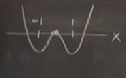

$1/2$ ve $1/4$'ü denkleme koydum çünkü üstteki $-1,1$ minimum değerlerinin
ortaya çıkmasını istedim. Bu potansiyel fonksiyonu üzerinde "gezinen'' bir
parçacık her iki minimumun herhangi birinde kalmaktan mutlu olur. Sistemi idare
eden denklemler altta, basitleştirme amaçlı olarak $m=1$ alalım (ya da zamanı
ölçekleyerek $m$ etkisi $m=1$ olacak şekilde ayarlayabilirdik). Diferansiyel
denklemler,

$$ \ddot{x} = -\frac{dV}{dx} = x-x^3 $$

Alın size güzel bir gayrı lineer sistem. Şu anda ikinci derece bir denklem, onu
tek dereceli olacak şekilde tekrar yazacağız.

$$\dot{x} = y$$

olarak tanımlayalım, o zaman,

$$\dot{y} = x - x^3$$

olur. 2 boyutlu sistemimiz bu, onu daha önceki derste yaptığımız gibi analiz
etmek istiyoruz; sabit noktalarını bulmak, sabit noktalarda Jacobian'ı
kullanarak onları sınıflamak amacımız. Jacobian,

$$
\left[\begin{array}{rr}
\frac{\partial \dot{x}}{\partial x} & \frac{\partial \dot{x}}{\partial y} \\
\frac{\partial \dot{y}}{\partial x} & \frac{\partial \dot{y}}{\partial y} 
  \end{array}\right] =
\left[\begin{array}{cc}
0 & 1 \\ 1-3x^2 & 0
\end{array}\right]
$$

Üstteki matrisin sabit noktalardaki değerini istiyoruz. $\dot{x}=0$ demek $x=0$
demektir. İkinci ifadeye bakalım, $x - x^3 = x(1 - x^2)$, bu ifade $x=0$ ya da
$x = \pm 1$ olunca sıfırdır. Yani üç tane sabit nokta var,

$(x^\ast,y^\ast) = (0,0)$, o zaman $\left[\begin{array}{rr} 0 & 1 \\ 1 & 0\end{array}\right]$.

$\tau=0$, $\Delta = -1$, yani bir eğer (saddle). Lineerizasyona inanıyoruz,
şüpheye gerek yok.

$(x^\ast,y^\ast) = (\pm 1,0)$, o zaman $\left[\begin{array}{rr} 0 & 1 \\ -2 & 0\end{array}\right]$.

$\tau=0$, $\Delta = 2$, demek ki bir merkez var [hoca şimdi alarm zili sesi
çıkartıyor]. Hatırlarsak merkezler için lineerizasyona güvenemiyoruz. Fakat
birazdan göreceğiz ki eğer ortada muhafaza edilen bir enerji var ise, yani
muhafazakar sistem durumunda gayrı lineer sistemde de hakikaten merkez var.

Önce bu sistemde enerjinin ne olduğunu tanımlayalım. Enerji yarı kinetik yarı
potansiyel enerjinin toplamı. 

$$ E = \frac{1}{2}y^2 - \frac{1}{2}x^2 + \frac{1}{4}x = sabit $$

Enerji gidiş yolları üzerinde sabit. Bu denklem kapalı eğrileri (closed surves)
temsil ediyor, bu eğrileri nasıl görebiliriz? Merkezin gerçekten merkez olduğunu
görmek için de bu iyi bir yöntem, sarmal yerine kapalı eğriler olacağını
görürsek, elimizde bir merkez olduğuna ikna olabiliriz. Faz portresi şöyle,

Orijinde bir sabit nokta var, ve $x=-1,1$'de merkezler.

Orijin yakınında neler olduğunu anlamak için, diyelim ki $x,y$ küçük ise $x^2$'e
göre çok küçük kalacak $x^4$ terimi yoksayılır, geri kalanlar $y^2$ eksi $x^2$
eşittir sabit, ki bu hatırlanacağı üzere bir hiperbol (hyperbola) ortaya
çıkartır. 

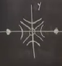

Bu pek şaşırtıcı değil çünkü orijinde bir eğer noktası var. Orijinden çıkan
çizgiler üsttekine benzeyecek, "hiperbolik'' şeyler bunlar.. Peki okların yönü
ne acaba? Bu bilgi için $\dot{x} = y$ formülüne bakmak yeterli, $y$ pozitif
olduğu zaman $\dot{x}$ de pozitif. O zaman üstteki grafikte $y$'nin pozitif
olduğu üst kısımda eğriler sağa doğru gidecek. Alt bolumde ise tam tersi, sola
gidecekler. 

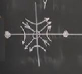

Peki iki yandaki noktalar? Siz de kontrol edebilirsiniz, ama büyük ihtimalle
çembersel, kapalı yörüngeler olacaklar. Eliptik te olabilir, kontrol
edin. Okların yönü yakınlarındaki oklara bakılırsa alttaki gibi,

$\dot{y}$'ni nerede sıfır olduğuna bakalım. $\dot{y}$'in sıfır olması sadece
yatay gidiş var demektir, 

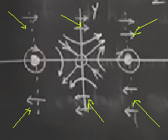

ki $\dot{y}$'in sıfırlık durumu $x=0$ ve $x=\pm 1$'de, üstteki resimde yeşil
oklar bu noktalardaki bu yatay gidişi gösteriyor. 

Devam edelim, $\dot{x}=0$ olduğu zaman $y=0$ olur, yani $x$ ekseni üzerindeyiz
ve buralarda, ve büyük $|x|$ için sağ tarafta eksilik yani aşağı gidiş baskın
çıkar, solda yukarı çıkış baskın çıkar.

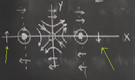

Tüm eğrileri birleştirme zamanı geldi. Denklemdeki simetriye dikkat edelim,
$y^2$ ve $x^2$ üzerinden $x$ ve $-x$, $y$ ve $-y$ arasında simetri var, yani
resmin üst kısmının alt kısmıyla simetrisi olacaktır. 

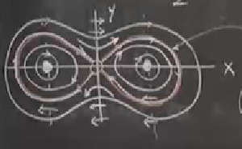

Kırmızı ile işaretlediğim ise homoklinik yörünge (homoclinic orbit). Bu özel bir
gidiş yolu. Latince homo aynı, klinik meyil, yani homoklinik bir nokta isek o
noktaya tekrar dönmeye meyil, bizim için bu sabit noktada başlayan bir gidiş
yolunun tekrar aynı sabit noktaya dönmesi. Tabii bu "kabaca'' doğru bir tanım,
gerçekte homoklinik yörüngede gidişin aynı sabit noktaya dönmesi sonsuz zaman
alıyor. Ayrıca dikkat edersek homoklinik yörünge periyotsal (periodic)
değil. Orijinden çıkıp saat yönünden orijine dönüp habire dönüp
durmuyoruz. Periyotsal olan diğer gidiş yolları var ama.

Fiziksel olarak bu resim ne söylemeye uğraşıyor? 

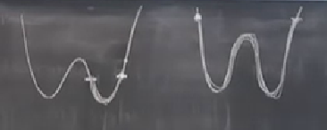

Bir kapalı yörünge üstte soldaki resimdeki iki nokta arasında habire gidip gelen
bir inişi çıkışı temsil ediyor. Enerji ona yetiyor. Daha büyük dışarıda olan
gidiş yolları ise üstteki sağ resimdeki iki nokta arasında, daha büyük inişler
çıkışlara tekabül ediyor, bunun için enerji daha fazla olmalı çünkü ortadaki
ufak tepeyi arada aşmak lazım. Homoklinik yörünge ise aşılamadığı zaman o
ortadaki tepeciğin zirvesine yavaş yavaş yaklaşıldığı durum. 

Hala eğrilerin kapalı olduğuna inanmıyorsak üç boyutta gösterebileceğimiz enerji
yüzeyine (energy surface) bakabiliriz, bu yüzey $E(x,y) = \frac{1}{2}y^2 -
\frac{1}{2}x^2 + \frac{1}{4}x^4$ üzerinden çizilebilir. Eksenleri şöyle
gösterelim,

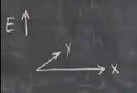

Grafiği çizmeden önce neye benzeyeceğini tarif etmeye uğrasayım; küçükken benim
çocuklarımın ilginç pijamaları vardı, pijamalar tek parçaydı, bacaklar, ayakları
tamamen kaplıyordu. Bu grafik te ona benzeyecek, aşağı inen iki bölüm olacak, bu
bölümlerden en altta öne doğru çıkıntılar olacak [gerçi hocanın birazdan
çizeceği şekil direk aşağı gidiyor ama, neyse, belki pijamaların giyilmemiş hali
alttaki gibi duruyor].

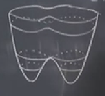

Genel bir yanlışlığa deyineyim, insanlar çoğunlukla gidiş yollarını bu şeklin
dış yüzeyinde kafasına göre, herhangi bir yönde hareket eden şekilde hayal etmek
istiyorlar. Bu doğru değil. Hatırlarsak gidiş yolları $x,y$ düzleminde
yaşıyorlar, ve gidiş belli bir $E$ seviyesine göre. O zaman yüzeyde ama $E$
değişmeyecek şekilde, sanki üstteki üç boyutlu şeklin bir kesit seviyesinde
hareket ediyormuş gibi düşünürsek daha iyi.

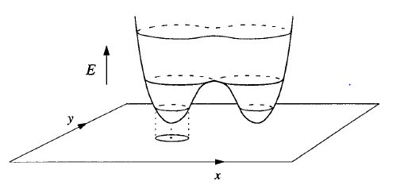

Bunu özellikle söyledim çünkü dört yukarıdaki resimde aşağı iniş, çıkış vardı,
o potansiyel fonksiyonunun grafiğiydi, o farklı.

Teori

Muhafazakar sistemler ve 2D gayrı lineer merkezlerininin teorisi şöyle.

Diyelim ki $\dot{\underline{x}}=\underline{f}(\underline{x})$ muhafazakar bir
sistem, $\underline{f}$ sürekli ve türevi alınabilir, $\underline{x} \in
\mathbb{R}^2$ yani 2 boyutlu düzlem üzerindeyiz. $E(\underline{x})$ muhafaza
edilen bir büyüklük. Gerçekten ihtiyacımız olacak bir teknik detay daha,
$\underline{x}^\ast$ sadece bir sabit nokta değil, ayrıca *izole* bir sabit
nokta.

İzole derken $\underline{x}^\ast$'in yakınında başka hiçbir sabit nokta olmadığı
söyleniyor. Detaylandırmak gerekirse 2 boyutta $\underline{x}^\ast$'e bakıyorum ve
onun etrafında $\epsilon$ yarıçapında bir çember çiziyorum, bu çember içinde
başka bir sabit nokta yok. İzole noktalar daha yaygın tabii, şimdiye kadar pek
çok örnekte onları gördük. İzolasyonun olmadığı bir durum neye benzerdi?
Hakikaten olası bir durum mu bu? Bir çizgi, ya da düzlem üzerindeki tüm
noktaların sabit nokta olabildiği durumlar var, ama bu durumlar haricinde de
izolasyona uymayan örnekler kurgulanabilirdi.

İçinde çok hızlı salınan sinüs fonksiyonu olan bir sistem böyle sabit noktalar
ortaya çıkartabilir. $x$'in bir üsteli çarpı $\sin(1/x)$ mesela, bu bir noktaya
yaklaşan ve araları sürekli azalan bir seri sabit noktayı üretebilir. Üstte
görülüyor, en soldaki noktaya sürekli yaklaşan diğer noktalar.. Bu durumda o en
soldaki nokta izole olmaz.

Devam edelim, eğer bu izole sabit nokta fonksiyon $E(\underline{x})$'nin yerel
minimum ya da maksimumu ise o zaman $\underline{x}^\ast$ bir merkezdir (yani
$\underline{x}^\ast$'a yeterince yakın olan tüm gidiş yolları kapalıdır). 

Bu ne demektir? Mesela iki üstteki resmi ele alalım, aşağı inen çukurlardan
soldakinin (ki $x,y$ üzerindeki yansıması resimde gösteriliyor) minimum
noktasını alırız, ve pat diye bu bir merkez olur.

İspatın ana fikri şöyle: $E$ gidiş yollarında sabit, o zaman gidiş yolları
$E$'nin konturlarında yaşıyor olmalı. Yani gidiş yolu bir kesit seviyesi (level
set) içinde olmalı. Kesit seviyesinin tamamı olabilir mi? Olabilir, ama bu şart
değil.

Konturlar maksimum ya da minimum yakınında kapalı eğrilerdir. Bunu ispatsız
veriyoruz ama sezgisel olarak geometrik düşünce yeterli; bir çukuru alalım, onun
dip noktası yakını az üstünde çukuru keselim ve bu kesit seviyesine bakalım,
orada kapalı bir eğri göreceğiz. Tam ispat için dolaylı (implicit) fonksiyon
teorisi gerekli, biz o konulara girmeyeceğiz. Ayrıca, kontur üzerinde bir sabit
nokta olup olmadığını nereden biliyoruz? Çünkü izolasyon şartını getirdik, bir
sabit nokta yakınında başka sabit nokta olamaz. 

Başka bir örneğe geçelim, bu örnek sarkaçları kullanacak.

Problemi genel hatlarıyla anlayabilek için boyutsuz formda yazalım, yani
sarkacın boyunu ve yerçekimsel ivmeyi yok sayalım.

$$ \ddot{\theta} + \sin\theta = 0 
\qquad (2) $$

Sönüm (damping) ya da dışarıdan ittirme (driving) olmadığını farzediyoruz, yani
hala işlediğimiz altyapıyı kullanıyor olacağız.

Diyelim ki $v = \dot{\theta}$. O zaman $\dot{v} = -\sin\theta$. 

Enerji fonksiyonu icin (2)'yi $\dot{\theta}$ ile çarparız ve entegre ederiz. 

$$ \dot{\theta}(\ddot{\theta} + \sin\theta) = 0 \Rightarrow
\frac{1}{2} \dot{\theta}^2 - \cos\theta = sabit
$$

Jacobian,

$$ A = 
\left[\begin{array}{rr}
\frac{\partial \dot{\theta}}{\partial \theta} & \frac{\partial \dot{\theta}}{\partial v} \\
\frac{\partial \dot{v}}{\partial \theta} & \frac{\partial \dot{v}}{\partial v} 
  \end{array}\right] =
\left[\begin{array}{cc}
0 & 1 \\ -\cos\theta & 0
\end{array}\right]
$$

Sabit noktaları düşünelim, $v$ sıfır olmalı, $-\sin\theta$ sıfır olmalı, bu da
sadece 0, $\pi$, $2\pi$, .. anlarında, yani $\pi$'nin tamsayı katlarında
olabilir.

(0,0) sabit noktasında $A = \left[\begin{array}{rr} 0 & 1 \\ -1 &
 0 \end{array}\right]$ verir, $\tau = 0$, $\Delta = 1$. Bu bir lineer merkez.

Muhafazakar sistem demiştik, muhafaza edilen büyüklük $E = \frac{1}{2}v^2 -
\cos\theta$. (0,0) noktasında yerel minimum var, o zaman lineer merkez gerçekten
bir merkez. Bu fiziksel duruma uyuyor, $\theta=0$ sarkacın tam dik aşağı doğru
durduğu hali temsil ediyor, bu tabii ki stabil bir nokta (hiç hareket yok,
sarkaç öyle duruyor), bu nokta etrafında ufak salınımlar olabiliyor.

Soru

Sabit nokta (0,0)'in $E$'nin minimumu oldugunu nereden biliyoruz?

Cevap

Enerji fonksiyonu $E$'nin (0,0) etrafında Taylor açılımını yaparım. Önce
$\cos\theta$'nin açılımını hatırlayalım,

$$ \cos\theta = 1 - \frac{\theta^2}{2!} + ... $$

O zaman 

$$ E = \frac{1}{2}v^2 - [ 1 - \frac{\theta^2}{2} + ...  ]  $$

$$ = \frac{1}{2} (v^2 + \theta^2) + ... $$

Üstteki sonuca kuşbakışı bir göz atalım.. Bu bir paraboloid değil mi? Ve bu
fonksiyonun $v=0,\theta=0$'da minimumu var.

Özetle, muhafazakar sistemlerde merkez bulunca bu adımları takip ediyoruz. Sabit
noktaya bakıp onun bir yerel min ya da maks olup olmadığını kontrol
ediyoruz. Öyle ise elimizdeki gerçek bir merkez. 

Soru

Ya enerji fonksiyonu gerçekten fiziksel bir enerji olmasaydı o zaman muhafaza
edilen bir değeri nasıl bulurduk?

Cevap

Evrensel bir yaklaşım var diyemeyeceğim, ama o değeri bulmak için bazı numaralar
var. Ödev sorularımızın bazıları bununla ilgili. 

Devam edelim, bir diğer sabit nokta $v = 0$, $\theta = \pi$. Bu parametrelerde
sarkaç başlangıç noktasından 180 derece yukarıda, tam yukarıda duruyor
yani. Doğal olarak bu sabit noktanın stabil olmayacağını bekleyebiliriz
(sarkacın dönüp dönüp başlangıçtan tam zıt noktada durması gayet zor). 

$(0,\pi)$ için $A = \left[\begin{array}{rr} 0 & 1 \\ 1 &  0\end{array}\right]$, yani
bir eyer düğümü var. 

Enerji fonksiyonunun şekline bakarak, ya da farklı sabit noktaların yakınında
özvektörlere bakarak alttaki gibi bir resme ulaşabiliriz. Zaten biraz önce
gördüğümüz paraboloid'den hareketle orijin etrafında konturlar çember olacaktır.

Grafiğin üst sağ çeyreğine bakarsak, orada $v$ pozitif ise, $\dot{\theta}$
pozitif. Oklar çember üzerinde saat yönünde, ya da hep $\theta$'ya doğru. Alt
sağ çeyrekte tam tersi, sola gidiş var. 

Bu sistemde de bir homoklinik yörünge var. Gerçi hayal etmesi biraz zor ama,
diyelim ki sarkaç tam tepe noktada (sabit), ama stabilite yok, oradan azıcık
sapınca tekrar aşağı düşüş başlıyor, ve dönüp dönüp tekrar yukarı geliyor ve
sonuşur şekilde (asymptotically) oraya yaklaşıyor. Gerçi homoklinik olmak için
aynı sabit noktaya dönmek lazım demiştik ama fiziksel olarak yine aynı
"duruma'' dönüş yapıyoruz. Fakat tam teknik olmak gerekirse, bu bir
hetrokliniklik örneği, sabit noktalar değişiyor, bazıları bu duruma "eğer
bağlantısı (saddle connection)'' ismi veriyor.

Tüm bağlantıları yaparsak, 

İşte sarkaç problemini böylece çözmüş olduk.

Grafikteki en üst eğriye tekabül eden hareket nedir? Sarkaç sürekli
dönüyor. Peki en alt? Sarkaç yine dönüyor ama tam ters yöne doğru. Daha iç
kısımdaki çemberlerdeki gidiş yolları ise sarkacın ufak hareketleri, sağa sola
salınım var ama büyük hareketler yok. Lise fizik dersinde incelenen hareketler
bunlar. Sol ve sağdaki sabit noktalara yaklaştıkça daha büyük hareketler oluyor,
heteroklinik yörüngede koca bir tur var, ondan dışarı doğru, ilk başta dediğimiz
gibi, habire dönüşler var.

Biraz önce hetro mu, homo mu diye (ufak) bir kararsızlık yaşadık, ama aslında
kararsızlığın sebeplerinden biri faz uzayını temsil şeklimizle alakalı. Faz
uzayını $v,\theta$ bağlamında bir düzlemde gösterdik, ama bir silindir şeklinde
de gösterebilirdik, yani bir düzlemde iki uçta $-\pi$ ve $\pi$ göstereceğimize,
o düzlemi alıp katlarız, uçları birleştiririz, bir silindir elde ederiz. Bu
silindir aslında sarkaç için en uygun faz uzayı.

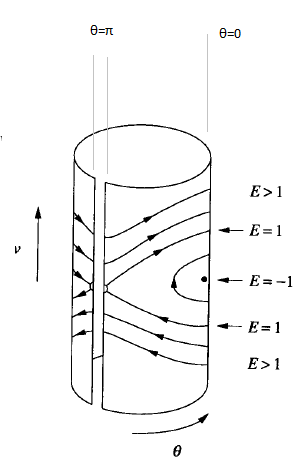

Soru

Hetroklinik yörüngeler için daha belirgin bir örnek var mı?

Cevap

Belki biraz çetrefil olacak ama, bazı problemlerde dalgaları inceliyorsunuz
mesela alttaki gibi bir hareket var,

Çözümü dalga fonksiyonu olarak aldığımız bir kısmı diferansiyel denklem (partial
differential equation -PDE-) çözümünde, yani çözümde $u(x-ct)$ faraziyesi
oluyor, vs. bunu PDE'ye sokuyoruz, çoğunlukla PDE'yi bir ODE haline
getirebiliyoruz, ardından dalga çözümlerine bakarken bu çözümlerin bir özelliği
oluyor, mesela bir $\xi$ değişkeni üzerinden diyelim, $\xi = \infty$ ve $\xi =
-\infty$'da iki düzlük var, yani iki farklı konum var, ve birinden diğerine
geçiş.

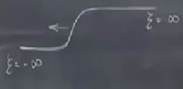

Belki bu çok çetrefil bir örnek oldu! Ama özetlemek gerekirse, evet, hetroklinik
yörüngeler kesinlikle ciddi araştırmalarda kullanılıyor.

