# Ders 9

Bu derste kapalı yörüngeleri (closed orbits) işleyeceğiz, bir sistemin kapalı
yörüngesi olup olmadığını bulmamızı sağlayan teknikleri göreceğiz. Kapalı
yörüngeler bizi ilgilendiriyor çünkü onlar bir dinamik sistemin temel
davranışlarından birini temsil ediyorlar: periyotsal davranış, yani aynı konuma
tekrar tekrar dönmek. Sabit konumlar bu davranışın tam tersi, sabit noktalar
denge anlarıdır, bu anlarda kalıcı durum (steady state) vardır.

1) Kapalı yörünge olma seçeneğini elemek

a) İndis Teorisi: önceki derste görmüştük, eğer $\mathbb{R}^2$'de bir kapalı
yörünge var ise o yörünge içinde sabit noktalar olmalıdır ve bu noktaların
indekslerinin toplamı +1 olmalıdır.

Bu arada bazen kapalı gidiş yolu, bazen kapalı yörünge diyorum, bu tanımların
ikisi de aynı şey. Limit çevrimleri kapalı yörüngelerin özel bir durumu, onların
izole hali daha doğrusu.

Üstteki kolay bir yöntem, ama çok kuvvetli bir yöntem denemez. En iyi test altta
göreceğimiz.

b) Dulac'ın Kriteri

Vektör alanı $\dot{\underline{x}} = \underline{f}(\underline{x})$ pürüzsüz,
$\underline{x} \in \mathbb{R}^2$, ki $\mathbb{R}$, $\mathbb{R}^2$ içindeki
basitçe bağlantılı (simply connected) bir bölge. "Basitçe bağlantılı'' sözü
teknik bir terim, topolojiyle uğraşmayanlar çoğunlukla onunla karşılaşmazlar,
anlamı bir bölgenin delikli olmadığı. 

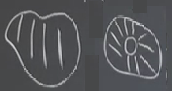

Üstteki şekillerden soldaki basitçe bağlantılı, sağdaki değil. Deliksizlik de
çok net bir tanım değil aslında, resmi tanım şöyle, bir bölge basitçe
bağlantılıdır eğer o bölgeye bir kapalı döngü koyarsak, ve o döngüyü aynı
bölgeyi terketmeden küçülte küçülte bir noktaya indirgeyebilirsek.

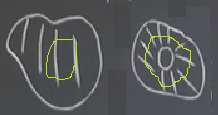

Üstteki soldaki şekle bir döngü koydum, ufaltıp onu tek bir noktaya
indirgeyebilirim, bunu yaparken hala aynı bölge içinde kalabilirim. Ama sağdaki
için aynı şeyi yaparsak ortadaki boşluk yüzünden bölgeyi terketmiş
olurum.

Basitçe bağlantılı bölge kavramını birazdan Dulac'ın kriterini ispatlarken
kullanacağız. Kriter şöyle,

Eğer $\exists$ pürüzsüz, reel değerleri fonksiyon $g(x)$ ise, öyle ki $\nabla
\cdot (g \dot{\underline{x}})$ $R$ bölgesinde sıfır değil ve tek bir işarete
sahip (artı / eksi bağlamında), o zaman $R$ içinde $\cancel{\exists}$ kapalı
yörünge. Not: $\exists$ işareti mevcut, en az bir tane vardır demek,
$\cancel{\exists}$ tam tersi, $\nabla$ ise uzaklaşım (divergence).

İspat çok basit, örnek üzerinden daha kolay anlaşılacak.

Örnek

Alttaki sistemin $x>0$, $y>0$ bölgesinde kapalı yörüngesi olmadığını göster.

$$ \dot{x} = x(2 - x - y) $$

$$ \dot{y} = y(4x - x^2 - 3) $$

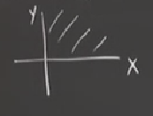

Baktığımız bölge 1. çeyrek ve $x,y$ eksenlerini dahil etmeden üst sağda kalan
bölge. 

Cevap

Teorinin belirttiği şartlara uyan bir $g$ nasıl bulacağız? Metotun bir zayıf
noktası bu aslında, $g$'yi bir şekilde bulmak lazım, bunu yapmak için de bir
kısayol, püf nokta bilmiyorum, uyana kadar birkaç fikri denemek gerekli. Ama
bazı fonksiyonlar "çoğunlukla'' işliyor, onların biriyle başlayayım, $g =
1/xy$.

Bu fonksiyon pürüzsüz, eğer $x=0,y=0$'dan uzak durursam, ama zaten soru da bunu
yapmamı söylüyor, yani problem yok. Şimdi $\nabla \cdot (g \dot{x})$'i
hesaplayayım, yani uzaklaşımı. Uzaklaşımın ne olduğunu hatırlıyoruz herhalde,
bir fonksiyonun tüm öğeleri $x,y,..$ için kısmi türev alınır ve bu türevler
birbiriyle toplanır.

$$
\nabla \cdot (g(\dot{\underline{x}})) =
\frac{\partial }{\partial x} (g \dot{x} ) +
\frac{\partial }{\partial y} (g \dot{y} )
$$

Basitleştirirsek,

$$
\frac{\partial }{\partial x} \bigg( \frac{2 - x - y}{y} \bigg) + 
\frac{\partial }{\partial y} \bigg( \frac{4x - x^2 - 3}{x} \bigg)
$$

Sağdaki terimde $y$'ye bağlı hiçbir şey yok; o terimin $y$'ye göre kısmi
türevini aldığımıza göre o terim tamamen sıfır olur. Soldaki terim $x$'e göre
kısmi türev, ve orada sadece $-x/y$ içinde $x$ var, türev sonrası geri kalanlar
$-1/y$, yani üstteki tüm ifade

$$ = - \frac{1}{y} $$

olur. Daha önce $y > 0$ demiştik, o zaman üstteki ifade sadece negatif değere
sahip olabilir. Yani o bölgede tek bir işaret var, yani o bölgede kapalı yörünge
yok.

Soru

$\nabla$ işareti ne anlama geliyor?

Cevap

$\nabla$'ya "del operatörü'' ismi de veriliyor, kısmı türevlerden oluşan bir
vektör aslında, $x$'e, $y$'ye göre kısmi türev al, sonuçları bir vektörün
hücresine yaz. Gradyanları daha önce gördüyseniz bu sembolü de
görmüşsünüzdür. Çok Değişkenli Calculus'ta da del operatörü işlenir. 

$$ \nabla =
\bigg(
\frac{\partial }{\partial x}, 
\frac{\partial }{\partial y}
\bigg) $$

Sonra biz yukarıdaki sonucu noktasal çarpım yaparak toplam haline getiriyoruz. 

Soru

$g$'yi nasıl bulduk?

Cevap

Dediğim gibi $g$'yi bulmak işin sanatsal tarafı; iyisini bulmak için şanslı
ya da çok akıllı olmak lazım. Dinamik sistemler araştırmasında pek çok
problem var ki eğer onlar için doğru $g$'yi bulabilsek, çok önemli, ünlü
bazı problemleri çözmüş olacağız. Hala kimse onları bulamadı.

Soru

Gösterdiğiniz testi kapalı yörünge *olduğunu* ispat için kullanabilir miyiz?

Cevap

Yani, mesela, $g$ hem negatif hem pozitif oluyor, vs? Hayır, bu test sadece
negatifte işleyen bir test, yani sadece kapalı yörünge olmadığını ispat etmek
için kullanılabilir. Ama sonra pozitif türden bir test göreceğiz.

Devam edelim; Evet Dulac yönteminin problemi bir $g$ bulmanın zorluğu. Bazen çok
basit bir $g$ seçmek işe yarıyor, mesela $g=1$, o zaman geri kalan tek hesap
vektör alanının uzaklaşımını hesaplamak. Diğer işleyen tipik bazı seçenekler -
mesela $g = \frac{1}{x^a y^b}$ ki $a,b$ tam sayı ve 1,2 gibi üstler. Bazen
$e^{kx}$, ya da $e^{ky}$ işe yarıyor..

İspat

Çelişki ile ispat yöntemini kullanacağız. $T$, $R$ bölgesi içinde kapalı bir
yörünge, $A$ ise $T$ içinde bir bölge olsun. $R$ basitçe bağlantılı olduğu için
$A$'nın $T$ içinde olması demek $A$'nın aynı zamanda $R$ içinde olması da
demek ($R$ içinde hic delik yok, $A$'nın tamamı $R$'nin içinde).

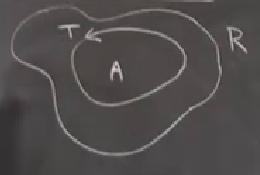

$T$ kapalı bir gidiş yolu olduğu için üzerindeki her noktada vektör alanı ona
teğettir, yani örnek bir noktada $\dot{\underline{x}}$ alttakina benzer,

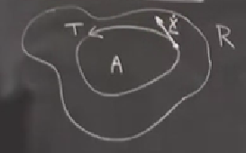

İspat için Green'in Teorisi'ni kullanacağız, ya da 2 boyutta Uzaklaşım
Teorisi. Uzaklaşım Teorisinin kullanacağımı tahmin edenleriniz olmuştur belki
çünkü Durac hesabının kendisi de uzaklaşımı kullanıyor. Green'in Teorisi neydi?

$$
\int \int_{A} \nabla \cdot \underline{F} \mathrm{d} A =
\oint_T \underline{F} \cdot \underline{n} \mathrm{d} l
$$

Vektör alanı $F$ var, onun uzaklaşımını hesaplıyoruz, ve bir alan hesabı için
çift entegral hesabı yapıyoruz, bu hesap bize $\underline{F} \cdot
\underline{n}$'in $T$ bölgesindeki çizgi entegrali (line integral) ile aynı
sonucu verir. $\underline{n}$, $T$ gidiş yolunda teğete dik olan birim normal bir
vektör, $\mathrm{d} l$ ise $T$ eğrisinin sonsuz küçüklükteki bir parçası. 

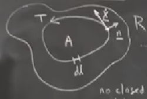

Green Teorisi bu, daha doğrusu onun bir çeşidi, uzaklaşım çeşidir. Bir diğer
çeşidi daha var, ona curl çeşidi deniyor. Çelişkiyle ispat demiştik, nerede
çelişki? Eğer $F$ için $g \dot{\underline{x}}$ kullanırsam, 

$$
\int \int_{A} \nabla \cdot \big( g \dot{\underline{x}} \big) \mathrm{d} A =
\oint_T  \big( g \dot{\underline{x}} \big)  \cdot \underline{n} \mathrm{d} l
$$

elde ederim. Çelişki görülüyor mu? Eşitliğin sağındaki $\dot{\underline{x}}
\cdot \underline{n}$ çarpımına bakalım, bu birbirine dik iki vektörün noktasal
çarpımıdır, ve dik oldukları için sıfır sonucunu verir. Fakat faraziyemiz o ki
eşitliğin sol tarafı tek işareti olan bir değer, yani sıfır değil. Çelişki bu,
eşitliğin sol tarafı sıfır değil, sağ tarafı sıfır diyor. O zaman şu sonuca
varıyoruz, $R$ bölgesinde $T$ ile gösterdiğimiz bir kapalı gidiş yolu mümkün
değildir.

Soru

Farklı seçilen $g$'ler bize farklı işaretler verebilirler değil mi?

Cevap

Evet. Birden fazla işleyen $g$ olabilir, ve bunlar birbirinden farklı işaret
sonucu verebilir. Hatta bunu ispatı çok kolay, eğer $g$ işliyorsa $-g$ de işler,
ve $-g$ bize ters işarette bir sonuç verir. Tabii "kötü'' $g$ seçilmişse bazen
eksi bazen artı sonuçlar görebilirsiniz, ama bu bize hiçbir şey söylemez. Kötü
$g$ ve farklı işaretler hiçbir şeyin ispatı değil. 

Örnek

$$ \dot{x} = y $$

$$ \dot{y} = -x -y +x^2 + y^2 $$

$g=e^{2x}$ seçelim. 

$$
\frac{\partial }{\partial x} \big( y e^{-2x} \big) +
\frac{\partial }{\partial y} \big( y e^{-2x} (-y+y^2) \big) 
$$


$$ = -2 e^{-2x}y - e^{-2x} + 2y e^{-2x}$$

$$ =  - e^{-2x} < 0$$

Sonuç kesin negatiftir, çünkü $e$ her zaman pozitif sonuç verir, onu eksi ile
çarparsak her zaman negatif olan bir sonuç ortaya çıkar.

Test bize kesin negatif (yani sıfır olmayan ve sıfırdan küçük -strictly
negative-) bir sonuç verdiyse, bu bize üstteki sistemin tüm düzlem, yani
$\mathbb{R}^2$ üzerinde hiçbir kapalı yörüngesi olmadığını söylüyor.

Dulac böyle. Gerçi itiraf edeyim 20 senedir dinamik sistemlerle uğraşıyorum ve
bu testi hiç kullanmadım, ama bu benim üzerinde çalıştığım konularla alakalı
olabilir. Nüfus biyolojisindeki araştırmacıların Dulac'ı kullandığını gördüm.

Yörünge olmadığını nasıl ispat edebileceğimizi gördük, şimdi de yörünge olduğunu
nasıl ispatlarız onu görelim.

Poincare-Bendixson Teorisi (PVT sadece iki boyutta geçerlidir)

Şartlar,

1) $R$ = kapalı ve sınırlanmış bölge $\mathbb{R}^2$'de. Sınırlanmış derken
sonsuza gitmiyor.

2) $\dot{\underline{x}} = \underline{f}(\underline{x})$ pürüzsüz, her zaman olduğu
gibi. 

3) $R$ bölgesi içinde hiç sabit nokta yok. Bu önemli bir özellik. Bu teori nihai
olarak tüm gidiş yollarının kapalı bir yörüngeye yaklaştığını söyleyecek, sabit 
noktaların bölge içinde olmasını istemiyoruz çünkü gidiş yollarının sabit
noktaya yaklaşmasını istemiyoruz, onların baktığımız kapalı yörünge haricinde
başka hiçbir şeye yaklaşmasını istemiyoruz.

4) Bir $T$ "hapis kalmış'' gidişi $\exists$ öyle ki $T=(x(t),y(t))$ $t=t_0$
için $R$ içinde ve $t>t_0$ süresince $R$'de kalıyor.  Bu şart pratikte kontrol
etmesi en zor olan şart. Yani demek istediğimiz şu: $t_0$ anında bölge içinde
olduğunu bildiğimiz bir gidiş yolu var, ve bu gidiş yolu dışarı çıkamıyor, hapis
kalmış. İçeride ve dışarı çıkması sonsuza kadar mümkün değil. 

Bu özelliğin kontrolünü şöyle yapabiliriz; üstteki tarifin doğal sonucu ya
$T$'nin kendisinin de bir kapalı gidiş yolu olması ya da $t \to \infty$ iken
$T$'nin kapalı bir gidiş yoluna doğru sarmallanması / gitmesidir. Her iki
durumda da bölgede kapalı bir gidiş yolu vardır. İstediğimiz buydu zaten.

Tarif etmeye uğraştığımı bir diyagram ile göstereyim daha iyi olabilir,

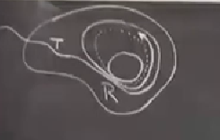

İçinde delik olan $R$ bölgemiz var, bir gidiş yolu var, sol taraftan bir $T$
"ortama dalıyor'', ve dışarı çıkamıyor. $T$ noktalı çizgi ile gösterilen kapalı
yörünge etrafında sarmallanıyor (spiral around). 

Peki burada bir hapis kalmış gidiş yolu olduğunu nasıl ispat edeceğiz? Standart
bir numara var: öyle bir bölge bul ki bölgenin ortasında delik olsun, delikten
bu bölgeye doğru akış olsun, ve bölge dışından o bölgeye doğru da akış
olsun. Yani alttaki gibi,

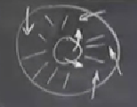

Böyle bir bölge bulunabilirse, o bölge içindeki her gidiş yolu "kapana
kısılmış'', hapis edilmiş demektir.

Ornek

$$ \dot{r} = r(1-r^2) + \mu r \cos\theta $$

$$ \dot{\theta} = 1 $$

sistemini düşünelim. Bu sistemi seçtim çünkü $\mu=0$ olunca ne olduğunu hemen
görebiliyoruz; bu durumda ilk denklem,

$$ \dot{r} = r(1-r^2) $$

haline geliyor, ve ikinci denklemle bağlantısı kopuyor. Sonuçta elimize iki
birbirinden ayrı tek boyutlu denklemin oluşturduğu bir sistem geçiyor, ve önceki
derslerimizde öğrendiğimiz teknikleri kullanarak hemen şunu çizebiliriz,

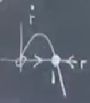

Yani $t \to \infty$ iken $r \to 1$. 

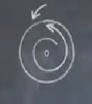

Üstteki sonucun ana resimdeki karşılığı üstteki: elimizde yarıçapı 1 olan bir
çember var. Nerede başlarsak başlayalım $r$ ve $\theta$ monotonik olarak
artacak, ve birim çemberin sınırlarına dayanacak. Orijinde gayrı stabil bir
nokta var. Çember dışında ise yine çembere gidiş olur. Demek ki $\mu=0$
durumunda net bir şekilde görülüyor ki elimizde yarıçapı 1 olan mükemmel bir
çemberden oluşan stabil bir limit çevrimi var. Bu sonuca erişmek için
Poincare-Bendixson teorisine ihtiyacımız yoktu ama sisteme bakınca hemen bunu
gördük. 

Ama eğer $\mu$ sıfır olmasaydı ne olurdu? Aynı limit çevrimini yine elde eder
miydik?

PB teorisini kullanmanın zamanı şimdi geldi. Üstte gördüğümüz gibi içi delikli
bir bölge oluşturacağız. Genel bir tavsiye bölgeyi yapabileceğimiz kadar ufak
tutmak, böylece kapalı yörüngeyi içinde hapsedebilelim. En iyi bilgi böyle elde
ediliyor. Ama başlangıçta herhangi bir delikli bölge de kullanılabilir.

Strateji şöyle, iki çember bulalım, 

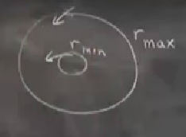

Bu arada $\dot{\theta}=1$ olduğu zamam hiçbir sabit nokta olmaz, çünkü orada
$\dot{\theta}=1$ sıfır olamaz. Gerçi, biraz dikkatli olayım burada, $r$'in sıfır
olduğu ve $\theta$'nın tanımsız olduğu bölgeler var, burada sabit noktalar
olabilir. Fakat $r$ sıfır haricinde bir şey olduğu sürece sabit nokta
yoktur. Yani üstteki gibi bir şekilde sabit nokta yoktur.

Şimdi $r_{max}$'i öyle seçiyoruz ki $r = r_{max}$ eğer $\dot{r}<0$ ise. Eğer bu
şart yerine getirilirse akış içeri doğru olacak. Bakalım böyle bir $r_{max}$
bulabilecek miyiz? $\dot{r}$ formülünü faktorize etmeye uğrasayım,

$$ \dot{r} = r(1-r^2+\mu \cos\theta) $$

Unutmayalım, $\cos\theta$ hiçbir zaman 1 değerini geçemez, ayrıca -1'den az
olamaz. O zaman üstteki formülde $\dot{r}$'i negatif yapmak istiyorum, o zaman
parantez içini negatif yapmam lazım, $\mu \cos\theta$ ne kadar pozitif olursa
olsun. Parantez içi en fazla $1+\mu$ kadar pozitif olabilir, demek ki bana
$r_{max} > \sqrt{1+\mu}$ lazım. Eğer bu şekilde bir $r_{max}$ seçersem $\dot{r}$
o çember üzerinde negatif olur. 

Benzer bir akıl yürütme ile $r_{min} < \sqrt{1-\mu}$ seceerim. Bu seçim
$r = r_{min}$ olan çember üzerinde $\dot{r}$'nin pozitif olmasını garantiler. 

Bazılarınız geçici bir endişe yaşayabilir, "ya karekök içinde negatif ifade
varsa?''. O kadar büyük bir $\mu$ seçmeyeceğiz, kendimizi $\mu < 1$'e
kısatlarsak bu yaklaşım işler.

Böylece iki çemberi elde ettik, ve onların içinden geçen akış tam istediğimiz
yönde, ve bölge içinde bir kapalı yörünge olduğunu biliyoruz. Neye
benzediklerini tam bilmiyoruz, ama oradalar. Hatta çemberleri birbirine iyice
yaklaştırarak bölgeyi ufaltıp gidiş yolunu oraya kıstırabiliriz.

Örnek

Bir örnek daha. Biyolojide glikoliz (glycolysis) adlı bir süreç var, hücreler
glikozu, yani şekeri, parçalayarak ondan enerji elde ediyorlar. Bazı
araştırmacılar bu süreci bir dinamik sistem olarak inceliyorlar, yani glikolizin
kimyasal kinetiğini anlamak istiyorlar çünkü 60'li yıllarda keşfedildi ki bazı
şartlarda glikoliz sürecinin salınıma girmesi mümkün oluyor. Yani bazı şartlar
yerinde ise sürecin oluşturduğu geçici bazı maddelerin konsantrasyonu bir
iniyor, bir çıkıyor. Yani şeker düzgün metabolize edileceğine, bir sürü
hareketlenme var. Bu araştırmacılara çok ilginç geldi, çünkü zaten vücuttaki pek
çok diğer ritmi de anlamaya uğraşıyorlardı; kalpte, ya da beyindeki nöronlar bir
salınım içindeler mesela. Araştırmacılar daha basit, kontrollü bir ortamda
glikoliz salınımını inceyelerek diğer salınımlar hakkında bir şeyler
öğrenebileceklerini umuyorlardı. 60'da bu bağlamda pek çok araştırma oldu, halen
bu araştırmalar devam ediyor. Kullanılan ana madde maya, labaratuarda rahat
kullanılan bir madde bu. Tabii mayanın bilinen bir diğer kullanım bira yapmak -
hatta bira yapım süreci de glikolize benzer çok benzeyen bir süreç.

Neyse; kullanılan bir model altta, onu çok ciddiye almayın, çok basitleştirilmiş
bir model, daha çetrefil olanları var bu günlerde.

$$ \dot{x} = -x + ay + x^2y 
\qquad (1) $$

$$ \dot{y} = b - ay - x^2y $$

$x$ değişkeni [ADP] denen bir kimyasal maddenin konsantrasyonu, $y$ ise [F6P]
(bir tür fruktoz), $a>0,b>0$ dışarıdan verilen sabitler, kimyasal kinetik
paramatreler bunlar. $x,y$ de sıfırdan büyük tabii çünkü konstrasyonu temsil
ediyorlar. 

Model bu kadar, şimdi onu bir dinamik bir sistem olarak analiz edelim ve şu
soruyu soralım; bu sistem deneylerde görüldüğü gibi salınıma girer mi?

Başlayalım. Bir kapan bölgesi oluşturalım.  Kutupsal kordinatlara hiç gerek yok,
durağan eğriler (nullclines) tekniğini kullanacağız. Durağan eğriler üzerinde
$\dot{x}=0$ ya da $\dot{y}=0$ olan eğrilerdir. Bu şartlar bize vektör alanı
hakkında çok bilgi verir, ve bize kapan bölgesini oluşturmamız için yardım eder.

$\dot{x}=0$ için çözelim, $y = x / (a+x^2)$ olur. İlk derste bahsetmiştim,
fonksiyonları taslaksal olarak çizebilmemiz lazım, işte gördüğümüz $y$'yi pat
diye taslaksal çizebilmemiz lazım. $y$'nin davranışı ufak $x$ için $x/a$
grafiğine benzer [hoca orijinden eğik dik çizgi ile başladı], büyük $x$ için
$1/x$ olur [dik çizgiye parabol gidiş ekledi], sonuşurda sıfıra gidiş olur. 

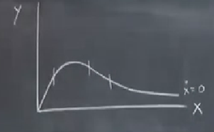

Bu eğri üzerinde $\dot{x}=0$ demek ki vektör alanı bu eğri üzerinde tam dikey
olacak [eğri üzerindeki dik çizgi parçaları bunlar]. Şimdilik dik çizgi
parçalarına ok çizmedim, herhangi bir yöne karar vermedik, bunu sonra
yapacağız.

$\dot{y}=0$ için çözelim, $y = b/(a+x^2)$. Bu grafik $x$ küçükken $b/a$ gibi
davranır, büyükken $b/x^2$ gibi davranır. Bu demektir ki sıfıra gidişi ilk
çizdiğimiz eğriden daha hızlıdır, çünkü o $1/x$ gibi gidiyordu. 

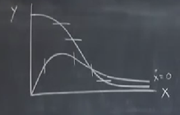

Farklı $a,b$ değerlerine göre üstteki grafik biraz daha farklı olabilir, mesela
kesişim noktası daha solda olabilir, şimdilik tipik duruma bakalım. 

Eğriler grafiği belli bölgelere böldü aslında, şimdi bulmamız gereken bu
bölgelerdeki $\dot{x}$ ve $\dot{y}$'ni işaretinin ne olduğu. Diyelim ki $x,y$
aşırı büyük. O zaman $x^2$ her iki denklemde de baskın çıkar. O zaman üst sağ
bölgede $\dot{x}>0, \dot{y}<0$, oradaki oklar sağ aşağı gidiyor.

Bu arada bir ok çizer çizmez süreklilik sebebiyle diğer okların kaderini de
belirlemiş olduk. Her şeyi gösterelim,

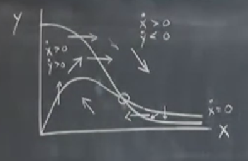

İki eğrinin kesiştiği yerde yanlışlıkla bir dik çizgi çizmiştim, aslında orada
bir sabit nokta var, çünkü orada hem $\dot{x}$ hem de $\dot{y}$ sıfır. Hangi tür
şimdilik bilmiyorum, o sebeple şekilde içini boş bıraktım.

Bu okları elde ettik; hatırlarsak amacımız içi delikli ya da başka bir tür bölge
oluşturmak ki bu bölgenin sınırında akış içeri doğru. Nasıl yapacağız? İdmanla
daha iyileşen bir beceri bu.

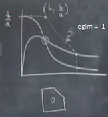

Üstte noktalı çizgi ile gösterilen yer kapan bölgem. Bölge bir poligona benzedi,
ortasında bir delik açtım, bu delik ana grafikte sabit noktanın olduğu yerin
etrafında. Poligonu tek başında en altta çıkartıp gösterdim. Poligonun sağ üst
tarafı -1 eğimle aşağı iniyor, niye bunu böyle seçtim birazdan
anlatacağım. Okları geri eklersek,

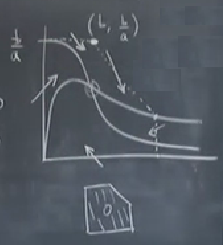

-1 eğimli eğriden içeri giren oka dikkat, bu ok -1'den birazcık daha fazla sola
doğru eğimli bu sebeple içeri girmiş oluyor zaten.

Şimdi niye poligonun üst köşesini $b,b/a$ ve -1 eğimli çizgi çektiğimi
anlatayım. $x,y >> 1$ olduğunu düşünelim, yani $x,y$ 1'den çok büyük, bu durum
bize $\dot{x} \approx x^2y$ ve $\dot{y} \approx -x^2y$ verir. Bu grafiğin çok
çok uzak sağ üstü demektir.

$$ \frac{\dot{y}}{\dot{x}} \approx -1 $$

Üstteki ifadeyi $dy/dx$ olarak kabul edebiliriz, -1 eğim buradan geliyor
işte. Bu kabaca bir hesap tabii. Daha kesin hesap için $\dot{x}$ ile
$-\dot{y}$'i karşılaştırırız, çünkü onların aşağı yukarı aynı ölçüde
olacaklarını düşünüyoruz (yine uzak sağ üstte). Bu iki değeri birbirinden
çıkartarak bu karşılaştırmayı yapabilirim, (1)'deki tanımdan hareketle, 

$$ \dot{x} - (-\dot{y})  = \dot{x} + \dot{y} = b-x $$

Bu bize $x>b$ ise  $-\dot{y} > \dot{x}$ olur diyor. Peki bu ne demektir? $x>b$
olduğu zaman eğimler -1'den küçüktür. İşte köşeyi $b$'de seçmemizin sebebi de
bu, çünkü onun altında $b$'den büyük olduğumu biliyorum.

Ne kaldı geriye? Delikte neler olduğu kaldı. Acaba delik içinde iken delikten
bölgeye doğru bir itiş var mı? Bunun her zaman olacağı garanti değil, ama $a,b$
dikkatli seçilirse olur.

Delik etrafında neler olduğunu anlamak için sabit noktaya bakalım. İstediğimiz
sabit noktanın iten türden olması, iten türden ise bu nokta ya gayrı stabil
düğüm, ya da sarmaldır. Bu akışın delikten bölgeye doğru gitmesini garanti
eder, tabii sonsuz küçüklükteki bir delik seçersek.

İtiş ne zaman olur? Jacobian'ı hesaplamak lazım,

$$ 
A =
\left[\begin{array}{rr}
-1+2xy & a+x^2 \\ -2xy & -(a+x^2)
\end{array}\right]
$$

$$
x^{\ast} = b, \quad y^\ast = \frac{b}{a+b^2}
$$

$$ 
\Delta = a + b^2 > 0 
$$

$$ 
\tau = -\bigg[ \frac{b^4 + (2a-1)b^2 + (a+a^2) }{(a+b)^2} \bigg] 
\qquad (2)
$$

$\tau$'da bölünen $b^2$ bağlamında karesel. $\tau,\Delta$ diyagramımızı
hatırlarsak,

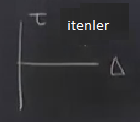

itenler sağ üst bölgede yaşıyorlardı, stabil olanlar sağ altta idi. Yani
aradığımız şart itme için $\tau > 0$. Ayraç bölge $\tau=0$'da olacaktır, ve
sıfırlık (2) ifadesinde bölünenin sıfır olduğu duruma işaret eder. Bölüneni
sıfıra eşitleyip çözeriz, orada $b^2$ üzerinden karesel bir ifade var demiştik,
karesel formül ile

$$ b^2 = \frac{1}{2} \bigg( 1 - 2a \pm \sqrt{1-8a} \bigg) $$

Ve nihayet, $a,b$ üzerinden bir parametre uzayı düşünürsek, üstteki ifadeyi
orada grafikleyebiliriz. Bu sefer kafadan taslaksal çizim beklemiyorum! İfade
oldukça zor görünümlü, ama bilgisayarla çizince,


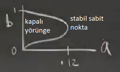

İşte, oldukça çetrefil bir örnekti bu, ama kapan bölgesi oluşturup sabit
noktanın stabilitesini hesaplayarak $a,b$ parametre uzayında bazı bölgelerde
kesinlikle kapalı yörüngeler olacağı sonucuna eriştik. 

Soru

Bu teoriyi kullanmak için illa bir sistemde kapalı yöründe olduğunu önceden
bilmemiz gerekiyor mu?

Cevap

Hayır. Mesela zihinde canlandırırken parametreleri öyle olsaydı ki sistem stabil
sabit noktaya doğru sarmallanıyor, bu durumda kapalı yörünge bariz olmazdı. Yani
bu bilgi önceden gerekli değil, şüphelenmek yeterli. Tabii şüphelensek te kapalı
yöründe olmaması da muhtemel. 

```python
import matplotlib.pyplot as plt
from scipy import *
from scipy import integrate
from scipy.integrate import ode, odeint
import numpy as np

fig,ax = plt.subplots(1,1,figsize=(8,8))
ax.set_facecolor(plt.cm.gray(.95))
def vf1(x,t, a,b):
  dx=np.zeros(2)
  dx[0]=-x[0] +a*x[1] + x[0]**2*x[1]
  dx[1]=b - a*x[1] - x[0]**2*x[1]
  return dx
xx0 = np.array([.25,1.5])
a = .08
b = .6
t = np.linspace(0, 15, 1000)
ys = odeint(vf1, xx0, t, args=(a,b))

x1,y1 = np.linspace(0,3,200),np.linspace(0,b/a,200)
X,Y = np.meshgrid(x1,y1 )
U = -X +a*Y + X**2*Y
V = b - a*Y - X**2*Y

start = [[0,2],[.8,0]]

strm = ax.streamplot( X,Y,U, V,linewidth=.2)
strmS = ax.streamplot(x1,y1, U, V, start_points=start, color="crimson", linewidth=1)
ax.set_title( 'Hucrelerde Glikoliz', size=12)
ax.plot(ys[:,0],ys[:,1],label=r'scipy.ode for $x_0 = ({0}, {1})$'.format(xx0[0],xx0[1]),lw=.5)
ax.plot(b,b/(a+b**2), 'k*', label='Fixed point at $({0}, {1})$'.format(b,np.round(b/(a+b**2),2)))
ax.plot(x1,b/(a+x1**2), 'k-.', lw=.8, label=r'y-nullcline $ \frac{b}{(a + x^2)}$')
ax.plot(x1,x1/(a+x1**2), 'k:',lw=1, label=r'x-nullcline $ \frac{x}{(a + x^2)}$')
plt.ylim([0,b/a+.2])
plt.xlabel(r"$ x$",size=14)
plt.ylabel(r"$ y$",size=14)
plt.legend()
plt.grid(True)
plt.savefig('09_19.png')
```

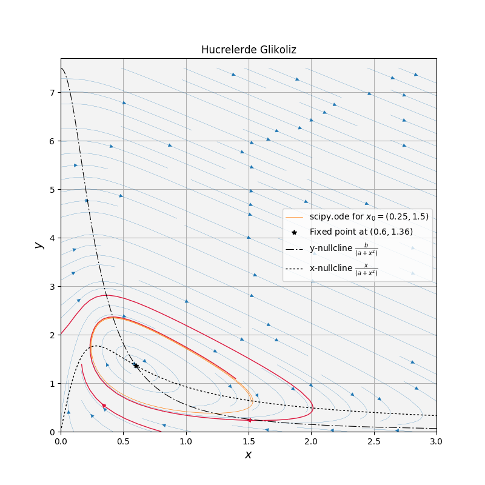


