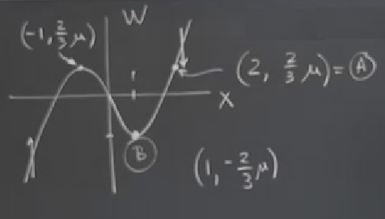
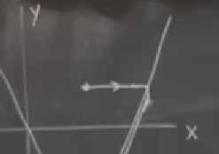
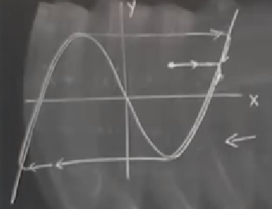
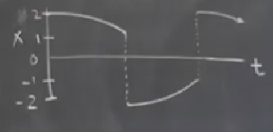
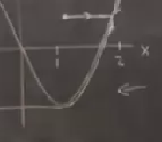
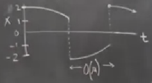
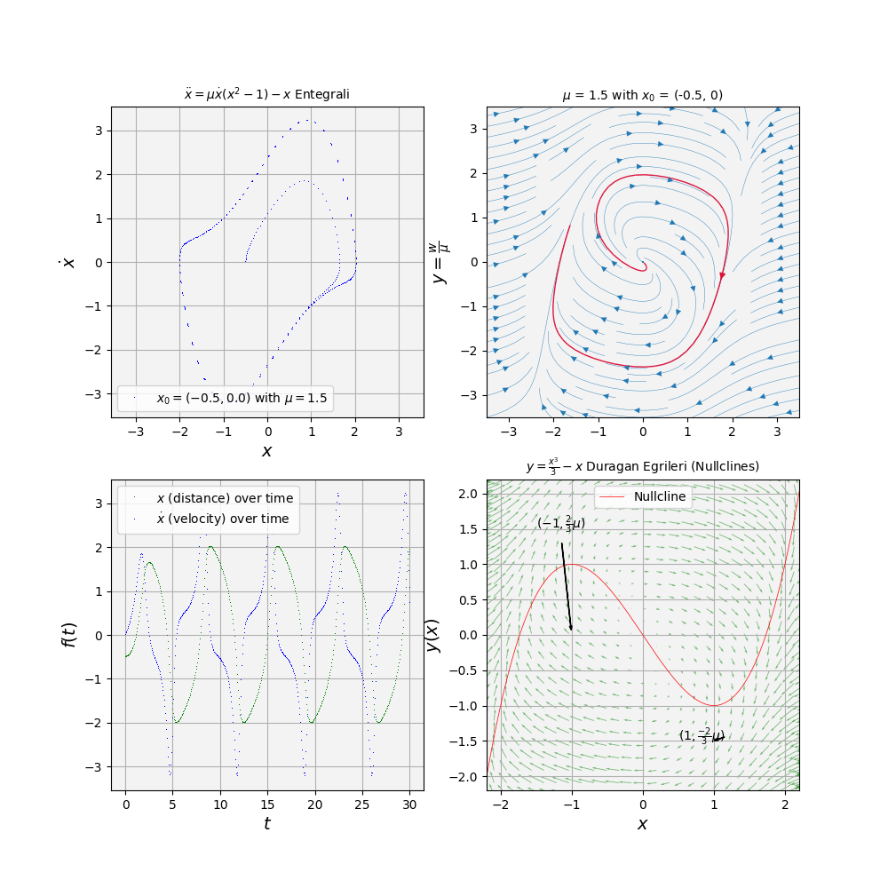

# Ders 10

Şimdiye kadar limit çevrimleri ve kapalı yörüngeleri elemeyi gördük, Dulac'ın
Kriteri'ni işledik, Poincare-Bendixon Teorisi'ni işledik. Bu derste kapalı
yörüngelere bakmaya devam edeceğiz, ama çok ünlü bir sistemde, ki bu sistem
alanımızın oluşmasında kritik bir rol oynadı, Van der Pol Titreşiri.
Sistem şöyle,

$$ \ddot{x} + \mu\dot{x} (x^2-1) + x = 0 
\qquad (1)$$

Van der Pol, daha doğrusu Balthazar van der Pol Hollandalı bir elektrik
mühendisi idi, 1920, 30'lu yıllarda zannediyorum, ve ABD'de Bell Labaratuarı'nda
çalışıyordu. O zamanlar radyonun ilk günleri, ve radyo ilk çıktığı zaman en
ileri teknoloji sayılıyor, ve bu yeni buluş içinde gelecekte karşımıza
yarıiletken (semiconductor), transistör olarak çıkacak fikirlerin başlangıcını
görüyoruz [yarıiletkenlar bilgisayar teknolojisinin temel taşıdır]. Belki
aranızda müzikle uğraşanlar varsa vakum tüplerini duymuştur, onları hala bugün
bile kullanan varmış diye duyuyorum, değil mi ... [öğrencilerden biri gitar
  amplikasyonu için kullananlar var hocam diyor]. Evet, işte gitar
amplifikasyonu için kullanıyorlar, çünkü ses daha organik, daha az dijital gibi
geliyor kulağa değil mi? Evet.

Ben küçükken hatırlıyorum, bizim televizyonumuzda bu tüp teknolojisi vardı. TV
ikide bir bozulurdu, artık olmuyor böyle şeyler tabii, ve tamirci gelirdi ve
adam yanında o koca tüplerden getirirdi. Televizyonun arkasına bakınca tüpten
gelen o ışığı görüyordunuz. Eski günlerde teknoloji böyleydi. İşte Van der Pol
[üstte gördüğümüz gibi] bu vakum tüpleri için çok basit bir model ortaya koydu.

Modelin basit harmonik titreşire çok benzediğini görebiliyoruz. Eğer ilk ve son
terimi alsaydık o zaman aynı basit harmonik titreşir olurdu. Fiziğe Giriş'te
işlenen LC devreleri, ileten (inductor) ve kapasitörlü (capacitor) içeren
devreleri bilen varsa, o altyapı ile basit harmonik titreşi elde ediyoruz. Ama
Van der Pol sisteminde ortada çıkıntılık yapan gayrı lineer bir terim var, vakum
tüplerindeki gayrı lineerliği modelleyen de bu. O ek terim bir sürü ek
çetrefiliğe yol açıyor, bir gayrı lineer sönüm (damping) ekliyor
mesela. Çoğunlukla sönümü "bir sabit çarpı $\dot{x}$'' şeklinde görmeye
alışığız, üstteki formülde bir de $x^2-1$ ile çarpım var. Dikkat edersek
$x^2-1$'in işareti $x$'in 1'den küçük ya da büyük olmasına göre eksi ya da artı
olabilir, o zaman $x$ 1'den büyük olduğunda elimize bildiğimiz çürüme, sönüm
geçer, salınımlar yavaşça yokolur, genlikleri (amplitude) azalır. Ama $x$ 1'den
küçük ise o zaman negatif sönüm elde edilir, bu pek tanıdık bir kavram
olmayabilir herkes için, negatif sönüm bir tür pompalamadır (pumping), yani
dışarıdan enerji eklemektir. O zaman zamana göre salınımları düşünürsek, pozitif
sönüm ile başladık diyelim, salınım azalır azalır, sonra $x$ küçülünce sönüm
tersine döner ve pompalama başlar, salınımlar tekrar büyür.  Beklentimiz bu
sistemin belli bir genlikte belli bir salınıma yaklaşması, ve hakikaten bu
oluyor, bu derste nasıl bir salınıma gidildiğinin hesabını göreceğiz.

İspatlayabiliriz ki $\mu > 0$ için $\exists !$ stabil limit çevrimi
($\exists !$ işareti özgün olarak mevcut demek). Sadece kapalı yörünge
değil, özellikle limit çevrimi var ve limit çevrimi stabil. Bu mevcudiyet
ispatlanabilir, ama çok saç yoldurucu, ispat için gereken kapan bölgesini
(trapping region) oluşturmak oldukça zor, bir önceki dersteki örnekten daha
zor. Bu konuya girmeyeceğim, fakat kitabımda ispatların bulunacağı
referanslar var. Biz bu sistemi limitleri üzerinden inceleyeceğiz, ilki
$\mu >> 1$ limiti üzerinden, yani $\mu$ çok, çok büyük olacak, bu da çok
çok büyük gayrı lineerlik demektir. Diğer limit $\mu$ çok küçük iken,
$\mu << 1$, ve mesela sarsım teorisi (perturbation theory), ya da başka bir
yaklaşım ile neler olduğunu anlamaya çalışacağız.

Kitabımın 7.5 bölümünde işlenen durum $\mu >> 1$ için; bu kuvvetli gayrı
lineerlik durumunda ortaya çıkan şeye rahatlama titreşiri (relaxation
oscillator) ismi veriliyor. Çözümde oldukça zor bir değişken değişimi yapacağız,
bu değişime Lienord Transformasyonu adı veriliyor, transformasyonun güzel tarafı
$\mu >> 1$ iken, yani artarken limit çevriminin sabit bir şekle doğru
evrilmesini, yaklaşmasına sebep oluyor. $\mu$ değişirken limit çevrimi
değişecekti, bunu biliyoruz; Lienord Transformasyon numarası ile çevrimin belli
bir sabit şekle doğru değişeceğini garantilemiş oluyoruz. Bu analizlerimize
kolaylık sağlıyor, ayrıca sistemde bir limit çevrimi olduğunu da ispatlamış
oluyor, çünkü evrileceği şekilden onu hemen görebiliyoruz.

$$ \ddot{x} + \mu \dot{x}(x^2-1) =
\frac{d}{dt} \big( \dot{x} + \mu (\frac{1}{3} x^3 - x) \big)
$$

Üstteki eşitliğin sol tarafına baktık, ve onu daha basit nasıl yazabiliriz diye
düşündük, ve farkettik ki o ifade direk bir diferansiyelin işleminin sonucu, bu
işlemi eşitliğin sağ tarafına koyduk. Bu eşitlik bize güzel bir değişken
değişiminin mümkün olacağını gösteriyor; büyük parantezdeki herşeye $W$,
küçükteki herşeye $F(x)$ diyebiliriz.

Not: Bu değişken değişimi daha önce yaptıklarımızdan biraz farklı, daha önce
ikinci dereceden, içinde $\ddot{x}$ olan bir sistemde değişken $y = \dot{x}$
yapıyorduk. Bu gösterdiğimiz o türden bir transformasyon değil, daha
karmaşık. Sadece $W=\dot{x}$ demiyoruz, büyük parantezdeki herşey $W$
diyoruz. Standart transformasyonu yapsaydık o zaman analiz çok daha zor olurdu,
$\mu$ değişirken limit çevrimi habire şeklini değiştirirdi (upuzun ince bir
şerit haline geliyor). Bu bize analizde yardım etmezdi.

Devam edelim, $\dot{W} = -x$ olur, bunu (1)'i tekrar düzenleyerek hemen
görebiliyoruz. Sistemin tamamı,

$$ \dot{x} = W - \mu F(x) $$

$$ \dot{W} = -x $$

Problemi faz düzleminde analiz edeceğiz. Daha önce gördük ki mesela kapan
bölgelere bakarken durağan eğrilere (nullclines) bakmak iyi.

$W = \mu F(x)$ iken $\dot{x} = 0$ olur.



Eğri üzerinde $\dot{x} = 0$, yani orada vektör alanı tam dik. İlk başta oraya
iki tane dik çizgi çizmiştim, yön bilgisi için $\dot{W}$'ya bakmak lazım, $x$
pozitif iken $\dot{W}$ negatif, negatif iken pozitif. Küpsel eğri üzerinde diğer
bazı hesaplar üstteki resimde görülüyor. Sol bölümdeki tepe noktasından bir
sağa bir düz çizgi çektim ve eğriyi kestiği noktaya $A$ dedim, o bölümde dip
noktasına ise $B$ dedim. Bu noktalarla niye ilgilendiğimi birazdan anlatacağım. 

Dikkat ederseniz $x$ kordinatları 1 ölçeğinde, $W$ kordinatlarının içinde $\mu$
var. Hatırlayalım $\mu$ aşırı büyük, milyarlar vs seviyesinde. Bu grafikte
kavramsal bir garipliğe yol açıyor, dikey eksende değerler aşırı büyük, yatay
eksende çok küçük. Tekrar ölçeklemek iyi bir fikir olabilir, çoğunlukla bu bu
dengesizlik tercih edilen bir şey değil, $\mu$ sonsuzluğa giderken resmin bundan
etkilenmemesini istiyoruz. Ölçekleme için $y = \frac{W}{\mu}$ dersek $\mu >> 1$
iken $y \sim O(1)$ olur, yani yeni ölçeklenmiş değişken $y$ 1 derecesinde,
ona oranlı olur. Yeni sistem

$$ \dot{x} = \mu(y -  F(x)) $$

$$ \dot{y} = -\frac{1}{\mu} x $$


$\mu$'nun çok büyük olduğunu unutmayalım, o zaman $\dot{x} \sim O(\mu)$ çok
büyük, $\dot{y} \sim O(\frac{1}{\mu})$ çok küçüktür (bir de $x>0$ iken $\dot{y}
< 0$). Bu demektir ki gidiş yolları ışık hızında sadece sağa doğru
gidiyorlar. Çünkü $\dot{x}$ çok büyük, dikey yönde ufak bir adım atılırken yatay
yönde aşırı hızda bir adım atılıyor. Bu resmi çizmek kolay. Üst sağda bir
noktadan başladığımızı düşünelim, hemen küt diye eğriye gidiş olacak, çünkü
müthiş bir yatay hız var,



Ama eğriye gelince orada aşağı bir dikey gidiş var, o biraz takip edilecek, ama
sonra yine eğriye dönülerek eğri boyunca aşağı inilecek. "Ama eğriyi geçip sağa
doğru devam edemez miyim?'' diye düşünenler olabilir, ama unutmayalım, sağ alt
köşede de aşırı yüksek hızda sola doğru bir "rüzgar'' esiyor.

Sağ alttaki dip noktasına vardığımızda en dipte artık eğriye yapışmamıza gerek
yok, ve rüzgar hala sola esiyor, bu sefer küt diye eğrinin sol alt köşesindeki
parçasına doğru yatay geçiş yapıyoruz. Bu arada eğri boyunca yukarı ya da aşağı
gidiş kağnı hızında, çünkü o yönde gidiş $1/\mu$'ye oranlı.



Peki tüm bu sisteme niye rahatlama titreşiri deniyor? Galiba bu sistemi insanlar
hayal ederken deprem gibi bir olayı düşündüler, depremde iki yeraltı tabakası
birbirine yavaş yavaş sürtünüp durur, ama birdenbire bir şey kopar, ve çok hızlı
zaman ölçeğindde bir deprem ortaya çıkar. Bir sürü stres çok az zamanda ortaya
çıkar. "Rahatlama'' bu tür bir rahatlama.

Üstteki resme bakarsak orada bir limit çevrimi olduğunu görüyoruz. Üst sağ
çeyrekteki noktadan başlamıştık hatırlarsak ve hemen çevrime geçmiştik. O geçiş
bir kere olunca artık hep orada kalınır, dönüp durulur.

Soru

Niye o noktadan başlayıp sağdaki eğriye geçince eğrinin sağından aşağı inildi,
solundan inilmedi?

Cevap

$\dot{x}$'in formülünden cevabı bulabiliriz; $\dot{x} = \mu (y-F(x))$, o zaman
sadece ve sadece $y < F(x)$ ise $\dot{x}$ olabilir. Bu diyor ki eğrinin sağ
parçasında aşağı inerken sola gidiyorsunuz, sola gitmenin de tek yolu eğer $y$
$F(x)$'in altında ise. 

Eğer $x,t$ üzerinde dalga formunu grafiklemek istersek,



2'den yavaş zaman ölçeğinde aşağı iniliyor, 1'e gelinince pat diye aşağı iniş,
bu o kadar hızlı oluyor ki üstteki grafikte dikey gözüküyor, sonra yine yavaşça
yukarı çıkış ve hızlı çıkış, vs. Bu dalga formuna testere dişi dalgası (sawtooth
wave) deniyor.

Periyot hesabı nasıl yapardık? Bu dalga formu kendini hangi aralıkta tekrar
ediyor? Dikkat edersek zaman bağlamında baskın olanlar yavaş gidişler, dikey
iniş çıkışlar değil. Bunu dikkate alarak bir kestirme hesap yapabiliriz. $y$
hızını düşünürsek çoğunlukla $1/\mu$'ya oranlı. Ana grafiğe tekrar dönersek,



alt sağ bölümdeki eğri parçasında mesela, 1'e oranlı bir mesafe katedildi, hız
$1/\mu$'ya oranlı, yol bölü zaman oranı çarpı zaman yoldur, yol için tersi yönde
gideriz ve $\mu$ buluruz. 



Zıplamalar $O(1/\mu)$ sürüyor, çok ufak. O zaman periyotun $\mu$'ya oranlı yani çok
büyük bir sayı olduğunu görebiliyoruz. $T = O(\mu)$.

Bu periyot hesabı yaklaşıksal bir hesap tabii; onu düzeltmek, daha kesinleşirmek
için $\mu$'yi çarpan katsayıyı hesaplayabiliriz, bunun bir yolu var. Düzeltme
tabii ki zıplamalardan gelmiyor, başka bir zaman ölçeği var, bu zaman ölçeğinde
ana grafikte dipte ve üstteki köşeleri dönerken bir yavaşlama oluyor, özellikle
alt sağ çeyrekteki dönüş. Kitabımda oldukça şaşalı bir sonuşur hesabına referans
veriyorum, dönüş zamanı Airy Fonksiyonu denen bir yöntemle hesaplanıyor, ki
sonuşurluk hakkında bir ders alsanız bunu nasıl yapacağınızı
öğrenirdiniz. Üniversitemizde böyle bir ders veriyorduk ama uzun bir süredir bu
dersi vermiyoruz, ben arada sırada bu tekniği öğretiyorum ama.

Neyse; baskın terimi hesaplamaya uğraşalım. Periyot yaklaşık olarak $A$'dan
$B$'ye gitmek için geçen zamanın iki katı. Bu gidiş sırasında aşağı yukarı
durağan eğri üzerindeyiz, biraz, $O(1/\mu)$ kadar sapmışız belki, ama durağan
eğrideyiz. Yani $W \approx \mu F(x)$ bilgisini kullanabiliriz. Nasıl?

$$ T = 2 \int_{t_A}^{t_B} \mathrm{d} t $$

Bunu biraz daha akıllıca bir şekilde yazabiliriz. $t$'ye erişimimiz yok, ama
$x$'i biliyoruz. $x$ ilgilendiğimiz zaman aralığında 2'den 1'e gidiyor. O zaman
üstteki entegrali $x$ bazlı yaparsak,

$$ = 2\int_{2}^{1} \frac{\mathrm{d} t}{\mathrm{d} W} \frac{\mathrm{d} W}{\mathrm{d} x} \mathrm{d} x $$

Leibniz'in notasyonunun sihri sayesinde üstteki kısmi türevler iptal olurdu,
geriye $\mathrm{d} t$ kalırdı, yani iki üstteki entegrale erişirdik. Asıl amacımız
bildiğimiz değerler üzerinden hesap tabii, ve üstteki kısmi türevleri
biliyoruz.

İlk terim $1 / \dot{W}$ ile aynı, ve

$$ \dot{W} = -x $$

olduğuna göre,

$$ \frac{1}{\dot{W}} = -\frac{1}{x}$$

olur. Diğer terim

$$ \frac{\mathrm{d} W}{\mathrm{d} x} \approx
\frac{\mathrm{d}}{\mathrm{d} x} \bigg( \mu F(x) \bigg)
= \mu F'(x)
$$

$$ = \mu \frac{\mathrm{d}}{\mathrm{d} x} \big( \frac{x^3}{3} - x \big) $$

$$ = \mu (x^2 -1) $$

Tüm bunları birleştirirsek,

$$ T \approx 2 \int_{2}^{1} -\frac{1}{x} \mu (x^2-1) \mathrm{d} x  $$

Entegrali hesaplarız, ayrıca hesap sırasını 2,1 yerine 1,2 yaparsak eksi ile
çarpmış oluruz,

$$ = 2\mu (\frac{1}{2}x^2 - \ln x) \Big|_{1}^{2} $$

$$ = 2\mu (\frac{3}{2} - \ln 2 ) = O(\mu) $$

Soru

Niye $W \approx \mu F(x)$ ? 

Cevap

Çünkü $A$ ve $B$ arasında görülen eğri üzerindeyim, ve $W$ kordinatı baz
alınırsa bu eğri $W = \mu F(x)$.

Soru

Bu $\dot{x}$ yaklaşıksal olarak sıfır mı demektir?

Cevap

[Hoca biraz düşündü] Hmm.. evet, öyle denebilir, ama bunu söylemek biraz derme
çatma olur. Aşağı inerken $x$ bazında çok az yer değişimi olduğu doğru, ama
sizin dediğiniz gibi söylemek pek uygun değil.

Devam edelim; $\mu << 1$ icin,

Van der Pol - Zayıf Gayri Lineer Durum

Analizin bu kısmı derslerimizin geri kalanından biraz farklı. Birazdan
kullanacağımız matematik, modelleme bağlamında daha alışılagelir türden olacak,
formüller olacak, bir sürü formüller, o formülleri manipüle edeceğiz, vs. Pek
geometrik değil yani. Kimileri bundan daha çok hoşlanıyor olabilir.

Bir $\epsilon$ tanımlayalım, bu çoğunlukla yapılır, $0 \le \epsilon \le
1$. Şimdi,

$$ \ddot{x} + x + \epsilon \dot{x}(x^2 - 1) = 0 $$

$\ddot{x}$'un önünde frekans terimi yok. Niye? Çünkü zaman birimini belli bir
şekilde olmaya zorluyoruz ki doğal frekansları 1 olsun. Genellikte kayıp olmadan
bunu yapmak mümkün. 

Bu formülden ne beklemeliyiz? Kabaca bu sorunun cevabını başta vermek iyi
olur. $\epsilon = 0$ olunca elimize basit harmonik titreşir geçer. Bu durumda
tüm yörüngelerin dairesel olacağını biliyoruz [eliptik değil], çünkü herşeyin
ölçeği buna göre ayarlı, periyot $2\pi$. Ve istenirse zaman başlangıcı güzel bir
şekilde seçilince, alttaki formül mümkün olur, 

$$ x(t) = A \cos t $$

ki $A$ bir sabit. Kosinüs salınımlarının genliği sabittir.

Peki eğer gayrı lineer sönüm $\epsilon$'u değiştirirsek ne olur? Bu durumda tüm
vektör alanında $\epsilon$ kadar bir değişim yaratmış olurduk. Vektörleri temsil
eden okları düşünürsek, belli bir yönü gösteriyorlar, $\epsilon$ değişimi
sonrası bu oklarda ufak bir sarsım yaratmış olduk, 1'in milyarda biri kadar bir
büyüklükte $x$'leri ve $y$'leri değişti. Yani ufak $\epsilon$ için vektör alanı
üzerinde öyle fazla bir değişim yaratmadık, ve tüm yörüngelerin çembersel
olmasını bekleriz, hala periyot $2\pi$. Peki limit çevrimini nasıl buluruz?

1. Metot (Kaba)

Eğer fizikçi ya da mühendis gibi düşünürsek basit harmonik titreşirde enerjinin
muhafaza edildiğini görüyoruz, o zaman bir tur attığımızda enerji değişmemiş
olacaktır, büyüklük $\Delta E$'ye bakarız. İçinde $\epsilon$ olan sistemde tabii
ki unutmayalım bazen sistem pompalanıyor, bazen sönüme tabi oluyor. Ve
düşünürdünüz ki limit çevriminde, ki kendini tekrar eden bir sistem bu,
pompalanan enerji kaybedilen enerjiye eşit olmalı. Limit çevrimliliğin şartı
bu. Genliği baz alan bu mantık zinciri ile çevrimin kendisi hakkında bir hesap
yapabileceğiz. Çevrimin üzerinde $\Delta E = 0$, diğer gidiş yollarında çevrimin
dışında ya da içinde olup olmamalarına göre ya $\Delta E > 0$, ya da $\Delta
E<0$.

Bu sezgiden hareketle, sönümsüz titreşirin enerjisi nedir? Temel fizikten, ve
üstteki ölçekten hareketle enerji kinetik artı potansiyel enerji,

$$ E = \frac{1}{2}x^2 + \frac{1}{2}\dot{x}^2 $$

Zamana oranlı değişim

$$ \frac{\mathrm{d} E}{\mathrm{d} t} = x\dot{x} + \dot{x}\ddot{x} $$

$$ = \dot{x}(x + \ddot{x}) $$

Van der Pol sistemine referans yaparak,

$$ = \dot{x} (-\epsilon \dot{x} (x^2-1)) $$

Şimdi diyelim ki $x = A\cos t$. Daha önce de böyle bir tanım yapmıştım ama
önceki gerçekti, şimdi yaklaşıksallama için kullanıyorum. Yani vektör alanına
$\epsilon$ kadar bir değişik getiriyorum, ve sonucun hala $x = A\cos t$ gibi
olmasını bekliyorum, daha doğrusu $x = A\cos t + O(\epsilon)$ gibi
olmasını. $O(\epsilon)$'in büyüklüğünü sonradan Sarsım Teorisi ile
hesaplayabiliriz. $A$ sonradan hesaplanacak bir sabit, onu hesaplayacağız. Yani
tek ilgilendiğimiz çevrim, hangi $A$ ile çember üzerindeki enerji değişimi sıfır
olur. Çevrim üzerinde bir turda enerji değişimi,

$$
\Delta E - \int_{0}^{T} \frac{\mathrm{d} E}{\mathrm{d} t} \mathrm{d} t =
-\epsilon \int_{0}^{2T +O(\epsilon)} A^2 \sin^2 t(A^2\cos^2 t - 1) \mathrm{d} t + O(\epsilon^2)
$$

çünkü $\dot{x} = -A\sin t + O(\epsilon)$. 

Niye $O(\epsilon^2)$? Çünkü dönüm sırasında bazı hatalar yapılıyor, üstteki
entegrale bakarsak $-\epsilon$ ile bir çarpım var, ayrıca üst sınır
$+O(\epsilon)$ içeriyor, bu ikisinin çarpımı karesellik getirir, ayrıca entegral
içinde de karesel ifadeler var. Yani bir dönüşte yapılabilecek en fazla hata
$O(\epsilon^2)$, bu sebeple $+O(\epsilon^2)$ kadar bir düzeltme ekliyoruz. Tabii
bu karesel hatayı entegrale terim olarak ekleyince üst sınırda belirtmeye gerek
yok [hoca üst sınırı siliyor],

$$ = -\epsilon \int_{0}^{2T} A^2 \sin^2 t(A^2\cos^2 t - 1) \mathrm{d} t + O(\epsilon^2) $$

Cebirsel işlemleri atlıyorum, $\sin^2, \cos^2$'in entegrali nasıl alınıyor bunu
bilmek lazım, ama sonuç

$$ \Delta E = -\epsilon
\bigg[
A^2 \underbrace{<\sin^2 t \cos^2>}_{1/8} 2\pi - A^2 \underbrace{<\sin^2 t>}_{1/2} 2\pi
\bigg]
$$

$<>$ operatör "averaj almak'' demek, elektrik mühendislerine üstteki ifadeler
tanıdık gelebilir, bunlar "DC terimleri'', bir turda o terimlerin ortalamasının
ne olduğu bilinir. Devam edelim, nihai sonuç,

$$ = -2\pi \epsilon A^2 (\frac{A^2}{8}-\frac{1}{2}) + O(\epsilon^2) $$

Sorumuz neydi? Üstteki ifade ne zaman sıfır olur, hangi $A$ ile çevrim etrafında
bir kez dönünce enerjide hiç net değişim olmaz? Üstteki ifadedeki parantez içini
sıfır yapan durum neyse o; 

$$ \frac{A^2}{8}-\frac{1}{2} = 0 \Rightarrow \frac{A^2}{8} = \frac{1}{2}
\Rightarrow A^2 = 4 \Rightarrow A = 2
$$

2 sonucunu bulduk; bu ünlü bir sayı, ufak $\epsilon$ için Van der Pol
titreşirlerinin limit çevriminin genliği 2'dir, yani

$$ x(t) = 2 \cos t + O(\epsilon) $$

Bu demektir ufak $\epsilon$ için ki Van der Pol dalga formunu grafiklesek bir
kosinüs dalgasına benzer, ama genliği her zaman 2'dir.

Bir sonraki derste üstteki ifadenin stabil olduğunu bulmayı, ve biraz önce
işlediğimiz kaba yöntemden daha iyi bir yöntemi göstereceğim, bu metota
Averajlama Teorisi deniyor. Daha önce görmediyseniz hoşunuza gidecek
zannediyorum.

Örnek 7.1.2 [Kitap]

Van der Pol titresirini sayısal olarak çözelim,

$$ \ddot{x} + \mu\dot{x} (x^2-1) + x = 0 
\qquad (1)$$

```python
import numpy as np
import matplotlib.pyplot as plt
from scipy import integrate
from scipy.integrate import ode, odeint

fig0 = plt.figure(figsize=(10,10))
ax0 = plt.subplot2grid((2,2), (0,0))
ax1 = plt.subplot2grid((2,2), (1,1))
ax2 = plt.subplot2grid((2,2), (1,0))#, colspan=2)
ax3 = plt.subplot2grid((2,2), (0,1))

xx0 = np.array([-0.5, 0])
s=1.5

def odef(xx, t, s=s):
    return np.array([xx[1], -s*(xx[0]**2-1)*xx[1]-xx[0]])

t = np.linspace(0, 30, 500)
ys = odeint(odef, xx0, t, args=(s,))

ax0.axis('equal')
ax0.set_title('$\ddot{x} = \mu \dot{x}(x^2 - 1) - x$ Entegrali', size=10)
ax0.plot(ys[:,0],ys[:,1],'b,',label='$x_0 = ({0},{1})$ with $\mu = {2}$'.format(xx0[0],xx0[1],s))
ax0.set_xlabel('$x$', size=14)
ax0.set_ylabel(r'$\dot{x}$',size=14 )
ax0.set_facecolor(plt.cm.gray(.95))
ax0.grid(True)
ax0.legend()

x1,y1 = np.linspace(-3.5,3.5,200),np.linspace(-3.5,3.5,200)
X,Y = np.meshgrid(x1,y1 )
U = Y - s*(X**3/3-X)
V = -X

start = [[-.5,0]]

ax3.set_title('$\mu$ = {0} with $x_0$ = ({1}, {2})'.format(s,start[0][0],start[0][1]), size=10)
ax3.set_ylabel(r'$y = \frac{w}{\mu}$',size=14 )
ax3.set_facecolor(plt.cm.gray(.95))
strm = ax3.streamplot( X,Y,U, V, linewidth=.3)
strmS = ax3.streamplot(x1,y1, U, V, start_points=start, color="crimson", linewidth=1)

F_x = s*(x1**3/3 -x1) #p.215
U3 = Y - s*(X**3/3 - X)
V3 = -X
ax1.set_title(r'$y = \frac{x^3}{3} - x$ Duragan Egrileri (Nullclines)', size=10)
ax1.plot(x1, F_x, 'r', lw=.5,label='Nullcline')
ax1.annotate(r'($-1, \frac{2}{3} \mu$)',
            xy=(-1,2/3*s),
            xytext=(-1.5, 1*s),
            arrowprops=dict(facecolor='black', width = .2,headwidth= 2, headlength=3,shrink=0.05))
ax1.annotate(r'($1, \frac{-2}{3} \mu$)',
            xy=(1,-2/3*s),
            xytext=(.5,-1*s),
            arrowprops=dict(facecolor='black', width = .2,headwidth= 2, headlength=3,shrink=0.05))
strm = ax1.quiver( X[::5,::5],Y[::5,::5],U3[::5,::5], V3[::5,::5],color='g',alpha=.5,scale_units='inches',scale=16)
ax1.set_xlabel('$x$', size=14)
ax1.set_ylabel(r'$y(x)$',size=14 )
ax1.set_facecolor(plt.cm.gray(.95))
ax1.set_xlim(-2.2,2.2)
ax1.set_ylim(-2.2,2.2)
ax1.legend()
ax1.grid(True)

ax2.plot(t,ys[:,0], 'g,',lw=.3, label='$x$ (distance) over time')
ax2.plot(t,ys[:,1], 'b,',lw=.3, label='$\dot{x}$ (velocity) over time')
ax2.set_xlabel('$t$', size=14)
ax2.set_ylabel(r'$f(t)$',size=14 )
ax2.legend()
ax2.grid(True)
ax2.set_facecolor(plt.cm.gray(.95))

plt.savefig('10_07.png')
```




