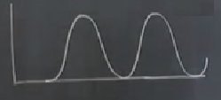
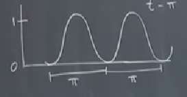
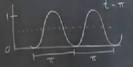
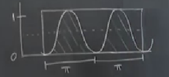
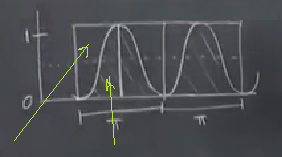
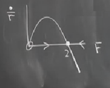
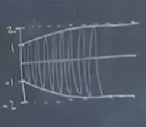

# Ders 11

Zayıf Gayri Lineer Titreşiler İçin Averajlama Teorisi

Şu tür bir sistemi düşünelim,

$$ \ddot{x} + x + \epsilon h(x,\dot{x}) = 0 $$

İlk iki terim basit harmonik titreşir gibi, ve zaman ölçeğini normalize edilmiş
şekilde seçtik, öyle ki basit harmonik titreşir kendi başına olsaydı açısal
frekansı 1 periyotu $2\pi$ olurdu. Ama tabii üçüncü terimde görülen bir düzeltme
var, $\epsilon$ çarpı $x$ ve $\dot{x}$'in bir fonksiyonu. $\epsilon$'lı terim
oldukça küçük, $\epsilon << 1$, $\epsilon$ pozitif, ve tüm sisteme "zayıf''
derken kastedilen bu zaten, üstteki sistem lineer harmonik titreşirin ufak
sarsıma uğratılmış hali. $h$ fonksiyonunu $t$'ye bağlı bir şey yapabilirdik, ama
bugünkü örneğimiz için $x,\dot{x}$ ile yetinelim, yani sistem otonom.

Sarsım hesapları için koca bir Sarsım Teorisi literatürü var; Kuantum Mekaniği
ya da diğer gayrı lineer titreşirlerle ilgilenen derslerde bu tekniği görmüş
olabilirsiniz. Bu derste Sarsım Teorisi'nde çok zaman harcamayacağız, birazdan
göstereceğim örnek onu tek uyguladığımız yer olacak. Ama bu dersi 1950 ya da
60'larda alıyor olsaydınız, 10, 15 dersi bu konuda harcıyor olurduk.

Sistemimize dönersek, onu

$$
\dot{x} = y 
\qquad (1) 
$$

$$\dot{y} = -x - \epsilon h(x,y)$$

olarak yazabiliriz. ve $\epsilon = 0$ basit durumu için neler olacağını tam
olarak biliyoruz, elimize şu formda çözümler geçiyor,

$$ x(t) = r \cos (t+\phi) $$

$$ y(t) = -r \sin (t+\phi) $$

$r$ salınımın genini, $\phi$ ise onun faz açısını temsil ediyor, basit harmonik
için gidiş yollarında ikisi de sabit. Yani sistem bir gidiş yoluna girince
$r,\phi$ bu yolda aynı kalacak. Üstteki yapılan basit harmonik titreşirin
kutupsal kordinatta yazılmış hali bir bakıma, ya da, şunu söylemek belki daha
uygun, çözümün sabit genli $\sin$, $\cos$ bazlı olduğunu biliyoruz, ve temsili
ona göre yaptık, ayrıca zaman başlangıcını öyle seçtim ki sistemi üstteki gibi
yazabileyim.

Bizim ilgilendiğimiz durum $\epsilon \ne 0$ olduğu hal, bu durumda $r,\phi$'nin
sabit kalmasını değil yavaşça değerlerinin değişmesini bekliyoruz, gayrı lineer
$\epsilon$'lu terimin sisteme etkisi bu olacak. $r,\phi$ sabit değil başka
değerlere gidecek, tüm sistem bir limit çevrimine doğru gidebilir mesela. Bugün
yapmak istediğimiz $h$ gayrı lineer terimi baz alınarak $r,\phi$'nin, yani gen
ve fazın nasıl değiştiğini gösteren denklemleri türetmek.

$\epsilon$ ufak olduğu için biliyoruz ki gidiş yolları neredeyse çembersel olur,
ve bu çemberin periyotu neredeyse $2\pi$ olur. Çemberlilik çok bozulmuyor çünkü
$\epsilon$ vektör alanını bu kadar bozabiliyor / sarsabiliyor, çok küçük. Şimdi
$r,\phi$ için değişim denklemlerini bulalım.

Birazdan anlatacaklarım bazılarına karışık geliyor; eğer anlaşılmayan bir kısım
olursa hemen sorun. Diyelim ki

$$ x(t) = r(t) \cos (t+\phi(t)) $$

$$ 
y(t) = -r(t) \sin (t+\phi(t)) 
\qquad (2) 
$$

Burada karışık gelen su: ilk bakışta sanki yanlış Calculus kullanıyormuşum gibi
duruyor. Yukarıdaki (1) ifadesinde $\dot{x}=y$ dedim, ama $r,\phi$ zamana bağlı
ise o zaman üstteki $x(t)$'nin zamana bağlı türevi $y$ olmaz, çünkü o türeve
$\dot{r}$'den ve $\dot{\phi}$'den katkılar olurdu. Eh, yani, bu bir bakış
açısından doğru, ama üsttekini şöyle görmek daha iyi: diyelim ki $x,y$
değişkenleri (1) için bir çözüm. Bu çözüm içinde $r$ ve $\phi$
tanımlayabilirim. Yani üstteki ifade türevsel bir beyandan daha çok $r,\phi$
hakkında bir beyan. Mesela şu tanımı yapabilirdim,

$$ r(t) = \sqrt{x^2(t) + y^2(t)} $$

$$ 
\tan(t + \phi(t)) = -\frac{y(t)}{x(t)} 
\qquad (3) 
$$

Bu tanımları yapmama izin var.

Fiziksel olarak neler oluyor? $x,y$ tanımı bir anlamda dönmekte olan bir şeyin
içine dahil olmak gibi, $\epsilon = 0$ sisteminin gidiş yollarında seyahat
ediyorsunuz bir bakıma. Yani iki problem olduğunu düşünsek, birinde
$\epsilon=0$, ötekinde değil, ikisini de aynı başlangıç şartlarından
başlatıyorsunuz, ve olanları sarsıma uğramamış $\epsilon = 0$ sisteminin bakış
açısından izliyorsunuz. Bu bize ilginç olmayan gidişi dondurup ilginç olanı
görmemizi sağlıyor. Şimdi $\dot{r},\dot{\phi}$ denklemlerini bulalım. En kolayı

$$ r^2 + x^2 + y^2 $$

den hareketle,

$$ r\dot{r} = x\dot{x} + y\dot{y} $$

$$ = x(y) + y(-x -\epsilon h) = -\epsilon yh$$

çünkü $yx$ terimleri iptal oldu. $y$ için elimde (2) ifadesi var, üstteki yerine
koyarım,

$$ = -\epsilon h(-r \sin(t + \epsilon)) $$

Eksiler iptal olur, $r$ eşitliğin solundaki $r$ ile iptal olur,

$$ \dot{r} = \epsilon h \sin(t+\phi) $$

Amaçladığımız formüllerden birine eriştik. Şimdi $\dot{\phi}$ için bir değişim
denklemi lazım. Cebiri atlıyorum, ama (3)'ten başlayacaksınız, belki (3)'un sağ
tarafında ters tanjant (inverse tangent) kullanmak daha iyi olurdu [sol
  tarafından $\tan$ ifadesini kaldırarak yani], sonra iki tarafın türevini
alırız,

$$ \frac{\mathrm{d}}{\mathrm{d} t} \bigg( \tan^{-1} \frac{-y}{x} \bigg) $$

$$ = \frac{\mathrm{d}}{\mathrm{d} t} (t+\phi(t)) $$

vs. Ters tanjantin türevini almayı hatırlıyorsunuz herhalde, neyse tüm bunları
yapınca,

$$ \dot{\phi} = \frac{\epsilon h}{r} \cos(t+\phi) $$

ifadesine erişilir. Güzel. İki formülün simetrisi var bir anlamda, yani $r$
formülü eğer $r\phi$'i temel alsaydık ortaya çıkacak formülle benzer olurdu,
bir fark olurdu tabii, birinde $\sin$ diğerinde $\cos$ var.

$\dot{r},\dot{\phi}$ formüllerinin güzel bir tarafı daha var, ikisi de
$O(\epsilon)$, yani her ikisi de $\epsilon$ çarpı bir şeyler.. Bu mantıklı
aslında değil mi? Bu demektir ki $\dot{r},\dot{\phi}$ çok yavaş şekilde
değişiyorlar çünkü $\epsilon$ küçük. Baştaki sezgiye dayanarak böyle olacağını
söylemiştik zaten. 

Tüm bunlar anlaşıldıysa, biraz garip bir iş yaptığımız belli olmuştur
belki. Bazı karmaşıklıklar notasyon içinde kaybolmuş olabilir, mesela $h$ yazdım
ama bu $h$ hakkında biraz düşünelim. $h$ değişkeni $x,y$'nin bir fonksiyonudur,
yani

$$ h = h(x,y) = r\cos(t+\phi), -r\sin(t+\phi) $$

Yani $h$ belirgin bir şekilde zaman bağımlıdır, $t$ orada duruyor işte, bu
otonom olmayan bir terim, yani dinamik sistemimizi bazlı sistemimizi otonom
olmayan, belirgin şekilde $t$'ye bağımlı hale getirdik.

Belki bazılarının aklına şu geliyor, "bravo hocam her şeyi daha berbat hale
getirdiniz''. Değil mi? Ne güzel otonom bir sistemimiz vardı, faz düzlemindeki
oklar, vektörler dönmüş durumdaydı, oraya buraya kıpırdamıyorlardı.. şimdi
kıpırdayıp duruyorlar. Böyle bir sistem üzerinde faz düzlem analizi bile yapmak
mümkün değil artık. Fakat birazdan sistemi otonom olmayan hale getirmenin
faydalarını göreceğiz, averajlama teorisinin temeli bu.

Yapacağımız şu: zaman ölçeklerinin arasındaki farklılıktan istifade
edeceğiz. Sistemde $O(1)$ zamanda, yani "hızlı zamanda'' değişen şeyler olacak,
mesela bir salınım düşünelim ki $2\pi$'da bir tur atıyor, diğer yanda çok yavaş
zamanda hareket eden şeyler var, mesela faz ve genlik gibi, bu değişimler
$O(\epsilon)$'la değişiyorlar. Üstteki transformasyonla bu farklılığı iyice
belirgin hale getirmiş olduk, ve bu sayede problemi oldukça niceliksel olarak
çözmemiz mümkün olacak.

Şimdi çok güzel bir kavramsal bakış açısı geliyor; anahtar fikir bu. Hızlı
salınımları ortaya çıkartmak için onları $2\pi$'lik dönemler üzerinden onların
ortalamasını al / averajla. Averajlama Teorisi demiştik, isim buradan
geliyor. Yeni notasyonu tanıştırayım; verili fonksiyon $g(t)$ için $t$
noktasında merkezlenmiş averaj

$$ \bar{g}(t) = <g>(t) = \frac{1}{2\pi} \int_{t-\pi}^{t+\pi} g(s) \mathrm{d} s$$

$<>$ bir operatör olarak görülebilir tanımı eşitliğin sağındaki
entegral. Entegralin yaptığı işlem bir tür hareketli ortalama olarak ta
görülebilir, İstatistik dersi alanlar bilirler, entegralin yaptığına bakarsak
$t$ üzerinde iken $\pi$ geriye $\pi$ ileri bakılıyor, bir "pencere'' var yani
ve bu aradaki değerler üzerinden bir ortalama alınıyor. Finansal zaman
serilerinde bu tür hareketli ortalamalar hep kullanılır, hisse senetlerin fiyat
verisinde mesela, günlük bazdaki iniş çıkışları daha pürüzsüz hale getirmek için
fiyatlar haftalık, aylık hareketli ortalamalı olarak gösterilebiliyor.

Bir analoji yapayım şimdi; bir insanın küçükten başlayarak yıllar içinde boyunun
uzamasını düşünelim. Küçükten tabii ki çok küçüktük, sonra büyüdük, yani
boyumuz zamanın bir fonksiyonudur. Peki bu fonksiyonun zamana olan bağlılığının
ölçeği nedir? Aylar ve yıllar tabii ki, günlük, ya da dakikalık değil. Bir
saniye içinde boyumuz ne kadar uzadı? Yok denecek kadar az. İşte zaman ölçeği
ile kastettiğim bu; bir hızlı zaman ölçeği var, birkaç saniye mesela, bir de
yavaş bir zaman ölçeği var, bu da ay ve yıl bazında. Bu iki ölçek birbirinden
çok farklı. Bu tür problemlerde kullandığımız kavramlar bunlar, mesela $r,\phi$
gibi elimde yavaş değişen büyüklükler var, aynen boy örneğinde olduğu gibi. Eğer
bu tür büyüklüklerin hareketli ortalamasını hızlı bir dönem bazında alırsam, ve
bu ortalamaya bakarsam, bakılan dönemde ölçüm değişmiyor, bu örnekte hareketli
ortalama boy ölçümüyle (fonksiyonluyla) neredeyse tıpatıp aynı olurdu. Bundan
bahsediyorum çünkü averaj teorisi yaklaşımını kullanırken bazen bir fonksiyonun
yerine pat diye onun averajını koymayı seçebilirim, bunu başka cebirsel bazı
taklaları atmak için yapmak gerekir mesela, bu iki fonksiyon zaman ölçeği
nedeniyle aynı şeydir, ama bazıları düşünüyor ki "hocam ne yaptınız, biri
averaj biri fonksiyon''. Teknik işliyor, zaman ölçeği sayesinde. 

Soru

$\dot{r},\dot{\phi}$ yi hızlı ölçekte averajlarsak gerçek ile averaj arasındaki
hata ne kadar büyük olur? 

Cevap

Güzel soru. Hata $\epsilon$'a oranlı olur, kabaca söylemek gerekirse bir
periyotta hata $O(\epsilon)$ çünkü $\dot{r},\dot{\phi}$ değişkenlerinin kendisi
$O(\epsilon)$. 

Bu metot, bu arada, 1930'lu yıllarda, aynı anda pek çok yerde keşfedildi,
kimi Amerika'da kimi Rusya'da.. Van der Pol'ün kendisinin de böyle fikirleri
vardı. Dinamik Sistem teoristleri bu konuya çok baktı, averaj teorisi hakkında
matematiksel ispatlar yaptılar, ona pür teorik olarak yaklaşanlar oldu
yani.. Mesela [1]'e bakarsanız, orada averaj teorisi bir teori olarak
işleniyor. 

Devam edelim, şimdi $\bar{g}$'yi düşünelim, onun zamansal türevi,
$\dot{\bar{g}}$ nedir? Yani önce averajı alıyorum, sonra türev alıyorum. Bu sıra
farkeder mi acaba? Ya önce türevi alsam sonra averajı alsam, yani
$\bar{\dot{g}}$ ne olur? İspat etmek mümkün ki bunların ikisi aynı şey, yani
sıra farketmiyor. 

$$ \bar{\dot{g}} =
\frac{1}{2\pi} \int_{t-\pi}^{t+\pi} \frac{\mathrm{d} g}{\mathrm{d} s} \mathrm{d} s
$$

$$
= \frac{1}{2\pi} \bigg[ g(t+\pi) -   g(t-\pi) \bigg]
$$

Diğer şekli hesaplarsam,

$$ \dot{\bar{g}} =
\frac{\mathrm{d}}{\mathrm{d} t} \bigg[ \int_{t-\pi}^{t+\pi} g(s) \mathrm{d} s \bigg]
$$

Bu noktada sınırlarında $t$ içeren bir entegralin $t$'ye göre türevi nasıl
alınır onu hatırlamak lazım, bunu daha önce görmüş olmanız lazım çünkü bu
Calculus'un Temel Teorisi'nin değişik bir şekli sadece, yani

$$
= \frac{1}{2\pi} \bigg[ g(t+\pi) -   g(t-\pi) \bigg]
$$

Sıra farketmiyor..

Bu özelliği şimdi kullanacağız çünkü $\dot{r},\dot{\phi}$ için yazdığım
formülleri alıp onların hareketli averajını almak istiyorum. Biraz önce sistemi
otonom olmayan bir hale çevirmek için dandik bir numara kullandım, ama hareketli
averaj kullanırsam o hareketi yapmama gerek kalmayacak. Yani problemi hala bir
faz uzayında gösterip içindeki belirgin zaman bağlantısını çıkartmak
mümkün.

Bunu şöyle yapacağız; $\bar{r},\bar{\phi}$ için formülleri türetelim. $r$ ve
$\phi$ için denklemlerimiz var, genlik ve fazın anlık olarak nasıl değiştiğini
biliyoruz. Şimdi onların bir dönemlik averajlarının diferansiyel denklemlerini
görmek istiyoruz. Birazdan göreceğiz ki bu denklemler gayet temiz çıkacak.

$$
\bar{\dot{r}} =
\dot{\bar{r}} = \bigl\langle \epsilon h \sin(t + \phi) \bigr\rangle_t
\qquad (4)
$$

$$
\bar{\dot{\phi}} =
\dot{\bar{\phi}} = \bigl\langle \epsilon \frac{h}{r} \cos(t+\phi)  \bigr\rangle_t
$$

Dikkat, tüm ölçümler  hala kesin (exact) yani hala hiçbir yaklaşıksallama
yapmadık. 

Yanlız ufak bir problem ortaya çıktı. Bu formüllere bakınca problemi görebiliyor
muyuz? Problem şu; bir dinamik sistemi tanımlayınca ve eşitliğin solunda mesela
$\dot{\bar{r}}$ var ise $\bar{r}$'in değişimini tanımlıyoruz demektir, o zaman
eşitliğin sağındaki formülün içinde de $\bar{r}$ görmek isteriz. Üstteki
formülde bu yok. Averajlanmamış normal $r$ var, $\phi$ için aynı
durum... Aslında şimdiye kadar yaptıklarımızın kesin olmasının sebebi de bu,
eğer eşitliğin sağında da $\bar{r}$ ve $\bar{\phi}$ olsaydı o zaman birazdan
bahsedeceğim yaklaşıksallama numarasını yapmış olacaktık.

Ve daha önce bahsettiğimiz saniyelik anda boy uzaması örneği fikrine şimdi
tekrar döndük.  Nasıl? Çünkü $r$ ve $\bar{r}$'in birbirinden pek bir farkı
yok. Saniye üzerinden boyumun hareketli averajının boyumdan, ufak bir hata
payını bir tarafa bırakırsak, pek bir farkı yok. O zaman her $r$ gördüğümüz
yerde $\bar{r}$ yazarız, böylece sistem doğru olur, ve bir yaklaşıksallamayı
formüllere dahil etmiş oluruz. Bu modelimize biraz hata dahil etmiş olur, ama
fazla değil.

Bir periyot için

$$ r = \bar{r} + O(\epsilon) $$

$$ \phi = \bar{\phi} + O(\epsilon) $$

Peki bu değişimi yapmak ne kadar hata dahil etmiş olur? (4) denklemlerinde zaten
$\epsilon$ olduğunu hatırlayalım, $r,\phi$ denklemi içine bir de dışarıdan
yaklaşıksallama için bir $\epsilon$ hatayı biz eklersek, bu önceden mevcut
$\epsilon$'u çarpmış olur, o zaman her $r,\phi$'yi $\bar{r},\bar{\phi}$ ile
değiştirince $O(\epsilon^2)$ hata ortaya çıkar. Hata bir yana bu yaptığımız
işlemin güzel tarafı geometrik metotlarımızı kullanarak otonom sistemimizi faz
düzlemi yöntemlerini kullanarak analiz edebiliriz.

Br ufak numara daha,$\bar{r},\bar{\phi}$'yi $\langle \cdot \rangle_t$ averajını
alırken sabitmiş gibi kabul edeceğiz, çünkü yine hızlı zaman yavaş zaman
konusuyla alakalı bu, yani hem saniye içinde boy averajı boy fonksiyonu ile
aynı, hem de hızlı zaman periyotu üzerinden alınan entegral için boy fonksiyonu
*sabit* kabul edilebilir. Bu mantıklı çünkü entegral için baz alınan zaman
aralığında fonksiyon neredeyse hiç değişmiyor. 

Bir örnekte görelim; Van der Pol titresirine dönelim isterseniz, daha önce
enerji metotunu sistem üzerinde kullandık, şimdi üstteki yeni metotumuzu devreye
sokalım. Van der Pol neydi?

$$ \ddot{x} + x + \epsilon \dot{x}(x^2-1) = 0 $$

$$ h = \dot{x}(x^2-1)  = y(x^2-1) $$

$$ = -r \sin(t + \phi) \bigg[ r^2 \cos^2(t+\phi) - 1 \bigg]$$

Simdi $r,\phi$ degistirme vakti geldi,

$$
= \underbrace{-\bar{r} \sin(t + \bar{\phi})}_{y}
\bigg[ \bar{r}^2 \cos^2(t+\bar{\phi}) - 1 \bigg] + O(\epsilon)$$

$h$ değişkenim bu artık. Belirgin bir şekilde ($\sin,\cos$ içinde) zaman
bağlantısı olduğuna dikkat, ve daha yavaş zaman ölçeğinde dolaylı olarak
$\bar{r},\bar{\phi}$ üzerinden de bağlantı var.

Averajlama kısmına gelelim şimdi. Bu arada bu metotu kullanırken her seferinde
üstteki gibi bir türetim yapmaya gerek yok. Herhangi bir model için bu türetim
bir kere yapılır, ve iş biter, ve sürekli bu türetimi kullanırız. Üstteki teknik
üzerinden gayrı-lineer sistemleri çok hızlı bir şekilde çözebilirsiniz onu da
ekleyelim.

Eh sürekli her değişken üzerinde çizgi çekmekten yorulduk mu? Eğer bu çizgi
sürekli orada olacaksa notasyonda kullanmaya gerek yok. Bırakalım mı?
[notasyonda titiz öğrencilerden biri kalsın hocam diyor]. Peki şimdilik kalsın
:) Sonra çıkartırız belki. Devam edelim,

$$ \Rightarrow \dot{\bar{r}} =
\bigl\langle \epsilon g \sin (t+\bar{\phi}) \bigr\rangle + O(\epsilon^2)
$$

$h$'yi açalım,

$$
= \biggl\langle -\epsilon \bar{r} \sin^2 (t+\bar{\phi})
\big[ \bar{r}^2 \cos^2 (t+\bar{\phi}) - 1\big]
\biggr\rangle + O(\epsilon^2)
$$

Güzel, yemek iyice pişmeye başladı.. Artık averaj hesaplabilecek durumdayız,
yani üstteki açılı ayraçların içine bakalım, bu ayraçlar bir operatördü değil
mi, ve o operatör bir entegraldi, averajlama işlemi buydu, $t-\pi$ ve $t+\pi$
sınırları üzerinden alınan bir entegral. Peki averajladıklarımız nedir?
$\bar{r}$ değil, çünkü o bir sabit. Bundan bahsetmiştik, averajlama içinde
$\bar{r}$ sabit çünkü o çok yavaş değişiyor. O zaman $\bar{r}$'i averaj dışına
çekebiliriz. Aynı şekilde $\bar{\phi}$.

$$ = -\epsilon \bar{r} \bigg(
\langle \sin^2\cos^2 \rangle - \langle \sin^2 \rangle 
\bigg) + O(\epsilon^2)
\qquad (5)
$$

Üstte $\sin^2\cos^2$ yazdım ama onlara geçilen değerleri niye yazmadım? Çünkü
$\sin^2\cos^2$'in tam bir devir üzerinden herhangi bir averajı aynıdır, o
devirin hangi değerleri merkez aldığı (geçilen değerler) önemli değildir. Burada
da olan bu, çünkü kullandığımız devir $2\pi$.

Şimdi üstteki averajların kendisini hesaplama zamanı geldi. Kimisi için bu
averajların hesabı tanıdık olabilir. Önce $\sin^2$ averajına bakalım,

$$
\bigl \langle \sin^2 \bigr\rangle  =
\frac{1}{2\pi} \int_{t-\pi}^{t+\pi} \sin^2 (s) \mathrm{d} s
$$

Bu çözümü çok acı verici bir şekilde yapmak istemiyorum. Sonuç 1/2. Bunu nereden
biliyorum? Pek çok şekilde bu sonuca erişmek mümkün. Bir tanesi çift açı
formülünü kullanmak, $\cos 2u = 1-2\sin^2 u$ eşitliğinden başlarız, $\sin^2 u$
$1-\cos 2u$ olur, onu üstteki entegral içine koyarız, ve 1/2 buluruz. Fakat
haldır huldur bir sürü cebir işlemleri yapmadan önce probleme grafik olarak
yaklaşıp daha hızlı çözebiliriz. Resmi çizelim, $\sin^2$ grafiği neye benzer?
Mesela sıfır olduğu yerden başlayalım,

 
$\sin^2$ bir kare olduğu için hiç sıfır olmayan bir fonksiyondur. Ne kadar
sıklıkta sıfır olur? $\sin(0)=\sin(\pi)=\sin(2\pi)=0$ noktalarında, sıfırın
karesi de aynı şekilde sıfır olur, grafikteki sıfırların arası $\pi$
uzaklığında. Maksimum tabii ki 1'de, çünkü $\sin$'in maksimumu 1, onun karesi de
1.

 
Şimdi iddia ediyorum ki bu fonksiyonun averajı 1/2. Fonksiyonun simetrisine,
nerede ağırlığının olduğuna bakarak kabaca şu çizgi yani,

Biraz daha kesin düşünürsek, averaj hesabı alttaki dikdörtgenin içinde kalan
eğrilerin altında kalan alandır değil mi?

Alan, çünkü üstteki averaj hesabını yapan entegral bir alan hesabı yapıyor. O
alanın dikdörtgenin alanının tamı tamına yarısı olduğunu görebiliyor muyuz?
Mesela doğru yerlerde dik çizgiler çekersem,

Oklarla gösterilen parçaların alanı birbirine eşittir [sağdaki eğri için de
  aynısı yapılacak tabii]. O zaman eğri altındaki alan, dikdörtgenin alanının
yarısıdır. Nihai hesap için dikdörtgenin alanı hesaplayıp ikiye böleriz, bir
kenar $2\pi$, bir kenar 1, o zaman $(1/2)(2\pi)(1) = \pi$. Tabii bu hesap
entegral içinin hesabı, entegral dışında $1/2\pi$ ile çarpım var, $(1/2\pi)
(\pi) = 1/2$.

Ya da bir başka numara, $\sin^2$ grafiğini düşünürsek, bu grafik $\cos^2$ ile
aynı, tek bir fark $\cos^2$'nin yeri değişik, galiba aradaki fark $\pi/2$. O
zaman $\cos^2$'in averajı $\sin^2$ averajı ile aynı olmalıdır. Diğer yandan
$\cos^2+\sin^2 = 1$ olduğunu temel trigonometriden biliyoruz,

$$ < \sin^2 + \cos^2 > = <1> = 1 $$

Sabit bir değerin averaji kendisi doğal olarak, o sebeple $<1>=1$. Ve üstteki
$2<sin^2>$'ye eşit ise, o zaman $<sin^2>$ $1/2$'ye eşit olmalı. İşte bir yöntem
daha. Bir sürü böyle yöntem var. Yani cebirle probleme girişmek yerine
alternatif bakışları düşünmek daha faydalı olabilir. Daha klas olur.

$\sin^2\cos^2$ nasıl yaparız? Şu açılımı hatırlayalım,

$$ \sin 2u = 2\sin u \cos u $$

$$ \frac{1}{2} \sin 2u = \sin u \cos u$$

İki tarafın karesini alıp averajlarsak,

$$ < \sin^2 u \cos^2 u > = \frac{1}{4} <\sin^2 2u> $$

Eşitliğin sağ tarafı aslında $< \sin^2 u>$ ile aynı, çünkü averaj değerden
bahsediyoruz sonuçta. O zaman,

$$ < \sin^2 u \cos^2 u > = \frac{1}{4} \underbrace{<\sin^2 u>}_{1/2} $$

$$ < \sin^2 u \cos^2 u > = \frac{1}{8} $$

Bulduğumuz sonuçları (5) formülünde yerine koyalım,

$$
\dot{\bar{r}} =
-\epsilon \bar{r} \big( \bar{r}^2 \frac{1}{8} = \frac{1}{2} \big) + O(\epsilon^2)
$$

$\dot{r}$ formülünü bitirdik, artık eğlenmeye başlayabiliriz. Elimizde çok güzel
bir evrim formülü var, onu biraz temizleyelim,

$$ \dot{\bar{r}} = \frac{\epsilon \bar{r}}{8} (4-\bar{r}^2) + O(\epsilon^2) $$

$O(\epsilon^2)$' atalım, çünkü formüldeki diğer $\epsilon$'a göre çok küçük, 

$$ \dot{\bar{r}} = \frac{\epsilon \bar{r}}{8} (4-\bar{r}^2)
\qquad (6)
$$

Üstteki formülü grafiksel olarak analiz edebiliriz artık,

Bu sistem $t \to \infty$ iken $\bar{r} \to 2$. Enerji metotu argümanından
hatırlarsınız umuyorum, Van der Pol titreşirinin genliği 2 büyüklüğünde bir
limit çevrimi vardır ($\epsilon << 1$ için), biraz önce bulduğumuz 2 değeri o
iki değeri işte.

Ama kullandığımız metotun çok güzel bir tarafı daha var, üstteki
bulduklarımızdan daha fazlasını da söyleyebiliriz, yani sadece "sistemin uzun
süreli gidişi genliği 2 olan bir salınımdır'' demekle sınırlı değiliz, (6) ile
bize sistemin tüm zamanlarda değişimini gösteren bir diferansiyel denkleme
sahibiz. Yani eğer istersek (6)'yı kesin bir şekilde çözebilirdik, bunu yapmak o
kadar zor değil, ve bir sürü ek detayı da böylece görebilirdik. Mesela genlik
nasıl büyüyor, sönüyor, vs. Mesela eğer başlangıç şartları $x(0) = 1$ ve
$\dot{x}(0) = 0$ ise, $\bar{r}(0) = 1$ olur, ODE'yi $\bar{r}$ için çözeriz,
kısmi kesirler yöntemi kullanarak,

$$ \bar{r}(t) = \frac{2}{\sqrt{ 1 + 3 e^{-\epsilon t}}} $$

sonucunu buluruz. Bu sonuca değişken ayırma ve kısmi kesirler yöntemi ile
eriştim. Dikkat edersek $t \to \infty$ iken $e^{-\epsilon t}$ terimi sıfıra
gider, o zaman $\bar{r}(t) = 2/1$ yani 2 olur. Tabii üstteki formül tüm zamana
bağlı gelişimi gösteriyor, zaman bağlantısı çok yavaş mesela, ilginç bir şeyler
olması için $O(1/\epsilon)$ zaman geçmesi gerekiyor, bunu biliyorduk tabii, ama
üstteki formül bunu açık bir şekilde söylüyor.

Bu noktada faz hakkında birkaç şey söyleyeyim. Bu arada artık değişken
üzerindeki çizgiyi ve $O(\epsilon^2)$'i atmanın zamanı geldi, neyse,

$$ \dot{\phi} = < \epsilon \frac{h}{r} \cos(t+\phi) > $$

$$ = \frac{\epsilon}{r}
\bigl\langle
-r \sin (t+\phi) [r^2 \cos^2 (t+\phi) - 1] \cos (t+\phi)
\bigr\rangle
$$

Formüldeki averajlar neye eşit? Çarpımı yaptıktan sonra

$$ = -\epsilon \big[ r^2 < \cos^3 \sin > - < \sin \cos > \big]
$$

Üstteki averajların hepsi $2\pi$ üzerinden alınacak, ve hepsi.. sıfıra eşit,
ilginç bir şekilde, eğer entegrali alsak,

$$ \int_{0}^{2\pi}
\underbrace{\cos^3 u}_{v^3}
\underbrace{\sin u \mathrm{d} u}_{-dv}  = \cos^4 u \biggr|_{0}^{2\pi}  = 0$$

Formülün $u$ bağlamında nerede merkezlendiği önemli değil, her şeyi kaydırarak
entegrali üstte görülen sınırlara getirebiliriz. O zaman iki üstteki sonuç,

$$ = 0 + O(\epsilon^2)
$$

haline gelir. Bu ne demektir? $\dot{\phi} = O(\epsilon^2)$. Bu ilginç çünkü
başta $\phi$'nin yavaş zaman ölçeğinde değişeceğini biliyor olmamıza rağmen,
şimdi onun aşırı yavaş bir zaman ölçeğinde değiştiğini bulduk. Yani $\phi$ sabit
gibi, ta ki $O(1/\epsilon^2)$'e gelinceye kadar ki $O(1/\epsilon^2)$ çok büyük. 

Diyebiliriz ki Van der Pol titreşirinin periyotu esasında ufak bir düzeltme
içeren $2\pi$'dir, yani $2\pi + O(\epsilon^2)$. Kabaca belirtmek gerekirse
van der Pol'daki gayrı lineer terim ağırlıklı olarak genliğe etki ediyor,
frekansa ya da faza pek etkisi yok.

Şimdi Van der Pol'ün çözümü hakkında ilginç bir yorum yapabiliriz; içinde işlem
yaptığımız sarsım teorisinin derecesinde elimizde şu var,

$$ x(t) = r(t) \cos(t+\phi) $$

Elimizdeki kesin $\bar{r}$ hesabını alıp $r$ üstte $r$ içine koyarız, 

$$ = \frac{2}{\sqrt{ 1 + 3 e^{-\epsilon t} }} \cos (t) + O(\epsilon) $$

$\cos (t+\phi)$ yerine $\cos$ diyebildik eğer başlangıç şartlarını doğru
seçersek bu mümkün; mesela üstte $x(0) = 1$ ve $\dot{x}(0) = 0$ kullanmıştım, bu
şartlar $\cos t$ yapar, faz açısına gerek kalmaz. 

Bu bayağı güzel bir fonksiyon.. Grafiklesek,

olur. 1'de başlar, sonuşuru 2'dedir, fonksiyonun yavaş değişen bir "zarfı'' var
[yani hem yukarıda hem aşağıdaki sınırları], ve arada $2\pi$ periyotlu aşağı
yukarı çok hızlı olan salınımlar görülüyor. İşte, kullandığımız metot sayesinde
güzel bir analitik sonuç elde ettik.

Bir örnek daha. Çok ünlü bir gayrı lineer titreşir bu da,

Duffing Denklemi

Bu sistemde bilinen yay sistemine ufak küpsel bir gayrı lineerlik ekliyoruz. 

$$ \ddot{x} + x + \epsilon x^3 = 0$$

Grafiğe bakalım,

Hooke Kanununa göre kuvvet $F$ ve yer değişikliği $x$'in grafiği düz çizgi
olurdu, bu basit harmonik titreşir. Eğer $\epsilon$ pozitif ise yay düz çizgi
üzerinde gider, ama bir süre sonra daha taşlaşır / katılaşır (stiff). Yayı
açtıkça yayın daha hareket edemez hale gelmesi durumu bu. Diğer yanda eğer
$\epsilon$ negatif ise bir yumuşama durumu var.

Bu ortaya ilginç bir soru çıkartıyor, elimizde yer değişikliği değiştikçe
katılığı değişen bir yay varsa ne olur? Denklemleri yazalım, bu problemde $h =
x^3$, o zaman

$$ h = x^3 = r^3 \cos^3(t+\phi) $$

$\dot{r}$'a ne olur?

$$
\dot{r} = \langle \epsilon h \sin(t+\phi) \rangle =
\underbrace{\langle \epsilon \cos^3 \sin}_{0}  \rangle r^3
$$

$\epsilon^2$ vs. detaylarını atladım. Eşitliğin sağındaki averajın sıfır
olduğunu biliyoruz, çünkü önceden görmüştük.

Sonuç nedir? $\dot{r} = O(\epsilon^2)$, yani Duffing Denklemi genlikte değişim
yaratmıyor, çok uzun süreli zaman ölçeğinde yaratır, ama kısada
değil. Baktığımız derece içinde $r$ sabittir.

Diğer ilginç sorular, faza, periyota ne olur? Mekaniksel olarak düşünürsek eğer
yay genlik arttıkça katılaşırsa, o zaman biliyoruz ki daha katı yay daha hızlı
salınım yaratır. Yani daha yüksek genlikte periyotun ufalmasını bekleriz. Ve
bu hakikaten böyle, birazdan hesaplayacağız.

$$
\dot{\phi} = \langle \epsilon \frac{h}{r} \cos (t+\phi) \rangle
\qquad (7)
$$

$h = r^3 \cos^3(t+\phi)$ demiştik, o sayede $r^3$'un bir faktörünü iptal
edebildik (çünkü $h$ $r$ ile bölünüyor), 

$$ = \epsilon r^2 < \cos^4 > + O(\epsilon^2)  $$

Şimdi $\cos^4$'un averajını öğreneceğiz, diğer trigonometrik eşitlikleri
kullanarak bunu kendiniz de bulabilirsiniz, sonuç 3/8 olacak, ve tüm sonuç,

$$ = \frac{3}{8}\epsilon r^2 $$

Bu bize ne söylüyor? Eğer $r$ sabit ise, onu başlangıç genliği olarak düşünelim,
$A$ diyelim, üstteki sonuçtan gördük ki $\dot{\phi} = 3/8 \epsilon A^2$. Bu
periyot hakkında bize ne söyler? Açısal frekansa bakalım, bu frekansı (7)'deki
$\cos$ içindeki terimin zamansal türevi olarak düşünebiliriz, yani $w =
1+\dot{\phi}$. $\dot{\phi}$ yerine koyarsak,

$$ w = 1+\frac{3}{8} \epsilon A^2 $$

Yani frekans yukarı çıkar, frekans üzerinde bir düzeltme (ek) başlangıç
genliğinin karesine oranlı. Periyot bağlamında $T = 2\pi / w = 2\pi (1-3/8
\epsilon A^2) + ...$. Nokta nokta denen yerde yüksek dereceli $\epsilon$
terimleri olacak. Bu periyot azalacak demektir.

Bu arada, bu sistem muhafazakar, belki farketmişsinizdir. Sistemde bir yay var,
bir de kütle var, başka hiçbir şey yok, mesela sönüm yok. O zaman enerji
muhafazası prensibini kullanarak periyot için kesin bir formül
hesaplayabiliriz. Bu entegral bayağı arap saçı gibi olurdu ama şimdiden
uyarayım, sonra onu ufak $\epsilon$ için yaklaşıksal formda temsil
edebilirsiniz, vs.. ve yine biraz önce yazdığım sonucu elde edersiniz. Sarsım
teorisi bize üstteki $\epsilon$ derecesinde aynı sonucu daha temiz şekilde
sağlıyor.

Kaynaklar

[1] Guckenheimer, Holmes , {\em Nonlinear Oscillations, Dynamical Systems, and
Bifurcations of Vector Fields}, 1983

