# Ders 12

Kitabımın 8. bölümüne geldik, dersin doğal akışı içerisinde uygun sonraki konuya
geçmiş olacağız aslında; şimdiye kadar yaptıklarımızı düşünelim, tek boyutlu
sistemlerle başladık, bir çizgi üzerinde ne türlü dinamiğin ortaya
çıkabileceğini inceledik, bu tek boyutta ortaya çıkabilecek çatallaşma tiplerine
baktık. Sonra iki boyutlu sistemlere geçtik, tek boyutta gördüğümüz sabit
noktalara ek olarak periyodik hareketleri temsil eden kapalı yörüngelerin ortaya
çıkabildiğini gördük. Bazı egzotik konulara baktık, homoklinik yörünge
gibi.. Neyse, artık çatallaşmaya tekrar bakma zamanı geldi, bu sefer iki boyutlu
sistemlerde.

2D Sistemlerde Çatallaşma

Diyelim ki $\exists$ stabil denge noktaları ya da kapalı yörüngeler
[mevcut]. Bunlar zaten genelde ilgilendiğimiz iki oluş. Daha önce olduğu gibi
merak ettiğimiz bir parametreyi değiştirirken bu iki oluşun ortadan nasıl, ne
zaman yokolacağı / yokolmayacağı, stabilitesini nasıl değiştirdiği. Bugün protip
örneklere bakacağız, bu örnekler "normal formlar'' olarak geçen tipik bazı
genel formlardır, bu kavram hakkında daha detaylı bilgiyi daha ileri seviye
gayrı-lineer sistem dersler gösterir, biz çok detaylı olarak bu formları bizzat
işlemeyeceğiz, fakat kabaca olarak şu anlama geliyorlar: eğer uygun şekilde
kordinat sisteminde değişim yapılırsa bir sistemi bu normal formlara
indirgeyebilirsiniz.

I. Sabit Noktaların Çatallaşması

a) Özdeğer $\lambda = 0$ olduğu zaman, daha önce gördüğümüz gibi iki çeşidi
vardır, eyer düğümü, transkritik ve tırmık. Bunları 1D'de gördük, fakat 2D için
durum çok farklı değil, "eğer'' kelimesi 2 boyutta daha anlamlı olacak ama,
hakikaten atın üzerinde konan eğer gibi bir şekil görülebiliyor.

b) $\lambda = \pm i\omega$, 2 boyutta farklı olan durum bu, kompleks eşlenik
olan iki sayı elde edilebilir, ve bu sayılar tamamen pür sanal sayı
(imaginary). Bu durumda Hopf çatallaşması ortaya çıkıyor, isim onu yakından
inceleyen bilim adamı Hopf'dan geliyor, gerçi bu kavrama ilk bakan o değildi,
Poincare de bu çatallaşma ile karşılaşmıştı. Bu kavram bizim için, dersin bu
noktasında, niceliksel olarak tamamen yeni bir kavram.

Bu arada daha fazla ilerlemeden kendimize soralım: niye sabit nokta özdeğerler
ile bu kadar çok ilgileniyoruz? Sebep eğer her elimizdeki iki özdeğerin (iki
tane çünkü iki boyutlu sistemdeyiz) reel kısmi negatif ise, sabit nokta yerel
olarak stabil olur, yani lineer olarak stabildir. Özdeğerin reel kısımları
çözümlerin bir sabit nokta yakınında üstel çürüme oranını (decay rate) temsil
ederler.

Bir parametreyi değiştirdikçe özdeğerlerin kompleks uzayda nerede olduğunu
gösteren bir grafik çizmek faydalı olabilir, bu grafikte Im $\lambda$ özdeğerin
kompleks, Re $\lambda$ onun reel kısmı olsun. İki türlü durum ortaya çıkabilir,
biri her iki değer negatif ve reel. Bir diğeri her iki özdeğer birbirinin
kompleks eşleniği, çünkü reel vektör alanı olan problemleri inceliyoruz, bu
sebeple özdeğerlerin karakteristik denklemlerinin reel katsayıları olacak, bu
denklem karesel olacak (iki boyutlu bir sistemdeyiz), bu yüzden özdeğerler her
zaman birbirinin kompleks eşleniği olmalı (ya da her ikisi reel).

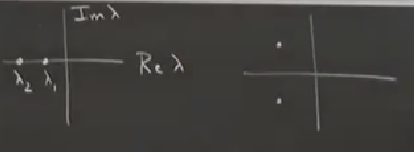

Her iki alternatif üstteki iki grafikte görülüyor. Şimdi üstte sağdaki
noktaların nasıl grafiğin $y$ ekseninin sağ tarafına geçireceğimizi düşünmemiz
lazım, ki bu bölgede $\lambda$'nin reel kısmi pozitif. Bir çatallaşmayı ortaya
çıkartacak olan bu. Özdeğerler $Re \Lambda \ge 0$ bölgesine geçtiğinde
çatallaşma ortaya çıkacak.

Bunun detayına girmeden önce daha neler ortaya çıkacağını şimdiden söyleyeyim,
periyotsal, kapalı yörüngelerden ortaya çıkan çatallaşmalar da vardır. Aslında
bunlardan birini işledik, Hopf çatallaşması.

II. Periyotsal yörüngelerin çatallaşması

a) Çevrimlerin biraraya gelmesi: bu durum eyer düğümü çatallaşmasına benziyor,
hatırlarsak o durumda bir stabil bir gayrı-stabil sabit nokta çarpışarak
birbirini yokediyordu. Benzer bir durum çevrimlerde de ortaya çıkabilir. Mesela
bir stabil çevrim içinde gayrı-stabil bir çevrim vardır, bir parametre
değiştikçe birbirlerine yaklaşırlar, sonra birleşirler, ve bir süre sonra
yokolurlar. Bu duruma çevrimlerin eyer düğüm çatallaşması ismi veriliyor.

b) Eyer düğüm sonsuz periyot çatallaşması (saddle-node infinite period
bifurcation, SNIPER, ya da SNIC). Bu durumda değişmeyen çember üzerinde eğer
düğümü var. İlginç bir durum bu, bir kapalı yörünge var mesela [alttaki grafikte
  en solda], bir parametre değiştikçe çember üzerinde bir acaip bir yarı stabil
sabit nokta ortaya çıkıyor, sanki tek boyutlu bir sistemdeymişiz gibi, sonra bu
nokta bir eğer ve düğüme ayrılıyor, ve tüm akış sabit olan noktaya doğru gidiyor
tabii [altta ortada]. Sonra bu noktalar yaklaşıp birbirlerini yokedebiliyorlar,
ve geriye sadece bir çevrim kalıyor, o çevrim üzerinde hala akış var tabii
[altta sağda]. 

Çevrim içinde de birşeyler olabilir tabii, bundan bahsetmedik ama, mesela çevrim
ortasından çıkan bir akış çembere doğru gidebilir, ya da dışarıdan çembere
doğru. Neyse bunun detaylarına sonra gireceğiz.

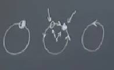

Üstte en sağdaki çevrim sonsuz periyor, niye böyle dedim, çünkü bir tür ardından
ve tam sabit nokta doğmadan önce işler çok yavaşlıyor olacak.

c) Homoklinik Çatallaşma: bu durum için grafik vermeyeceğim fakat dışarıdan
kuvvet verilen sarkaç probleminde ortaya çıkıyor.

Örnekler

I a) $\lambda=0$ çatallaşmaları

1) Eyer düğüm,

$$\dot{x} = a - x^2$$

$$\dot{y} = -y $$

$x,y$ birbirlerinden ayrılmış halde, iki ayrı tek boyutlu sistem var, herkes
kafasına göre takılıyor. $y$ yönünde hiç ilginç bir hareket yok, herşey $y=0$'ya
doğru sönüyor, aynı anda $x$ eksenine doğru itilme var ki tüm ilginç şeyler
burada oluyor. 

Sabit noktalar

$a>0$ iken $(\sqrt{a},0)$, $(-\sqrt{a},0)$. $a$ sıfıra yaklaşırken bu iki sabit
nokta birbirine yaklaşır, ve $a=0$'da birbiriyle birleşip negatif $a$'da
yokeder. Sabit noktalarda Jacobian'a bakarsak,

$$
A =
\left[\begin{array}{rrr}
\frac{\partial \dot{x}}{\partial x} & \frac{\partial \dot{x}}{\partial y}  \\
\frac{\partial \dot{y}}{\partial x} & \frac{\partial \dot{y}}{\partial y} 
\end{array}\right] =
\left[\begin{array}{rrr}
-2x^\ast & 0  \\ 0 & -1
\end{array}\right] 
$$

O zaman $\lambda_1 = -2x^\ast$, $\lambda_2 = -1$ olur.

Dikkat edelim ki stabil düğüme tekabül eden durum $\lambda_1$'in negatif olduğu
durum; çünkü $\lambda_2$ grafiğin sol yarısında, zaten negatif. Ama $x$ pozitif
bir sayı ise, mesela $x^\ast = \sqrt{a}$, $y^\ast=0$ bu bir stabil düğüm, $x^\ast =
-\sqrt{a}$ ise o zaman bir eğer var. Eyer düğüm çatallaşmasından bahsediyorduk,
nihayet ortaya çıktı. Hatırlarsak iki boyutta birbiriyle çarpışan iki şey bir
düğüm ve eğer.

Şimdi özdeğer resmine, yani spektruma bakarsak, 

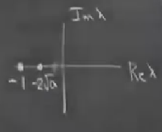

Parametreyi değiştirdikçe özdeğer sağa doğru gidecek, $-2\sqrt{a}$ kritik yer,
onun ardından hızla sıfıra gelinir, ve sıfırda çatallaşma ortaya çıkar. Tabii
"gelmek'' derken bu bir faz portresi değil, parametre değiştikçe özdeğerdeki
değişimlerden bahsediyorum.

Faz portresi

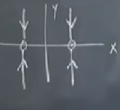

Çizgiler üzerindeki akış üstel bir sönüm, sabit noktalara doğru çürüme
var. Resmi tamamlarsak,

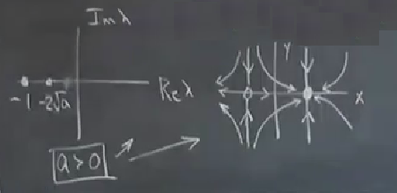

$a$ pozitif $x=0$ iken $\dot{x}$ pozitif, sağa doğru gidiş var [üst orta kısım],
$x$ ekseni değişmez (invariant), vs.

Şimdi tek boyutlu sistemlerde niye bu kadar zaman harcadığımızı da
anlayabiliyoruz, çatallaşma teorisiyle uğraşırken görürsünüz ki tek bir boyut
üzerinde çok ilginç dinamikler görülebiliyor, ve bu dinamik tüm diğerlerine
baskın çıkıyor, üstteki örnekte bu $x$ ekseni. Diğer boyutlarda can sıkıcı
kapanma / inme (collapse) olayları var, yani uzun vadede sistemin nereye
gideceğini tek boyutlu bir manifold karar veriyor ki bu da $x$ ekseni.  Fakat
genel olarak diğer problemlerde göreceğiz dalgalı inip çıkan tek boyutlu bir
manifold olabilir, ve bir stabil ve gayrı stabil sabit nokta birbirlerine bu
manifold üzerinde yaklaşır ve çarpışırlar. Üstteki şekil bize daha çetrefil
durumlarda olanların temsili bir resmini veriyor.

Devam edelim, $a=0$'da üstteki iki nokta biraraya gelip birleşir (bu arada
üstteki iki resim $a>0$ durumu),  onu da görelim,

-1'de çatallaşma ortaya çıkıyor.. Bu resim iki üstteki sağdaki resimde soldaki
iki dik eksenin birleşmiş hali sanki.. Bir de sabit noktayı yarı-stabil
gösterdim, öyle mi acaba? Nokta $y$ ekseninin sağ tarafını kendine çekiyor, sol
tarafını itiyor.. diğer yandan $y$ ekseni üzerinde de bir çekim var, ittiğinden
çok kendine çekiyor.. Dörtte üç stabil mi desek acaba? Öyle bir şey yok tabii, o
yüzden yarı-stabil diyoruz, ama illa doğru kelimelendirmek istesek kısmen stabil
kısmen gayrı-stabil demek lazım.

$a<0$ icin sabit nokta hic yok, bu sebeple sabit noktada $\lambda$'lar uzerinden
spektrum grafigini cizmek mumkun degil, cunku hic sabit nokta yok. Onun yerine
faz duzleminde biraz kafa karistirici alttaki goruntu olusur,

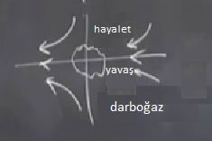

Ortada bir "yavaş'' bölge var, bu bölge illa tam yuvarlak, elips olmayabilecek
bir parça. Bu bölgeye giren gidiş yolları aşırı yavaşlıyorlar, çünkü vektör
alanındaki vektörlerin boyu çok küçük. Bu bölge iki üstteki sabit nokta
yokolduktan sonra arta kalan bir "hayalet'' olarak tarif edilir. Neyse gidiş
yolları oraya girerler, çıkınca tekrar hızlanırlar. Bu tür dinamik sistemleri
bazen görürsünüz. Bu yavaşlama bölgesine bazen "darboğaz'' ismi de
veriliyor. Neyse tarif ettiklerimiz iki boyutta eyer düğümü için tipik bir
durum.

2) Transkritik

Bu örneği size bırakıyorum, analizini yapmak oldukca kolay, sistem şöyle,

$$ \dot{x} = ax-x^2 $$

$$ \dot{y} = -y $$

3) Tırmık

Hatırlarsak tırmık durumunda iki örnek vardı, altkritik (subcritical) ve
süperkritik (supercritical), bu ayrılık hakkında biraz konuşacağız, hatta bu
ayrılık Hopf çatallaşması durumunda da ortaya çıkıyor, sonraki derste bunları
göreceğiz. Bu arada sonraki dersi kaçırmayın çünkü bazı filmler göstereceğim,
filmlerde şimdiye kadar bahsettiğimiz pek çok çatallaşmayı gerçek dünyadaki
örneklerini göreceğiz.

Neyse, tırmığın süperkritik haline bakalım, $a<0$ durumu,

$$ \dot{X} = ax-x^3 $$

$$ \dot{y} = -y $$

Spektruma bakacağız, sabit noktalar $\underline{x}^\ast = (\pm \sqrt{a}, 0)$, bir
tane de orijinde var. Tabii $a<0$ olunca sadece orijindeki sabit nokta geçerli,
yani

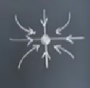

Özdeğerler

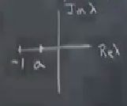

Jacobian

$$ A = \left[\begin{array}{rrr}
a & 0 \\ 0 & -1
\end{array}\right] $$

$a$'yi değiştirdikçe soldan sıfıra doğru yaklaşacak, tam sıfıra geldiğinde başta
gösterdiğimiz ilk iki sabit nokta doğacak demektir. $a=0$ anında şekil 

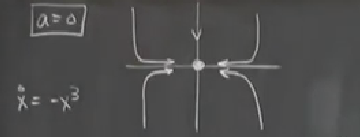

üstteki gibi. Gidiş yolları sıfıra çok yavaş gidiyorlar, çünkü $a=0$ olduğu için
elde kalan $\dot{x} = -x^3$ ve bu ifadenin çürümesi bilindiği gibi çok
yavaştır. Fizikçiler bu yavaşlamaya "kritik yavaşlama (critical slowing down)''
ismini veriyorlar. Bu deneylerde, ikinci derece faz geçilerinde görülebilecek
bir şey, hakikaten ortaya çıkıyor.

$\lambda$ düzlemine bakarsak,

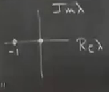

Ve $a>0$ durumunda faz portresi

Orijin bir eğer haline gelir, 

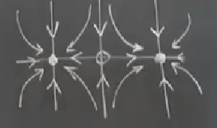

Bu süperkritik tırmık. Tek sabit noktadan üstteki resimde sağdaki ve soldaki iki
nokta ortaya çıktı. Süperkritik çünkü yeni yaratılan sabit noktalar stabil. 

Şimdi Hopf çatallaşmasına biraz girelim, gerisini sonraki derste işleyeceğiz.

Hopf durumu, $\lambda = \pm i\omega$. $\omega$ sembolünü özellikle kullandım
çünkü bildiğimiz gibi bu sembol frekans için kullanılır ve burada hakikaten
hayali sayı olarak bir frekanstan bahsediyoruz, doğum anında limit çevriminin
frekansı bu olacak. Buna eşit bir durum, özdeğerin hayali olmadığı halde, merkez
örneğini düşünelim, hatırlarsak merkez olup olmadığınan emin olamıyorduk, burada
lineer bir merkez var mı? sorusu Hopf çatallaşması ile alakalı, orada $\tau =
0$, $\Delta > 0$.

Ya da glikoliz örneğini hatırlarsak, Poincare-Bendikson teorisi ile
uğraşıyorduk, hani garip bir tuzak bölge yaratmaya uğraşıyorduk, şuna
benziyordu,

sonra ortadaki noktanın sabit olup olmadığını kendimize sorduk. İşte o nokta
aslında bir Hopf çatallaşması yaşıyordu, o zaman bunu bilmiyorduk tabii. 

Şimdi süperkritik Hopf örneği görelim, sonraki derste altkritik örneğini
görürüz.

Süperkritik durumda bir stabil sarmal çatallaşmanın bir tarafında yaşar, bir
parametreyi değiştirdikçe çatallaşmaya gireriz, ve gayrı-stabil sarmala dönüşüm
olur. Fakat gayrı-stabil sarmal tek başına değil artık, etrafında ufak genlikli,
stabil bir limit çevrimi var, ve bu çevrimin şekli her zaman eliptiktir, en
azından doğum anı yakınında. Genel şartlar altında bu hakikat bir limit çevrimi
olur, "kapalı yörünge'' demiyorum dikkat ederseniz, bu çevrim tamamen izole
olacaktır. Hopf Teorinsi denen bir teori var, ve limit çevrimlerinin varlığını
garanti eden şartları belirliyor, bu durumda stabil. Altkritik durumda
gayrı-stabil olurdu. 

Ornek gorelim, Hopf durumunda $\lambda_1,\lambda_ \pm i\omega$ demistik.

$$ \dot{r} = ar - r^3 $$

$$ \dot{\theta} = \omega + br^2 $$

Normal formların teorisini kullanarak Hopf çatallaşması yakınında dinamiğin
üstteki gibi olduğunu ispat edebiliyorsunuz. Dönüşün frekansında bir sabit terim
oluyor, üstte $\omega$, ama bir genliğe de bağlantı oluyor $br^2$ terimi.

Sistemimiz böyle. Dikkat edersek aşağı yukarı ayrışmış (decoupled) halde,
$\dot{r}$ sadece $r$'ye bağlı. Gerçi $\dot{\theta}$ hala $r$'ye bağlı, ama hala
yarıçapsal yönde tek boyutlu bir sistemimiz var, ve $\theta$ bazında $r$
tarafından "sürülen'' bir başka sistemimiz.  

Tek boyutlu sistem için $r=0$ tek boyutlu dinamiğin sabit noktasını verir, ama
$a \le 0$ ise stabildir. Gerçi $a=0$ için de stabildir, daha önce bahsettiğimiz
zayıf, kritik yavaşlama bağlamında, ama $a<0$ için üstel stabildir, $a>0$ için
gayrı-stabildir. Çatallaşma $a=0$'da ortaya çıkar. 

Dikkat edersek $a>0$ ve tek boyut durumunda $\dot{r} = r(a-r^2)$ ayrıştırması da
yapılabilir, ve bu bize $r = \sqrt{a}$ stabil sabit noktasını verirdi, fakat biz
tek boyutta değiliz, iki boyuttayız, o zaman o sabit nokta $\sqrt{a}$ çaplı bir
çembere tekabül ediyor. Bu çember $a$ sıfıra yakın ama pozitif olduğu durumdaki
limit çevrimidir. Diyelim ki $\omega,b$ pozitif, şekil suna benzer, 

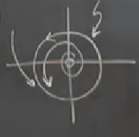

Yani $a>0$ olduğunda bir gayrı-stabil sarmal ortaya çıkar.

Sarmalin genligine dikkat, $\sqrt{a}$. O zaman $a$ kucuk oldugu durumda genlik
kucuk olacaktir, yani dogum aninda bu limit cevrimi sifir genlikli bir
cevrimdir.

Bu arada üstteki örnek için özdeğerleri bulmanın en kolay yolu Kartezyen
kordinatına geçmek, $x=r\cos\theta$, vs diyerek, kutupsal kordinatta Jacobian
hesabı yapmakla uğraşmayın, çok karışık olur.

$a<0$ icin resim,

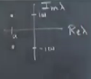
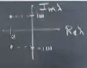

$a$'yı değiştirdikçe özdeğerler noktalı çizgi üzerinde sağa hareket edecekler. 

$a=0$'da özdeğerler pür hayali. Faz düzleminde $\dot{r}=-r^3$ olurdu, yani çok
yavaş bir çürüme var, 

Çizim dış çeperde bir çember olmaya uğraşan ama bir türlü başaramayan bir
gidişat gösterir, acaip bir tür sarmaldir, bu çizimi bilgisayarda yapmanızı
tavsiye ederim, çizimin nasıl gittiğini de görmüş olursunuz böylece bu gidişatı
başka yerde görünce hemen tanırsınız. Çizim orta kısmi kapkara hale getirecek,
işte Hopf çatallaşmasının sonucu bu, sıfıra doğru çürüyüşü o kadar yavaş ki
giderken yoldaki tüm pikselleri boyamış oluyor, ve kapkara bir yüzey ortaya
çıkartıyor. 

Bu arada, $a=0$ durumunda lineer teori bir merkez tahmin ederdi, fakat bu yanlış
olurdu, elimizde bir sarmal var. 

Ödev

Alttaki sorular için faz portresini bir kontrol parametresi $\mu$'ya bağlı
olarak çizin. $\mu$ değiştikçe ortaya çıkan çatallaşmaları sınıflayın, ve
$\mu$'nun tüm çatallaşma değerlerini bulun. 

Soru 4.3.3

$$ \dot{\theta} = \mu \sin\theta - \sin 2\theta$$

Cevap

Bu sistemin sabit noktalarını bulmak için çift açı formülünü kullanarak
$\dot{\theta} = 0$ yapıp çözeriz. Ya $\sin \theta = 0$ ki bu $\theta^\ast = 0$ ya
da $\pi$ demektir, ya da $\sin\theta$ ile bölebiliriz, ki bu durumda $\mu/2 =
\cos\theta^\ast$. $\mu$'nun farklı değerlerine göre farklı sayıda sabit nokta elde
edeceğimiz şimdi görülüyor olmalı. Altta $\dot{\theta}$'nin $\mu$ ve
$\theta$'nin fonksiyonu olarak üç boyutlu grafiği görülebilir.

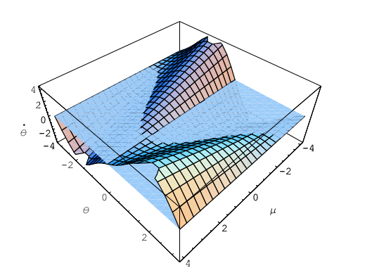

Tüm bunlardan $\dot{\theta}=0$ düzlemi ile kesişmesini düşünerek bir çatallaşma
diagramı çıkartabiliriz. Bu kesişmenin ortaya çıkardığı eğriler çatallaşma
diagramının şekli olacaktır, ve çatallaşma eğrisinin her iki tarafında
$\dot{\theta}$'nin işaretine bakarak stabilite hakkında bilgi edinebiliriz. Tüm
bunları kullanarak alttaki diagramı elde ederiz, 

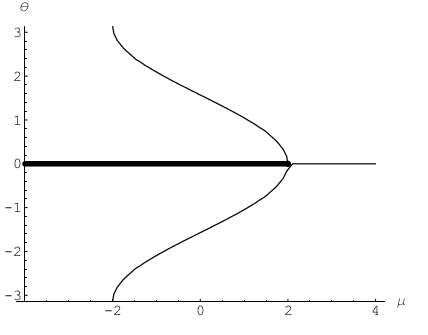

Görüldüğü gibi kritik değer $\mu_c= \pm 2$'de bir tırmık çatallaşması var. Bu
kritik değerleri $\mu/2 = \cos\theta^\ast$ denkleminin tek olan / yanlız
çözümlerinin ilk bu noktada ortaya çıktığını ve sonra yokolduğunu görerek te
elde edebilirdik, yani geçici / ara değerler için iki tane çözüm olduğunu ama
aralık dışındaki $\mu$ değerleri için hiç çözüm olmadığını görerek. Bunları
kullanarak $\mu$ değiştikçe ortaya çıkan çizdiğimiz grafikler
alttadır. Grafikler $\mu$ -2 altından 2 üstüne çıktıkça ortaya çıkan vektör
alanlarıdır.

Soru 4.5.1

Ateş böceği modelinde böceğin cevap fonksiyonu olan sinüssel form biraz rasgele
şekilde seçilmişti. Şu alternatif modeli düşünelim, $\dot{\Theta} = \Omega$,
$\dot{\theta} = \omega + A f(\Theta-\theta)$ ki $f$ şimdi bir üçgen dalga
fonksiyonu olsun (triangle wave). Spesifik olarak $-\frac{\pi}{2} \le \phi \le
\frac{3}{2}\pi$ aralığında 

$$ f(\phi) =
\left\{ \begin{array}{ll}
\phi, & -\frac{\pi}{2} \le \phi \le \frac{\pi}{2} \\
\pi-\phi, & \frac{\pi}{2} \le \phi \le \frac{3}{2}\pi
\end{array} \right.
$$

olsun, ve $f$'i periyotsal olarak bu aralığın dışına çıkartalım. Şimdi

a) $f(\phi)$'i grafikleyin.

b) Etkilenme bölgesini bulun

c) Böceğin etkileyene fazsal kitlenmiş olduğunu farzederek faz farkı $\phi^\ast$
için formülü bulun.

d) $T_{kayış}$ formülünü bulun.

Cevap

a)

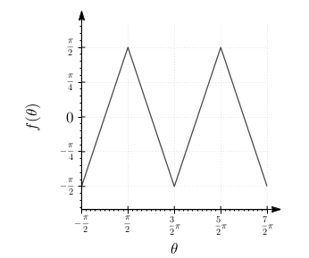

b)

Etkilenme bölgesinde ateş böceği senkronize olabiliyor (frekansını
uyumlayabiliyor). Bu $\dot{\phi} = \dot{\Theta} - \dot{\theta}$ sıfır anlamına
gelir, ve

$$  \dot{\phi} = \dot{\Theta} - \dot{\theta} = 0 =
\Omega - \omega - A f(\Theta-\theta) \iff
\Omega = \omega + A f(\Theta-\theta)
$$

$f(\theta)$ $-\frac{\pi}{2}$ ile $\frac{\pi}{2}$ arasında olabildiğine göre
uyumlanma bölgesi $\omega - A \frac{\pi}{2} \le \Omega \le w + A
\frac{\pi}{2}$.

c)

Fazın kitlenmiş olması $\dot{\phi} = \Omega - \omega - A f(\phi^\ast) = 0$ demek,
bunun sonucu $f(\phi^\ast) = \frac{\Omega - \omega}{A}$. Üstten görüldüğü üzere
$|f(\phi^\ast)| < \frac{\pi}{2}$. 

d)

$T_{kayış}$ için entegrasyon formülünü kullanıp içine $f(\phi)$ sokarsak ve
entegrali pürüzsüz bölgeleri üzerinden parçalara ayırırsak,

$$ T_{kayış} =
\int_{0}^{2\pi} \frac{\mathrm{d} t}{\mathrm{d} \phi} \mathrm{d} \phi =
\int_{0}^{2\pi} \frac{1}{\Omega - \omega - Af(\phi)} \mathrm{d} \phi
$$

$$ = \frac{1}{A} \int_{-\frac{\pi}{2}}^{\frac{\pi}{2}}
\frac{1}{\frac{\Omega-\omega}{A}} \mathrm{d} \phi +
\frac{1}{A} \int_{\frac{\pi}{2}}^{\frac{3}{2}\pi} \frac{1}{\frac{\Omega-\omega}{A}-\pi+\phi}\mathrm{d}\phi
= \frac{2}{A} \ln \bigg(
\frac
    {\frac{\Omega-\omega}{A} + \frac{\pi}{2}}
    {\frac{\Omega-\omega}{A} - \frac{\pi}{2}}
\bigg)
$$

Soru 5.1.9

$\dot{x} = -y, \dot{y} = -x$ sistemini alalım.

a) Sistemin vektör alanını taslaksal olarak çizin.

b) Gidiş yollarının $x^2+y^2=C$ formunda hiperboller olduğunu gösterin (tiyo:
ana denklemlerin $x\dot{x}-y\dot{y}=0$ demek olacağını gösterin, sonra her iki
tarafı entegre edin).

c) Orijin bir eğer noktası, onun stabil ve gayrı-stabil manifoldlarının
formüllerini bulun.

d) Sistemin iki kısmı arasında bağlantıları kesmek ve çözmek şöyle mümkün. Yeni
değişkenler $u,v$'i kullanın, ki $u=x+y$, $v=x-y$. Sonra sistemi bu iki yeni
değişken bazında tekrar yazın. Şimdi $(u_0,v_0)$ başlangıç durumu için
$u(t),v(t)$ çözümünü bulun.

e) Stabil ve gayrı stabil manifoldun $u,v$ bazındaki hali nedir?

f) (d) sonucunu kullanarak $(x_0,y_0)$ başlangıç şartlarından $x(y),y(t)$ için
genel çözümü yazın.

Cevap

a)

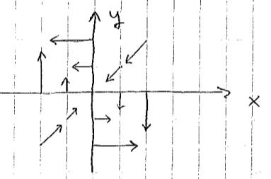

b) Gidiş yolları

$$ \frac{\dot{y}}{\dot{x}} = \frac{-x}{-y} = \frac{\mathrm{d} y}{\mathrm{d} x} $$

ile bulunabilir.

$$ \Rightarrow y\mathrm{d} y = x \mathrm{d} x \Rightarrow y^2 - x^2 = sabit$$

c)

Orijinde $J_{0,0} = \left[\begin{array}{rr}
0 & -1 \\ -1 & 0
\end{array}\right]$

$$ \Rightarrow \lambda^2 - 1 = 0 \Rightarrow \lambda = \pm 1 $$

Özvektörler,

$$ \lambda_1=1, \quad \underline{v}_1 = \left[\begin{array}{cc}1&-1\end{array}\right]^T $$

$$ \lambda_2=-1, \quad \underline{v}_2 = \left[\begin{array}{cc}1&1\end{array}\right]^T $$

d) $u=x+y$, $v=x-y$ ise o zaman 

$$ \dot{u} = -u \Rightarrow u(t) = u_0 e^{-t} $$

$$ \dot{v} = v \Rightarrow v(t) = v_0 e^{t} $$

$u,v$ kordinat sisteminde $\left[\begin{array}{cc}1&0\end{array}\right]^T$ ve
$\left[\begin{array}{cc}0&1\end{array}\right]^T$ stabil ve gayrı-stabil
manifoldlar. 

e)

$$ x(t) = \frac{u+v}{2} = \frac{u_0 e^{-t} + v_o e^{t}}{2} $$

$$ = \frac{x_0+y_0}{2} e^{-t} +  \frac{x_0-y_0}{2} e^{t} $$

$$ y(t) = \frac{u-v}{2} = \frac{u_0 e^{-t}}{2} - \frac{v_0}{2} e^{t} $$

$$ = \frac{x_0+y_0}{2} e^{-t} - \frac{x_0-y_0}{2} e^{t}  $$

O zaman gidiş yolları alttaki gibi olur,

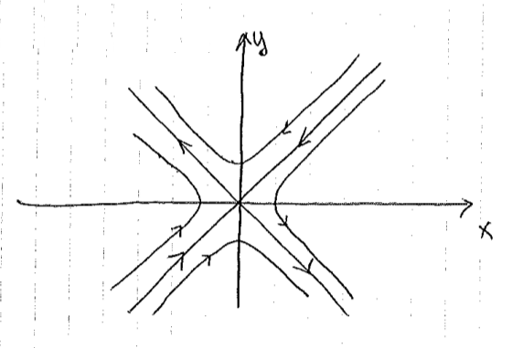

Soru 6.1.5

Alttaki sistem için sabit noktaları bulun. Ardından durağan eğrileri
(nullclines), vektör alanını, ve akla yatkın bir faz portresini taslaksal olarak
çizin.

$$ \dot{x} = x(x-y), \quad \dot{y} = y(2x-y) $$

Cevap

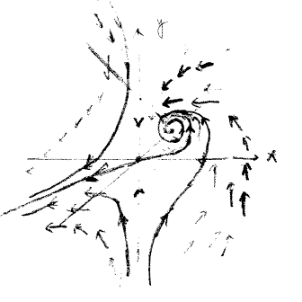

$x$ durağan eğrisi: $x=0$ ya da $2-x-y=0$'da.

$y$ durağan eğrisi $x-y=0$'da.

Sabit noktalar (0,0) ve (1,1).

$$ J = \left[\begin{array}{rr}
2-2x-y & -x \\ 1 & -1
\end{array}\right] $$

$$ J_{0,0} = \left[\begin{array}{rr}
2 & 0 \\ 1 & -1
\end{array}\right] $$

Bu bir eğerdir.

$$ J_{1,1} = \left[\begin{array}{rr}
-1 & -1 \\ 1 & -1
\end{array}\right] $$

Bu bir stabil sarmaldır. 

