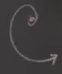
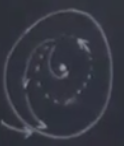
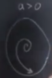
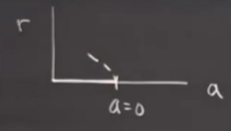
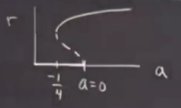

# Ders 13

Önceki derste süperkritik Hopf çatallaşması hakkında konuştuk, bu derste onları
altkritik Hopf çatallaşmasından ayırmak istiyorum. Kelimelendirmeden bu iki
çatallaşmanın ne kadar farklı olduğu belli olmuyor; umarım ki bu ders sonunda ne
kadar farklı olduklarını anlamış olacağız, çünkü bu farkın bilimsel bağlamda
önemli yansımaları var.

Altkritik durumda elimizde bir gayrı-stabil çevrim var, ve bu çevrim bir stabil
sarmal ile sarılmış,


Geçiş nasıl olur? Bir parametreyi değiştirdikçe noktalı çizgi ile gösterdiğimiz
limit çevrimi ufalacak, ufalacak, ve ortadaki noktayı boğmaya / sıkıştırmaya
başlayacak, ta ki şöyle resimler çıkıncaya kadar,




Dikkat edelim, ortada tam gözükmese bile hala çok ufak bir çevrim var, o
sabit noktayı saran aşırı küçültülmüş bir çevrim işte, tam çatallaşma
anında çevrim bir noktaya inmiş durumda. Yani stabil sarmalı çeviren
gayrı-stabil çevrimden gayrı-stabil sarmala gidiş oluyor (üstte sağdaki
resim).

Ters yönde geçişi de düşünebilirdik, ki buna da altkritik Hopf deniyor, üstteki
sağdaki durumdan başlayabilirdik, parametre değişimi sonucu ufak bir
gayrı-stabil çevrim ortaya çıkıyor, ve büyüye büyüye iki üstteki duruma
geliniyor. Buna da altkritik deniyor, hangi yöne gidildiği önemli değil, önemli
olan çevrim ortaya çıktığında gayrı-stabil olması. 

Eğer salınımın genliği bağlamında düşünürsek, onu faz düzleminde genliğin
yarıçapsal miktarı $r$ olarak görelim (y ekseninde), ve bir kontrol
parametresine eşleyerek grafiklersek (x ekseninde),


Noktalı eğri büyük ama gayrı-stabil salınımı temsil ediyor, aşağı iniyor yani
küçülüyor. Ayrıca çok koyu renkli x ekseni üzerinde çizdiğim çizgi var, o da
iki üstteki grafikteki sabit noktayı temsil ediyor. Ufak okla gösterdiğim
noktada altkritik Hopf oluşuyor, bu noktada bir çarpışma var ve geriye
gayrı-stabil sarmal kalıyor, ki bu bir sıfır genlikli obje bir
bakıma. Çatallaşma figürü buna benzer.

Kıyasla süperkritik Hopf suna benzer,


Hala altta düz koyu çizgi boyunca bir stabil nokta var, ki bir noktadan sonra
gayrı-stabil olur. Burada farklı olan artık çevrim sağ bölgede yaşıyor, ve
stabil. Son derste baktığımız resim buydu zaten, elimizde bir stabil sabit nokta
vardı ve bu sabit nokta ufak stabil limit çevrimine dönüşmüştü.

Altkritik ve süperkritik çatallaşmalara bilim dünyasının farklı kesimleri
farklı isimler verebiliyorlar. Mesela süperkritik için "yumuşak (soft)'',
"sürekli (continuous)'', hatta "güvenli (safe)'' kelimeleri
kullanılabiliyor. Altkritik için "sert (hard) '', "süreksiz
(discontinuous)'', "tehlikeli (dangerous)'' kelimeleri. Bunlar hakikaten
farklı kelimeler ve tehlikeli ve güvenli birbirine oldukca zıt
tanımlamalar. Bu iki durumdan birini güvenli diğerini tehlikeli yapan
nedir? Kavrama mesela bir kontrol mühendisinin açısından bakarsak, diyelim
ki mühendis uçak kanat titreşimlerine bakıyor. Tabii ki kanatların çok
fazla titremesini istemeyiz yoksa kanat titreye titreye kopar ve uçak düşer
- bu tehlikeli.

İki üstteki grafikte takip edersek, titreşimin genliği bağlamından bakalım,
koyu çizgi üzerinde hiç kanat titreşimi yok, çünkü sabit nokta
üzerindeyiz. Çatallaşma olacağı noktaya geliyoruz, şimdi sistem bir çekici
(attractor) arıyor, fakat etrafta hiç çeken bir şey yok. Bu
tehlikeli. Değil mi?  Çünkü sıfır genlikte olan sistem bir şeye zıplayacak,
ama neye? Kıyasla bir üstteki resimde orijinden başlayıp ilerliyorum,
zıplama noktasında gidebileceğim bir nokta var. Titreşim var ama belli
miktarda (koyu renkli eğrinin gösterdiği kadar). Daha önce babamın
parkinson hastalığından kolu titriyor demiştim, bu durumda titreme yine
olurdu, ama belli miktarda. Bu kolun oraya buraya kontrolsüz savrulmasından
daha iyidir, değil mi? Altkritik Hopf ile aklımıza bu gelmeli, stabilite
kaybı sonrası gidişin nereye olduğu belli değil, ve gidiş büyük ihtimalle
felakete varacak. Bu davranış sebebiyle bu türe süreksiz ve tehlikeli ismi
veriliyor.

Kutupsal kordinatta altkritik için bir örnek görelim,

Örnek

$$ 
\dot{r} = ar + r^3 -r^5 
\qquad (1) 
$$

$$ \dot{\theta} = 1 $$

$\theta$ yönünde ilginç bir olay yok, sadece dönüyoruz. Eğer $r^3$'ün
işareti eksi olsaydı örnek süperkritik olurdu, daha önceki derste
işlediğimiz örneğe benzerdi. Ama artı işareti ile şimdi ortaya yaramaz bir
sistem çıkacak.

$a < 0$ için yarıçapsal yöndeki (yani $r$ için) tek boyutlu sisteme
bakarsak $-1/4 < a < 0$ olur, 



bu rejimde bir stabil bir sabit nokta var, etrafında mükemmel yuvarlak olan
gayrı stabil bir çevrim var [noktalı çizgi], $\dot{\theta}=1$ olduğu için
saat yönü tersine gidiyoruz. Dış çemberden iç sabit noktaya doğru bir
sarmallanma var, peki ya çember dışındaysak? O zaman dışarıdaki başka bir
çevrime doğru bir gidiş olur. İnanılası gelmiyor ama resimde bir çevrim
daha var [hoca dış çemberi resme sonradan ekledi]. Bunu hızlı bir şekilde
kontrol edebiliriz aslında, $\dot{r}$ formülünde $r$'yi dışarı çekersek
$r(a + r^2 -r^4)$ olur, bu $r^2$ bazında karesel bir formüldür. O zaman
karesel formül çözümünü kullanarak bir tane daha $r$ çözümü elde ederiz, o
çözüm de dıştaki limit çevrimi olur. Yani iki limit çevrimin aynı anda
mevcut olması durumu (coexistence) var. Bir tane büyük genlikli salınımlı
stabil çevrim var, ve tabii ortada stabil bir nokta ki bu noktanın salınımı
yok (yani aynı problemin iki tane çekicisi var). $a=0$'da demiştik ki gayrı
stabil limit çevrimi çevrim küçülüp ortadaki sabit noktayı boğar. $a>0$
sonrası içte tamamen gayrı-stabillik var, işte bu noktada sadece dışarıdaki
aşırı büyük genlikli "tehlikeli'' salınım var. 



Sistem o noktada farklı bir çekiciye zıplamış oldu. Çatallaşma diyagramı
şuna benzer,




Üst soldaki resimde $a=0$'a kadar [eksen üzerinde] koyu renkli bölgede
stabil sabit nokta, sonra gayrı-stabil limit çevrimi [kesikli çizgi]
var. Bu arada bazıları bu çatallaşmaya "geri çatallaşma (backward
bifurcation)'' ismini veriyor, çünkü şekilde de görüldüğü gibi, kontrol
parametresi $a$'ya göre geriye doğru bir gidişi var. $a=-1/4$'te bir şeyler
oluyor [soldan ikinci resim] şimdi onun detaylarına girmek istemiyorum,
sonra işleyeceğiz, ama bu noktada iki çevrim çarpışıyor, bu farklı türden
bir çatallaşma, ve gidişat büyük genlikli stabil çevrime doğru gidiyor. 

Şimdi $a$'yı arttırarak olanlara bakalım, $a<0$'dan önce eksen üzerindeyiz,
sonra $a=0$'da küt diye üste zıplama var, bu sürekliliği kesintili bir
geçiş, pürüzsüz değil. Geçiş sonrası bakıyoruz, burada büyük genlikli limit
çevrimi var, orada devam edilebilir, ama orada kalmak istemezsek $a$'yi
azaltabiliriz,


Peki azaltınca tam geldiğimiz yola mı döneriz? Hayır, dönüş dış limit
çevrimi üzerinde, $a=0$'dan sola doğru devam, $-1/4$'e doğru iniş. Bu daha
önce gördüğümüz histeresis örneği, ama bu sefer sabit noktalar bağlamında
değil çevrimler bağlamında. 

Bir konudan daha bahsedeyim, sonra video'lara geçeceğiz. Akılda tutulması
faydalı olabilecek bir bilgi lineerizasyonun süper ya da altkritik
çatallaşma arasındaki farkı anlamak için yardımcı olmadığı. Bunun doğru
olduğunu daha önce çizdiğimiz resimlere bakara görebiliriz [altkritik ve
süperkritik resimler, bir daha]. 


Diyelim ki orijinden başlayarak x ekseni üzerinde sağa giden bir böceğiz
[hoca bu benzetmeyi lokal olarak bilgiye bakan lineerizasyonu temsil etmek
için kullanıyor], bu böcek giderken çok az miktarda dikey yönü görebilir. O
zaman bu böceğin bakış açısına göre üstteki iki resim birbirine çok
benzer. Stabil bir gidiş var, ardından kesikli bir gidiş var. Lokal olarak
birbirlerinden pek farkları yok. Farkları çevrimleri temsil ve yukarı
doğru eden dallanmalar ve bu dallanmaların stabilitesi.

Ya da bu işlemezliğin (1)'deki küpsel terim ile alakası da
olabilir. Gördüğümüz sistemde herşey kontrol eden $r^3$'ün işaretidir, ve
bu terim gayrı-lineer bir fenomen, ki lineerizasyon bu terimi analiz etmek
için kullanılamaz. Eğer $r^3$'ün işareti artı ise genlik arttıkça $r^3$ bu
genliğin *daha da* artmasına yardım eder, yani patlama yapan türden bir
gayrı-stabillik var. Süperkritik durumda $r^3$ gayrı-stabil lineer kısma
ters yönde işliyor, yani çok farklı bir davranış. Demek ki lineerizasyonu
alt/süperkritik Hopf arasında seçim yapmak için kullanamayız.

Peki bu ayrımı gösteren hiç bir analitik kriter yok mudur? Böyle bir
yaklaşım var, fakat oldukca çetrefil çünkü düşünürsek yaklaşımın
nihayetinde $r^3$ teriminin işaretini bulması gerekiyor, bu demektir ki
hesap lineerizasyonla yetinemez, bir şekilde normal formu dikkatlice
hesaplamalıdır. Normal form konusuna girmedik, bu konuyu bu derslerde
işlemeyeceğiz, oldukca ağır bir konu. Merak edenler Guckenheimer ve
Holmes'un kitabında 3.4'cu bölüme bakabilirler, ya da benim kitabımda
8.2.12'cı problemde yazdığım şarta bakabilir, bu şartı türetmeden yazdım,
ama şartı kullanmakta egzersiz amaçlı olarak faydalı olabilir. Fakat en
rahat olanı herhalde pür hesapsal olarak yaklaşmak, çoğunlukla bu yaklaşım
yeterince iyi bir sonuç verir.

Soru

Bu bir terminoloji sorusu, altkritik Hopf'da gayrı-stabil [kesikli çizgi]
kritik noktadan önce geliyor, ve o zaman "alt'' kelimesini kullanmak
mantıklı. O zaman mesela resim şöyle olsaydı


sistem yine altkritik olarak tanımlanabilir miydi? 

Cevap

Evet, her ne kadar bu verilmiş kötü isim tersini ima etse de prensipsel
olarak yönler önemli değil. Tek önemli olan çatallaşan obje [üstteki
resimde kritik nokta sonrasında üste doğru dallanan kısım] stabil mi değil
mi? Üstteki resimde çatallaşan obje, yani basit gidişten ayrılan kısım,
gayrı-stabil, bu çatallaşmalara altkritik diyoruz, her ne kadar bu oluş
parametrenin daha *yüksek* değerlerinde ortaya çıkıyor olsa bile.

Bu arada niye bu terimleri kullanıyoruz biliyor musunuz? Sıvı dinamiği
bilim dalı yüzünden. Bu alanda çalışanlar mesela bir Reynolds sayısı, ya da
Rayleigh sayısı gibi bir kontrol parametresi ile oynarlar, ve bu sayılar
akışın ne kadar hızlı, ya da taşınımı (convection) itekleyen ısı
gradyanının ne kadar kuvvetli olduğunu kontrol eder, vs. Bu alanda
parametreyi arttırınca sistemi bir çatallaşmaya itersiniz, ama bu kişiler
çoğunlukla kritik sayıdan önce olanlara bakarlar ki orada çatallaşma yok.

Video'lar

Şimdi size birkaç video göstermek istiyorum. Video kalitesi için özür diliyorum,
amatör bir şekilde çekildiler, şimdi düşünüyorum 20 sene olmuş. 20 sene önce ben
MİT'de ders veriyordum, ve Boston bölgesinde kendi alanlarında, laboraturlarında
gayrı-lineer fenomenler ile karşılaşmış olan bir sürü tanıdığım vardı, bana bu
deneyleri gösterdiler. Sonra ben Cornell'e gelmeye karar verince dedim ki bu
müthiş deneyleri kaybetmek istemiyorum, onları bir kere kaydetsem sonra
istediğim kadar göstersem iyi olmaz mı? Bu video'lar böyle ortaya çıktı.

İlk video aerodinamik uzmanı John Dugundji ile çekildi, video'da test
kanatları üzerinde yapılan hava akım deneyleri var. Dugundji bu deneyler
için bir sistem kurmuştu, hava tüneli diyemeyeceğim, bir elektrik
süpürgesini almış, onu tersten işletiyordu, yani süpürge hava çekeceğine
onu itiyor. Bir sürü gürültü oluyor tabii, ama müthiş ilginç bir sistem
kurmuştu. Deney sırasında bir parametreyi de değiştirebiliyor, hava
akımının gücünü ayarlıyor, vs. Bizim matematiksel olarak gördüğümüz sayısal
değişimi Dugundji hakikaten süpürge üzerinde mekanik bir ayarı değiştirerek
yapıyordu yani.

Uçak Kanat Titreşimi [1]

İkinci video kimyasal salınımlarla ilgili, onu İrwing Epstein adlı bir
kimyacı ile kaydettik. Epstein, denge noktasına alışılageldik, tekdüze
(monotonic) şekilde giden kimyasal reaksiyonlarla değil dengeye giderken
salınıma giren türden reaksiyonlarla ilgileniyordu. 50'li yıllarda kimsenin
böyle reaksiyonlardan haberi yoktu, reasiyonlar dengeye düz şekilde gider
zannediliyordu. Mesela reaksiyon sırasında renk bir kere değişir, ama o
kadar diye düşünülüyordu. Kapalı bir sistemde entropinin artışını anlatan
Termodinamiğin 2. kuralını düşünerek te bu durumlarda çok ilginç şeylerin
olacağı beklenmiyordu. Hikayenin daha çetrefil olduğu sonradan anlaşıldı.

Eski Sovyetler Birliğinden bir biyokimyacı Boris Belousov, krebs döngüsü ile
uğraşıyordu, bu döngünün bir test tüp şeklini yaratmak istedi. Bu döngülerde
mevcut olan kimyasal öğeleri karıştırdı, ve deneylere başladı. Fakat şaşırtıcı
bir şekilde reaksiyonun periyodik olarak renk değiştirdiğini gördü. Renk bir
sarı oluyordu, sonra renksiz, sonra tekrar sarı oluyordu, bu renk değişimi
dakikalarca bu şekilde gidip geliyordu. Bu durum Belousov'u çok şaşırttı tabii,
bu zamana kadar kimse böyle bir şey görmemişti, olanları bir makale dikkatlice
anlatmaya uğraştı, bilimsel yayınlara gönderdi, fakat bu dergilerden sürekli ret
cevabı aldı. Araştırmaya bakan hakemler "olur mu böyle şey?'' yorumunu
yapıyorlardı.

Belousov pek çok kez yayını denedi, sonunda pek takip edilmeyen bir radyoloji
yayınında makaleyi yayınlatmayı başardı. Neyse, ama Moskova'da da yaptığını
bilenler vardı, bu hocalardan birisi doktora öğrencilerinden birine "şu
Boris'in anlattığı deneyi bir yap bakalım ne olacak'' demiş, öğrenci deneyi
yapıyor ve tabii ki aynı sonucu görüyor. Öğrencinin ismi Zhabotinsky ve onun
ismini duymuşsunuzdur belki çünkü bu renk deneyi artık Zhabotinsky deneyi olarak
biliniyor. O deneyi daha da geliştirdi, mesela deneyin birazdan göreceğimiz hali
birkaç renk arasında geçişi gösteriyor.

Irwing Epstein ile Kimyasal Reaksiyon, Renk Değişimi [2]

Ornek 8.2.1 [kitaptan]

$\dot{x} = \mu x - y + xy^2$ ve $\dot{y} = x + \mu y + y^3$ sistemini
olsun, $\mu$ değiştirildikçe Hopf çatallaşmasının orijinde ortaya çıktığını
gösterin. Çatallaşma altkritik mi, süperkritik mi, dejenere mi?

```python
import numpy as np
import matplotlib.pyplot as plt
from scipy import *
from scipy import integrate
from scipy.integrate import ode, odeint

# Initial setup
xx0 = np.array([.25,1.5])
mu_ =[-.5,0,.07,1]
xmin,xmax = -2,2
ymin,ymax = -2,2
lw = 1.5
plt.close()
fig,([ax0,ax1],[ax2,ax3]) = plt.subplots(2,2,
                                         figsize=(12,8),
                                         sharex=True,
                                         sharey=True)
ax0.set_facecolor(plt.cm.gray(.95))
ax1.set_facecolor(plt.cm.gray(.95))
ax2.set_facecolor(plt.cm.gray(.95))
ax3.set_facecolor(plt.cm.gray(.95))
#ax.axis('equal')

#Vector field
x1,y1 = np.linspace(xmin,xmax,200),np.linspace(ymin,ymax,200)
X,Y = np.meshgrid(x1,y1 )
#Plot1
#====================================
mu=mu_[0]
U = mu*X - Y +X*Y**2
V = X + mu*Y + Y**3
start = [[0.3,0],[1.4,-.35]]

#Plotting
strm = ax0.streamplot( X,Y,U, V,linewidth=.2)
strmS = ax0.streamplot(x1,y1, U, V, start_points=start, color="crimson", linewidth=.5)
fig.suptitle('Hopf Bifurcation /n Strogatz 8.2.1, p.256', size=16)
ax0.set_title( 'a) Stabil Sarmal', size=12)
ax0.text(xmin+.25,ymax-.25, r'$\mu = {0}$'.format(mu),size=14)
ax0.plot(y1/(mu+y1**2),x1, 'k-.',lw=lw, label=r'x-nullcline: $x = \frac{y}{(\mu+y^2)}$')
ax0.plot(-mu*y1+y1**3,x1, 'k:', lw=lw, label=r'y-nullcline: $x =  -\mu y + y^3}$')
ax0.set_xlim([xmin,xmax])
ax0.set_ylim([ymin,ymax])
ax0.set_xlabel(r"$ x$",size=14)
ax0.set_ylabel(r"$ y$",size=14)
plt.grid(True)

#Plot 2
#===================================
mu= mu_[1]
U = mu*X - Y +X*Y**2
V = X + mu*Y + Y**3
start = [[0.3,0],[.6,.5]]

#Plotting
strm = ax1.streamplot( X,Y,U, V,linewidth=.2)
strmS = ax1.streamplot(x1,y1, U, V, start_points=start, color="crimson", linewidth=.5)

ax1.set_title( 'b) Kritik Nokta', size=12)
ax1.text(xmin+.25,ymax-.25, r'$\mu = {0}$'.format(mu),size=14)
ax1.plot(y1/(mu+y1**2),x1, 'k-.',lw=lw, label=r'x-nullcline: $x = \frac{y}{(\mu+y^2)}$')
ax1.plot(-mu*y1+y1**3,x1, 'k:', lw=lw, label=r'y-nullcline: $x =  -\mu y + y^3}$')
ax1.set_xlim([xmin,xmax])
ax1.set_ylim([ymin,ymax])
ax1.set_xlabel(r"$ x$",size=14)
ax1.set_ylabel(r"$ y$",size=14)
plt.grid(True)
#Plot 3
#===================================
mu= mu_[2]
U = mu*X - Y +X*Y**2
V = X + mu*Y + Y**3
start = [[0.3,0],[.6,.5]]

#Plotting
strm = ax2.streamplot( X,Y,U, V,linewidth=.2)
strmS = ax2.streamplot(x1,y1, U, V, start_points=start, color="crimson", linewidth=.5)

ax2.set_title( 'c) Gayri Stabil Sarmal', size=12)
ax2.text(xmin+.25,ymax-.25, r'$\mu = {0}$'.format(mu),size=14)
ax2.plot(y1/(mu+y1**2),x1, 'k-.',lw=lw, label=r'x-nullcline: $x = \frac{y}{(\mu+y^2)}$')
ax2.plot(-mu*y1+y1**3,x1, 'k:', lw=lw, label=r'y-nullcline: $x =  -\mu y + y^3}$')
ax2.set_xlim([xmin,xmax])
ax2.set_ylim([ymin,ymax])
ax2.set_xlabel(r"$ x$",size=14)
ax2.set_ylabel(r"$ y$",size=14)
plt.grid(True)
#Plot 4
#===================================
mu= mu_[3]
U = mu*X - Y +X*Y**2
V = X + mu*Y + Y**3
start = [[0.3,0],[.6,.5]]

#Plotting
strm = ax3.streamplot( X,Y,U, V,linewidth=.2)
strmS = ax3.streamplot(x1,y1, U, V, start_points=start, color="crimson", linewidth=.5)

ax3.set_title( 'd) Gayri Stabil Sarmal', size=12)
ax3.text(xmin+.25,ymax-.25, r'$\mu = {0}$'.format(mu),size=14)
ax3.plot(y1/(mu+y1**2),x1, 'k-.',lw=lw, label=r'x-nullcline: $x = \frac{y}{(\mu+y^2)}$')
ax3.plot(-mu*y1+y1**3,x1, 'k:', lw=lw, label=r'y-nullcline: $x =  -\mu y + y^3}$')
ax3.set_xlim([xmin,xmax])
ax3.set_ylim([ymin,ymax])
ax3.set_xlabel(r"$ x$",size=14)
ax3.set_ylabel(r"$ y$",size=14)
ax3.legend()
plt.grid(True)
plt.savefig('13_12.png')
```


Bölüm 8.5 - Josephson Sistemi

```python
import matplotlib.pyplot as plt
from matplotlib.animation import FuncAnimation, writers
from scipy import *
from scipy import integrate
from scipy.integrate import ode, odeint
import numpy as np

fig,ax = plt.subplots(1,1,figsize=(8,8))

xmin,xmax = 0,8
ymin,ymax = -2,2
gridpoints = 500
I = .9
alpha = .05
x1,y1 = np.linspace(xmin,xmax,gridpoints),np.linspace(ymin,ymax,gridpoints)
X,Y = np.meshgrid(x1,y1 )
U = Y
V = I - np.sin(X) - alpha*Y

start = [[2,1],[4,-1]]

strm = ax.streamplot( X,Y,U, V, linewidth=.2)
strmS = ax.streamplot(x1,y1, U, V, start_points=start,
                      color="crimson",
                      linewidth=.5)
ax.set_facecolor(plt.cm.gray(.95))
ax.set_title(r'Josephson Histeresis for $ I = {0},  \alpha = {1}$ in Strogatz 8.5'.format(I, alpha))
ax.set_xticks([0., .5*np.pi, np.pi, 1.5*np.pi, 2*np.pi])
ax.set_xticklabels(["$0$", r"$\frac{1}{2}\pi$",
                     r"$\pi$", r"$\frac{3}{2}\pi$", r"$2\pi$"])

ax.set_xlim([xmin,xmax])
ax.set_ylim([ymin,ymax])
ax.set_xlabel(r"$\phi$")
ax.set_ylabel(r"$y$")
ax.grid(True)
plt.savefig('13_13.png')
```


Kaynaklar

[1] Strogatz, [https://youtu.be/qV0tCroLOHk?t=1813](https://youtu.be/qV0tCroLOHk?t=1813)

[2] Strogatz, [https://youtu.be/qV0tCroLOHk?t=3173](https://youtu.be/qV0tCroLOHk?t=3173)


