# Ders 14

Galiba tüm derslerin sonuna gelmemize 6 hafta civarı kaldı; o zaman artık
iki boyutlu sistemler konusunu bitirelim ki böylece üç boyutlu sistemlere
yeterince zaman kalsın. Kalan zamanda işleyeceklerimiz kaos, ayrıksal
zamanlı sistemler (discrete-time systems) yani özyineli haritalar, ve
fraktallar.

İki boyutlu sistemlerde hala işlemediğimiz bazı alanlar var; limit
çevrimlerine genel olarak kapalı yörüngelere baktık, bunların nasıl
çatallaşabileceğini gördük, ve bu bağlamda çoğunlukla Hopf çatallaşmasına
odaklandık, ki bu çatallaşmada bir sarmaldan, ya da sabit noktadan bir
limit çevrimi ortaya çıkıyordu. Fakat diğer tür çatallaşmalar da var,
bunlardan üç tanesi özellikle doğabilimde çok ortaya çıkıyorlar, şimdi bu
çatallaşmalara odaklanmak istiyorum. Bu periyotsal yörüngelerin diğer
çatallaşmalarını kitabımın 8.4 bölümünde bulabilirsiniz. 

1) Limit Çevrimlerinin Eğer-Düğüm Birleşmesi

Burada stabil ve gayrı-stabil çevrimler çarpışırlar ve birbirlerini
yokederler. Bu durumu daha önce işlediğimiz bir sistemde görmüştük; bu
sistemde altkritik Hopf çatallaşması vardı, onu işlerken bu çatallaşma da
oluyor demiştik. Böyle bir sistemi 

$$ \dot{r} = \mu r + r^3 - r^5$$

$$ \dot{\theta} = 1 + b r^2$$

modelinde görebiliriz.  

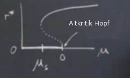

Bizim esas ilgilendiğimiz çatallaşma noktasını grafikte $\mu_s$ ile
işaretledim ($s$ eğer (saddle) kelimesi için), ki orada gayrı-stabil dal
stabil dal ile birleşiyor. Grafikteki $\dot{r}$ eğrisinin özelliklerinden
hareketle $\mu_s = -1/4$ olduğunu hesaplayabiliriz. O noktada çevrimlerin
çatallaşması meydana geliyor.

Şimdi grafikteki değişik bölgelerde ne olduğunu inceleyelim. Mesela
$\mu < \mu_s$ bölgesinde ne oluyor? Bu bölgede tek çekici (attractor)
orijinde.

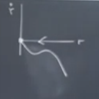

$\dot{r}$'nin orijin haricinde sıfırdan kesin küçük olduğunu
gösterebilirsiniz, bunun sonucu üstte görülen eğri. $r$ yönündeki akış ta
orijine doğru olacak. Ardından $\dot{\theta}$ için düzlemde kutupsal
kordinat sistemine bakalım, bu pek ilginç değil, tekdüze (monotonic) bir
şekilde artıyor, bir sarmal ortaya çıkartıyor.

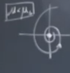

$\mu$'yu arttırdıkça ve $\mu_s$'e yaklaştıkça ilginç bir şey oluyor. $\mu$
hala sıfırda küçüktür diyelim, alttaki grafiğe bakalım, burada büyük bir
stabil çevrim var (en üstteki içi dolu nokta) bir de en altta stabil sabit
nokta var. İkisinin ortasında gayrı-stabil limit çevrimi var. 

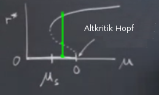

Gayri-stabil çevrim alttaki grafikte kesikli çizgi, akış saat yönü
tersinde, ortadaki sabit noktaya doğru bir sarmallanma var, kesikli
çizgiden dışarıdaki stabil çevrime doğru bir gidiş te var, ve aynı stabil
çevrime en dışarıdan bir geliş te. 

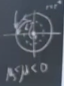

Bu sistem ikili stabillik içeriyor (bistable). Çok ilginç ve yeni olan tür
çatallaşma $\mu_s$'e doğru yaklaştıkça gayrı-stabil ve stabil çevrim
çarpışıyor. Çarpıştıkları yer iki üstteki resimde kesikli ve düz eğrinin
birleştiği yer. Tum bunlar bize garip bir nesne sunacak, nasil cizecegimi
bile tam bilmiyorum.. kesikli mi cizsem, dolu cizgi mi cizsem.. ? Cunku bu
nesne yari-stabil bir cevrim. 

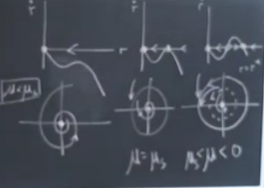

Eğer $\dot{r}$ resmi bağlamında bakarsak [sağ üst köşedeki resim] elimizde
bir 5. dereceden polinom var, sola doğru gittikçe, $\mu$ azaldıkça ne
olduğunu görüyoruz, maksimum noktası azalıyor, eğri x eksenine teğet hale
geliyor [üst ortadaki resim]. Eksenin kesildiği noktada eyer düğüm
çatallaşması var, orijin hala stabil ama teğet olan yerde yarı-stabillik
var. Neyse, garip objemizi dolu çizgili çizeyim ama aslında yarı stabil
olduğunu da belirteyim [üst resimde alt ortada] . Ona doğru gidiş var,
orijine gidiş var. Bu çevrimlerin eyer düğümü birleşimi. 

Bu garip bir oluş aslında değil mi? Üstteki resimde sol alttaki
durumdasınız, orijinde mesela, sabit nokta bir denge durumunda. Sonra
parametremizi değiştirmeye başlıyoruz, sağa gidiş başlıyor mesela, pek bir
şey farketmezdiniz, garip olan alt soldaki o garip objenin birdenbire pat
diye ortaya çıkması, ve büyük bir genliğe sahip halde ortaya çıkması. Yani
yavaş yavaş ufak genlikten gelse tamam, birdenbire, pat diye büyük genlikle
geliyor. Genlik en baştaki grafikte $r^\ast$'in değişim anında sahip olduğu
değer kadar. Tabii.. belki bir şekilde bu objenin gelişini kısmen tahmin
etmek mümkün olabilirdi, eğer dışarıdaki çapsal yöndeki akışı izliyor
olsak, garip objenin ortaya çıkacağı çap kadar bir elipsin etrafında takılı
kalındığı görülebilirdi, ama eğer akış dışarıdan geliyorsa bu olurdu ancak,
ama orijin yakınındaki bölgedeysek, hiçbir şeyin tahmini mümkün değil.

Bu derste işlemek istediğim bir diğer konu bu gördüğümüz farklı
çatallaşmalara yakın yerlerde ortaya çıkan ölçekleme kanunları. Fizikçiler
böyle düşünürler, "farklı çatallaşmaları karakterize eden üsteller
nedir?''. 

$\mu_s$'e yakın doğan çevrimlere bakalım, bunlar ilk başta iki çarpımsal
seviyede doğacak tabii, şimdi bu çevrimlerin doğumdaki frekansları ve
genliklerini takip edelim, büyük mü, küçük mü, yavaş mı, hızlı mı, vs. Üst
ortadaki resimde mesela çevrim "yetişkin'' halde doğuyor, doğumdaki genlik
dereceleri O(1). Derece O(1) derken, bu problemde dışarıdan tanımlanan ufak
bir parametre var, bu parametre çatallaşmadan ne kadar uzakta olduğumü
tanımlıyor, uzaklık $|\mu - \mu_s|$. Eğer $\mu_s$'e yakınsam limit
çevriminin büyüklüğü nispi olarak küçük değil, O(1)'de. Ayrıca O(1)
frekansta, yani ne yavaş ne de hızlı. Eğer üstte $\dot{\theta}$ denklemine
bakarsak $r = r^\ast$ olduğu zaman özel bir şey olmuyor, $\dot{\theta}$ basit
bir sayı olacak. Yani bu çevrim makul bir frekans ve genlikte dönüyor
olacak. Bu tür davranış bu tür çevrimlerin tipik karakteristiğidir.

Bu durumu şimdi bakacağımız örnek ile karşılaştıralım: sonsuz periyot
çatallaşması. Bu çatallaşmaların iki turu var, ilkine bakalım, sonsuz
periyotlu eyer düğüm çatallaşması (SNIPER) . 

Örnek

Daha önce baktığımız bir sistem

$$ \dot{r} = r (1-r^2) $$

$$ \dot{\theta} = \omega - \sin\theta $$

BU sistemde gidiş yolları çapı 1 olan bir çevrime doğru akıyor, eğer
orijinde başlamazlarsa tabii, neyse, sistemin ikinci bölümü çember üzerinde
akış [hoca bunu atlamıştı ama biz bir ödevde işledik], bu konuya biraz
değinelim şimdi. $\dot{\theta},\theta$ grafiğine bakalım, $\omega > 0$ ve
oldukça büyük olsun, mesela 1'den büyük, 1 sayısı önemli çünkü
$\sin\theta$'nin genliği 1. O zaman $\omega$ 1'den büyük ise $\dot{\theta}$
hiçbir zaman sıfır olmaz. 

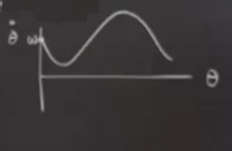

Resim pek iyi olmadı, kusura bakmayın, bir sinüs grafiğine benzemesi
lazımdı. Minimum değeri $\theta=\pi/2$ olduğu yerde, o noktada maksimum
değer 1'i çıkartıyoruz çünkü, geri kalanlar minimum oluyor. Akış hep sağa
doğru, $\pi/2$'ye kadar yavaş denebilir, fakat ondan sonra daha hızlı, o
büyük tepenin altına düşen yerlerde özellikle.

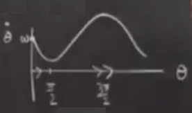

Maksimum nerede? $3\pi/$ noktasında çünkü orada $\sin$ -1 değerinde. Çember
üzerinde akışı düşünürsek

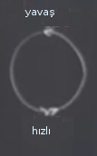

üstte yavaş, altta hızlıyız. Ayrıca ana denklemde $\omega$ 1'e yaklaştıkça
üstteki minimum aşağı inecek, tam 1'de x eksenine değiyor olacak,
ilgilendiğimiz çatallaşmala orada.

$\omega > 1$ için faz portresini yapalım, radyal yönde yarıçap 1'e doğru
gidiş var, bu portre için söyleyecek fazla bir şey yok aslında, orijinde
gayrı-stabil bir nokta var, $\omega > 1$ olduğu için $\dot{\theta}$ hep
pozitif, $r$'yi arttırırken $\theta$'yi tekdüze (monotonic) şekilde
büyütmüş olacağız, o zaman bazen yavaş bölgede bazen hızlı bölgede olacak
şekilde dışarı doğru bir limit çevrimine doğru sarmallanacağız. Dışarıdan
benzer şekilde içeri, çevrime doğru sarmallanma olacak. 

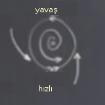

$\omega > 1$ iken mevcut güzel bir limit çevrimi işte. Fakat $\omega$'yi
azalttıkça ona kötü şeyler olacak, $\omega$ 1'e yaklaştıkça yavaş kısım o
kadar yavaşlayacak ki periyot sonsuzluğa yaklaşacak, tam $\omega = 1$'de
artık bir çevrim olmaktan çıkacak, başka bir şey olacak. 

Ne olduğunu görüyoruz, yarı-stabil bir nokta ortaya çıkarttık, bu nokta
yavaş bölgeden geliyor, yavaş bölge o kadar yavaşladı ki artık bir denge
noktası haline geldi. 

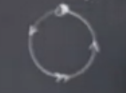

Çember üzerinde yarı-stabil nokta var artık, niye döngü üzerinde eğer
düğüm çatallaşması teriminin kullanıldığını şimdi daha iyi anlıyoruz belki,
çünkü döngü üzerinde bir sabit nokta birdenbire peydahlanıverdi, ve döngü
üzerinde akış sağ ve solda yavaş, altta hızlı olacak şekilde. En üstte çok
yavaş, orada tıkanıklık var, ayrıca burada sanki homoklinik yörünge var
gibi, çünkü oradan çıkan akış tekrar oraya dönüyor. 

Bu arada $\theta = \pi/2$ olduğu yerde bir değişmez çizgi (invariant line)
var, bu durumda $\dot{\theta} = 0$, $r$ herhangi bir değer. Değişmez çizgi
bizi orijinden o yarı-stabil acaip noktaya götürüyor. Dışarıdan da oraya
bir gidiş var.

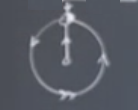

Geri kalan gidiş yollarını tahmini şekilde tamamlamak zor değil, birkaç
tanesine bakalım,

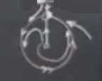

$\omega < 1$ olduğu zaman ne olur? 

Üstteki gibi bir durum olur. Eksen iki yerden kesiliyor, akışın negatif
olduğu yerler var, bu durumda çember üzerinde geriye doğru
gidiyoruz. Soldaki nokta stabil, sağdaki gayrı-stabil. Bu iki nokta çember
resminde iki farklı yöne giden ışın gibi gözükecek, 

Çizgileri tamamlarsak,

Şimdi problemi ölçekleme açısından ele alalım. Çatallaşmaya yaklaşırken
periyota ve genliğe ne olur diye sorabiliriz yine, önce resmi çizelim,
$r,\theta$ yerine $x$ ve zamana bakalım. Şimdiye kadar $x,t$ bazlı
kartezyen kordinatlardan bahsetmemiştik ama bunu tabii ki yapabiliyoruz,
çünkü zaman her zaman dolaylı olarak sistemin bir parçası durumunda.

Yavaş hızlı çembere bakarak $x,t$'ye ne oluyor anlamaya uğraşalım. Çemberin
sağ orta kısmından başlayalım, çemberde yukarı doğru çıkarken $x$'im
azalacak, küt diye aşağı inecek, 

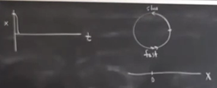

Ama sonra çemberin en üst noktasındaki yavaş bölgeye geliyoruz, orada kağnı
hızındayız, $t$ ekseni boyunca uzun uzun gidiş oradan geliyor. Onu geçer
geçmez hızlı bölüm, çemberde hızlı dönüp tekrar üst noktaya geliyoruz,
$x,t$ bağlamında aşağı iniş çıkış bu sırada, ve tekrar $t$ ekseni boyunca
kağnı gidişi.. 

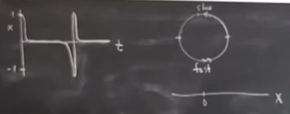

Bu grafik tanıdık geliyor mu bu arada? EKG aletiyle alınan kalp atış
sinyallerine benzemiyor mu? Bu benzerlik aslında bir kaza değil, kalp atış
dinamiği incelenince kalp hücrelerinde bu tür çatallaşmanın ortaya çıktığı
görülmüştür. Bu sebepten dolayı zaten bu çatallaşma literatürde oldukça
önemli. 

Ölçek konusuna gelelim şimdi, grafikte iki farklı zaman ölçeği var, kağnı
hızı, hızlı ınış çıkış, vs. dediğimiz bölgelere tekabül ediyor bunlar,
birisi yavaş, diğeri hızlı. Bu bölgelerdeki periyotu hesaplayabilir miyiz
acaba? Cevap evet. Diyelim ki $\omega > 1$ durumuna bakıyoruz, ki bu
durumda elimizde bir çevrim olduğunu biliyoruz, burada periyot $T$ için
$dt$'yi entegre etmek lazım,

$$ 
T = \int_{0}^{T} \mathrm{d} t = 
\int_{0}^{2\pi} \frac{\mathrm{d} \theta}{\omega - \sin\theta}
$$

Eşitliğin sağı mümkün oldu çünkü $\dot{\theta}$ hatırlarsak
$\mathrm{d} \theta / \mathrm{d} t$, bu formülü $dt$ tek başına gelecek şekilde tekrar
düzenlersek üsttekini elde ediyoruz. Entegral limiti $2\pi$'ye gidiyor, bir
dönüşü göz önüne almak için. Bu temiz bir entegral, kompleks değişkenleri
metotunu, artık teorisini (residue theorem) kullanarak çözülebilir. Ya da
trigonometrik yerine geçirme ile de çözüme erişebiliriz, bir numara var ki
trigonometrik fonksiyonlar rasyonel foksiyonlara çevirilebiliyor. Çözümün
kendisinin size bırakıyorum, hesaplayınca,

$$ 
\int_{0}^{2\pi} \frac{\mathrm{d} \theta}{\omega - \sin\theta} = 
\frac{2\pi}{\sqrt{\omega^2 - 1}}
$$

elde ediliyor. Limite giderken davranışı kabaca sağdaki sonucu doğruluyor,
diyelim ki $\omega$'yi çok büyüttük, ki 1'den çok daha büyük olacak şekilde
[ki $\sin\theta$'ya iyice baskın hale gelir] o zaman entegralin içi
$\mathrm{d} \theta / \omega$ gibi davranır, o zaman entegral $2\pi / \omega$
olur. Eşitliğin sağ tarafının aynı sonuca yaklaştığını görebiliyoruz.

İlginç bir durum var, $\omega=1$ olduğu yerde üstteki sonuçta bir eşsizlik
(singularity) var. Eğer faktorize edersek, 

$$ 
= \frac{2\pi}{\sqrt{\omega + 1}} \frac{1}{\sqrt{\omega - 1}}
$$

ki $\omega \to 1$ iken üstteki değer
$\frac{2\pi}{\sqrt{2}} \frac{1}{\sqrt{\omega-1}}$'a yaklaşır. Bu formülün
sonsuzluğa belli bir hızda, $\frac{1}{\sqrt{\omega-1}}$ hızında
yaklaştığını görüyoruz, bu hız 1 bölü sıfırın karekökü olarak
betimlenebilir, ya da $x \to 0$ iken $1 / \sqrt{x}$ hızında. Bu evrensel
bir durum, üstteki türden eyer düğüm çatallaşmalarının karekteristik bir
özelliği. Genel bir argüman var ki bu tür çatallaşmalarda gösterdiğimiz
uzaklaşan çarpan hep "1 bölü bir şeyin karekökü'' formunda,
$1 / \sqrt{\mu}$ diyelim ki örneğimizde $\mu = \omega -1$ idi, genel formda
$\mu$ parametre uzayında eyer düğüm çatallaşmasına olan uzaklık.

Peki genlik? Dikkat edersek çevrimin genliği O(1), çevrim küçülmüyor,
sadece periyotu gittikçe uzuyor. 

Çevrim Çatallaşmalarının Evrensel Davranışı

$\mu$ çatallaşma parametre uzayına olan uzaklık olsun, ki $\mu << 1$, ki
$\mu = 0$ noktasında çatallaşma ortaya çıkacak. Şimdi çatallaşmaya yakın
noktada stabil çevrim yaratıldıktan sonra (ya da yokedilmeden önce, bakış
açısına göre değişir) genliği ve periyotu nedir sorusunu
sorabiliriz. Ortaya çıkabilecek fenomenler süperkritik hopf, diğeri
çevrimlerin eyer düğüm çatallaşması, ya da sonsuz periyot SNIPER.  Tüm bu
fenomenler birbirine çok benzer gibi geliyor ama hatırlayalım, böyle
değiller. Fenomenlerden biri birkaç çevrimin birbirini yoketmesi, SNIPER
ile bir eyer düğüm sabit noktası çevrim üzerinde ortaya çıkıyor. Bir diger
fenomen homoklinik çatallaşması, bu fenomeni bu derste çok detaylı
anlatmayacağım, [1] kitabimin 8.4 bolumunde daha detay var.

$$ 
\begin{array}{ccc}
\hline
         & Stabil limit çevriminin genliği  & Çevrimin periyotu \\
\hline
Süperkritik Hopf                   & O(\mu^{1/2}) & O(1) \\
Çevrimlerin Eyer Düğüm Çatallaşması & O(1)        & O(1) \\
SNIPER                              & O(1)        & O(\mu^{-1/2}) \\
Homoklinik                          & O(1)        & O(|\ln \mu|) \\
\hline
\end{array}
$$

Bunlardan bahsediyorum çünkü bazen bir sistemi incelerken elimizde iyi bir
model olmuyor, sadece gözlemlenenler var, yani ölçümler / veri. Fakat bazı
durumlarda çatallaşma yakınında dikkatli bir şekilde ölçüm yaparak
çatallaşmanın üstteki tabloda hangisi olduğunu tahmin etmek mümkün
olabiliyor. Ve çoğunlukla sistem üsttekilerden biri, evrensel derken bunu
kastetmiştim, onlardan başkası olamaz demiyorum, ama bunlar en yaygın
olanları. 

Tarif edilen bilgi aradığımız model çeşitlerini azaltır, bir model belli
bazı ölçekleme kanunlarını takip ediyorsa o zaman belli bir çatallaşmaya
sahip olacaktır. 

Şimdi [1]'in 8.6 bölümüne atlayalım, bağlaşımlı titreşirlere (coupled
oscillators) bakalım. Titreşirler yabancı bir konu değil ama 8.6'da
periyotsal*ımsı* olma (quasiperiodicity) denen bir kavram var, bu
yeni. Bu oluş şimdiye kadar gördüğümüz faz uzaylarında hiç ortaya
çıkmadı. Şimdiye kadar hangi faz uzaylarını gördük? Çoğunlukla iki boyutlu
düzlem üzerinde iş yaptık, ama çizgi üzerinde de bazı örneklerimiz oldu,
hatta daire de kulladık. Bir sarkaç örneğinde silindirsel uzay
kullandık. İki boyutta elimizde olanlara bakarsak, düzlem var, silindir var
ki burada bir değişken açı diğeri reel bir sayı oluyor, sarkaçta böyle
olmuştu, sarkacın açısı vardı, hızı reel bir sayıydı. İki boyutta küre
(sphere) de kullanılabilir, fakat bu uzay fazla bir yenilik getirmiyor,
aşağı yukarı düzlem ile aynı. Fakat torus şekli bazı yeniliklere izin
veriyor. Topoloji dersi alanlar bilir, torus şu şekilde

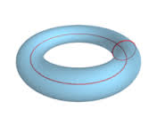

Şimdi torus bazlı uzayı inceleyeceğiz. Torus bazlı uzay eğer elimizde iki
açı varsa kullanışlıdır. Mesela şöyle bir sistem

$$ \dot{\theta}_1 = f_1 (\theta_1,\theta_2)$$

$$ \dot{\theta}_2 = f_2 (\theta_1,\theta_2)$$

ki $f_1,f_2$ her iki argümanında $2\pi$ periyotsal fonksiyonlardır, mesela
$\sin$, $\cos$, ki zaten o sebeple bu parametreleri açı olarak görmek
iyidir. Peki niye tek bir çember üzerinde tek açı yerine iki açı
kullanmadım? Şöyle bir çizim yapabilirdim,

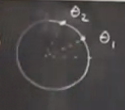

ve zaman geçtikçe $\theta_1,\theta_2$ bu çember üzerinde farklı şekillerde,
yönlerde hareket ediyor olurlardı. Sanki çember üzerinde iki koşucu var,
çembersel bir parkurda koşturuyorlar. Fakat bu bir faz uzay resmi değil,
çünkü elde iki nokta var. Faz uzayının tüm esprisi tek bir noktanın
sistemin o an içinde olduğu tüm durumu temsil edebilmesi. Torus ile açıları
alttaki gibi kullanabiliriz, 

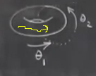

$\theta_1$ torus etrafında dolaşıyor, $\theta_2$ ise torusu kesen hayali
bir düzlemde dönen açı olarak görülebilir. Gidiş yolları bu tür faz
uzayında sarı çizgiyle gösterildiği gibi mesela, gidiş yolu üzerindeki her
nokta farklı bir $\theta_1$ açısının temsil ettiği çemberin üzerindeki bir
nokta / ikinci açı ($\theta_2$). Aslında torus bir sürü çemberin yanyana
koyulmuş hali olarak görülebilir, birinci açı bu çemberlerden birinin
seçiyor, ikinci açı o çember üzerindeki bir noktayı gösteriyor. 

Şimdi bu ortamda tanımlayabileceğimiz en basit sisteme bakalım, 

$$l
\dot{\theta_1} = \omega_1 
\qquad (1)
$$

$$ \dot{\theta_2} = \omega_2 $$

Hakikaten bu sistem absürt derecede basit, $\omega_1,\omega_2$ sabit
sayılar. Gidiş yollarının ne olduğunu biliyoruz, hemen entegre ederek
onları bulabiliriz, $\theta$'lar $\omega_1t + sabit$, $\omega_2t +
sabit$. Belki bu sistemi daha özel bir sistemin genel hali olarak görmek
daha iyi olur, bağlaşımlı titreşirler konusunu işleyeceğimizi söylemiştim,
şimdi $\theta_1,\theta_2$ arasında bir bağlaşım, ilinti yaratalım, 

$$ 
\dot{\theta_1} = \omega_1 + K \sin(\theta_2-\theta_1) 
\qquad (2)$$

$$ \dot{\theta_2} = \omega_2 + K \sin(\theta_1-\theta_2)$$

O zaman ilk bakacağımız hal $K$'nin sıfır olduğu durum, o zaman (1)'i elde
ederiz. (1)'e bakalım, bu durumu aynı çember üzerinde iki koşucu olarak
görürsek, bu koşucular birbirinden habersiz iki koşucu, birbirlerinin
yanından geçiyorlar, ama birbirleriyle hiç iletişimleri yok, birbirlerini
görünce yavaşlamıyor, hızlanmıyorlar. 

Sistem sabit temelli olduğu için fay uzayını karesel olarak ta gösterebilirdik,

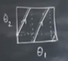

Sistem iki türlü olabilir. 

1. Tür

$$ \frac{\omega_1}{\omega_2} = \frac{p}{q}$$

$p,q$ tamsayı, basitlik için $p,q$ ortak çarpanı yok diyelim, yani bölüm
sonucu rasyonel, o zaman üstteki grafikte rasyonel bir eğim var, ve torusta
periyotsal, kapalı yörüngeler olacak. Eğer $p=3,q=2$ ise bir koşucu 2 tur
atarken diğeri 3 tur atıyor diyebilirdik. Aslında 3,2 durumu ilginç, 

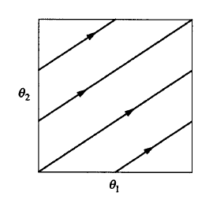

Bu torus üzerinde bir trefoil düğümü denen şekli çıkartıyor, 

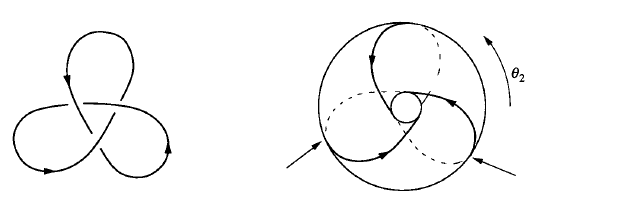

Solda bu düğüm, sağda gidiş yolunun torus üzerindeki hali var. Aslında 3,2
sayılarının çok özel bir durumu yok, $p,q$ ne zaman birbirlerine izafi
olarak asal sayı (yani ortak bölenleri yok) olursa o zaman üstteki şekil
ortaya çıkıyor. 5,3, ya da 11,8 de olabilirdi.

2. Tür

Bu durum $\omega_1/\omega_2$ oransız (irrational) sayı olduğunda ortaya
çıkıyor, mesela $\omega_1 = \sqrt{2}$ ve $\omega_2 = 1$. O zaman
periyotsalımsı bir durum elde ediyoruz. 

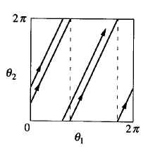

Bu durumda alttan yukarı doğru gidiş var ama gidiş yolları kapanmıyor,
çizgiler birbirlerine dokunmuyorlar. Yani torustaki hiçbir gidiş yolu
kapanmıyor, eğer kapansaydı dönüşü sayabilirdik, başlangıca geri geliş
olurdu. Burada bu durum yok, ve her gidiş yolu "yoğun''. Yoğun şu
demektir; torus üzerinde geçilmemiş bir nokta seçelim, ve onun etrafında
$\epsilon$ büyüklüğünde bir disk çizelim, herhangi bir gidiş noktası o
diskten geçer mi? Yoğunluk durumunda cevap evettir. Bu kaos mu? Değil -
kabul ediyorum olanlar oldukça acaip, fakat kaos bundan daha acaip. 

Gerçi kaosun ne olduğunu da daha anlatmadım, ama önümüzdeki derslerde
anlatılacaklara bir tanıştırma yapmak gerekirse, üstteki örnekteki
birbirine yakın iki gidiş yolu üzerinde iki yakın nokta düşünelim. Bu
noktaları kendi gidiş yollarında nereye gittiğini zaman geçtikçe takip
edersek birbirlerine yakın mı kalırlar, yoksa üstel hızda birbirlerinden
ayrılırlar mı? Kaotik bir sistemde ikinci durum olur. Fakat üstteki
sistemde bu ayrılma lineer olacaktır, bunu hesaplamak mümkün. O sebeple
sistem kaotik değil diyorum. 

Dersi bitirmeden önce bağlaşımlı durum hakkında birşeyler söylemek
istiyorum. $\phi = \theta_1 - \theta_2$ olsun. Şimdi (2) sistemine tekrar
bakalım, diyelim ki $\theta_2$, $\theta_1$'in biraz önünde, ikisi de aynı
yöne koşuyorlar,

Bu durumda, $K > 0$ için, aradaki açı fark ufak olacağı için ufak pozitif
sayının sinüsü pozitif olacaktır, çarpı $K$, ki o da pozitif, sonuç olarak
$\omega_1$'e pozitif bir sayı ekliyor olacağız, yani geride kalan koşucunun
hızına pozitif bir değer ekliyor olacağız. Bu geride kalan koşucu
hızlanacak demektir. Önde olan koşucuya tam tersi olacak, o
yavaşlayacak. Bu bağlaşım ortaya bir senkronizasyon çıkartır. Koşucular
birbirlerine yaklaşmaya meyilli olurlar, yani faz bakımından senkronize
hale gelirler. Eğer bir arkadaşımla koşuyorsam bu istediğim bir şeydir
çünkü yanyana koşmak isteriz değil mi? Arkadaş arkaya düşünce ona "hadi
hızlan, koş yetiş'' vs deriz, bu arada biz de kendi koşumuzu
yavaşlatabiliriz ki arkadaş yetişsin, ki böylece yanyana koşup
konuşabilelim. Her neyse bu modelin yakaladığı bu tür bir hareket. 

$\phi$ tanımlamıştık, peki $\dot{\phi}$ ne olur? 

$$ 
\dot{\phi} = \omega_1 - \omega_2 - 2K \sin\phi
$$

Bu denklem tanıdık gelebilir, farklı değişkenlerle olsa da bu denklemi
sonsuz periyot çatallaşmasında gördük. O zaman aynı analiz burada da
geçerli olur. $|\omega_1-\omega_2| < 2K$ olduğu zaman $\phi^\ast$ için iki
sabit nokta olacaktır. Torustaki diyagram şuna benzer, 

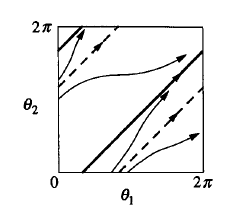

Eğer $K$ yeterince büyükse (üstte belirtilen şart) o zaman sistem alttan
sağa yatık şekilde üste giden çizgilerdedir. Bu senkronize faz halidir,
$\theta_1-\theta_2 = \phi^\ast$ stabil bir mesafedir ve öyle
kalacaktır. Koşucular senkronize olurlar, bu illa yanyana demek olmayabilir
ama mesafeleri değişmez. Senkronizasyon olmazsa bir koşucu diğerine sürekli
tur atıyor olur.

Kaynaklar

[1] Strogatz, *Nonlinear Dynamics and Chaos*

