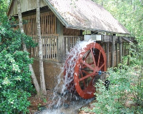
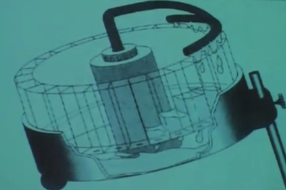
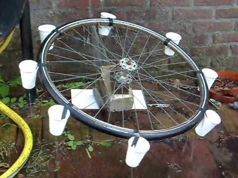
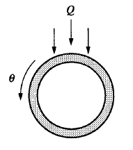
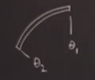
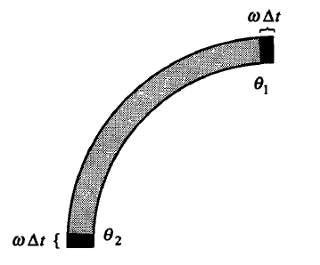
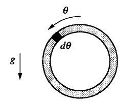
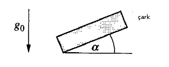

# Ders 15

Dersimizin kaos bölümüne geldik. Kaosu bir su çarkı örneğinde göreceğiz, su
çarkını biliyoruz, eğer bir yerde doğal su akışı varsa oraya çark
konabilir, su düşerken çarkı döndürür.

Bizim işleyeceğimiz su çarkı biraz değişik,

Bu tam bir su çarkına benzemiyor biliyorum. Bu çarkta dönen kısım yatay,
bir su veren mekanizmanın altında. Bu yatay kısım kaldırılıp
indirilebiliyor, yani yüzeye bir eğim halinde tutulabiliyor, bu eğimi
yandaki bir vida ile ayarlayabiliyoruz [1]. Sistemimizin bir parametresi bu
olacak.

Mekanizmanın ortasındaki blok bir pompa, altta biriken suyu yukarı çekiyor,
ve iki yana ayrılan bir boru ve su veren duş gibi bir sistemle hemen
altındaki kutucuklara suyu veriyor. Duştaki su akışı tam ayrımın olduğu
noktada en fazla, yanlara doğru gittikçe azalıyor. Kutucukların altında
delik var, orada biriken şu aşağı yavaş yavaş mekanizmanın tabanına
gidiyor, ve oradan pompayla yukarı çekiliyor, döngü devam
ediyor. Kutucuklar birbirinden tamamen bağımsız.

Bu sistemde sarkacımsı bir davranış olması şaşırtıcı olmamalı, üstte olan
kutucuklarda biriken su onların ağırlığını arttıracak, eğim yüzünden bu
ağırlık aşağı inmek isteyecek, bir dönüş hareketi ortaya çıkacak, tabii o
dönüş daha boş olan kutucukları su akışı altına getirecek, böyle devam
edecek.

Sistemin yataylık haricindeki bir diğer parametresi dönüş azaltmak için
kullanılabilecek bir fren / sürtünme parametresi. Bu sürtünmeyi arttırınca
dönüş daha zorlaşıyor. 

Soru şu: bu sistem nasıl davranır, çark birörnek şekilde mi döner, tek bir
yönde mi döner, yoksa sağa sola mı periyotsal şekilde mi döner, yoksa
kaotik şekilde me davranır?

Not: Alternatif bir su çarkı mekanizması alttadır. Kıyasla [1] sistemi daha
"temiz'' tabii, çünkü bir devridaim var, su hep sistem içinde kalıyor. [2]
ile etraf sırılsıklam olabilir (!)

Bu sistem [2] daha basit, üstten sabit oranda / akışta su veriliyor, ve su
o anda tam altında olan tek bir bardağa gidiyor. Bardaklarda ufak delik
var, sabit oranda su kaybediyorlar. 

Bu ve önceki çark kaotik davranış gösterir, tekerlek kaotik / beklenmeyen
şekillerde bir sağa bir sola doğru dönecektir. 

Kaos kavramının müthiş dramatik bir şey olacağını bekleyenler video'yu
izledikten sonra fikrini değiştirmiş olabilir bu arada. Kargaşa karmaşa
bekleyen vardı belki. Sağa ya da sola dönüş var, vs. Fakat tahmini zor
olan, acaba biraz sonra, ya a 5-10 salınım sonrasında çark sağa mı sola mı
dönüyor olacak? Bunun tahmini gerçekten çok zor.

Kaotik su çarkı üzerinde durmamızın sebebi şu: sistemi tarif eden
denklemler kaostaki ünlü Lorenz denklemlerinin mekanik dünyadaki tıpatıp
karşılığı. Lorenz denklemleri kaosta merkezi bir yere sahip, ve onları
görsel olarak hayal etmek istiyorsak su çarkı kullanışlı. Sistem ayrıca
düşük dereceli (iki, üç dereceli) normal diferansiyel denklemlerin (ODE)
nerede faydalı olabileceğini gösteriyor. Bazıları düşünüyor ki "bu tür
denklemler bilimde ne işe yarar''. Birazdan göreceğiz çarkı temsil eden
birkaç kısmi diferansiyel denklemi (-PDE-, ki daha çetrefil olabilirler)
alacağız, ve birkaç matematiksel takla ile onları 3 tane ODE ile temsil
edebileceğiz.

Birazdan anlatacaklarım kitabım [3]'ün 9. bölümünden. Sistemi tarif eden
denklemler sıvı dinamiğinden (fluid dynamics) geliyor. Grafik olarak çarka
üstten bakalım, ve bizi ilgilendiren parametreleri gösterelim,

Notasyon,

$\omega(t)$ = çarkın açısal hızı

$\theta$ = çark üzerindeki bir noktanın açısal yeri (en üst sıfır derece)

$Q(\theta)$ = suyun sisteme akışı, pompalanma hızı. Bu hız $\theta$'ya
bağımlı çünkü suyun akışının $\theta$'ya göre bir "dağılımı'' var. Daha
önce belirttiğimiz gibi borunun iki yana ayrıldığı yerde en çok akış,
yanlarda (o duş başlığı gibi duran parçanın yanlarında) biraz daha az,
başlıktan uzaktan olan yerlerde hiç. Bu azlık, çokluk, yokluk bir dağılıma
sahip.

$r$ = çarkın yarıçapı. Kutucukların belli bir genişliği var, yarıçapa bu
genişlik te dahil mi? Değil, bu genişlik çok küçük olduğu için iç yarıçap,
dış yarıçap gibi bir ayrım yapmayacağım.

$m(\theta, t)$ = suyun tüm kutucuklar üzerinden kütle, doluluk
dağılımı. [1] videosunda farkettiysek suyun tüm kutucuklardaki dolululuğu
bir histogram görüntüsü yaratıyordu sanki [zaten onun için kutucuklar ve
yeşil renkli su kullanılmış herhalde, bu dağılım görülebilsin diye]. O
zaman $\theta_1$ ve $\theta_2$ arasındaki yoğunluk

$$ M = \int_{\theta_1}^{\theta_2} m(\theta, t) \mathrm{d}\theta $$

ile hesaplanır. 

Birazdan göstereceğim matematiksel türetiş MİT'den arkadaşım Paul Matthews
tarafından yapıldı, Matthews'un oldukça çok sıvı dinamiği tecrübesi vardı,
bu analizi ilk yapan o, ve sağolsun denklemleri bu derste kullanmama izin
verdi. Matthews bu kaotik su çarkını ilk tasarlayan hoca Malkus ile beraber
çalışıyordu. İnceleyeceğimiz değişkenler, ki bunlar tabii ki zamana bağlı olan
değişkenler $\omega(t)$, ve $m(\delta,t)$. Bu iki değişkeni tanımlayan
formülleri yazmak istiyoruz, sistemi tanımlayan / idare eden bu formüller
olacak. Türetelim, 

1) Kütlenin muhafazası

Kütle derken su kütlesinden bahsediyoruz, bir sıvı sistemi için muhafaza
şartı bir süreklilik denklemi (continuity equation) demektir. Türetildikten
sonra bu denklem,

$$ 
\frac{\partial m}{\partial t} = Q - Km - \omega \frac{\partial m}{\partial \theta}
\qquad (1)
$$

olacak. Sisteme giren kütle $Q$. Çıkan $Km$, ki $K$ bir sabit. Çıkan
kütleyi şöyle tarif etmek mümkün: bahsettiğimiz gibi kutucukların altında
delikler var, ve bu deliklerden çıkan suyun miktarı o anda mevcut suya
oranlı olmaz mı?  Cevap evet, çünkü mevcut su basınç yaratıp delikten daha
hızlı su çıkmasına sebep olur, oran $K$ sabiti üzerinden. Akışkanlığı
inceleyenler bu dinamiğin daha çetrefil olabileceğini de bilirler, fakat en
basit model bu, gerçeğe çok uzak olduğu da söylenemez.

Üçüncü terim taşınma / yer değiştirme / transportasyon terimi, bu terime
göre mesela çarkın dönüşü sonrası su olmayan herde artık su olması durumu
ortaya çıkabilir, en altta olan dolu kutucuk sağa kayıp bir alta iniyor
diyelim, ve en tepede yeni bir boş kutucuk en üste geliyor, vs. Orta
kısımlardaki yer değişimi önemli değil çünkü onlar kazanç ya da kayıp
yaratmıyorlar.

Bu denklemi türetelim şimdi. Çark üzerinde bir $[\theta_1,\theta_2]$ kesiti
düşünelim.

Bu kesitteki su miktarı için

$$ 
M = \int_{\theta_1}^{\theta_2} m(\theta, t) \mathrm{d}\theta 
\qquad (4)
$$
 
formülünü vermiştik, bu formülün vereceği sonuç zamana göre değişecektir
tabii ki. O zaman şu soruyu soralım, $\Delta t$ zaman aralığında ne olur?
Nihai amacımız $m$ için bir diferansiyel denklem türetmek olduğuna göre bu
soruyu sormak mantıklı. Şu anda içinde olduğumuz $t_1$'den sonraki bir
diğer $t_2$ anına kadar geçen zamanda ne olur? Kütledeki değişim zaman
farkı çarpı çarkın her yerinden içeri giren kütle, eksi dışarı çıkan
kütle. Bir de transportasyon var tabii,

İçeri giren $\omega$ hızının $\Delta t$ zamanında kapsadığı alan,
$\theta_1$ için $m(\theta_1) \omega \Delta t$, dışarı çıkan
$m(\theta_2) \omega \Delta t$. "Ama $\theta_1$'in tam üzeri mi, yanı değil
mi?'' diye sormak akla geliyor belki, ayrıca muhakkak $\Delta t$ içindeki
farklı yerlerde $m$'nin değişik olacağı savunulabilir, fakat limite
giderken $\Delta t$ sonsuz küçüleceği için işin matematiği dengeleniyor, bu
sebeple noktasal $m(\theta_i)$'leri kullanmak mümkün. Bu numara bu tür
modellemelerde kullanılan klasik yaklaşıksallama tekniklerden biri. Ayrıca
ortadaki parçalarda da yer değiştirme durumu var fakat o parçalar hala
bakılan bölge içinde olduğu için onlarla ilgilenmiyoruz, sadece sınırdaki
şartlara bakıyoruz.  Hepsini bir araya koyarsak,

$$ 
\Delta M \approx \Delta t \bigg[ 
\int_{\theta_1}^{\theta_2} Q(\theta) \mathrm{d}\theta -
\int_{\theta_1}^{\theta_2}  Km \mathrm{d}\theta
\bigg] + 
m(\theta_1) \omega \Delta t -
m(\theta_2) \omega \Delta t
$$

Şimdi üstteki ifadeden bir kısmı türevsel denklem çıkartmak istiyoruz, o
zaman eşitliğin iki tarafını $t$ ile böleriz, ve $\Delta t$'nin sıfıra
gitmesini sağlarız. Bu arada dikkat edersek büyük parantez içindeki
entegraller $\theta$'ya göre alınıyor, fakat dışarıdaki en son iki terim
böyle değil. O zaman bu son iki terimi de bir entegral içine alabilirsek
işimiz rahatlaşır. Bunu nasıl yaparız? Alttaki ifadeye bakalım, bu doğru
bir eşitlik değil mi? 

$$ 
m(\theta_1) - m(\theta_2)  = 
-\int_{\theta_1}^{\theta_2} 
\frac{\partial m}{\partial \theta} \mathrm{d}\theta
$$

Evet. Bu eşitliği kullanarak son iki terimi entegral içine
alabiliriz. Üstteki ifade Calculus'un Temel Teorisi'nden geliyor, türevin
entegrali değişkenin kendisini verir, entegral sınırları çıkartma işlemi
haline gelir. Bunları kullanarak entegrali tekrar yazalım,

$$ 
\Delta M \approx \Delta t \bigg[ 
\int_{\theta_1}^{\theta_2}  \bigg(
Q(\theta)  -  Km  - \omega \frac{\partial m}{\partial \theta}
\bigg) \mathrm{d}\theta
\bigg] 
$$

Dikkat edersek $\omega$'nin entegral içinde olmasının mahzuru yok, çünkü
$\omega$ $\theta$'ya bağlı değil. $\omega$ zamana bağlı ama verili bir $t$
için çark üzerindeki her nokta için bu değer değişmiyor. 

Artık $\Delta t$ ile bölüp limiti alabiliriz, 

$$ 
\dot{M} = \int_{\theta_1}^{\theta_2}  \bigg[
Q(\theta)  -  Km  - \omega \frac{\partial m}{\partial \theta}
\bigg] \mathrm{d}\theta
$$

Devam edelim, daha önce (4) formülünde $M$'in $m$'in entegrali olduğunu
belirtmiştik. O zaman $\dot{M}$'in (4) entegralinin zamana göre türevi
olduğunu düşünebiliriz,

$$ 
\dot{M} = \int_{\theta_1}^{\theta_2} \bigg[ \frac{\partial m}{\partial t} \bigg] \mathrm{d}\theta 
$$

Argümanın son adımı şöyle; $\theta_1,\theta_2$ gelişigüzel iki açıdır, bu
açıları birbirine çok yakın olarak seçildiğini düşünebiliriz, ve bu seçim
tüm $\theta_1,\theta_2$ için doğru ise, uygulamalı matematikte çokça
kullanılan süreklilik faraziyesi (continuity assumption) üzerinden üstteki
formülde parantez içinin iki üstteki formülün parantez içine eşit olduğunu
öne sürebiliriz.

$$ 
\frac{\partial m}{\partial t} = 
Q(\theta)  -  Km  - \omega \frac{\partial m}{\partial \theta}
$$

Sistemimizin ilk denklemini bu şekilde elde ediyoruz. 

Soru

Bir entegralin zamana göre türevini nasıl aldınız?

Cevap

Bunu yapmak için Leibnitz Kanununu kullandım, (4) içinde $m$ fonksiyonu
zamanı içeriyor, $M$'in tam türevini aldım. Bu tam türev entegral içinde
nasıl kısmi türev oldu diye merak ediyorsanız, bu oldu çünkü diğer herşey
$t$'den bağımsız. 

Daha yapacak işimiz var hala değil mi? $m$'in nasıl değiştiğini tanımladık,
ama açısal hızın nasıl değiştiğini tanımlamadık. Şimdi $\omega$ için bir
formül türetelim. İkinci formülün temeli Newton'un Kanunu $F = ma$, onun
dönme kuvveti (torque) dengesi olarak ifadesi. $I(t)$ çarkın dönme
direncini (moment of inertia) düşünelim, eğer dönme kuvveti dengesinin
ifade edeceksek bu kavrama ihtiyaç var. $I$ niye zamana bağlı? Çünkü
çarktaki şu kütlesi sürekli değişim halinde, çarkın merkezinden $r$
uzaklıkta çarkın çeperinde şu toplanmış halde hatırlarsak, orada bir kütle
dağılımı var, ve bu kütle değişiyor, bu dönme direncini yaratan
faktörlerden biri ve bu faktör zamana bağlı. Çarkın kendisinin de belli bir
kütlesi var muhakkak, bu da dönme direncine etki ediyor, ama orada değişim
yok, su kütlesinde değişim var.

Açısal momentumun zaman türevine bakalım, $\dot{(I \omega)}$'a bakacağız,
$I\dot{\omega}$ desek bu yanlış olurdu çünkü $I$ de zamana bağlı. Bu neye
eşit? Çarkın üzerindeki dönme kuvveti nedir? Dönüşün açısal hızına oranlı
bir şeydir, ve bahsettiğimiz fren mekanizması bunu yaratır. Çark ne kadar
hızlı dönerse fren o kadar dönüşsel sürtünme ortaya çıkartır. Aynen bir
düzlem üzerinde düz giden objenin hızına oranla bir sürtünmenin ortaya
çıkacağı gibi. 

$$ 
\dot{(I \omega)} = -v \omega + ..
$$

Yani lineer bir sönüm (damping) eklemiş olduk. Bu arada tüm fren
mekanizmaları derli toplu, lineer olmayabilir, ama kullandığımız aracın
fren sistemi sıvı bazlı, istediği kadar kaygan kalabilen, ama hala duruş
yaratabilen lineer bir sistem. 

Çarkın üzerinde yerçekimsel dönme kuvveti var, bunu da unutmayalım, çarkın
üst tarafı ağırlaşınca bu aşağı yönde bir dönme isteği yaratıyordu. Bu
kuvvetin de hesaba katılması lazım. 

$$ 
\dot{(I \omega)} = -v \omega + \textrm{yerçekim temelli dönme kuvveti} + ...
$$

Bu modeli ilk öğretmeye başladığımda bu noktaya geldiğimde bir öğrenci bir
soru sormuştu, ve bu sebeple ne zaman bu noktaya gelsem hafif bir evham
hissine kapılıyorum, çünkü öğrenci üstteki modelde eksik bir noktaya işaret
etmişti, bu ne Paul'un ne de benim hesaba kattığımız bir şeydi, bir an tüm
hesaplar bozulacak diye endişelenmiştim. Öğrenci bana "ya kutucuklardan
dışarı çıkan suyun eklediği açısal momentum ne olacak hocam?'' diye
sormuştu. Evet bu nokta hakikaten eksik, fakat biraz düşününce bu
momentumun yine açısal hıza oranlı bir büyüklük olacağını farkettim, o
zaman üstteki $v$ sabiti ile bu durumu da idare edebilirdik. Artık $v$
sadece frenle alakalı olmayacak tabii, ama yine de formülde cebirsel
değişim olmayacaktı.

Neyse yerçekim temelli dönme kuvvetine dönelim. Basitleştirilmiş (üstten
bakış açısı ile) resmimize bakalım,

Şimdi çarkın üst noktasından $\theta$ açısı uzaklıktaki o siyah ufak
kısımdaki kütleyi düşünelim, bu kütlenin çarka uyguladığı dönme kuvveti
nedir? $\mathrm{d}\theta$ bölgesinde kütle $\mathrm{d} M = m\mathrm{d}\theta$. Dönme kuvveti
$\mathrm{d}\tau = \mathrm{d} M gr \sin\theta$. Bu dönme kuvvetinin maksimum olduğu nokta
$\pi/2$'da, yani 90 derece açıda, bu aynen kolumuzu uzatıp bir ağırlığı
tutmaya benziyor, ağırlığın bizi en çok terlettiği an kolumuzun bize 90
derece (yere paralel) olduğu andır. 

Formülde negatif işareti yok, buna dikkat, çünkü sarkaçta olduğu gibi
sallanan bir kütleyi yerine döndürme (ip, zincir ile) kuvveti değil, bir
tür ters sarkaç sistemine bakıyoruz, dönme kuvveti direk çarkı döndürüyor,
uzaklaşmak isteyen bir şey geriye çekmiyor.

Not: $g$ çoğunlukla bildiğimiz yerçekimi için kullanılır, o 9.8 m/$s/^2$
olan büyüklük. Buradaki $g = g_0 \sin \alpha$, ve $\alpha$ çarkın yere olan
açısı. 

Yani bildiğimiz yerçekimi bu formülde $g_0$, bizim ilgilendiğimiz tekerleğe
etki eden ise $g$. 

Tüm kütle öğeleri üzerinden entegre edersek, yerçekimsel dönüş kuvveti

$$ 
\tau = gr \int_{0}^{2\pi} m(\theta, t) \sin\theta\mathrm{d}\theta
$$

Tamam. Şimdi elimizdekilere bakalım, 

$$ 
\frac{d}{\mathrm{d} t} \big( I\omega \big) = 
-v \omega + gr  \int_{0}^{2\pi} m(\theta, t) \sin\theta\mathrm{d}\theta
$$

Bu denklem $\omega$'nin değişim denklemidir, aradığımız 2. denklem
bu. Fakat aslında bu formül daha da basitleşebilir, $I$'nın zamana bağlı
olması pek temiz değil. Çözüm $I$'yı sabit kabul etmek. Fakat bunu nasıl
yapabiliyoruz? Malkus'a bunu ilk sorduğumda bana demişti ki "çark suyun
kendisinden çok daha ağır, o zaman bu faraziyeyi yapabiliriz''. Fakat
aslında daha iyi bir argüman mümkün: ispatı mümkün ki sonlu bir zaman
geçtikten sonra $I$ bir sabite yaklaşıyor çünkü tekerlek + içindeki mevcut
su kütlesi bir sabite yaklaşıyor. Çark dönsün, dursun, kaos olsun olmasın
bu yaklaşma oluyor.

Bunun sebebini kabaca açıklamak gerekirse, banyoda görmüş olabileceğimiz
bir durum bu, belki küvet deliğini bir süre kapatıyoruz, duşu açık
tutuyoruz, ama sonra deliği açıyoruz ve böylece doluş hızı akış hızına eşit
oluyor (eğer küvet deliği yeterince iyi ise), o zaman küvet taşmaz. Çark
ile olan bu, çark istediği kadar dönsün, suyun bir yerden diğerine
taşınması kütleyi değiştirmez [türetilmesi atlandı].

Bu sabitlik sayesinde ikinci denklem şu hale gelir, 

$$ 
I\dot{\omega} = -v\omega + gr \int_{0}^{2\pi} m(\theta,t) \sin\theta
\mathrm{d}\theta 
\qquad (3)
$$

Bu uzun zaman süresi için geçerli, ya da $1/k$'ye göre uzun olan bir zaman
süresinde. 

Ana formüllerimiz o zaman (1) ve (3). Bu denklemler ne kadar saç yoldurucu
türden? (1) formülü bir kısmı türevsel denklem. Lineer mi değil mi? Bu
açıdan bakmak her zaman en yararlısı. 2. terimde $m$ lineer, fakat
3. terimde hem $\omega$ hem $m$ (türevi üzerinden) bir çarpım
ilişkisindeler, $\omega$ bir değişken sabit değil, bu bir karesel durum var
demektir, o zaman (1) gayrı-lineer bir denklemdir. Fakat gayrı-lineerlik
üçüncü terimde, ve bu gayrı-lineerlik $\omega$'nin $m$ denklemine nasıl
girdiğini gösteriyor (eşitliğin solunda $m$ var, ayrıca $\omega$ çarpımda
$m$ türevini çarpıyor), yani bu iki değişken arasında bir bağlaşım var.  Ya
(3) denklemi? Bu denklem lineer çünkü eşitliğin sol tarafında $\omega$ sağ
tarafında $m$ kendi terimleri içinde birinci dereceden oradalar.

O zaman tek gayrı-lineerlik (1) içinde, üçüncü terimde ve olabilecek en az
türden bir gayrı-lineerlik. 3. 4., vs dereceden değil, $\sin,\cos$ gibi bir
ifade yok, sadece karesel bir ifade var.

(3) denklemi bu arada şimdiye kadar hiç görmediğiniz türden bir denklem
olabilir, denklem diferansiyel, fakat içinde entegral olan bir diferansiyel
denklem. Bu denklemlere entegro-diferansiyel denklemler deniyor, (3)'te
$\omega$ denklemine $m$ giriyor, (1)'de de bunun tersi oluyordu, $m$
denklemine $\omega$ giriyor. 

Her şeyi güzel isimlendirdik, iş bitti, toparlanıp eve gitsek mi artık?
[öğrenciler gülüyor]. Daha biraz daha işimiz var.. Fourier Analizinin
muhteşem numaralarını kullanarak üstteki denklemler çok daha basit formlara
indirgenebilir, ve sonuç olarak sadece üç ODE'den oluşan Lorenz sistemini
elde edebiliriz.

Şimdi kullanacağımız teknik genlik formüllerini türetme
tekniği. $m(\theta,t)$ formülü çarkın geometrisi sebebiyle $\theta$
parametresinde $2\pi$ periyotsal olduğu için $m$'yi bir Fourier serisi
olarak yazacağız,

$$ 
m( \theta, t) = \sum_{n=0}^{\infty} a_n(t) \sin n \theta + b_n(t) \cos n \theta
$$

Burada söylenen herhangi bir $t$ anında $m$ $\theta$ üzerinden bir
periyodik fonksiyondur, ve bu fonksiyonun bir genliği var, ve bu genlik
zaman anı $t$'ye bağlı, o sebeple $a_n(t),b_n(t)$ var elimizde, ki bu
alt-fonksiyonlar $t$'ye bağlı.

Üstteki açılım hiçbir faraziyede bulunmuyor, burada ek bir modelleme
yapmadık, açılım direk Fourier'in buluşundan geliyor, mekanik bir şekilde
uyguladık. Şimdi bu açılımı alıp sistemimin formüllerine sokacağım, ve
neler olacağına bakacağım. $a_n,b_n$ için, ki $n=0,1,..$ olacak şekilde,
ODE'leri türetmek istiyorum. Bu işlem bana sonsuz tane ODE verecek, fakat
göreceğiz ki bunların içinden üç tanesi diğerlerine bağlaşımsız hale
geliyor, ve bu üç ODE Lorenz sistemi, yani su çarkının modeli, ayrıca gizli
kimliği Lorenz sistemi olmak.

Ama önce sisteme akan suyu Fourier serisi olarak yazalım, 

$$ 
Q(\theta) = \sum_{n=0}^{\infty} q_n \cos n\theta
$$

Niye bu şekilde, $\sin$ terimi olmadan yazdım?  Cevap çünkü su çarka
simetrik olarak ekleniyor ve sinüs terimleri kullansaydık model doğru
olmazdı, bir çift fonksiyona ihtiyaç var, $\theta$ ve $-\theta$ için şu
akışı aynı. 

Güzel, şimdi bu iki seriyi alıp sisteme geri sokalım. Yine mekanik cebirsel
bir işlem bu, türevleri bozmamaya dikkat ederek yapılan bir yerine geçirme
işlemi.

(1) şu hale gelir, 

$$ 
= \frac{\partial }{\partial t}
\bigg(
  \sum a_n \sin n\theta + b_n \cos n\theta 
\bigg) 
$$

$$ = 
- \omega \frac{\partial }{\partial \theta} 
\bigg( \sum a_n \sin n\theta + b_n \cos n\theta \bigg) + 
\sum  q_n \cos n\theta - 
K \sum \big( a_n \sin n\theta + b_n \cos n\theta \big)
$$

Tüm toplamlar sıfırdan sonsuza kadar. 

Üstteki son formülü açarsak ortaya bir sürü terim çıkacak, ve sonuç olarak
eşitliğin her iki tarafında iki tane Fourier serisi elde etmiş
olacağız. Sonra her iki taraftaki $\sin n\theta$ terimlerini kendi
taraflarında toparlayıp onların katsayılarını birbirine eşit kabul
edeceğiz. $\cos n\theta$ terimleri için aynı şekilde.

Sol taraftaki $\sin n\theta$ terimleri hangileri? Toplam içindeki
$a_n \sin n\theta$'nin $\frac{\partial }{\partial t}$ türevi bize
$\dot{a_n}$ verecek, değil mi, çünkü $\sin n\theta$'lar $t$'den
bağımsız. $\cos$ terimine bakıyorum, oradan $\sin$ gelmiyor.

Sağ tarafta, birinci terim, $\frac{\partial }{\partial \theta}$
uygulanıyor, $\sin n\theta$ elde etmenin tek yolu eğer
$\frac{\partial }{\partial \theta}$ $\cos n\theta$'ya uygulanırsa olur,
değil mi? Bu olursa $-\sin n\theta$ çarpı zincirleme kanunu faktörü $n$
ortaya çıkardı, katsayı $b_n$ var, bir de dışarıda oturan bir $\omega$
var. İkinci terim, $\sin$ yok, üçüncü terimde var. Hepsi beraber,

$$ 
\dot{a_n} = n \omega b_n - K a_n 
$$

$\cos n\theta$ için, benzer argüman kullanılır, 

$$ 
\dot{b_n} = -n \omega a_n + q_n - K b_n 
$$

Hatırlatalım, bu denklemler $n = 0,1,..$ için, yani üstteki çift ODE'lerden
sonsuz tane var. Bu arada $\omega$ da zamana bağlı, onu da hatırlayalım.

Tüm bunlar (1)'den geldi. Bir de dönüş kuvvet dengesi formülü (3)'e Fourier
serilerini sokmak lazım, ve muhteşem numara, abrakadabra işte burada ortaya
çıkacak. 

$$ 
I \dot{\omega} = - v \omega + gr \int_{0}^{2\pi} 
\bigg(\sum a_n \sin n\theta + b_n \cos n\theta \bigg) \sin\theta \mathrm{d} \theta
$$

Abrakadabrayı görüyor muyuz? Parantez içindeki tüm fonksiyonlar, biri
haricinde, $\sin\theta$'ya dikgen ve o fonksiyonlarla olan entegral
sıfır. Dikgen olmayan yine $\sin\theta$ tabii ki. Dikgen olan tüm
fonksiyonlar yokolacak.

$$   = - v \omega + gr \int_{0}^{2\pi} a_1 \sin^2 \theta\mathrm{d}\theta $$

Daha önce titreşirler için ortalama teorisinden bahsederken görmüştük,
$\sin^2$'in ortalaması (üstteki entegrali yani) 1/2 çarpı üzerinden
entegral aldığımız aralık büyüklüğü idi. Burada tüm periyotu kapsıyoruz,
aralık $2\pi$. O zaman üstteki formülde ikinci terim $1/2 \cdot 2\pi \cdot gr \cdot a_1$, 
ki bu $\pi gr a_1$'a indirgenebilir. Sonuç

$$ I \dot{\omega} = -v \omega + \pi gr a_1 $$

Bir de alttakiler vardı (hepsi birarada olsun diye bir daha yazdım),

$$ 
\dot{a_n} = n \omega b_n - K a_n 
$$

$$ 
\dot{b_n} = -n \omega a_n + q_n - K b_n 
$$

Fakat hala elimizde sonsuz artı bir tane formül var demektir. Şimdi üstteki
üç formüle bir daha bakalım, $\omega$'nin nasıl değiştiğine dikkat edelim
mesela. $t$ anında bir konumdayız, bir sonraki zaman diliminde, $\Delta t$
sonra, ne olur? $\dot{\omega}$ formülüne göre $\omega$'yi güncellemek için
yine $\omega$'nin kendisini ve $a_1$'i bilmem gerekiyor. Peki $a_1$'i
güncellemem için neyi bilmem gerekiyor? $\dot{a_n}$ formülüne bakıyoruz,
$\omega$'yi ve $b_1$'i ve $a_1$'in kendisini bilmem gerekiyor. $b_1$'in
güncellenmesi için yine $\omega$, $a_1$ ve $b_1$. Dikkat edersek sadece üç
öğeden bahsediyoruz sürekli, $a_1,b_1,\omega$. Bu üç öğe diğer tüm öğelerle
bağlaşımsız hale geldi. 

O zaman, bu bağlaşımsızlık sebebiyle, herşeyi temsil eden üç boyutlu bir
sistemdir sadece, 

$$ \dot{a_1} = \omega b_1 - K a_1 $$

$$ \dot{b_1} = -\omega a_1 + q_1 - Kb_1 $$

$$ \dot{\omega} = \frac{-v}{I}\omega + \frac{\pi gr}{I} a_1 $$

İşte artık tertemiz üç boyutlu bir denklem sistemi var. Bu sistemi bir
sonraki derste analiz edeceğiz. Su çarkı sistemi olarak artık bu sistemi
temel alabiliriz. 

Şu soruyu soranlar olabilir, kullanılmayan o öteki $a_n,b_b$'lere ne oldu?
Şöyle anlatayım, üstteki üç denklem bir üç boyutlu makina sanki, sistemi
tarif eden o, bu sistem bir $\omega(t)$ üretiyor. Bu $\omega(t)$'yi elde
ettikten sonra onu diğer 1'den büyük $n$'ler için $a_2,b_2,vs..$ için
$a_n,b_n$ denklemlerine sokabilirim ve bu denklemlerden bir sonuç elde
edebilirim, cebirsel olarak bu mümkün. Fakat oradan gelen sonuçlar geriye,
üstteki üç boyutlu makinaya geri verilmiyor, cebirsel olarak buna ihtiyaç
yok. Bu sebeple makinanın kalbi üstteki üç denklem.

Bir sonraki derste bu sistemi inceleyeceğiz, ki bu sistem çok daha ünlü
olan Lorenz denklemlerine eşdeğer, daha ileri derslerde su çarkından da
bahsetmeyeceğiz artık, direk Lorenz'i inceliyor olacağız. Ama zihnimizde
fiziksel bir resim oluşması için böyle bir giriş iyi oldu herhalde.

Kaynaklar

[1] Strogatz, *Video*, [https://www.youtube.com/watch?v=7iNCfNBEJHo](https://www.youtube.com/watch?v=7iNCfNBEJHo)

[2] Donkers, *Video*, [https://www.youtube.com/watch?v=7A_rl-DAmUE](https://www.youtube.com/watch?v=7A_rl-DAmUE)

[3] Strogatz, *Nonlinear Dynamics and Chaos*

