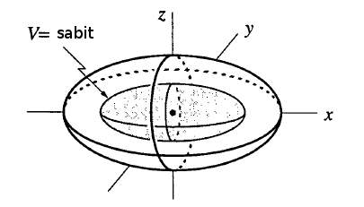
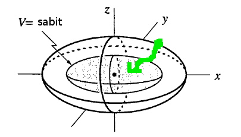
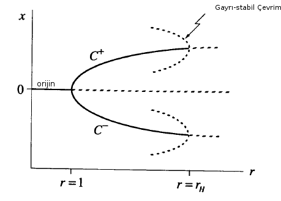
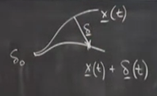
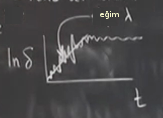

# Ders 17

Önceki derste Lorenz sisteminin bulunması kolay özelliklerinden bahsettik,
bu derste biraz daha çetrefil olanlarını, ve özellikle kaos çıkma
olasılığını inceleyeceğiz. Hatırlarsak Rayleigh parametresi $r < 1$ ise
iddia etmiştim ki tüm gidiş yolları sonuşurda (asymptotically) orijine
yaklaşır. Bu iddiayı ispatlayacak tekniğimiz yoktu, bu derste global
sonuçlara erişmek için bir teknik göstereceğim.

Eğer sönüm yeterince büyükse $t \to \infty$ iken tüm gidiş yolları
orijine yaklaşır, orijinin "global olarak stabil'' olduğunu
söyleyebiliriz. Global stabilliğin tersi yerel stabillik, bunu
lineerizasyon üzerinden $r < 1$ için önceki derste görmüştük. Orijin global
olarak stabil ise o zaman her şey orijine gidiyor demektir, stabil limit
çevrimlerine, kaosa gitmiyorlar, başka hiçbir çekici yok. 

İspat nasıl olacak? İspatın taslağı şöyle; önce bir
$V(x,y,z) = \frac{1}{\sigma} x^2 + y^2 + z^2$ tanımla. Peki bu fonksiyonu
nereden buldum, çok bariz değil. Bu tür fonksiyonları bulmak biraz sanat
işidir bu arada, onlara Lyapunov fonksiyonu deniyor. Lyapunov
fonksiyonlarını içinde sürtünme, sönüm, yitirgenlik olan bir sistemdeki
enerji fonksiyonlarına benzetebiliriz. Klasik bir mekanik sistemdeki toplam
enerjiyi yazarız mesela, ama sürtünme vardır, ve enerji tekdüze (monotonic)
şekilde azalmaya başlar. $V$'nin böyle bir fonksiyon olmasını istiyoruz,
zaman geçtikçe tekdüze şekilde azalmalı, ve bu azalış sayesinde $x,y,z$'nin
orijine yaklaşması gerektiğini ispatlayacağız.

Geometrik açıdan bakalım olaya; $V$ neredeyse standart bir hesap olan
karelerin toplamına benziyor, $ x^2 + y^2 + z^2$ neredeyse, tek fark başta
$1/\sigma$ var. Eğer $1/\sigma$ formülde olmasaydı her sabit $V$ için bu
formül bir küre tanımlıyor olurdu. Ama $1/\sigma$ formülde olduğu için
$V$'nin kesit seviyeleri (level set) elipsoid, daha doğrusu farklı $V$'ler
için elimizde eşmerkezli elipsoidler var. Taslaksak olarak çizelim,



Göstereceğiz ki herhangi bir elipsoid üzerindeki $V$ değerinden başlanınca
(altta başlangıç yeşil noktası) zaman geçtikçe daha da ufak $V$ değerlerine
gidiliyor, ve sonuç olarak orijine yaklaşılıyor. 



Soru 

Kesit seviyesi ne demektir? 

Cevap

$V$'nin sabite eşit olduğu durum, bazen kontur ismi de veriliyor. 

Soru

Neyin orijine gittiğini anlamadım, gidiş yolları mı, elipsoid'ler mi?

Cevap

Orijine giden $x,y,z$. $V$ üzerinden tanımladığımız elipsoidler bir yere
gitmiyor, onlar bize yardımcı bir araç sadece, onun sayesinde orijine
gidişi "şu anda hangi $V$, hangi elipsoid içindeyiz'' sorusuna çevirmiş
olduk.

Devam edelim, fikir şu: $\frac{\mathrm{d} V}{\mathrm{d} t}$'yi, yani değişim hızını
hesapla, ve bu hızın sıfırdan küçük olduğunu göster, eğer $r < 1$ ise (bu
faraziyeye ihtiyacımız olacak), ve orijinde değilsek. Orijinde olmamamız
önemli çünkü eğer tam orijin üzerindeysek, hatırlarsak orijin bir sabit
nokta, ve sabit noktada $V$ azalmaz, orada $\frac{\mathrm{d} V}{\mathrm{d} t}=0$
olur.  

Şimdi $\frac{\mathrm{d} V}{\mathrm{d} t}$'yi hesaplayalım, $V$'yi üsteki gibi niye
seçtiğimizi şimdi daha iyi anlayacağız belki, çünkü türevi alırken
tanımladığımız $V$'nin faydalı olacak özellikleri var. Bir de
$\frac{1}{2} \frac{\mathrm{d} V}{\mathrm{d} t}$'yi hesaplayalım çünkü $V$ içindeki
kareler türev sonrası aşağı inip katsayı 2 haline gelecek, onları iptal
etmek için $1/2$ ile baştan çarpalım.

$$ 
\frac{1}{2} \frac{\mathrm{d} V}{\mathrm{d} t} = 
\frac{x\dot{x}}{\sigma} + y\dot{y} + z\dot{z} 
$$

Niye ilk terimde $\frac{x\dot{x}}{\sigma}$ elde ettik? Zincirleme Kanununu
unutmayalım, $t$'ye göre türev alıyoruz, fakat $x$, $t$'nin bir fonksiyonu,
bu sebeple $x^2$ türevi önce $2x$ veriyor, sonra $x$'in $t$'ye göre türevi
$\dot{x}$ ile çarpıyoruz. Şimdi Lorenz denklemlerine bakarak
$\dot{x},\dot{y},\dot{z}$'nin değerlerini üstteki formüle sokalım. Lorenz
denklemleri neydi?

$$ \dot{x} = \sigma (y - x)$$

$$ \dot{y} = rx - y - xz $$

$$ \dot{z} = xy - bz $$

Bu arada 1. formüldeki $\sigma$'ya dikkat, zaten bu sebeple Lyapunov
fonksiyonuna bir $\sigma$ koyduk ki şimdi yapacağımız yerine geçirme
işleminden sonra $\sigma$'lar iptal olabilsin.

$$ = (yx - x^2) + (ryx - y^2 - xzy) + (zxy - bz^2)  $$

İptal olabilecek bazı terimler var, mesela, 

$$ = (yx - x^2) + (ryx - y^2 - \cancel{xzy}) + (\cancel{zxy} - bz^2)  $$

$$ = (r+1)xy -x^2 -y^2 - bz^2 $$

Bu son ifadeye bakalım, onun kesinlikle negatif olacağından emin miyiz?
Terim terim bakarken tam emin olamıyoruz, $b,r$ pozitif, $-bz^2$ sıfır ya
da negatif, $-x^2,-y^2$ aynı şekilde. Fakat $(r+1)xy$ terimi problem
çıkartabilir gibi duruyor, eğer $x,y$ aynı işarete sahipse o zaman bu terim
pozitif olur. Yani ilk bakışta üstteki ifade "negatif kesin'' gibi
durmuyor (lineer cebirden terminoloji kullanmak gerekirse), fakat aslında
öyle. Kareyi tamamlama (completing the square) işlemini uygulayınca bu açık
bir şekilde görülecek.

$$ 
 = 
- \bigg[ x - \frac{r+1}{2}y \bigg]^2 
- \bigg( 1-\bigg(\frac{r+1}{2}\bigg)^2 \bigg)y^2 
- bz^2
$$

Üstteki ifadeyi açınca iki üstteki ifadeyi elde ettiğimiz görülebilir. Bu
son ifade gerçi daha arap saçı gibi duruyor ama bence onun negatif kesin
olduğunu görmek daha kolay. İlk büyük terimde "negatif bir şeyin karesi''
var, kare her zaman pozitif verir, onun negatifi her zaman negatif
olur. İkinci büyük terimde $(\frac{r+1}{2})^2$'ye bakalım, $r < 1$
demiştik, o zaman bölünende 2'den küçük bir değer var, yani
$\frac{r+1}{2} < 1$ olacak, karesini alınca hala 1'den küçük, o değeri
1'den çıkartınca her zaman pozitif. Yani ikinci büyük terimde $y^2$ önünde
pozitif bir değer var, çünkü $r<1$. O zaman ilk büyük terimde negatif,
ikinci büyük terimde pozitif bir şeyin negatifi çarpı pozitif $y^2$, ve
üçüncü terimde $-b$ her zaman negatif, çarpı $z^2$ her zaman pozitif, yani
üçüncü terim de negatif. O zaman üstteki hesap her zaman $\le 0$.

Pekala, $\frac{1}{2} \frac{\mathrm{d} V}{\mathrm{d} t}$'in pozitif olmadığını
gösterdik. Peki sıfır olabilir mi? Düşünelim, negatifi alınmış bir şeylerin
karesinin toplamının sıfır olabilmesi için o toplamdaki (negatif olan) her
terimin ayrı ayrı sıfır olması gerekir. Değil mi? Biri pozitif biri negatif
olsaydı o zaman biri bir diğerine götürür vs. gibi şeylerle ilgilenmemiz
gerekecekti, ama tüm terimlerin negatif olduğunu biliyoruz, o zaman sıfıra
eşitlik için hepsinin ayrı ayrı sıfır olması gerekir. Bakıyoruz
$y^2,z^2$'nin katsayıları sıfır olması mümkün değil, o zaman bu terimlerde
sıfırlık için $y,z$'nin sıfır olması gerekir. Aynı şekilde birinci terimde
$x,y$ sıfır olmalı. Demek ki üstteki ifadenin sıfır olması için tüm $x,y,z$
değişkenleri sıfır olmalı, bu orijinde olunduğu durum.

Baştaki iddiamıza dönelim, eğer orijinde değilsek, $r<1$ ise
$\frac{1}{2} \frac{\mathrm{d} V}{\mathrm{d} t}$ kesin negatif, yani ardı ardına gelen
elipsoidlerin hepsi birbirinden küçük. O zaman, $V$'nin alt sınırı sıfır
olduğuna göre, ve $V$ tekdüze şekilde azaldığı için
$V(x(t),y(t),z(t)) \to 0$ olmalıdır. $V$'nin sıfır olduğu tek nokta da
$x,y,z$ sıfır olduğu noktada olduğu için $t \to \infty$ iken gidiş yolu
orijine gidiyor demektir.

Soru 

Bu Lyapunov fonksiyonunu nasıl buldunuz? 

Cevap 

Bu işin sanat kısmı işte, aynen Dulac yöntemindeki $g$'yi bulmak
gibi. Uygulamalı Matematikte halen pek çok çözülmemiş problem var, çünkü
onlar için hala düzgün bir Lyapunov fonksiyonu bulunamadı. Mesela
türbülansta boruda akışı düşünürsek, belli bir Reynolds sayısının, mesela
800 gibi, altında tek stabil çözümün yaprak tipi (laminar) çözüm olduğu
düşünülüyor. Yani sistemde yaprak tipi olan global bir çekici var, ama hala
kimse bunu kesin olarak ispatlayamadı. Kabaca bunun doğru olduğunu
biliyoruz, ama o Lyapunov fonksiyonunu bulamadığımız için kesin ispatı
yapamıyoruz.

Devam edelim, şu $r < 1$ olan sıkıcı alandan çıkalım artık, $r > 1$ olunca
ne oluyor ona bakalım. Önceki derste $r>1$ olunca orijinde bir eğer var
demiştik, ayrıca iki yeni sabit noktayı bulmuştuk, onlara $C^-$ ve $C^+$
ismi vermiştik. Bu iki yeni sabit nokta $r=1$ olduğunda orijinde ortaya
çıkıyordu, bu noktalar su çarkının herhangi bir yönde kalıcı dönüşüne
tekabül ediyordu, ya da bu modelin temsil ettiği taşınım hücresinin
varlığına.

Bu konumlar stabil mi? Evet, en azından ilk başta. Bunun hesabını size ödev
olarak veriyorum. Ödevde onların lineersel olarak stabil olduğunu
bulacaksınız, bu sonuca özdeğerleri hesaplayarak varmak gerekiyor, ya da bu
üç boyutlu sistemde o özdeğerler için belli koşullar hesaplayarak.. Neyse
bu noktaların $1 < r < r_{hopf}$ için lineersel stabil olduğunu
bulacaksınız, ki $r_{hopf} = \sigma(\frac{\sigma+b+3}{\sigma-b-1})$. Hopf
ismini kullandım çünkü göreceğiz ki bu sayıda bir Hopf çatallaşması ortaya
çıkıyor. Bu sonucu türetirken ayrıca bölenin pozitif olduğunu farz etmeniz
gerekiyor yani $\sigma > b + 1$. Lorenz'in makalesini hatırlarsak
$\sigma=10,b=8/3$. $r_{hopf}$'in aşağı yukarı $24.74$ çıkması lazım, yani 1
ile bu değer arasında bu noktanın sabit olduğu oldukça büyük bir bölge var.

Peki $r > r_{hopf}$ olduğu zaman ne olacak? Bu Hopf'in ne tür olduğuna
bağlı. Hopf çatallaşmasında bir limit çevrimi yaratılır ama bu stabil bir
çevrim midir, ki bu durumda Hopf süperkritiktir, yoksa gayrı-stabil midir
ki bu durumda çevrim $r_{hopf}$ altında oradaydı ve gayrı-stabil
durumdaydı? Bir tahmininiz var mı? 

Bir tahmine göre $C^-,C^+$ çevresinde ufak, stabil birer limit çevrimi var,
iki tane çünkü hatırlarsak çözümler simetrik çift halinde geliyor - fakat
bu tahmin doğru değil, standart Lorenz parametre değerleri için çatallaşma
altkritik (subcritical). Hatırlarsak altkritik tehlikeli bir şey,
13. derste bunu anlatırken uçak kanatlarından bahsetmiştim, kollarımı filan
sallamıştım, tehlikeli çünkü yakında hiçbir çekici yok. Tahmin bir yana,
hesabın kendisi aslında zor bir hesap. Uzun yıllar bu alanda çalışanlar
burada alt mı süper mi kritiklik olduğundan emin değildi, elde bir ispat
yoktu, ta ki Marsden ve McCracken tarafından ispat yapılana kadar [2].

Altkritiklik mevcudiyet ne demek? Ortada bir altkritik çatallaşma olduğuna
göre gidiş yolları uzaktaki bir çekiciye atlayacak demektir. Bu
çatallaşmayı tehlikeli yapan da bu zaten, kesintisiz, sürekli olmayan bir
davranış var ortada. Bizim örneğimizde bu zıplayış $C^-,C^+$ çekicileri
dışında bir şey olacak. Bu şey nedir?

Hatırlarsak imkansızları eleyen ve geriye kalan, her ne kadar olası olmasa
da, doğru cevaptır diyen Sherlock Holmes felsefesini takip ediyoruz, burada
şimdiye kadar elediklerimiz neler?



$r=1$'de çatallaşma oluyor demiştik, sonra gidiyor gidiyoruz, ta ki
$r_{hopf}$'a (resimde $r_H$) gelinceye kadar, bu noktada ispat etmeden
iddia etmiştim ki burada altkritik Hopf çatallaşmaları var, yani o noktada
geriye doğru bükülen gayrı-stabil çevrimler var. Onları da resimde
göstermeye uğraştık. Bu arada, o geriye doğru bükülen kapların gidip gidip
orijine gittiğini hayal edenler olabilir, ve bu hakikaten oluyor, standart
Lorenz parametreleri çevresindeki bazı değerler için yanlış
hatırlamıyorsam, 13 ya da 14 etrafında, o gayrı-stabil çevrimler o kadar
büyüyor ki uçları bir homoklinik çatallaşma üzerinden orijine dokunuyor. Bu
olduğunda "çanak-çömlek patlıyor'', her şey alt-üst oluyor, bazıları bu
hale homoklinik patlama ismi veriyor, çok yanlış bir isim değil. Lorenz
sistemi hakkında bir kitap yazıldı [3], orada yazar bu durumdan detayıyla
bahsediyor. Lorenz'in kendisi bu durumu bilmiyordu, yeni keşfedilen bir
şey, ama o da $r$'yi büyüttükçe ve $r_{hopf}$ sonrası her şeyin
gayrı-stabil olduğunu görüyordu. $C^-,C^+$, orijin, herşey gayrı-stabilliğe
gidiyor.

Peki gidiş yolları nasıl davranır bu durumda? Belki sonsuzluğa kaçtılar!
Tüm sistem o kadar gayrı-stabil durumda ki belki aşırı büyüdüler /
patladılar. Aslında bu mümkün değil, bu başka bir ödevin konusu (çok zor
değil). Gidiş yolları sonsuza gider mi? Hayır. İspat için büyük bir küre
tasarlarsınız ki öyle ki onun dışındaki tüm gidiş yolları küreye doğru
gitmeli, ve içine girmeli, ve hiç dışarı çıkamamalı. Yani ortada bir kapan
bölgesi (trapping region) var. Her şey nihayetinde bir büyük küre içinde
yakalanıyor. Lorenz de bu ispatı makalesinde yapmıştı.

O zaman sonsuza gidiş yok, etrafta hiç çekici yok. Bir diğer ihtimal ne
olabilir? Bir stabil limit çevrimi mi? İlla $C^-$, ya da $C^+$'dan
çatallaşmış olması gerekmez, belki hiç yoktan ortaya çıkan bir stabil limit
çevrimi var, çevrimlerin eğri düğüm çatallaşması durumunda olduğu gibi..?
Bu kavisli bir soru. Lorenz makalesinde öne sürdüğü sistemde stabil limit
çevrimi olmadığını iddia etti, kullandığı argümanı sonra işleyeceğiz, ama
argüman inandırıcı idi.

Ne kaldı? Stabil limit çevrimi yok, ama belki sonuşurda bir değişmez
(invariant) torusa yaklaşıyoruz? Torus üzerinde periyotalımsı bir hareket
var, periyotalımsılıktan bahsetmiştik. Fakat bu da imkansız, bu argüman
oldukca basit. Değişmez torus derken bir kez o torusta başlayınca onun
üzerinde kalıyorsunuz demek istiyorum. Bu mümkün değil çünkü eğer ortada
bir değişmez torus var ise bu torusun hacmini düşünelim. Burada katı / som
(solid) bir iç torus var, dış yüzey değişmez dedik, o zaman içteki hacim de
değişmez olacaktır. Ve bu mümkün değil çünkü biliyoruz ki Lorenz
sistemindeki herhangi bir bölge üstel bir şekilde küçülüyor. O zaman
değişmez bir torus olamaz çünkü bu küçülen bölge durumunu ihlal eder.

Bu noktada bildiğimiz her şeyi eledik. Lorenz de bu noktaya geldi, ve sonra
differansiyel denklemleri sayısal entegre ederek [yani sistemi simüle
ederek] neler olduğunu anlamaya uğraştı. Simülasyonu şurada görebilirsiniz
[4]. Video Lorenz'in ünlü bir başlangıç şartında noktadan sonra birkaç
sayıyı attıktan sonra sistemin tamamen farklı şekilde davrandığı durumu
gösteriyor, ki kaosun "başlangıç şartlarına hassas bağımlılığı'' burada
görülebiliyor. 

Lorenz ODE Denklemlerinin Sayısal Olarak Çözümü [1]

```python
import numpy as np
from scipy.integrate import odeint
def rhs(u,t,beta,rho,sigma):
    x,y,z = u
    return [sigma*(y-x), rho*x-y-x*z, x*y-beta*z]

sigma=10.0
beta=8.0/3.0
rho1=29.0
rho2=28.8

u01=[1.0,1.0,1.0]
u02=[1.0,1.0,1.0]

t=np.linspace(0.0,50.0,10001)
u1=odeint(rhs,u01,t,args=(beta,rho1,sigma))
u2=odeint(rhs,u02,t,args=(beta,rho2,sigma))

x1,y1,z1=u1[:, 0],u1[:, 1],u1[:, 2]
x2,y2,z2=u2[:, 0],u2[:, 1],u2[:, 2]

import matplotlib.pyplot as plt
from mpl_toolkits.mplot3d import Axes3D

fig=plt.figure()
ax=Axes3D(fig)
ax.plot(x1,y1,z1,'b-')
ax.plot(x2,y2,z2,'r:')
ax.set_xlabel('x')
ax.set_ylabel('y')
ax.set_zlabel('z')
ax.set_title('Lorenz denklemleri, rho = %g, %g' % (rho1,rho2))
plt.savefig('17_01.png')
```


Soru

Lorenz modelini niye / nasıl keşfetti? 

Cevap

1960'lı yıllarda bilim çevrelerinde ciddi bir tartışma vardı, hava tahmini
nasıl yapılır? Üç metot öne sürülmüştü, biri örüntü / kalıp tanıma (pattern
matching) ile. Dün sıcaklık 20 derece ise, tarihte 20 derece olan diğer
günleri bul, bu günlerden ertesi günde ne olduğunu
raporla. Basitleştiriyorum ama, aşağı yukarı fikir bu. İkinci yöntem lineer
regresyon ile, komşu eyaletlerin, dün, önceki gün, vs. değişkenlerini al, o
yer ile bir regresyona sok, katsayı değerlerini hesapla, sonra o katsayılar
ile yeni bir gün, yer için tahmin üret.

Üçüncüsü pür fiziksel olarak olaya yaklaşmak, sıvı akışını biliyoruz,
termodinamik kanunlarını biliyoruz, bu yöntemleri havaya uygula, basınca
bak, kısmi differansiyel denklemleri bul, sayısal entegrasyon ile ne
olacağını hesapla. Üçüncü yöntemin problemi o günkü bilgisayarların hesap
için yeterince kuvvetli olmaması idi.

Lorenz gördüğümüz gibi bir differansiyel denklem sistemi kullandı, ki bu
üçüncü yöntem, fakat ilginç olan Lorenz aslında 1. ve 2. yöntemlerin
hangisinin daha iyi olduğunu anlamak amacıyla iklim gibi davranan bir
"suni iklim''e ihtiyacı olduğu için denklemlerini yazdı. Çünkü o zaman bu
iklimi istediği gibi / şekilde işletip testlerini onun üzerinde
yapabilecekti. Bazıları Lorenz'in rasgele bu denklemleri bulduğunu söylüyor
ama bu doğru değil. O bu denklemleri kasıtlı bir şekilde, deterministik ve
tahmin edilmesi zor olacak şekilde seçti. Bir arkadaşına söylemiş,
taşınımda o tür bir denklem olduğunu biliyormuş zaten, ama bu sistem 12
denklemli bir sistem, Lorenz onları azalta azalta özünü temsil eden 3
denkleme getiriyor, ve Lorenz denklemleri oradan geliyor; çünkü onun amacı
deterministik ama periyotsal olmayan bir şey tasarlamak.

Lorenz Çekicisi



İki gidiş yolu düşünelim, aralarındaki fark başlangıçta çok az, $\delta_0$
olsun. Zaman geçtikçe aralarında $\delta$ vektörü kadar fark olsun. Resimde
$\underline{\delta}$'yi vektörün büyüklüğünü temsil için kullandım. Lorenz
çekicisi için $t$ zaman sonrası fark sayısal deneylerde,

$$ \delta(t) \approx \delta_0 e^{\lambda t}$$

olarak bulunmuştur. Standart Lorenz parametreleri için $\lambda = 0.9$
çıkacak (bu da sayısal deneylerle bulundu). Video'daki bilgisayar
grafiğinde alttaki gibi bir şekil vardı hatırlarsak,



Bu grafik bol inişli çıkışlı bir grafik, benim iddiam eğer grafiği kabaca
temsil eden bir çizgi çizersek o çizginin eğimi 0.9 olur. Bu net sayıyı çok
ta ciddiye almaya gerek yok, ama bir pozitif $\lambda$ olduğu bariz. Yani
gidiş yolları üstel hızda birbirinde ayrılıyor. Sonra ayrım bitiyor tabii
[üstteki grafikteki düz bölge] çünkü gidiş yollarının çekicinin ölçeğinden
daha fazla birbirlerinden ayrılması mümkün değil.

$\lambda$ parametresi Lyapunov üsteli (exponent) denen bir kavramı temsil
ediyor. Tabii $n$ boyutlu bir sistem için $n$ tane Lyapunov üsteli olur, bu
sadece en büyüğü. İnsanlar bir Lyapunov üstelinden bahsederken aslında bunu
kastediyorlar, en büyük olanını. Ama net bir zihinde canlandırma için gidiş
yolunda bir nokta düşünelim, ve onun etrafında $n$ boyutlu bir belirsizlik
küresi düşünelim. Zaman geçtikçe o küre bir elipsoid'e dönüşür, ve bu
elipsoid'in en büyük ekseni, yani en hızlı üstel ayrıma sebep olan eksen,
$e^{\lambda t}$ hızında büyüyen eksen olacaktır.

Bir sistemin pozitif Lyapunov üstele sahip olması kaosun işaretidir.

"Başlangıç şartlarına olan hassas bağlantı'' demiştik, başlangıçta yapılan
ufak değişiklikler zaman geçtikçe üstel hızda değişime sebep oluyordu. Bunu
söylemek sistemin pozitif Lyapunov üsteline sahip olduğunu söylemek ile
aynı şey.

Bunun tahmin için önemi ne? Diyelim ki bir tolerans $a$ sonrası sistemizi
tahmin edilemez kabul ediyoruz, yani $\delta > a$ olduğu durum. O zaman
$\delta_0 e^{\lambda t} = a$'yi çözmek ($t$'yi bulmak için) bize temel
kavramsal bir formül sunmuş oluyor. 

$$ t \approx \frac{1}{\lambda} \ln \bigg( \frac{a}{\delta_0}\bigg) $$

$t$ tahminlerin işleyeceği zaman noktası, ondan sonra tahmin mümkün değil,
ona "tahmin ufku (predictability horizon)'' diyelim, ya da Lyapunov
zamanı. Bu zamanın $1/\lambda$ derecesinde olduğuna dikkat. Mesela güneş
sisteminin $1/\lambda$'sı 5 milyon yıl [gezegen hareketleri oldukca tahmin
edilir, ama zaman ölçeğini doğru seçince orada bile kaos var]. Ama şimdi
"bir dakika formülde logaritma var'' diye düşünenler olabilir. Uygulamalı
Matematiğin iyi bilinen kulağa küpe kurallarından biri logaritmaların
derecesi 1 civarı olması. Bir sayının logarıtma üzerinden etki yaratması
için çok büyük olması gerekir, mesela Avagadro'nun sayısı, 10 üzeri 23
değil mi, bu dehşet büyük bir sayı. Fakat bu sayının log'unu alınca sadece
23 olur, ki o sayıda 1'den çok büyük sayılmaz.

Yani birisi diyebilir ki "bu kabul edilemez, havayı $1/\lambda$'ya oranlı
değil, $10 \lambda$'ya oranlı tahmin edebilmek istiyoruz'', yani şu an
[mesela] yaptığımız tahminin 10 katına çıkmak istiyoruz. Formül diyor ki o
hedefe erişmek için $\delta_0$'yı müthiş ufaltmak lazım. Ne kadar?
$10^{10}$ kadar! Başlangıç şartlarına olan hassas bağlantı bu işte. Kaotik
sistemlerde başlangıç ölçümlerinde aşırı ilerleme yapmadan tahmin ufkunu
büyütmek çok zor.

Kaynaklar

[1] Saha, *42 Problems in Scientific Computing*, [http://www.physik.uzh.ch/~psaha/teach/42probs.pdf](http://www.physik.uzh.ch/~psaha/teach/42probs.pdf)

[2] Marsden, *The Hopf Bifurcation and Its Applications*

[3] Sparrow, *The Lorenz Equations: ifurcations, Chaos, and Strange Attractors*

[4] Strogatz, Lecture, [https://youtu.be/gscKcPAm-H0?t=2529](https://youtu.be/gscKcPAm-H0?t=2529)


