# Ders 18

Önceki derste Lorenz sistemi ve onun karmaşık dinamiğinden bahsettik. Ve
nihayet [dersimizin ana teması kaosun merkezi olan] başlangıç noktasına
olan hassas bağlantı kavramıyla tanıştık. Bu durumda birbirine yakın gidiş
yolu yaklaşık olarak üstel hızda birbirlerinden ayrılıyordu, demiştik ki bu
ayrışmanın hızı, $\lambda$, ki $e^{\lambda t}$ formülündeki $\lambda$ bu,
"en büyük Lyapunov üsteli'' idi, ya da ona kısaca "Lyapunov üsteli''
diyorduk. Eğer Lyapunov üsteli pozitif ise bir üstel ayrışma vardı ve bu
kaosun bir nevi imzası, onun olduğunu gösteren bir ipucu olarak
görülebilirdi. Sonra Lyapunov üstelinin bize bir zaman skalası
sağladığından bahsettik, bu skala $1/\lambda$ idi, bu skalaya Lyapunov
zamanı, ya da "tahmin edilebilirlik ufku (predictability horizon)'' adı
vermiştik, bir kaotik sistemin ne yapacağını net olarak hesaplamak bu
ufkun, rakamın birkaç katı ötesinde pek mümkün olmuyordu.

Bu derste kaos, garip çekici (strange attractor) gibi terimler hakkında
daha net olmak istiyorum ve Lorenz'in makalesinde yaptığı çok akıllıca bir
şeye dikkat çekmek istiyorum; onun bulduğu çekici sadece çok uzun bir limit
çevrimi değildi. Bu uzun süre merak konusuydu, yani bu garip çekicinin
gerçekten "garip'' olduğuna emin miyiz? Belki de sadece çok büyük bir
limit çevrimidir, eğer yeterince beklesek onun kendinin tekrarlamaya
başlayacağını görürdük belki.. Lorenz'in bu konuda ortaya koyduğu kanıtı
işleyeceğiz, tam formel bir ispat değil bu ama fikir verici, imalı bir
kanıt.

Kaba hatlarla bazı tanımlar ortaya koyalım şimdi, kaba hatlarla diyorum
çünkü bu tanımlar bir pür matematik dersinde olduğu gibi bir ispat için
kullanılabilecek türden tanımlar değiller, daha çok kavramsal tanımlar, ki
konunun geri kalanı anlamlı olsun.

Tanım: Kaos

Deterministik bir sistemde başlangıç şartlarına hassas bağlantısı olan uzun
vadeli periyodik olmayan davranış.

Burada bir sürü jargon (terim) var. Periyodik olmayan en basiti, adı
üstünde. Periyodik olmayan derken bunun çok basit türlerini kastetmiyoruz
tabii, mesela bir denge noktası olmamalı, ki onun periyotu sıfır olurdu ve
kağıt üzerinde "periyodik olmayan'' gibi görülebilirdi, ama biz bu tür
basit olanları kullanmayacağız. Periyodik olmayan derken bir denge
noktasına düşmeyen ve periyodik olarak kendini tekrar etmeyen sistemlerle
ilgileneceğiz.

Uzun vadeli davranış dedik, bazıları bunun kaos tanımının önemli bir
parçası olduğu hakkında hemfikir olmayabilir, fakat özellikle kendi kendini
besleyen kaostan bahsediyorum, ki bu tür kaos uzun vadede bile periyodik
olmayan davranışta sergiliyor, geçici değil. 

Determinism hiç gürültü, rasgelelik olmayan, rasgelelik içermeyen türden
sistemler, öyle modeller ki eğer aynı başlangıç şartlarını kullanırsanız
sistemi ileri doğru işletince her seferinde aynı sonucu
alabilesiniz. Mevcut zaman geleceği tam olarak belirliyor. Tabii bu
demektir ki eğer mükemmel bilgiye sahip olsaydık ileri doğru entegre
ederek geleceği tahmin edebilirdik, fakat mükemmel bilgiye sahip değiliz ki
bu daha önce bahsettiğimiz tahmin edilemezlikle alakalı. 

Ve nihayet başlangıç şartlarına olan hassas bağlantı; dedik ki başlangıçta
birbirine çok yakın iki gidiş yolu cebirsel olarak değil, mesela lineer, ya
da $t$'nin üsteli bağlamında, ortalama olarak üstel olarak birbirlerinden
ayrılıyorlar, ki bu hata büyümesinin patlama yapması demektir. Hatırlarsak
daha önce torus üzerinde hemen hemen periyotluk (quasi-periodicity)
kavramını görmüştük. O durumda da periyodik olmama, uzun vadelik,
determinizm vardı, fakat kaos değildi çünkü başlangıç sonrası üstel ayrışma
yoktu, ayrışma $t$'nin üsteliyle orantılıydı, hatta lineer idi. İşte bu
sebeple hemen hemen periyodik olmama kaos değildir. Ayrıca pozitif Lyapunov
üstelin olması başlangıç şartlarına olan hassas bağlantı var demenin farklı
bir yoludur. 

Sık kullandığımız bir diğer terim çekici. Bu arada bu terimlerin hakkında
literatürde ortak bir konsensüs oluşmadı, farklı kitaplar, farklı hocalar
terimleri biraz farklı şekilde kullanabilirler. Ama herhalde herkes bir
çekicinin alttaki özelliklere sahip olduğunda hemfikir, 

1) Değişmeyen bir küme ($A$'da başlarsanız $A$ içinde kalırsınız).

2) Açık küme başlangıç şartlarını çeker.

3) $A$'nin hiçbir muntazam altkümesi 1 ve 2'yi tatmin etmez (buna $A$'nin
"minimal'' olmasi da deniyor).

Kaos tarifi yapmıyoruz dikkat, hala çekici tarifi yapıyoruz. 

Diyelim ki alttaki gibi iki stabil noktalı, faz portresi alttaki gibi
olan bir sistem var,

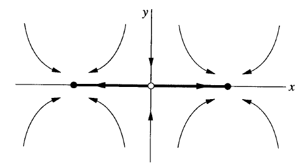

Herşey iki stabil noktalardan birine akıyor. X-ekseninde değişmezlik var,
"herşey'' dedim ama tabii y-ekseninde başlayan orijindeki eğer noktasına
gidebilir. Soru şu, bu tür bir resimde çekici adayları hangileri? Ortadaki
eğer noktası mesela, bu bir çekici mi? Listeden kontrol edelim, bir
değişmez küme mi? Evet, eğer noktasından başlayan orada kalır. Bu nokta
açık küme başlangıç şartlarını çeker mi? Hayır. Ne çeker? Y-ekseni
üzerindeki noktalardan müteşekkil kapalı kümeyi çeker. Açık, kapalı derken
neyden bahsediyoruz? Topolojiyi ya da analizi hatırlayalım, bir düzlemde ya
da $\mathbb{R}^3$'te açık küme demek, eğer bir küme etrafında onu
çevreleyen noktalar tanımlarsam bu noktalar küme dışına "taşar''. Üstteki
durumda bu normal çünkü baktığımız bir tek çizgi sadece (y-ekseni). Çizgi
düzlemde açık küme değildir. Demek ki üstteki eğer noktası, orijin, bir
çekici değil, 2. şartı ihlal ediyor.

Ya x-ekseni? Herşeyin aktığı noktaların hepsi x-ekseninde olduğuna göre bu
bir çekici olabilir mi? Değişmeyen küme mi? Orada başlayınca orada
kalınıyor mu? Evet. Açık küme başlangıç şartlarını çekiyor mu? Evet,
$\mathbb{R}^2$'nin tamamını çekiyor. Düzlemde nerede olursanız olun
x-eksenine gidersiniz, sonuşurda x-eksenine gidersiniz daha doğrusu. Ve tüm
düzlem bir açık kümedir, düzlemdeki herhangi bir noktanın etrafında onu
çevreleyen ufak bir açık disk çizilebilir, ve bu disk te düzlemin parçası
olur. 2. tatmin edildi demektir. 

Ya \#3? X-ekseninin 1 ve 2'yi tatmin eden muntamam bir altkümesi var mıdır?
İşte burada bir problem var, bir çekici içinde kendileri de çekici olan
daha ufak nesneler barındırmamalıdır. Çekici olarak düşünülen şeyler eksen
üzerindeki iki stabil nokta, esas çekiciler onlar, x-ekseni değil. X-ekseni
gibi şeylere bir "çekici küme'' deniyor ama bir çekici değil, çünkü bu
küme minimal değil. 

O zaman stabil noktalar çekici, listemizle kontrol edelim, orada başlayınca
orada kalınır, 1 tamam. Açık küme başlangıç şartlarını çeker mi? Mesela
sağdaki stabil nokta neyi, neleri çeker? Tüm düzlemin sağ yarısını, yani
açık sağ düzlem (ki y-ekseni haricinde onun sağına kalan tüm noktalar)
çekiliyor, bu noktalar açık bir küme, 2 tamam. Peki 3, kendisi de bir çekici
olan muntazam bir altkümesi var mı? Bir noktanın altkümesi nedir ki?
Herhalde boş küme olur bu, ve bu çekici sayılabilecek bir şey değildir, 3
tamam. 

Soru

Çekiciler illa nokta mı olmalı?

Cevap 

Hayır. Bir limit çevrimi de çekici olabilir. Mesela içinde gayri-stabil bir
nokta içeren stabil bir limit çevrimi düşünelim, herşey bu çevrime doğru
çekiliyor. Değişmezlik var mı? Evet. Çevrimde başlarsam orada kalırım. Açık
küme başlangıç şartlarını çeker mi? Evet. Orijin haricinde [çevrim orijin
merkezli] her şey (çünkü orijinde gayri-stabil bir nokta var), ortasındaki
ufak bir "delik'' haricinde herşey bu çevrime çekilir, ki çekilenler bir
açık küme oluşturur. Minimal midir? Eğer düşünürsek limit çevriminin üst
kavisi mesela, bu değişmez değildir. 

[bazi sorular atlandi]

İlginç 3 özellik bunlar. Çoğunlukla bir 4. özellik te ekliyor, herkes
yapmıyor bunu, neyin ispat edilmek istendiğine göre değişiyor, ama
genellikle yapılıyor. Bu özellik şöyle,

4) $A$ yakınında başlayan gidiş yolları tüm zaman $t > 0$ süresince $A$'ya
yakın kalmalı.

Dikkat edersek bu 2. öğeden biraz farklı. "Açık küme başlangıç şartları
çekilmeli'' dediğimizde zaman sonsuza giderken ne olduğunu düşünüyoruz,
nihayetinde $A$'ya yakın düştükleri sürece kısa vadede gidiş yollarının ne
yaptığıyla ilgilenmiyoruz. 4 biraz daha "kontrol delisi'' denebilecek bir
şart, "$A$'dan hiçbir zaman uzaklaşmanı istemiyorum'' diyor, yani fazla
uzağa gitmeni istemiyorum diyor, bir anne, babanın çocuğuna söyleyebileceği
şekilde belki. 

Daha net olarak tanımlamak için, verili bir bölge $A$'nin $U$'şu ($U$,
$A$'nin etrafında bir tür bant gibi görülebilir, örnek altta), bir $A$'nin
$V$'sı denebilecek bir bölge vardır öyle ki $V$'de başlarsanız sonsuza
kadar $U$'de kalırsınız.

Bir örnekte görmek daha faydalı olabilir. Bir faz portresi çizeyim (altta),
bu tek boyutlu bir döngüyü temsil edecek, içinde birşey, bölge yok. Bir
dışkı çevreleyen bir seymiş gibi duruyor ama o değil, ben sadece çemberin
kendisinden bahsediyorum, daha önce çember üzerinde vektör alanlarından
bahsetmiştik, onun gibi. Özel bir vektör alanından bahsediyorum ama,
sistemde bir yarı-stabil nokta var. 

Bu çemberdeki akış noktanın gayri-stabil tarafından çıkıp stabil tarafına
doğru akıyor. Daha teknik olarak yazmak istesek ama, resme göre $\pi/2$'de
bir çekici [gibi olan bir şey] var, 

$$ \dot{\theta} = 1 - \sin\theta $$

yapabilirdik. $\theta^\ast = \pi/2$'da bir sabit nokta var, soru şu,
gösterilen nokta bir çekici mi? Listeden kontrol edelim, orada başlarsak
sonsuza kadar orada kalır mıyız? Evet. Bu bir sabit nokta. Açık küme
başlangıç şartlarını çekiyor mu? Çektiği ne? Herşey. Çember üzerinde nerede
başlarsanız başlayın, sonunda o noktaya gideceksiniz. Tüm çemberi çekiyor,
ve çember açık. 1. ve 2. şartlarını tatmin eden muntazam bir altkümesi var
mı? Hayır. Bu bir nokta, altkümesi yok. O zaman ilk 3 kriterime göre bu
noktaya çekici demem gerekir.

Ama bazı yazarlar bu kararla hemfikir değil. "Yapma şimdi Steven''
diyorlar, nokta neredeyse yarı gayrı-stabil, mesela saat 10 noktasında bir
yerlerde başlasam geri dönmeden önce koca bir seyahat yapmam gerekecek,
yani yarı-stabil noktaya yeterince yakın durmadım, noktanın etrafında bir
ufak bölge çizmiş olsam o bölgeden kesin çıkacağım yani. Bu anne / çocuk
örneğinde uzaklaşan çocuk oluyor, yani 4. şart ihlali. Bu arkadaşlar o
sebeple bu noktaya "çekici değil'' diyorlar. 

Şimdi garip çekici derken neden bahsediyoruz onu anlatalım, yani torus,
limit çevrimi olmayan bu şeyi nasıl tarif ederiz? Garip çekiciyi tariflerde
de farklılık olabilir, bazısına göre başlangıç şartlarına hassas bağlantı
yeterli. Ama bazıları geometrik özellikleri ön plana çıkartabiliyor, onlara
göre "garip çekici yerel yapısı pürüzsüz değil ama fraktal olan bir
çekicidir''.  Fraktalları ileride işleyince bu söz daha anlamlı olacak
tabii. Bizim ifade dinamik bakış açısını ön plana çıkartıyor, öteki
geometrik. Bizim tarif kaotik çekici olarak ta tarif edilir, ikincisi
fraktal çekici. Bu konuda literatür biraz çoğulcu olabiliyor. 

Lorenz Çekicisinin Dinamiği

Önceki derste resmi göstermiştik, Lorenz sisteminde iki büyük bölge
vardı, gidiş yolları birinde bir süre dönüp dönüp sonra ötekine geçip
benzer hareketleri yapıyordu, geri geliyor, vs. Bu ders kitabımın 9.4
bölümünden. 

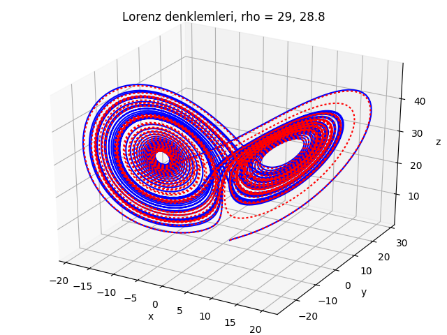

Lorenz'in burada yaptığı akıllıca iş şu idi, sistemini tek boyutlu eslemeye
(1-d map) indirgedi. Makalesinin [1] ikinci figüründe bunu nasıl yaptığını
gösteriyor, z-y grafiğini çiziyor, çekicisinin izdüşümünü bunun üzerinden
yapıyor,

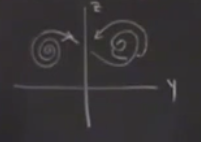

Sistemi için standart parametreleri kullanmış $r=28,\sigma=10,b=8/3$. Sonra
şu yorumu yapıyor: "Bu gidiş yollarına bakınca, bir gidişin merkezden
belli bir kritik uzaklığı aştıktan sonra içinde olduğu sarmaldan çıktığını
görüyorum. Diğer sarmala giriş noktası çıkış öncesi olan mesafenin ne kadar
büyük olduğuna bağlı gözüküyor''. Ve devam ediyor "bir sarmaldan nerede
çıktığınız ve ikincisinde nerede girdiğiniz, girdiğiniz sarmalda oradan da
çıkmadan önce kaç tur atacağınızı da kontrol ediyor, ki bu da tabii diğer
sarmala nereden gireceğinizi kontrol ediyor, böyle devam ediyor''.

Lorenz'in yapmaya çalıştığı olanları daha ufaltılmış boyutlarda, özetsel
bilgiler üzerinden anlamaya uğraşmak, mesela çıkış, giriş mesafeleri, tur
sayısı, vs. Nihayet şu ifadeden bahsediyor, ifadesinde bir kelimenin altını
çizmiş, o nokta önemli o yüksek sesle söylenecek, benim tarafımdan tabii,
Lorenz'in kendisi Maine eyaletinden çok mütevazi, sessiz sakin bir insandı
konuşurken onu zor bile duyardınız. Bir de çok monoton konuşurdu, dinlerken
aklınıza saatinize bakmak filan gelirdi "acaba yemeğe gitsem mi şimdi?''
gibi.. [öğrenciler gülüyor], yani hiç eğlenceli biri sayılmazdı. Fakat
müthiş bir bilim adamıydı, ve çok iyi niyetli bir insandı. Neyse, vardığı
nokta şu "[..] o zaman bir sarmalda ölçülen / takip edilen \underline{tek}
bir özelliğin diğer onun diğer sarmalda tekabül eden halini tahmin etmek
için kullanılması mümkün olmalıdır''. Yani sürekli zamanda üç sayıyı
[izdüşüm yapıldı, unutmayalım, üç boyut ikiye indi, sonra tek bir ölçüm
bulundu] takip etmek yerine ayrıksal zamanda tek bir sayıya bakmak yeterli
olacak, ve bu sayı bir sarmaldan diğerine takip edilebilecek.

Soru

Nasıl bir tür bir sayı bu? 

Cevap

Birazdan söyleyeceğim. Şu anda tanımsız, Lorenz'in sezgisi işliyor şu anda,
yaratcılık burada işin içine giriyor işte, tam tanımsız, belirsiz bir fikri
var, tek bir sayının her şeyi takip etmek için kullanılabileceğini
düşünüyor. 

Şimdi çıkışı düşünelim, ne zaman bir sarmaldan çıkıyoruz? Bir maksimum $z$
değerine gelindiği zaman diyelim, sarmaldan çıkıp diğerine giriyoruz, sonra
orada da bir yüksek noktaya erişiyoruz, ve çıkıyoruz. Lorenz bu maksimum
değeri düşünmeye başladı.. bunu saptamak için $z$'yi bir zaman serisi
olarak grafikledi, 

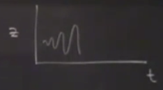

Sağa gittikçe büyüyen bir salınım bu, daha önce Lorenz sisteminin
dinamiğinde gördük bunları. Lorenz sonra bir "n'inci maksimum ölçütü''
diye bir şey tanımlıyor, bunlar yerel tepe noktaları,

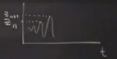

İki boyutlu resimde bunlar sarmal üzerinde her halkanın saat 12 noktaları
olurlardı. Soru şu, $z_n$'in $z_{n+1}$ üzerindeki etkisi nedir? Lorenz
böyle bir etki olduğunu düşünüyor, grafiği onun için çizdi zaten, ve
$z_n,z_{n+1}$ ilişkisine daha yakından bakmak istiyor, şimdi bilgisayarda
buna bakalım [2]. 

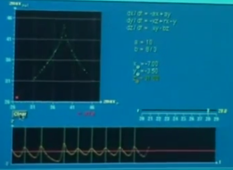

İki grafik var, alttaki $z,t$ grafiği. Onun üstündeki $z_n$ ve $z_{n+1}$
grafiği, yani bir tepe noktası ile ondan hemen sonraki tepe noktası
eşlenerek grafiklenmiş, aradaki ilişkiyi görmek için. Bu noktalar orada
burada dağınık bir şekilde olabilirdi, ama değiller, düzgün bir çatı şekli
oluşturmuşlar. Lorenz bunu görünce diyor ki "bu bir fonksiyonun grafiğine
benziyor'', yani o şekli üreten bir fonksiyonun olduğunu seziyor, ve
dinamik sistem bu fonksiyondan "örneklem alıyor'' bir bakıma. Şimdi bu
düşünce zincirini daha da ilerletelim ve sistem açısından ne demek olduğunu
anlamaya uğraşalım.

Bilgisayarda oluşan grafiği tekrar çiziyorum (kesikli olan çizgi 45 derece
açıyla karşılaştırma amaçlı çizdim, bir diğer sebebi daha var ona
geleceğiz),

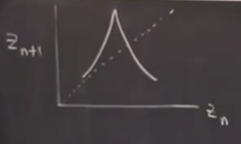

Bir fonksiyon var ise, bu $z_{n+1}=f(z_n)$ olarak
belirtilebilir. Bilgisayar çıktısına dikkat edilirse grafiğin genişliği
neredeyse yok. Aslında sonradan ortaya çıktı ki böyle bir fonksiyon
analitik olarak yok, fakat eğer olsaydı bunun anlamı ne olurdu? Bu düşünce
çizgisini inceliyoruz.

Lorenz önce grafiğin eğimine baktı, eğimin mutlak değeri her zaman 1'den
büyük, yani $|f'(z)| > 1$, $\forall x$. 

Bu fonksiyonu "işletmek'' istersek ne yaparız? Yani $z_{n}$ vereceğiz,
$z_{n+1}$ çıkacak, onu verip $z_{n+2}$ elde edeceğiz, hani hesap
makinalarında bazılarımızın yapmış olabileceği gibi sinüs ya da karekök
tuşuna ardı ardına basmak, ve sonuçlara bakmak [böylece bir önceki çıktı
sonraki girdi olur bir anlamda].

Bu işletmeyi grafiğin üzerinde yapabiliriz aslında, ve onu yaparken şu
sorunun cevabını arayabiliriz, girdiye verilince sonuç kendisi olan bir
rakam var mıdır? Tahmin edebileceğimiz üzere bu bir stabil nokta olurdu,
çünkü oraya varınca hep orada kalınır. Daha önce çizdiğimiz 45 derece
kesikli çizgi burada bize yardımcı olur, o kesikli çizgideki noktalar
istediğimiz özelliklere sahip [tanım itibariyle orada her nokta kendisine
eşit], o zaman bu kesikli çizginin $f$'yi kestiği yer $f$'te aradığımız
sabit noktadır.

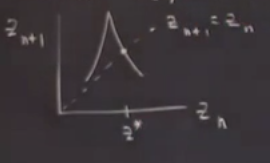

Üstteki grafikte bu sabit noktayı görüyoruz, $z^\ast$ ismini verdik, $f(z^\ast) =
z^\ast$. Sabit noktalar diferansiyel denklemlerdeki sabit noktalar gibi burada
sabit nokta özyineli eşleme (iterated map) için. 

Ama biraz önce gördüğümüz animasyonda o $z^\ast$ noktasına hiç gelmedik, çünkü
eğer gelseydik orada takılı kalırdık. Lorenz bu noktanın stabilitesine
baktı ve gayrı-stabil olduğunu gördü [herhalde bu sebeple gözlemlenmesi zor
çünkü oraya doğru çekiliş yok].

Fakat unutmayalım üstteki grafik üç boyutlu uzayda o kanatlı sekizimsi
grafiği bir nevi özetleyen, onu baz alan bir grafik. Acaba üstteki
grafikteki sabit noktanın o üç boyutlu grafikteki karşılığı ne olurdu?
Gidiş yolu bağlamında yani, özyineli eşlemede $n$'inci maksimumun
$n+1$'inci maksimum ile aynı olması gidiş yolu bağlamında ne demektir?
Hatırlarsak izdüşüm grafiğinde $z$ içeriden dışarı doğru büyüyor.. burada
öyle $z$ hep aynı kalacak.. Dik duran tam bir sekiz figürü bunu yapabilir,

$z_n$ ve $z_{n+1}$ aynı yükseklikte.. Bu döngü, ki Lorenz çekicisi üzerinde
olası bir döngü, özyineli eşlemedeki sabit noktaya tekabül ediyor. Bu
Lorenz sisteminde olası bir periyodik yörünge bu arada, acaba stabil mi?
Bir limit çevrimi var, bir stabil limit çevrimi mi? Cevap hayır, ve argüman
çok basit. Argüman için grafik metot kullanabilirdik, ya da lineerleştirme
kullanabilirdik. Önce lineerleştirme ile yapalım,

$$ z_n = z^\ast + \eta_n$$ 

$\eta_n$ ufak bir sarsım (perturbation), o zaman $|\eta_n| << 1$. $z^\ast$
etrafında lineerleştirme yapmak istiyoruz, üstteki tanımdan hareketle,

$$ z_{n+1} =  z^\ast + \eta_{n+1} $$

Diğer yandan $f(z_n)$ açılımını yapalım,

$$ 
f(z_n) =  f(z^\ast + \eta_{n+1}) = f(z^\ast) + \eta_n f'(z^\ast) + O(\eta_n^2)
$$

$O()$ terimlerini yok sayabiliriz çünkü lineerleştirme yapıyoruz. Lorenz
eşlemesine göre $z_{n+1} = f(z_n)$, o zaman üstteki ile iki üstteki
eşitliğin sol tarafları aynı, yani bu eşitliklerin sağ tarafları aynı.

$$ 
z^\ast + \eta_{n+1} =  f(z^\ast + \eta_{n+1}) = f(z^\ast) + \eta_n f'(z^\ast) +
O(\eta_n^2)
$$

Ve farkedelim ki tanım itibariyle $f(z^\ast) = z^\ast$, ve $O$ terimlerini atıp
eşitliği yaklaşık temsil haline getirirsek,

$$ 
\cancel{z^\ast} + \eta_{n+1} \approx \cancel{f(z^\ast)} + \eta_n f'(z^\ast) 
$$

Elimizde $\eta_{n+1}$ için bir ifade kaldı, bu ifade bize sapma $\eta$'nin
her döngüde nasıl büyüdüğünü ya da çürüdüğünü gösterecek.

$$ \eta_{n+1} \approx f'(z^\ast) \eta_n $$

Bunu analiz etmek kolay, $\eta$ büyüyor mu çürüyor mu? Hatırlarsak daha
önce belirtmiştik ki $|f'(z)| > 1$, o zaman $|f'(z^\ast)| > 1$'da doğrudur. Bu
durumda,

$$ |\eta_{n+1}| > |\eta_n| $$

doğru demektir, bu sapmalar büyüyor demektir, demek ki $z^\ast$ bir
gayri-stabil noktadır.

Lineerleştirme yerine grafik kullanabilirdik, bu grafiklere birazdan
göreceğimiz girift şekli sebebiyle örümcek ağı diyagramı (cobweb diagram)
deniyor. 

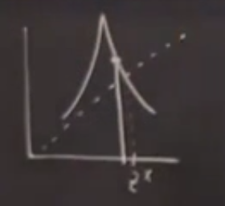
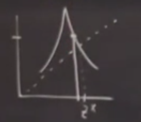
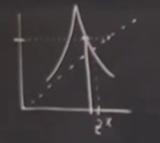
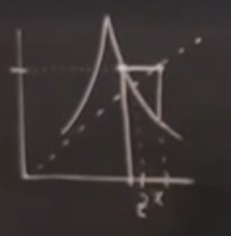

Nasıl çizildiğini tarif edelim. Başlangıçta diyelim $z^\ast$'nin az solunda
bir yerlerdeyiz. Bu anda $x-y$ bakış açısındayız, fonksiyona giren, çıkan
ne olduğu açıkça belli, yatay eksenden yukarıya çıkıyoruz (1. resim) ve
fonksiyona nerede deyiyorsak orası fonksiyonun oradaki değeri, dikey
eksende bu değeri görüyoruz, fonksiyondan sola gidip orayı
işaretleyebiliriz (2. resim). Peki şimdi çıktıyı girdi yapmak için ne
yapmak lazım? Burada 45 derece yatay olan çizgi numarası kullanabiliriz,
dikey eksendeki bir değeri yatay eksendeki yerini bulmak için (mesela
dikeyde 3'ten yataydaki 3'e nasıl gideriz?) bu en rahat yol, mesela dikeyde
3 değerinde isek oradan sağa doğru gidip 45 derece çizgiye çarpıncaya kadar
devam ederiz, oradan aşağı inerek yatay eksendeki aynı değere ulaşırız
(4. resim). Şimdi bu çıktıyı bir sonraki girdi yapmak için aynı işlemi
tekrarlamak için aynı şekilde yukarı çıkıp tekrar fonksiyona çarpamaya
uğraşırdık, 4. resim bir kestirme kullanmış, aşağı inerken fonksiyona
çarptığı yerde durmuş, bir daha in-çık yapmamış. Farketmez.

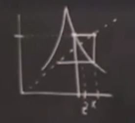
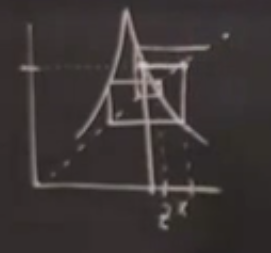

Devam ediyoruz, tekrar sola, oradan yukarıya gidip fonksiyon değerini
alıyoruz, ve bu şekilde devam ediliyor. Diyagrama niye örümcek ağı dendiği
de görülüyordur, ağımsı bir şekil oluştu. İşte grafiksel özyineleme böyle
yapılıyor.

Peki belli bir $z$ etrafında odaklanılıyor mu acaba? Üstteki örnekte
olmuyor ama biraz hoca hilesi yapayım (!) grafiği değiştirip tekrar eder
hale getireyim, 

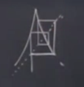

Evet. Şimdi burada bir periyodik yörünge var (tek $z$ etrafına odaklanma
olmasa da), sürekli o döngünün içinde dönüp durulacak. Soru şu, sabit nokta
stabil olmasa da stabil olan bir periyodik yörünge var mıdır acaba? Kontrol
edelim. Periyodik yörüngeyi nasıl tarif ederiz? Üstteki periyodik yörünge
bir $z_1,z_2,z_3..,$ sayı dizisini üretiyor diyebiliriz ve bu dizi bir süre
sonra kendini tekrarlamaya başlıyor, yani $z_{n+p} = z_n, \quad \forall n$
oluyor ki $p$ periyot. Bizim örnek resimde periyot $p=4$ [hoca çizgileri
takip ederek başa ne zaman döndüğüne baktı, ve $z_5=z_1$ buldu].

Periyodik yörünge stabil midir? Bu arada büyük resmi gözden kaçırmayalım,
tüm bunları niye yapıyoruz? Lorenz şu anda kendine şunu soruyor, gördüğü
çekici aslında stabil bir limit çevriminden ibaret mi? Bunu anlamaya
uğraşıyor. Daha önce biz ilk baştaki parametrelerle Lorenz sisteminde
stabil limit çevrimi yoktur demiştik, bunu nereden biliyoruz? Eğer bu doğru
olsaydı örümcek ağı diyagramı o periyotluk şartına uygun noktalar
üretirdi, bunun olmadığını göstereceğiz, bu da aslında $f$'nin eğimi ile
alakalı, sorun bu olacak. 

Devam edelim, $z_{n+p} = z_n$ formülüne bakalım, ve eger $p$ kere donersek, 

$$ z_2 = f(z_1)$$

$$ z_3 = f(z_2) = f(f(z_1)) = f^2(z_1) $$

Kare işareti bu arada bildiğimiz kare almak değil, içiçe iki kere $f$
demek. Böyle devam edersek, 

$$ z_4 = f^3(z_1) $$

Burada ortaya çıkan kalıba göre 

$$ z_{n+p} = f^p(z_n) $$

olurdu. Dikkat edersek periyot sayısı $z_4 = f^3(z_1)$ formülünde $4=3+1$,
$f$'nin kaç kere içiçe çağrısının olduğu artı ona başta verilen $z$
indisi. 

Tanım

$z$, $p$ periyoduna sahip bir noktadır eğer $f^p(z) = z$. 

Bu ifade bir sabit noktanın genellenmiş hali, sabit nokta üstteki $p=1$
hali, yani $f^1(z) = f(z) = z$ tanımına uyan şey. Periyot iki noktası
$f^2(z)=z$, iki kere dönüldükten sonra tekrar oluyor. Ayrıca $p$ tekrar
özelliğine sahip en küçük tam sayı alınır, $p=2$ ile tekrar eden bir şey
doğal olarak $p=4$ için de tekrar edecektir, ama burada $p=2$ kullanılır. 

Bu tanımdan sonra esas söylemek istedidiğimize gelelim, tüm periyot $p$
noktaları gayrı-stabildir. Sabit noktanın gayrı-stabil olması gibi, $p$
periyot noktası da böyledir. İspat çok basit, $p=2$ için yapalım herhangi
bir periyot için oradan anlaşılacak. 

Periyot 2 için, diyelim ki $f(f(z)) = z$. Şimdi lineerleştirme yaparak
stabiliteyi kontrol edebiliriz. Daha önce vardığımız bir sonucu
hatırlarsak, sapmanın $z$ noktasında $f'$ tarafından belirlendiğini
gösterdik. Şimdi $f$ in türevi yerine $f^2$'nin türevi lazım. Eğer mutlak
değer 1'den büyükse gayrı-stabillik durumu var. 

$$ 
(f^2)' 
= \frac{d}{dz} ( f(f(z)) ) = f'(f(z)) f'(z)
$$

Şimdi $(f^2)'$'in büyüklüğü (magnitude) nedir, 1'den büyük müdür? 

$$ 
|(f^2)'| = 
|\frac{d}{dz} ( f(f(z)) )| = 
|f'(f(z)) f'(z)| = | f'(f(z))|\cdot|f'(z)|
$$

Şimdi daha önce yaptığımız beyan gelip bizi yine buldu, $f'$ her yerde
mutlak değer olarak 1'den büyüktür demiştik. 

$$ 
= \underbrace{| f'(f(z))|}_{>1} \cdot \underbrace{|f'(z)|}_{>1} > 1
$$

Demek ki bir stabil periyot yoktur. Aynı argümanı kullanırsak, ama 2 yerine
$p$ faktörler kullanarak, hiçbir periyotta stabil periyodik nokta yoktur
sonucuna varabilirsiniz. İşte Lorenz'in niye sisteminde stabil limit
çevrimi olmadığı hakkında öne sürdüğü argüman buydu. Tabii bu tam geçerli
bir argüman değil çünkü $f$ gerçekten bir fonksiyon değil, ama olsaydı,
ispat tam yerine otururdu. Bunu ispata çevirme işinde Lorenz'den sonra bazı
bilimciler aktif çalıştı, o ispat denemeleri üstteki değil başka fikirleri
kullandılar ama yine de şunu herhalde görmüşüzdür, hiçbir stabil limit
çevrimi olmadığını düşünmek için sağlam sebepler var. 

Kaynaklar

[1] Lorenz, *Deterministic Nonperiodic Flow*, [http://eaps4.mit.edu/research/Lorenz/Deterministic_63.pdf](http://eaps4.mit.edu/research/Lorenz/Deterministic_63.pdf)

[2] Strogatz, *Ders \#18 Video*, [https://www.youtube.com/watch?v=ERzcine5Mqc&t=2454](https://www.youtube.com/watch?v=ERzcine5Mqc&t=2454)

