# Ders 19

Yeni bir konuya yelken açma zamanı geldi, tek boyutlu eşlemeler
(kitabımda 10'uncu bölüm). Bu teknik bize kaosu, şimdiye kadar ilgilendiğimiz
Lorenz sisteminden daha az çetrefil olan bazı çatallaşmaları tarif etmekte daha
basit bir yöntem sağlayacak. 1-D eşlemeler şu formda oluyorlar,

$$ x_n = f(x_n) $$

Burada $n$ zamanla eşdeğer sayılabilir, ama sürekli değil ayrıksal
(discrete). Yani bir süreliğine diferansiyel denklemler konusunu
terkediyoruz, ve kaosun daha basit modelleri olan 1-d eşlemelere
odaklanıyoruz. 

1-d eşlemeler ve kaosun temel bilimle bağlantılarını da işlemek istiyorum,
ama bu daha sonra. Dersimizde daha önce 1-d eşlemeleri gördük, mesela
Lorenz sisteminden bahsederken dedik ki Lorenz baktı diferansiyel
sisteminde kullandığı parametreler stabil limit çevrimlerine sebep olmuyor,
o da Lorenz eşlemesi denebilecek bir sistemi kullandı, ve sonuç olarak bir
tersine çevrilmiş V şekli elde etti, hatırlarsak bu grafiğin her noktasında
eğim 1'den büyüktü ve biz bu bilgiyi hiçbir stabil nokta ya da o eşleme
için stabil periyodik yörünge olamayacağı sonucuna varmak için kullandık,
ve nihayetinde tüm bunlarla stabil limit çevrimi olmayacağına karar
verdik. Ama argüman tam kitaba uygun da değildi, çünkü elimizde tam bir
fonksiyon yoktu fakat şimdi göreceğimiz örnekte tek değişkenli geçerli bir
fonksiyon incelenecek.

Bakacağımız fonksiyon lojistik eşleme (logistic map), bu fonksiyonun
kendisi oldukça basit fakat yolaçtığı harikulade, çetrefil bazı fenomenler
var.

$$ x_{n+1} = r x_n (1-x_n) $$

Görüldüğü gibi ifadenin daha önce gördüğümüz lojistik diferansiyel
denklemle yakından alakası var. Grafiklesek şuna benzeyecektir,

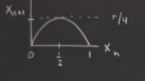

yani ters dönmüş bir parabol şekli, 0 ve 1'den geçiyor. Maksimum noktasının
1/2 noktasında olduğunu hesaplayabiliriz, ve $1/2$ değerini $x_n$'e sokunca
ona tekabül eden dikey eksendeki değerin $r/4$ olduğunu buluruz. 

Bu eşleme genellikle $x_n \in [0,1]$, ve $0 \le r \le 4$ arasında analiz
edilir, eşleme özyineli tabii ki, 0,1 arasında girilen sayılar yine 0,1
arasına götürür bizi, ve döngü devam eder. Bu eşleme bu arada May adlı
bilimcinin *Nature* dergisinde [1] işlediği konuydu. Makalenin
yayınlandığı 1976 senesinde okuyucuların kaos kavramı hakkında bilgisi
yoktu, ana akım bilimcileri konudan habersizdi. Üstteki formül kadar basit
bir şeyi alıp hesap makinasında ardı ardına o özyineli hesabı yapıp ilginç
bir şeyler elde etmek insanlara çok şaşırtıcı gelmişti.

May'in vurguladığı şuydu, "bakın bu formül gayrı-lineer, eşitliğin sağında
bir $x$ var, ve parantez içinde bir başka $x$'i çarpıyor, karesel bir
gayrı-lineerlik var orada'', ve bu basit sistem üzerinden biz eğitmenlere
de bir görev vermeye uğraşıyordu aynı zamanda, "bakın bu kadar basit bir
formülasyon ile ne kadar karmaşık sonuçlar üretebiliyorsunuz'' diyordu. Biz
eğitmenleri uyandırmaya uğraşıyordu, çünkü eğitim sistemi yıllarca
öğrencilere lineerlik öğretir, lineer cebir, Fourier analizi, Laplace
transformları, normal mod'lar, tüm bunlar lineer yaklaşımlardır, ve öyle ya
da böyle doğrusal bileştirme ilkesini (superposition principle)
kullanırlar, ve bu eğitim öğrencilere, bilim hakkında yanlış bir sezgi
kazandırmış olur, çünkü lineer sistemler fazla şey yapamazlar. Ve modele en
basit gayrı-lineerligi eklediğiniz anda, üstteki formüldeki $x^2$ gibi,
müthiş beklenmedik sonuçlar ortaya çıkar. Bu 70'li yıllarda yaygın bir
şekilde bilinmiyordu, May'in söylemeye çalıştığı üstteki gibi örnekleri
derslerimizde kullanarak bu eksikliği gidermemiz gerektiğiydi. [1] yazısını
okumanızı tavsiye ederim, yazıldığından 40 sene sonra bile hala eğlenceli,
ilginç bir makale ve takip etmesi çok zor değil.

Evet, üstteki eşleme basit bir gayri-lineer eşleme. Hatta denebilir ki
olabilecek en basit eşleme, değil mi? Yani, $x^2$'den daha basit hangi
gayrı-lineerlik var? Sistemin ürettiklerine bakalım şimdi, $r$'yi
sabitleyelim, bir başlangıç koşulu $x_0$ seçelim,  çıkanları zaman serisi
olarak gösterelim. İlk hesap,

$$ x_1 =  r x_0 (1-x_0) $$

Sonra $x_1$'i bir sonraki hesap icin kullanabiliriz. 

$$ x_2 = r x_1 (1-x_1) $$

Böyle gider.. Eğer üretilen $x$'leri grafiklesek, diyelim $r=0.5$ için,

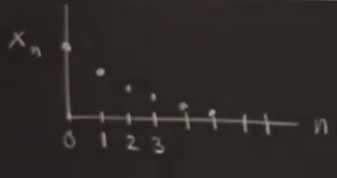

grafiği ortaya çıkar. Önceki derslerde yaptığım gibi gidiş yolları çizmedim
dikkat edersek, çünkü burada zaman ayrıksal, birbirinden apayrı noktalar
var, bazıları bu sebeple bu tür sistemlere "ayrıksal dinamik sistemler''
diyor. Bilgisayarda hesaplayınca $n \to \infty$ iken $x_n \to$ olduğunu
görüyoruz, tüm başlangıç $x_0$ değerleri için bu oluyor.

Eğer $r$'yi arttırırsak, mesela $r=2.8$ yaparsak, daha ilginç bir şey
görürdük,

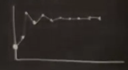

Noktaları birleştirdim, gerçi bu teorik olarak anlamsız çünkü noktalar
arasında ek noktalar yok, neyse genel bir kalıbı görmek için iyi. Bu grafik
daha iniş çıkışlı. Fakat bu durumda $x_n \to x^\ast$, yani bir değere yaklaşım
var, $n\to\infty$ iken $x^\ast$ adını vereceğimiz bir sabit noktaya
yaklaşılıyor, ayrıca $x^\ast$ başlangıç $x_0$'den bağımsız (sıfır ve bir
haricinde, eğer ilk değer sıfır ise hep sıfırda kalınırdı, bir ise sonraki
değer sıfır). Ama onun haricinde başlanılan her $x_0$ değeri sonrasında
sonuşurda $x^\ast$'e yaklaşma var.

Farklı bazı $r$'lere bakarsak, mesela $r=3.3$

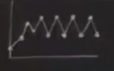

Sürekli bir dalgalanma var. Bir önceki durumda dalgalanma grafiğin
başındaydı, başta denge noktası bayağı aşıldı, sonra ondan aşağı inildi,
nihai olarak yaklaşım oldu ama bir dalgalanma sonrası. Sönümlü bir
dalgalanma oldu yani. Üstteki gibi durumlara periyot 2 dönümlü / çevrimli
deniyor (tutarlılık açısından önceki örneğe periyot 1 denebilir), $x_n$ ve
$x_{n+2}$ birbirine eşit. Burada şimdiye kadar görmediğimiz farklı türden
bir çekici (attractor) sanki. Gerçi ayrıksal zamanlı eşlemeleri (map)
detaylı zaten işlemedik ama burada olanlar sürekli durumdaki limit
çevriminin ayrıksal karşılığı, periyodik bir davranışa yaklaşım var.

$r=3.5$ ile periyot 4 görürdük, 

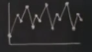

Dikkat edersek 1 periyottan 2'ye oradan 4'e gittik, görünüşe göre periyot
katlanarak artıyor, ki "periyot katlanması (period doubling)'' terimi bu
görülen fenomenin tarif etmek için kullanılır, $r$ arttıkça bu katlanma
görülür, artış belli $r$ noktalarında olur, ve artış devam eder, 2'nin
herhangi bir katına kadar, 2. milyonuncu katında da bir periyodik yörünge
görülecektir. 

Soru

Periyotun ikiye katlanmasının sebebi denklemdeki üstelin iki olması mı? 

Cevap

Dolaylı olarak evet, ama illa üst iki olduğu için ikiye katlanma var
diyemeyiz, sebep eşlenme grafiğinin tepe içermesi, yani tepe şekli veren
diğer eşlenmelerde de katlanma olabilir.

Kendimize sorabiliriz, periyot $2^n$ ile $2^{n+1}$ arasında çatallaşma
hangi noktada, hangi $r$ değerleri için olur? Robert May bu konuyu [1]'de
detaylı olarak araştırdı. $r_n$ stabil $2^n$ çevrimin ilk ortaya çıktığı
nokta olsun. Bilgisayarda görürdük ki

$r_1 = 3$, periyot 2 doğuyor

$r_2 = 3.449..$, periyot 4

$r_3 = 3.54409..$, periyot 8

$r_4 = 3.5644..$, periyot 16

$r_5 = 3.568759..$, periyot 32

Bir kalıp görmeye başladık zannederim, $r$ değerleri bir şeye yaklaşıyor,
3.57 civarında, ve bu doğru, $r$'de yakınsama var. Limit'te 

$r_\infty = 3.569946..$

Bu $r$ değerlerini nasıl buluruz? Bilgisayar kullanarak, $r$'leri yavaş
yavaş arttırırken arttırım öncesi ve sonrası ne olduğuna bakarız. Bu
$r$'lerden bazılarını analitik olarak açıklamak mümkün, mesela bu örnekte
$r_1,r_2$ belki $r_3$. Ama daha yukarıdaki değerler analitik hesap
neredeyse imkansız, sebep polinomları analitik çözebilmek ile alakalı,
5. derece ve üstü polinomları analitik olarak köklerini bulmak mümkün
değil.

Bazılarının aklına şu gelebilir, niye periyot 3, 5, yok, hep 2'nin üstünü
görüyoruz? Cevap bu problemde başka türlü periyotlar da mevcut aslında,
3.56 sonrası 4'e kadar yol var, o aralıkta bir sürü ilginç şeyler oluyor,
hatta en ilginç şeyler o aralıkta oluyor. Bazılarının aklına gelen bu soru,
temel bilimle alakalı bazen, mesela türbülansı anlama bağlamında. Türbülans
çözülmesi en zor bilimsel problemlerden biri bildiğimiz gibi, bilimciler
düşündü ki üstteki gibi bir problem tanımı belki türbülansı anlamak için
yardımcı olabilir, çünkü burada periyot katlanıyor, bir süre sonra herşey
karmaşıklaşıyor, türbülansta da öyle, başta su dümdüz akıyor, su hızını
arttırınca dalgalanmalar görünüyor, başta ritmik / periyotsal. sonra hızı
daha da arttırınca kaos. Bilimciler evet özyineli eşlemeleri türbülans için
kullandı buldukları tam çözümde yardım etti denemez, ama ek bazı anlayış
geliştirmekte faydalı oldu. İlerideki derslerde o bulguları göreceğiz.

Eşlememize ve $r$'lere dönersek, acaba $r$'lerin yakınsama oranı nedir? Bu
soruyu sormak mantıklı mı? Elimizde bir geometrik seri mi var? Ne var?

Yakınsama büyük oranda geometriksel evet, bu 60'li yıllardan beri biliniyor
aslında. Büyük oranda dedim, çünkü seri harfiyen geometrik değil,
sonuşurda, $r_\infty$ yakınında geometrik. Eğer $r$'leri ardı ardına
grafikte göstersem $r_\infty$ yakınında değerler birbirine iyice yaklaşmaya
başlıyor. 


O zaman analiz için birbirini takip eden iki $r$ arasındaki boşluğa bakmak,
ve ardı ardına gelen iki boşluğu karşılaştırmak faydalı olabilir. Acaba bu
iki boşluğun oranı nedir? $n\to\infty$ iken o bölümün bir değere
yaklaştığını görebilirdik,

$$ 
\frac{r_n-r_{n-1}}{r_{n+1}-r_n} \to 4.6692
$$

Kabaca söylemek gerekirse her boşluk bir öncekinden 4-5 kat daha dar. Bu
oran kaos alanında önemli bir sayı haline geldi bu arada, ona $\delta$
diyelim, konunun tarihsel olarak geldiği şu anda pek bir anlamı yoktu,
60'lı yıllarda da öyle düşünüldü, ama sonradan yapılan araştırmalar
sonrasında bu sayı süperstar haline geldi, aynen geometride $\pi$ sayısının
olduğu gibi kaos için bir afiş, sembole dönüştü.

May üstteki sayıyı [1]'e koymadı, o zaman önemli görmedi, ama okulda dersi
öğretirken (ki hikayenin bu kısmı Gleick'in kitabı [2]'den geliyor) benim
gösterdiğim gibi $r$'leri yazmış sonra ders sonunda tahtaya öğrencilere
üzerinde düşünmeleri için şunu yazmış "$r_\infty$ sonrası ne halt
oluyor?''. :) Ben May'i tanıyorum, Avustralyalı, biraz çılgındır,
sporcudur, her türlü oyunu oynamayı sever, tennis, ping-pong. Gerçi ben
teniste ondan daha iyiymişim öyle anlaşıldı [gülüyor]. Bir de
Avustralyalı'lar İngiltere'nin mahkumlarını gönderdiği yermiş, herkesin
atası kanun dışı bir karakter, kendileri değil tabii ama kendilerine öyle
bir bakışları var. İşte May tahtaya böyle bir şey yazmış. O yönde ne May ne
öğrencileri fazla düşünce sarfetmemişler, ama Frank Hoppenstedt adında
başka bir matematiksel biyolog düşündü. Hoppenstedt bilgisayarda bir grafik
çizdi ve bu grafik kaos alanında ikonik figürlerden biri haline geldi.

Grafiği çizmek için $r$'ler ve onların ortaya çıkarttığı çekicileri
gösteriyoruz, y ekseninde $x_n$ değerleri var, ama bu değerler uzun vadede
yaklaşılan değerler. Başta $r=0.5$ tek bir basit çekici, sonra $r=3$'te bir
çekici daha, ondan sonra periyot katlaması, mesela $r=3.3$'te iki nokta
arasında $x_n$ bağlamında gidip geliniyor [hoca aslında iki üstteki 3.5
durumunu tarif ediyor]. En son gelinen dört nokta arasında iki üstteki 3.5
grafiğine göre ziyaret olurdu [sırayı yeşil ile işaretledik].

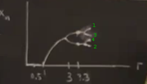

Kabaca bir resim bu tabii, neyse, çatallaşmalar devam ediyor ve
$r_\infty$'da bir limit'e yaklaşıyorlar, orada resim iyice karmaşıklaşıyor,
çatallaşma üstüne çatallaşma.. buralarda fraktalların ortaya çıktığını
hissediyorsunuz. May'in sorusuna dönersek, $r_\infty$ sonrası ne oluyor?
Düşünülebilir ki orada çatallaşma çorbası daha da karmaşık hale gelecek,
ama böyle olmuyor. 

Olanlar karmaşık ve nüanslı bir düzen içinde. Size biraz önce bir yörünge
diyagramı verdim, bu diyagramlar için bir $r$ seçilir, bir program
yazıyormuş gibi düşünelim, bir döngü içindeyiz ve döngüde $r$ değişiyor,
bir $r$ seçiyoruz, dönüyoruz, bunu 10,000 kez yapıyoruz diyelim, baştaki
$r$'leri yok sayıyoruz çünkü orası geçici bir bölge, milyon kere dönsek ilk
1000 taneyi atlıyoruz mesela.. ve takip eden tüm $r$'leri
grafikliyoruz. Bunu yapmayı bitirdiğimizde bu yörünge diyagramını elde
ediyoruz. Diyagramı elle çizmem mümkün değil [altta programla grafikledik],
ama gördüğümüz diyagramın sağ kısmında boş beyaz şeritlerin ortaya
çıktığı.. diğer yerlerde bir sürü karmaşa.. boş beyaz serietler periyodik
pencereler, ve onlara yakında bakarsak aslında içlerinin tamamen boş
olmadığını görüyoruz. Orada da bir şeyler oluyor.  Bu pencerelerden en
genişi periyot 3 penceresi, $r=3.8$ etrafında ortaya çıkıyor. 

```python
import numpy as np
import matplotlib.pyplot as plt

def logistic_func(r,x):
  return r*x*(1-x)

def xnext(r,xo,N):
  no = 0
  X = np.zeros(r.size*N)
  A = np.zeros(r.size*N)
  for r_value in r:
    xinit = xo
    for i in range(200):
      xinit = logistic_func(r_value,xinit)
    X[no] = xinit
    A[no] = r_value
    no += 1
    for j in range(1,N):
      X[no] = logistic_func(r_value,X[no-1])
      A[no]= r_value
      no += 1
  return A, X
  
xo = .4
Num = 71
r_min = 2.899
r_max = 3.999
total_of_r = 1700
r = np.linspace(r_min,r_max,total_of_r)

A, X = xnext(r,xo,Num)

fig, ax = plt.subplots(figsize=(12,8))
ax.plot(A,X,".",markersize=0.1,color="green")
ax.set_xlim(r_min,r_max)
ax.set_ylim(0,1)
ax.set_title(r'Catallasma Diyagrami: $Y_{sonraki} = Y_{onceki}*r*(1-Y_{onceki})$')
ax.set_xlabel('r')
ax.set_ylabel(r'$Y[r,Y_{onceki}]$')

plt.gca().set_aspect('equal', adjustable='box')
plt.savefig('19_08.png')
```


Bu arada periyot 3'ün nerede çıktığını hesaplayabiliyoruz,
$1+2\sqrt{2}$'da.

Eğer periyot 3 penceresine bakarsak orada da çatallaşma diyagramının bir
ufak kopyasını görüyoruz [üstteki diagramda gözükmüyor ama var], bakabilsek
şöyle bir şey görürdük,


ki en sağında onun da periyot 3 boşluğu var, vs. Böyle devam ediyor. Yapı
içinde yapı durumu, ve bu durum sadece periyot 3 penceresi için değil, her
pencere için geçerli. Her pencere içinde o pencerenin içinde olduğu daha
büyük diyagramın bir kopyası var. 

Ayrıca bu örnek üzerinde gördüğümüz pek çok şey lojistik eşlemeye has
değil. İleriki derslerde "evrensellik'' konusunu işleyeceğiz, göreceğiz ki
bu ufak örnek üzerinde gördüklerimiz çok daha geniş eşleme kategorisinin
evrensel özelliği, hatta çok daha geniş dinamik sistemlerin evrensel
özelliği, ki bu sistemlere sadece ayrıksal değil sürekli diferansiyel
denklemler, kısmi diferansiyel denklemler de dahil. Bu evrensellik öyle ki
labaratuar şartlarında yapılan deneylerin vereceği sonuçları tahmin
ediyor. Bu ufak örnek koca bir bilimsel hikayenin başlangıç noktası, ve
kaosun niye bu kadar popüler hale geldiğinin bir diğer sebebi. 

Özellikle üstteki gördüğümüz kavramlar ile deneysel olarak doğrunabilen
tahminlerin yapılabilmesi ilk bulunduğunda hayret verici idi, büyük bir
olaydı, çünkü, yani üstteki ufak modelin temel bilimle hiçbir alakası
yok. Hesap makinasında düğmeye arka arkaya basıyoruz, başka bir şey
yapmıyoruz değil mi? Fakat bakıyoruz ki o basit işlemin sonucu gerçek
dünyada labaratuar şartlarında yapılan basit hesapla alakasız olan deney
sonuçlarını tahmin ediyor. Çok ileri atlamış olmayayım, burada durayım, ama
gidişatımız bu yöne doğru.

Lorenz'den ilham alarak burada kadar anlattıklarımı matematiksel olarak
türetmeye çalışacağım şimdi. O da çetrefil bir sistem kurmuştu sonra onu
matematiksel olarak, elindeki araçlarla analiz etmeye uğraşmıştı. O zaman
elindeki araçlar fazla değildi, bazı basit şeyleri açıklayabildi sadece, o
sebeple yeni araçlar keşfetmesi gerekti. Bu problem için de durum
böyleydi. Önce basit olasılıklarla başlayalım. İlk birkaç $r_n$'i türetmeye
uğraşalım.

$$ x_{n+1} = r x_n (1-x_n) $$

$x^\ast=0$ her $r$ için bir sabit nokta. Stabil mi? $x^\ast=0$ yakınında karesel
terimi yok sayarsak, denklem $x_{n+1} = r x_n$ gibi davranır. Bu formül
üstel büyüyüş demektir, $x_1=rx_0$, $x_2=r^2x_0$, ...$x_n=r^n x_0$  olur, o
zaman $r>1$ ise sıfırdan kaçış olur, $r<1$ ise sıfıra gidiş olur. Demek ki
eğer $r<1$ ise $x^\ast=0$ lineer olarak stabildir. 

Bu noktaya daha önce Lorenz eşlemelerinde sabit noktaların stabilliğini
işlerken gördüğümüz fikri kullanarak ta erişebilirdik, dedik ki
lineerleştirme yapınca $x^\ast$'in stabilitesi $|f'(x^\ast)|$'e bağlıdır, eğer
$|f'| < 1$ ise lineer stabilite vardır. Hatırladık mı? Lorenz eşlemesinde
bu sebeple hiçbir yerde stabilite yoktu çünkü eşlemenin her noktasında
$|f'| > 1$ idi. Bu problem için

$$ f(x) =  r x (1-x) = rx - rx^2$$

$$ f'(x) = r - 2rx$$

$$ f'(0) = r$$

O zaman $x^\ast=-0$ eğer $|r|<1$ ise lineer olarak stabil, $r$'leri hep
pozitif seçtiğimiz için $0 < r <1$ diyebiliriz.

Şimdi ilk çatallaşan sabit noktaya bakalım, bu hesabı basit olan diğer
sabit nokta, basit olmayan sabit nokta $f(x^\ast) = x^\ast$ ile bulunur
(eşlemelerde sabit nokta böyle bulunur, değişimin bittiği yeri bulmuş
oluruz yani), devam edelim,

$$ f(x^\ast) = x^\ast = rx^\ast(1-x^\ast)$$

Ya $x^\ast=0$ (basit) ya da $1=r(1-x^\ast)$ o zaman $x^\ast = 1-\frac{1}{r}$. 

$f'$ hesabı, 

$$ f'(x^\ast) = r-2r \left(1-\frac{1}{r} \right) = 2-r$$

Mutlak değeri ne zaman 1'den küçük?

$$  | 2-r | < 1 <=> 1 < r < 3 $$

İşte bu sebeple 1 ile 3 arasında stabil bir dal var (üç üstteki resim). 

Stabillik kaybolduğu zaman ne olur? Bu aralıkların uç noktalarında
mesela. $r=3$'te ne olur ona bakalım. Gerçi ondan önce grafiksel olarak ne
oluyor buna bakalım, bu lineerizasyon düşünce çizgisinde ilerlemeden önce
grafiklere göz atsak iyi olacak. Ufak bir $r$ için lojistik eşleme grafiği
şuna benzer,


 
Bu grafiklerde 45 derece yatay çizgiyi hep çizmek iyi oluyor, çünkü orada
$x_{n+1} = x_n$, yatay çizgi eğriyi kesiyorsa orada sabit noktalar ortaya
çıktığını gördük. Üstteki durum $r<1$ için, yegane sabit nokta orijinde.

Sıfır yakınındaki dinamik nedir? Daha önce demiştim ki $r<1$ için sıfır
lineer olarak stabildir, ama bu örümcek ağı diyagramına bakınca sıfırın
global olarak stabil olduğunu görüyoruz. Yani hangi $x$'ten başlarsak
başlayalım, yukarı, sola, aşağı, vs. giderek muhakkak sıfıra iniyoruz.

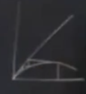
 
$r>1$ olunca grafik şuna benzer,


Peki $r=3$,

$$ f'(x^\ast) = 2-r = -1 $$

Kesişme noktasındaki teğetin eğimi -1. Değil mi? 

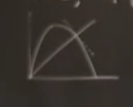

$f'(x^\ast)=-1$'in anlamı budur. Şimdi -1 eğime yakın olan bir yerdeki örümcek
ağı diyagramının neye benzediğini hayal etmeye çalışalım.

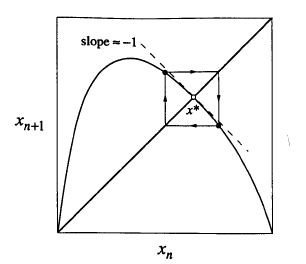

Sabit noktaya yakın bir yerden başlayınca ne olur? -1 eğim olduğu durumda
bir kare etrafında dönüp dururuz. Bu periyot 2 demektir ve karenin sol üst
ve sağ alt köşesindeki noktalar arasında gidip gelmek demektir. O zaman
periyot katlanmanın ortaya çıktığı şartlar nedir sorusunun cevabı yatay
çizginin eğriyi kestiği noktadaki teğetin eğiminin -1 olması cevabı
verilebilir. $f'(x^\ast)=-1$ olduğu zaman yani, ve ortaya çıkan çatallaşmaya
bazıları çevirmeli (flip) çatallaşma olduğunu söyler. Ayrıca -1 değerine
özdeğer ismi de veriliyor, bazen çarpan deniyor, çünkü Lorenz sisteminde de
gördüğümüz gibi sabit noktadan sapmalar $\eta_{n+1} = f'(x^\ast)\eta_n$
formülünü takip eder, bu bir lineer formül, sabit nokta etrafında lineerize
ettik, ve -1 çarpımı o sapmanın bir önceki sapmanın negatifi olduğu
söyler. $r=3$'te bunlar oluyor.

Bu mantığı takip edersek, bir sonraki periyot katlanmasını tahmin etmem
mümkün. $r=3$'te ilk katlanmanın olduğunu gösterdik, ya periyot 4'un nerede
olduğunu bulmak istiyorsak? Ama ondan önce ilk iki sabit noktadan sonra
ortaya çıkan iki dalın formülünü hesaplayabilir miyim? 


Dalın ucundaki iki noktaya $p$ ve $q$ dersem, onların bir özelliğinin ne
olduğunu biliyorum, 

$$ f(p) = q$$

$$ f(q) = p$$

Yani her nokta diğerine eşleniyor. Periyot 2 olmak bu demek. Bu duruma bir
diğer bakış açısı

$$ f(f(p)) = p$$ 

olacak demektir. Lorenz eşlemesini işlerken bu vurguyu yapmıştım, bir
periyot 2 noktası bulun, ki $p,q$ böyle, ve o zaman diyebiliriz ki her
periyot 2 noktası $f(f(..))$ eşlemesinin bir sabit noktası. Yani eğer içiçe
iki $f$'i tek bir fonksiyon / eşleme gibi görürsek, $f^2(p) = p$ olduğu
için o eşlemenin sabit noktası $p$'dir diyebiliriz (aynı şekilde $q$). Bu
bakış açısı daha faydalı çünkü sabit noktaların hesabı çevrimlerin
hesabından daha kolay. Denklemsel olarak 

$$ f(f(p)) = r f(p) \left[ 1- f(p) \right] $$

$$ = r \left( rp (1-p) \right) \left[ 1-rp(1-p)\right] 
\qquad (1)$$

elde ederdim, eşitliğin sağ tarafında $p$'nin 4 kuvveti ortaya çıkıyor, bu
şaşırtıcı değil lojistik denklem karesel, o zaman içiçe iki $f$ üstel 4
olur. 

$f(f(p))$'yi grafikleyebiliriz, 

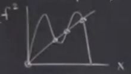

Yatay çizginin grafiği dört noktada kestiğini görüyoruz. Farklı bir $r$
için alttaki gibi bir grafik de elde edebilirdim,


İki üstteki grafikteki orijin hala sabit nokta, çünkü $f(f(0))$ yine sıfır
verecek. Ama bu noktaya tam periyot 2 denemez. Ayrıca dört üstteki kareli
durumda ortaya çıkan iki nokta da periyot 2 gibi gözüküyorlar, gerçek sabit
nokta alttaki, sabit noktanın solundaki $p$ sağındaki $q$. 

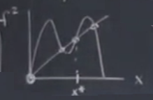

Şimdi cebirsel olarak (1)'i $p$'ye eşitlersem sabit noktayı cebirsel olarak
bulabilirim. Zannedilebilir ki üstel 4 denklemin köklerini bulmam lazım ki
bu kolay değil ama aslında elimizde basitleştirici bazı silahlar var, çünkü
sıfırın bir kök olduğunu biliyorum, ve basit sabit nokta
$x^\ast = 1-\frac{1}{r}$'yi biliyorum. Bu kökleri dışarı çekersem, geri kalan
karesel formüldür, onu çözmek daha kolay.

Bunu yapınca $r_2 = 1+\sqrt{6}$ çıkıyor, ki bu daha önce gördüğümüz
3.449.. sayısı.

Bu $r$ analitik olarak hesaplanabilen son $r$. 

Mandelbrot, Fraktallar

Bu alanda Mandelbrot kümesi bahsini duyariz [3]. Bu tür kümeler bir özyineleme
üzerinden hesaplanır ve bu döngü bir eşleme / fonksiyon olarak görülebilir, bir
onceki bir sonrakini etkiler. Mandelbrot kümeleri en basit baz fonksiyonları
kullanır, mesela $f(x) = x^2 + c$ ki $c$ bir sabit sayıdır.

Kaynaklarda görülen fraktal resimler şöyle üretilir; sabit $c$'nin kompleks sayı
olmasına izin verilir, ve bir $x,y$ kordinatındaki, izgaradaki her $x,y$ farklı
bir sabittir, $c = x + y i$. Tüm bu sabitler üzerinde Mandelbrot özyineli hesabı
ayrı ayrı işletilir. O zaman $x$ ve $y$ için $[-2,+2]$ arasında 5 tane ızgara
değeri olsa, şöyle bir matris ortaya çıkar,

$$
\left[\begin{array}{ccccc}
-2+2i & -1+2i & 2i  & 1+2i & 2+2i \\
-2+i  & -1+i  & i   & 1+i  & 2+i  \\
-2    &  -1   & 0   &  1   &  2   \\
-2-i  & -1-i  & -i  & 1-i  &  2-i \\
-2-2i & -1-2i & -2i & 1-2i &  2-2i  
\end{array}\right]
$$

Bu matrisin her hücresi üzerinde belli sayıda özyineleme yapılır, arada eğer bir
eşik değeri geçildiyse o değer sıfır yapılır, döngü bitince matris bir
Mandelbrot fraktalı ortaya çıkartmıştır.

```python
m = 480
n = 320
 
x = np.linspace(-2, 1, num=m).reshape((1, m))
y = np.linspace(-1, 1, num=n).reshape((n, 1))
C = np.tile(x, (n, 1)) + 1j * np.tile(y, (1, m))
 
Z = np.zeros((n, m), dtype=complex)
M = np.full((n, m), True, dtype=bool)
for i in range(100):
    Z[M] = Z[M] * Z[M] + C[M]
    M[np.abs(Z) > 2] = 0

plt.imshow(M,origin='lower')
plt.savefig("mandel.png")
```


Kaynaklar

[1] May, *Simple mathematical models with very complicated dynamics, Nature*, 1976, Vol 261, pg. 459

[2] Gleick, *Chaos: Making a New Science*

[3] Roelandts, *How to Compute the Mandelbrot Set using NumPy Array Operations*,
    [https://tomroelandts.com/articles/how-to-compute-the-mandelbrot-set-using-numpy-array-operations](https://tomroelandts.com/articles/how-to-compute-the-mandelbrot-set-using-numpy-array-operations)


