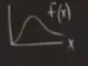
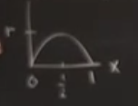
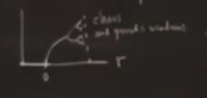
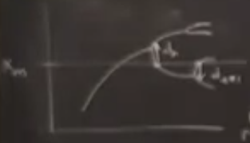

# Ders 20

[Dersin başında [3] hocanın yaptığı demo atlandı, periyot katlanması, lojistik
eşlemeyi gösteren programlar sundu]

Kaosun evrensel mekanizmasına geldik. Bu kısım tüm dersteki en zor
kısımlardan biri olacak, o yüzden zihnimizi açık tutalım, performansı
arttıracak bir düğme varsa ona basalım :) Çok abartmayım tabii, sadece bu
ve takip eden birkaç dersin soyutluk ve zorluk seviyesi diğer bölümlere
nazaran biraz daha yukarıda. Ama bu zorluk çekmeye bence değer çünkü
konumuzun entellektüel kazancı açısından vardığı en yüksek nokta
burası. 

Anlatacaklarım kitabımın 10.6, 10.7 bölümünden, Feigenbaum adlı bilimcinin 1978
yılında yayınlanan araştırmasını [1] merkez alıyoruz. Daha rahat okunan bir
makalesi daha var [2], isteyen onu okuyabilir. Feigenbaum ilginç bir karakter,
hikayesinin anlatmak faydalı olabilir... Ayrıca fotoğrafına bakın, Feigenbaum
film yıldızı gibi bir tiptir, gençliğinde onu konferanslarda gördüğümde en
azından öyleydi. Beethoven'in gençliğine benziyor bir bakıma, karışmış çılgın
bilimci saçları, gözlerde odaklı / zeki bir bakış, vs.. Herneyse, tam bir dahi
goruntusu.. Hikayenin geçtiği sırada Los Alamos labaraturında çalışıyor, Los
Alamos bilindiği gibi tarihte nükleer bomba üzerinde çalışan Manhattan
projesiyle anilir, orada pek cok zeki bilimci calisir, burada bile Feigenbaum'a
herkes en zekilerden olarak bakıliyor. Dusunun!

Fakat Feigenbaum kariyerinin bu noktasında büyük bir problem daha çözmemiş, en
azından yetenekleri çapında büyük bir problem çözmemiş. Onun için rahatsız edici
bir durumda bu herhalde, çok zeki ama daha bilim literatüründe iz bırakmamış.
Gleick'in kitabına göre, Feigenbaum da bu noktada üzerinde çalışabileceği
"büyük'' bir şey aramaya başladı. Türbülans konusu ile ilgileniyordu, daha da
ilgisini çeken genel bir soruydu, "doğada kaos nereden geliyor, sebebi nedir''?
Bu fenomenlerde düzensizliğe sebep olan ana faktörleri merak ediyordu. Niye bazı
şeyler düzenlidir, diğerleri değildir? Bulutlara bakıyordu mesela, burgaçlara
(eddy).. suyun bir delikten akarken oluşan dönüşüyle ilgileniyordu.. Bu
fenomenler onu bir şekilde lojistik haritaları düşünmeye itti, lojistik
haritanın bu fenomenleri daha basit olarak temsil edebilecek bir modelde
kullanabileceğini düşünmeye başladı. LH sistemlerin düzenden düzensizliğe, ve
nihai olarak kaosa varışını basit olarak yakalayabilirdi belki. Derin bir
araştırmaya başladı, daha önce söylediğim gibi lojistik harita 60'lı yıllardan
beri araştırılıyor, ama Feigenbaum LM hakkında çok daha derin bazı sonuçlara
ulaştı. Gerçi bulgularını yayınladıktan sonra uzun süre kimse ne anlattığını
anlamadı.

Feigenbaum pek çok tek-hörgoçlu [devede olduğu gibi] ya da tek-doruklu
(unimodal) haritada periyot katlanmalarına (period doubling) baktı, yani
pürüzsüz durumda tek maksimumu olan şeylere. Mesela $x_{n+1} = r f(x_n)$
böyledir

İlla parabol olması şart değil, tek-doruklu olan herhangi bir başka şekil de
olabilir. Feigenbaum bu haritalarla alakalı $f(x)$'in formundan bağımsız olan
ama genelde geçerli olan çok net niceliksel kanunlar buldu. Bu çok ilginç
aslında, girdimiz ne? Tek doruklu pürüzsüz herhangi bir harita. Bu girdiyi
kullanarak bazı sonuçlara erisebiliyoruz, $f$'e bağımlı olmayan çok net bazı
sayılar üretebiliyoruz. Bu gizemli bir durumdu fakat Feigenbaum bu gizemli
durumu istatistiki fiziğe bağlantılar yaparak açıkladı. Bunu istatistiki
fizikçilerin "evrensel üsteller (üniversal exponents)'' dediği kavramla
bağlantı kurarak yaptı. Bu üstellerin 2. derece faz geçişlerinde ortaya çıktığı
gözlemlenmişti, mıknatıslarda, süpersıvılarda, vs.

Bu istastiki fizikteki bilinen önemli hikayelerden biri; belki hikayeyi
biraz anlatsam şimdi iyi olur, çünkü kısmen bu hikaye Cornell'le [hocanın
okulu] alakalı. Kimya departmanımızda çalışan Ben Wittem var, eski
hocalardan Michael Fisher var, Ken Wilson var ki bu konuyla alakalı bir
buluşla Nobel ödülü kazandı. Hepsi faz geçişleriyle
ilgileniyordu. Deneyciler buldu ki faz geçiş anında çoğunlukla üstel
kanunlar (power law) ortaya çıkıyor, manyetikleşme derecesinde mesela ki bu
derece manyetik alandaki okların ne kadar aynı yönü gösterdiği ölçer, bu
manyetikleşme, $m$ diyelim, ısı $T$ ile ne kadar alakalıdır? Öyle bir
kritik ısı noktası var ki o geçilirse mıknatısa daha fazla verilen ısı
okları bir süre sonra bozar, yönler karmakarışık hale gelir, mıktanış
manyetik özelliğini kaybeder.

Araştırmacıların merak ettiği kritik ısıdan ne kadar uzak olduğumuzun
manyetikleşmeye nasıl etki ettiği. Bulgu manyetikleşmenin $T \sim |T-T_k|^\beta$
şeklinde büyüdüğü, yani kritik noktaya olan uzaklığın bir katına oranlı olarak
(üstel kanun burada). Resimde görülen üstel karekök (yani üstel 1/2) fonksiyonu,
ama başka bir üstel de olabiliyor. Bu $\beta$'ları ölçtü araştırmacılar, ve
ilginç olan kısım, üstte baktığımız mıknatıs, ama başka bir sürece bakıyor
olabilirdik mesela süpersıvılar, ya da başka bir şey, ve belli bazı şartlar
altında tamamen farklı deneylerde aynı $\beta$'nin ortaya çıktığı
görülüyordu. Bu büyük bir şoktu. Bir tarafta klasik bir olay var, diğer tarafta
kuantum mekanik bir olay var, ama aynı $\beta$'yi gösteriyorlar. 

Kritik fenomenler hakkında ders almış olanlar bu bulguyu duymuştur, müthiş büyük
bir haberdi. Bu aynılığın nereden geldiği sonradan keşfedildi, ve keşfi yapanlar
tekrar normalizasyon grubu buluşunu yaptı, Ken Wilson'a Nobel'ini kazandıran bu
işte, pek çok diğer kişinin de o buluşta payı var tabii ki. Feigenbaum tekrar
normalizasyon fikirlerini kullanarak birazdan göreceğimiz gözlemleri yaptı,
fizikçilerin tekrar normalizasyonu kullanarak kritik fiziksel olaylardaki
evrenselliği açıklayabilmesi gibi o da incelediği olaylardaki evrenselliğe
açıklik getirdi.

Bu bağlantı pek çok kişinin dikkatini çekti. Bakıyoruz Nobel ödülü kazandıran
saygı duyulan bir fizik dalında kullanılan teknik, o ana kadar marjinal, köşede
kalmış görülen bir dal Kaos'ta faydalı oluyor. Kaos bu noktada bir alan bile
sayılmazdı, ciddiye alınmayan bir sürü kişinin gezindiği bir alandı. Feigenbaum
daha bilinen birisi değil, Ed Lorenz var meteoroloji alanında hava durumunu
inceliyor herkes ona senin modelin yanlış diyor, hava böyle işlemez. Yani
gerçekten durum böyleydi, Kaos kimsenin ciddiye almadığı böyle kenarda kalmış
bir alandı. 

Önemli bir nokta Feigenbaum'un bulduklarının test edilebilir hesaplar, tahminler
yapabildiğidir. Tabii her kaotik sistemin periyot katlanma senaryosunu takip
ettiğini söylemiyoruz, ama ediyorsa, o zaman Feigenbaum bu sistemler hakkında
çok net tahminler üretebildi, bu tahminler deneylerle doğrulandı ve bu sistemler
daha önce belirttiğimiz gibi kimi kimya kimi fizik gibi doğabilimin çok farklı
alanlarındandı.

Uygulamaları daha da ileri taşıyanlar oldu mesela kalp hücreleri üzerinde, ama
burada veriler ve bakılan sistem pek net değildi, kimisi daha da ileri gitti,
teknikleri borsaya uygulamaya çalışanlar oldu. Bu alanda çok uçuk bazı iddialar
yapanlar oldu, bu arkadaşların çok iyi bilim yaptığı söylenemez, ama daha önce
belirttiğimiz kontrollü (kaotik olsada) sistemlerde çok iyi sonuçlar ortaya
çıktı.

Şimdi evrensel ile ne demek istediğimi anlatmaya çalışayım. Lojistik harita
yerine başka bir haritaya bakalim, mesela $f(x) = r \sin \pi x$ haritası, ki
daha önce olduğu gibi $0 < x < 1$, sinus egrisinin bir bolumu bu, maksimumu
$x=1/2$ noktasindaki $r$. Hatirlarsak lojistik harita icin maksimum $r/4$
noktasindaydi. Eger karsilastirma yapacaksak bu haritayi 4 ile carpip
olceklememiz gerekirdi. 

Herneyse, bunu inceleyebilirsiniz, bu biraz rahatsız edici bir iş olabilir,
baktığımız şey lojistik haritadan çok farklı, $\sin$ fonksiyonunun McLauren
serisinde $x$'in tüm tek sayılı üstelleri vardır.. $x,x^3,x^5,..$ gibi. Bu bir
aşkın (transcendental) fonksiyon yani, öteki taraftaki $x^2$ gibi basit bir
gayrı-lineerlik değil. Fakat eğer bu fonksiyonun yörünge diyagramını çizsek
öteki sistemin yörünge diyagramına benzediğini görürdük.

$r$ fonksiyonu bazlı grafiği çizince benzer bir hikaye göreceğiz, belli bir süre
gidiş sıfır seviyesinde, sonra dallanma, periyot katlanması, sonra o
katlananların katlanması, bu sürekli katlanma devam ederek kaosa
gidiş. Periyodik pencerelerin mevcudiyeti.. Tabii ki önemli olayların olduğu
$r$'ler bu sefer değişik olacak, çünkü farklı bir fonksiyona bakıyoruz.

Bütün bunlar Feigenbaum'dan önce biliniyordu aslında. Periyot katlanıyor,
vs. Feigenbaum'un ilgilendiği ve değişik olan o periyot katlanmasının
detaylarıydı, onun nasıl basamaklama (cascade) halinde devam ettiği, bunun hangi
dinamiklere bağlı olduğuydu. Spesifik $r_n$'ler tabii ki incelenen haritanın
$f(x)$'ine bağlıydı, ya peki aradaki boşlukların oranı? Yani önceki derste
yazdığım $\frac{r_n - r_{n-1}}{r_{n+1} - r_n}$ hesabı.. Kaosa yaklaşırken, yani
$r_\infty$ olurken bu hesaba bakarsak, oranın bir sonlu sayıya yaklaştığını
görürdük. Bu sayının daha önce gördüğümüz $\delta$ ismi verilen aynı sayı 4.6692
olduğunu görürdük. Birazdan Feigenbaum'dan bir paragraf okuyacağım, bu yorum çok
hoşuma gidiyor.. Dediğıim gibi Feigenbaum bu $r_n$'ler ile yakından ilgilendi,
onların bazılarını analitik olarak hesaplayabileceğimizden bahsetmiştik, ama
Feigenbaum onların hepsini analitik olarak hesaplamak istiyordu. Aklına
matematikteki "üreten fonksiyonlar'' kavramını kullanmak geldi. Bu teoriyi önce
hesapsal olarak test edeyim dedi, Los Alamos'ta tabii o zaman bile en iyi
bilgisayarlar, süper bilgisayar vs var, gerçi Feigenbaum bilgisayarda çok usta
sayılmazdı, ama bilimsel hesap makinasını iyi kullanıyordu ki bu aletler o
zamana göre bile oldukca kuvvetli makinalardı [bunu ben de hatırlıyorum, HP
  bilimsel hesap makinaları mesela, programlanabilen makinalardı].  Feigenbaum
hesap makinasını programlayıp bir sonraki $r_n$'nin nerede çıkacağını
hesaplattırdı. İlk hesabıyla üstteki 4.6692 sayısını veren kuralı buldu, ama o
dedi ki bu sayı nereden geliyor? Yani $\pi^2 / 6$'midir, vs? Başka bilinen
nelere bağlıdır yani.. Diyor ki

"Bütün günümü 4.6692 sayısını bildiğim diğer matematiksel sabitlerle
ilişkilendirmekte harcadım ($e$, $2^x$, vs). Bunların hiçbiri sonuç vermedi, tek
elde ettiğim bu sayının artık zihnime kazınmış olması. [Sonra farkettim ki]
benim üreten fonksiyon bazlı teorim $f(x)$'in gayrı-lineerliginin karesel
olduğunu farz ediyor. Bu konuya olan ilgim azalmaya başladı. Ama sonra hesap
makinasıyla $\sin$ bazlı harita için (üstteki) oranı hesaplattırdım, 4.6692
sayısı çıktı (bu sayıyı hemen tanıyor çünkü artık hafızasına kazınmış)".

Bu noktada Feigenbaum bilgisayarları daha iyi öğrenmeye karar verir, ve boşluk
oranını envai türden problem için hesaplamaya başlar, ve aynı sayıyı bu
problemlerde de aynen görür.

Sabiti teorik olarak açıklamaya gelelim. Bu sayı $r$ yönünde bir tür evrensel
ölçeklemeyle alakalı. $x$ yönünde de bir evrensel ölçeklenme durumu var, ki
Feigenbaum onu da keşfetti. Bununla ne demek istiyorum? Periyot pencerelerinde
görülen ağaç kümesi hatırlarsak bazısı dikey yönde daha fazla yer kaplıyor,
kimisi daha az yer kaplıyordu. Feigenbaum bu yer kaplama hakkında bir hesap
yaratmaya uğraştı, o yöndeki ölçeklemeyi bulmaya çalıştı.

Yani üstteki resimde solda olan yüksekliğin sağda ve daha yukarıda olan
yükseklik ile ilişkisi nedir? Ama $x$ yönündeki yüksekliğin o anda grafiğin
hangi noktasında olduğumuz ile de bir ilişkisi var [yani iki ağaççık
arasında bile bu değişim oranlara etki edebilir, bu sebeple bu faktörün
orandan bir şekilde çıkartılması gerekir].

Periyot katlanmalarını gösteren ağacı tekrar çizelim; $x$'de lojistik harita
için 1/2 seviyesinde bir çizgi olduğunu düşünebiliriz. Şimdi oran hesabı için
$x$'leri ölçerken onları $x_m$'den başlayarak ölçüyoruz, $d_n$ diyelim. $x_m$
nereden geldi, bu maksimum, orada eğim sıfır, ayrıca orada her mümkün periyot
için süperstabil noktalar ve çevrimler var, yani ağaç dalları muhakkak bir
noktada $x_m$'i kesmek zorundalar, süperstabilliği ileride daha detaylı
göreceğiz. Devam edelim, bu mesafeyi alıp ve bir sonraki $d_{n+1}$ ile beraber
oran için kullanıyoruz. Feigenbaum'un ilgilendiği $d_n / d_{n+1}$ oranı, ve
bunlara bakınca gördü ki $d_n$ her zaman $d_{n+1}$'den büyük ve her zaman ters
işarete sahip. Ayrıca oran bugün $\alpha$ olarak isimlendirilen -2.5029'a
yakınsıyor, bu sayı sinüs haritası, lojistik haritası, vs. benzer niteliklere
sahip tüm haritalar için tıpatıp aynı. Anlamak istediğimiz $x$ yönündeki bu
ölçekleme faktörü, aynı şekilde yatay yöndeki $\delta$'yi da anlamaya
uğraşacağız.

Kaynaklar

[1] Feigenbaum, *Quantitative universality for a class of nonlinear transformations*, [https://www.researchgate.net/publication/226628603_Quantitative_universality_for_a_class_of_nonlinear_transformations](https://www.researchgate.net/publication/226628603_Quantitative_universality_for_a_class_of_nonlinear_transformations)

[2] Feigenbaum, *Universal Behavior in Nonlinear Systems*, [https://wwwusers.ts.infn.it/~milotti/Feigenbaum_1983.pdf](https://wwwusers.ts.infn.it/~milotti/Feigenbaum_1983.pdf)

[3] Strogatz, *Non-Linear Dynamics and Chaos Lecture 20*, [https://youtu.be/ol6aQcgohxI](https://youtu.be/ol6aQcgohxI)

