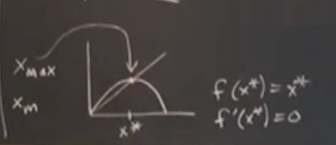
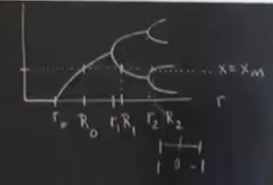
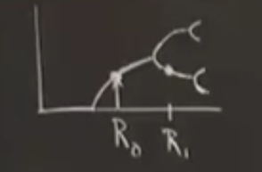
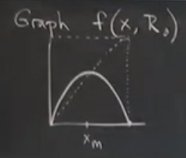
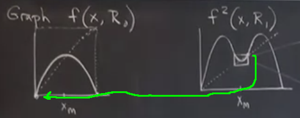
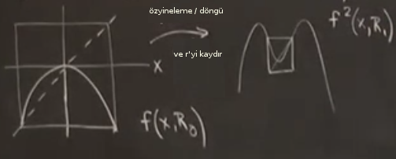
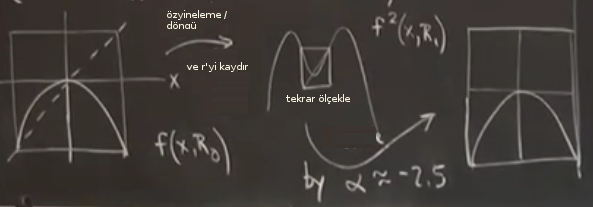

# Ders 21

Şimdiye kadar lojistik haritadan bahsettik, pürüzsüz bir fonksiyon ve tek
maksimumu vardı. Böyle bir fonksiyonu özyineli şekilde çağırınca stabil bir sabit
noktadan stabil periyot 2 durumuna, oradan periyot 4'e geçişler oluyor,
periyotlar katlana katlana gidiyor. Ve bu periyot katlanmaları parametreyi
değiştirdikçe daha hızlı olmaya başlıyor, ve bir kritik parametre değerinden
sonra kaos başlıyor. O noktadan sonra periyotluk ve kaosun içiçe olduğu
pencereler görüyoruz, bir biri bir ötekinin olma durumu daha doğrusu... Şimdi bu
olanların, kaosa varan periyot katlayan geçişlerin evrensel özünü kavramaya
uğraşacağız. Tekrar normalizasyon analizinin bu anlayışı bize sağlamasını
bekliyoruz. 

Bir önceki derste Feigenbaum'un bulduğu iki sabitten bahsetmiştim. Bunlardan
biri 4.6 civarında olan parametre eksenindeki ölçeklemeyi kontrol eden $\delta$,
diğeri -2.5 civarındaki dikey yönde tırmık çatallaşmasının bir tür genişliğini
kontrol eden $\alpha$ parametresi. Bu iki parametrenin nereden geldiğini
anlamaya çalışacağız, ayrıca daha derin soru olan niye bu parametrelerin
evrensel olduğunu anlamaya çalışacağız. Niye aynı niteliksel şekle sahip olan
haritalar aynı niceliksel rakamlara bağlı? Niceliksel bir şey niteliksel bir
şeyden nasıl doğabiliyor?

İlk önce süperstabil sabit nokta ve çevrimlerinin ne olduğunu tanımlamamız
lazım, çünkü Feigenbaum analizini bu kavramları kullanarak yapmış. Bu arada
hatırlarsak bir haritayı $x_{n+1} = f(x_n)$ üzerinden tanımlıyorduk, ve $x^\ast$
sabit noktası $f(x^\ast) = x^\ast$ olan yer idi. Lineer stabilite analizi ile
sapmalara bakmıştık, $x_n = x^\ast + \eta_n$ tanımlamıştık, ki $\eta_n$ çok küçük
bir sayıdır, ve görmüştük ki $\eta_n$ belli bir formüle sahip / formülü takip
ediyor. O sırada lineerizasyona bakıyorduk, yani $\eta_{n+1} = f'(x^\ast) \eta_n +
...$, noktalı yerde yüksek dereceli terimler olacak.. Ve buradan eğer
$|f'(x^\ast)| < 1$  ise $x^\ast$'in lineer olarak stabil olacağına sonucuna
varmıştık. Bu durumda sapmalar üstel hızda çürüyorlardı. Lineer stabilite için
kriterimiz buydu.

Fakat stabilitenin olması daha iyi bir şart $|f'(x^\ast)|$ sadece 1'den küçük
olması değil, sıfıra eşit olmasıdır. Süperstabilite ile demek istediğimiz
budur. Süperstabilite ile söylenmek istenen ise $x^\ast$'e yakınsama üstelden bile
daha hızlı. Ama bu nasıl oluyor, üstelden hızlı yakınsama nasıl oluyor?
$\eta_{n+1} = f'(x^\ast) \eta_n + ...$ ifadesine tekrar bakarsak, eğer $f'(x^\ast)$
sıfır ise formüldeki $f'(x^\ast) \eta_n$ terimi yokolur. O zaman neler olduğunu
anlamak için noktalı kısımdaki yüksek dereceli terimlerin ne yaptığını anlamamız
lazım. Taylor formülünü kullanalım,

$$ \eta_{n+1} =\frac{1}{2!} f''(x^\ast)\eta_n^2 + ... $$

Direk $f''$'a atlandı çünkü ana formüldeki yokolan terim yüzünden. Üstteki
noktalı yerde $\eta$'nin küpsel ve daha yüksek katları olacak.

Üstteki ifadede bir sonraki $\eta$'nin bir önceki $\eta$'nin karesine oranlı
olduğunu görüyoruz. Bu çok, çok hızlı yakınsamaya sebep olur. Bu tür bir
yakınsamayı daha önce irdelememiş olanlarınız için zihinde canlandırma
yapabilmek için şöyle açıklayayım: formüldeki sabitleri vs. yok sayalım, sadece
$\eta_{n+1} = \eta_n^2$ ne yapar onu anlamaya uğraşalım. Bir sayıdan başlayalım,
mesela $\eta_1 = 10^{-1}$. Bir hesap sonrası $\eta_2 = 10^{-2}$ olur, 10 katı bir
çarpım alınmış oldu, yani orijine doğru gidiyoruz $10^{-1} = 1/10$,
$10^{-2}=1/100$ ve şimdi 10 kat daha yakınız. Ama şimdi $\eta_3$ ne olur ona
bakalım, $\eta_3 = 10^{-4}$, yani 10 değil 100 kat daha yakınız. $\eta_4 =
10^{-8}$, 10 bin kat daha yakınız. Gördüğümüz gibi müthiş hızlı bir şekilde
orijine gidiyoruz. Uzun vadede sonuç sıfır olacak tabii. Bu tür bir yakınsamaya
lineer olana kıyasla "karesel yakınsama (quadratic convergence)'' ismi de
veriliyor. Süper hızlı, neyse, süperstabil bir sabit noktanın yakınında bu tür
şeyler olur.

Eğer sayısal metotlar (numerical methods) dersi aldıysanız bu derste Newton'un
Yöntemi, ya da Newton/Rapson Yöntemi diye bir metot öğretildiğini
görebilirdiniz, bu metotla bir denklem sayısal olarak çözülür, ve herkes
Newton'un Yöntemi'nin çok hızlı işlediğini bilir çünkü bu yöntem aranan çözümü
Newton yinelemesi / aramasının bulacağı bir süperstabil sabit noktaya
çevirir. Metotu görenler bir geriye bakıp düşünürse metotun bu söylediğimi
yaptığını anlayacaklardır.

Eğer örümcek ağı diyagramı bazında düşünürsek, sabit noktaları fonksiyon
grafiğinin 45 derece yatay köşegeni kestiği yerde ortaya çıktığını
biliyoruz. Eğer bu kesişimin olduğu yerde grafiğin eğimi sıfır ise

bu bir süperstabil sabit nokta olurdu çünkü orada $f'$ sıfır, bir maksimum var,
ayrıca $f(x^\ast)=x^\ast$ sabit nokta olduğu için. Yani bir kritik nokta, maksimum ya
da minimum, eğer köşegende geçiyorsa, orada süperstabillik var demektir. Kesişme
noktasına $x_m$ diyelim. 

Peki ya çevrimler? Süperstabil bir p-çevrimi nerede ortaya çıkar? $x_m$
noktasının $f$'nin $p$'inci özyineliminin sabit noktası olduğu yerde ortaya
çıkar. Bir p-çevriminin $f^p$'nin sabit noktası olduğunu söylemiştik. Bu
prensibi ta Lorenz haritalarından bahsettiğimiz zamandan biliyoruz. Ya da $x_m$
p-çevrimine dahil olan noktalardan biri. Bir örnek süperstabil bir 2-çevrimi
olabilir, örümcek ağı diyagramı alttaki gibi olabilir,

2-çevrimdeki noktalardan biri maksimum noktası, diğeri başka bir yerde, ve
onların arasında gidip geliniyor. Her periyotta süperstabil çevrimler olabilir
bu arada. Rahat çalışılabilen şeyler onlar, çünkü onları sayısal olarak hızlı
bir şekilde bulmak mümkün. Herhalde Feigenbaum'un onları tercih etmesinin
sebeplerinden biri bu sayısal hesap rahatlığı idi. Mesela periyot katlanmasının
tam nerede olduğuna bakmadı, bu bölgelerde yakınsama yavaş
olacaktı. Süperstabilite yakınsamanın hızlı olduğu yerler.

Şimdi Feigenbaum'un diyagramına tekrar bakarsak, bazıları bu diyagrama
incir ağaçı (fig tree) diagramı diyor, ki bu yörünge diyagramının kaosa
girilmeden önceki bölümü. Göstermek istediğim $r$'nin süperstabil
değerlerinin bu resmin neresinde olduğunu göstermek. Onları bulmak için
haritanın maksimumunun nerede olduğuna bakmak lazım.

Bu çizgi her periyotta dallardan birini mutlaka keser. Çünkü, daha önce
dediğimiz gibi, her periyotta bir süperstabillik var. Devam edelim, $x_m$
çizgisinin haritayı ilk kestiği yere $R_0$ diyoruz. Terminoloji şöyleydi, $r_n$,
stabil $2^n$ çevrim doğuyor, $R_n$ $2^n$ çevrim süperstabil. Yani büyük harfle
$R_n$ bir süperstabil sabit nokta var demek.

Soru

Herhangi bir periyot büyüklüğü için süperstabilliğin olduğu tek bir $r$ noktası
var değil mi?

Cevap

Bu kaosun başladığı ana kadar doğru. Bu noktadan sonra aynı periyotun farklı
pencereleri olabiliyor. Mesela birden fazla 4-periyot penceresi olabiliyor, ya
da 6-periyot, vs. Ama herhangi bir pencere için, evet, orada sadece bir
süperstabil nokta var. Niye? Resimde niye olduğu görülüyor belki. Bir çevrimin
hayatını düşünelim, $f'=1$ olduğu zaman, çoğunlukla teğet bir çatallaşmayla,
doğuyor, biz $r$'yi değiştirdikçe hayatına bir süre devam ediyor, bir yerde
$f'=0$ oluyor, ve "stabil'' hayatının sonunda, periyot katlandığında, $f'=-1$
olacaktır. Yani hayat özdeğer 1'de başlıyor, periyot katlanması -1'de oluyor, ve
arada bir yerlerde özdeğerin 0 oluyor, orada genç zinde olunduğu yer, orada
süper stabiliz, sizin gibi [hoca öğrencileri gösteriyor], ben -1'e doğru
gidiyorum [sınıf gülüyor]. Diyagrama tekrar bakarsak, $r_0$'da doğum (bu nokta
gerçi teğet çatallaşmada doğmuyor ama neyse), $R_0$'da süperstabil oluyor,
$r_1$'da periyot katlanması.. Katlanma noktasından sağa doğru bir gayrı-stabil
dal da var aslında ama onu göstermedik.

Benzer şekilde $R_1$ olarak gösterdiğim yerde süperstabil bir 1-çevrim var,
sonra periyot 4'un ortaya çıktığı yer, oraya $r_2$ dedik, ve $r_2$,
vs. Göstermek istediğim büyük $R$'ler küçük $r$'lerin arasında / ortasında. 

Soru

Maksimum noktasının p-çevrimdeki noktalardan biri olması onu otomatik olarak
süperstsabil yapar mı?

Cevap

Evet. Niye? Bir 2-çevrim üzerinde göstereyim, ki bu argüman tüm çevrimlere
genelleştirilebilir. Diyelim ki 2-çevrime ait olan bir $x$ noktam var. O zaman
$f^2(x) = x$ olacaktır, çünkü $x$ periyot 2 noktası yani $f^2$'nin stabil
noktası. Şimdi sorabiliriz, $x$ $f^2$'nin bir süperstabil noktası mı? Bunu
kontrol etmek için türeve bakmak lazım.

$$ (f^2)' = \frac{d}{\mathrm{d} x} (f(f(x))) = f'(f(x))f'(x)  $$

Süperstabillik şartı $(f^2)'$ sıfır olmalı, ki bu $f'(f(x))f'(x)=0$ demektir,
bunun olması için de çarpanlardan birinin sıfır olması lazım, ya $f'(f(x))$ ya
da $f'(x)$, yani maksimum bu carpanlardan birini ya da otekini sifir yapacak
olan $x$. Bu durumda sifir olmakla maksimum ayni sey cunku tek tepeli
fonksiyonlari inceliyoruz, o sebeple maksimum 2-cevrimlilige sahip olmali.

Daha önce dedik ki $R_n$'ler $r_n$'lerin arasında, yani $r_n$ ve $r_{n+1}$
arasında. Bazılarımız merak edebilir ki grafiktek soldan sağa giderken, kaosa
yaklaşır ve periyot katlanmaları sürekli, daha hızlı, daha hızlı artarken
$R_n$'ler nasıl oluyorda $r_n$'ler arasına düşecek şekilde aynı ölçeklenme
kuralını takip ediyor? Dedik ki $r_n$'ler Feigenbaum'un oranına uygun şekilde
yakınsıyor. Öğreniyoruz ki $R_n$'ler de bu şekilde davranıyor - bu pek şaşırtıcı
değil herhalde - yani ardı ardına gelen $R_n$'ler arasındaki boşlukların
büyüklüğü de geometrik hızda küçülüyor, ve sonuşurda (yani kaosa yaklaşıldığı
durumda, $n \to \infty$), $\delta \approx 4.669..$ oluyor. 

Tekrar normalizasyon fikrinin temeli şudur: üstteki inciri ağacı resmi farklı
ölçeklerde kendine benziyor (self-similar). Fraktallardan kabaca bahsetmiştik,
tam olarak ne olduklarını matematiksel olarak tanımlamamıştık ama şu şekilde
tarif edebiliriz;

Diyelim ki üstteki grafikteki durum var, ve $R_0$ noktasındaki bir
karıncayız. Bir gidişat var ve biraz daha ileri bakınca karınca bir ikiye
ayrılma durumu görüyor. Şimdi o ayrılan dalların birinde $R_1$ noktasında bir
diğer karınca olsun, bu karınca da ileri bakınca benzer bir ayrılma
görecek. $R_0$ ve $R_1$'den görülenler çok farklı değil, ama bir bakıma ikinci
olay daha ufalmış, daha ufak ölçekte oluyor. Yani görüyoruz, birinci dallar daha
büyük, ikinciler daha küçük. Daha net olarak belirtmek gerekirse, $R_0$ ve $R_1$
benzer, ve onları karşılaştırmak mümkün, bunun için bir noktayı diğerine doğru
*tekrar normalize* edebiliriz, yani birinin ölçeğini ayarlayarak öteki ile
karşılaştırılabilir hale getirebiliriz. Bunu daha aciklamaya ugrasayim. 

$f(x,R_0)$ grafiğini çizelim ve onu başka bir grafik ile birazdan
karşılaştıracağız.  $R_0$'da bir süperstabil sabit nokta var demiştik, $R_0$'in
tanımı buydu.

Köşegen çizgi maksimum noktadan geçiyor. Bu grafikte köşegeni kapsayacak şekilde
bir kare çizmek faydalı, üstte görülüyor.

Bu grafiği $R_1$ için olan grafikle karşılaştıralım. Bu grafikler birbirine
benzemelidir, bir farklılık haricinde. Bu farklılık nedir? $R_0$ süperstabil bir
sabit nokta idi. $R_1$ ise periyot 2 özelliğinde bir süperstabil sabit nokta (2
çevrimde süper stabil bir nokta). O zaman uygun karşılaştırma stili nedir? Eğer
$R_0$'da $f$'yi karşılaştırmak istiyorsam $R_1$'de onu ne ile
karşılaştırmalıyım? $f$'mi ... ? Yoksa $f^2$ mi? Bu daha iyi olur değil mi?
Çünkü iki üstteki grafikte sağ üstte görüldüğü gibi bir 2-çevrim var orada, eğer
$f^2$'ye bakarsam $R_1$'in $f$'yi kestiği nokta bir süperstabil sabit noktadır,
$f^2$ için tabii. O zaman karşılaştırma yapılacak şey $f$ değil $f^2$, daha
doğrusu $f^2(x,R_1)$. Burada anahtar nokta $x_m$'in her iki harita için de
süperstabil bir sabit nokta olması.

Şimdi $f^2(x,R_1)$ grafikleyelim. Hatırlarsak bu fonksiyonun iki tepeli bir
şekli vardı, ve maksimum noktası 2-çevrimdeki noktalardan biriydi, bunun anlamı
şudur, bu grafikte de köşegeni çizince o köşegen aynı şekilde $x_m$'den
geçmeli. 

Bu grafikte sağdaki grafiğin küçük kutunun sağ üst noktası soldaki grafiğin
orijindeki noktasına tekabül eder, ve sağdaki küçük kare soldaki büyük kareye
tekabül eder. Ve eğer sadece bu iki kutunun içinde olanlara bakarsak, mesela
küçük kutu içindeki eğriye bakalım, görüntüyü büyütelim,

göreceğimiz eğri bize üstteki sol grafikteki eğriyi çağrıştırmalı, sadece ters
halde ve daha küçük tabii. Yani $f^2(x,R_1)$ ile $f(x,R_0)$ aynı yerel
dinamiklere sahip sadece daha küçültülmüş ve ters çevrilmiş halde. Burada aynı
yerel dinamiklere sahip derken mesela her iki kutu içindeki bölgelerde örümcek
ağı diyagramı çizsen aynı şekilde davranacaklarını görürdüm. Bir sonraki fikre
ilham veren sezgisel anlayış bu.

Bu arada üstte anlattığımız gayet gevşek, hafif belirsiz bir fikrin bir hesabın
temeli olabileceği inanılmaz geliyor, çünkü bir anlamda çocukça bir gözlem gibi
sanki, fakat mesela Güney Amerika kıtasının doğu tarafının Afrika kıtasının batı
tarafına uyduğu gözlemi de böyle bir çocukça bir gözlemdi, fakat bu gözlemin çok
önemli olduğu ortaya çıktı, çünkü bu gözlem kıtaların tek kitadan geldiği,
bazılarının diğerlerinden ayrılarak parçaların başka yerlere sürüklendiği
(continential drift) teorisine önemli bir destek sağladı. O zaman da bazıları
dedi ki "olur mu yahu, şaka gibi bir şey'', vs. Fakat o küçük kutudaki
ölçeklenmiş ters duran eğri hakikaten o büyük olanla aynı. Periyot katlanmaları
ardından gelen kaosun başlangıcını anlamaktaki çok derin bir gözlem bu.

Şimdi resimler yerine cebirsel olarak süreci tarif edelim, küçülme ve terse
dönme ile ne demek istediğimi daha net şekilde anlatayım. Resme bakarsak herşey
maksimum $x_m$ etrafında şekilleniyor, bu biraz rahatımızı bozan bir şey,
maksimum alıp orijine kaydırırsam isim daha rahatlaşabilir, cebir daha temiz
hale gelir. Esas ilgilendiğimiz aslında köşegendeki kutunun sağ üstündeki nokta,
onu hem yatay hem de dikey eksenlerde kaydırak istiyoruz. Bu arada dikey eksen
$y$ tam $y$ değil, o sadece bir sonraki $x$, o sebeple $x_m$'i çıkartınca onu
hem şu andaki $x$ hem de gelecekteki $x$'ten çıkarmamız gerekiyor. Yani $x_m$'i
$x$ ve $f$'den çıkartıyoruz. Önce $x_m$ sonra $f$ hesabı, ardından $r$
çıkartımı. Bu iki çıkartmayı yapınca alt sağdaki resmi elde ederiz,

Şimdi üstteki sağdaki grafiği $\alpha$ diyeceğimiz bir tek sayı ile
ölçekliyoruz, $\alpha \approx -2.5$. Bu bize baştaki (üst soldaki) resmin
aynısını veriyor.

Bunu formüllere çevirelim şimdi. Resme göre

$$ f(x, R_0) \approx \alpha f^2(\frac{x}{\alpha}, R_1) 
\qquad (2)$$

Yani $\alpha$'lar hem yatay hem dikey ölçeklenmeyi hallediyorlar. 

Formülü uyguladık, aynı şekli elde ettik. Peki üst sağdaki sonuca (resim,
formül) aynı formülü bir daha uygularsak ne olur? Hala aynı şeyi elde etmem
lazım değil mi? Yani,

$$  \approx \alpha^2 f^4(\frac{x}{\alpha^2}, R_2) $$

Formülü ardı ardına uygulayabiliyoruz, genel formül olarak 

$$  \approx \alpha^{n} f^{2^n}(\frac{x}{\alpha^{n}}, R_n) $$

Sözel olarak "N kere tekrar normalize ettiğimizi'' söylüyoruz.

Bu arada eğer tarif edilenlerin biraz soyutlaşmaya başladığını düşünüyorsanız,
tüm bunların çok basit hesapsal karşılığının olduğunu unutmayalım. Mesela bir
lojistik haritayı alıyorum, ki bu $f$, bir karesel harita fonksiyonu, $R_0$'in
ne olduğunu biliyoruz / onu hesaplayabiliyoruz çünkü nerede süperstabillik varsa
orası, $1+\sqrt{5}$ galiba [bunu ödev olarak vermiştim değil mi diyor soruyor
  öğrencilere, cevap evet]. Bu değerleri $f$'ye geçiyoruz, bir sonraki değer
geliyor, orada $f^2$ için aynı şekilde $R_1$ bulunur, $\alpha$ vs ile onu
hesaplarız. Her iki fonksiyonun üstüste olduğunu görürüz. Öyle mistik bir
işlemden bahsetmiyoruz. Hesap çizelgesinde (spreadsheet) ile bile
gösterilebilir.

Feigenbaum'un üstteki hesabın limitine baktı, yani

$$ 
\lim_{n \to \infty}  \alpha^n f^{2^n}(\frac{x}{\alpha^{n}}, R_n) = g_0(x) 
\qquad (1)
$$

Ve bu limitin yakınsadığını gördü, yani limit mevcuttu. Yakınsama $g_0(x)$ diye
tanımladığı bir nesneydi.  Peki bu nesne neydi? İşte az önce gördüğümüz ters
paraboldu, diğerlerinde olduğu gibi süperstabil bir sabit noktası olan bir
fonksiyondu. Bu süperstabil bir sabit noktası olan evrensel bir fonksiyondu. Ama
dikkat, bu durum eğer $\alpha$ doğru seçilirse ortaya çıkıyordu, yani her
$\alpha$ için üstteki ardı ardına, bir sonraki noktanın özyineli hesaplanması
yakınsama yaratmıyor. Spesifik olarak $\alpha = -2.5029..$ olmalı, incir ağaçı
grafiğinde görülebilecek bir durum.

Evrensel derken limit fonksiyonunun başlangıç fonksiyonünden neredeyse tam
bağımsız olmasından bahsediyorum. $f$ ile başladık, ki ona lojistik fonksiyon
dedik, ama illa böyle olması gerekmiyordu. Tek hörgoçlu pürüzsüz maksimumu olan
başka bir fonksiyon da olabilirdi. Mesela sinüs haritası ile başlayabilirdim,
üstteki özyineli çağrıları yapabilirdim, aynı $\alpha$ ortaya çıkar, ve yine
aynı limit fonksiyonu $g_0$ ortaya çıkar.

Bu olasılık teorisi dersi almış olanlarınıza Merkezi Limit Teorisi'ni
hatırlatıyor olabilir. Bu teoride bilindiği gibi rasgele değişkenler birbiriyle
ardı ardına toplanır, ve ortaya çıkan dağılıma bakılır. Eğer başlangıçtaki
rasgele değişkenlerin sonlu ortalama ve varyansı var ise, ve belli bazı
şartlarda ve cebirsel durumda ortaya çıkan limitteki dağılım [fonksiyonu] her
zaman Gaussian [Normal] dağılımdır. Bu durum başlangıçtaki rasgele değişkenlerin
dağılımı ne olursa olsun aynıdır, Bernoulli, Birörnek (Üniform), vs. Bu tür
argümanın ilk örneklerinden biri MLT'dir herhalde.

Bu arada MLT'yi tekrar normalizasyon ile ispat etmek mümkün. İstatistikçiler,
olasılık teorisyenleri çoğunlukla bu yöntemi takip etmez ama MLT üstte gördüğümü
türden tekrar normalizasyon prosedürünün bir özel durumudur.

Soru

$\alpha$'yi doğru seçmekten bahsettiniz, bu seçim $f$'den bağımsız mı yapılıyor?

Cevap

Şimdilik söyleyeceğim $\alpha$ sayısal olarak seçiliyor, ve süreci yakınsamaya
götürecek şekilde seçiliyor. Sonradan $\alpha$'yi analitik olarak ve evrensel
bir fonksiyonu baz alarak hesaplayan bir formül göstereceğim; biraz sabır,
herşey birbiriyle ilginç bir şekilde bağlanıyor. Şu anda $\alpha$'nin ne
olduğunu bilmiyoruz.

Soru

Bu $\alpha$ niye ilk başta bahsedilen $\alpha$ ile aynı?

Cevap

Aynı $\alpha$ tabii, doğru. Niye? Öyle olması lazım, düşünelim, özyineli şekilde
çağrı yapıyoruz, $R_n$ ile kaydırıyoruz, burada yaptığımız incir ağaçında ileri
doğru adım atmak. $R_0$'da başladık, $R_1$'e geldik, vs. Bu şekilde sağa doğru,
kaosa doğru adım adım ilerliyoruz, ve ilk başta $\alpha$'yi nasıl
tanımladığımızı hatırlayalım, bu parametre dallanmayı, maksimuma yaklaştığımızda
$x$ bağlamında ölçeklenmeyi kontrol ediyordu. O zaman en son yaptığımız
özyinelemeye dönelim şimdi, hep maksimuma yakın yere bakıyoruz, ilk resimde tepe
noktası, ikincide pencere içi alt nokta, pencere dışı sol tepe ya da sağ tepeye
bakmadım. İşte incir ağaçı ölçeklemesinden bahsederken yaptığım işin aynısını
yapıyorum, maksimum noktanın ve etrafının bakış açısından olanlara
bakıyorum. Pencereler de zaten $x$ bağlamında ölçeklenmeyi kontrol ediyorlar.

Soru

$\alpha$ köşegen çizginin eğriyi kesmesiyle ortaya çıkmıyor mu / o yer değil mi?

Cevap

Tabii doğru, çünkü bu kesişme kutunun büyüklüğünü kontrol ediyor. Evet, o
şekilde bakabilirsiniz. Limite giderken işleyecek doğru bir $\alpha$ seçmek
lazım.. ilk birkaç özyinelemede o kutuların büyüklüğüne bakarak $\alpha$'nin
yaklaşık büyüklüğünü tartabilirsiniz.. Evet. Sonuşurda ise arda arda gelen
kutuların büyüklüğünün oranlarına bakıyoruz aslında.. Evet. Güzel gözlem.

Şimdi ilerleyelim. Daha işin başındayız, ısınıyoruz sadece!
[Gülüyor]. Şimdiye kadar yaptığımız neydi? Süperstabil sabit nokta olarak
evrensel bir fonksiyonumuz var, ama hala onun neye benzediğini bilmiyoruz,
kabaca ters dönmüş bir parabola benziyor dedik, ama hikayenin tamamı daha
çetrefil, çünkü o görüntü yerel bağlamda, maksimumun yakınında geçerli
sadece. Eğer daha uzak noktalarda neye benzediğini bulmak istiyorsak daha
derin düşünmemiz lazım. Diğer yandan şimdiye kadar süperstabil sabit
noktalara sabitlendik, kafiyeli olsun diye söylemiyorum tabii, yanlış
anlaşılmasın [öğrenciler gülüyor]. Ama süperstabil sabit noktalar konusunu
geri bırakıp diğer nesneler hakkında konuşmaya başlamadan önce, süperstabil
2-çevrim, vs gibi, bir konuyu fark etmemiz iyi olur; [bir üstteki]
geliştirdiğimiz bu resim bize evrenselliğin nereden geldiği hakkında güzel
bir sezgi kazandırdı, sezgi şu soruyla alakalı: sonuç niye $f$'den
bağımsız?  Neredeyse tamamen bağımsız demek daha doğru tabii, çünkü kesin
bağımsızlık yok, niye böyle olduğunu birazdan göreceğiz, ama evrenselliğin
nereden geldiğini şimdi daha iyi görebileceğiz.

Limit fonksiyon neye bağlıdır? Bu bizi cevaba götürüyor; limit fonksiyonu
$g_0(x)$ evrenseldir, çünkü davranışı başlangıç maksimum $x_m$ yakınındaki
fonksiyon $f$'e bağlıdır. Niye böyle söyledim? Neler olduğunu düşünelim
şimdi. Üstteki resim soldaki figure bakarsak onun maksimuna bakarak
başladık (ki bu noktayı orijine tercüme etmiştik hatırlarsak), ardından bir
özyineleme yaptık, ortadaki figürdeki daha ufak kutuyu elde ettik, devam
ettik, hala bir önceki maksimumun olduğu noktaya odaklanıyoruz, ve
$n \to \infty$ iken limiti alınca, belki (1) formülüne bakarak bunu daha
iyi anlarız, $\frac{x}{\alpha^{n}}$ kısmına odaklanırsak, $n$ büyürken ne
olacaktır?  Yaptığımız sanki bir mikroskop alıp $x=0$'a yakın yerleri
büyüterek oraya bakmaktır değil mi? Orada ardı ardına daha ufak, daha ufak
kutular yaratıyoruz, ki buraları maksimumun yeni versiyonları.

Yani yerel davranışa odaklanıyoruz ve bunu sonsuz küçük bir bölgede,
maksimumun yakınında yapıyoruz, bunu $\frac{x}{\alpha^{n}}$ özyinelemeyi
işleterek başarıyoruz. O zaman düşünürsek hesapsal olarak bizim tek
ilgilendiğimiz ilk resimdeki orijin etrafında ufak bir bölgede
olanlar. $f$'in daha uzak yerlerde yaptığı hakkında tüm bilgiyi
kaybediyoruz, $\frac{x}{\alpha^{n}}$ operasyonu sebebiyle sadece maksimum
ve onun çok yakınındaki bölgeyi görüyoruz. Bu bize bir şeyler söylüyor
aslında, söylediği maksimumun kendisinin doğasının önemli olduğu, diğer
hiçbir şeyin önemi yok. Doğası derken mesela maksimum karesel mi? Yani
oraya bir Taylor serisi koysam bu seride karesel bir terim olacak mıdır?
Bu, maksimumun mesela 4. derece bir polinomun olduğu bir durumdan
niceliksel olarak çok farklı olurdu. Ya da keskin kenarlara sahip olacak
bir mutlak değer fonksiyonunun olacağı bir durumdan... Bu tür farklar
üstteki metotla yakalanabilecek şeyler, fizikçiler maksimumda neler
olduğuna bağlı olarak olabilecek bu değişik durumları "farklı evrensellik
sınıfları'' altında inceliyorlar.

Olan şu, $f$'nin global nitelikleri bu analizde yokoluyor, tek ayakta kalan
maksimumun derecesi. Yani daha önce $f$'den bağımsız dediğimde söylemek
istediğim "karesel maksimumu olan $f$ ailesi içinde''. Yani mesela 4. derece
bir $f$ için farklı bir $g_0(x)$ vardır, 6. derece için farklı, vs. Genelde olan
elde bir karesel maksimumun olması, ve bizim ele aldığımız durum
bu. Feignbaum'un analizinin geri kalanı ile devam edelim; şimdiye kadar
süperstabil sabit noktalardan bahsettik. Ya elimizde süperstabil bir 2-çevrim
olsaydı? O zaman farklı evrensel fonksiyonlar elde edebilirdik.

Tüm bunlar bir zirveye doğru gidiyor bu arada, merak etmeyin.

Neyse diğer evrensel fonksiyonları elde etmek için, ki onlara $g_0(x)$ yerine
$g_i(x)$ diyelim, $f(x,R_i)$ ile başlarız (daha önce $f(x,R_0)$ ile
başlamıştık), yani süperstabil $2^i$-çevrime sahip olan bir $f$ ile başlıyoruz. 
Bu noktadan sonra süperstabil $2^i$-çevrime sahip fonksiyonların
dünyasındayız, ve daha önce işlettiğimiz süreci tekrarlıyoruz, limitleyen
fonksiyon $g_i(x)$'i bulmaya uğraşıyoruz, 

$$ 
g_i(x) = \lim_{n \to \infty} \alpha^n f^{2^n} (\frac{x}{\alpha^n}, R_{n+i})
$$

Fakat bu $i$'lerin içinde öyle bir tanesi var ki ötekilerinden daha
iyi. Bunu şöyle düşünebiliriz, incir ağacı içinde ilerliyoruz, süperstabil
noktada dallanma, süperstabil 2-çevrimde tekrar dallanma, 4-çevrim,
vs.. Burada odaklanabileceğimiz gayet doğal bir $i$ seçimi olduğunu
görebiliyor muyuz? Bakmak istediğim kaosun başlayacağı yer.. o zaman $ı =
\infty$'a bakmam gerekir. Bazilariniz diyebilir ki "ama $\infty$,
yani sonsuzluk bir sayı değil''. Ama bunun ne kadar iyi işlediğini görmemiz
gerekir..  (2) formülüne bakalım mesela, ikinci döngü / kat almadan sonra
$\alpha$ ile ölçekleyere tekrar normalizasyon yaptığımda, $R$'yi de
arttırmam gerekiyor. Değil mi? $R_0$'dan $R_1$'e, oradan $R_2$'ye,
vs.. Sonsuzluğun güzel tarafı sonsuzluk + 1 hala sonsuzluk. Orada $R$
kaydırma yapılmasına gerek yok. Eğer $R_\infty$ üzerinde isem bir sonraki döngü
beni yine $R_\infty$'a getirir. Evet biliyorum çılgınca ve havalı bir şey
[gülüşmeler].

O zaman $R_\infty$'da olduğumüz durumu daha yakından inceleyelim. Süperstabil
$2^i$-çevrimin olduğu durum yerine süperstabil $2^\infty$-çevrimin olduğu
duruma bakalım, ki bu an tam kaosun başladığı nokta. En iyi ve en ilginç olan
örnek bu, $R = R\infty$ olduğu durum. Bu durumda

$$
f(x,R_\infty) \approx \alpha f^2(\frac{x}{\alpha}, R_\infty)
$$

olacaktır çünkü $R$'nin kaydırılması gerekmiyor, yaklaşık eşitliğin sağında ve
solunda $R$ indisi aynı (sonsuzluk). Bu noktada ne olduğuna daha yakından
bakabiliriz artık, sonuçta kaosun çıkış ani, o ana giderken olanlar bizi
ilgilendiren kavramlar.

Tekrar normalizasyon işlemini döngüde ardı ardına işletince ne olur? $g_i$
yerine $g_\infty$ gibi bir nesne elde ederiz. Gerçi buna çoğunlukla $g_\infty$
denmez, $g_\infty$'in limitleyen fonksiyonuna $g(x)$ denir, ve şu denklemi
tatmin eder, $g(x)$ ile başlayıp tekrar normalizasyonu uygulayınca,

$$
g(x) = \alpha g^2(\frac{x}{\alpha})
$$

elde edilir (alt indis değerini vermedim çünkü $R_\infty$'da olduğunu
biliyorum). Bu denklem doğrudur - bu fonksiyon tekrar normalizasyonu
kendisidir, $R$'yi kaydırmadık.

Feigenbaum'un bulduğu üstteki formüle "fonksiyonel denklem (functional
equation)'' adı veriliyor. Bu tür denklemleri derslerde daha önce görmemiş
olabilirsiniz, lineer denklemleri gördünüz, cebirsel denklemleri gördünüz,
lineer diferansiyel denklemler, belki entegral denklemleri bile gördünüz, ama
fonksiyonel büyük bir ihtimalle hayır. Fonksiyonel denklemler bir fonksiyonu
yine kendisini kullanarak temsil eder, üstteki durumda ikinci döngüdeki hali
üzerinden ama bağlantı fonksiyonun üzerindeki farklı bir işlem üzerinden de
olabilirdi. 

İşte $g$'nin fonksiyonel denklemi bu, denklemdek $\alpha$ var bu değer bir
anlamda, tam anlamıyla olmasa da, bir özdeğer görevini görüyor sanki. 

Üstteki tanıma ek olarak bazı sınır şartları tanımlamamız gerekiyor, üstteki
tanım $g$'nin nihai tanımı için yeterli değil. Eğer $g$'yi yerel bağlamda
zihnimizde canlandırmak istiyorsak onu $R_\infty$'da tanımlı lojistik harita
olara düşünebiliriz. Kabaca spesifik bir $R$ değerindeki su

resme benziyor. Yerel olarak $g$ böyle, ama hatırlarsak $x$ eksenini öyle seçtik
ki maksimum sıfır noktasında, o zaman bir sınır, ya da yan şart tanımlamalıyız
öyle ki $g'(0)=0$, yani maksimumda eğim sıfır (maksimumu orijinde olacak şekilde
daha önce kaydırmış olduğumuzu farzederek). Ayrıca $g$'nin karesel maksimumu
olduğunu şart koymak / zorlamak istiyoruz, yani 4. vs. derece değil, karesel, o
zaman üstteki fonksiyonelin çözümünü bulmak için karesel aile içinde arama
yapacağız. 

Bu arada formülleri biraz temizlemek için bir ölçek dahil etmek mümkün, yani
mesela baktığımız birim santimetre mi.. kulağa acaip geliyor ama demek
istediğim, üstteki resimdeki tepe noktası ile yatay eksen arasındaki yükseklik
nedir? O sayı ne anlama geliyor? O sayıyı genelleme kabiliyetini kaybetmeden
[ölçekleme ile] 1 yapabilirim. Bu nasıl oluyor? Çünkü eğer $g(x)$ tüm yan
şartları tatmin ediyor hem de fonksiyonel denkleme çözüm sağlıyor ise, herhangi
bir $\mu$ için $\mu g(\frac{x}{\mu})$ da bir çözümdür, yerine geçirerek kontrol
edebilirsiniz. $\mu$ için bir sayı seçin, ve bakın. Bunun yaptığı $\mu$ kadar
$x$'in ölçeğini değiştirmek. O yüzden dedim ki genellikte kayıp olmadan onu öyle
seçebiliriz ki ölçek 1'e eşit olur. 

Neyse, işte elde bazı şartlar var, şimdi fonksiyonel denklemi çözmek istiyorum,
ama bunu nasıl yapacağımızı bilmiyoruz şu anda.. Üniversitelerde fonksiyonel
denklem çözmeyi öğreten dersler öğretilmiyor, biraz bir egzotik konu bu, çok
fazla ortaya çıkan bir şey değil. Onlar hakkında doğru dürüst kitap bile bulmak
zordur. Feigenbaum'da becerikli bir bilimcinin yapacağını yaptı, onu güç
serileri ile çözmeye uğraştı. Öyle değil mi, başka hiçbir şey işlemeyince güç
serisini pat diye koyarız oraya, ve ise koyuluruz. Şunu denkleme sokarız,

$$
g(x) = 1 + c_2 x^2 + c_4 x^4 + ... 
\qquad (3)
$$

Seri 1 ile başlıyor çünkü $g(0)=1$ olduğunu biliyoruz. Tüm bu şeyler [döngüler
  sonucunda ortaya çıkan fonksiyonlardan bahsediyor] tersine dönmüş parabola
benziyorlar, onların çift olacağını göstermek bile mümkün olabilir zannediyorum,
o sebeple üstte çift üstel dereceler kullandım. Yakınsayan güç serisi olan
analitik bir fonksiyon kurmaya uğraştım yani, ki bununla $g$'yi temsil
edebileceğimi tahmin ettim. Şimdi üstteki fonsiyonu $g$ yerine koyabilirim,
açılımı yaptıktan sonra $x$'in belli derecelerdeki katsayılarını gruplamaya
uğraşırım, vs. Bunu yaptıktan sonra Feigenbaum $c_2 = -1.527...$, $c_4 =
0.1048..$ buldu.

Burada dikkatimizi çeken bir şey var mı? Eğer $x=0$ yerine koysak bu bize ilginç
bir bilgi kazandırır mı? Kazandırır değil mi?

Pardon sıramı karıştırdım biraz.. $c$ değerlerinden önce $\alpha$'yi bulmam
lazım. Yan şartları tanımladıktan sonra $g(0)$ nedir? Ölçeklemeyi öyle seçeriz
ki $g(0)=1$ yapabiliriz dedik. 

$$ g(0) = 1 = \alpha g(g(0))$$

Ama foknsiyonel dekleme göre $g(0)$ aynı zamanda üstteki eşitliğin en sağ
tarafına da eşit olmalı. Şimdi $g(0)=1$'i eşitliğin en sağınde yerine koyalım,

$$ g(0) = 1 = \alpha g(1)$$

Bu bana ne söylüyor? $\alpha$'yi $g$'ler üzerinden temsil etmemi sağlayacak bir
formüle erişmedim mi? Tekrar düzenlersek,

$$ \alpha = \frac{1}{g(1)}$$

Vay canına. Ortaya çıktı ki $\alpha$ ve $g$ birbirinden bağımsız
değil. $\alpha$, $g$'ye, o ana fonksiyona bağımlı. Vay vay.. şimdi geriye
dönelim, (3)'te tanımlı $g$'yi yerine koyabiliriz şimdi, ve bir üstteki
tutarlılık şartını da kullanınca, tüm bunlarla Feigenbaum'un bulduğu $c_2$,
$c_4$ sayılarına erişmek mümkün. Ve en son olarak $x=1$'i (3) içine koyunca ve
bir üstteki şartla beraber $\alpha$'yi hesaplamak mümkün, işte bu hesaptan
$\alpha = -2.50..$ gelecek. 

Tekrar düzenleme argümanının başlangıcı burası. Daha işimiz bitmedi, çünkü eksik
olan birşey hala var. Şimdiye kadar açıkladığımız periyot katlanmasında niye
evrensellik olduğu, $g$'yi hesapladık, $\alpha$'yi hesapladık, ama hala
$\delta$'yi hesaplamadık, hatırlarsak $4.66..$ diye giden sayı. Nerede bu
$\delta$? Şimdiye kadar kurduğumuz formüllerin hiçbirinde mevcut değildi. Bir
sonraki derste işte bu $\delta$'yi bulacağız, bu tekrar normalizasyon
argümanının son noktasını koyacak.

