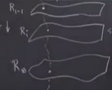
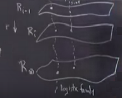
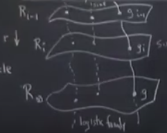
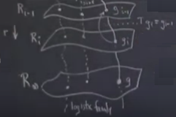
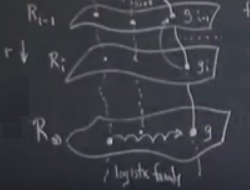
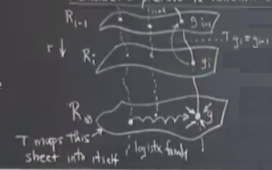
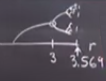

# Ders 22

En son derste evrensel fonksiyonlar $g_i(x)$'den bahsettik, bu fonksiyonların
hatırlarsak süperstabil $2^i$-çevrimleri vardı. Ardından $g_i(x)$'lerin en
babası $g_\infty(x)$ denebilecek bir fonksiyonun nasıl bulunacağından bahsettik,
ki bu kaos olmaya başladığında ortaya çıkacak evrensel fonksiyondu. İsimsel
olarak ona kimsenin $g_\infty$ kullanmadığını, basit bir şekilde $g$ dediğini de
söyledik ve bu fonksiyon yan şartları da olan "fonksiyonel denklem'' dediğimiz
bir şeyi tatmin ediyordu. Ayrıca sabit $\alpha$'yi nasıl bulacağımızı gördük, bu
sabit haritanın maksimumu yakınında $x$ yönündeki ölçeklemeyi kontrol ediyordu.

Ama hala bir gizemi çözümsüz bıraktık - parametre eksenindeki ölçeklenmeyi
kontrol eden sihirli sayı $\delta$ nerede? Bugün işlemek istediğim konu bu. Bu
ders herhalde tüm diğer dersler içinde en zoru; tekrar normalizasyon en zor konu
demiştim, bu alt-konu tekrar normalizasyondaki en zor konu, yani zor'un zoru!
Sebep $\delta$'yi bulmak için oldukca soyut kavramlara giriş yapma
zorunluluğumuz. Alışılagelmiş reel sayıların olduğu bir uzayda iş yapmak yerine
*fonksiyonlardan* oluşmuş bir uzayda iş yapmamız gerekecek. Bu uzay sonsuz
boyutlu bir uzay, pek çok insan diyor ki (!) üçten fazla boyutu hayal
edemiyorlar, sonsuz boyutu hayal etmek daha da zor olurdu herhalde, her ne kadar
pek çoğumuz uzun süre bunu yapmaya uğraşmış olsak ta (!). Gerçi biraz
yaratıcılıkla bu problemin üstesinden gelebiliriz belki, çizimi bir şekilde üç
boyuta indirgeyerek.. bir de tabii tüm bunları iki boyutta tahtada yapmam lazım,
zorluğumuz çok! Ama zorluklar bir yana, zannediyorum gelecek anlatım hoşunuza
gidecek. $\delta$'nin nerede olduğu gizemini giderecek. Soyutluğun en
zirvelerinde gezindikten sonra konuyu daha yeryüzüne indirip bir örnek
üzerinden, lise seviyesinde cebir kullanarak somutlaştıracağım, böylece göreğiz
ki birazdan $\delta$ hesabı için kullanacağım argüman gerçekten somut bir hesaba
dönüşebiliyor. Gerçi argüman yaklaşık olacak ve yüzde 10 civarı hata içeriyor
olacak, ama neler olduğunu anlamamızda bize yardımcı olacak.

Fonksiyon uzaylarına gelelim. Soyut fonksiyon uzayına bakacağız; ki aslında
Fonksiyonel Analiz hakkında bir ders alsanız bakacağınız konulardan biri bu
olurdu, ama şimdiki anlatım için bu bilgiyi önşart koşmuyorum, bazı kısayollar
üzerinden bu teknikleri kabaca kullanmış olacağız. Neyse, bu fonksiyon uzayında
her nokta bir fonksiyonu temsil eder. Yani bir nokta sadece bir sayıyı, bir
geometrik yeri temsil etmiyor, ayrıca bir fonksiyon. Mesela şu nokta [havada
  hayali bir yeri gösteriyor] bir sinüs fonksiyonu, şu bir kosinüs fonksiyonu,
diğeri parabol gibi. Parabol deyince mesela spesifik bir $r$ kullanan bir
lojistik harita, bu uzayda o bir nokta olurdu.

Şimdi bu uzayda bir operatör $T$ tanımlayalım, bu operatör tekrar normalizasyon
işini yapmakla görevli olacak. Yani fonksiyonları fonksiyonlara eşleyecek, yani
noktaları noktalara, ve zaten dedik ki noktaları fonksiyonları temsil
ediyor. Uygulamak için $T$'yi alırız belli bir noktadaki $f(x)$'ye
uygularız,

$$
T f(x) = \alpha f^2 \left( \frac{x}{\alpha} \right) 
\qquad (1)
$$

Umarım üstteki ifadeyi hatırlamışsınızdır, önceki derste tekrar normalizasyon
için sürekli yaptığımız işlem, $x/\alpha$ ile $x$ yönünde tekrar ölçekleme var,
ki bu fonksiyon dışındaki $\alpha$'yi ortaya çıkarıyor, ve bir de fonksiyonun
ikinci dönümünü kullanıyoruz.. Önceki derste gösterdik ki $g_\infty$ ya da $g$
dediğimiz fonksiyon özeldi, çünkü üstteki denklemde $f$ yerine $g$ kulanılınca
tekrar kendisine eşleniyordu. Yani fonksiyonel denklem şuna tekabül ediyor, $g$
$T$'nin bir sabit noktası, yani $g$ kendisine tekrar normalize oluyor,

$$ g(x) = \alpha g^2 \left( \frac{x}{\alpha} \right) 
\qquad (2) $$

Burada olan çılgın olayı farkettiniz umarım. Daha önce sabit noktalardan
bahsederken reel sayıların diğer reel sayılara basit eşlenmesinden
bahsediyorduk, bir şeyin "sabit nokta'' olması bir noktanın kendisine eşlenmesi
demek oluyordu. Şimdi noktalar reel sayılar değiller. Şimdi noktalar
fonksiyon. Yani şimdi "$g$, $T$'nin sabit noktası'' deyince bir anlamda daha
önce özyineli haritada işlediklerimden bahsediyorum, tek fark reel sayıların
reel sayılara değil fonksiyonlar fonksiyonlara eşleniyor.  O zaman $g$'nin
fonksiyon uzayında bir sabit nokta olabilmesi (1)'de söylenene tekabül ediyor.

Her halükarda $g$'nin tatmin ettiği formül (2), bu durumda (1)'deki operatörü
tanımlamak doğal. 

Şimdi belki ne yapacağımı tahmin edebilirsiniz; ne zaman sabit noktalarımız
varsa onların etrafında lineerize etmek hoşumuza gidiyor, olanları anlamaya
uğraşıyoruz böylece. Bir noktada fonksiyon uzayında lineerize etmeyi düşünmemiz
gerekiyor. Diğer yandan $T$'nin fonksiyonlara ne yaptığını anlamak istiyorum,
$g$ için değil, o bir sabit nokta, ama diğer fonksiyonlara. Ayrıca eğer (2) bir
sabit nokta ise hangi tür bir sabit nokta acaba? Stabil mi, eyer (saddle)
noktası mı, iten türden bir sabit nokta mı?

Bu noktada bazılarınız $g$'nin ne tür bir sabit nokta olduğunu tahmin ediyor
olabilr, ama bazılarımız için sürpriz edici de olabilir. Siz ne düşünüyorsunuz?
Eğer tekrar normalizasyon operatörü (1) ise (2) tekrar normalizasyon bağlamında
ne tür bir sabit noktadır? [Bir öğrenci gayrı-stabil diyor]. Niye böyle dediniz?
[Tahmin ettim hocam diyor]. Sadece bir tahmin..! Tamam öyleyse. [Strogatz
  gülüyor, bir başkası kare almaktan bahsediyor]. Ah, sız duruma kare alma
açısından baktınız, o zaman her döngüde sayı büyür de büyür, o zaman
gayrı-stabillik olmalıdır gibi bir mantık zinciri kurdunuz.. Herneyse, ortaya
çıkıyor ki $g$ aslında bir eyer noktası. Niye olduğunu birazdan göreceğiz.
Ayrıca niye olduğunu anlayınca kaç tane giren kaç tane çıkan yön var onu da
göreceğiz. Bu arada bugün işlediğim anlatım kitabımda yok, aklımızda olsun.

Niye eyer? Soralım $T$'yi o evrensel, süperstabil $2^i$-çevrimlerden birine
uygularsak ne olur? Yani $T g_i$'i merak ediyoruz. Cevabın

$$Tg_i = Tg_{i-1} 
\qquad (3)$$

olduğu ortaya çıkıyor. Bu mantıklı mı? Bu $g_i$'ların ne olduğunu
hatırlayalım. Onlar evrensel, süperstabil $2^i$-çevrimleri. Peki $T g_i$ neye
benzeyecek o zaman. Nasıl bir nesne olacak? Eğer üstte görülen $Tg_i$ formülünü
uygularsam $g_i$'nin tekrar normalize edilmiş versiyonuna bakıyorum, bu versiyon
ikinci döngüdeki durum artı ölçeklenme. Ayrıca biliyoruz ki eğer bir şeyin
süperstabil 2-çevrimi var ise, ikinci döngüde süperstabil sabit nokta var
demektir. Benzer şekilde $2^i$-çevrimi var ise ikinci döngüde süperstabil
$2^{i-1}$-çevrim olmalıdır.

Bu tam ispat değil tabii, gevşek bir argüman bu. Şimdi size (3)'un ima ettiği
fonksiyon uzayında olacakları gösteren bir resim çizmeye uğraşacağım.

Soru

Niye evrensel fonksiyon dediğimiz $i-1$ indisinde, $i+1$ indisinde değil?

Cevap

Daha önce anlattıklarım bu cevabı sağlıyor aslında ama tam vurguyu yapamadım
zannediyorum. Diyelim ki $g_1$ durumuna bakıyorum, ve bu durumda süperstabil bir
2-çevrim var. $T g_1$ işlemi bana ne verir?

$$ T g_1 = \alpha g_1^2 \left( \frac{x}{\alpha} \right) $$

2-çevrime sahip olan bir şeyin ikinci döngüsünde 2-periyot noktaları sabit
noktalar haline gelirler. Değil mi? Aşağı yukarı ikinci döngüdeyiz. Son 3
derste bu vurguyu yapmaya uğraşıyorum. Bir fonksiyonunun 2-çevrimini
incelemek için o fonksiyonun ikinci döngüdeki haline bakılır ve
2-çevrimdeki noktaların sabit noktalar olduğu görülecektir. Yani demek
istediğim üstteki eşitliğin sağ tarafı ikinci döngü (ölçeklenme işlemi
önemli değil), o süperstabil 2-çevrim şimdi süperstabil sabit nokta haline
gelecek, o zaman $T g_1$ süperstabil bir sabit noktaya sahip olan evrensel
bir fonksiyondur, yani $g_0$. Onun anlamı bu. Burada indisin bir aşağı
indiğini gördük.

Fonksiyon uzayında olanları sematik olarak göstermeye uğrasayım; şimdi
birkaç tane sayfa / tabaka / katman çizeceğim, her tabaka farklı stabilite
tipindeki bir fonksiyonu temsil edecek. Katmanları dalgalı, uçan hali gibi
çizeceğim, ve artan $r$ aşağı yöndeki katmanlara bizi götürecek. Eğer
lojistik haritaya bakıyor olsaydım bu $r$ bildiğimiz $r$
olurdu. Hatırlarsak $r$ bir dış parametre, bizim kontrolümüzdeki bir ayar,
istersek onu değiştirip stabil sabit noktası olan bir duruma, ya da stabil
2-periyotu olan başka bir duruma gelebiliriz, $r$'yi değiştirdikçe kaosa
yaklaşıyoruz, incir ağacının içinden geçiyoruz, vs.

Evet, işte bu $r$'yi değiştirdikçe bir sürü katman elde edebiliyoruz,
sonsuz tane aslında [$r$ reel sayı, sonsuz ufaklıkta değişim mümkün], ama
diyelim ki ben $R_i$'daki katmana odaklanmak istiyorum, burada süperstabil
$2^i$-çevrimimiz var, harita için çekici bu. Şimdi lojistik haritayı
düşünelim, $R_i$ parametresinin tanımladığı lojistik harita bu tabakadaki
bir nokta olurdu. Değil mi? Çünkü demiştik ki bu tabaka bir fonksiyon
uzayı, orada lojistik harita var, sinüs haritası var, olabilecek tüm
fonksiyonlar var, superstabil $2^i$-cevrimi olan her harita burada.

Benzer şekilde bir tabaka daha var, bu tabaka $2^{i-1}$-çevrimleri
içeriyor, onu lojistik harita bakış açısından $R_{i-1}$ olarak temsil
edebilirdik. Altta da tabakalar olacaktır tabii, gide gide $R_\infty$'a
gelebiliriz, bu noktada kaosun başlangıcı gözükecek, bu tabakada da daha
önce diğer tabakalarda işaretlediğimiz arkadaşımız lojistik haritayı nokta
olarak gösterebiliriz tabii,

Üstteki resimde farklı katmanlardaki lojistik haritaları ayrıca
birleştirdim. Tek lojistik haritan başlayıp onun parametresini değiştirince
parabol daralıp, genişler bildiğimiz gibi, bu değişim işte katmanlar
arasındaki o noktalı çizgideki gidiş bir bakıma.

Soru

Bu katmanlar sadece tek doruklu haritalar için mi?

Cevap

Ele aldığım haritaların hepsi kaosa giderken lojistik haritaya benzer periyot
katlanması gösteren haritalar. Bu uzayın ne olduğu hakkında biraz belirsiz
kaldım doğru, tam tanım ne olurdu.. ? Analitik fonksiyonlar uzayı mı? Nasıl bir
pürüzsüzlüğe ihtiyacım olacak emin değilim aslında. Karesel maksimum istediğimi
biliyorum. Tek maksimum istiyorum, yani tek dorukluluk. Analitik fonksiyon şartı
koşmak ta zarar vermezdi herhalde, böylece fonksiyonların yakınsayan güç
serileri mevcut olurdu. Uzayın ne olduğundan tam emin değilim, ama kesinlikle
iyi huylu, pürüzsüz, tek maksimumlu, karesel olan lojistik, sinüs,
vs. haritalarını içeriyor. Bu tanımla devam edelim.

$r$ nedir? Mesela $f_r(x) = rx(1-x)$ formülü var, soyut olarak düşünürsek $r$'yi
değiştirdikçe fonksiyon uzayında hareket ediyoruz, üstteki resimdeki tabakalar
arası kavisli çizgi üzerinde hareket ediyoruz. Ama bu tek bir çizgi, aynı {\em
  familya} içinde hareket ediyor, parabol, lojistik familyası içinde. Sinüs
haritası da olabilirdi, onu $f(x) = r\sin(x)$ olarak yazabilirdik mesela, ve bu
bize sinüs haritaları familyasını verirdi. Daha önce gördük ki bu familya benzer
bir periyot katlanmasına sahip. Bu kavisli çizgiyi ötekinin yanina çizebiliriz,

Bu arada üstteki resimde katmanlar çizdim ama sadece süperstabil olanlarını
gösterdim. Diğerleri de var, onlar çizilmedi. Eğer incir ağacı diyagramında olsa
çizdiğim katmanlar şuradaki gibi,

Herhangi bir katmandaki tüm haritalar aynı çekici tipine sahip.

Devam edelim, $T$ ne yapıyor. Bu operatör fonksiyonları, ya da noktaları,
alıyor, ve onları başka bir yere taşıyor. Değil mi? Çünkü bir fonksiyonun $T$'sı
yeni bir fonksiyondur. Peki bu yeni fonksiyon iki üstteki resimde nerede olmalı?
Bu arada çok önemli bir fonksiyonu iki üstteki ana resimde göstermedim, bu
fonksiyon evrensel fonksiyon $g$. Onu da çizelim,

$g$ kaosun ortaya çıkacağı noktada mevcut hatırlarsak.  Yine hatırlarsak tekrar
normalize ederken sürekli $R$'yi kaydırmış oluyorduk, ama $R_\infty$'da artık
kaydırma olmuyordu. Lojistik harita için bu fonksiyon $r=3.57..$ civarı. Ayrıca
$g$'nin üstteki tabakalarda kardeşleri var, onlar da çizildi. 

$T$'nin ne yaptığına dönelim. Eğer $g$ iseniz geri tekrar $g$'ye
eşleniyorsunuz. Bunu biliyoruz, bunun için $g$, $T$ altında sabit noktadır
demiştim. Peki diğer $g$'ler üzerinde $T$ ne yapardı, mesela $g_{i}$ üzerinde?
O zaman $g_{i-1}$'a eşlenme olurdu değil mi?

Bu eşleme alt tabakaya gelinceye kadar doğru, her tabaka üstündeki bir tabakaya
eşleme yapıyor. Ama $R_\infty$ tabakasında ne oluyor? Diyelim ki başlangıç
noktası lojistik harita [soldaki nokta] ve ardı ardına tekrar normalizasyon
yapıyorum. Bu işlemler beni bir noktadan diğerine zıplata, zıplata $g$'ye
getirecek.

Niye bunu söyledim? Biraz düşünelim, önceki iddiamız neydi? $T$ en son katmanı
kendisine eşlemelidir, ve yine hatırlarsak o en son katmandaki $g$ noktasının
tekrar normalizasyonun limiti olduğunu söylemiştik. Demiştik ki Feigenbaum
$\alpha$'yi doğru hesapladığında $g$'nin, o noktanın tekrar normalizasyonun
limiti olduğunu gösterdi, 

$$ 
g(x) = \lim_{n \to \infty}  
\alpha^n f^{2^n} \left(\frac{x}{\alpha^{n}}, R_n\right) 
$$

Yani kaosun başlangıcında ardı ardına tekrar normalizasyon yapıyoruz, bu bizi
birşeylere doğru yakınsamaya sevkediyor. Yani aslında o katman üzerinde bizi
$g$'ye iten gidiş yolları var. Ama biraz katmanın üstüne çıkartacak kadar sarsım
uygulasak (pertürb) bu bizi direk zincirleme yukarı gönderecek.

Yani aslında $g$ noktası bir eyer noktası, katmanda ona doğru giden sonsuz tane
gidiş yolu var, ve yukarı, ondan kaçan yönde tek bir gidiş var, o yön parametre
$R$'nin değişimi bağlamında, kavisli çizgi üzerinde. Bir anlamda $\infty,1$ eyer
noktası, zihinde canlandırması zor ama, olanlar bunlar. İşte tüm o değişik
haritaların, lojistik, sinüsün, vs. aynı şeye tekrar normalize olmasının sebebi
bu. 

Soru

$R_\infty$ katmanı haricindeki diğer katmanlarda, herhangi bir $R_i$'de ne
oluyor?

Cevap

Bu katmanlar değişmez (invariant) katmanlar değiller. O katmanlardan
birindeyseniz, bir döngü sizi bir sonraki katmana taşır. 

Şu noktayı vurgulamak istiyorum. Elimizde eşleme $T$ var, o bizi fonksiyon
uzayında bir yerden bir diğerine taşıyor, iddia ediyoruz ki $g$'de eyer noktamız
var, ve ona doğru sonsuz tane gidiş var. Bu arada fonksiyon uzayı kavramı sizi
hakikaten şaşırtıyorsa o kadar çılgın bir fikir olmadığını belirtmek
isterim. Mesela Taylor serilerini biliyoruz.. Sinüs için kullanılan Taylor
serisini düşünelim. $x-\frac{x^3}{3!}+\frac{x^5}{5!}+...$ vs. diye
gidiyor. Şimdi sinüs fonksiyonunu bir nokta olarak düşünürsek bu noktanın
$[1,0,-1/3!,0,1/5!,..]$ gibi bir vektöre tekabül ettiğini söyleyebilirdik,
vektördeki her öge $x$'in belli bir katını temsil ediyor, $x^1,x^2,x^3,..$ gibi,
$x^1$'den 1 tane var, $x^3$'ten -1/3 tane var.. Bu tek yöntem demiyorum ama bir
fonksiyonu temsil etmenin bir yöntemi diyorum, fonksiyonu onun McLaurin
serisinin katsayıları üzerinden temsil etmek. Bu vektör sonsuz boyutlu bir
vektör olur, sonsuz bilgiye ihtiyacı vardır. Bu bağlamda sinüs fonksiyonunu
sonsuz boyuttaki bir vektör olarak düşünebiliriz, ve $R_\infty$ uzayı bu tür
vektörlerin yaşadığı bir tür uzay olarak görülebilir.

Soru

Bu eyer diğerlerinden daha stabil olarak tarif edilebilir mi çünkü ondan dışarı
doğru giden tek bir yön var, diğer gidiş yollarının hepsi ona doğru gidiyor?

Cevap

Evet. Hatta bu tür durumlara ortak-boyutunun (co-dimension) 1 olması
deniyor. Kimse "sonsuz tane gelen bir tane çıkan'' demez. Ve bu sisteme
"neredeyse stabil'' denebilir.

Ama şimdi ana noktayı vurgulayayım... $\delta$ nerede? Onu gören var mı? $T$
operatörümüz var, şimdi onu $g$ noktası etrafında lineerize etmek
istiyoruz. Bunu yapınca bir lineer harita elde edeceğiz, ve o zaman özdeğerleri
olacak. Her lineer operatörün spektrumunu irdelemek gerekir, ve bu özdeğerler
içinde $\delta$ $g$'ye tekabül eden gayrı-stabil özdeğer. Da da da [hoca bir
  kutlama müziği sesi çıkardı]. İşte sonuca eriştik. Tabii bu hesap için
fonksiyon uzayında türev almayı bilmemiz gerekiyor, ama diğer derslerde bu
öğretiliyor, Frechet türevi denen bir kavram. Neyse, işte $\delta$ bu, $dT$'nin
$g$ noktasındaki gayrı-stabil olan özdeğeri.

Tüm bunların anlaşılması zor geliyorsa şimdi size bu değerin basit lise
matematiği üzerinden yüzde 10 hata payıyla hesaplanabileceğini
göstereceğim.

İstatistiki Fizik dersi alırsanız bu arada, orada işlenen tekrar normalizasyon
hesaplarında benzer argümanlar kullanıldığını görürdünüz. Fiziksel olarak ilginç
olan durumlar gayrı-stabil olan özdeğerler etrafındadır.

Hesaba gelelim; bu kısım kitabımda işleniyor. Birazdan göreceğimiz işlemden elde
edeceğimiz kazanç $\alpha$ ve $\delta$ için basit yaklaşıksal ifadeler elde
edecek olmamız. Bir önceki analizimizi süperstabil sabit noktalar ve çevrimler
bağlamında yapmıştık. Bu şart değildi. Sayısal bazı avantajlar vardı ama şart
değil, kavramsal olarak diğer tip stabilitelere bakabilirdik. O yüzden şimdi
süperstabil noktalara bakmak yerine periyot katlanmasının ne zaman olduğuna
odaklanalım. Yani $r_1$,$r_2$ dediğimiz çatallaşmalara. Artık sadece lojistik
haritadan da bahsetmiyorum, daha genel tanımlar kullanacağım.

$f(x,\mu)$ $x=0$ noktasında ve $\mu=0$ olduğunda periyot katlanma çatallaşması
olan herhangi bir harita olsun, pürüzsüz, tek maksimumlu, vs. Kurguyu cebirsel
olarak en temiz, basit olacak şekilde ayarlamaya uğraşıyoruz. Yerel olarak bu
tür bir haritanın neye benzeyeceği hakkında pek çok şey söyleyebiliriz, yani
$x=0$ ve $\mu=0$ yakınında

$$ x_{n+1} = -(1+\mu)x_n  + a x_n^2 + O(x_n^3)  $$

olur. Hatırlarsak periyot katlanma çatallaşmasında gösterdik ki özdeğer, yani
sapmanın çarpanı, $-(1+\mu)$, -1 olacak. Bu periyot katlanmasının bir
kriteriydi. Şimdi diyoruz ki $-1$'e yakınız ama ufak bir $\mu$ kadar uzaktayız,
periyot katlanması $\mu=0$'da ve $x_n=0$ olunca. Peki bu ek kare, küp
terimlerini niye yazdım? $x_n=0$'a yakın bir yere bakıyoruz o sebeple lineer
terimi bıraktım, sonra karesel var, küpsel ve daha büyük terimleri aslında
sonraki döngülerde bir anlamda yoksayıyorum, hesabımı yaklaşıksal yapan da bu
zaten. Eğer tutabildiğim kadar çok derecedeki terimleri tutabilseydim o zaman
kesin sonuca daha da yaklaşabilirdim. Ama karesel de oldukca iyi. Ayrıca elle
hesap yapabilmek bu durumda mümkün olacak. 

Üstteki formülde bir $a$ kullandım fakat aslında ona ihtiyacım yok, yani
genelliğe zarar vermeden onu formülden çıkartabilirim, yani $a=1$, yani

$$ 
x_{n+1} = -(1+\mu)x_n  +x_n^2 + ...  
\qquad (4) 
$$

Yerel haritamız bu. 

Ana fikir şimdi geliyor; bu harita tam periyot katlanmasında, ya da $\mu$
yüzünden azıcık sonrasında. Strateji şöyle; incir ağacını düşünelim şimdi, şu
anda altta okla gösterilen yerdeyiz,

Tam periyot katlanmasının olacağı yerde. Orada olanları analiz etmek
istiyorum, ve üstteki formülasyon zaten tam da bunu tarif ediyor, en
azından o bölgede olanları tarif ediyor. Ardından bir sonraki periyot
katlanması yönünde ilerlemek istiyorum.

Hatırlarsak tekrar normalizasyonun arkasında yatan fikir kabaca ilk görülen
lades kemiği şeklindeki ayrılmanın ondan sonraki [sağda daha ufak görülen]
ayrılmalara benzer olması, tabii ölçek farklı ve parametre ileri doğru
gitti. Benim şimdi yapmak istediğim ilk ayrışma ve sağ üstteki ikinci

ayrışmada olanları karşılaştırmak. İkinci ayrışmada bakmam gereken döngünün
ikinci basamağı çünkü periyot katlanmaya yakın sabit noktalı bir fonksiyonu
periyot katlanmaya yakın periyot 2-çevrimi olan bir başka fonksiyon ile
karşılaştırmak istiyorum, ikinci döngüye bakarak sabit ikinci fonksiyonun
sabit noktasına odaklanabilirim. Yani ikinci ayrışma noktasına gelince ona
tekabül eden ve üstteki formüle benzeyen haritayı yazacağım, tabii biraz
parametre kaydırması ve $x$ yönünde ölçekleme yapmam lazım, aynen tekrar
normalizasyonun bize yapmamızı söylediği gibi. Tek fark bunu şimdi açık bir
şekilde yapabileceğimiz.

$\mu > 0$ için 2-periyot noktaları vardır ki bunlar 1. ayrışmadan sonraki
iki dalı temsil ediyor, bu dalların geldiği iki 2-periyot noktalarını $p,q$
olarak betimleyelim, ve $p$'nin $q$'ye ve $q$'nun $p$'ye eşlendiği şartını
tatmin ediyor olsunlar. Bir önceki formülasyonu kullanırsak,

$$ p = -(1+\mu)q + q^2 
\qquad (5) $$

$$ q = -(1+\mu)p + p^2 
\qquad (6) $$

Birazdan bir sürü cebir gelecek, o yüzden stratejinin ana hatlarını paylaşayım
böylece kaybolmayalım. Yapmak istediğimiz döngüdeki ikinci basamağın (yani
$f^2$) bu 2-periyot noktaların birinin, mesela $p$, yakınındaki dinamiklerine
bakmak. Şimdi bu parametreyi kaydırırsak parametrenin kendisi periyot katlanması
yaşar. Biz de periyot katlanması olan o yerin yakınına gideceğiz, ve haritayı
tekrar normalize edeceğiz, ve (4)'e benzer hale getireceğiz. (4) bizim olmasını
istediğimiz genel form. Tekrar normalizasyon açık bir şekilde yapacağız. 

Oraya ulaşmak için $p$ ve $q$'yu bulmak zorundaydık, ve $p,q$ üstteki iki
denkleme uyumlu olmalı. Denklemleri tekrar organize ederek $p,q$ için
çözebilirdik, üstteki formüller biraz karmaşık duruyor gerçi ama, eğer
lisede matematik takımında iseniz ne yapılması gerektiğini görürsünüz. Bir
denklemi diğerinden çıkartabiliriz, mesela (5) eksi (6) ile, ve bir sürü
cebirsel işlem ardından bir sonuca erişiriz. Unutmayalım, $p-q$'yu dışarı
çekiyoruz / çarpanlarına ayırıyoruz, çünkü $p-q$ sıfır değil, $p,q$
birbirlerinden farklılar, değil mi? 2-periyot dalındayız çünkü. Sıfıra
bölmüyoruz bu sebeple, $p-q$ çarpanını çekip çıkartıyoruz, ve

$$ p + q = \mu, \quad pq = -\mu $$

elde ediyoruz. Ve biraz daha uğraşınca

$$ p = \frac{\mu + \sqrt{\mu^2 + 4\mu}}{2}$$

çıkıyor. Ve

$$ q = \frac{\mu - \sqrt{\mu^2 + 4\mu}}{2}$$

Daha önce söylemiştik ki yapmak istediğimiz $p$'nin dalı üzerinde ilerlemek
istiyoruz ve tekrar normalizasiyon yapmak. Bunu yapmak için orijini $p$'ye
kaydıralım çünkü demiştik ki diğer haritamızın $x=0$ yakınında bir çatallaşması
vardı. Burada da $x=0$ yakınında çatallaşma görmek istiyoruz, o zaman orjini
$p$'ye kaydırmamız lazım, o zaman $f^2$'nin yerel dinamiklerine bakmamız lazım. 

Bunu nasıl yapacağız? Hatırlarsak biraz önceki $f$ suna eşit, $f(x) =
-(1+\mu)x+x^2$. Bu secime gore, dedi ki $p$, ki tanim itibariyle $f$ için bir
2-periyot noktası, $f^2$ için bir sabit noktadır. Şimdi o sabit nokta etrafında
denklemi açalım, ve (4) haritasına benzer bir hale getirmeye çabalayalım.

$$ p + \eta_{n+1} = f^2(p+\eta_n) $$

Yani eşitliğin sağ tarafında $p$'den biraz sapınca, ve ikinci döngüye gidince,
$p$'den biraz sapan başka bir şey elde ediyorum (eşitliğin sol tarafı). Şimdi
tüm bunları $\eta$'nin güçleri / dereceleri üzerinden açalım. Elde edeceğimiz,

$$ \eta_{n+1} = (1-4\mu-\mu^2)\eta_n + C \eta_n^2 + ... 
\qquad (7)$$

Noktalı yerlerde $\eta$'nin yüksek (küpsel ve daha üstü) dereceli terimleri
var, onları atladık. $C$ büyük bir sabit, ve suna eşit,

$$ C = 4\mu + \mu^2 + -3\sqrt{\mu^2+4\mu} 
\qquad (8)$$

$\eta$ denklemi bu değişkenin $p$'ye yakınken nasıl evrildiğini
gösteriyor. Umarım farketmişsinizdir, bu denklem efsanevi harita (4)'e çok
benziyor. Bir lineer terim var, bu terim $1+\mu$ idi şimdi daha arap saçı haline
geldi. Bir $\eta^2$ var o da $x^2$'in karşılığı.

Eğer incir ağacını tekrar düşünürsek ilk dallanma oluyor, sonra dallarda bir
daha dallanma oluyor, bu resim aynen üstteki formül için de geçerli olurdu, tek
fark tekrar normalizasyon olması. Bu düşünceyi takip ederek diyorum ki $C$'yi
tekrar ölçekleme faktörü olarak kullanalım. Çünkü elimizdeki tamı tamına $x$
haritası gibi değil, orada $x_n^2$'nin katsayısı 1, ama biraz önceki denklemde
$\eta_n^2$'nin katsayısı $C$. Bu $C$'den kurtulmak istiyoruz, bunu $C$'yi tekrar
ölçekleme parametresi olarak kullanarak yapabiliriz, $C$ üzerinden $\eta$
haritasını (4)'e benzetmeye çalışacağız. Tabii bunu yaparken yeni bir $\mu$'ya
da ihtiyacımız var. Tekrar normalizasyon için $x$ yönünde her şeyi ufaltmamız
lazım, sonra parametreleri ilerletmek için incir ağacında sağa doğru adım
atmamız lazım, $\mu$ bizim için bunu yapıyor. Bu yeni $\mu$'nun değişikliğini
vurgulamak için ona $\tilde{\mu}$ diyeceğim. Dalgalı şapka yeni, ilerletilmiş
anlamında olsun. Tekrar ölçekleme,

$$ \tilde{x_n} = C \tilde{\eta}  $$

Şimdi $\eta$ denklemi (7)'ye göz atalım ve bu ölçekleme seçiminin niye iyi
bir seçim olduğunu görelim. O denklemi $C$ ile çarparsam ne olur? Solda
$C \eta$ sağda $C \eta$, ve $C^2 \eta^2$. O zaman $C \eta$ doğal bir seçim,
herşeyin temiz çıkmasını sağlayacak.

Devam edelim, üstteki değişken değişimi sonrasında,

$$ \tilde{x}_{n+1}  -(1+\tilde{\mu})\tilde{x}_n + \tilde{x}_n^2 + ... $$

elde ederiz. Şu $1+\tilde{\mu}$ kısmı nedir? Bu terim (7)'deki $\eta$'nin
katsayısına tekabül ediyor. Değil mi? Çünkü formülü (7)'e benzetmeye
uğraşıyorum, yapmaya çalıştığımız bu, tek değişiklik şapkalı değişkenler. Tam
detayıyla vermek gerekirse $-(1+\tilde{\mu}) = 1-4\mu - \mu^2$. Bunu
temizlersem,

$$ \tilde{\mu} = \mu^2 + 4\mu - 2$$

Böylece yeni $\mu$ ve eski $\mu$ arasındaki bağlantıyı bulmuş oluyorum. Bu
büyüklük bana parametremi incir ağacında ne kadar kaydırmam gerektiğini söylüyor
öyle ki bir sonraki tekabül eden periyot katlanmanın olacağı ana yakın bir yere
geleyim. $C$ $x$ yönündeki ölçekleme. Daha önce $\alpha$ parametresinin de $x$
yönünde ölçekleme yaptığını görmüştük değil mi? İşte bu $C$'nin mevkidaşı
oluyor. Üstteki $\tilde{\mu}$ denklemi bizi incir ağacında sağa doğru, kaosun
başlangıcına doğru götüren şey, yani ilk periyot katlamasından ikincisine doğru
gidiyorum, ama biz aslında oraya gitmek istemiyoruz, biz tam kaos çıkarken neler
olur, onu görmek istiyoruz, yani noktalı çizgide olanlarla.

Birazdan ne yapacağımı tahmin edeceksiniz herhalde, üstteki formülü bir özyineli
harita olarak gör. Eski $\mu$'m vardı (eşitliğin sağ tarafı), işlem sonucu yeni
bir $\mu$ elde ettim (eşitliğin sol tarafı). Ve bunu ardı ardına
işletebilirim. Bu beni sürekli ileri gönderecek, ta ki kaosun başlangıcına
gelinceye kadar. Tabii tam kaosun çıkacağı noktada da bir lineerizasyon yapmam
lazım, ki bu da bana $\delta$'yi verecek. Seyredin şimdi. Üstteki formülün sabit
noktası nedir? Yani $\mu>0$ olduğu durumda (incir ağacında hep ileri gidiyoruz)
$\tilde{\mu} = \mu$ olduğu yer neresidir? Bu

$$ \mu_\infty = \mu_\infty^2 + 4 \mu_\infty - 2$$

Bunu karesel formülü kullanarak çözersem

$$ \mu_\infty = \frac{1}{2} \left( -3 + \sqrt{17} \right)$$

Bu bir sayı. Bu sayıyı hesaplayalım şimdi, ilginç bir sayı bu, belki tanıdık
gelecektir bazılarınıza.

$$  \approx 0.56.. $$

Bu sayının ilginç tarafı nedir? Bu hesaba nasıl başladığımızı düşünelim. Dedik
ki "ilk periyot katlanmasına yakın olduğumuzu farz edelim''. Bunun nerede
olduğunu hatırlıyor muyuz? $r=3$ noktasında.

Üstte görülüyor. Şimdi diyoruz ki buradan belli bir mesafede ileri gitmemiz
lazım, 0.56 kadar, ki kaos başlangıcına gelebilelim, ve hakikaten de bu doğru
bir adım olurdu çünkü bizi 3.569.. noktasına getirirdi, ki bu sayı hakikaten
kaosun başlangıcını belirleyen sayı. İşte biz tam da bu sayıyı analitik olarak
kestirerek hesaplamış olduk.

Ama daha fazlası da var. Şimdi Üstteki formülü / haritayı $\mu_\infty$ etrafında
lineerize edelim. Üstteki harita için $\mu_\infty$'in stabilitesini kontrol
edelim. Tekrar normalizasyon $\mu$-döngüsü

$$ \mu_{k+1}=\mu_k^2 + 4\mu_k - 2 = f(\mu_k)$$

Bu arada kitabıma bakarsanız orada farklı bir indişleme yaklaşımı kullandığımı
göreceksiniz. Kitapta $\mu_{k+1}$ yerine $\mu_{k-1}$ kullandım mesela, bunun
sebebi kitapta o fonksiyon uzayı resmine girmedim, ve eyer noktasında
gayrı-stabil bir özdeğer olması kafa karıştırıcı olacaktı. İndişlerle o sebeple
oynadım biraz ki bu durum ortaya çıkmasın. Fakat biraz önce kullandığım yöntem
olması gereken.

Neyse eğer üstteki özyineli haritam ise o zaman sabit noktadaki özdeğer, ki bu
bizim $\delta$ yaklaşık hesabımız olacak, üstteki formülün türevi üzerinden
hesaplanabilir. Biraz önce $f(\mu_k)$'yi gösterdik, şimdi istediğim
$f'(\mu_\infty)$. Bu türevi hesaplayınca

$$ 2\mu + 4 |_{\mu = \mu_\infty} $$

$\mu$ değerini yerine sokunca özdeğer $1 + \sqrt{17}$ çıkıyor, ki o da aşağı
yukarı 5.12 olur, ve $\delta = 4.669$ olur. Bu gerçek değerden 0.5 civarı
uzakta, yani doğru cevabın yüzde 10 yakınında.

Son nokta, peki $C$ ne olacak? $C$ daha önceki $\alpha$'nin karşılığıdır
demiştik. $C$ için yukarıda (8)'de kalabalık bir formülümüz var. O formüle biraz
önce bulduğum $\mu_\infty$'yi sokarsam, elde ettiğimiz,

$$
C = \frac{1 + \sqrt{17}}{2} - 3 \left[ \frac{1 + \sqrt{17}}{2}  \right]^{1/2}
\approx -2.24
$$

Daha önce söylemiştik ki gerçek $\alpha$ aşağı yukarı -2.5, ya da -2.5029. Her
neyse ama $x$ yönündeki tekrar ölçeklemeyi bu ufak teorinin verdiği ile
karşılaştırınca oldukca yakın bir sonuç elde ediyoruz, yine yüzde 10 civarı.

Umarım bu kaba hesap sizi aşırı soyut, anlamsız gibi gözüken şeylerin
gerçekten çok anlamlı şeyler olduğu hakkında ikna etmiştir. Bu fonksiyonları
hakikaten kendilerine tekrar normalize edebilirsiniz, ve bu tür argümanı
takip ederek periyot katlanması hakkında pek çok anlayış geliştirmeniz
mümkündür.

Tekrar normalizasyon konusunun sonuna geldik. Bir sonraki derste fraktalları
işleyeceğiz.

