# Ders 23

Kitabımdaki 11. ve 12. bölümler hakkında biraz konuşalım şimdi. Onları tam
detaylı işleyecek zamanımız kalmadı artık, ama o konulara da değinmek
istiyorum. Nelerden bahsettik şimdiye kadar? Kaosta bahsettik, önce Lorenz
sisteminde, sonra lojistik haritada kaosa giden periyot katlanmalı yolu, onun
evrensel özelliklerini anlattık. Fakat hala işlemediğimiz bazı büyük konular
kaldı. Mesela Lorenz sisteminde gidiş yollarının uzun vadede garip çekici
(strange attractor) ismi verdiğimiz bir kümeye doğru yaklaştığını
söylemiştik. Peki bu küme, bu şey nedir? Neye benzer? Onun bazı bilgisayar
grafiklerini çizdik evet, ama garip çekicinin öz geometrisi hakkında fazla bir
şey söylemedik. Bu derste bu konuyu işlemek istiyorum, çünkü 70'li yılların
ortasında bu insanların kafasını oldukca karıştıran bir konuydu. O zaman bu ders
ve bir sonraki için amacımız garip çekicinin geometrisini resmedebilmek olsun.

Bu konu için fraktal kavramından bazı fikirleri almamız gerekiyor, bu sebeple
onlara hafif bir değineceğim. Kitabımda tüm bir bölüm bu konuya ayrıldı,
detaylar için 11. bölümde fraktallara ve 12. bölümde garip çekicilere bakmak iyi
olabilir.

Şimdi Lorenz sistemine ve onun garip çekicisine dönelim. Üstünde biraz düşününce
paradoksal gelebilecek bir şey var; dedik ki birbirine yakın gidiş yolları
birbirlerinden aşağı yukarı üstel hızda ayrılırlar, ki biz bu duruma "başlangıç
şartlarına olan hassas bağlantı'' ismini vermiştik. Diğer yandan dedik ki bir
çekici sınırlanmış bir bölgede yaşıyor, büyük bir küre içinde olabilir, yani
sınırları belli bir obje içinde ama bu bölge içinde gidiş yolları birbirinden
üstel şekilde ayrılıyor.. bu nasıl oluyor? Soruyu şöyle netleştirelim: sonsuz
şekilde genişleyerek (birbirine komşu gidiş yollarının yaptığı gibi) sınırlı bir
bölge içine nasıl kalınabilir? Burada biraz abartma da kullanıyorum tabii, komşu
gidiş yolları birbirinden çekicinin çapından daha fazla bir büyüklükte
ayrılamaz. Ama sürekli genişleme ve aynı anda sınırlı bir yerde olma durumu
geçerli, ve paradoksal.

Problem hakkında sezgi geliştirmek için faz uzayında olanların geometrisini
düşünelim. Kısa cevap faz uzayında sürekli bir genişleme, katlanma, ve tekrar
enjeksiyon denilen bir şeyin vuku buluyor olması. Bu pazarlamaçıların kullandığı
türden kelimelerin ne anlama geldiğini anlatmadan önce önce çok daha tanıdık
olabilecek birkaç resim çizmek istiyorum. Yemek, pasta, ya da kek
pişirenlerinize bu resim tanıdık gelecektir, gerçi ben böyle şeyler pişirmeyi
bilmiyorum ama biliyormuş gibi anlatıyorum :). Pişirme örneği için
kullanacağımız pasta ya da hilal çöreği örneği. Bunları pişirmek için bir parça
hamur alıyorsunuz, sonra merdane ile onu ezip, yassılaştırıp genişletiyorsunuz.


"Profosörümüz üşüttü mü acaba'' diye düşünenleriniz olabilir, örneği biraz daha
açayım. Hamur faz uzayını temsil ediyor, merdane ile ezme ve genişletme /
esnetme ise vektör alanının bir kütle / demet başlangıç şartlarına
yaptığıdır. Bu fikirden daha önce bahsetmiştik, bir demet başlangıç şartlarının
yeni bir yere gitmesi, o yerde yeni bir kütle haline gelmesi, vs, ve şimdi ben
iddia ediyorum ki kaotik sistemlerde bir çekiciye sıkıştırma yönünde yaklaşan
gidiş yollarıyla alakalı ezme / düzleştirme hakkında düşünmek önemlidir. Bu
sıkıştırma yönü üzerinden çekiciye gidilir, esnetme çekicinin üzerinde olan bir
şeydir, bu sırada birbirine yakın gidiş yolları esneyerek birbirlerinden
uzaklaşır.

Yani hamuru alıyoruz, düzleştirip esnetiyoruz, sonra katlıyoruz.

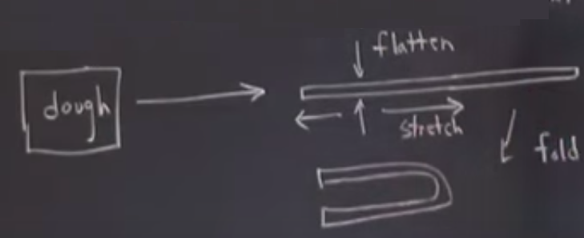

Tabii o görülen boşluk olmazdı, katlanan katmanlar tamamen birbirine yapışırdı,
ama gösterim amacıyla öyle yaptım. Ardından tekrar enjekte adımına geliyoruz,

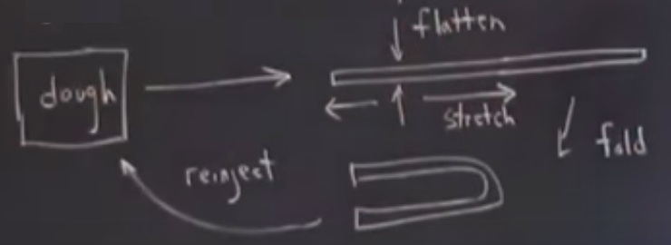

böylece başa dönmüş oluyoruz ve süreç tekrar başlayabiliyor, ama bu sefer daha
değişik bir hamur var tabii, ve merdane, düzleşme, vs. oradan devam ediyor. Bu
işlemi ardı ardına yapacağız, bu "hamur'' üzerinde bir özyineli harita döngüsü
olacak yani.


Göstermek istediğim bir katmanlı bir şeyle başladık, katladıktan sonra iki
katman oldu, sonra katlanan obje katlandıktan sonra şimdi dört katmanı var. Her
döngüde eldeki katman sayısı iki katına çıkıyor. Bazılarınız bilir belki yufka
hamuru (phyllo dough) denen bir şey vardır, ya da Fransızların milfoy hamuru
(mille-feuille [hoca bunu taklit Fransız aksanıyla söyledi]), bu tür hamurlarda
neredeyse 1000 tane katman vardır. Bu demektir ki eğer katlaya katlaya gidilse
10 katlama sonrası $2^{10} = 1024$ bu katman sayısına erişilirdi.

Herneyse, iddia o ki bu acaip katmanlı yapının benzeri kaotik sistemlerin faz
uzayında da aynen ortaya çıkıyor. Çıtlatmak istediğim mekanizma öyle bir şey ki
bir kaotik sistemin faz uzayına akışımız üzerinden otomatik olarak çekicilerin
fraktal yapısını üretmemizi sağlıyor. Sezgisel kavrayışın bir kısmı bu,
detaylarını birazdan göreceğiz.

Bir diğer kısmı, eğer bu faz uzayında olan acaipliği (!) inanıyorsanız, bu
sadece fraktalların değil, kaosun nereden çıktığını da aslında açıklar. Yani
birbirine yakın iki başlangıç şartı düşünürseniz, mesela yine hamur örneğine
dönersek iki seçtiğim noktaya bir renklendirici koymuş olsam, merdane, katlama,
tekrarlama işlemleri ardından, ve diyelim 10 adım sonra renklendirici hamurun
her tarafına yayılmış olurdu herhalde, ve bu başlangıçta yakın olan noktaların
neredeyse herhangi bir yerde olabileceği durumu göstermiş olurdu. Anlatabiliyor
muyum? Sadece fraktalların nereden geldiğini ima etmiyoruz, gidiş yollarının
o ezilme, yayılma, vs. işlemi sırasında ayrılmasının yol açtığı enformasyon
kaybının kaosla ilintilendirilen o tahmin edilmezliğin temeli olduğunu ima
ediyoruz. 

Şimdi size bir kitaptan [1] bazı resimler göstereceğim. Kitap 80'lı
yılların başında çıkmıştı zannediyorum, ben hatırlıyorum, o zamanlar için
yeni olan kaos, garip çekiciler, vs. konusunda bir kitap bulmaya
uğraşıyordum, bu zor bir işti o zaman, başlangıç seviyesindeki birisi için
rahat okunabilecek fazla kaynak yoktu. Ama bu kitap [1] tam da onu yapmaya
uğraşan bir kitaptı, hatta yazarlar hiç matematiksel formül kullanmadan
konuyu anlatmaya karar vermişler bunu sıkı bri şekilde takip etmişler,
kitapta hiç formül yok, herşeyi görsel olarak anlatmaya uğraşmışlar. Görsel
meyilli olanlarınız şimdiye kadar gördüklerimize farklı bir bakış açısı
sağlaması açısından bu kitabı ilginç bulabilir. Ben pür görselci değilim
tabii, formüllere inanırım, onları severim. Şimdi kitabın resimlerini
görmeden önce kapaktaki resim hakkında bazı formüller göstermek istiyorum.

Resim Rössler çekicisi denen bir çekici. Onu bulan Otto Rössler bir
biyokimyacıydı, 70'lı yılların ortasında zannediyorum, bizim şu anda
sorduğumuz sorulara benzer sorular soruyordu, kaosun geometrisini nasıl
irdeleriz? Garip çekicilerin o şekli almalarının sebebi nedir? Temel
denklemlerini sıvı dinamiğini baz alarak yazan temebilim odaklı olan
Lorenz'in aksine, Rossler panayıra gittiği zamanki bir hikayesini
anlatıyor, orada pamuk helvası yapan bir makina görüyor, makinanın kolları
var, önce sekizimsi, sonra sağdan solda değişik şekillerde hareket
ediyorlar tabii bu sırada helvayı karıştırmış, katlamış,
vs. oluyorlar. Herneyse Rossler bu makinayı seyrederken gördüklerinin
kaosun geometrisi ile bir alakasının olabileceğini düşünmeye başlıyor. O
gördüğü geometriyi canladıracağını düşündüğü başta biraz uydurukumsu bir
denklem sistemi yazıyor ve bir garip çekiciyi ortaya çıkartıp
çıkartamayacağını görmek istiyor. Şu denklemi yazdı ve bu denklem en basit
garip çekiciyi içerir, hatta Lorenz sisteminden bile basittir. İçinde
sadece bir (karesel, $xz$ terimi) gayrı-lineerlik vardır (Lorenz'de iki
vardı),

$$ \dot{x} = -y -z$$

$$ \dot{y} = x + a y$$

$$ \dot{z} = b + z(x-c)$$

Bu denklemin doğabilimsel bir anlamı yok, uyduruk, $a,b$ dış parametreler.
Rössler bir sürü parametre değerin denedi ve buldu, benim şimdi
göstereceğim $a=b=0.2$, $c=5.7$. Bu değerler [1]'in kapağındaki şekli
ortaya çıkartacak. 

```python
from numpy import *
from matplotlib import *
from scipy import *
from pylab import figure, show, setp
from mpl_toolkits.mplot3d import Axes3D

def num_rossler(x_n,y_n,z_n,h,a,b,c):
    x_n1=x_n+h*(-y_n-z_n)
    y_n1=y_n+h*(x_n+a*y_n)
    z_n1=z_n+h*(b+z_n*(x_n-c))   
    return x_n1,y_n1,z_n1

a=0.2
b=0.2
c=5.7

t_ini=0
t_fin=32*pi
h=0.0001
numsteps=int((t_fin-t_ini)/h)

t=linspace(t_ini,t_fin,numsteps)
x=zeros(numsteps)
y=zeros(numsteps)
z=zeros(numsteps)
x[0]=0
y[0]=0
z[0]=0

for k in range(x.size-1):
    [x[k+1],y[k+1],z[k+1]]=num_rossler(x[k],y[k],z[k],t[k+1]-t[k],a,b,c)
   
fig = figure()
ax1 = fig.add_axes([0.1, 0.7, 0.4, 0.2])
ax2 = fig.add_axes([0.1, 0.4, 0.4, 0.2])
ax3 = fig.add_axes([0.1, 0.1, 0.4, 0.2])
ax4 = fig.add_axes([0.55, 0.25, 0.35, 0.5],projection='3d')

ax1.plot(t, x,color='red',lw=1,label='x(t)')
ax1.set_xlabel('t')
ax1.set_ylabel('x(t)')
ax1.legend()
ax1.axis((t_ini,t_fin,min(x),max(x)))

ax2.plot(t, y,color='green',lw=1,label='y(t)')
ax2.set_xlabel('t')
ax2.set_ylabel('y(t)')
ax2.legend()
ax2.axis((t_ini,t_fin,min(y),max(y)))

ax3.plot(t, z,color='blue',lw=1,label='z(t)')
ax3.set_xlabel('t')
ax3.set_ylabel('z(t)')
ax3.legend()
ax3.axis((t_ini,t_fin,min(z),max(z)))

ax4.plot(x, y,z,color='black',lw=1,label='Evolution(t)')
ax4.set_xlabel('x(t)')
ax4.set_ylabel('y(t)')
ax4.set_zlabel('z(t)')
ax4.set_title('Evolution')
plt.savefig('23_04.png')
```


Prezentasyona dönelim, bahsettiğim kitap kapağındaki grafiğe bakalım şimdi, 

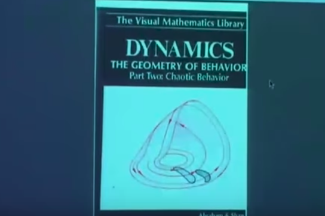

Dikkat edersek grafik Lorenz sistemin yarısı sanki. Lorenz grafiği bir
iki kanatlı kelebek şeklindeydi, gidiş yolları bir kanattan diğerine
sürekli gidip geliyordu.. Burada sanki bir kanat var sadece. Bunu daha
detaylı tarif etmeye uğrasayım şimdi. 

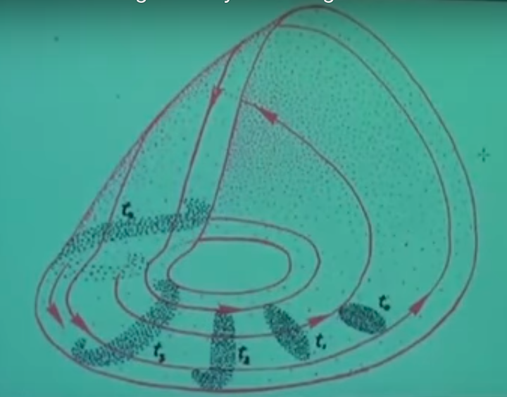

Bunlar elle çizilmiş resimler bu arada. Bu resimde çekici gösterilmiş, ve
bakıyorsunuz, insanın resmi kavraması zaman alabiliyor. Kırmızı okları olan
gidiş yollarını görüyoruz, ve $t_0$ zaman indisinde bir grup başlangıç konumu
görüyoruz [gri bölge], ve o bölgenin sol kısmındaki başlangıç konumlarının
gösterdiğim

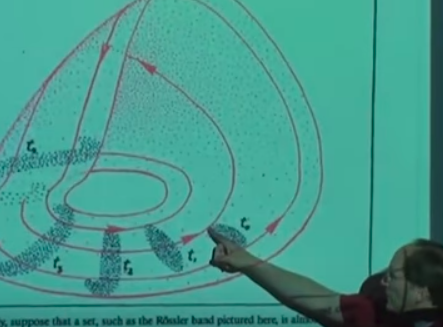

yoldan gittiğini görüyoruz. Yukarı doğru üçüncü boyuta doğru gittiğimize dikkat,
bu kaos için niye en az üç boyut gerektiğini de açıkliyor bir anlamda. Aynı
bölgenin sağ kısmının gösterdiğim

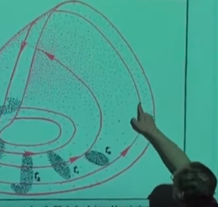

yolu takip ettiğini görüyoruz. Şimdi sol kısmın gidişini tamamen takip edelim,

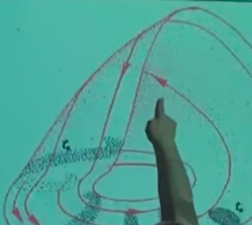
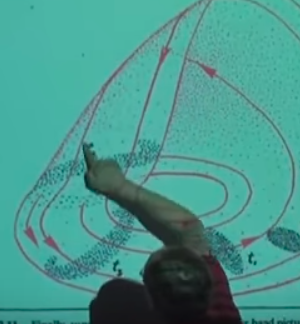
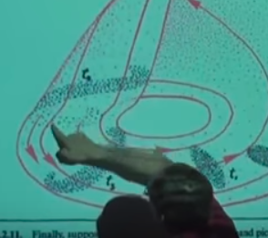
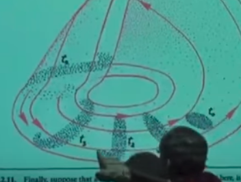

ve nihai olarak 

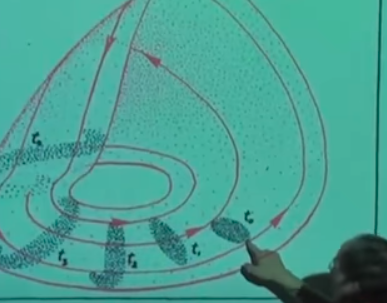

noktasına geliyoruz. Aynı bölgenin sağ kısmından başlasak,

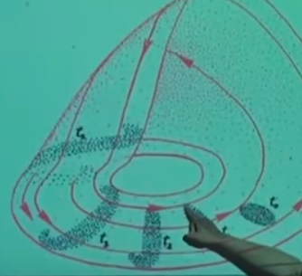

noktasına gelirdik. Vurgulamak istediğim ana nokta $t_0$'daki elipsoidimsi
başlangıç noktaları $t_1$ noktasına geldiğimizde yana genişlemiş oluyorlar, ve
dar yanlarından biraz daha basılmış hale geliyorlar, aynen hamurdaki tarif
ettiğimiz durum gibi. Yol daha da ileri takip edilirse $t_2,t_3$'te şeklin
deforme olmaya başladığını, daha da yayıldığını, vs. görebiliyoruz.

$t_4$ bölgesinde neler olduğu biraz kafa karıştırıcı olabilir. Tüm sistemin alt
kısmı bağlamında oldukca düz bir satıh olduğunu görüyoruz, ama o yukarı gidişte,
aşağı inişte, o bölgelerde ne oluyor? Gidiş yolları kendisiyle mi birleşiyor bir
anlamda? Bir dal mı ortaya çıkıyor oralarda? O kısımdaki çizim zaten tam detaylı
değil, o bölge hakkında biraz daha konuşalım o zaman.

Kitabın alttaki sayfasında Rössler çekicisini parça parça nasıl biraraya
koyabileceğimiz anlatılmış.

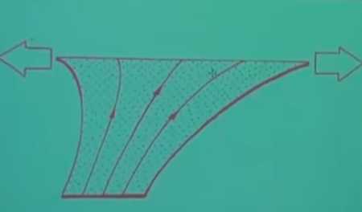

Önce bir yüzey düşünelim, o yüzeyde genişleme oluyor. O alttaki gidiş yolları
sağa, sola ve yukarı doğru açılıp üstel hızda birbirinden uzaklaşıyor. Bu şekli
alalım, ve ona uygulanan alttaki operasyon dizisine bakalım,

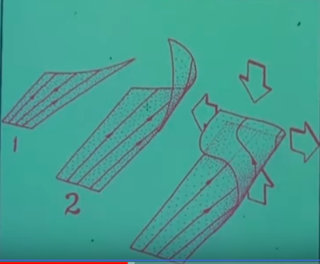

2. adımda gidiş yolları yönünde bir esnetme yapılmış, ve aynı anda sağ
tarafından bir katlanma başlatılmış, ta ki 3. adımda görülen hale gelininceye
kadar. Ardından, 4. adıma bakınca,

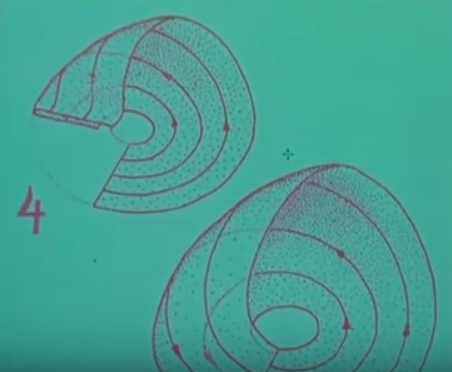

o katlanan kısmın bir de kendisi üzerine katlandığını görüyoruz, hatta bu
katlanma o kadar yassı bir haldeki neredeyse iki katman tek gibi
gözüküyor. Şimdi o çok yassı katlanmalı kısım dönüp dönüp şuradaki

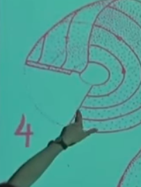

başlangıç kısmı ile birleşmeli, ama bu mümkün gözükmüyor, değil mi? Çünkü ana
kurallardan birini hatırlarsak gidiş yolları birbirini kesemez, çünkü çözümlerin
özgünlüğü şarttır, vs. Bu sebeple iki katman bir tek katmana yapıştırılamaz, bu
diferansiyel denklemlerin özgünlük teorisini ihlal ederdi. Ama 5. adımda

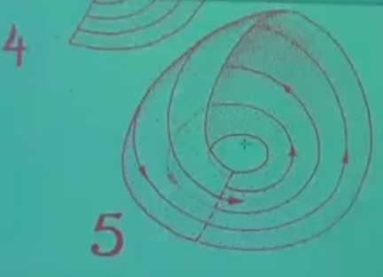

sanki bu olmuş gibi duruyor, ama o birleşmenin olmayacağını biliyoruz. Bu durum
biraz daha açıklamaya ihtiyaç duyuyor. Kitap [1]'ın "fraktal mıkroyapı (fractal
mıcrostructüre)'' başlıklı kısmında bu açıklamayı bulabiliriz belki. İlk
katlanma resmine dönelim,

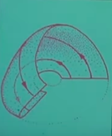

Eğer devam edersek, bu katlanmış kesimleri başlangıç kabul edersek, onların da
tekrar katlanacağını düşünmek gerekir ve alttaki durum ortaya çıkar,

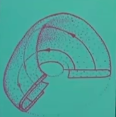

Burada son uçta üst üste dört katman görülüyor. Aynı şekilde devam edersek sekiz
katmana gelirdik,

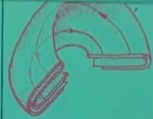

O zaman esas cevap aslında katmanların hiçbir zaman bir, iki, dört ya da sekiz
olmadığı.. Elde her noktada sonsuz tane katman vardır, bu sonsuz katmanlar
karmaşık bir süreç üzerinden birbirleri ile birleşiyorlar, ki bunu alttaki resim
bir kesit üzerinden göstermeye uğraşmış,

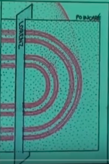

Yani iki üstteki çekiciden bir kesit alıyoruz, ki buna Poincare kesiti (Poincare
section) ismi de veriliyor [resimdeki dikey kesit], onun üzerinde bir kesit daha
alıyoruz, buna da Lorenz kesiti deniyor. İşte bu noktada, o kırmızı gidiş
yollarının Lorenz kesitini kestiği yerde kırmızı bölgelerin birbirine olan
mesafeleri, aralardaki boşluklarda bazı kalıplar görmeye başlarız, mesela ortada
büyük bir boşluk olur, aşağı gittikçe sonra ufak bir tane, sonra orta ölçekte
bir tane, ondan sonra yine ufak.. Sadece bu boşluklara odaklanırsak grafiksel
olarak alttakini görürüz,


Kitabın yazarları bu görüntüye bakıyorlar ve onlara analiz ya da topoloji
dersinde öğrenmmış olabileceğiniz bir şeyi hatırlattığını
söylüyorlar. Hatırlanan nedir? Elde bir çizgi var \#1, onun üçte birini
ortasından çıkartıyoruz \#2, yani illa üçte biri olması gerekmiyor ama belli
büyüklükteki bir orta parça, sonra elde kalan parçalarda da aynı işlemi
yapıyoruz \#3, ve bu şekilde devam edince mesela \#5 seviyesinde elde edilen
resmin üç üstteki resme benzediğini görebiliyoruz. 

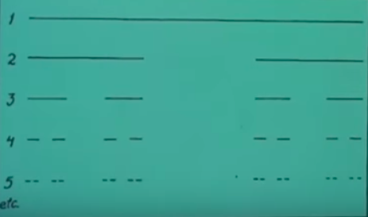

Bu kurgu Cantor kümesi denen şeyin oluşturulmasıdır aslında. Öğrenciler
Cantor kümesini pür matematik derslerinde öğrenirler, ve doğabilimde bu
kavramın karşılığı olmadığı ima edilir, fakat bu doğru değildir. Cantor
kümesi garip çekicilerin temel bir özelliğidir. Ben mesela daha çiçeği
burnunda bir matematikçi, bilimci iken bir kimyasal kaos konulu bir
konferansa gitmiştim, ve orada bir konuşmacı kimyasal kaosu ölçtüklerini,
ve sistemdeki çekiciyi grafiklediklerini söylüyordu, ve "tabii ki bu
çekici Cantor kümesi üzerindeki bir kurdeledir'' diyordu. Bunu duyunca
şaşırdığımı hatırlıyorum, "ne dedin?''. "Kurdele nasıl yani? Ne demek
istiyor?'' diye düşünmüştüm.  Kurdele şimdiye kadar gördüğümüz yüzey, ve bu
yüzey Cantor kümesi ruhunda, stiliyle katlanıyor. Herneyse o anlatımı yapan
kişinin aklında [1] kitabındaki şekiller vardı tabii, benim o sıralarda
bundan haberim yoktu.

Soru

Özyinelenen haritaları, mesela lojistik haritayı, üstteki anlattıklarımız
ışığında görebilir miyiz?

Cevap

Evet kesinlikle. Bir sonraki derste o konuya daha derin dalacağız, ama
özetlemek gerekirse, lojistik haritanın alttaki gibi grafiği vardı değil
mi?


Bu grafiği sanki yatay ekseni alıp, esnetip, uzatıp ve parabol haline
getirmek için eğdiğim bir işleme benzetebilirim. Yani lojistik harita da
aslında esnetme, katlama yapıyordu, ama biz öne bu gözle
bakmamıştık. Tekrar enjeksiyon durumu da var, yatay eksendeki değerler 0
ile 1 arası, esnetme, katlama sonrası elde edilen dikey eksende yine 0 ile
1 arasına eşleniyor. Tabii loijstik harita tam istediğimiz türden bir kaos
yaratmayacak, çünkü lojistik harita tersine çevirilebilir (invertible)
değil. Yani mesela dikey eksenden bir başlangıç değerim olsun, oradan
başlayarak bir yatay çizgi çekeyim, o çizgi haritayı iki yerden keser, bu
geriye gidemeyiz demektir. Ama diferansiyel denklemleri her zaman geriye
doğru işletebilirsiniz, zamanı geri sarabilirsiniz yani. Yani lojistik
harita üç boyutta görülen diğer kaos modellerine göre (mesela Rössler
sistemi) biraz kabadır. Ama hala lojistik haritada pek çok "doğru şey''
mevcuttur.

Soru

Sonsuz katmanların birleşmesi nasıl oluyor?

Cevap

Hayal etmesi zor değil mi? Bu konu hakkında Lorenz'in yazdıklarına bakmak
iyi olabilir. Bir makalesinde [2] diyor ki ".. fakat bir çelişki gibi
gözüken kavramın daha yakından incelenmesi kanımca iyi olur. Her ikisi de
bir sarmal içeren iki yüzeyin birbirinin içine geçmesini bu teorilerde bir
yere koymak zor çünkü iki gidiş yolunun birbirinin içine geçmesi mümkün
değil''. Burada Rössler çekicisinden bahsetmiyor çünkü o daha keşfedilmedi,
onun örneğinde garip çekicinin gözünde olan gidişatın sonra diğer sarmala
geçmesi, sonra geri, vs. durumu var. Devam ediyor "ama birleşmiş {\em gibi
  duran} yüzeyleri bir yere koymak, anlatmak zor değil''. Yani sorduğu bu
birleşmişlik görüntüsü nerede geliyor?  Niye olduğunu açıklıyor, başlangıç
şartları üzerinden bir hacim hesabı yapıyor, daha önce de gördük, Lorenz
sisteminde hacimler üstel hızda küçülürler. Lorenz'in tanımladığı zaman
adımları üzerinden 70 adımda sarmal etrafında bir tur atılıyor, bunun
ardından hacim $7 x 10^{-5}$ kadar küçülmüş. Yani iki parçacık çok hızlı
bir şekilde birleşebilirler.

Ama benim favorim şimdi gelen bölüm. Diyor ki "iki yüzey sadece birleşiyormuş
gibi gözüküyor, ama aslında ayrı duruyorlar. Bir gidiş yoluna paralel olarak bir
yüzeyi takip edince [ki daha önceki örnekte bizim de yaptığımız gibi] anlıyoruz
ki her yüzey aslında aynı anda iki tane yüzey. O zaman birleşiyormuş gibi
gözüktükleri yerde aslında dört yüzey var. Bu sürece devam edince, yok, aslında
sekiz yüzey olduğunu görüyoruz, vs. Sonuçta şu sonuca varıyoruz, elimizde sonsuz
çetrefillikte bir yüzey yapısı var, bu yüzeylerin her biri birleşlerden
yüzeylerden ya birine ya ötekine müthiş yakın ''.

Bu "sonsuz yüzeyler yapısı (infinite complex of surfaces)'' sözüne
dikkat. Lorenz bunları fraktallerin ortaya çıkmasından yıllar önce söylüyor. Ne
olduğunun çok iyi farkında. Dersimizde bahsettiğimiz herşey bir anlamda burada
pat diye ortaya kondu. Tabii hayal edebiliriz ki Lorenz'in zamanındaki
bilimciler bunları okuyup hiçbir şey anlamamışlardır. Yazılanlar son derece
açık, ama Lorenz diyagram çizememiş, o zaman bilgisayarlar dandik. Ama herşey
zihninde görüyor. Lorenz'in büyüklüğü buradan geliyor.

Cantör kümesinin boyutları

Bu boyutları kesin olarak hesaplamak mümkün. Cantor kümesini düşünmek için, daha
önce yaptığımız gibi, 0 ve 1 arası bir kapalı aralık alırız, "kapalı'' diyorum
çünkü son noktalar da aralığa dahil. Sonra aralığın orta 1/3'ünü çıkartırım,
bunu yapmaya devam ederim,

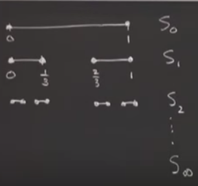

Matematikçi Cantor 1800'lu yılların başında kendi araştırmaları için buna benzer
şeyler yapıyordu, garip çekiciler, kaos, vs. bunlara bakmıyordu tabii, bu
konular o zaman daha mevcut değildi. Poincare bazı işler yapmıştı ama daha konu
işin başındaydı.

Neyse, şimdi Cantor'ün sıraladığı üstteki yapıları ayrı ayrı kümeler olarak
görelim, baştaki küme $S_1$, sonraki $S_2$, vs.. Ve bizim içinden çıkartma ile
yarattığımız bu kümelerin bir limitteki kümeye gittiğini düşünelim, ona
$S_\infty$ diyelim. Bu kümeyi çizmeye cüret etmiyorum tabii (!). Ama bu
$S_\infty$ kümesi Cantor kümesi.

Bu küme içinde ne vardır? İlk akla gelebilecek cevap "hiçbir şey''
olabilir. Ama bu doğru değil. Aslında orada bir sürü şey var. Bunlardan
bazılarını sayabilir misiniz? [öğrenci sıfır diyor]. Doğru, sıfır noktası. Bu
noktayı bölüm çıkartma sırasında hiçbir zaman çıkartmıyorum. Bitiş noktalarını
da çıkartmıyorum, mesela 1/3, ya da sürecin her hangi bir basamağında yaratılmış
herhangi bir üç nokta hep kümede kalıyor, çünkü üç noktaların arasındaki şeyleri
çıkartıyorum sadece. Öğrenciler bunu duyunca "tamam sadece üç noktalar kaldı o
zaman'' diyor, bu durumda Cantor kümesi "sayılabilir'' olur. Kaç üç noktası
olduğu da belli, ilk başta 2, sonra 4, sonra 8, vs., daha doğrusu basamak
$n$'deki üç nokta sayısı $2^n$. Bu sayı da sonsuzluğa gidiyor ama sayılamaz bir
sonsuzluk değil bu, mesela reel sayılar gibi değil. Çoğu öğrencinin sayılabilir
vs. sayılamaz kümeler hakkında bilgisi olmuyor, [1]'de bu iki kavram detaylı
olarak işleniyor. Biz bu konuya girmeyeceğiz, onun yerine boyut kavramından
bahsedeceğiz. 

Cantor kümesinin bazı ana özellikleri

1) Toplam uzunluğu sıfıra eşit: Burada terminolojinin etrafından
dolanıyorum biraz, çünkü pür matematik konusunda reel analiz dersinde
değiliz, doğru kelime uzunluk değil ölçüt (measure) olmalı ama neyse. Biz
bu ölçütü, ya da uzunluğu şu şekilde belirteceğiz, $|S_0| = 1$, yani
$S_0$'in uzunluğu 1 olacak, $|S_1| = 2/3$, $|S_2| = 4/9$. Buradaki kalıbı
daha iyi belirtmenin bir yolu $|S_n| = \left(\frac{2}{3}\right)^n$ çünkü
her basamakta eldeki uzunluğu alıyorsunuz, onun içinden 1/3'ünü
çıkartıyoruz, geri kalan her adımda 2/3. Tabii $n \to \infty$ iken bu
uzunluk sıfıra gidiyor. İşte bu anlamda Cantor kümesinin uzunluğunun, her
ne kadar uzunluk kelimesi net tarif olmasa da, sıfıra gittiğini
söylüyoruz. Bu son noktada, Cantor kümesinde artık fazla bir şey
kalmamış. Eğer herhangi bir parça kalmış olsaydı bir uzunluktan
bahsedilebilirdi.

2) Evet, uzunluk sıfır ama küme içinde sayılamaz çoklukta nokta var (ya da
basit tarifle sayılamaz). Bu demektir ki bu kümedeki ögelerle reel sayılar
kümesi ögeleri arasında birebir eşleme yapabiliriz. Yani başlangıçtaki 0
ile 1 aralığı kadar burada öğe var. Bu hakikaten paradoksal. 0 ile 1
arasındaki öğeleri çıkartarak Cantor kümesine ulaştık, öyle ki uzunluk
sıfır haline geldi, ama hala o başlanılan aralıktaki ile aynı sayıda öğe
var. Bunu kabul etmek zor geliyor ama ispatı mümkün, Cantor kümesinin
$x \in [0,1]$'daki tüm sayıların 3 bazındaki halinin sadece 0'lar ve
2'ler (ama 1'ler değil) kullanılarak yazılabileceğini göstereceğiz.

3) "Kendine benzerlik (self-similarity)'' - içinde herhangi bir sayıda daha
ufak olacak sekilde kendi kopyasını barındırır. Bununla ne demek istiyorum?
Kumeyi olustururken cizdiklerimi tekrarlayayim. 

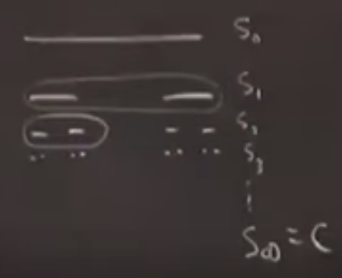

$S_0,S_1,...$ diye gidiyor ta ki Cantor kümesine gelinceye kadar. Ama ondan
önce o sonlu basamaklardan birinde olanları düşünelim. Mesela $S_2$'nun sol
parçasına bakalım. Bu parçanın yapısı neye benziyor? Aynen üstündeki yapıya
benzemiyor mu?  $S_2$ bir üstündeki yapının, $S_1$'in ufaltılmış hali (üçte
biri). Bu ufaltılma tüm basamaklar için aynı şekilde geçerli, $S_4$ ile
$S_3$ arasında, $S_8$ ile $S_7$ arasında, vs.

Şimdi bu argümana devam edersek, bu şekilde ufalta ufalta Cantor kümesi
$S_\infty$'a geldik. Onu üçte bir oranında ufaltınca $C_{\infty+1}$'in sol
kısmını elde ediyoruz, yani $\infty+1 = \infty$ olduğuna göre yine
$C_\infty$'in sol kısmını elde ediyoruz. Yani Cantor kümesinin sol (ya da
herhangi bir) kısmi yine Cantor kümesinin kendisinin ufaltılmış hali. İşte
"kendine benzemek'' ile bundan bahsediyorum, küme farklı ölçeklerdeki
kendi kopyalarını yine kendi içinde barındırıyor.

4) Boyutu (bazıları benzerlik boyutu der ama biz sadece boyut diyelim)
$\frac{\ln 2}{\ln 3} = 0.63..$. Yani Cantor kümesinin boyutu 0 ile 1
arasındadır. Boyut sıfır değil, sıfır boyut tek bir noktanın boyutudur. 1
değil ki bu sonlu sayıda noktanın boyutudur. Ya da.. sayılabilir noktaların
kümesi.. [hoca düşünmeye başladı, tam emin değil]. Rasyonel sayıların
boyutu sıfır mı acaba? Bilmiyorum. Sayılabilirliğin her zaman sıfır olup
olmadığına bakmak lazım. Herneyse gördüğümüz küme 0 ile 1 arasında. Bir
eğrinin boyutu 1 olurdu, bir düz çizgi 0 ile 1 arası yine.

Bunu niye söyledik? Kendine benzeyen bir nesnenin boyutu ne demektir? Boyut
kavramına pek çok farklı bakış açısı vardır. Şimdi kullanacağımız bu
problem için en rahat olanı. Şimdiye kadar çoğunuz boyut sözünü bir
noktanın yerini belirtmek için gereken eksen sayısı bağlamında gördünüz
herhalde. Mesela "dünya üç boyutlu'' deriz, çünkü fiziksel dünyada yer
belirtmek için, mesela bu odada, yerden olan yükseklik, sizden
[öğrencilere] olan uzaklık, ve [sol tarafına işaret ediyor] duvardan olan
uzaklık lazım. Ama Cantor kümesinde nasıl yer belirtiriz? Sadece tek bir
sayı kullanamayız, bu sadece orijinden olan uzaklık olurdu, yeterli değil,
çünkü o zaman küme tek boyutlu demiş olurduk. Bu boyutun iyi bir tanımı
olmaz, fraktal nesnelerine iyi bir genelleme sağlamıyor, farklı fraktalları
birbirinden net şekilde ayırmak için iyi bir kıstas sağlamıyor.

Bu çerçevede kullanılan, ve fraktal olmayan diğer kullanımlara da
indirgenebilen, bir başka tanım şudur. Bir karesel alanı düşünelim. Bu tür
bir alanın da kendine benzer olduğu iddia edilebilir, mesela onu $r = 3$
boyutunda küçülteyim (Cantor kümesi ile bağlantı kurmak için üç seçtim), ve
küçültme tabii ki her yönde. Bu ufak kare büyük olanın dokuzda biri olur,


Bu dokuz sayısı nereden geldi? Üç ile bağlantılı olarak tabii, $r = 4$
olsaydı 16 olurdu. 5 için 25, vs. Yani ufaltma ölçeği ne ise, onun karesi
kadar kopyayı orijinal içine sığdırabilirim. Yani $m = r ^2$. Bu üstel,
yani 2 kritik sayı ve karesel alanın boyutunu tarif ediyor. Değil mi?
Tahtada çizdiğim bu kare iki boyutlu, işte üsteldeki iki buradan
geliyor. İşte bir kare kadar basit olmayabilecek kendine benzeyen objeleri
tarif için kullanılan genelleme şöyle, eğer kendine benzeyen objem için
elimde bir ölçekleme ilişkisi var ise ki $m = r^d$ seklinde, $d$'ye boyut
diyeceğim, ya da benzerlik boyutu.

Bu tanımı Cantor kümemize uygulayalım. Biraz önce dedik ki Cantor kümesini
alıp 3 ölçeğinde küçültürsek, kendisinin sol kısmını elde ederiz. Bu
demektir ki $r=3$ ise $m=2$. Değil mi? Sol parça diğer iki parçanın yarısı
kadardır. Bu sayıları biraz önceki formüle verirsek,

$$ m = r^d \Rightarrow d = \frac{\ln m}{\ln r} = \frac{\ln 2}{\ln 3}$$

İşte bu sebeple boyut kesirli (fractional).

Bu tür hesabı diğer kendine benzeyen nesnelere de rahatlıkla
uygulayabiliriz. Kitabımdaki fraktalları anlatan bölümde bu örnekler
bulunabilir.

Umarım bu konu hakkında ana yemeğin tamamın veremesek te bir tat sağlamış
oldum. Daha fazlası için kendiniz konu hakkında okuma yapabilirsiniz. Bir
sonraki derste önceden kısaca değindiğimiz iki boyutlu harita, Henon
haritasından bahsetmek istiyorum, orada esnetme, katlanma işlemlerini daha
yakından göreceğiz, ve bu işlemlerin fraktal yapıya olan etkilerini
anlamaya çalışacağız. Hala fraktalları sayısal olarak görmedik, Lorenz
sisteminde görmedik, bugün de göstermedim, ama Henon haritası bu fikirlerin
hakikaten somut olarak işlediğini zannediyorum ispatlayacak.

Kaynaklar

[1] Shaw, Abraham, *Dynamics, The Geometry of Behavior*

[2] Lorenz, *Deterministic Nonperiodic Flow*, 
    [http://math.bu.edu/people/mabeck/Fall14/Lorenz63.pdf](http://math.bu.edu/people/mabeck/Fall14/Lorenz63.pdf)


