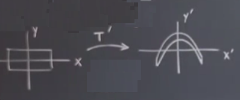
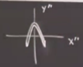
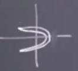
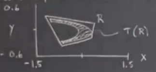
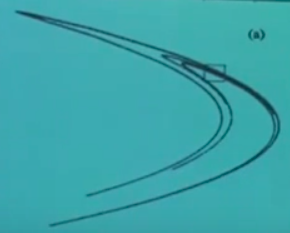
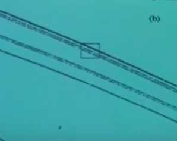
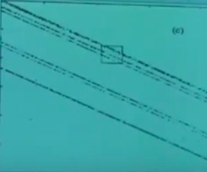
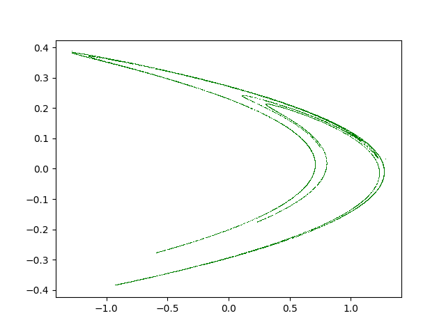

# Ders 24

Önceki derste garip çekicilerden ve onların fraktal alt yapısından
bahsediyorduk. Rossler çekicisinden bahsettik, ve zihinde canlandırmak için
hamur, poğaça, vs. gibi örnekler kullandım, tuhaf katmanlı yapılar, bu
dersin kendisi biraz tuhaftı zaten [öğrenciler gülüyor]. Belki bu tarif
ettiklerimi görsel olarak daha ikna edici hale getirmem iyi olur. Bu derste
Henon haritası denen bir kavram üzerinden bunu başarmaya
uğraşacağım. Kitabımın 12.2 bölümünde Henon haritası anlatılıyor.

Bu konu ilk kez 1976'da araştırıldı, araştırmacı Michel Henon Fransız
matematiksel astronomdu. Hikayeye göre M. Henon bır diğer Fransız fizikçi
Eve Pamou'nun dersini dinliyordu, derste Lorenz sistemi anlatılıyor ki bu
günlerde Lorenz sistemi müthiş popüler bir konu. 1963'te yayınlanmış, on
sene kimse ona dikkat etmemiş, ama 70'lı yıllar ortasında birdenbire
farkedilmiş, ve Lorenz'in gördükleri insanlara çok ilginç gelmeye başlamış,
konuya daha derinden bakmak isteyenleri meraklandırmış. Herneyse Pomou
konuyu meslekdaşlarına tanıştırmaya uğraşıyor, özellikle ilgilendiği bölüm,
Lorenz'in daha önce aktardığımız ettiğimiz sözleri, "bu tam bir yüzey
değil, sonsuz yüzeyler yapısı'', yani birbirine çok yakın sonsuz tane
katmanın oluşturduğu bir yapı. İşte Pomou bunu tarif etmeye uğraşıyordu,
Henon'da bunları dinliyor, ve duyduklarını zihninde canlandırmaya
uğraşıyor, ve Pomou bu sırada diyor ki "bu bahsedilen, olması gereken
katmanları sayısal olarak çözemedim / göremedim, uğraştım ama olmadı''.

Bu Henon'a bir fikir veriyor, belki garip çekicilerin fraktal yapısını
görsellemenin daha farklı bir yolu vardır? Bu çaba birazdan anlatacağım
bulgularına yol açtı. Yani Lorenz sistemin kendisiyle uğraşmak yerine,
başka bir yolu denemek istedi. Gördüğümüz üzere Lorenz sisteminin çok
kuvvetli hacim küçültme özelliği var, çekicinin gözü yakınında, bir
kanatta, bir tür sonrası hacimleri neredeyse 14000 civarı oranında
küçültüyor. Ama Henon dedi ki belki daha basit bir eşleme kullanabilirim,
diferansiyel bir denklem çözmek yerine bir özyineli harita
yaratabilirim. Ama bizim daha önce gördüğümüz tek boyutlu harita yerine
Henon iki boyutlu bir harita kullandı, ve küçültme oranının dışarıdan bir
parametre ile kontrol edilebilir hale getirdi.

Henon 2-D haritaları basit iki boyutlu haritalardır, ve bir garip çekiciye
sahip olacak şekilde tasarlanmışlardır. Dikkat edilirse Henon'un konuya
yaklaşımı / sezgilerinin Rossler'inkine benzediği görülecektir, esnetme,
katlanma, tekrar enjekte, vs. gibi kavramlar burada da var (ama bu iki
araştırma birbirinden bağımsızdı), haritası garip çekicilerin mikro
yapısını ortaya çıkartacak şekilde tasarlanmıştır, ve bu yapının ilk direk
görselleştirilmesi Henon sayesinde olmuştur.

Harita şöyle,

$$ 
x_{n+1} = y_n + 1 - a x_n^2  
\qquad (1)
$$

$$ 
y_{n+1} = b x_n 
\qquad (2) 
$$

Parametre $a,b$ dışarıdan kontrol edilebilen parametreler. Gördüğümüz gibi
harita iki boyutlu, girdi $x_n,y_n$ noktaları olacak, ve harita bunları baz
alarak bize sonraki değerleri veriyor, $x_{n+1},y_{n+1}$.  Bu işlemi
düzlemdeki bir noktanın düzlemdeki bir başka noktaya zıplaması gibi hayal
edebiliriz [düzlem çünkü iki boyutlu], bu zıplama ardı ardına olacak tabii,
harita denklemlerine hesap yaptırdığımız sürece.

Niye bu harita? Farketmişizdir belki, harita $x_n^2$ terimi yüzünden
gayrı-lineer, ama bu tek gayrı-lineer kısım, bu açından da Rossler sistemi
gibi minimal gayrı-lineerlik içeriyor (Rossler bir diferansiyel denklemdir
ve tek gayrı-lineerliğe sahip).

Peki faz uzayının esnetme, katlama sürecin nasıl parçası oluyor? $xy$
ekseninde duran bir dikdörtgen düşünelim. Bu size benim önceki (hamur)
kütlesi, merdane örneğimi hatırlatabilir. İlk adımda onu esnetip
katlayacağım. Burada ardı ardına uygulanan bazı transformasyonlar olacak,
bu transformasyonları birleştirip tek bir nihai transformasyon
oluşturacağım, ki bunların sonucu Henon haritası olacak. İlk
transformasyonu $T'$ olarak isimlendirelim, $T$ üstü apostrof türev
anlamında değil, 1. işlem anlamında.



Bu transformasyon $T'$ için denklem

$$ x' = x$$

$$ y' = 1 + y - ax^2$$

Yani $x$ için hiç değişim yok, $y$ için bir değişim var, $a$ bükülme
miktarını kontrol ediyor.  Sonra Henon bu bükülmüş objeyi alıyor ve onu $x$
ekseni boyunca, yanlardan içeri doğru yani, eziyor. Yani tam ezmiyor ama
sıkıştırıyor. Bu transformasyona $T''$ diyelim, formülü

$$ x'' = b x', \quad |b| < 1$$

$$ y'' = y' $$

$b$ oranında sıkıştırma, küçültülme yapılıyor. $y$ de değişim yok. Resmin
son hali,



Merak edenler olabilir, bunları niye yaptık? $b$'ye ne gerek var?
Hatırlarsak Lorenz sisteminin bir özelliği hacmi küçültmesiydi. Bu hacim
küçültmenin bu örnekteki karşılığı alan küçülten bir harita. İlk
transformasyon, bükme yaptı evet, ama alan küçültmesi yapmadı. Bir
determinant hesabı üzerinden bükülme öncesi ve sonrası alanların birbirine
eşit olduğunu gösterebilirsiniz. Bu sebeple $b$ üzerinden gösterdiğimiz
transformasyon adımına ihtiyaç var. Yani ikinci transformasyon ile sisteme
yitirgenlik (dissipation) tanıştırmış olduk, ayrıca 2. adımda da bir
bükülme var (yanlardan sıkıştırırken bükmüş oluyoruz).

Sonraki adım, tekrar enjeksiyon yapmak. Hamurdan hatırlarsak merdane ile
yaydık, ezdik, katladık, şimdi eldeki hamuru alıp başa dönmek istiyoruz,
yani tekrar ezmek, vs.. Tekrar enjeksiyon için Henon üstteki son duruma
bakıyor, ilk baştaki resim yatay eksen boyunca uzayan bir nesneydi, üstteki
dikeyde uzayan halde, Henon dikey ve yatay eksenleri değiştirmeye karar
veriyor, yani üstteki nesneyi yana çeviriyor. $T'''$ yani,

$$ x''' = y'' $$

$$ y''' = x'' $$

Alttakini elde ediyoruz,



Üç transformasyonu ardı ardına uygulayarak bu noktaya geldik. Şimdi tüm bu
transformasyonları tek adım $T$'de birleştiririz,

$$ T = T''' T'' T'$$

Bu birleştirim sonrası (1)'i elde ettiğimizi görebiliriz (notasyonu
zihnimizde $(x,y)$ yerine $(x_n,y_n)$, ve $(x''',y''')$ yerine
$(x_{n+1},y_{n+1})$ olarak değiştirmek kaydıyla), ki
$T(x_n,y_n) = (x_{n+1},y_{n+1})$ olsun.

Bu harita hakkında ilginç gözlemler nelerdir? Özellikleri nedir? Garip
çekicisi neye benzer?

Özellikler

1) Harita tersine çevirilebilir (invertible): Eğer elimizde
$(x_{n+1},y_{n+1})$ varsa, oradan özgün bir $(x_n,y_n)$'e erişebiliriz.

Bunun önemi ne? Başta Lorenz sistemine benzer olmak istediğimizden
bahsettik, Lorenz sistemi diferansiyel bir denklem sistemidir ve bu
sistemlerde herhangi bir gidiş yolunda zamanı geriye sarabilirsiniz. Ama bu
durum lojistik harita için geçerli değil. Orada elimizde ters parabol var,
bir $y$ değeri parabolu iki yerde keser, yani o $y$'lerde "geriye gitmek''
yani $x$'i bulmak iki farklı seçenek ortaya çıkartır. Lorenz haritası tersi
alınabilir değildir.

Kontrol edelim, 

(1) ve (2)'den baslayarak $x_n,y_n$ denklemlerini bulmamiz gerekiyor
yani. (2)'den baslayarak $X_n$'i bulabiliriz,

$$ x_n = \frac{y_{n+1}}{b}$$

Onu (1)] içine sokarsak,

$$ x_{n+1} = y_n + 1 - \frac{a}{b}(y_{n+1})^2  $$

ve

$$ y_n = x_{n+1} - 1 + \frac{a}{b^2}(y_{n+1})^2  $$

$x_n,y_n$'in geleceğe bağlı versiyonlarını bulmuş olduk. Yani bu sistem
tersine çevrilebilir. 

2) Alanları daraltıyor (Lorenz akışının hacim küçülttüğü gibi). Bunu nasıl
kontrol edeceğiz? Belki bazılarınız Çok Değişkenli Calculus dersinde
öğrenmiştir; bir alanı alıp başka bir alana eşliyoruz, alanların sonrası ve
öncesi arasındaki oran, o transformasyonun Jacobian'ın determinantıdır, ki
sonsuz küçük alanlar için de bu geçerlidir.

$$ 
\left[\begin{array}{rr}
\frac{\partial x_{n+1}}{\partial x_n} & \frac{\partial x_{n+1}}{\partial y_n} \\
\frac{\partial y_{n+1}}{\partial x_n} & \frac{\partial y_{n+1}}{\partial y_{n+1}} 
\end{array}\right] = 
\left[\begin{array}{rr}
-2ax_n & 1 \\
b & 0
\end{array}\right] 
$$

Determinant $-b$. O zaman alanların oranı $b$'nin büyüklüğü olur ($|b|$
yani). Eksi işareti niye ortaya çıktı? Çünkü eksenleri 3. adımda
değiş-tokuş yaptık hatırlarsak, bu sebeple. Neyse, $|b| < 1$, o zaman alan
küçülüyor, bu sebeple $b$ parametresi büyüklüğü 1'den küçük olacak şekilde
seçilmiş.

Bu arada determinant sabit çıktı, bu küçülme oranı hep aynı kalacak
demektir, yani her adımda aynı oran, o zaman küçülme sabit
diyebiliriz. Lorenz sisteminde de benzer bir durum vardı, hacimlerin
küçülmesi sabit. Küçülme üstel tabii ki, yani $e$ üsteli, ama bu azalma
sırasında her zaman adımındaki faktör aynı.

Devam edelim, Lorenz sisteminin bir diğer anahtar özelliği kapan bölgesinin
(trapping region) olmasıdır demiştik. Bir küre, ya da elipsoid vardır, bu
bölgeye bir kez girince dışarı çıkmak mümkün değildir. Henon haritasında
benzer bir durum var. 

İki sistem arasında bir fark var tabii. Lorenz çekicisi global bir çekici,
ne kadar uzaktan başlarsanız başlayın, belli bazı başlangıç şartları
dışında çoğu şart bizi çekiciye götürür. Henon haritasında bu doğru değil,
bu haritada global bir çekici yok. Bunu biraz düşünerek kendimiz
bulabilirdik, sistemde bir $x^2$ terimi vardı değil mi? Eğer $x$ büyükse o
zaman bu terimin etkilediği bir sonraki değişkenleri daha da büyük hale
getirecektir. Yani gidiş yollarının sonsuzluğa gitmesi mümkün. Eğer
orijinden yeteri kadar uzaktan başlarsanız dışarı "kaçabilirsiniz''. O zaman,

3) İçinde o nihai garip çekiciyi barındıran bir kapan bölgesi var (ama her
yörünge kapan bölgesine düşmüyor) çünkü bazıları $x^2$ sayesinde sonsuzluğa
kaçıyorlar.

Grafiğini çizelim. Bu arada Henon $a=1.4,b=0.3$ seçti.



Bu grafiğin aslını Henon'un makalesinden alıp kitabımda gösterdim. Yapılan
nedir? $R$ ile temsil edilen o dört çizgiyi Henon haritasına verince elde
edilen şekil $R$'nin içindeki düz çizgillerle işaretlediğim kısım. Yani
$R$ kendisine eşleniyor bir anlamda ve bir kez $R$ içine girerseniz bir
daha dışarı çıkamıyorsunuz.

Peki Henon niye üstteki $a,b$ parametrelerini seçti? Bu seçimin "tam
kararında'' olmakla alakası var. 

$b \approx 0$ ise, yani $b$ sıfıra yakınsa, kuvvetli bir katlanma ve ezilme
oluyor. Bu niye istenmeyen bir şey? Yapmak istediğimizi hatırlayalım. Garip
çekicinin katmanlarını görmek istiyoruz. Eğer bu katmanları çok fazla
ezersek, Lorenz'in deneyimlediği probleme geri dönmüş oluruz, herşey
birbirine çok yakın ve görmek zor.

$|b| = 1$ ise katlanma kaos üretecek kadar yeterli olmayabiliyor. 

Henon deneme yanılma ile $b=0.3$'ü buldu, ve güzel resimler üretebildi. 

İlkine bakalım,



Şimdi sadece üstte ufak kutuyla seçilen yere odaklanalım. İlk bakışta
kabaca orada kalın bir çizgi var gibi gözüküyor. Orayı büyütürsek,



görülüyor. Çizgi zannettiğimiz içinde başka bir sürü şeyler olan bir
grup.. Satürn'ün halkalarına benziyor bir bakıma. İlk başta üç tane
birbirine yakın çizgi var sandık, ama yakından bakınca alttaki tek,
üstündeki ikili, onun üstündeki üçlü çizgiler gibi duruyor. Üçlü olanı
büyütürsek, yine ufak karenin içine düşen kısmını, alttakini elde ediyoruz,



Yine benzer bir şekli görüyoruz! Tekli, ikili, üçlü çizgiler aynen burada
da var! İşte ardı ardına benzer bölgeleri büyütebiliriz, ve hep aynı
şeyleri görürüz. Bunlar bahsettiğimiz katmanlar işte. 

İlk grafiği çizecek bilgisayar programı alttadır,

```python

def HenonMap(a,b,x,y):
	return y + 1.0 - a *x*x, b * x

a =1.4
b = 0.3

x = 0.1
y = 0.3

X = []; Y = []
for n in range(10000):
    x, y = HenonMap(a,b,x,y)
    X.append(x)
    Y.append(y)
    
plt.plot(X,Y, 'g,')
plt.savefig('24_01.png')
```




