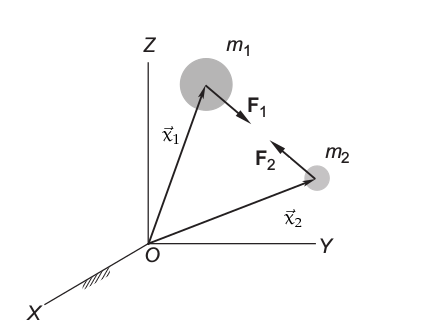
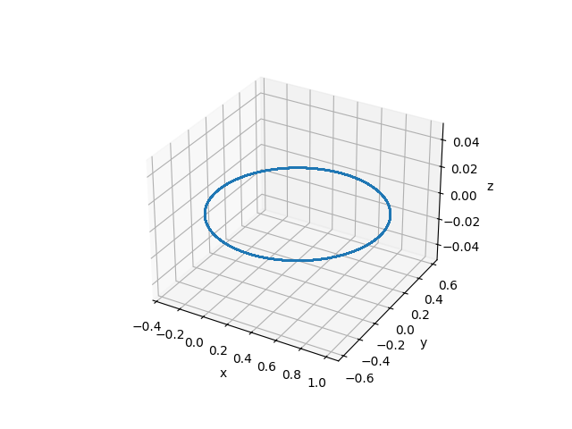
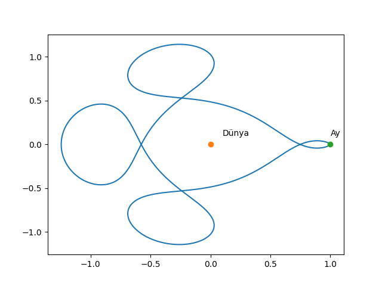

# Ay'a Gidelim, Düzlemsel, Dairesel Kısıtlanmış 3-Cisim Problemi (Planar Restricted Circular 3-Body Problem)

Ay'a gidebilmek için kütlelerin uzayda birbirini nasıl etkilediğini,
birbirleriyle olan çekimlerini incelemek gerekiyor. ABD Nasa'nın Apollo
programı aya gidebilmek için bu tür hesapları yapmak zorundaydı. Önce basit
formdan başlayalım, iki cisim problemi.
 
İki Cisim Problemi

Uzayda iki cisim olduğunu düşünelim, bunlar iki gezegen olabilir,birisi
$m_1$ kütlesine sahip ve $\vec{x}_1$'de, diğer $m_2$ kütlesine sahip ve
$\vec{x}_2$'de.



Böyle bir sistemde 2. kütlenin 1. üzerindeki çekim kuvvetinin

$$ 
\vec{F}_1 = 
\frac{G m_1 m_2 (\vec{x}_2-\vec{x}_1)  }{ | \vec{x}_2 - \vec{x}_1|^3  }
$$

olduğunu Newton Kanunu'nundan biliyoruz [5]. Ters yönden bakarsak 1. kütlenin
2. üzerindeki etkisi

$$ 
\vec{F}_2 = 
\frac{G m_1 m_2 (\vec{x}_1-\vec{x}_2)  }{ | \vec{x}_1 - \vec{x}_2|^3  }
$$

ki $G$ yerçekim sabiti. Newton'un ikinci kanunu $F=ma$'yi kullanırsak, daha
doğrusu onun formunu, $\vec{F} = m \vec{a}$ kullanarak üstteki iki formülü
tekrar yazabiliriz. $\vec{x}_1$ ve $\vec{x}_2$'in ivmesi (formüldeki
$\vec{a}$)) $\ddot{\vec{x}}_1$, $\ddot{\vec{x}}_2$ olacaktır, mesela
1. cisim için 

$$ \vec{F}_1=  m_1 \ddot{\vec{x}}_1 $$

$\vec{F}_1$  için üstteki formülü yerine geçirip $m_1$ iptali yapınca

$$ \ddot{\vec{x}}_1  = \frac{G m_2 (\vec{x}_2-\vec{x}_1)  }{ | \vec{x}_2 - \vec{x}_1|^3  }$$

Aynı şekilde 2. cisim için

$$ \ddot{\vec{x}}_2  = \frac{G m_1 (\vec{x}_1-\vec{x}_2)  }{ | \vec{x}_1 - \vec{x}_2|^3  }$$

Sayısal çözüm için $\dot{\vec{x}}_1 = v_1$, $\dot{\vec{x}}_2 = v_2$,
tanımları yapılabilir, böylece $\dot{v}_1 = \ddot{\vec{x}}_1$ olur, vs.
detaylar için [6].

```python
from scipy.integrate import odeint
import matplotlib.pyplot as plt
import numpy as np

m1 = 1
m2 = 1

def twobody(state, t):
    x1 = np.array([state[0], state[1], state[2]])
    v1 = np.array([state[3], state[4], state[5]])
    x2 = np.array([state[6], state[7], state[8]])
    v2 = np.array([state[9], state[10], state[11]])

    r = x2-x1
    r = np.sqrt(np.sum(r*r))

    x1d = v1
    v1d = m2*(x2-x1)/(r*r*r)
    x2d = v2
    v2d = m1*(x1-x2)/(r*r*r)

    return [x1d[0],x1d[1],x1d[2],v1d[0],v1d[1],v1d[2],\
            x2d[0],x2d[1],x2d[2],v2d[0],v2d[1],v2d[2]]

state0 = [0.0, 0.0, 0.0,\
          0.0, 0.0, 0.0,\
          1.0, 0.0, 0.0,\
          0.0, 1.0, 0.0]

t = np.arange(0.0,100.0, 0.01)
state = odeint(twobody, state0, t)

from mpl_toolkits.mplot3d import Axes3D
fig, ax = plt.subplots(1, 1, subplot_kw={'projection': '3d'})
ax.plot(state[:,6]-state[:,0], state[:,7]-state[:,1], state[:,8]-state[:,2])
ax.set_xlabel('x')
ax.set_ylabel('y')
ax.set_zlabel('z')
plt.savefig('chaos_app01_01.png')
```



Not: Üstte iki cisim problemini hesapsal olarak çözdük [6]. Bu problemin
analitik çözümü de vardır, detaylar için [5].

Üstteki sonuç şunu söylüyor, başlangıç şartlarının uygun olduğu durumda
(belli bir hıza sahip olununca birbirilerinden olan mesafe yeterli ise) iki
cisim birbirlerinin (ya da ağırlık merkezlerinin) etrafında dönerler.

Kısıtlanmış 3-Cisim Problemi

3-cisim probleminde, mesela bir güneş, dünya, ay sisteminin analitik çözümü
yoktur. Bu problemin kısa bir hikayesi 1. derste işlendi. Kısıtlanmış
formda mesela bir dünya, ay, uzay gemisi sisteminde 3. cisim olan uzay
gemisinin çok küçük olduğu için diğer iki cisim üzerinde etkisinin yok
sayılabileceği varsayılır. Diğer kısıtlamalarla problem daha da
basitleştirilir, mesela iki cismin dairesel yörüngede sabit hızda, ve aynı
düzlemde döndüğü varsayılabilir, sonra eksen değişimi tekniği ile eksenin o
hızda döndürülerek iki cismin hep aynı yerde kalması sağlanır, böylece tek
hareket eden 3. cismin gidiş hesabı kolaylaşır. Tabii bu sistemin de
analitik çözümü yoktur, hesapsal tekniklere başvurmak gerekir.

Baştan başlayalım, 1. ve 2. cisim üzerindeki kuvvet önemli değil, büyük iki
cismin üçüncü cisim üzerindeki çekimi önemli, O zaman sadece 3. cisim için

$$ 
\ddot{\vec{x}}_3 =  
\frac{G m_1 (\vec{x}_1-\vec{x}_3)  }{ | \vec{x}_1 - \vec{x}_3|^3  } + 
\frac{G m_2 (\vec{x}_2-\vec{x}_3)  }{ | \vec{x}_2 - \vec{x}_3|^3  } 
$$

Bir diğer basitleştirme yörüngenin elips değil dairesel olması. O zaman
Kepler'in Teorisi üzerinden bu iki cismin sabit hızda döndüğü
farzedilebilir. 

Şimdi bir kordinat sistemi yaratalım öyle ki $\vec{x}_1,\vec{x}_2$ her
zaman $y=0$ üzerinde kalsınlar. Bunun için önce $m_1,m_2$'nin
pozisyonlarını kutupsal kordinatta gösteririz. 

$$ 
\vec{x}_1 = \left[\begin{array}{r}
-r_1 \cos (\frac{2\pi t}{\tau}) \\
-r_1 \sin (\frac{2\pi t}{\tau})
\end{array}\right]
$$

$$ 
\vec{x}_2 = \left[\begin{array}{r}
\frac{m_1}{m_2} r_2 \cos ( \frac{2\pi t}{\tau} )\\
\frac{m_1}{m_2} r_2 \sin ( \frac{2\pi t}{\tau} )
\end{array}\right]
$$

ki $r_1,r_2$ sırasıyla $m_1,m_2$'nin orijinden olan uzaklığı ve $\tau$ bir
dönüşün ne kadar zaman aldığı (periyot büyüklüğü). İki kütlenin ağırlık
merkezini orijin olarak atamak istiyoruz, ki $r_2 = \frac{m_1}{m_2}r_1$
olsun. Ayrıca basitlik amaçıyla $r=r_1$ diyelim. Şimdi iki cismin dönüşüne
oranla kordinat sistemini döndürürsek bu cisimlerin sürekli $y=0$'da
kalmasını garanti edebiliriz, böylece sadece üçüncü cismin hareketine
odaklanabiliriz, kordinatı döndürmesi $-\frac{2\pi t}{\tau}$ açısıyla
olacak, bu döndürme / rotasyon matrisine $R$ diyelim,

$$ 
R(t) = \left[\begin{array}{rr}
\cos(\frac{2\pi t}{\tau}) & \sin(\frac{2\pi t}{\tau}) \\
-\sin(\frac{2\pi t}{\tau}) & \cos(\frac{2\pi t}{\tau}) 
\end{array}\right]
$$

Genel olarak iki boyutta $\theta$ kadar döndürme yapmak için alttaki gibi
bir bir matris kullanabileceğimizi biliyoruz,

$$ R_\theta = \left[\begin{array}{rr}
\cos \theta & -\sin \theta \\
\sin \theta & \cos \theta
\end{array}\right] $$

Not: Eksi açıyla döndürülme yapıldığı için $\sin$ işaretleri değişmiş,
$-\sin(\theta) = \sin(-\theta)$), ama $\cos(\theta) = \cos(-\theta)$ olduğu
için orada değişim yok.

Devam edelim, bu yeni sistemde $\vec{x}_1,\vec{x}_2$'i hesaplarsak,

$$ \vec{x}_{1r} = R \vec{x}_1 = \left[\begin{array}{c}-r \\ 0\end{array}\right]$$

$$ \vec{x}_{2r} = R \vec{x}_2 = \left[\begin{array}{c}\frac{m_1}{m_2}r \\ 0\end{array}\right]$$

İstediğimiz sonucu elde ettiğimizi görüyoruz. Şimdi $R$'yi bir
$\ddot{x}_{3r}$ denklemi elde etmekte kullanabiliriz.

$$ \vec{x}_{3r} = R \vec{x}_3 $$

$$ \dot{\vec{x}}_{3r} = \dot{R} \vec{x}_3 + R \dot{\vec{x}}_3$$

$$ \ddot{x}_{3r} = \ddot{R}\vec{x}_3 + 2\dot{R}\dot{\vec{x}}_3 + R \ddot{\vec{x}}_3  $$

$$ = 
\left( \frac{4\pi^2}{\tau^2} - \frac{Gm_1}{r_{13}} - \frac{Gm_2}{r_{23}} \right)\vec{x}_{3r}+
4\pi \left[\begin{array}{rrr}0 & 1 \\ -1 & 0\end{array}\right] \dot{\vec{x}}_3+
\frac{Gm_1}{r_{13}} \vec{x}_{1r} +
\frac{Gm_2}{r_{23}}
$$

$r_{13}$ büyüklüğü $m_1,m_3$ arasındaki mesafe, $r_{23}$ ise $m_2,m_3$
arasındaki. Bu denklemi kullanarak bir 1. derece diferansiyel denklem
sistemi yaratabiliriz, $x,y,u,v$ değişkenlerini kullanarak, öyle ki $x,y$
$\vec{x}_3$'un öğeleri olsun, $u,v$ ise bu öğelerin hızları olsun. Bu
öğeleri $\vec{x}_1$ ve $\vec{x}_2$'yi de temsil etmek için kullanınca
alttaki sonucu elde ederiz,

$$ \dot{x} = u$$

$$ \dot{y} = v $$

$$ \dot{u} = 
\frac{4\pi^2}{\tau^2}x +  (-r-x)\frac{Gm_1}{r_{13^2}} +
\frac{m_1}{m_2}r-x) \frac{Gm_2}{r_{23}^2} +  \frac{4\pi}{\tau}v
$$

$$ \dot{v} =
\frac{4\pi^2}{\tau^2}y -y \frac{Gm_1}{r_{13}^3}-
y \frac{Gm_2}{r_{23}^3}-\frac{4\pi}{\tau}u
$$

ki $r_{13} = \sqrt{(1-\mu+x)^2+y^2}$ ve $r_{23} = \sqrt{(-\mu+x)^2+y^2}$. Ayrıca $r=1-\mu$.

Zaman, kütle ve uzaklık birimlerini değiştirirsek öyle ki $G=1$,
$m_1+m_2=1$, ve $r(1+\frac{m_1}{m_2})=1$ olsun, $m_1 = 1-m_1$ olduğu için
$m_1$'e $\mu$ deriz,

$$ \dot{x} = u$$

$$ \dot{y} = v $$

$$ \dot{u} = x + (\mu - 1 - x ) \frac{\mu}{r_{13}^3} + 
   (\mu-x)\frac{1-\mu}{r_{23}^3} + 2v 
$$

$$ \dot{v} = y - y \frac{\mu}{r_{13}^3} - y \frac{1-\mu}{r_{23}^3}-2u$$


Not: 3. cisim üçüncü boyutta gösteriliyor fakat altındaki düzlem üzerinde aslında.

Problem formülasyonunu [4]'e uyumlu şekilde tekrar tanımlarsak,

$$ 
y_1'' = y_1 + 2y_2' - \mu_2 \frac{y_1+\mu_1}{D_1} - \mu_1 \frac{y_1-\mu_2}{D_2}
$$

$$ 
y_2'' = y_2 - 2y_1' - \mu_2 \frac{y_2}{D_1} -\mu_1 \frac{y_2}{D_2}
$$

$$\mu_1 = \frac{m_1}{m_1+m_2}$$

$$\mu_2 = 1-\mu_1$$

$$ D_1 = ((y_1+\mu_1)^2 + y_2^2 )^{3/2}$$

$$ D_2 = ((y_1-\mu_2)^2 + y_2^2 )^{3/2}$$

Alttaki başlangıç değerleri bir periyodik yörünge ortaya çıkartıyor,

$y_1(0) = 0.994$, $y_1'(0)=0$, $y_2'(0) = -2.0015851063790825224053786222$

Bu değerler nasıl bulunmuş? Periyodiklikten hareketle mesela $x(t)$'in
periyot sonunda $x(T)$'de yine aynı değere gelmesi bir sınır değeri olarak
kabul edilebilir, $y_1(0),y_1'(0)$'in bilindiğini farzedelim, $y_2'(0)$
bilinmiyor. Böylece iki noktalı sınır değer (two-point boundary value
problem) çözülebilir (Sekant yöntemi ile), ve başlangıç değerleri bulunur
[4]. Bulununca son başlangıç değerleri ile ODE entegre edilir ve tüm
gidişat bulunur. Okuyucuya ödev olabilir [8]'e bakılıp kodlama yapılabilir.

Alttaki kod [3]'u baz almıştır, 

```python
import scipy as sp
from scipy.integrate import odeint

def rhs(u,t):
    y1,y2,y3,y4 = u
    a=0.012277471; b=1.0-a;    
    D1=((y1+a)**2+y2**2)**(3.0/2);
    D2=((y1-b)**2+y2**2)**(3.0/2);
    res = [y3,\
           y4,\
           y1+2.0*y4-b*(y1+a)/D1-a*(y1-b)/D2, \
           y2-2.0*y3-b*y2/D1-a*y2/D2
           ]

    return res

t=np.linspace(0.0,17.06521656015796,10000)
res=odeint(rhs,[0.994,0.0,0.0,-2.00158510637908],t)
y1r,y2r,y3r,y4r=res[:, 0],res[:, 1],res[:, 2],res[:, 3]
plt.figure()
plt.plot(y1r,y2r)
plt.plot(0,0,'o')
plt.plot(1,0,'o')
plt.text(0.1,0.1,u'Dünya')
plt.text(1.0,0.1,'Ay')
plt.savefig('chaos_app01_02.png')
```



Üstteki yola onu keşfeden bilimciye atfen Arenstorf Yörüngesi adı
veriliyor. Başlangıç şartlarına göre bu şekilde pek çok gidiş yolu
mümkün. Arenstorf bir matematikçidir ve ABD Apollo programında uzun süre
danışman olarak çalışmıştır. Arenstorf'un üstteki ve pek çok diğer mümkün
yörüngeyi sayısal hesaplama yöntemleri ile bulduğu biliniyor.

Bir diğer mümkün gidiş yolu [7] altta,

```python
res=odeint(rhs,[1.2,0.0,0.0,-1.049357510],t)
y1r,y2r,y3r,y4r=res[:, 0],res[:, 1],res[:, 2],res[:, 3]
plt.plot(y1r,y2r)
plt.plot(0,0,'o')
plt.plot(1,0,'o')
plt.text(0.1,0.1, u'Dünya')
plt.text(1.0,0.1, u'Ay')
plt.savefig('chaos_app01_05.png')
```


Lagrange Noktaları 

Eğer ODE sistemini oluşturan denklemlerde türevlerin sıfır olduğu noktaları
bulursak bunlar bize sistemin sabit noktalarını verir, uzay yolculuğunda bu
noktalara Lagrange noktaları deniyor. Bu noktalara gidip uzay aracını
"park etmek'' mümkün, ve bir noktadan diğerine giderek seyahat
planlanabiliyor, ya da mesela ay yolculuğunun ilk kısmı bir Lagrange
noktasına gitmek, hazırlanmak, ve ikinci aşama planını bu noktadan
başlayarak yapmak mümkün olabiliyor.

Kaynaklar

[1] Stack Exchange, *Restricted Three-Body Problem*, [http://math.stackexchange.com/questions/54735/restricted-three-body-problem](http://math.stackexchange.com/questions/54735/restricted-three-body-problem)

[2] Szebehely, *Theory of Orbits*

[3] Gander, *Scientific Computing An Introduction using Maple and MATLAB*

[4] Prado, *Orbital Maneuvers Between the Lagrangian Points and the Primaries in the Earth-Sun System*

[5] Mitchell, *The Restricted 3-Body Problem: A Mission to L4*, [https://math.ksu.edu/research/reu/results2011_files/rebeccaspaper.pdf](https://math.ksu.edu/research/reu/results2011_files/rebeccaspaper.pdf)

[6] Pilant, *Welcome to Math 614  Dynamical Systems and Chaos*, [http://www.math.tamu.edu/~mpilant/math614/twobody.pdf](http://www.math.tamu.edu/~mpilant/math614/twobody.pdf)

[7] Soetaert, *Solving Differential Equations in R*

[8] Bayramlı, Hesapsal Bilim *İki Nokta  Sınır Değerli Problemler*


