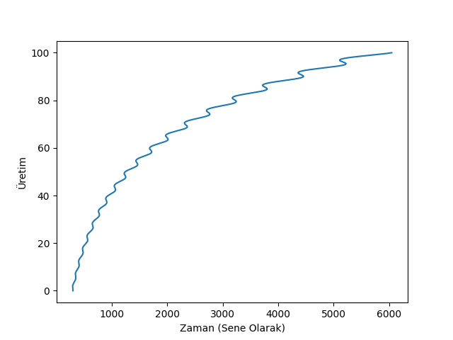
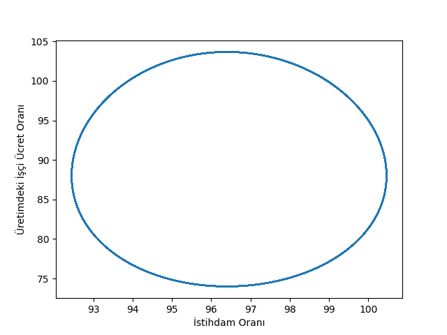
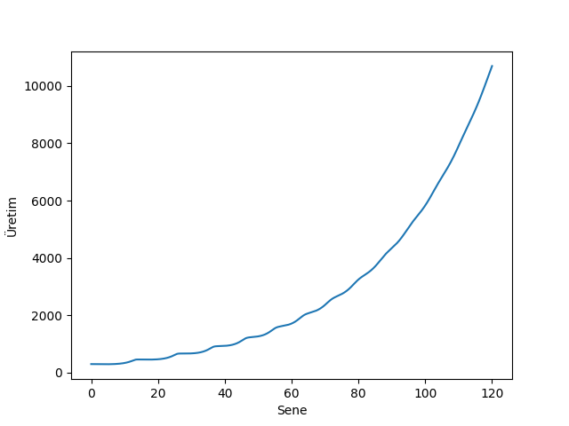
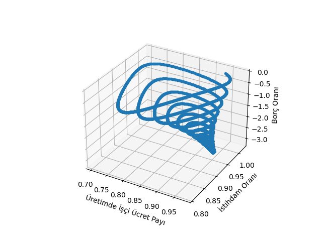
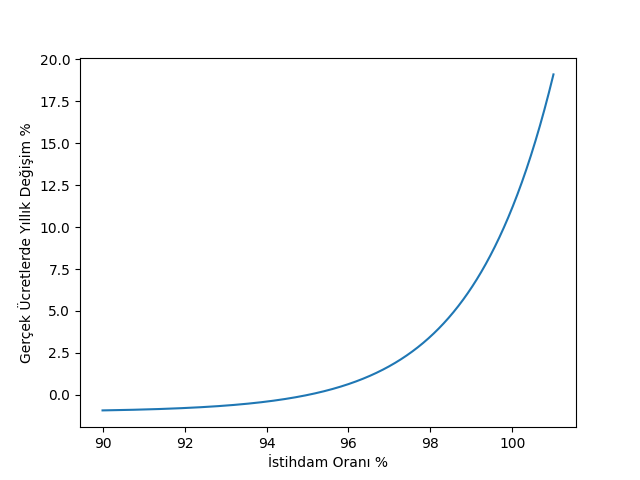
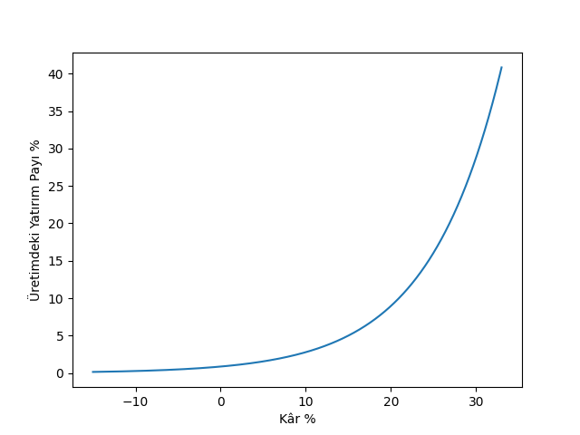

# Makro Ekonomi, Minsky, Keen Ekonomik Modeli, Krizler

2007 yılda başlayan kriz ekonomistlerin sevinçle kutlamakta oldukları Büyük
Ilımlı Evreye (The Great Moderation) son verdi. 80'li yıllarda başladığı
kabul edilen bu evrede ekonomilerdeki dalgalanmaların artık ufaldığı,
krizlerin daha az sık ve daha ufak ölçekte oldukları ve böyle olacakları
düşünülüyordu. Pek çok ana akım ekonomist bu sebeple ortaya çıkan kriz
karşısında hazırlıksız yakalandı, fakat krizi tahmin etme kabiliyeti olan
modellerden biri Hyman Minsky'nin Finans Gayri-Stabillik Hipotezi
(Financial Instability Hypothesis) idi. Steve Keen adlı ekonomist bu
hipotezi nicesel olarak ortaya çıkarıp hesaplarını yaptı [2], ve 15 sene
öncesi ve sonrasındaki gerçek makroekonomi ve gelir dağılımı rakamlarında
görülenleri modelinden birebir çıkartılabileceğini anladı. Modele göre
ılımlı bir evreyi sert dalgalanma takip ediyordu, bu sırada
gayrı-stabillik, ve ciddi ekonomik krizler meydana geliyordu.

Minsky'nin modelini geliştirmesindeki sebep anaakım neoklasik ekonomistlerin
soyut modellerinin gayri-stabillik üretememesi. Üretemedikleri için kriz tahmini
yapamıyorlar, Minsky'nin amaçlarından biri 1929-1941 yılları arasında meydana
gelen Büyük Depresyonu anlayabilmekti, ve aradığı özelliklerden biri modelin
sonuçlarından birinin bu kriz olmasıydı, fakat Minsky etrafta revaçta olan
modellerin kriz çıktısı veremediğini farketti.  Neoklasikçilere göre, mesela ABD
Merkez Bankası eski başkanı Ben Bernanke, "ellerindeki modeller kriz olmadığı
zamanlarda kullanılmalı'' (Bernanke ilginç bir şekilde ünlü Büyük Depresyon
uzmanlarından sayılıyor). Belki de bu ekonomistlerin kurduğu modelleri hiçbir
zaman kasırga, fırtına sonucu vermeyecek meteorolojik modellere benzetebiliriz.

Gayri-lineerlik için aşırı çetrefil matematiğe gerek yok, daha önce gördüğümüz
gibi deterministik bir ODE sistemi gayrı-lineerlik üretebilir ve, daha önemlisi,
ana ekonomik parametreleri yakalayabilir.

1. Minsky Modeli

İlk model, ona Keen'in temel aldığı araştırmacı Goodwin sebebiyle Goodwin
Modeli diyelim, istihdam oranı ve üretimdeki işçi ücret payı sonucunu
kullanacak. İlk başta kriz şartlarından bahsetmeyeceğiz, sadece ana
ilişkileri ve genel gayrı-lineerligi yaratmaya uğraşacağız. Bazı tanımlar,

$\frac{\mathrm{d} a}{\mathrm{d} t} = \alpha a$: Üretkenliğin büyüme oranı.

$\frac{\mathrm{d} N}{\mathrm{d} t} = \beta N$: Nüfusun büyüme oranı.

$L = Y/a$: Ne kadar üretim olduğunu üretkenliğe bölersek istihdam elde
ederiz. Ya da tersten bakarsak istihdam seviyesi üretkenlik üzerinden
toplam üretimi belirler.

Sermaye $K$ bir sabit / hızlandırıcı $v$ üzerinden üretim $Y$'ye
$K = v \cdot Y$ ile bağlıdır.

$\lambda = \frac{L}{N}$: İş gücünün ne kadarının istihdam edilmiş olduğu,
istihdam oranı.

$w$: İşçi kazanç oranı (kişi başına gelir). Tüm maaşlar $W = w \cdot L$

$\frac{\mathrm{d} w}{\mathrm{d} t} = w(\lambda) \cdot w$: İşçi kazanç oranındaki değişim
istihdam oranının gayrı-lineer bir fonksiyonu, çoğunlukla burada Philips
eğrisi kullanılır, $w(\lambda) = (-c + d \cdot \lambda)$.

$\Pi$ kâr, üretimden tüm maaşlar çıkartılınca elde edilir $\Pi = Y - W$.

Sermayenin değişim oranı yatırım eksi amortisman (depreciation)
$\frac{\mathrm{d} K}{\mathrm{d} t} = I-\gamma \cdot K$.

Tüm kâr $\Pi$ şirkete yatırım $I$ olarak geri verilir $I = \Pi$.

Son denklemin bir sonucu,

$$ 
I = \Pi = Y - w \cdot L = Y - w \cdot \frac{Y}{a} = Y(1 - \frac{w}{a})
\qquad (2)
$$

$L = Y/a$ üzerinde logaritmik türev alırsak [1, sf. 67], ve
$\dot{a}/a = \alpha$ olduğunu üstten biliyoruz,

$$ 
\frac{\dot{L}}{L} 
= \frac{\dot{Y}}{Y} - \frac{\dot{a}}{a} 
= \frac{\dot{Y}}{Y} - \alpha
\qquad (1)
$$

Logaritmik türev zor bir şey değil, önce log alıp sonra türev almak sadece,
mesela genel bir formül $f(x)$ üzerinde görelim

$$ f(x) = \frac{g(x)}{h(x)}$$

$$ 
\ln (f(x)) = \ln \bigg( \frac{g(x)}{h(x)} \bigg) = 
\ln(g(x)) - \ln(f(x))
$$

Şimdi türev alalım, zincirleme ve toplam kurallarını kullanınca,

$$ \frac{f'(x)}{f(x)} = \frac{g'(x)}{g(x)} - \frac{h'(x)}{h(x)}$$

Üstteki sonuç bu yazıdaki kullanımlar için yeterli ama devam edebilirdik,
$f(x)$'i sağa geçirince, ve $f(x) = g(x) / h(x)$ olarak açarsak,

$$ f'(x) = f(x) \times \bigg( \frac{g'(x)}{g(x)} - \frac{h'(x)}{h(x)} \bigg)
= \frac{f(x)}{g(x)} \times \bigg( \frac{g'(x)}{g(x)} - \frac{h'(x)}{h(x)} \bigg)
$$

Bu açılıma devam edersek türevde bölüm kuralıyla aynı sonuca erişmiş
olurduk [3]. 

Ana formüllere dönelim, daha önce

$$ \dot{K} = I-\gamma \cdot K$$

demiştik, o zaman 

$$ \frac{\dot{K}}{K} = I/K - \gamma$$

(2)'de bulunan $I$'yi yerine koyalım,

$$ \frac{\dot{K}}{K} = \big(Y(1 - \frac{w}{a} \big) / K - \gamma$$

$K/Y = v$ olduğuna göre

$$ = \frac{1-\frac{w}{a}}{v} - \gamma$$

Şimdi (1)'e dönmek istiyoruz, daha önce yaptığımız gibi $K/Y = v$ üzerinde
logaritmik türev alırız,

$$ 
\frac{\dot{Y}}{Y} = \frac{\dot{K}}{K} 
$$

elde ederiz. Bu demektir ki (1) içinde $\dot{Y}/Y$ yerine $\dot{K}/K$
kullanabiliriz,

$$ 
\frac{\dot{L}}{L} = \frac{\dot{Y}}{Y} - \alpha =  \frac{1-\frac{w}{a}}{v} -
\gamma - \alpha
$$

Artık ODE denklem sistemini yazabiliriz,

$$ 
\dot{L} = L \cdot \bigg( \frac{1-\frac{w}{a}}{v} - \gamma - \alpha \bigg)
$$

$$ \dot{w} = (d \cdot \frac{L}{N} - c) \cdot w $$

$$ \dot{a} = \alpha a$$

$$ \dot{N} = \beta N$$

Python `scipy` ile bu ODE sistemini sayısal olarak çözelim [4]. 

```python
import scipy as sp
from scipy.integrate.odepack import odeint

def rhs(u,t,alpha,beta,c,d,gamma,nu):
    L,w,a,N = u
    res = [( (1/nu)*(1-w/a)- gamma - alpha )*L,\
    	   (d*(L/N)-c)*w,\
	   alpha*a,\
	   beta*N]
    return res
    

alpha=0.02;      # yillik
beta=0.01;       # yillik
c=4.8;
d=5.0;
gamma=0.01;      # yillik
nu=3.0;

T=100;           # bitis zamani

L0=300.0;        # baslangic is gucu, milyon kisi olara
w0=0.95;         # baslangic isci ucreti
a0=1.0;          # baslangic teknoloji seviyesi (uretkenlik)
N0=300;          # baslangic nufusu

t=np.linspace(0.0,T,10000.0)
res=odeint(rhs,[L0,w0,a0,N0],t,args=(alpha,beta,c,d,gamma,nu))
L1,w1,a1,N1=res[:, 0],res[:, 1],res[:, 2],res[:, 3]

print a1.shape, L1.shape
Y = a1 * L1
plt.plot(Y,t)
plt.xlabel('Zaman (Sene Olarak)')
plt.ylabel(u'Üretim')
plt.savefig('chaos_app02_01.png')
```

```
(10000,) (10000,)
```



```python
employment_rate=100*L1/N1
wage_share=100*(w1*L1)/Y
plt.plot(employment_rate, wage_share)
plt.xlabel(u'İstihdam Oranı')
plt.ylabel(u'Üretimdeki İşçi Ücret Oranı')
plt.savefig('chaos_app02_02.png')
```



Bir çevrim ortaya çıktığını görüyoruz. Bu çevrim, suni bir şekilde modelde
zorlanan bir gayrı-lineerlikten değil, sistemin yapısal olarak ortaya
çıkardığı bir gayrı-lineerlik. Modelde ücret oranı ve istihdam seviyesi
birbiriyle çarpılmakta, ve büyüme oranı değişimi ve gelir dağılımı değişimi
arasındaki ilişki (çünkü istihdam seviyeleri değiştikçe işçilerin
maaşlarını pazarlık edebilme kabiliyetleri artıp azalıyor) bir çevrim
ortaya çıkartıyor. Yüksek seviyede yatırım yüksek büyüme ortaya çıkartıyor,
ve işsizlik azalıyor, bu işçi ücretlerinde artışa ve artık kârda (profit
share) azalmaya, artık kârda azalma yatırımda azalmaya, o da ekonomik
büyümede düşüş, o da yükselen işsizlik, o da işçi ücretlerinde azalmaya o
da artık kârda tekrar yükselişe sebep oluyor, ve bu dönme-dolap ardı ardına
kendini tekrar ediyor.

2. Minsky Modeli 

Şimdi finans ve borç mekanizmalarını modelimize dahil edelim, lineer
yatırım fonksiyonunu yerine daha gerçekçi ve borç temelli bir fonksiyon
kullanalım, yani yatırım isteği elde tutulan kazancı aşınca aradaki fark
borç ile finans edilecek. Yatırım isteği için bir üstel fonksiyon
kullanıyoruz, çünkü bu tür bir fonksiyon ekonomist Keynes'in belirsizlik
olduğu durumlarda insanların nasıl davrandığını daha iyi
modelliyor. Keynes'e göre insanlar "mevcut durumun ileride devam edeceğini
inanmaya meyilli oluyor her ne kadar geçmiş bunun böyle olduğunu
göstermiyor olmasına rağmen''.

Yani ekonomideki aktörler içinde oldukları şartı geleceğe doğru aynen
uzatmaya meyilli, "gerçi bu elde başka bir seçenek olmadığında kısmen
meşru olabilir''. Bu sebeple yüksek kâr artış trendi olduğu zaman iş
sahipleri kârlarından daha fazla yatırım yapıyorlar, ama kâr azalması
olduğu zaman yatırım kârın altında kalıyor çünkü işverenler aynı durumun
gelecekte devam edeceğini düşünüyorlar.

Alttaki modele yapacağımız bir diğer gayrı-lineer ek Philips eğrisini
lineerlikten çıkarmak, böylece yüksek istihdam durumunda işçi ücretleri
hızla artsın, az istihdam durumunda yavaş azalsın. 

Bir genel üstel fonksiyon tanımlarız, 

$$ GenExp(v;x,y,s,m) = (y-m) \cdot \exp (s \cdot (v-x)/(y-m)) + m$$

$W,I$ değişkenlerini bu fonksiyon üzerinden belirleriz, 

$$ W_f(v) = GenExp (v;x_w,y_w,s_w,m_w)$$

$$ I_f(v) = GenExp (v;x_i,y_i,s_i,m_i)$$

O zaman istenen yatırım seviyesi ile mümkün olan arasındaki farkı banka
sektörü finanse edecek, bu durumu modele basit bir ilişki üzerinden dahil
edebiliriz, istenen yatırım seviyesi ve eldeki kâr arasındaki fark borç
miktarı $D$'de artışa sebep olur,

$$ \frac{\mathrm{d} D}{\mathrm{d} t} = I - \Pi$$

Kâr tanımında da bir değişiklik yapmamız lazım, kâr üretim eksi tüm işçi
ücretleri artı (mevcut borç için ödenmesi gereken) faiz.

$$ \Pi = Y - w \cdot L - r \cdot D$$

Bu eklerden sonra denklem sistemi şu hale gelir (türetilmesini okuyucuya bırakıyoruz)

$$ \dot{Y} = \bigg( \frac{1}{v} I_f \big( \frac{\Pi}{v \cdot Y} \big) - \gamma \bigg) \cdot Y$$

$$ \dot{w} = P_f (\lambda) \cdot w $$

$$ \dot{D} = I_f \bigg( \frac{\Pi}{v \cdot Y} \bigg) \cdot Y - \Pi   $$

$$ \dot{a} = \alpha a$$

$$ \dot{N} = \beta N$$


```python
import scipy as sp
from scipy.integrate.odepack import odeint

def rhs(u,t,alpha,beta,gamma,nu,r,x_p,y_p,s_p,m_p,x_l,y_l,s_l,m_l):
    Y, w, D, a, N = u
    L=Y/a;                                       #  isgucu
    P=Y-w*L - r*D;                               #  kar
    p=P/(nu*Y);                                  
    #  investment as a function of profit
    I=(y_p-m_p)*np.exp(s_p*(p-x_p)/(y_p-m_p))+m_p;  
    #  istihdam orani
    l=Y/(a*N);                                   
    # isci ucretlerinin istihdam orani fonksiyonu olarak buyume orani 
    H=(y_l-m_l)*np.exp(s_l*(l-x_l)/(y_l-m_l))+m_l;  

    res = [Y*(I/nu - gamma ),\
           H*w, \
           I*Y-P, \
           alpha*a, \
           beta*N]

    return res
    

alpha=0.02;      
beta=0.01;       
gamma=0.01;      
nu=3;
r=0.05;          # banka faiz orani

x_p=0.05;
y_p=0.05;
s_p=1.75;
m_p=0.0;

x_l=0.95; 
y_l=0.0;
s_l=0.5;
m_l=-0.01;
T = 120.0
t=np.linspace(0.0,T,10000.0)
Y0=300;          # baslangic uretimi
w0=0.95;         # baslangic iscu ucreti
D0=0;            # baslangic borc
a0=1;            # baslangic teknoloji (uretkenlik)
N0=300;          # baslangic nufus


arg0 = (alpha,beta,gamma,nu,r,x_p,y_p,s_p,m_p,x_l,y_l,s_l,m_l)

res=odeint(rhs,[Y0,w0,D0,a0,N0],t,args=arg0)
Y1,w1,D1,a1,N1=res[:, 0],res[:, 1],res[:, 2],res[:, 3],res[:, 4]

K=Y1/nu;
L=Y1/a1;
P=Y1-w1*L-r*D1;
I=P;
```

Kaotik davranışı en iyi gösteren figür alt sağdaki herhalde. Bazı başlangıç
şartları için denge durumu var fakat diğerleri için periyodik şekilde
kaosta kalınıyor. 

```python
wage_share=(w1*L)/Y1; 
employment_rate=L/N1;
debt_ratio=D1/Y1;
x1=wage_share; x2=employment_rate; x3=debt_ratio; 
from mpl_toolkits.mplot3d import Axes3D
from matplotlib import cm
fig = plt.figure()
ax = Axes3D(fig)
ax.plot(x1,x2,x3,'.', zs=0,zdir='z', label='zs=0, zdir=z')
ax.set_xlabel(u'Üretimde İşçi Ücret Payı')
ax.set_ylabel(u'İstihdam Oranı')
ax.set_zlabel(u'Borç Oranı')
plt.savefig('chaos_app02_06.png')
```




```python
l=np.linspace(0.9,1.01,1101);
H=(y_l-m_l)*np.exp(s_l*(l-x_l)/(y_l-m_l))+m_l;
plt.plot(100*l,100*H);
plt.xlabel(u'İstihdam Oranı %')
plt.ylabel(u'Gerçek Ücretlerde Yıllık Değişim %')
plt.savefig('chaos_app02_03.png')
```

```python
p=np.linspace(-0.05,0.11,1601);
I=(y_p-m_p)*np.exp(s_p*(p-x_p)/(y_p-m_p))+m_p; 
plt.plot(100*nu*p,100*I);
plt.xlabel(u'Kâr %')
plt.ylabel(u'Üretimdeki Yatırım Payı %')
plt.savefig('chaos_app02_04.png')
```




```python
plt.plot(t,Y1);
plt.xlabel(u'Sene')
plt.ylabel(u'Üretim')
plt.savefig('chaos_app02_05.png')
```

3. Minsky modelinin kodlaması enflasyonu konu alan yazıda bulunabilir.

Üstteki sonuçlar Minsky'nin hipotezini doğruluyor. İkinci modelde kaos var,
ve burada yapılan yegane ek borçlanmayı modellemek, yani bir ekonomide
krizler, dalgalanmalara sebep olan borçlanmadır. Keen bu sebeple bir
ekonominin sağlığını hızlı bir şekilde irdelemek için ilk önce bu
parametreye bakıyor, özel sektör ve bireysel borç toplamının GSMH'ya oranı
nedir? Eğer bu oranda uzun süreli bir artış varsa alarm zilleri
çalmalıdır. 

Kaynaklar

[1] Lorenz, *Nonlinear Dynamical Economics and Chaotic Motion*

[2] Keen, *A monetary Minsky model of the Great Moderation and the Great Recession*, [https://warwick.ac.uk/fac/soc/economics/current/modules/rm/notes1/keen2013a.pdf](https://warwick.ac.uk/fac/soc/economics/current/modules/rm/notes1/keen2013a.pdf)

[3] Wikipedia, *Logarithmic differentiation*, [https://en.wikipedia.org/wiki/Logarithmic_derivative](https://en.wikipedia.org/wiki/Logarithmic_derivative)

[4] Jelonek, *Numerical techniques in MATLAB: differential equations and non-linear dynamics* [https://warwick.ac.uk/fac/soc/economics/current/modules/rm/notes1/research_methods_matlab_3.pdf](https://warwick.ac.uk/fac/soc/economics/current/modules/rm/notes1/research_methods_matlab_3.pdf)


