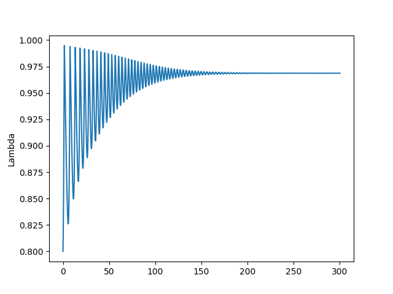
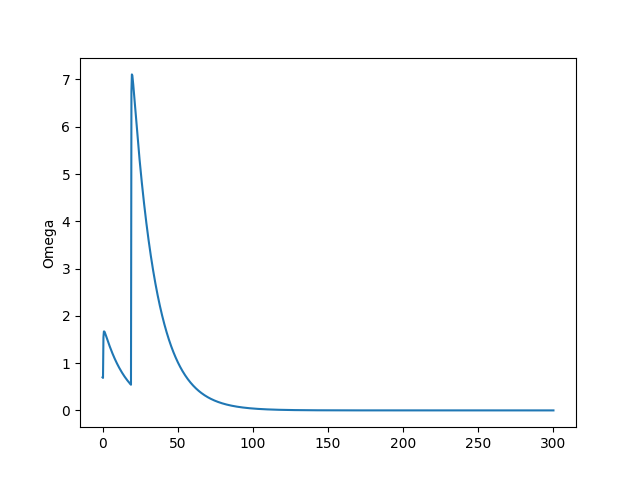
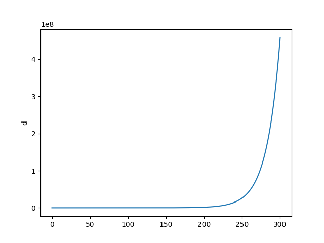
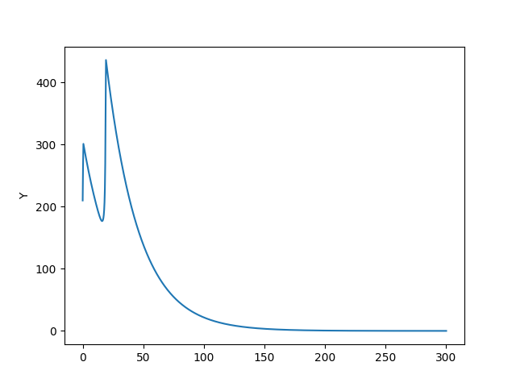

# Steve Keen Özel Sektör Modeli, İkinci Form

Bu yazıda bir önceki yazıda baktığımız borç temell modeli sıfırdan
türetmeye uğraşacağız. Sonuç olarak gayrı-lineer sonuçlar verebilecek bir
ODE sistemi elde edeceğiz, bu sistemin, bu ders notlarında pek çok kez
gördüğümüz gibi sabit noktaları olacaktır, bu noktalardan ekonomik olarak
anlamı olan bir tanesine bakacağız. Ardından sayısal olarak sistemi çözüp
iki farklı başlangıç noktasına göre gidişatın neye benzediğini göreceğiz.

Yan tanımlar, bazıları yeni, bazıları önceki yazıdan tekrar,

$\alpha$: üretkenliğin büyüme oranı, $\frac{\mathrm{d} a}{\mathrm{d} t} = \alpha a$

$\beta$: nüfusun büyüme oranı, $\frac{\mathrm{d} N}{\mathrm{d} t} = \beta N$

$w$: İşçi kazanç oranı (kişi başına gelir), tüm maaşlar $W = w \cdot
L$. Değişken $w$'ye birim emek için elde edilen gelir ismi de verilebilir.

$L = Y/a$: Ne kadar üretim olduğunu üretkenliğe bölersek istihdam elde
ederiz. Ya da tersten bakarsak istihdam seviyesi üretkenlik üzerinden
üretimi belirler.

Sermaye $K$ bir hızlandırıcı / sabit $v$ üzerinden üretime $Y$'ye
$K = v \cdot Y$ ile bağlı.

$\dot{w} = \Phi(\lambda) \cdot w$: İşçi kazanç oranındaki değişim istihdam
oranının gayrı-lineer bir fonksiyonu, çoğunlukla burada Philips eğrisi
kullanılır, mesela $\Phi(\lambda) = \frac{\phi_1}{(1-\lambda)^2}-\phi_0$

$\omega$ ekonomideki işçi ücretleri oranı, $\omega=\frac{w\cdot L}{a \cdot L} = \frac{w}{a}$

Kâr $\Pi = (1-\omega-rd)Y$, yani üretimden işçi ücretlerini ve borç geri
ödemesini (faiz) çıkartırsak, kalan net kâr. 

$\dot{K} = I - \delta K =\kappa(1 - \omega - rd) Y - \delta K$: Yatırım
şirketin kârı $1 - \omega - rd$'nin bir gayrı lineer fonksiyonu (çarpı
mevcut üretim), daha fazla kârın daha fazla yatırım isteğine sebep
olacağını burada modelliyoruz. Sermaye seviyesi degisimine amortisman
$\delta K$ da uyguluyoruz. $\kappa(x)$ meselâ
$\kappa(x) = \kappa_0 + \kappa_1 \exp(\kappa_2 x)$.

$\frac{\mathrm{d} D}{\mathrm{d} t} = \dot{D} = I - \Pi$: İstenen yatırım seviyesi ve
eldeki kâr arasındaki fark borç miktarı $D$'de artışa sebep olur.

Şimdi alttaki ana tanımları yapalım [1]. Bu tanımlar modelin temelini
oluşturacak ve eğer doğru tanımlarsa bizi doğru tahminlere taşıyacaklar.

1. Üretimdeki işçi ücret payı, tüm işçi ücret ödemeleri $W$ bölü gayrı-safi
yurtiçi hasıla (GSYH) $Y$'ye eşittir. $\omega = W/Y$.

2. Özel (kişi, şirket) borcun GSMH'ye oranı, borç $D$ bölü GSYH $Y$.  $d=D/Y$.

3. İstihdam oranı iş sahibi olan kişi sayısı $L$ bölü tüm nüfus $N$'ye
eşittir. $\lambda = L/N$.

Şimdi üstteki üç tanımın zamana göre türevini alalım. Bu tanımlar doğru
olduğuna göre (biz tanımladık) onların dinamik hali de doğru
olmalıdır. Log türev alma tekniğini kullanacağız yine, 

1. Eğer ücret artışları işçi verimlilik artışından büyük ise üretimdeki
işçi ücret payı büyür. Yani

$$ \frac{\dot{\omega}}{\omega} = \frac{\dot{W}}{W} - \frac{\dot{Y}}{Y} $$

2. Eğer borç oranı ekonomik büyüme oranından daha hızlı büyüyorsa özel
borcun GSYH'ye oranı artar. Yani,

$$ \frac{\dot{d}}{d} = \frac{\dot{D}}{D} - \frac{\dot{Y}}{Y} $$

3. Eğer gerçek (enflasyon düzeltilmesi yapılmış) ekonomik büyüme (yüzde),
nüfus artış oranı + işçi verimlilik artış oranını geçiyorsa, istihdam oranı
(yüzdesi) artar (alttaki başlangıç, türetimin gittiği nokta tanımla uyuyor,
altta görülecek).

$$ \frac{\dot{\lambda}}{\lambda} =  \frac{\dot{L}}{L} - \frac{\dot{N}}{N} $$

Şimdi bu türevleri kullanarak bir ODE sistemine ulaşmaya uğraşalım [2].

1. tanımı alalım ve açalım,

$$  = \frac{\dot{w}}{w} + \frac{\dot{L}}{L} - \frac{\dot{Y}}{Y} $$

$$  = \frac{\dot{w}}{w} + \frac{\dot{L}}{L} - \frac{\dot{L}}{L} - \alpha $$

$$ \frac{\dot{\omega}}{\omega} = \frac{\dot{w}}{w} - \alpha = \Phi(\lambda)-\alpha$$

2. tanımı açalım,

$$ \dot{D} = I - \Pi = \kappa(1 - \omega - rd) Y - (1-\omega-rd)Y $$

Hatırlarsak $D/Y = d$, yani $D = Yd$, $\dot{D}/D$ için $D=Yd$ ile böleriz,

$$ 
\frac{\dot{D}}{D} = \frac{ \kappa(1 - \omega - rd)}{d} 
- \frac{(1-\omega-rd)}{d}
$$

$$ 
= \frac{ \kappa(1 - \omega - rd) - (1-\omega-rd) }{d} 
$$

Şimdi $\dot{Y}/Y$ hesabı yapalım, $\dot{Y}/Y = \dot{K}/K$ olduğu için,

$$ 
\dot{Y}/Y = \dot{K}/K = \frac{\kappa(1 - \omega - rd) Y - \delta K}{K}
$$

$$ 
 = \frac{\kappa(1 - \omega - rd) }{v}- \delta 
\qquad (1)
$$

O zaman 

$$  
\frac{\dot{D}}{D} - \frac{\dot{Y}}{Y} =
\frac{ \kappa(1 - \omega - rd) - (1-\omega-rd) }{d} 
- \frac{\kappa(1 - \omega - rd) }{v} + \delta
$$

3. tanımı açalım,

$$  =  \frac{\dot{L}}{L} - \frac{\dot{a}}{a} = \frac{\dot{L}}{L} - \beta $$

$$ Y = L \cdot a $$

$$ 
\frac{\dot{Y}}{Y} = \frac{\dot{L}}{L} + \frac{\dot{a}}{a}
= \frac{\dot{L}}{L} + \alpha
$$

$$ \frac{\dot{\lambda}}{\lambda} = \frac{\dot{Y}}{Y} - \alpha - \beta $$

Biraz önce (1)'de bulduğumuz $\dot{Y}/Y$ sonucunu kullanalım,

$$ 
\frac{\dot{\lambda}}{\lambda} = 
\frac{\kappa(1-\omega-rd)}{v} - \alpha - \beta - \delta
$$

Sonuç olarak şu ODE denklem sistemine erişiyoruz, 

$$ 
\dot{\omega} = \omega [ \Phi(\lambda)-\alpha ] 
\qquad (2)
$$ 

$$ 
\dot{\lambda}=  \lambda \bigg[ 
\frac{\kappa(1-\omega-rd)}{v} - \alpha - \beta - \delta
\bigg]
\qquad (3)
$$

$$ 
\dot{d} = d \bigg[
r - \frac{\kappa(1-\omega-rd)}{v} + \alpha 
\bigg] + \kappa(1-\omega-rd) - (1-\omega)
\qquad (4)
$$

Stabil Noktalar

Birazdan yapılacak hesaplar için gerekli bazı sabitleri tanımlayalım,

```python
alpha = 0.025
beta = 0.02
delta = 0.01
v = 3.0
k0 = -0.0065
k1 = np.exp(-5.0)
k2 = 20.0
r = 0.03
phi0 = 0.04 / (1.0-(0.04**2))
phi1 = 0.04**3.0 / (1.0-(0.04**2))

def kappa(x,k0,k1,k2): return k0 + (k1*np.exp(k2*x))

def philips(lam,phi0,phi1): return ( (phi1 / (1.0-lam)**2) - phi0)
```

ODE sistemindeki tüm türevlerin sıfır olması için $(0,0,0)$ seçilebilir, fakat
bu aşırı basit (trivial) çözümdür, ekonomik olarak anlamı yoktur. Daha anlamlı
bir sabit nokta için (2)'deki türevin sıfır olması için $\Phi(\lambda)=\alpha$
olmalıdır, ya da $\lambda=\Phi^{-1}(\alpha)$. Yani bir $\Phi$'nin tersini
arıyoruz, öyle ki $\Phi^{-1}(\Phi(\lambda)) = \lambda$ olsun. $\Phi$ neydi?

$$ \Phi(\lambda) = \alpha = \frac{\phi_1}{(1-\lambda)^2}-\phi_0$$

Fonksiyonun tersini bulmak için bir karesel denklem şeklinde düzenleyelim,

$$ \alpha + \phi_0 = \frac{\phi_1}{(1-\lambda)^2}$$

$$   (1-\lambda)^2 = \frac{\phi_1}{ \alpha + \phi_0} $$

$$  \lambda^2 - 2\lambda + 1 - \frac{\phi_1}{ \alpha + \phi_0} =0$$

Bu standart bir karesel denklem, köklerini bulalım,

```python
res = np.roots([1, -2, 1-(phi1/(alpha+phi0))   ])
lambda1 = res[1]
print (res)
```

```
[ 1.03138824  0.96861176]
```

$\lambda < 1.0$ olması gerektiği için aradığımız ikinci sonuç, yani [2]'de
bahsedilen $\overline{\lambda}_1 = 0.9686$ değeri.

(3) denkleminde türevi sıfıra eşitleriz ve basit olmayan çözüm için

$$ 
\kappa(1-\omega-rd)= v (\alpha + \beta + \delta) 
\qquad (5)
$$

ile başlarız. Yine ters alma operasyonu uygularsak,

$$ \overline{\pi}_1 = 1-\omega-rd= \kappa^{-1}(v (\alpha - \beta - \delta)) $$

$\overline{\pi}_1$ tanımını yaptık takibi rahat olsun diye. 

Önce $\overline{\pi}_1$ hesabı. $\kappa$'nin tersi lazım,

$$ \kappa^{-1} = \frac{1}{\kappa_2} \log \bigg( \frac{\kappa(x) - \kappa_0 }{\kappa_1}\bigg)$$

```python
tmp = v*(alpha+beta+delta) - k0
pi1 = 1.0/k2 * np.log(np.abs(tmp/k1))
print ('pi1', pi1)
```

```
pi1 0.161841399381
```

$\overline{\omega}_1$ için (5)'i tekrar düzenleyelim,

$$ d = \frac{1-\overline{\pi}_1-\omega}{r} $$

Şimdi bu $d$'yi (4) içine sokalım,

$$ 
0 =  \frac{1-\overline{\pi}_1-\omega}{r} \bigg[
r - \frac{v (\alpha + \beta + \delta)}{v} + \delta
\bigg] + v (\alpha + \beta + \delta)- 1+\omega
$$

$$ 
-\omega =  \bigg(\frac{1}{r}-\frac{\overline{\pi}_1}{r}-\frac{\omega}{r}\bigg) \bigg(
r - \alpha - \beta 
\bigg) + v (\alpha + \beta + \delta)- 1
$$

$$ 
-\omega =
\bigg(\frac{1}{r}-\frac{\overline{\pi}_1}{r}-\frac{\omega}{r}\bigg)c_1 +
c_2 - 1
$$

$$ 
-\omega = \frac{c_1}{r}-\frac{c_1\overline{\pi}_1}{r}-\frac{c_1 \omega}{r}  +c_2 - 1
$$

$$ 
\omega(\frac{c_1 }{r} -1) = \frac{c_1}{r}-\frac{c_1 \overline{\pi}_1}{r} +c_2 - 1
$$

$$ 
\omega(\frac{c_1-r }{r}) = \frac{c_1 - c_1 \overline{\pi}_1 + rc_2 - r}{r}
$$

$$ 
\overline{\omega}_1 = \frac{c_1 - c_1\overline{\pi}_1 + rc_2 - r}{c_1 - r}
$$

```python
c1 = r-alpha-beta
c2 = v*(alpha+beta+delta)
omega1 = (c1 - c1*pi1+r*c2-r) / (c1-r)
print (omega1)
```

```
0.836052866873
```

$d$ için $\overline{\pi}_1$ formülünden başlarız, ve artık bildiğimiz
değerleri yerine koyarız

$$ \overline{\pi}_1 = 1-\omega-rd => 
d = (1-\overline{\omega}_1 -\overline{\pi}_1) / r $$

```python
d1 =  (1-omega1-pi1) / r
print (d1)
```

```
0.0701911248667
```


```python
fp1 = (lambda1,omega1,d1)
print ('sabit nokta', np.round(fp1,4))
```

```
sabit nokta [ 0.9686  0.8361  0.0702]
```

Bu değerler istihdam, işçi ücretlerinin GSYH içindeki payı, ve özel borç
oranının sabit noktadaki değerlerini gösteriyor. Bu değerleri verilen
parametreler ışığında ekonomik olarak "optimal'' olarak
görebiliriz. [2]'de bu değerlerin stabilite ne kadar yakınında kalınması
gerektiği gösterilmiş. 

Şimdi ODE sistemini sayısal olarak çözelim,

```python
import scipy as sp
from scipy.integrate import odeint

def rhs(u,t,alpha,beta,delta,r,k0,k1,k2,v,phi0,phi1):
    omega, lam, d, a, N = u
    tmp = kappa(1.0-omega-r*d,k0,k1,k2) 
    res = [omega*(philips(lam,phi0,phi1)-alpha), \
           lam*(tmp/v - alpha - beta - delta), \
           d * ( r - tmp/v + alpha ) + tmp - (1.0-omega), \
           alpha*a, \
           beta*N]
    return res           
```

İki senaryoyu deneyelim, biri üstte bulduğumuz sabit noktaya yakın bir
yerden, diğeri uzak bir yerden başlamak. 

```python
omega0 = 0.80
lam0 = 0.80
d0 = 0.1
a0 = 0.5
N0 = 300.

t=np.linspace(0.0, 300.0, 10000)
args = (alpha,beta,delta,r,k0,k1,k2,v,phi0,phi1)
res=odeint(rhs,[omega0, lam0, d0, a0, N0],t,args=args)
omega1, lam1, d1, a1, N1=res[:, 0],res[:, 1],res[:, 2],res[:, 3],res[:, 4]

Y = lam1*N1

plt.figure()
plt.plot(t,omega1)
plt.ylabel('Omega')
plt.savefig('chaos_app03_01.png')
plt.figure()
plt.plot(t,lam1)
plt.ylabel('Lambda')
plt.savefig('chaos_app03_02.png')
plt.figure()
plt.plot(t,d1)
plt.ylabel('d')
plt.savefig('chaos_app03_03.png')
plt.figure()
plt.plot(t,Y)
plt.ylabel('Y')
plt.savefig('chaos_app03_04.png')
```





```python
omega0 = 0.70
lam0 = 0.70
d0 = 0.1
a0 = 0.5
N0 = 300.

t=np.linspace(0.0,300.0,1000)
args = (alpha,beta,delta,r,k0,k1,k2,v,phi0,phi1)
res=odeint(rhs,[omega0, lam0, d0, a0, N0],t,args=args)
omega2, lam2, d2, a2, N2=res[:, 0],res[:, 1],res[:, 2],res[:, 3],res[:, 4]

Y = lam2*N2

plt.figure()
plt.plot(t,omega2)
plt.ylabel('Omega')
plt.savefig('chaos_app03_05.png')
plt.figure()
plt.plot(t,lam2)
plt.ylabel('Lambda')
plt.savefig('chaos_app03_06.png')
plt.figure()
plt.plot(t,d2)
plt.ylabel('d')
plt.savefig('chaos_app03_07.png')
plt.figure()
plt.plot(t,Y)
plt.ylabel('Y')
plt.savefig('chaos_app03_08.png')
```






Görüldüğü gibi ilk senaro bizi stabiliteye taşıyor, diğeri ekonomik
çöküşe. Çöküş noktasında işsizlik, üretim sıfır, özel borç sonsuz
seviyede. Bu çöküşe gidişin ne kadar kolay olduğunu gördük, sabit noktadan
çok fazla uzaklaşmadık, ama sistem batışa gitti. Eğer modelin ana temeline
inanıyorsak söylediklerine de inanmak gerekir, serbest piyasa kurulduğu
şekliyle temel olarak krizlere açıktır. Bunu zaten gerçek dünyada da
görüyoruz, her 10 senede bir ekonomide kriz oluyor.

Sabit noktanın ne anlama geldiğini sözel olarak belirtmek gerekirse,
[0.9686 0.8361 0.0702] demek istihdam oranı 96\%, gelir dağılımındaki
maaşların (yani orta sınıfın kazandığı, çünkü onlar gelirlerini maaştan
elde ediyorlar) payı 83\%, borç oranının 7\% olması demektir ($v$ sabitini
arttırınca borçluluk oranı daha fazla olabiliyor, fakat diğerlerinde pek
değişim yok). O zaman krizleri azaltmak demek istihdam teşviki, ve
kazançların artması, borçluğun azalması demektir. Şu anda Amerika'da
seviyeler alttadır,

```python
import pandas as pd
df = pd.read_csv('gdp.csv',parse_dates=True)
df.columns = ['date','W','GDP','house_debt','corp_debt','N','emp']
df = df.dropna()
df = df.set_index('date')
df.loc[:,'N'] = df['N'] / 1000000.
df.loc[:,'W'] = df['W'] / 1000.
df.loc[:,'GDP'] = df['GDP'] / 1000.
df.loc[:,'corp_debt'] = df['corp_debt'] / 1000000.
df.loc[:,'house_debt'] = df['house_debt'] / 1000.
df['wage_share'] = df.W / df.GDP
df['debt_share'] = (df.corp_debt + df.house_debt) / df.GDP
print (df[['emp','wage_share','debt_share']].tail(1))
```

```
             emp  wage_share  debt_share
date                                    
2016-01-01  81.2    0.441951    1.089282
```

Gelir seviyesi olması gerekenin yarısında, borçluluk çok yüksek, istihdam
düşük. 

Kaynaklar

[1] Keen, *On Macroeconomic modelling*, [http://www.profstevekeen.com/crisis/models](http://www.profstevekeen.com/crisis/models)

[2] Grasselli, *An analysis of the Keen model for credit expansion, asset price bubbles and financial fragility*,[https://ms.mcmaster.ca/~grasselli/GrasselliCostaLima_MAFE_online.pdf](https://ms.mcmaster.ca/~grasselli/GrasselliCostaLima_MAFE_online.pdf)


