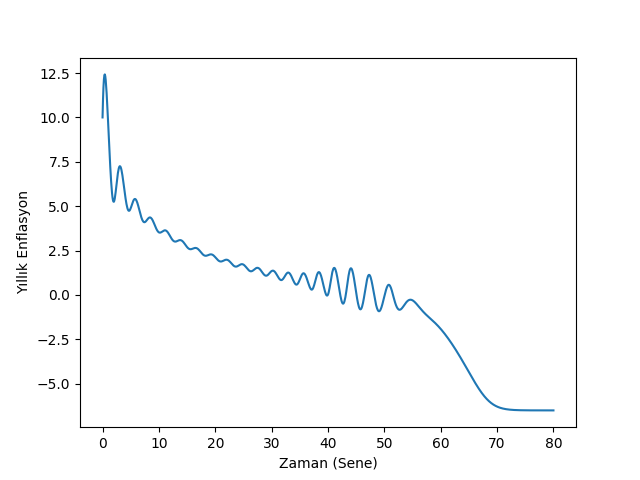
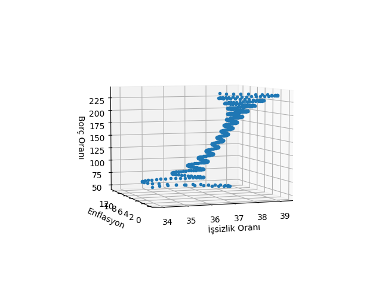

# Enflasyon

Şimdi fiyatları ekonomi modeline dahil etmeye uğraşalım. Daha önce
yaptığımız gibi ekonomik tanımları, önkabulleri formülsel olarak ortaya
koyacağız, ve ortaya çıkan modeli çözeceğiz. Tanımları ortaya koyalım,

%"Employment rises if the growth rate exceeds population growth and labor productivity.''

"Eğer büyüme oranı nüfus artışı ve işçi üretkenliğinin toplamını geçerse
istihdam artar'' 

$$ 
\frac{\dot{\lambda}}{\lambda} =
\left( 
   g -  (\alpha + \beta) 
\right)
$$

$\alpha + \beta$ işçi üretkenliği ve nüfus artışı.

$g$ büyüme oranı. Bu $g$ gerçek büyüme hızı, yatırım hızı ve onun
amortismanı üzerinden hesaplanır.

%"Wage share rises if money wage demands greater than labor productivity and
%the inflation rate''

"Eğer ücretlere giden para talebi işçi üretkenliği ve fiyat artışı /
enflasyondan fazlaysa işçi ücretlerinin payı artar''.


$$ 
\frac{\dot{\omega}}{\omega} = 
\left( 
(\underbrace{w_{fn}(\lambda)}_{A} - \underbrace{\alpha}_{B}) + \frac{1}{\tau_p}
\underbrace{\left( 1-\frac{1}{1-s} \cdot \omega \right)}_{C}
\right)
$$


A: İşçi ücret payı %Wage share 

B: İşçi üretkenliği %Labor productivity

C: Enflasyon %Inflation

% "Debt ratio will rise if debt growth rate is greater than real growth
% rate plus inlation''

"Eğer borcun artma hız gerçek büyüme hızı artı enflasyondan fazlaysa
ekonomideki özel borç oranı artar''. 

$$ 
\frac{\dot{d}}{d} = 
\underbrace{\frac{\left( \frac{I_{fn}(\pi_r)}{v} \right) - \pi_s }{d}}_{A} - 
\left[ 
\underbrace{g }_{B}+ 
\underbrace{\frac{1}{\tau_p} \left(1 - \frac{1}{1-s} \omega\right)}_{C}
\right]
$$

A: Borç büyüme hızı, $I_{fn}$ gayrı-lineer yatırım fonksiyonu  %Debt growth rate

B: Gerçek büyüme hızı %Real growth rate

C: Enflasyon

Enflasyon nasıl hesaplandı? Bunun için fiyat seviyesi $P$'yi anlamak lazım,
çünkü enflasyon fiyat seviyesinin zamana göre türevidir, $\mathrm{d} P/\mathrm{d} t$.

Fiyat seviyesi arz-talep dengesi üzerinden hesaplanabilir [2], dikkat bu
tüm ekonominin dengesi değil, satılanların alındığı dengesi. Oradan
başlıyoruz sadece, bu durumda çıktı $Q$ fiziksel talep $D$'ye
eşittir. Üretim $Q = a \cdot L$, işçi üretkenliği çarpı işçi sayısı. $L$'yi
hesaplamak için maaşlara akan para bölü maaşlar.

$$ 
L = (1-s) \frac{F_D / \tau_s}{W}
$$

$F_D/\tau_s$ GSYH'dir, $F_D$ şirketlerdeki para, $\tau_s$ onun ekonomide, o
şirketlerde ne kadar devridaim ettiği, mesela senede 3 kere, ki bu o
paranın etkisini (ve GSYH'yı) 3 kat arttırır, sonra bunu $1-s$ ile
çarpıyoruz ki bu sayı işçilerin payıdır, bu çarpım o zaman ücretlere akan
parayı bulacak. Bu sayıyı birim maaş $W$'ye bölünce kaç kişinin çalıştığını
elde ediyoruz. Demek ki üretimi

$$ Q = a \cdot (1-s) \frac{F_D / \tau_s}{W} $$

ile temsil edebilirim. 

Fiziksel talebe gelelim, bu büyüklük talebe giden para akışı bölü fiyat
seviyesi, yani harcamalar bölü $P$. Söylemek istediğimiz şirketlerin
ürettiği artı değerin fiyat seviyesi üzerinden kâra / paraya çeviriliyor
olduğu. Harcamalar yine GSYH ile gösterilebilir, yani $(F_D / \tau_s) /
P$. Dikkat edelim şimdi $1-s$ yok, 1 var, işçi ve şirket talebini birbirine
eklemiş oldum.

Şimdi $D$ ve $Q$'yu birbirine eşitleyip $P$ için çözebiliriz,

$$  a \cdot (1-s) \frac{F_D / \tau_s}{W} = \frac{(F_D / \tau_s)}{P} $$

$F_D,\tau_s$, iptal olur, tekrar düzenleriz ve geriye kalan,

$$ P = \frac{1}{1-s} \frac{W}{a}$$

Şimdi bu formülü dinamik bir hale çevirelim, yani belli bir süre sonra
$P$'nin üstteki değere yaklaştığı durumu gösterelim, 1. derece diferansiyel
denklem ile bu durumu tarif edebiliriz,

$$ 
\frac{\mathrm{d} P}{\mathrm{d} t} = 
\frac{-1}{\tau_p} \left( P - \frac{1}{1-s} \frac{W}{a} \right)
$$
 
Yani anlık $P$ iki üstteki bulduğumuz fiyat seviyesinden uzaktaysa, aradaki
fark oranında $P$ o seviyeye yaklaşacak. $\tau_p$ mühendislikten bilinen
bir kavram, yüzde 63 oranına yaklaşımın kaç günde olduğunu gösterir /
ayarlar. Genel diferansiyel denklemleri hatırlarsak mesela

$$ \frac{\mathrm{d} x}{\mathrm{d} t} = k(10-x)$$

türündeki bir denklemin çözümünün $x = 10 - C e^{-kt}$ olduğunu biliyoruz
(yerine koyup kontrol edebiliriz) ki 10 ulaşılmaya çalışan sayı, $k$ ona ne
hızda erişileceğini kontrol ediyor. $t=0,x=0$ için $C=10$, o zaman
$x = 10 (1 - e^{-kt})$ olabilir. Genelleştirip $k$ yerine $1/\tau$
kullanabilirdik,

$$ x = x_{max} (1-e^{-t/\tau}) $$ 

$t=\tau,x_{max}=1$ yapalım, $1-e^{-1}$ elde ederiz,

```python
print (1-np.exp(-1))
```

```text
0.6321205588285577
```

İşte $\tau$ değeri ulaşılmaya çalışan değerin kabaca yüzde 63'üne gelmek
için geçmesi gereken gündür tanımı buradan geliyor.

Nihai denklemler,

$$ 
\frac{\dot{\lambda}}{\lambda} =
  g - (\alpha + \beta)
$$

$$ 
\frac{\dot{\omega}}{\omega} = 
\left( 
(w_{fn}(\lambda) - \alpha) + \frac{1}{\tau_p} \left( 1-\frac{1}{1-s} \cdot \omega\right)
\right)
$$


$$ 
\frac{\dot{d}}{d} = 
\frac{\left( \frac{I_{fn}(\pi_r)}{v} \right) - \pi_s }{d} - 
\left[ 
g + \frac{1}{\tau_p} \left(1 - \frac{1}{1-s} \omega\right)
\right]
$$

$$ g = \frac{I_{fn}(\pi_r)}{v} - \delta_{Kr} $$

Farkettiysek nüfus, üretkenlik için $N,a$ değişkenleri bu sistemde yok,
çünkü bu kavramlar modelde sadece sabitleri üzerinden dahil edildiler.

```python
import scipy as sp
from scipy.integrate import odeint

def rhs(u,t,alpha, beta, delta, nu, r_b, s, tau_p, tau_i, x_i, y_i, s_i, m_i, x_w, y_w, s_w, m_w):
    lam, omega, d, i = u
    r=r_b;
    if i>0: r=r+i; 
    p=1.0-omega-r*d;
    f=-(1.0/tau_p)*(1.0-omega/(1.0-s));
    I=(y_i-m_i)*np.exp(s_i*((p/nu)-x_i)/(y_i-m_i))+m_i;
    W=(y_w-m_w)*np.exp(s_w*(lam-x_w)/(y_w-m_w))+m_w;
    return [( ((1.0/nu)*I-delta) -(alpha + beta) )*lam, \
            ( W - (alpha+f) )*omega, \
            ( I-p ) -( (1/nu)*I - delta + f )*d,\
            -(1.0/tau_i)*(i-f)]
    

alpha=0.025;     
beta=0.015;      
delta=0.07;      
nu=3.0;
r_b=0.04;        
s=0.3;
tau_p=1.0;
tau_i=0.5;
x_i=0.03;
y_i=0.03;
s_i=2.25;
m_i=0;
x_w=0.6;
y_w=0.0;
s_w=1.0;
m_w=-0.04;

# baslangic degerleri
lambda0=0.65; # istihdam
omega0=0.82; # maaslarin gsyh'eki orani
d0=0.5; # borc orani
i0=0.1; # enflasyon orani

arg0 = (alpha, beta, delta, nu, r_b, s, tau_p, tau_i, x_i, y_i, s_i, m_i, x_w, y_w, s_w, m_w)

T=80.0
t=np.linspace(0.0,T,1000)

res=odeint(rhs,[lambda0, omega0, d0, i0],t,args=arg0)
lambda1,omega1,d1,i1=res[:, 0],res[:, 1],res[:, 2],res[:, 3]
```

```python
plt.plot(t, 100.0*i1)
plt.xlabel(u'Zaman (Sene)')
plt.ylabel(u'Yıllık Enflasyon')
plt.savefig('chaos_app04_01.png')
```

```python
plt.plot(t, 100.0*d1)
plt.xlabel(u'Zaman (Sene)')
plt.ylabel(u'Özel Borcun GSYH İçinde Oranı')
plt.savefig('chaos_app04_02.png')
```




```python
last=500;
x1=100.0*(1.0-lambda1[:last]);
x2=100.0*i1[:last];
x3=100.0*d1[:last];

from mpl_toolkits.mplot3d import Axes3D
from matplotlib import cm
fig, ax = plt.subplots(1, 1, subplot_kw={'projection': '3d'})
ax.plot(x1,x2,x3,'.')
ax.set_xlabel(u'İşsizlik Oranı')
ax.set_ylabel(u'Enflasyon')
ax.set_zlabel(u'Borç Oranı')
ax.view_init(elev=5, azim=250)
plt.savefig('chaos_app04_03.png')
```



Sistemin sayısal çözümünü yapınca olanları görüyoruz (kod [3]'ü baz
aldı). Belli bir "büyük ılımlılık" sonrası enflasyon çakılıyor, ve borç
oranı tavan yapıyor. 2008 krizinde de aynen böyle olmuştu.

Kaynaklar

[1] Keen, *A monetary Minsky model of the Great Moderation and the Great Recession*

[2] *Greenwich-Kingston PhD students lecture: the logic  maths of modelling Minsky (2)* [http://youtu.be/0Do05hV_Iqo?t=1200](http://youtu.be/0Do05hV_Iqo?t=1200)

[3] Jelonek, *Numerical techniques in MATLAB: differential equations and non-linear dynamics* [https://warwick.ac.uk/fac/soc/economics/current/modules/rm/notes1/research_methods_matlab_3.pdf](https://warwick.ac.uk/fac/soc/economics/current/modules/rm/notes1/research_methods_matlab_3.pdf)


