# Ders 1.4

(Dirac) Delta fonksiyonları

Bugün şu türdeki diferansiyel denklemlere bakacağız

$$ -\frac{d^2u}{dx^2}=\delta(x-a) $$

$$ u(0) = 0, \ u(1) = 0 $$

Bu denklem $a$ noktasında bir noktasal yükü temsil ediyor, delta denklemi
$\delta$ işareti ile gösteriliyor, delta kelimesi fizikte ve matematikte
genelde "farklılık'' anlamında kullanılır. Fonksiyonel anlamda $\delta$
sıfır olduğu yerde sonsuzluk değeri verir, geri kalan her yerde sıfır
değeri verir.

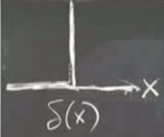

Eğer 0 yerine başka bir noktada ağırlık koymak istiyorsak, $x-a$
kullanabiliriz, böylece $\delta(..)$'ya $a$ üzerinde sıfır gider, ve o
nokta sonsuz değeri döndürür.

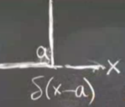

Not: Noktasal yük fiziksel olarak olasılığı az bir olay olabilir. 

Delta fonksiyonlarının bazı özellikleri

$$ \int_{-\infty}^{\infty} \delta(x) \mathrm{d} x = 1 $$

[Ek bilgiler için ders sonuna bakılabilir]. Yani delta fonksiyonunun tamamının
altında kalan alan 1 değerine eşittir. Daha genel olarak düşünelim. Delta
fonksiyonunu başka bir fonksiyona "karşı'' (onunla çarparak) entegre edersem ne
olur?

$$ \int_{-\infty}^{\infty} \delta(x)g(x) \mathrm{d} x = g(0)$$

Bu eşitliğin ispatı dokümanın altında.

Grafiksel olarak delta fonksiyonunu entegre edince şunu elde ederiz

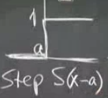

Bu fonksiyona adım (step) fonksiyonu, ya da Heaviside fonksiyonu adı
veriliyor. 

Bir kez daha entegre edince

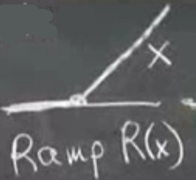

Yokuş (ramp) fonksiyonu elde ediyoruz. Bir kere daha entegre

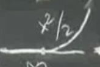

Bir kere daha

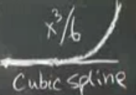

Bu son fonksiyon küpsel spline fonksiyonudur, söyle ifade edilir:

$$ C = 
\left\{ \begin{array}{ll}
0 & x \le 0 \\
x^3 / 6 & x \ge 0
\end{array} \right.
$$

Şimdi tersten düşünelim, bir spline $C$'nin üç kere türevini alsak, sıfır
noktasında hangi değer geri gelir? $C'''(0) = 1$ değeridir, sıfırdan önce
ise sıfırdır. Bu ilginçtir, küpsel spline son derece pürüzsüz (smooth) bir
fonksiyondur, fakat, türeve bakınca iyice anlıyoruz ki, aslında iki tane
farklı fonksiyondur. Küpsel spline'ların bu özelliği CAD programlarında,
çizimlerde çok ise yarıyor.

Dört kere türevi alırsak yani $C''''$ nereye geliriz? $\delta$ fonksiyonuna
döneriz. 4. türev diferansiyel denklemlerde kullanılır, 4. türevin bir yüke
eşitlinmesi çubukların (beam) bükülmesini modellerken kullanılır. Biyoloji,
mekanik konularında çoğu denklem 2. seviyedendir, 4. seviye nadirdir. 

Başa dönersek: şu denklemin genel çözümü nedir?

$$ -\frac{d^2u}{dx^2}=\delta(x-a) $$

İlk önce özel (particular) çözümü bulalım. İkinci türevinin negatifi delta
fonksiyonu olan fonksiyon nedir? Üstte ardı ardına entegre ederken zaten bunu
irdelemiştik, işareti değiştiriyoruz tabii çünkü şimdi negatiflik var, ama
aradığımız yokuş fonksiyonu.

$$ u(x) = -R(x-a) $$

İşimiz bitti mi? Hayır. İkinci türevin sıfıra eşit olduğu iki çözüm daha
lazım, iki homojen çözüm yani, bunlardan biri $C$ diğeri $Dx$. Çünkü
elimizde tatmin edilmesi gereken iki tane sınır şartı var. 

$$ u(x) = -R(x-a) + C + Dx$$

Sınır şartlarını yerine koyalım

$x=0$ için $0 = 0 + C + 0$. Rampa fonksiyonu $a$'dan yükselmeye başlayan,
eğimi $x-a$ olan, başlangıçta sıfır olan bir fonksiyondur. 

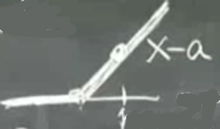

$x=1$ noktasında rampanın fonksiyonunun değeri $1-a$'dir. 

Yerine koyalım: $C = 0$. Onu kullanarak devam edelim, ikinci şart için:

$$ u(x) = -R(x-a) + C + Dx $$

$$ -(x-a)+C+Dx = 0 $$

$C = 0$ ise

$$ -(1-a) + D = 0 $$

$$ D = 1-a $$

Tamamı

$$ u(x) = -R(x-a) + (1-a)x $$

$a$ noktası sonrasında rampa fonksiyonu $x-a$ olduğuna göre

$$ -(x-a) + (1-a)x = -x + a + x -ax = a - ax = a(1-x)$$

Grafik

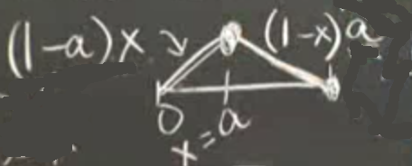

$u(x)$'in kesintisiz (continuous) bir fonksiyon olduğunu
söyleyebiliriz. $u'(x)$ 1 kadar aşağı iner. Eğimi (slope) grafiklersek
nasıl olur?

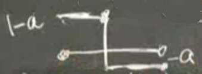

Problemi fiziksel şekilde görsellemek gerekirse, iki ucu sabitlenmiş
elastik çubuğu çizelim:

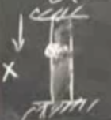

Çubuğun üzerindeki noktayı oraya asılmış bir ağırlık olarak
düşünelim. $\delta(x-a)$ ile belirtmeye çalıştığımız bu değil mi, bir
noktaya konsantre bir ağırlık uyguluyoruz. Bu ağırlığı uygulayınca ne olur?
Nokta altında sıkışma, üstünde ise esneme olur. 

$u(x)$ tabii ki hep pozitiftir, yani çubuğun tüm noktaları aşağı iner. Ama
bazı noktalar üzerinde sıkışma, pozitif eğim, diğerleri üzerinde esneme
(negatif eğim) vardır. 

Bir ucu serbest, diğeri sabitlenmiş problemi çözelim. 

$$ u'' = \delta(x-a) $$

$$ u'(0) = 0, \ u(1) = 0 $$

Şartları kullanınca, 

$$ u(x) = - R(x-a) + Cx + D $$

$x=0$ noktasında rampa daha başlamadı, $Cx + D$ kalır, türevi $C$, eşittir
sıfır. $C = 0$. $u(x)$ grafiği neye benzer?

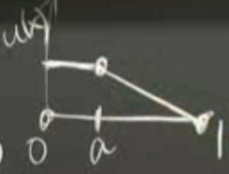

Elastik çubuğa ne olacak?

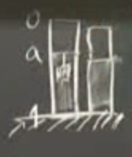

Gri olarak nitelenen yer $a$'nin altında olan yer, ve o bölüm bir sıkışma
yaşadı. Onun üstündeki bölüm de tamamen aşağı doğru indi, ama tüm noktaları
aynı miktarda aşağı indi, o bölgede $x$ değiştikçe "değişim değişmiyor'',
ki $u'$ türevinin tanımı bu değil mi? 

Soru: $u(x)$'in y eksenini kestiği noktadaki değeri nedir? Grafiğe bakalım,
$a$ sonrası aşağı doğru inen eğim -1. $a$ sonrası $u(x)=1-x$ ve iniş x
ekseninde 1 noktasına doğru. $u(x)$ y eksenini nerede kesiyor olabilir?
Eğer $u(x) = 1 -a$ ise, ancak o zaman $a$ noktasında önce ve sonra değerler
aynı sonucu verir. 

Problemi ayrıksal olarak çözelim. $h = 1/6$ olsun, o zaman ayrıksal $u$ 5
elemana sahip olacak. Önce sabit / sabit problemini çözelim. 

$$ 
KU = 
\left[\begin{array}{r}
0\\
1\\
0\\
0\\
0
\end{array}\right] 
=
\left[\begin{array}{rrrrr}
2 & -1 & & & \\
-1 & 2 & -1 &  & \\
 &  -1 & 2 & -1 &  \\
 &  & -1 & 2 & -1 \\
 &  & & -1 & 2\\
\end{array}\right]
\left[\begin{array}{r}
u_1\\
u_2\\
u_3\\
u_4\\
u_5
\end{array}\right]
$$

Eşitliğin sağ tarafındaki vektör içinde ikinci hücrede 1 değeri var. O
bizim daha önce $\delta(x-a)$ ile belirttiğimiz noktasal ağırlık. $K$'nin
üst sol köşesindeki değeri 2 olarak seçmekle sabit / sabit sınır şartlarını
koymuş oluyoruz. 

Problemin cebirsel çözümünü tekrar yazalım, ama bu sefer rampa fonksiyonu
kullanmadan, parça parça yazalım, böylesi daha temiz olacak.

$$ 
u(x) = 
\left\{ \begin{array}{ll}
1-a & x \le a \\
1-x & x \ge a 
\end{array} \right.
$$

Sonuç ayrıksal olarak şu şekilde çizilebilir:

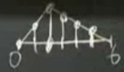

Aslında eşitliğin sağ tarafında delta (ve sabit) olduğu şartlarda
"şanslıyız'' çünkü bu durumlarda ayrıksal sonuç gerçek sonucun tam üstünde
çıkıyor. Bu şanslılığın sebebi, aslında, üstteki deltadan basamağa, oradan
rampaya, vs. geçmek için kullandığımız entegral yerine, ayrıksalda toplama
kullanınca anlaşılıyor, o geçiş sırasında da toplamlar ve entegraller
tam uyum halindeler, bu da doğal olarak diferansiyel denkleme yansıyor. 

Neyse, sayıları da yerine koyarak elle bulunabilecek bir sonuca
erişebiliriz.

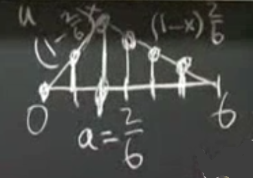

Ekler

Dirac fonksiyonu

$$
\delta(x-x') =
\left\{ \begin{array}{ll}
\infty & x = x' \\
0 & x \ne x'
\end{array} \right.
$$

dedik. Bu fonksiyonu bir olasılık dağılımı gibi görmek te mümkün, çünkü Dirac
fonksiyonlarının bir diğer sonucu,

$$
\int_\Omega \delta(x-x') \mathrm{d} x' = 1
$$

olması, ki $\Omega$, $x$'i içeren üzerinden entegral alınan hacim. Olasılık
yoğunluğu üzerinden entegral hep 1 değeri vermez mi? Eğer $r = x-x'$ olarak
düşünsek,

$$
\delta(r) =
\left\{ \begin{array}{ll}
\infty & r = 0 \\
0 & \text{diğer}
\end{array} \right.
$$

ile, tek değişken üzerinden entegral ile olasılık bağlantısı daha rahat
görülebilirdi.

Bu bağlamda Dirac delta fonksiyonu ya da dağılımı bir Gaussian dağılımının
varyansı limitte sıfıra giderken ki hali olarak ta görülebilir. Varyans
küçüldükçe tepe noktası daha yükselecek, ve nihai olarak sonsuzluğa
gelecektir. Amam dağılım hala dağılım, tüm tanım alanı üzerinden entegral değeri
1.

Çekirdek (Kernel) Kullanımı ve Dirac

Dirac fonksiyonu çekirdek yaklaşıklama için, ağırlıklı ortalama bağlamında da
kullanım bulabiliyor; mesela bir fonksiyonun ağırlıklı ortalamasını alıp bunu
bir diğer fonksiyon olarak göstersek, ya da o fonksiyounun o noktadaki yaklaşık
temsili olarak görmek istesek, bunu bir $W$ ağırlık fonksiyonu ile şu şekilde
gösterebilirdik,

$$
f(x) \approx \int_\Omega f(x') W(x-x',h) \mathrm{d} x'
$$

ki $h$ dışarıdan tanımlanan bir sabit olabilir ($h$ bir etki alanını tanımlayan
bir sabit gibi kullanılabilir), mesela [3, sf. 16] çok boyutlu bir $W$,

$$
W(\bar{r},h) = \frac{315}{64 \pi h^9}
\left\{ \begin{array}{ll}
(h^2 - ||\bar{r}||^2)^3 & 0 \le ||\bar{r}|| < h \\
0 & ||\bar{r}|| > h
\end{array} \right.
$$

olabilirdi, ya da tek boyutta

$$
W(x,h) = \exp (-x^2 / h^2) / (h\sqrt{\pi})
$$

Ağırlık deyince alttaki de doğru olmalı,

$$
\int_\Omega  W(x-x',h) \mathrm{d} x' = 1
$$

Böylece olasılık yoğunluk dağılımı kavramına dönmüş olduk. Şimdi $W$ yerine
Dirac fonksiyonu kullansak [2, sf. 196],

$$
f(x) = \int_\Omega f(x') \delta(x-x') \mathrm{d} x'
$$

Yani bir fonksiyonun herhangi bir tanım alanı içinde Dirac fonksiyonu üzerinden
ağırlıklı ortalaması yine kendisidir! Bu normal çünkü $x$ haricinde başka hiçbir
yerde ağırlık yok!

Kaynaklar 

[1] Olver, *Applied Mathematics*

[2] Liu, *Particle Methods for Multi-scale and Multi-physics*

[3] Kelager, *Lagrangian Fluid Dynamics Using Smoothed Particle Hydrodynamics*

