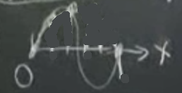

# Ders 1.6

Özvektör formülüne tekrar bakalım

$$ Ay = \lambda y $$

Şimdi tüm özvektörler aynı anda tek bir matris içinde olacak şekilde
üstteki formülün her özvektör için işleyecek "kombine'' bir halini
yazabiliriz. $y_i$ vektörünün tüm bir kolonu kaplayacak şekilde matrise
yazıldığını düşünüyoruz. 

$$ 
A 
\left[\begin{array}{cccc}
\uparrow & \uparrow &  & \uparrow \\
y_1 & y_2 & ... & y_n \\
\downarrow & \downarrow &  & \downarrow 
\end{array}\right]
= 
\left[\begin{array}{cccc}
&&& \\
Ay_1 & Ay_2 & ... & Ay_n \\
&&& 
\end{array}\right]
$$

Buna göre üstteki eşitliğin sağındaki çarpım da mantıklıdır.Peki $Ay_i$
çarpımı tanıdık gelmiyor mu? Çarpım özvektör, özdeğer formülü. O zaman
$Ay_i = \lambda y_i$. Demek ki,

$$ 
\left[\begin{array}{cccc}
&&& \\
Ay_1 & Ay_2 & ... & Ay_n \\
&&& 
\end{array}\right]
= 
\left[\begin{array}{cccc}
&&& \\
\lambda_1y_1 & \lambda_2y_2 & ... & \lambda_ny_n \\
&&& 
\end{array}\right]
$$

$\lambda$'ları dışarı çekebiliriz. 

$$ 
= \left[\begin{array}{cccc}
&&& \\
y_1 & y_2 & ... & y_n \\
&&& 
\end{array}\right]
\left[\begin{array}{cccc}
\lambda_1 &&& \\
& .. && \\
&&& \lambda_n \\
\end{array}\right]
$$

$\lambda$ matrisinde $\lambda$ olmayan yerler sıfır değerini
taşıyor. Özvektör matrisini $S$ olarak, çaprazında özdeğerleri taşıyan
matrisi $\Lambda$ olarak nitelersek

$$ AS = S\Lambda $$

Eğer üstteki $S$ (ya da herhangi bir) matrisinin tüm kolonları birbirinden
bağımsız ise $S$ tersine çevirelebilir (invertible) demektir. O zaman şunu
yapabiliriz:

$$ A = S \Lambda S^{-1} $$

Bu forma matrisin köşegenleştirilmesi (diagonalization) deniyor. 

Biraz zihin egzersizi: $A^2$ ne olur? 

$$ A^2 = (S \Lambda S^{-1})(S \Lambda S^{-1}) $$

$$ = S \Lambda S^{-1}S \Lambda S^{-1} $$

ortadaki $S$ ve $S^{-1}$ birbirini iptal eder. 

$$ = S \Lambda^2 S^{-1} $$

Bu bana ne söylüyor? $A^2$'nin özvektörleri $A$ ile aynı, çünkü formülün
$S$ ve $S^{-1}$ içeren kısmı değişmedi, özdeğerler ise $A$'nin
özdeğerlerinin karesi. Bu önceden bulduğumuz $A^2y = \lambda^2y$ sonucu 
ile uyuşuyor.

Peki, diyelim tersine çevirilebilir ise, $A^{-1}$ nedir? Ana formülden 
başlayalım

$$ A = S \Lambda S^{-1} $$

Tersine çevirme işlemi eşitliğin sağ tarafında parantezin içinin sırasını
değiştirir, sonra tersine çevirir, $S^{-1}$ ile başlarız, onun tersi $S$,
vs, ve sonuç

$$ A^{-1} = S \Lambda^{-1}S^{-1} $$

Özvektörler matrislerinin yeri ve içeriği değişmedi. Değişik olan tek şey
$\Lambda^{-1}$ ki bu matris içinde $1/\lambda_1$, $1/\lambda_2$, .. gibi
değerler olacak. Diğer bir açıdan kontrol edelim:

$$ Ay = \lambda y $$

$$ y = \lambda A^{-1} y $$

$$ \frac{1}{\lambda}y =  A^{-1} y $$

Bu üstteki sonuç ile aynı şeyi söylüyor. $A^{-1}$'in tersi aynı $y$
özvektör(ler)e sahip, ve solda olan özdeğer öncekine kıyasla $1/\lambda$
değerinde. 

Tabii tüm bunlara başlamadan önce "$\lambda$'nin sıfır olmadığı
durumlarda'' demeliydim, çünkü bu sıfırlık durum bize $A$'nin tersine
çevirilir olmadığı yönünde bir işaret olurdu. Terminoloji olarak bir tane
bile sıfır özdeğer $A$ eşsiz (singular) demektir, eğer hiçbiri sıfır
değilse $A$ tersine çevirilebilir demektir.

Bir simetrik $K$ matrisini ele alalım, simetrik olduğu için tüm özdeğerleri
reel sayılar, ve özvektörleri birbirine dikgen (orthagonal). 

Dik yerine normalize edilmiş de diyebilirdik, sayısal paketler çoğunlukla
birimselleştirilmiş, yani uzunluğu 1 olan vektörler döndürür, ve
özdeğer/vektör ikilisi için zaten yön önemlidir, hem özdeğer hem özvektörü
2 ile çarpıp aynı şeyi elde edebiliriz mesela.

Uzunluktan bahsederken, onu daha önce $y_i^T \cdot y_j$ olarak gösterdik,
ki simetrik bir matrisin dik özdeğerleri için bu $y_i^T \cdot y_j = 0, \ i
\ne j$. Normalize edilmiş bir özvektörün kendisi ile noktasal çarpımı nedir? 
$y_i^T \cdot y_i = 1$ çünkü vektör birimsel, uzunluğu 1. Tüm
özdeğerleri içeren matris üzerinden bu hesabı yapabilir miyiz? Daha önce
yarattığımız şu matris ile başlayalım:

$$ 
\left[\begin{array}{cccc}
\uparrow & \uparrow &  & \uparrow \\
y_1 & y_2 & ... & y_n \\
\downarrow & \downarrow &  & \downarrow 
\end{array}\right]
$$

sol tarafına devriğini (transpose) koyalım

$$ 
\left[\begin{array}{ccc}
\leftarrow & y_1^T & \rightarrow \\
 & ... & \\
\leftarrow & y_n^T & \rightarrow 
\end{array}\right]
\left[\begin{array}{cccc}
\uparrow & \uparrow &  & \uparrow \\
y_1 & y_2 & ... & y_n \\
\downarrow & \downarrow &  & \downarrow 
\end{array}\right]
$$

Bu çarpımı yaparsak sonuç ne olacak? Mesela $y_1^T$ ile $y_1$ çarpımı 1
değerinde, $y_1^T$ ile diğer her çarpım sıfır. Böyle gider. Ve sonuç olarak
çaprazında 1 diğer her yerinde 0 içeren birim (identity) matrisini elde
ederiz.

Üzerine basarak söyleyelim, bu simetrik matrisler için, çünkü diğer $A$
matrisleri için özvektörlerin hepsinin birbirine dik olmasını
bekleyemeyiz. 

Devam edelim, o zaman üstteki hesabı kısaca gösterirsek

$$ S^T S = I $$

Bu hakikaten çok önemli bir sonuç. 

Üsttekinin doğru olduğu durumlarda $S$ harfini değiştirirsek aslında daha iyi
olur böylece özvektör matrisinin bir simetrik $K$ matrisinden geldiğini
daha iyi görürüz. Bu durumlarda $Q$ harfini kullanalım. 

$Q$'ye bir "dik matris'' te denebilir, çünkü $Q^TQ = I$. Bu ifadeye
bakarak başka bir şey daha söyleyebiliriz, $Q$'yu başka *ne* soldan
çarparsa sonuç birim matristir? $Q^{-1}$. O zaman $Q^T = Q^{-1}$ de
diyebiliriz.

Bir dik matris örneği görelim:

$$ 
\left[\begin{array}{cc}
\cos \theta & -\sin \theta \\
\sin \theta & \cos \theta \\
\end{array}\right]
$$

İlk kolona bakalım, uzunluğu hakikaten 1, çünkü $\cos \theta ^2 + \sin \theta
^2 = 1$. Diğer kolon da ona dik, 1. kolon ile çarpılınca sonuç sıfır olacak. 

Not: Üstteki matrise "$\theta$ kadar döndüren matris'' ismi de verilir,
eldeki bir $v$ vektörünü $Q$ ile çarpımı, yani $Qv$, o vektörü uzunluğunu
değiştirmeden $\theta$ kadar döndürecektir.

Devam edelim

$$ K = S \Lambda S^{-1} $$

$S$ yerine $Q$ kullanmaya karar vermiştik

$$  K = Q \Lambda Q^{-1} $$

O zaman, daha önceden gördüğümüz eşitlik üzerinden, 

$$  K = Q \Lambda Q^{T} $$

Şu güzelliğe bakın. Buna mekanikte asal eksen teoremi (principal axis theorem),
matematikte spektral teoremi (spectral theorem), kuantum mekanikte
köşegenleştirme (diagonalization) ismi verilir, her yerde ortaya çıkar, pek çok
şekilde kullanılır. Ne zaman elde bir simetrik matris var ise, o zaman üstteki
tanım kullanılabilir demektir.

$K$ matrisine geri dönelim. 

$$ 
K =
\left[\begin{array}{rrrrr}
2 & -1 &&& \\
-1 & \ddots & \ddots && \\
& \ddots &&& \\
&&&& \\
&&&& 
\end{array}\right]
$$

Bu matris ikinci farklılıkları ayrıksal olarak temsil etmek için
kullanılmıştı, esnek çubuğu temsil ettiği zaman sabit / sabit problemini
çözüyordu. $K$ sürekli (continuous) bağlamda hangi diferansiyel
denklemi temsil edecektir? $-d^2y/dx^2$.  Özdeğer, özvektör olarak ise

$$ Ky = \lambda y $$

Şöyle bir geçiş yapılabilir

$$ -\frac{d^2y}{dx^2} = \lambda y(x) $$

Burada ilginç bir numara var: daha önce sürekli fonksiyondan başlıyorduk,
sonra $K$ matrisi üzerinden ayrıksal hale geçiriyorduk. Hoca burada
özdeğer, özvektör formundan başladı, ve sürekli forma geçti. Sonra üstteki
denklemin çözümünü bulunca, tekrar geri gidecek, ve ayrıksal olarak
özvektörlerin birbirine dikliğini göreceğiz, ve bunun sürekli bağlamda da
hala geçerli olduğunu anlayacağız. 

Çözümü bulmak için tahmin yöntemini kullanalım: hangi fonksiyonun ikinci
türevinin negatifi, o fonksiyonun katını verir? Sin ve cos fonksiyonları,
yani $y$ $\sin \omega x$, $\cos \omega x$ olabilir, ya da onların birleşimi
olarak üstel $e^{-i\omega x}$, $e^{i\omega x}$ formunda olabilir.

Eğer $y$ için $\sin, \cos$ kullanırsak özdeğer ne olur? Yerine koyarsak
görürüz, $\sin\omega x$'in iki kere türevini alırsak $\omega$ iki kere
dışarı çıkar, arada bir eksi değeri mutlaka ortaya çıkar (çünkü 
$\cos'\theta = -\sin\theta)$, eksi ile eksi çarpılır, sonuç $\omega^2$. 
Hatta üstteki tüm $y$ seçenekleri için sonuç aynıdır. 
 
Sınır koşullarını unutmayalım tabii. Problemin tamamı

$$ -\frac{d^2y}{dx^2} = \lambda y(x) $$

$$ y(0) = 0, \ y(1) = 0 $$

Sınır koşulları sayesinde tüm $\sin$, tüm $\cos$ fonksiyonları arasından belli
bazılarını seçebileceğiz. En basit eleme $y(0) = 0$, bu şart sayesinde cos
fonksiyonlarının tamamı elenir. Değil mi? Çünkü $\cos(0) = 0$ doğru
olamaz. Diğer şarta bakalım, $y(1)$ üzerinden $\sin(\omega) = 0$ olur,
tersinden düşünürsek $\sin(\omega)$ ile sıfır değeri verecek $\omega$ ne
olabilir? $\pi$ olabilir. O zaman bir çözüm bulduk:

$$ y_1 = \sin \pi x $$

Elimizdeki ilk "özfonksiyon (eigenfunction)'' bu. Özdeğeri nedir?

$$ \lambda_1 = \pi^2 $$

çünkü üstte belirttik, $\omega^2$, o zaman $\pi^2$. 

İkinci değer ne olur? $2\pi$. 

$$ y_2 = sin2\pi x, \ \lambda_2 = (2\pi)^2 = 4\pi^2 $$

Eğer sınır şartlarını değiştirseydim, serbest / serbest, serbest / sabit
gibi, o zaman farklı $y$ değerleri elde ederdim. Mesela ilk sınır şartı
$y'(0) = 0$ olsaydı, sin fonksiyonları yerine cos fonksiyonları elde
ederdik, sin elenirdi çünkü sin'in türevi $\cos(0) = 0$ doğru bir ifade
olamazdı. 

Ayrıksal olarak temsil edersek, $\sin\pi h$ ve $h = 1 / n+1$, $n = 4$
kullanalım

$$ 
y_1 = 
\left[\begin{array}{c}
\sin \frac{\pi}{5} \\
\sin \frac{2\pi}{5} \\
\sin \frac{3\pi}{5} \\
\sin \frac{4\pi}{5} 
\end{array}\right]
$$


Bu da ikinci özvektör (özfonksiyon). 

$$ 
y_2 = 
\left[\begin{array}{c}
sin \frac{2\pi}{5} \\
sin \frac{4\pi}{5} \\
sin \frac{6\pi}{5} \\
sin \frac{8\pi}{5} 
\end{array}\right]
$$



Özvektörler olduğunu söylemekle ikinci bir şey daha söylüyoruz, bu iki
vektör birbirine dik. Buradan hareketle $\sin(\pi x)$ fonksiyonu (iki
üstteki resim) $\sin(2\pi x)$ fonksiyonuna (bir üstteki resim) dik
diyebilirdik, ki hakikaten öyledir. Hatta bu matematiksel durum Fourier
Serilerinin işlemesini sağlayan önemli bir etkendir.

Bu bağlantıdan devam edelim: pür vektörler olduğu zaman diklik kontrolü için
$y_1^T \cdot y_2$ diyordum, ve $y_1$ ve $y_2$'nin eşleşen elemanları birbiriyle 
çarpılıp, bu sonuçlar teker teker toplanıyordu. Elimde $y_1$ ve $y_2$ için 
birer fonksiyon var ise, bir tarafta $\sin(\pi x)$ var, her $x$ için değişik
değerler veriyor, diğer tarafta $\sin(2\pi x)$ var, bunları çarpıp toplamam
lazım. Ama elimde teker teker toplayabileceğim değerler olmadığı için ($x$ reel
bir sayıdır, belli bir aralıkta bile sonsuz tane değere sahip olabilir), o
zaman toplama yerine entegrasyon kullanmam lazım. O zaman

$$ y_1^T \cdot y_2  = \int_0^1 (\sin \pi x)(\sin 2\pi x) \mathrm{d} x  $$ 

Sonuç sıfır gelecek, çünkü iki fonksiyon birbirine dik.

Soru 1.5.3

```python
import scipy.linalg as lin

def ktbc(n):
    vec = np.zeros((1,n))
    vec[0,0] = 2
    vec[0,1] = -1
    K = lin.toeplitz(vec)
    T = np.copy(K)
    T[0,0] = 1
    B = np.copy(K)
    B[0,0] = 1
    B[n-1,n-1] = 1
    C = np.copy(K)
    C[n-1,n-1] = 1
    
    return K, T, B, C

import scipy.linalg as lin, sys
sys.path.append("../compscieng_1_01")
import ktbc

K,T,B,C =  ktbc.ktbc(5)

u,v=lin.eig(K)

print (u)

print (2-np.sqrt(3), 2-1, 2-0, 2+1, 2+np.sqrt(3))

print (2*np.ones((5,1)).T - 2*np.cos((np.arange(5)+1) * np.pi/6))
```

```
[ 3.73205081+0.j  3.00000000+0.j  2.00000000+0.j  0.26794919+0.j
  1.00000000+0.j]
0.267949192431 1 2 3 3.73205080757
[[ 0.26794919  1.          2.          3.          3.73205081]]
```


