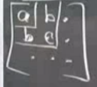
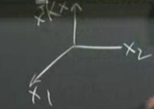
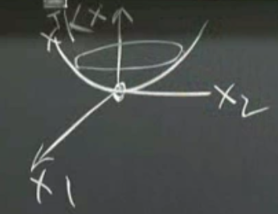
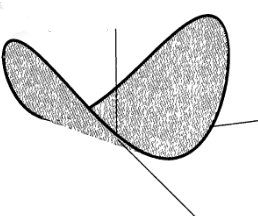
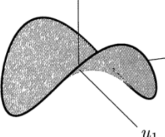

# Ders 1.7

Bugün pozitif kesinlik (positive definite) günü. Şimdiye kadar lineer
cebirin temellerini işledik, bundan sonra uygulamalara daha ağırlık
vereceğiz, tabii ki matrisler yapacağımız her şeyin temelinde olmaya devam
edecekler. Konuya şu açılardan yaklaşacağız:

1) Testler 2) Anlam 3) Uygulamalar

İlk önce testler. Pozitif kesinlik kelimesi söyleyince matrisin simetrik
olduğunu anlamak gerekiyor, yani matrisin reel özdeğerleri var, ve pek çok
diğer özelliği de var muhakkak, mesela özvektörlerinin birbirine dik olması
gibi. Bu derste daha fazla özellik göreceğiz, ve bu ekstralar özellikler
uygulamalarda hakikaten müthiş faydalar sağlıyorlar.

Daha önce söylediğimiz gibi pozitif kesinlik lineer cebirin tamamını bir
araya getirir. Testleri şunlardır:

1) Tüm pivotlar $>$ 0 

2) Tüm üst sol determinantlar (upper left determinants)  $>$ 0

3) Tüm özdeğerler $>$ 0

"Üst sol'' ile neyi kastediyorum? 3x3 bir matriste (alttaki resim) kareye
alınılmış bölümlerden. Bunlardan birincisi sadece $a$ değerini
veriyor. İkinci üst sol determinant $ac - b^2$ (iki tane $b$ var çünkü
matris simetrik, unutmayalım) değerini veriyor, vs. Bu iki değerin de
sıfırdan büyük olması gerekiyor. Tabii ki ana determinantın da $>$ 0 olması
gerekiyor. Doğal olarak $ac > b^2$, çaprazdaki çarpım, çapraz dışındaki
değerlerin çarpımını "pozitiflikte geçmeli'', başka türlü çıkarma işlemi
pozitif sonuç vermezdi.

Anlama gelelim. Pozitif kesinlik kavramı, bir eğrinin [eliyle dışbükey bir
parabol hareketi yapıyor, onun alt noktasını kastederek] minimumunu bulmak
ile yakından alakalı, ya da "enerjiyi azaltma'' problemleriyle alakalı. Bu
fiziksel anlamı bu özelliğin uygulamalarda niye bu kadar faydalı olmasının
da bir sebebi aslında. $x$'in bir fonksiyonunu hayal edelim:

$$ f(x) = x^TKx $$

ve diyelim ki $K$

$$ 
\left[\begin{array}{rr}
a & b \\
b & c
\end{array}\right]
 $$

bu derste $x$'in kendisi ile çarpımını ilk kez kullanıyoruz bu arada. Bu
form doğal olarak karesel bir sonuç ortaya çıkartacak. Biraraya koyarsak

$$ f(x) =
\left[\begin{array}{rr}
x_1 & x_2 
\end{array}\right]
\left[\begin{array}{rr}
a & b \\
b & c
\end{array}\right]
\left[\begin{array}{r}
x_1 \\ x_2 
\end{array}\right]
 $$

Sonuç hangi boyutlarda çıkar?

$$ f(x) = \underbrace{x}_{1xn}^T\underbrace{K}_{nxn}\underbrace{x}_{nx1} $$

Zinciri takip edersek, 1x1 boyutlarında. Temel lineer cebirden hatırlarsak,
$N \times M$ ve $M \times K$ çarpımı $N \times K$ boyutlarında bir matris
çıkartır. Elde edeceğimiz $1 \times 1$ ise, bu tek bir sayıdır. Tek sayının
bileşenleri nedir? Çarpımı cebirsel olarak takip edersek

$$ = ax_1^2 + 2bx_1x_2 + cx_2^2 $$

İşte "enerji'' formülü bu, bu forma niye enerji dediğimiz ileriki
derslerde uygulamalara girince daha da iyi belli olacak. Formun çok önemli
bir anlamı var. 

Bu noktada üstte belirttiğim testlere bir 4. kalem ekleyebilirim, hatta
önemini belirtmek için başına yıldız bile koymak düşünülebilir!

4) $x=0$ haricindeki tüm $x$'ler için $x^TKx > 0$.

Bu son formülü açıklamak için bir grafik çizelim. 

Değişen her $x_1$ ve $x_2$'ya göre hesaplanan, çizilen $x^TKx$'in grafiği
yani. Bu grafik neye benzerdi acaba? Sıfırdan başlarsam hep yukarı gider
değil mi? Bir kapa benzerdi, ve resmi aşağı yukarı şöyle olurdu. 

$K$ yerine diğer bazı pozitif kesin matrisleri düşünelim. Mesela birim
matris hangi $f(x)$'e sebep olur? $x_1^2 + x_2^2$, ki bu formülde mükemmel
bir kap şeklini ortaya çıkartır. Ya şu matris olsaydı?

$$ 
\left[\begin{array}{rr}
1 & 2 \\
2 & 9
\end{array}\right]
 $$

Sonuç $x_1^2 + 4x_1x_2 + 9x_2^2$ olurdu, o zaman şekil üst kesitinde daha
eliptik bir şekilde olurdu. Üstteki matriste 2 değerinden yukarı
çıkabiliriz, ama pozitif kesinlik istiyorsak bu $9 \cdot 1$'i geçmeyecek
kadar olmalı.

İlginç bir durum pozitif kesinliğin tam sınırındaki durumdur. Matematikte
bu tür sınır şartları anlamak bütünü kavramakta faydalı oluyor. Mesela
üstteki örnekte 2 yerine 3 olsaydı o zaman

$$ 
\left[\begin{array}{rr}
1 & 3 \\
3 & 9
\end{array}\right]
 $$

Bu matrise bakalım, ikinci kolon birincisinin "katı'' olduğu için hemen
bu matrisin eşsiz olduğunu anlıyoruz. O zaman özdeğerlerinden biri
kesinlikle 0 olmalı. Matrisin izi özdeğer toplamını verdiğine göre ikinci
özdeğer 10. Formülü neye benzer? $x_1^2 + 6x_1x_2 + 9x_2^2$. Bu tür
matrislere pozitif yarı-kesin (semi-definite) deniyor. Özdeğerleri $\ge 0$,
determinantları $\ge 0$, ve sebep oldukları $f(x) \ge 0$, yani enerjileri
$\ge 0$. 

Mantık yürütmeye devam edelim. Pozitif yarı kesinlik eşsiz bir matrisin
olduğu anlamına geliyorsa, o zaman bazı $x$ değerleri için $f(x)$ sıfır
olacak demektir. Üstteki örnekte bu hangi değer? [3 -1]'i deneyelim, ve
çarpımı yapalım

$$ 
\left[\begin{array}{rr}
1 & 3 \\
3 & 9
\end{array}\right]
\left[\begin{array}{r}
3 \\
-1
\end{array}\right] =
\left[\begin{array}{r}
0 \\
0
\end{array}\right] 
 $$

Hakikaten de $x_1 = 3$ ve $x_2=-1$ kullanınca $x_1^2 + 6x_1x_2 + 9x_2^2$
formülünün sıfır sonucunu verdiğini görürüz. Şekil aşağı yukarı şöyle:

Hoca bu şekli çizmek için $x_1$ üzerinde 3 birim ileri, $x_2$ üzerinde 1
birim geri gitti, ve o noktadan geçen bir çizgi üzerinde değişim, yukarı
aşağı gidiş yok. Bu çizgi tabii ki 3 ve -1'ın katları alınarak elde
edilebilecek noktalardan oluşuyor, ve bu noktalar üstteki matrisin
"sıfırlık uzayında (nullspace)''. Pozitif kesin matrislerden gelen
grafikler, kıyasla, böyle değildi. O grafiklerde kap uzerindeki her
noktadaki gidiş yönü yukarı işaret ediyordu.

Daha iyi çizilmiş bir şekil şöyle:

Şimdi de pozitif yarı-kesin bile olmayan bir matrisi düşünelim. Bu matriste
çapraz dışı (off-diagonal) değerler çok daha büyük ve "kazanıyorlar''. Örnek

$$ 
\left[\begin{array}{rr}
x_1 & x_2 
\end{array}\right]
\left[\begin{array}{rr}
1 & 5 \\
5 & 9
\end{array}\right]
\left[\begin{array}{r}
x_1 \\ x_2 
\end{array}\right] =
x_1^2 + 10x_1x_2 + 9x_2^2
 $$

Bu formülü belli bazı $x$ değerleriyle negatif yapmak mümkün. Hangi
değerler mesela? Diyelim ki $x_1 = -1$ ve $x_2 = 1/2$. Bu formül bazı
noktalarda aşağı, bazılarında yukarı gidebiliyor. Bu durumu ortaya çıkartan
matrislere "tanımsız (indefinite)'' ismi veriliyor. Grafiği alttaki gibi,
atların üzerine koyulan bir eğer gibi. 

Bunlar önemli noktalar. Şimdi biraz ileri atlayalım. Elimizde bazı
seçenekler var. Mesela tipik olarak $Ku = f$ durumunda bir formül
çözüyorduk ve tek bir çözüm buluyorduk. Bir diğer seçenek te bir
fonksiyonu, bir enerjiyi minimize etmek. Uygulamalar için seçenekler
bunlar. 

Pozitif kesin matrisler alttaki ifadeden gelirler. Bu kavram test olarak ta
anlamlı, o yüzden testlere bir 5. kalem ekleyeceğiz. 

5. $K = A^TA$. 

Bu ifade pozitif kesin. Niye? $x^TKx = x^TA^TAx$'ye bakalım.

$$ x^TA^TAx $$

Bu ifade aslında şu değil mi?

$$ = (Ax)^T(Ax) $$

Ve bu ifadenin de $(Ax)^T(Ax) \ge 0$ olduğunu biliyoruz, çünkü $Ax$'in
devriği tekrar kendisi ile çarpılıyor. İfadenin sıfıra eşit olması ancak
$Ax=0$ ise mümkündür. Mantık zincirine devam edersek, $Ax=0$'yi çözen bir
$x$ varsa ($A$'nin sıfır uzayı boş değilse), yani $Ax=0$'e sebep olacak
sıfır vektörü haricinde bir $x$ mevcutsa, o zaman $(Ax)^T(Ax)$ pozitif
yarı-kesin demektir, çünkü o zaman $Ax=0$ olabilecektir. 

$Ax=0$ uygulamalarda nasıl ortaya çıkar? Mesela bir yay sisteminde eğer yer
değişimi var ama yay esnemesi yoksa ($Ax$ yay esnemesini ölçer), bu durum ortaya
çıkabilir. Peki bu nasıl mümkün olabilir, yay esnemeden, daralmadan nasıl
hareket olabilir?  Eğer yay sisteminin "tamamı'' kaldırılıp başka yere
götürülürse. Bu sistem serbest-serbest sistemi ile mümkün, yani iki ucun bir
yere bağlı olmadığı bir yay sisteminde, sistem
$\left[\begin{array}{ccc}1&1&1\end{array}\right]$ vektörü ile bir yere
taşınıyor. Bu durumda matris eşsiz demektir, çünkü pozitif yarı-kesindir. Yani
tipik matrislerimizden

$K,T$ pozitif kesin. 

$B, C$ pozitif yarı-kesin. 

Mantığa devam: Sadece ve sadece $A$ matrisinin bağımsız kolonları var ise,
o zaman $Ax$ pozitif kesindir. 

Şimdi pozitif-kesin matrislerin tersini (inverse) düşünelim. Tersini alınca
ele geçen matris te pozitif kesin midir? Bunu kararlaştırmak için elimizde
bir sürü test var. Pivot ve determinantlara girmek biraz işleri karıştırır,
ama özdeğerlere ne olur, kendimize bunu soralım. Bu özdeğerlerin ne
olacağını hemen biliyoruz, mesela elimizde 3,4,5 gibi özdeğerler olsa
(hepsi pozitif tabii ki), matrisin tersini alınca elde edeceğimiz
özdeğerler 1/3,1/4,1/5 gibi değerler olacaktır, ki bu değerler de
pozitiften. 1'den küçük olabilirler ama 0'dan büyüktürler. En basit kontrol
edilebilecek test buydu. Pozitif kesinlik için bütün testlerin doğru olması
gerekir. 

Peki elimizde iki pozitif kesin matris $K_1$ ve $K_2$ varsa 

$$ K_1 + K_2 $$

pozitif kesin midir? Bu toplamın özdeğerlerine bakmak zor olur. Fakat
4. testi kullanabiliriz. $K_1$ ve $K_2$'yi $x$ ile çarpalım. 

$$ x^TK_1x + x^TK_2x $$

Formüldeki her terim sıfırdan büyüktür, çünkü bu pozitif kesinliğin
tanımı. O zaman toplam da sıfırdan büyük olacaktır. Bu sonuca eriştikten
sonra, şimdi cebirsel olarak basitleştiririz:

$$ x^T(K_1 + K_2)x $$

Ve iki pozitif kesin matrisin toplamına erişmiş oluruz. Demek ki iki
pozitif kesin matrisin toplamı da pozitif kesindir. 

Peki toplam şöyle olsaydı?

$$ \underbrace{K_1}_{A^TA} + \underbrace{K_2}_{B^TB} $$

A ve B'yi tek bir matris içine koyduğumuzu varsayalım, ki bu matrislere
"blok matrisleri'' deniyor:

$$ C = 
\left[\begin{array}{r}
A \\
B
\end{array}\right]
 $$

Blok matrisinin devriği nedir? 

$$ 
C^T = 
\left[\begin{array}{rr}
A^T & B^T
\end{array}\right]
 $$

Blok matrisleri nasıl çarparım?

$$  
C^TC = A^TA + B^TB 
$$  

Bu $K_1 + K_2$'ya eşittir. 

Ekler

Noktasal çarpım bakış açısı çarpım içeren açılımı göstermek için $(Ax)^T Ax$ iyi
bir örnek. Mesela bir problemde $||Ax||^2 = Ax \cdot Ax$ verilmiş ise eşitliğin
sağ tarafını $(Ax)^T Ax$ olarak görerek açılıma oradan devam edebiliriz [1], 

$$
Ax \cdot Ax = (Ax)^T Ax = x^T A^T (Ax) =
x^T (A^T A) x 
$$

Dikkat, $x^T$ ile ifadenin geri kalanı arasında da bir noktasal çarpım var
aslında, o zaman

$$
= x \cdot (A^T A) x
$$

formülüne de erişilebilir.

Kaynaklar

[1] Math Stack Exchange, *Transpose matrix and inner product*,
    [https://math.stackexchange.com/questions/2823831/transpose-matrix-and-inner-product](https://math.stackexchange.com/questions/2823831/transpose-matrix-and-inner-product)

