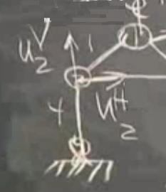
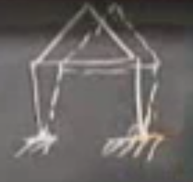
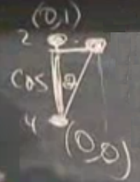
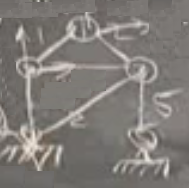
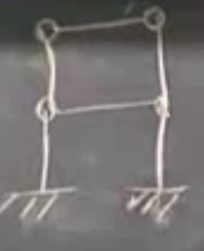

# Ders 1-15

Makaskirişler (Truss)

Bir makaşkiriş esneyebilen çubuklardan (bar) oluşur, bu çubuklar birbirine
bağlantı pimleri (pin joint) ile bağlıdır. Bağlantı pimi derken şunu
kastediyorum, çubukları esnetmek özellikle uzunluğu yönünde kuvvet gerektirir,
ama pim etrafında çubukları döndürmek efor gerektirmez.

Not: Burada önemli bir nokta dış kuvvetin sadece bağlantı noktalarına
uygulanması, ve kuvvetlerin tüm yapı içinde sadece eksenel (axial) yönde
hissedilmesi [3, sf. 5].. Makaskirişlerde moment yoktur, sadece eksenel kuvvet
vardır. Bu durum bazı analizleri muhakkak kolaylaştırır. Çubukları birbirine
bağlayarak dayanikli yapı oluşturmanın farklı yolları var, çerçeve (frame)
bunlardan bir diğeri, bu yapıda kuvvet hem bağlantıya hem de kirişlerin herhangi
noktasına uygulanabilir.

Mesela resimdeki 3 no'lu çubuğu sağa ve sola esnetmek zor, ama o çubuğu
3 no'lu pim etrafında döndürmek kolay.

Bu derste iki boyutlu makaşkirişler incelenecek, daha önce iki boyutlu yay-kütle
sistemini incelediğimiz gibi; muhakkak üç boyutlu makaşkiriş sistemleri de var
ama iki boyut üzerinde ana başlıkları daha rahat olarak inceleyebiliriz.

Üstte görülen örnekte 5 tane çubuk 3 tane düğüm (nod, pim noktası) görüyorum.
Peki bilinmeyenler ne? Yani daha önceki yay-kütle problemindeki hesapladığımız
$u$ nedir? Çünkü $u$'dan $e$'ye oradan $w$'ya oradan da $f$'ye gitmek
istiyorum. İlk geçişi matris $A$ yapar, ikinciyi $C$, üçüncüyü $A^T$..
Bildiğimiz şeyler bunlar ama bu yapıyı önümüzdeki probleme göre oluşturmak
gerekiyor. Bahsettiğimiz matrislerin içini doldurmamız gerekiyor.

O zaman yapıyı tarif edelim. Mesela önce 1 no'lu düğüme bakalım, ona etki eden
kuvvetler nedir? İk boyuttayız demiştik, o zaman bir yatay bir de dikey kuvvet
olacak, en azından o düğüme etki eden tüm kuvvetler bu iki eksen bağlamında
incelenebilir. Bilinmeyen $u$'yu bu fırsatla tanıştırıyorum, alttaki resimde
mesela ikinci düğümdeki yer değişimini yatay ve dikey bileşenlerine ayırarak
gösterebilirim,

Bileşenler yatay yönde $u_2^H$, dikey yönde $u_2^V$. Bu yer değişimlerini,
yatay, dikey her pim için yaparız, böylece, bir anlamda elimizdeki biinmeyen
değişken sayısı ikiye katlanmış oldu. Artı, eksi olabilen tek bir $u$ öğesi
yerine artık her düğüm için iki tane $u$ öğesi takip etmemiz gerekiyor.

Şimdi alttaki yere bağlı destek noktalarına bakalım; orada ne oluyor?  Bu
noktalarda ne sağa, ne sola, ne yukarı aşağı hareket var, çünkü oraları
sabitlendi. O zaman $u_4^H = u_4^V = 0 = u_5^H = u_5^V = 0$.  Toplam kaç tane
bilinmeyen var? Altı tane. 1,2,3 düğümleri için ikişer tane, sabitlenmiş
noktalarda yok, onlar biliniyor. Demek ki $A$ matrisim 5 x 6 boyutunda olacak.
Bu yapı bize 6 tane $u$, 5 tane $e$, 5 tane çubuk kuvveti, ve 6 tane denge
denklemi verecetir.

Fakat bu makaşkirişin üstünde durmak güvenli olmayabilir.. Bu püf noktası
makaşkirişlere özel olarak devreye giriyor, ve konuyu daha ilginç hale
getiriyor. Niye? Pür lineer cebirsel sebeplerle aslında, $A$ matrisi 5 x 6
boyutlarında, yani satırdan fazla kolon var, bu durumda $A u = 0$ denklemini
çözen sıfır olmayan bir $u$ var, [1]'deki örnekte olduğu gibi. Bu arada $A$
matrisleri gerçek dünya örneklerinde rahatça satırdan fazla kolona sahip
olabilir çünkü düğüm ekledikçe o sayı çarpı iki kadar kolon eklemek lazım, $A$
büyüyecek ve $A$ bağımlı kolonlara sahip olacak. Fiziksel dilde devam edersek
sıfır olmayan yer değişimlerinin sıfır esnemeyi ima ettiği durumlar ortaya
çıkabilecek.

Makaskiriş üzerinde bu neye benzerdi? Yer değişimi var, ama esneme yok.  Alttaki
gibi olabilirdi mesela,

Bu harekete tekabül eden $u$'yu hayal etmeye uğraşıyorum şimdi, yine 1, 2, 3
düğümleri aynı yerde olsun, ve ufak bir hareketi bir birimlik değerle temsil
edersem (vektör içinde önce yatay sonra dikey değer gelecek şekilde),

$$
u = \left[\begin{array}{r}
1 \\ 0 \\ 1 \\ 0 \\ 1 \\ 0
\end{array}\right]
$$

Yani sadece yatay yer değişimi oldu, dikey hiç olmadı. Fakat bazılarımız şimdi
diyebilir ki "ama az da olsa dikey bir yer değişimi gözüküyor''. Bu doğru, ama
unutmayalım her şeye lineer bakıyorum, yaklaşıklama "birinci derece terimle''
yapılıyor, o zaman mesela

gibi bir durumda, $\theta$ kadar bir kayma var, çubuğun uzunluğu 1 diyelim,
gelinen nokta neresidir? Yatay olarak bu yer değişim $\sin\theta$ kadar, dikey
olarak $1-\cos\theta$. Şimdi ufak $\theta$ sözkonusu ise $\sin\theta \approx
\theta$. Peki $1-\cos\theta$ yaklaşık olarak nedir?  Her iki terim için de
açılım yapalım, ve yüksek dereceki terimleri yoksayalım,

$$
\sin\theta = \theta - \frac{\theta^3}{6} ... \approx \theta
$$

$$
1-\cos\theta = 1 - (1-\frac{\theta^2}{2} ... ) = \frac{\theta^2}{2} ... \approx 0
$$

Eğer $\theta^2$ ifadesinin probleme dahil olmasına izin verseydim o zaman gayrı
lineer bir problem elde ederdim. Bunu istemiyorum, yaklaşım lineer, o sebeple o
terimleri atınca geriye üstteki sonuçlar kalıyor. Zaten gayrı lineerlige
çoğunlukla ihtiyaç ta olmayabiliyor. Sonlu öğeler, yapılar, köprüler, alanım,
araçlarım her ne ise umudumuz ve beklentimiz hep ufak $\theta$ varlığı ve
problemin lineer olması. Ve lineer bir insan için $\theta^2$ sıfırdır. İşte
bu sebeple üstteki $u$ içindeki bazı öğeler sıfır.

Devam etmeden ekleyelim, bir probleme gayrı lineerlik bazı durumlarda dahil
olabilir; mesela geometrik gayrı lineerlik ile, üstteki problemde eğer
$\theta$'ların çok büyük olmasına izin verseydim, o zaman $\theta^2$'i yok
sayamazdım. Bu işleri zorlaştırırdı tabii, mesela bazı sonlu öğeler yaklaşımları
buna izin verir, Abaqus'ta mesela bu tür hesap şekli desteklenir, o alanda ilk
bakılan problemlerden biri Atlantik altındaki kablolara ne olurdu mesela, müthiş
ilgi çekici problemler, bir diğeri araba kazası sırasında arabaların dış
yapısına ne olur? O anda geometri değişiyor muhakkak, büyük yer değişimleri
oluyor.. Bunlar gayrı lineer yaklaşım gerektiriyor.

Bizim problemde her şey lineer. Makaskirişin çok daha çetrefil olduğu problemler
görürünüz belki ileride ama o durumda bile hala lineerlik varsayımı ile hesaplar
yapmak mümkündür.

Bir soru daha sorayım; üstteki problemdeki şekil bozulma durumunu, deformasyonu
(literatur bu duruma Ingilizce biraz garip olan "mechanisms'' yani
"mekanizma'' ismini vermis) nasıl engellerim? Çünkü eğer azıcık sert bir rüzgar
esse bu yapı küt diye aşağı düşecek değil mi? O zaman yapıyı nasıl stabil hala
getiririm? Bu yapıyı tasarlıyor olsaydınız siz ne yapardınız? Bir tane daha
çubuk ekleyebilirdim.

Sol alttan çapraz yukarı sağa doğru giden çubuğu yeni ekledim. Bu eklemeyi
yapınca altı tane çubuk elde ettim, ve altı tane yer değişimi var, bu demektir
ki $A$ matrisi 6 x 6 boyutunda. Bu durumda umut edilebilir ki $A$ matrisi artık
eşsiz (singular) değildir, tersi alınabilir bir matristır, deformasyon olma
durumu ortadan kalkmıştır.. Daha matrisi yazmadım tabii ama bir mühendislik
kabaca olayı tartabiliyorsak üstteki makaskirişin artık stabil olduğuna kanaat
getirebilirdik. Yapıyı daha da stabil yapabilirdim, mesela sağ alttan sol üst
köşeye doğru yedinci bir çubuk ekleyerek. Bu durumda 7 x 6 matris elde ederim,
hala deformasyon olmaz.

Ama şunu da belirteyim, 6 x 6 ya da 7 x 6 matris olsa da, $A$ matrisini yazmadan
hala eşsizlik var mı yok mu bunu önceden söylemek mümkün değil. Sistem hala
gayrı stabil olabilir (kıyasla 6 x 5 matris olsa mesela stabil olmama durumu
kesindir). Acaba bol çubuklu ama stabil olmayan bir makaskiriş bulabilir miyim?
Alttaki gibi bir yapı olabilir,

Üstteki örnek üzerinde egzersiz yapalım biraz (bu arada ders kitabında da [2] ek
egzersiz örnekleri var). Bu yapıdan nasıl bir matris elde ederim? Çubuk sayısı
nedir? Altı. Bilinmeyen sayısı? Sekiz. Çünkü hareket edebilen her pimde
iki bilinmeyen, dört pim var, 4 x 2 = 8. O zaman $A$ matrisi 6 x 8 boyutunda.

Bu durumda kaç tene deformasyon olasılığı var? Büyük ihtimalle iki tane.  Bir
tanesi alt iki pimin yana kayması üst taraf beraber gelecek şekilde, diğeri
alt iki pim yerinde durup üst iki pimin yana kayması. Bu iki seçeneğin bir
kombinasyonu da ortaya çıkabilir muhakkak.

Bu örnek için de çubuk ekleyerek yapıyı stabil hale getirebilirim. En az iki
tane çubuk ekleyerek bunu yapabilirim. Ama çubuk sayısı stabiliteyi garanti
etmez, dikkat, çubukların nereye koyulduğuna dikkat etmek lazım, üst bölümde
çapraz iki tane çubuk eklesem bu stabiliteyi garanti etmez, alt kısım hala
deforme olabilir (hoca söylemedi ama çözüm herhalde bir çapraz çubuk alta, bir
üste koymakla oluyor).

Aynı örneği değiştirelim, yere olan alt iki desteği siliyorum, ve hem
alta hem üste iki tane çapraz çubuk ekliyorum. 

Tekrar soralım, bu makaşkirişin esnemeden hareket etmesi mümkün müdür? $Au =
0$'in çözümü var mıdır sorusunu sorduk yine. Yapı artık havada uçuyor, normal
olarak bu mümkün.. Üç şekilde bu hareket mümkün. Her şey toptan yatay sağa, ya
da herşey dikey yukarı/aşağı gidebilir (translation). Üçüncü katı hareket şekli
dönmedir (rotation), mesela sol alt pimi etrafında dönüş olabilir (diğer pimler
etrafındaki dönüş bu pime etrafındaki bir dönüş artı yer değişimleri olarak
indirgenebilir).

O zaman deformasyonlar ile katı gövde hareketlerini birbirinden ayırmak
gerekiyor. Katı gövde durumunda deformasyon yok, her şey hareket ediyor.
Katı gövde hareketi yeteri kadar destek olmadığı zaman, deformasyon ise
yeteri kadar çubuk olmadığı zaman ortaya çıkar.

Dersi bitirmeden önce son bir soru sorayım? İlk baktığımız örnek için $C$
matrisi nedir? Hangi boyutdadır? 5 x 5 değil mi? Çünkü beş tane çubuk var, her
biri için $C$ köşegen matrisi içinde bir öğe olacaktır.  Bu öğeler üzerinden $w
= C e$ formülü devreye sokulur, bu denklem her çubuk için geçerli olan Hooke
Kanunudur. Gayet basit, İki $A$ ortasında bu $C$ var, ve Hooke Kanununu sisteme
dahil ediyor.

Kaynaklar

[1] Bayramlı, *Hesapsal Bilim, Ders 1-8*

[2] Strang, *Computational Science and Engineering*

[3] Kassimali, Matrix Analysis of Structures, 2nd Ed

