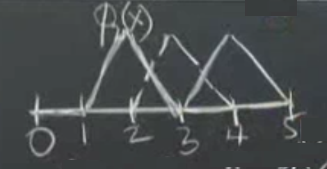
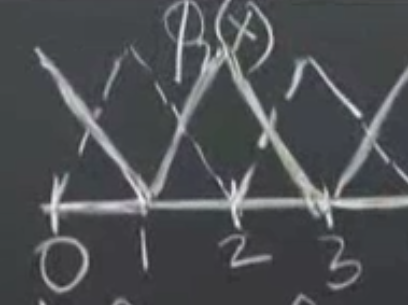
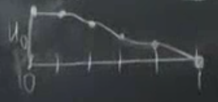
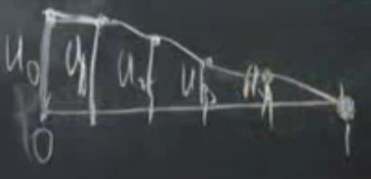
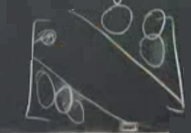
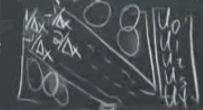
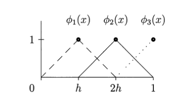

# Ders 1-18

Sonlu Öğeler, 2. Bölüm

Üzerinden geçelim, sistem zayıf form ile ise başlar. Önceki dersin sonunda
Galerkin fikrini tanıştırdık, sürekli diferansiyel denklem yerine onu ayrıksal
temsil etmeye uğraştık. Galerkin bunun için bazı deneme fonsiyonları kullanır
onlara $\phi_1,...,\phi_N$ diyelim, ayrıca test fonksiyonları da vardır (fakat
çoğunlukla test fonksiyonları ile deneme, yani $\phi$ ve $v$ fonksiyonları aynı
seçilir). Bugün işleyeceğimiz bu fonksiyonların nasıl seçildiği ve hazırlık
aşamasını gösterdikten sonra elde edilen $KU = F$ denkleminin nasıl çözüldüğü. $K$
nereden geliyor, $F$ nereden geliyor? $F$ bir şekilde alttaki ikinci denklemin
(oktan sonra) sağ tarafından geliyor, $K$ ise sol tarafından.. Detayları şimdi
göreceğiz.

$$
- \frac{\mathrm{d}}{\mathrm{d} x} \left( c(x) \frac{\mathrm{d} u}{\mathrm{d} x} \right) = f(x) \to
$$

$$
\int_{0}^{1} c \frac{\mathrm{d} u}{\mathrm{d} x} \frac{\mathrm{d} v}{\mathrm{d} x} \mathrm{d} x =
\int_{0}^{1} f(x) v(x) \mathrm{d} x
\qquad (1)
$$

ki eğer $u(1)=0$ ise $v(1) = 0$ (sınır şartı).

Sonlu öğeler metotunun (FEM) temeli $KU = F$. Üstteki denklemde okun sol tarafı
diferansiyel denklemimiz, sınır şartları vs ile "güçlü formda'', oktan sonrası
zayıf form, ki onun da kendi sınır şartları var. Sabit değişkenler güçlü formdan
zayıf forma geçiyor, ama serbest değişkenler geçmiyor. $v$'yi $u$'dan olan ufak
sapmalar olarak gördüğüm için eğer $u$'yi sabitliyorsam $v$ de sabitleniyor.

Tüm bunları gördük ama hala ayaklarımız yere basmadı; bir çok fikirden
bahsettik, ama şimdi daha gerçek dünyaya bağlanacağız. Gerçek dünya demek tabii
$\phi$'lerle alakalı, hangi somut fonksiyonları $\phi$ olarak seçeceğiz?

Acaba örnek bir $\phi$ ne olabilir? Mesela $x=2$ noktasında tepe yapan bir
parçalı lineer fonksiyon kullanabilirim,



Bu fonksiyona $\phi_2(x)$ diyelim, 1 ila 3 arasında 2 üzerinde tepe yapıyor
diğer yerlerde ya lineer eğimi var, ya da değeri sıfır. Her $\phi$ maksimum tepe
noktası 1 olarak seçilebilir. Onun sağındaki $\phi_3$ olabilir, benzer bir
fonksiyon sadece 3 değeri bazlı tanımlı. Buradaki ana amaç sistemı basit ögeler
üzerinde inşa etmek. FEM'in ana fikri budur; $\phi$ için basit fonksiyonlar
kullan. Bu basitliğin devamı olarak $\phi$ ve $v$ fonksiyonlarını aynı seç.

Peki sınır noktalarında ne olacak? Üstte serbest-sabit problemi çözeceğim,
sol üç nokta serbest, sağ üç nokta sabit (sınır tanımlanmış). 



Üstteki resme bakarsak, $x=0$ için bir "yarım şapka'' fonksiyonu tanımladım,
$\phi_0$ diyelim, ve eğer diğer üçgen fonksiyonlara tam şapka dersek bu da yarım
şapka. O noktada $\phi$ ve $v$'lerim kısıtlı değiller. Böylece elimde beş tane
deneme fonksiyonu oluyor, $\phi_0$, $\phi_1$, $\phi_2$, $\phi_3$, $\phi_4$.

Amaç nedir? Yaklaşık FEM çözümüm $U(x)$'in üstteki basit şapka fonksiyonlarının
bir kombinasyonu olmasını istiyorum.

$$
U(x) = U_0 \phi_0(x) + ... + U_4 \phi_4(x)
\qquad (2)
$$

$U_0,..,U_4$ değerleri skalar, tek sayı.. onlar ilk başta bilinmeyen "ağırlık''
değerleri, $\phi$'leri belli şekilde çarpacaklar ve bu çarpımların toplamı
yaklaşık bir $u$ olacak.

Bu kombinasyonlar neye benzerdi acaba? Şöyle olabilirdi,



Başlangıçtaki değer niye $u_0$? Çünkü orada tüm diğer $\phi$ fonksiyonları sıfır
seviyesinde, hemen yandaki $\phi_1$ bile orada sıfır ve maksimum $\phi$ değer 1
olduğu için başlangıç değeri $u_0$.

Bu arada Galerkin, ismini taşıyan yöntemi bulurken, aklında erişmeye uğraştığı
belli bir çözüm fonksiyonu vardı, ve şapka fonksiyonlarını oraya varmak için
seçmişti fakat modern FEM yaklaşımlarında, yazılımlarında bir temel fonksiyonu
ilk baştan seçeriz, problem hakkında bir şey bilmesek bile. Şapka fonksiyonları
bu fonksiyonlardan biridir.

Sonlu öğeler temel fonksiyonları düğüm noktalarıyla bağlantılıdır, bu bağlamda
sonlu farklılıkler (finite differences) metotuna benzer, öğeler düğüm
noktalarına oturtuluyor. FEM ile şapka fonksiyonu özelinde her düğüm
noktasındaki $u$ değerinin o noktadaki ağırlık değeri ile aynı olmasını zorlamış
oluyoruz; mesela 1 düğümündeki değer nedir? $u_1$! Çünkü orada diğer tüm şapka
fonksiyonları sıfırdır, sadece $\phi_1$ değeri 1, toplanan tüm terimler
yokoluyor geriye sadece $u_1 \phi_1 = u_1$ kalıyor.



FD benzerliği hakkında, $KU=F$'i oluşturduğumuzda onun bir FD denklemine oldukca
benzediğini göreceğiz, arada yapısal farklar var tabii, FD ile ayrıksal
denklemleri biz tanımlıyoruz, FEM ile sadece baz öğeleri seçiyoruz denklemin
ne olduğunu Galerkin yöntemi bize söylüyor.

Şimdi bize lazım olan üstteki resimdeki her nokta için ayrı bir denklem, yani
toplam 5 tane denklem. Bu denklemler nereden gelecek? Kritik bir soru.

Bu denklemler zayıf formdan gelecekler. Şunu yapıyorum, (1)'deki $u$ yerine
(2)'deki $U$'yu sokuyorum. Ayrıca bir $v$ lazım, daha önce $v(1)=0$ şartı takip
edilmek suretiyle herhangi bir $v$ olabilir demiştik, ama şimdi ayrıksal forma
geçtik, ben de $\phi_i$ fonksiyonlarını $V_i$ fonksiyonlarım için kullanmaya
karar veriyorum. Böylece,

$$
\int_{0}^{1} c(x) \frac{\mathrm{d} U}{\mathrm{d} x} \frac{\mathrm{d} V_i}{\mathrm{d} x} \mathrm{d} x =
\int_{0}^{1} f(x) V_i(x) \mathrm{d} x
\qquad (3)
$$

ki $i=0,1,2,3,4$. Böylece 5 tane denklem elde ediyorum, 5 tane $V$ ile ana
formülü "test ediyorum''. Yani üstteki denklemi 5 tane $V$ için farklı
şekillerle üretmiş oluyorum. İşte 5 x 5 sistemim bu. Neler yaptım şimdiye kadar?
Baz fonksiyonlarını seçtik, onları zayıf forma sokuyoruz. $\mathrm{d} U / \mathrm{d} x$
ağırlıklı toplamdan geliyor (dikkat tüm $V$'leri kullanarak), sonra
$\mathrm{d} V_i / \mathrm{d} x$ sokuyoruz, ve entegrali hesaplıyoruz. FD durumunda bu
hesap yoktu, entegral hesabı yani, FEM ile var, eşitliğin hem sağında hem de
solunda.  Eşitliğin sağındaki entegral her $V_i$ için bize bir $F_i$ verecek,
yani $F$ vektörünün bir satırını. Tabii $K$ matrisi eşitliğin solundan
bir şekilde çıkacak, nasıl birazdan göreceğiz.

Örnek

Sağ tarafa bakalım önce, mesela $i=0$ için, $f(x)=1$ olsun (örneğe göre
böyle) bu durumda $\int_{0}^{1} 1 \cdot V_0(x) \mathrm{d} x$ entegrali ne
olur? Entegral bir alan hesabıdır hatırlarsak, o zaman 


$V_0$ üstteki ilk yarım şapka, o üçgenin alanı, eğer $x$ ekseni eşit aralıklarla
bölmüşsek ve her aralık $\Delta x$ ise, $(\Delta x \cdot 1) / 2 = \frac{\Delta x}{2}$.

Dikkat 0 ila 1 arası entegral üstteki resimdeki tüm yatay ekseni kapsar,
0,1,2,..  indisleri kafa karıştırmasın. O indisler $x=0$ ile $x=1$ arasını
indisliyor. O zaman 0 ile 1 arası entegral tüm $V$'lerin olduğu alan üzerinden
alınır, fakat biz her seferinde birini seçtiğimiz için onun alanını hesaplamış
oluyoruz çünkü mesela $V_0$ tanımlandığı yer sonrasında sıfır değerinde.

$i=1$ için ne olur? $\int_{0}^{1} 1 \cdot V_1(x) \mathrm{d} x$, üçgen tabanı
$2 \Delta x$,  çarpı 1, sonuç $\Delta x$. diğer $V$ değerleri benzer şekilde,
o zaman $F$ vektör şu şekilde,

$$
F = \left[\begin{array}{c}
1/2 \\ 1 \\ 1 \\ 1 \\ 1
\end{array}\right]
$$

$K$ için hazır mıyız? Anahtar bölüm orası.

(3) formülünün tüm sol tarafı $KU$'yu vermeli.. Satır satır gidelim, mesela
sıfırıncı denklem hangisi? $i=0$ olduğu zaman, yani $V_0$ kullanılan, zayıf
formu $V_0$ ile test ettiğimiz durumdur. Her şeyi açarak yazarsak,

$$
\int_{0}^{1} c(x)
\left( U_0 \phi_0' + ... + U_4 \phi_4'  \right)
\frac{\mathrm{d} V_0}{\mathrm{d} x} \mathrm{d} x = F_0 = \Delta x \cdot \frac{1}{2}
$$

Şu ana kadar eldekileri matris formunda yazarsak,

$$
\left[\begin{array}{rrrrr}
 & & & & \\
 & & & & \\
 & & & & \\
 & & & & 
\end{array}\right]
\left[\begin{array}{r}
U_0 \\ U_1 \\ U_2 \\ U_3 \\ U_4
\end{array}\right] =
\left[\begin{array}{r}
F_0 \\ F_1 \\ F_2 \\ F_3 \\ F_4
\end{array}\right]
$$

Boş matrisin ilk satırını $V_0$'yi kullanarak yapacağım entegral hesabından elde
edeceğim. Daha kolay başlayalım, ilk satırın sol ilk hücresine ne gelir?
$K_{00}$ diyelim, oradaki değer $U_0$'i çarpıyor değil mi ve bir şekilde
entegralinin alınması lazım.. Şöyle olabilir mi?

$$
K_{00} = \int_{0}^{1} c(x) \phi_0' V_0' \mathrm{d} x
$$

$c(x)$ için şimdilik 1 kabul edelim. Fakat eğer 1 olmasaydı daha çetrefil bir
fonksiyon olsaydı? İçinde $c(x)$ olan birçok entegrali üstteki gibi hesaplamak
lazım, ve bu hesapların kesin olması gerekmeyebilir, yani bu entegralleri
yaklaşık olarak hesaplasak ta yeterli olabilir. Sonuçta diğer her şeyi yaklaşık
yapıyoruz değil mi? Belli noktalar üzerinden yaklaşık bir temsil yaratıyoruz
vs.. Bu çerçevede eğer üstteki türden entegralleri hesabın tümünü bozmayacak
seviyeye yetecek kesinlik3te hesaplayabilirsek, işimizi halletmiş oluruz. $c(x)$
1 olunca tabii ki kesin çözümü bulacağız ama diğer tür durumlar için aklımızda
olsun.

Hesabın kendisine gelelim. $\phi_0'$ nedir? Bu arada $\phi$'leri $V$ ile aynı
seçtiğimiz için $\phi_0' = V_0'$ ve her iki türev üstteki resimdeki baştaki
yarım üçgenin eğimi. Eğitim dikey artış bolu yatay artış, yatay kısım $\Delta
x$, o zaman 1'inci dugume kadar $- 1 / \Delta x$, sonrası sıfır.

Bu vurgulanması gereken bir noktaya götürüyor, fonksiyonlarımız yerel / lokal.
Bu ne demek? Eğer $\phi_1'$ türevini $V_4'$ türeviyle entegre etseydim ($K$
matrisinde 4'uncu satır ile 1'inci kolon değeri yani) ne olacaktı? Sıfır
olacaktı. Niye? Çünkü bu fonksiyonlar yerel, 0'inci ve 4'uncu düğümlerden uzakta
değerleri sıfır, sıfır olmadıkları yerler çakışmıyor. Şimdi bu dinamiği tüm
matris için düşünürsek ne kadar az çakışma yeri olduğunu görebiliriz. Herhangi
bir $\phi$ mesela, tabii ki kendisiyle çakışır ve yanindaki komşularla biraz
çakışır. Ama daha ilerisiyle örtüşmesi yoktur. Bu bize $K$ için üçlü köşegen bir
matris verecek, üç öğeli köşegen bantında değerler olacak, geri kalan her yer
sıfır.



$K_{00}$ hesabına dönelim, $c(x)=1$, $\phi_0' = -1/\Delta x$, $V_0'$ aynı değer,
ve entegre ettiğimizi unutmayalım, 0 ile 1 arası ama aslında 0 ile $\Delta x$
arası çünkü sadece oraya kadar değerler var, o zaman $K_{00} = 1/\Delta x$
oluyor.

Peki

$$
K_{11} = \int_{0}^{1} c(x) \phi_1' V_1' \mathrm{d} x
$$

$\phi_1$ eğimi nedir? Bu şapka fonksiyonu tam, $\Delta x$'e kadar yukarı
çıkıyor sonra aşağı ınıyor, o zaman

$$
\phi_1' = V_1' =
\left\{ \begin{array}{rc}
1/\Delta x & 0 < x \le \Delta x \\
-1/\Delta x & \Delta x < x \le 2\Delta x 
\end{array} \right.
$$

$\phi_1'$ ve $V_1'$ çarpımı her iki bölüm için $1/\Delta x^2$ verir. Peki
$K_{11}$ entegral sonucu ne o zaman? $2 \Delta x$ değil mi? Çünkü bu sefer
entegral sınırlarına dikkkat, 0 ile $2\Delta x$ arasında. 

$$
K_{11} = \int_{0}^{2\Delta x} c(x) \phi_1' V_1' \mathrm{d} x = 2\Delta x
$$

$K_{22}$, $K_{33}$, .. benzer şekilde olacak. 

Peki $K_{01}$ ne olur? Yani sıfırıncı satır ve 1'inci kolona bakıyorum. Her iki
şapka fonksiyonunu çizersek,


Görüldüğü gibi biri yarım, diğeri tam, ama çakıştıkları yer hocanın gri
kalın şeritle gösterdiği bölümden öncesi. Ondan sonrası $\phi_0$ sıfır
değerinde orada entegral almaya gerek yok. 

Tabii entegre edilen eğimler, $\phi_0'$ $-1/\Delta x$ olacak, $V_1'$ ise
pozitif değerli, $1/\Delta x$. Çarpımları $-1/\Delta x^2$ entegre sınırı 0 ile
$\Delta x$ arası, entegrasyon sonucu $K_{01} = 1-/\Delta x$. n

Köşegen bir üstü ve bir altı aşağı çapraz inen tüm satırlar için aynı şey
geçerli, çünkü hepsi de yanyana olan $\phi$ ve $V$ üzerinden entegral alıyor
olacaklar



Tüm matrisi doldursak görürdük ki $K$ matrisi simetrik, pozitif kesin olacak.
Hatta onun ötesinde biraz basitleştirme sonrası üstteki matris bize bu dersten
daha da tanıdık gelebilir. Eğer $1/\Delta x$ dışarı çekilirse bizim $T$ matrisi
ortaya çıkıyor,

$$
K = \frac{1}{\Delta x}
\left[\begin{array}{rrrrr}
1 & -1   &    & \\
-1  & 2  & -1 &  &   \\
    & -1 &  2 & -1 &   \\
    &    & -1 & 2 & -1  \\
    &    &    & 1  & 2 
\end{array}\right]
$$

Hepsini bir araya koyarsak,

$$
KU =
\frac{1}{\Delta x}
\left[\begin{array}{rrrrr}
1 & -1   &    & \\
-1  & 2  & -1 &  &   \\
    & -1 &  2 & -1 &   \\
    &    & -1 & 2 & -1  \\
    &    &    & 1  & 2 
\end{array}\right]
\left[\begin{array}{r}
U_0 \\ U_1 \\ U_2 \\ U_3 \\ U_4
\end{array}\right] =
\Delta x
\left[\begin{array}{r}
1/2 \\ 1 \\ 1 \\ 1 \\ 1
\end{array}\right] = F
$$

Basit örneğimiz için FEM sistemi $KU = F$ işte bu.

Gerçi üstteki denklem sonlu farklılıklara (FD) benzer bir sistem ortaya
çıkarttı, derse o sebeple 'bu iki yaklaşımın farkı nerede?' sorusuyla
başlamıştım. Fakat dikkatli bakarsak bu çok basit problemde bile ufak
bir fark var, üstteki vektörde 1/2 var mesela, FD sistemine bu yok.
Ama tabii $F$ 1 değilse ya da $c$ 1 değilse daha fazla farklar ortaya
çıkacaktır, $c$ 1 değilse bir sürü çetrefil entegral ortaya çıkar, onları
yaklaşık şekilde temsil etmeye uğraşırım muhakkak. 

Ya $F$ için pür 1 değil mesela nokta yük (point load) $\delta (x-\frac{1}{5})$
olsaydı elimizde? Şimdi entegrallere geri dönmem gerekiyor değil mi? (3)
denklemindeki eşitliğin sağ tarafındaki entegralden bahsediyorum. Şimdi
o entegralde 1 yerine noktasal yük var

$$
= \int_{0}^{1} \delta (x-1/5) V_i \mathrm{d} x
$$

diye gidiyor, yani $\delta (x-1/5)$ fonksiyonunu her şapka fonksiyonuna karşı
entegre etmem gerekiyor. Ne elde ederim? Delta fonksiyonu 1/5 noktasındaki
değeri çekip çıkartır, çünkü o noktada zıplama yapıyor, orada entegrali, alanı
1, o zaman 1/5 üzerindeki $V_i$ değerini seçecektir. O da $i=1$ olur, demek ki
iki üstteki eşitliğin sağ tarafı suna benzer,

$$
= \Delta x
\left[\begin{array}{r}
0 \\ 1 \\ 0 \\ 0 \\ 0
\end{array}\right] = F
$$

Gerçi bu da FD'nin üreteceği sonuca biraz benzer.

Ya nokta yükü düğüm üzerinde değil iki düğüm arasına gelecek şekilde seçseydim?
Mesela 3/10 noktasında? O zaman entegraller bana

$$
= \Delta x
\left[\begin{array}{r}
0 \\ 1/2 \\ 1/2 \\ 0 \\ 0
\end{array}\right] = F
$$

verirdi değil mi? Görüyoruz, FEM nasıl otomatik olarak akılcı olan şeyi yaptı..
Noktasal yükün etkisini iki vektör hücresine yaydı. Otomatik olarak $c(x)$'i,
$f(x)$'i esnek şekilde probleme dahil ediyor, serbest sınırı idare ediyor..  FD
bunu yapamazdı, çünkü FD katı olarak düğümler üzerinde tanımlıdır.

<hr>

Alttaki Eski Bir Ders Video'sundan Alınmıştır

Sonlu Öğeler Metodu (Finite Elements Method)

Bu metot differansiyel, kısmi differansiyel denklemleri (partial differential
equations) yaklaşıksal olarak modelleme ve çözmenin yöntemleridir.

Formül: Başlangıç denklemi

$$ \frac{-d}{\mathrm{d} x} \bigg( c(x) \ \frac{\mathrm{d} u}{\mathrm{d} x} \bigg) = f(x) $$

İki tarafı da  $v(x)$ ile çarpıyoruz ve 0 to 1 sınırlarıyla entegralini alıyoruz.

$$
\int_0^1 \frac{-d}{\mathrm{d} x} \bigg( c(x) \frac{\mathrm{d} u}{\mathrm{d} x} \bigg) v(x)\mathrm{d} x
= \int_0^1 f(x)v(x) \mathrm{d} x
$$

Parçalı entegral (integration by parts) formülü şöyledir:

$$ \int y \mathrm{d} z = y  z - \int z \mathrm{d} y $$

Ana formülün bölümlerini, parçalı entegrale göre bölüştürürsek:

$$ dz = \frac{-d}{dx} \bigg( c(x) \ \frac{du}{dx} \bigg) dx  $$

$$ z = - c(x) \ \frac{du}{dx}  $$

$$ y = v(x)  $$

$$ dy = \frac{dv}{dx}dx $$

Yukarıda $dz$ içinde $dx$ ve $\frac{1}{dx}$ birbirini iptal eder. Parçalı
entegral formülünün sağ tarafına göre yerlerine koyarsak:

$$
\int_0^1 v(x)\mathrm{d} x \frac{-d}{\mathrm{d} x} \bigg( c(x) \frac{\mathrm{d} u}{\mathrm{d} x} \bigg)
= - \bigg[ v(x) c(x) \frac{\mathrm{d} u}{\mathrm{d} x} \bigg]_{x=0}^{x=1} \int_0^1 c(x) \frac{\mathrm{d} u}{\mathrm{d} x} \frac{\mathrm{d} v}{\mathrm{d} x} \mathrm{d} x
$$

Üstteki parçalı entegral açılımında sol taraf entegrale sınır
değerleri aldığında, sağ taraftaki $yz$ sonucunun aynı sınır
değerlerine tabi olduğuna dikkat edelim.

Differansiyel denklemde sınır koşulları $x=1$ durumunda $c(1)u'(1)=0$,
ve $x=0$ durumunda $v(0)=0$ olarak biliniyor. O zaman üstteki
denklemin sol tarafında $x=0$ ve $x=1$ koşulları için tanımlı bölüm $0
- 0 = 0$ olacaktır ve denklemden atılabilir. Geriye kalanlar

$$
\int_0^1 c(x) \frac{\mathrm{d} u}{\mathrm{d} x} \frac{\mathrm{d} v}{\mathrm{d} x} \mathrm{d} x
= \int_0^1 f(x)v(x) \mathrm{d} x
$$

Bu fonksiyonu Galerkin adlı bir matematikçi bulmuş, "zayıf form (weak
form)" olarak adlandırılıyor.

Şimdi diyelim ki n tane test fonksiyonu seçtik $\phi_1(x),..,\phi(n)$
ve bu fonksiyonların $U_j$ sayıları ile çarpımının toplamını, yani bir
tür kombinasyonunu $u(x)$ yerine kullanmaya karar verdik.

$$ U(x) = U_1 \phi_1+ ... + U_n\phi_n $$

O zaman

$$ U'(x) = U_1 \phi_1'+ ... + U_n\phi_n' $$

$$ = \sum_1^n U_j \frac{d\phi_j}{dx} $$

Şimdi $du / dx$ yerine $U'(x)$ koyarsak

$$
\int_0^1 c(x) \bigg( \sum_1^n U_j \frac{\mathrm{d}\phi_j}{\mathrm{d} x}\bigg)
\frac{\mathrm{d} V_i}{\mathrm{d} x}\mathrm{d} x
= \int_0^1 f(x)V_i(x)\mathrm{d} x
$$

Dikkat edelim, $v(x)$ yerine $V_i(x)$ kullandık. Üstteki formül her i için yeni
bir formül "üretecek". Niye $V_i$? Zayıf formdaki $v(x)$ formülünü de zaten biz
uydurmuştuk, yani $v(x)$ biz ne istersek o olur. O zaman bu fonksiyonu n tane
formül üretmek için bir numara olarak kullanıyoruz, n tane formül olunca
matrisin n x n elemanını doldurabileceğiz ve çözüme erişebileceğiz. Ek not,
çoğunlukla $V_i(x)$ için $\phi_i$ sembolü kullanılıyor.

Ayrıca formüldeki $U_j$ kısmını cekip çıkartırsak ve bir vektör içine koyarsak,
geri kalanlar bir $K_{ij}$ matrisi içinde tutulabilir. 

$$ K_{ij} = \int_0^1 c(x) \frac{\mathrm{d}\phi_j}{\mathrm{d} x} \frac{\mathrm{d} V_i}{\mathrm{d} x} \mathrm{d} x  $$

Sağ taraf aynı şekilde i tane formül üretir

$$ F_i = \int_0^1 f(x)V_i(x) \mathrm{d} x $$

Final formül matrix formunda basit bir şekilde temsil edilebilecektir. 

$$ KU = F $$

Örnek

Örnek olarak $-u'' = 1$ denklemini çözelim. Not: Differansiyel
denklemlerde sonuç bulmak demek bir "fonksiyon" bulmak
demektir. Normal cebirsel denklemlerde sonuç bulmak değişkenlerin
"sayısal" değerini bulmak demektir. Birazdan bulacağımız sonuç
$u(x)$ "fonksiyonu" olacak.

Eğer denklem $-u''=1$ ise o zaman bu formülü ana forma uygun hale
getirmek için $c(x) = 1$ olarak almamız gerekir. $-u''=1$ denkleminde
eşitliğin sağ tarafı 1 olduğuna göre $f(x) = 1$ demektir.

Artık $\phi$ fonksiyonlarını seçme zamanı geldi. Bu fonksiyonların
"toplamı" hedeflediğimiz fonksiyonu yaklaşıksal (approximate) olarak
temsil edecek. Örnek olarak seçebileceğimiz bir fonksiyon "şapka
fonksiyonu (hat function)" olarak bilinen üçgen fonksiyonlar
olabilir. Alttaki figürde bu fonksiyonları görüyoruz.



Bu figürde x ekseninin h büyüklüğündeki parçalara bölündüğünü görüyoruz. 

Entegralleri hesaplayalım

$$ F_1 = \int_0^1 V_1(x) \mathrm{d} x $$

Daha önce $V_1$ ve $\phi_1$'i aynı kabul ettiğimizi belirtmiştik. 

Yukarıdaki entegralin aslında bir alan hesabı yaptığını
görüyoruz. Sınırlar $0$ ve $1$ arasında, ama $2h$ ötesinde zaten
$\phi_1$ fonksiyonu yok. $\phi_1$'in alanı nedir? Alan üçgenin alanı:
Taban çarpı yükseklik bölü 2: $2h$, yüksekliği $1$, o zaman alan $(2h
\times 1) / 2 = 1/3$

Benzer mantıkla bakarsak, $F_2$ ile $F_1$ aynı, yani $1/3$. $F_3$ ise
onların yarısı, yani $1/6$.

$K_{ij}$ nasıl hesaplanacak? $c(x) = 1$ olduğu için formülden
çıkarılabilir ve $V_1$ ve $\phi_1$'in aynı olduğuna söyledik:

$$ K_{ij} = \int_0^1 c(x) \frac{\mathrm{d}\phi_j}{\mathrm{d} x} \frac{\mathrm{d} V_i}{\mathrm{d} x} \mathrm{d} x $$

$$ K_{11} = \int_0^1 \bigg( \frac{\mathrm{d} V_1}{\mathrm{d} x} \bigg) ^2 \mathrm{d} x  $$

$dV_1/dx$ nedir? Birinci şapka fonksiyonunun türevidir. Bu türeve
bakarsak, $0$ ve $h$ arasında artı eğim (slope) $1/h$, $h$ ve $2h$
arasında eksi eğim $-1/h$ oluyor. Ama kare aldığımız için sonuç aynı,
$1/h^2$. O zaman h = 1/3 olduğuna göre $1/(1/3)^2$, yani $dV_1/dx =
9$.

$$ K_{11} = \int_0^{2/3} 9 \mathrm{d} x = 9x \bigg|_0^{2/3} = (9)(2/3) - 0 = 6 $$

$K_{22}$ şeklen aynı fonksiyon parçasını temel aldığı için aynı değere
sahip: 6. $K_{33}$ onların yarısı, eşittir 3.

$K_{12}$ farklı eğimlerin çarpımı anlamına gelir, yani $V_1'$ ile
$V_2'$ çarpımı olur. Bu iki fonksiyona bakalım, 0 ile h arasında $V_2$
yok, eğim 0. İkisinin de sıfır olmadığı, çarpımda kullanılabilecek bir
eğiminin olduğu tek aralık h ve 2h arası. Burada $V_1' = -3, V_2 = 3$.

$$
K_{12} = \int_{1/3}^{2/3} (3)(-3) \mathrm{d} x
= -9x \bigg|_{1/3}^{2/3} = -6 - (-3) = -3
$$

Aynı şekilde $K_{23} = -3$. Ama $K_{13} = 0$ çünkü hiç çakışma yok.

Matrisi doldurursak, 

$$
KU = F
$$

$$ 
\left[\begin{array}{ccc}
    6 & -3 & 0 \\
    -3 & 6 & -3 \\
    0 & -3 & 3     
\end{array}\right]
\left[\begin{array}{c}
    U_1 \\
    U_2 \\
    U_3
\end{array}\right]
=
\left[\begin{array}{c}
    1/3 \\
    1/3 \\
    1/6
\end{array}\right]
$$

Python kodu 

```python
K = [[6., -3., 0],
     [-3., 6., -3.],
     [0., -3., 3.]]

f = [1./3., 1./3., 1./6.]

print np.linalg.solve(K,f)
```

```
[ 0.27777778  0.44444444  0.5       ]
```

```python
print 5./18., 4./9., 1./2.
```

```
0.277777777778 0.444444444444 0.5
```

Rapor edilen değerler bu denklemin bilinen çözümü $u(x) = x - \frac{1}{2}x^2$ 
ile 0, h, 2h noktalarında (mesh points) birebir uyum gösterdiğini
görüyoruz.  Yani yaklaşıksal olarak differansiyel denklemi çözmeyi 
başardık.

Kaynaklar

[1] Strang, G., *Computational Science and Engineering*


