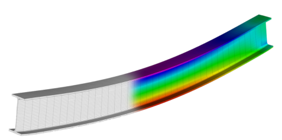
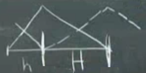
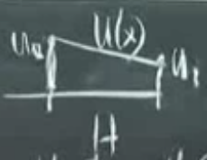

# Ders 1-20

Sona yaklaşırken 4'üncü seviye bükülme denklemleri (4th order bending equations)
ve öğe matrisleri konusunu biraz daha genişletmek istiyorum, hala sonlu öğeler
(FEM) dünyasındayız, öğe matrisleri FEM yaklaşımının öğeleri ve tam
matrisler.. Hatırlarsak makaşkirişin her çubuğu $A^T A$'nin bir parçasını
veriyordu, ve bu parçalar birleştirilerek $K$ oluşturuluyordu. Bir çizitte her
kenar bir satıra 1, -1 diye tekabül edecek şekilde bir matris ortaya
çıkartabiliyordu.. Şimdi öğe matrislerinin FEM ile ilişkisini yakından görmek
istiyoruz. Bugünkü dersin yarısı bu.

Dersin diğer yarısı 4'uncu derece diferansiyel denklemler. Şimdiye kadar
gördüğümüz tüm diferansiyel denklemler ikinci derece idi, 4'uncu derece önemli
denklemler var mı diye merak edenler olabilir, evet var. Kiriş bükülmesi
problemi bunlardan biri mesela, üstte inşaatlarda kullanılan türden bir kiriş
görüyoruz, resim bir stres analizi programından alınmış, mavi, yeşil, kırmızı
renkler kiriş uygulanan yükün etkilerini gösteriyor, kırmızı en fazla stres olan
yerler mesela, işte üstteki türden çıktılar 4'uncu derece bükülme denklemini
gerektiriyor.

Bu tür denklemler bizim $A^T C A$ altyapımıza uyuyor mu? Muhakkak öyle,
birazdan göreceğiz. 

Tek boyuta dönüş yapalım, analiz edilen cismi parçalara böleceğiz, ve her parça
bir öğeye tekabül ediyor olacak. Cisim bir büyük çubuk, kiriş olabilir..  Sonlu
farklılıklar (finite differences) ile size araları eşit olmayan izgara noktaları
versem ki alttaki resimde mesela $h$ ile $H$ birbirinden farklı olsa, bu FD ile
bizi bayağı uğraştırırdı, ikinci farklılıktaki -1, 2, -1 satırı yerine biraz
daha dengesiz değerler elde ederdik, bu izgaranın dengesizliği sebebiyle
olurdu. FD ile bu durumu ciddi tartmak gerekirdi, FEM ile sistem o düşünme işini
bizim için hallediyor, dengesizlikler, olduğu yerlere sistemin yapısı
sayesinde doğal olarak çözülüyor. 

Basit tek aralığa odaklanalım şimdi, iki tane şapka fonksiyonumuz olsun, her
ikisinin de maksimum seviyesi 1,

Fonksiyonumuz iki seçilmiş noktada $u_0$ ve $u_1$ değerlerinde, bu değerlerden
ilki $u_0$ çarpı birinci şapkadan geliyor, aynı şekilde ikincisi $u_2$ çarpı
ikinci şapkadan.. $u_0$ ve $u_1$ arasında ne olur? Fonksiyon

$$
U(x) = u_0 \phi_0 + u_1 \phi_1
$$

Bu bir lineer fonksiyon, alttaki gibi bir çizgi ile gösterilebilir,

[devam edecek]

