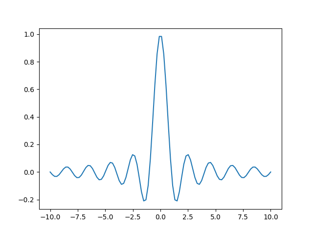
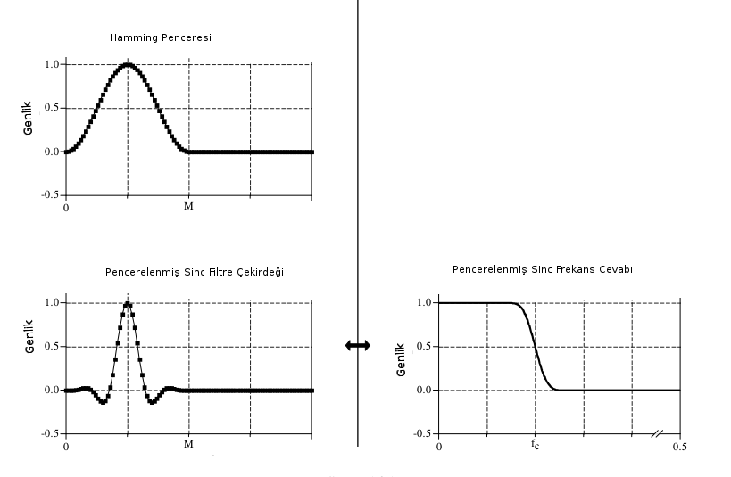
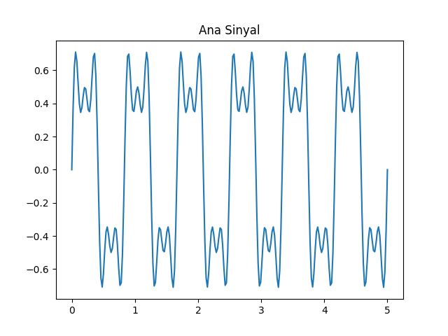
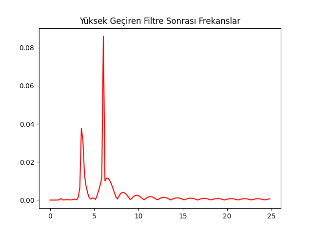
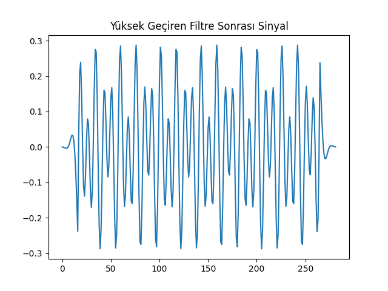
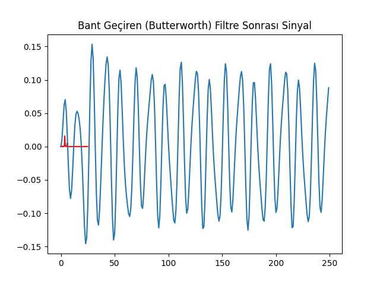

# Ders 1.24

[Ders notları atlandı]

FIR Filtreleri

Bir sinyalin içinden belli frekansları ayıklama işlemine filtreleme adı
veriliyor; çeşitleri alçak geçiren (low-pass), yüksek geçiren (high-pass),
ve bant geçiren (band-pass) filtreleri. Alçak geçiren filtrelerle mesela 2
kHz üstündeki tüm frekanları sinyalden çıkartmak istiyorsak eşik değeri 2
kHz'lük olan bir filtre kullanabiliriz, yüksek geçiren bunun tersini
yapabilir. Bant geçiren ise sadece belli bir aralıktaki frekanslara izin
vermek için kullanılır, mesela sinyalde 4 ve 5 kHz arası frekanslar kalsın
istiyorsak bir bant geçiren filtre kullanırız.

Bu yazıda sonlu dürtü yanıtlı (finite impulse response -FIR-) adı verilen
sayısal filtreleri kullanacağız, bu filtreler tipik olarak sonlu sayıda
katsayı olarak hesaplanırlar, sonra bu katsayılar bir evrişim
(convolution) operasyonu ile sinyale uygulanır.

FIR filtre tasarımını kolaylaştıran en önemli numara evrişim ile ayrıksal
Fourier transformu arasındaki bir ilişkiye dayanıyor. Bir $x$'e evrişimle
bir $h$ filtresi uygulayacağımızı düşünelim, ve bu bize $y = x * h$
sonucunu verecek. İlişki şudur ki eğer $x$ ve $h$'nin Fourier transformunu
alırsak $x * h$ işlemi "frekans yöresinde (frequency domain)'' $X \cdot H$
çarpımına dönüşür, yani frekans yöresindeki çarpım işlemi zaman yöresindeki
evrişim işlemine eşittir [1, sf. 161].

$$ x(n) * h(n) \leftrightarrow X(\theta)H(\theta)$$

ki $X$ ve $H$, $x,h$'nin Fourier transformu.

İspat

Ayrıksal evrişim formülünü hatırlarsak,

$$ y(n) = x(n) * h(n) = \sum_{m=-\infty}^{\infty} x(m) h(n-m) $$

Eşitliğin iki tarafının Fourier transformunu alalım, $y(n)$'nin transformu
$Y(\theta)$ olsun,

$$  
Y(\theta) = \sum_{n=-\infty}^{\infty} \bigg[
\sum_{m=-\infty}^{\infty} x(m) h(n-m)
\bigg] e^{-j\theta n}
$$

Toplamların yer değiştirebilme özelliğini kullanırsak, 

$$ 
= \sum_{m=-\infty}^{\infty} x(m)  \sum_{n=-\infty}^{\infty} h(n-m)  e^{-j\theta n}
$$

Şimdi $k = n-m$ tanımlayalım, 

$$  
= \sum_{m=-\infty}^{\infty} x(m)  \sum_{k=-\infty}^{\infty} h(k)  e^{-j\theta (k+m)}
$$

$$ 
Y(\theta) =
\sum_{m=-\infty}^{\infty} x(m)  e^{-j\theta m}
\sum_{k=-\infty}^{\infty} h(k)  e^{-j\theta k}
$$

Son ifadede $x$ ve $h$'nin ayrı ayrı Fourier transformlarını elde etmiş
olduk, ve bu transformlar birbiriyle çarpım halindeler. İspat tamamlandı,
gerçekten de evriştirilen iki öğenin arasındaki ilişki ayrı ayrı Fourier
transformu üzerinden çarpım haline geliyor.

Bu özellik filtre tasarımında son derece faydalı: çünkü eğer belli
frekansları elemek istiyorsak bunu yapmanın en rahat yolu frekans yöresinde
öyle bir $H$ tanımlamak ki $X$'in bazı bölgelerini olduğu gibi bıraksın
diğerlerini sıfırlasın. Bu fonksiyon istenen yerlerde 1 değerine diğer
yerlerde 0 değerine sahip olan bir fonksiyondan ibarettir. Fonksiyon bir
dikdörtgene benzer, ki bu sebeple ona "tuğla duvarı (brickwall)''
deniyor. Bu tuğla duvarının önemli bir avantajı (ters Fourier transformu
ile) zaman yöresine geçiş yapıldığında yine basit bir fonksiyon olması, bu
ünlü $\mathrm{sinc}$ fonksiyonudur,

$$ \mathrm{sinc} (x) = \frac{\sin(x)}{x}$$

```python
x=np.linspace(-10.0,10.0,100)
y=np.sinc(x)
plt.plot(x,y); 
plt.savefig('compscieng_1_24_14.png')
```



Sayısal olarak geçişi yapalım, bir kısmı 1 gerisi 0 olan tuğla duvarı
tanımlayıp `numpy.fft.ifft` ile $h$'yi elde edelim,

```python
H = np.zeros(242)
H[128:142] = 1.
plt.figure()
plt.plot(H)
plt.savefig('compscieng_1_24_02.png')
h1 = np.fft.ifft(H,140)
h = np.real(np.fft.ifftshift(h1))
plt.figure()
plt.plot(h)
plt.savefig('compscieng_1_24_01.png')
```


İspat

Diyelim ki frekans yöresinde tanımlı $H(\omega)$'nin tuğla duvarı şekli var
[3, sf. 247], öyle ki sıfırda ortalanmış ve $-\omega,\omega$ arasındaki bir
bölgede fonksiyon 1, diğer yerlerde 0, yani

$$ H(\omega) = 
\left\{ \begin{array}{ll}
1, & -\omega_c \le \omega \le \omega_c \\
0, & \omega_c \le |\omega|
\end{array} \right.
$$

Bu fonksiyonun zaman yöresindeki karşılığını analitik olarak bulalım. Ters
Fourier transformu,

$$ 
h(t) = \frac{1}{2\pi}  \int_{-\infty}^{\infty} 
H(\omega) e ^{j\omega t} \mathrm{d} \omega = 
\frac{1}{2\pi} \int_{-\omega_c}^{\omega_c} e ^{j\omega t} \mathrm{d} \omega
$$

$$ 
= \frac{1}{2\pi} \frac{1}{jt} (e ^{j\omega_c t} - e ^{-j\omega_c t}) =
\frac{1}{\pi t} \sin(\omega_c t)
$$

$$ 
= \frac{\omega_c}{\pi} \frac{\sin(\omega_c t)}{\omega_c t} 
= \frac{\omega_c}{\pi} \mathrm{sinc}(\omega_c t)
$$

$\mathrm{sinc}$'e erişmiş olduk. Ayrıksal ortamda 

$$ h[i] = \frac{\sin(2\pi f_c i)}{i \pi}$$

Bu fonksiyonu bir sinyal ile evriştirince ona frekans filtresi uygulamış
oluruz, sadece $f_c$ altındaki frekanslara izin veren alçak geçiren
(low-pass) filtreyi ederiz [2, sf. 285].

Fakat bir problem var, $\mathrm{sinc}$ fonksiyonu sıfır genliğe erişmeden eksi ve
artı sonsuzluğa sürekli devam eder. Bu sonsuz uzantı sayısal ortamda
kullanışlı değil. Bunun için fonksiyonu bize sıfırda ortalanmış $M+1$ tane
katsayı değeri bırakacak şekilde kırpacağız ($M$ çift sayı olmalı, sıfırda
ortalanınca geri kalan katsayılardan her iki yönde eşit sayıda olması
için), ve geri kalan tüm $\mathrm{sinc}$ değerleri sıfır kabul edilecek.

Bir diğer problem sıfırda ortalama demek negatif indisler kullanmak demek,
bu bilgisayarlar için problemli; o sebeple her şeyi $M/2$ sağa
kaydırıyoruz. 

Fakat kırpmanın bir yan etkisi şudur; kırpma çok keskin bir şekilde
yapıldığı için bu fonksiyonda ani bitiş (abrupt end) yaratıyor ve bu
frekans yöresinde pürüzlere yol açıyor. 


Bu problemin bir çözümü pencereleme fonksiyonu kullanmak, ve filtreleme
yapacak çekirdeği bu pencereyle çarpıp ani geçişi yumuşatmaya
uğraşmak. Hamming penceresi bir seçenek,

$$ w[i] = 0.54 - 0.46 \cos (2\pi i / M)  $$

Nihai filtre

$$ 
h[i] = K \frac{\sin(2\pi f_c (i-M/2))}{i-M/2} \bigg[
0.54 - 0.46 \cos (2\pi i / M)
\bigg]
$$



Kodları altta görüyoruz, 

```python
import scipy, matplotlib.pyplot as plt
import numpy as np

def hamming(window_size):
    N = window_size;
    output = np.zeros((N, 1));
    if np.mod(N, 2) == 0 :
        m = np.fix(N / 2)
        n = m
    else:
        m = np.fix(N / 2)+1; 
        n = m-1; 
    window = 0.54 - 0.46 * np.cos(2*np.pi*(np.arange(m)) / (N-1))
    tmp1 = window[:int(m)]
    tmp2 = window[np.arange(int(n)-1,-1,-1)]
    return np.hstack((tmp1,tmp2))
    
def sinc_filter_low(order, fc1, fs):
    Fc1 = fc1 / np.float(fs) 
    M  = order
    B = np.zeros((M+1, 1))
    window = hamming(M+1)
    for i in range(M+1):
        if 2 * i == M:
            B[i] = 2*np.pi*Fc1
        else:
            tmp1 = 2*np.pi*Fc1 *(i-(M/2.))
            tmp2 = (i-(M/2.))
            B[i] = np.sin(tmp1) / tmp2
        B[i] = B[i] * window[i]
    return B / np.sum(B)
 
def sinc_filter_high(order, fc1, fs):
    Fc1 = fc1 / np.float(fs) 
    M  = order
    B = np.zeros((M+1, 1))
    window = hamming(M+1)
    for i in range(M+1):
        if 2 * i == M:
            B[i] = 2*np.pi*Fc1
        else:
            tmp1 = 2*np.pi*Fc1 *(i-(M/2.))
            tmp2 = (i-(M/2.))
            B[i] = np.sin(tmp1) / tmp2
        B[i] = B[i] * window[i]
    B = B / np.sum(B)
    B = -B
    B[(M/2)] = B[(M/2)] + 1
    return B
    
def sinc_filter_band(order, fc1, fc2, fs):
    M = order
    A = sinc_filter_low(order, fc1, fs).T[0]
    B = sinc_filter_high(order, fc2, fs).T[0]
    output = A+B
    output = -output
    output[(M/2)] = output[(M/2)] + 1.
    return output

def plotSpectrum(y,Fs):
    n = len(y) # sinyal uzunlugu
    k = np.arange(n)
    T = n/Fs
    frq = k/T # frekansin her iki kismi
    frq = frq[range(n/2)] # frekansin tek tarafi
    Y = scipy.fft(y)/n # fft hesaplamak ve normalizasyon
    Y = Y[range(n/2)] 
    plt.plot(frq,np.abs(Y),'r') # spektrumu grafiklemek
    
```

Terminoloji bilgisi: katsayıların kaç tane olduğu filtre performansında
değişiklik yaratabiliyor, bu sebeple filtrelerin bazen kaç tane katsayı
içerdiği özellikle belirtilir, mesela alttaki örnekteki filtrelere "33
vuruşlu (33-tap)'' adı verilir.

Alçak Geçiren Filtre

Bir alçak geçiren filtre örneği $f_c$ eşik değeri için altta görülüyor.

```python
import filt
fy=300; # Hz ile sinyal frekansi
wy=2*np.pi*fy; # radyan / saniye ile sinyal frekansi
fs=50; # Hz ile orneklem frekansi
tiv=1./fs; # orneklemler arasinda zaman
tend = 5 # saniye
t=np.linspace(0,tend,tend/tiv); # gecen zaman (5 saniye)

y=0.6*np.sin(wy*t)+0.3*np.sin(3*wy*t)+0.2*np.sin(5*wy*t); 
f=plt.figure()
plt.plot(t,y)
plt.title(u'Ana Sinyal')
plt.savefig('compscieng_1_24_05.png')
f=plt.figure()
plt.title(u'Filtre Öncesi Frekans')
filt.plotSpectrum(y, fs)
plt.savefig('compscieng_1_24_06.png')

order = 32
fc1 = 1.0
f1 = filt.sinc_filter_low(order, fc1, fs=20).T[0];

y1 = np.convolve(f1, y)
f=plt.figure()
plt.title(u'Alçak Geçiren Filtre Sonrası Sinyal')
plt.plot(np.arange(len(y1)), y1)
plt.savefig('compscieng_1_24_08.png')

f=plt.figure()
filt.plotSpectrum(y1, fs)
plt.title(u'Alçak Geçiren Filtre Sonrası Frekanslar')
plt.savefig('compscieng_1_24_07.png')
```




Yüksek Geçiren Filtre

Yüksek geçiren filtre elde etmek için herhangi bir $f_c$ için tanımlı bir
alçak geçiren filtreyi alıp katsayılarını negatife çevirmek yeterli (bir de
ortada sıfır noktasında bir pozitif değer ekleniyor). Bu değişim o filtreyi
$f_c$ için yüksek geçiren hale getirir.

```python
fc1 = 4
f2 = filt.sinc_filter_high(order, fc1, fs).T[0];
y2 = np.convolve(f2, y)
f=plt.figure()
plt.plot(np.arange(len(y2)), y2)
plt.title(u'Yüksek Geçiren Filtre Sonrası Sinyal')
plt.savefig('compscieng_1_24_10.png')
f=plt.figure()
filt.plotSpectrum(y2, fs)
plt.title(u'Yüksek Geçiren Filtre Sonrası Frekanslar')
plt.savefig('compscieng_1_24_09.png')
```





Bant Geçiren Filtre

$f_{c1}$ ve $f_{c2}$ frekansları arası haricindeki tüm diğer frekanslar
elensin istiyorsak $f_{c1}$ için alçak geçiren $f_{c2}$ için yüksek geçiren
filtre tanımlayıp bu iki filtreyi toplarız. Bu toplam bize bir bant reddi
(bant-reject) filtresi verir. Ama biz bunun tersini istiyoruz, o zaman
eldeki katsayıların üstteki bahsedilen yöntemle tersini alırsak bir bant
geçiren filtre elde ederiz.

```python
fc1 = 4.0
fc2 = 4.5
f3 = filt.sinc_filter_band(order, fc1, fc2, fs);
y3 = np.convolve(f3, y)
f=plt.figure()
plt.title(u'Bant Geçiren Filtre Sonrası Sinyal')
plt.plot(np.arange(len(y3)), y3)
plt.savefig('compscieng_1_24_12.png')
f=plt.figure()
filt.plotSpectrum(y3, fs)
plt.title(u'Bant Geçiren Filtre Sonrası Frekanslar')
plt.savefig('compscieng_1_24_11.png')
```


Karşılaştırma amaçlı olarak `scipy.signal.butter` kütüphane çağrısı
ile bir Butterworth bant geçiren filtreyi de aynı veri üzerinde işlettik.

```python
from scipy.signal import butter, lfilter
def butter_bandpass(lowcut, highcut, fs, order):
    nyq = 0.5 * fs
    low = lowcut / nyq
    high = highcut / nyq
    b, a = butter(order, [low, high], btype='band')
    return b, a

def butter_bandpass_filter(data, lowcut, highcut, fs, order):
    b, a = butter_bandpass(lowcut, highcut, fs, order=order)
    y = lfilter(b, a, data)
    return y

low = 4; high=4.5
yb = butter_bandpass_filter(y, low, high, fs, order=1)
plt.title(u'Bant Geçiren (Butterworth) Filtre Sonrası Sinyal')
plt.plot(np.arange(len(yb)), yb)
plt.savefig('compscieng_1_24_13.png')
```



Not: Butterworth filtreleri FIR değil IIR filtreleri (bir sonraki yazının konusu).

Kaynaklar

[1] ElAli, *Discrete Systems and Digital Signal Processing with Matlab, 2nd Edition*

[2] Smith, *The Scientist and Engineer's Guide to Digital Signal Processing, 2nd Ed.*

[3] Sierra, *Digital Signal Processng with Matlab Examples Volume 1*


