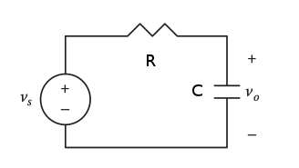
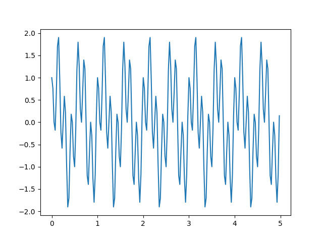
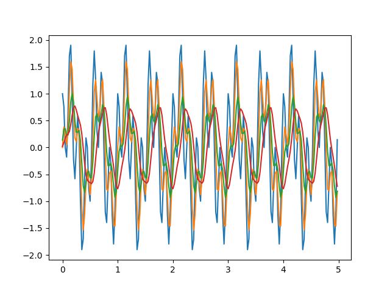

# Ders 1.25

[ders notları atlandı]

z Transform 

z Transform, Laplace Transformunun ayrıksal dünyadaki karşılığıdır,
transform edilen sürekli fonksiyon $f(t)$ değil, ayrıksal, bir vektör
olarak görülebilecek $x(n)$'dir. z Transform

$$ Z[x(n)] \leadsto X(z) = \sum_{-\infty}^{\infty} x(n)z^{-n}  $$

ki $z$ bir kompleks sayıdır. 

Gelişigüzel (casual) sistemlerden gelen verilerde sadece $n>0$ veriye
bakılabilir, o zaman alt sınır sıfır olur

$$ X(z) = \sum_{0}^{\infty} x(n)z^{-n}  $$

z Transform ne işe yarar? Laplace Transform diferansiyel denklemlerin
çözülmesine yardım ediyordu. z Transform benzer şekilde farklılık
(difference) denklemlerin çözülmesine yardım eder. Farklılık denklemi
mesela

$$ y(n) = 0.85 y(n-1) + x(n) 
\qquad (3)
$$

şeklinde olabilir. Daha genel olarak farklılık denklemleri şu şekilde
belirtilebilir,

$$ \sum_{k=0}^N a_k y(n-k) = \sum_{l=0}^M b_l x(n-l) 
\qquad (1)
$$

İki üstteki örnek, bu genel denklemin $N=1,M=0$ olduğu halidir, katsayılar
$a_1 = 0.85,b_0=1$. Genel formdan $y(n)$'i dışarı çekebiliriz, o zaman
$k$ sıfır yerine $k=1$'den başlar

$$ y(n) + \sum_{k=1}^N a_k y(n-k) = \sum_{l=0}^M b_l x(n-l) $$

Genel çözüm için farklılık denkleminin bu formuna z Transform
uygulayabiliriz. 

Ama ondan önce kaydırma işlemi, lineerlik gibi bazı temel özellikleri,
işlemleri görelim. Mesela

$$ X(z) = x(0) + x(1)z^{-1} + x(2) z^{-2} + ... 
\qquad (2)
$$

ise, bu dizin üzerinde zaman kaydırma işlemi yapsak, yani $-1$ indeksi
$0$ haline gelse, onun gibi tüm değerler bir ileri kaysa, $x(-1)$,
$x(0)$ olur, ve transform

$$ x(-1) + x(0)z^{-1} + x(1) z^{-2} + ...$$

Şimdi $z^{-1}$'i dışarı çekelim

$$ = x(-1) + z^{-1} \bigg[ x(0) + x(1) z^{-1} + ... \bigg] $$

Köşeli parantez içine bakarsak, oradaki değerler (2)'deki seriye benzemiyor
mu? O zaman oraya direk $X(z)$ değerini koyabiliriz

$$ = x(-1) + z^{-1}X(z)$$

Bir daha kaydırırsak, 

$$ z^{-2}X(z) + z^{-1}x(-1) + x(-2) $$

elde ederiz. Genel olarak $m$ kadar kaydırırsak

$$ z^{-m}X(z^{-1}) + z^{-m+1}x(-1) + z^{-m+2}x(-2) + ... + x(-m) $$

Eğer başlangıç şartları sıfır ise, üstteki formülde $x(-1),x(-2),..$
tamamen sıfır kabul edilebilir, ve daha basit şu formülü elde ederiz. 

$$ Z[x(n-m)] \leadsto z^{-m}X(z^{-1})$$

Ayrıca, z Transformun lineerlik özelliği sayesinde 

$$ Z(ax(n)) = aZ(x(n)) \leadsto aX(z) $$

Şimdi bu bilgiyle beraber (1)'in z Transformunu yapalım. 

$$ Y(z) + \sum_{k=1}^Na_kz^{-k}Y(z) = \sum_{l=0}^M b_l z^{-l}X(z)  $$

$$ \to Y(z) \bigg[ 1 + \sum_{k=1}^Na_kz^{-k} \bigg] = \sum_{l=0}^M b_l z^{-l}X(z)  $$

$$ \to Y(z)  = \frac{\sum_{l=0}^M b_l z^{-l}X(z) }{ 1 +
  \sum_{k=1}^Na_kz^{-k}} 
\qquad (5)
$$

Formülün bölümdeki üst kısmını açarsak 

$$ b_0z^0 + b_1z^{-1} + b_2z^{-2} + ... + b_mz^{-M} $$

$b_0z^{-M}$ dışarı çekilirse

$$ = b_0z^{-M}(z^M + \frac{b_1}{b_0}z^{M-1} +  \frac{b_2}{b_0}z^{M-2} +
.. + 
 \frac{b_M}{b_0})
$$

Bölümün alt kısmını açarsak 

$$ 1 + a_1z^{-1} + a_2z^{-2} + ... + a_Nz^{-N} $$

$z^{-N}$ dışarı çekersek 

$$ = z^{-N} ( z^{N} + z^{N-1} + .. + a_N) $$

Bu yeni formları bölümde $Y(z)$ içinde yerine koyalım

$$ Y(z) = 
\frac{b_0z^{-M}(z^M + ..\frac{b_M}{b_0})}{z^{-N} ( z^{N} + .. + a_N)} 
$$

$$ = b_0 z^{N - M} \frac{z^M + ..\frac{b_M}{b_0}}{z^{N} + .. + a_N }$$

Bölüm ve bölene bir daha bakalım şimdi. Burada gösterilenler birer polinom,
ve Cebirin Temel Teorisi'ne (Fundamental Theorem of Algebra) göre $n$
derecesindeki bir $p(x)$ polinomunun mutlaka $n$ tane reel ya da kompleks
kökü vardır. 

Bir polinomun kökü var ise, bu polinom $p(x)$ şu şekilde de gösterilebilir

$$ p(x) = (x-r_n)(x-r_{n-1})..(x-r_1) $$

Bu mantığı iki üstteki formüle uygularsak 

$$ = b_0 z^{N - M} 
\frac{\prod_{l=1}^{M}(z-z_l)}{ \prod_{k=1}^{N}(z-p_k) }
$$

Yani $b_0z^{N-M}$ haricindeki ifadeler bir polinomun oluşmasına sebep olurlar,
ve bu polinomun kökleri bulunabilir, kökler bulununca çözüm olan $z$ değerleri
bulunmuş olacaktır. Bu $z$ değerlerini alıp z Transformunu oluşturuz, ve ya
tabloya bakarak, ya da başka şekilde ters transform yaparak farksal denklemin
çözümüne ulaşmaya çalışırız.

Çözmek istediğimiz örnek (3)'e tekrar bakalım. Üstteki formüle bu noktada
gerek yok, (5)'e göre bile bu denklemin z Transformunu bulabiliriz. 

$$ Y(z) = \frac{1}{1-0.85z^{-1}} $$

Eğer yaygın z Transformların tablosuna bakarsak, $|z|>0.85$ için üstteki
formülün ters z Transformunun 

$$ h(n) = Z^{-1} [Y(z)] = 0.85^nu(n) $$

olduğunu öğreniyoruz, ve $u(n)$ şöyle 

$$
u(n) = 
\left\{ \begin{array}{ll}
1, & \textrm{ eğer } n \ge 0 \\ 
0, & \textrm{ eğer } n < 0
\end{array} \right.
$$

Dikkat edilirse ters z Transform tablosunda $y$ değil $h$ bazlı sonuçlar
gösteriliyor, $h$ fonksiyonları dürtü cevabı (impulse response)
fonksiyonlarıdır, ve hesaplamaları evrişim (convolution) üzerinden
olur. Bir $h$, bir lineer sistemi özgün olarak temsil ettiği için $h$'i
alıp $y$ bazlı sonuca gitmek çok kolaydır, hemen $h$'in tarif ettiği
evrişimi yaparız.

$$ y(n) = \sum_{k=-\infty}^\infty x(k) h(n-k) = \sum_{k=-\infty}^\infty x(k) 0.85^{n-k} u(n-k). $$ 

Kodlama

Düşünelim ki (3) ile tarif edilen farklılık denklemi bir şirketin patent
portföyünü temsil ediyor. 

Bu şirket, her sene portföyü $y(n)$'e, $x(n)$ kadar yeni patent ekliyor,
ama her sene aynı zamanda elindeki patentlerin yüzde 15'i "eskiyor", yani
zamanları dolarak portföyünden çıkıyor. Bu eksiltme işlemini bir önceki
$y(n)$'i 0.85 ile çarparak temsil ediyoruz. 

Böyle bir problemde $x(n)$ bize veri olarak verilecektir, ve toplamsal /
kümülatif (cumulative) $y(n)$'i hesaplamamız istenecektir. Bu hesap
literatürde "değer kaybeden kümülatif toplam (cumulative sum with
deprecitation)'' olarak biliniyor.

O zaman üstteki formüldeki sonucu kodlarsak, ve örnek veriyle

```python
patents = np.array([  4.,   3.,   2.,   8.,   4.,  
                      4.,  10.,   4.,  10.,   7.])

def u(n,k):
    if n-k < 0: return 0
    return 1.

def y(n,data):
    sum = 0
    for k in range(len(data)):
        sum += data[k]*(0.85**(n-k))*u(n,k)
    return sum

for n in range(len(patents)):    
    print  (y(n,patents))
```

```
4.0
6.4
7.44
14.324
16.1754
17.74909
25.0867265
25.323717525
31.5251598962
33.7963859118
```

Bu sistemi otomatik olarak çözen Python işlemi `lfilter`
çağrısıdır.

```python
from scipy.signal import *

a = np.array([  4.,   3.,   2.,   8.,   4.,  
                4.,  10.,   4.,  10.,   7.])
d = 0.15 
res = lfilter((1,),(1,d-1),a) 
k = [a[0]] 
for inv in a[1:]: k.append((1-d)*k[-1] + inv) 
print (np.array(k) )
```

```
[  4.           6.4          7.44        14.324       16.1754      17.74909
  25.0867265   25.32371752  31.5251599   33.79638591]
```

Not: Üstteki hesaplar [1] için kullanıldı.

Frekans Filtremek, IIR Filtreleri

Önceki dersteki FIR filtreleri sinyal üzerinde bir evrişimle kodlandı,
filtre katsayılarını geriye dönük ham sinyal üzerinde uygulayarak
filtrelenmiş sonucu üretiyorduk,

$$ y[n] = a_0 x[n] + a_1 x[n-1] + a_2 x[n-2] +  a_3 x[n-3] + ... $$

Fakat filtre için ham sinyalin kendisi elimizdeki tek girdi seçeneği değil,
sinyal $x$ ile beraber geriye dönük şekilde $y$'nin kendisini de
kullanabilirdik, bu durumda $y$'yi üretmek için $y$'nin kendisini kullanmış
olurduk, bu sebeple bu tür filtrelere özyineli (recursive) filtreler ismi
de veriliyor. Yani

\begin{eqnarray*}
y[n] = a_0 x[n] &+& a_1 x[n-1] + a_2 x[n-2] +  a_3 x[n-3] + ...  \\
 &+& b_1 y[n-1] + b_2 y[n-2] + b_3 y[n-3] + ..
\end{eqnarray*}

Peki FIR yöntemi ile filtre tasarlamayı biliyoruz, niye üstteki gibi bir
yaklaşım kullanalım ki? Cevap özyineli filtrelerin FIR'e göre çok hızlı
işlemeleri. IIR yönteminin de bazı negatif tarafları var, fakat bunlardan
uzak durabilirsek optimal hızda işleyen bir filtre elde etmek
mümkündür. Ayrıca elektronik devrelerden, analog temelli pek çok özyineli
filtre biliniyor, bu filtreleri sayısal ortamda kullanabilmek iyi olur.

IIR'nin genel verimliliği hakkında bir örnek verelim: diyelim ki 7 vuruşlu
bir ortalama filtremiz var, ve $n=50$ anında $y[50]$ şu değere sahip,

$$ y[50] = x[47] + x[48] + x[49] + x[50] + x[51] + x[52] + x[53] $$

Sinyalde $n$ merkezli olacak şekilde 3 geri ve 3 ileri gidilerek toplam
alınıyor, filtrelenmiş sinyal bu. Şimdi aynı filtrenin bir sonraki zaman
kesitinde, $y[51]$'deki değerine bakalım,

$$ y[51] = x[48] + x[49] + x[50] + x[51] + x[52] + x[53] + x[54] $$

Bu toplam aşağı yukarı iki üstteki ile aynı değil mi? $x[48]$ ve $x[53]$
arası değerler aynı şekilde toplanıyor, o zaman eğer elimizde $y[50]$
değeri var ise, $y[51]$'i hesaplamak için en optimal yöntem

$$ y[51] = y[50] + x[54] - x[47]$$

hesabı olacaktır, yani $y$'nin bir önceki zaman kesitindeki değerini
kullanmak. IIR filtreleri işte bu sebeple daha verimli işlerler, eğer
tasarımlarında dikkatli olunursa daha az miktarda katsayı ile çok daha
hızlı hesaplar yapabiliriz [2, sf. 283].

Şimdi daha önceki genel formu hatırlayalım 

$$ y(n) + \sum_{k=1}^N a_k y(n-k) = \sum_{l=0}^M b_l x(n-l) $$

Bu formül bir farklılık denklemi. Bu denklemin transfer fonksiyonu
altta, ki (5)'in literatürde daha çok görülen hali $H$ kullanır,

$$ 
H(z)  = \frac{\sum_{l=0}^M b_l z^{-l}X(z) }{ 1 + \sum_{k=1}^Na_kz^{-k}} 
$$

Açılmış şekilde  

$$ 
= \frac
{b_0 + b_1 z^{-1} + .. + b_m z^{-l}}
{1 + a_1 z^{-1} + .. + a_n z^{-k}}
$$

Bu formun güzel tarafı farklılık denklemleri ile üstteki formun arasındaki
direk bağlantı. Eğer transfer fonksiyonuna bir şekilde erişebilirsek oradan
direk farklılık denklemine geçilebiliyor, katsayılar $a_0,..,a_n$ ve
$b_0,..,b_m$ farklılık denkleminde aynen kullanılacak haldeler. Bu kavram
IIR filtresi tasarlarken faydalı olacak.

IIR Tasarımı

IIR filtre tasarımı için pek çok yöntem var. Bizim işleyeceğimiz yöntem
dürtü değişmezliği (impulse invariance) yöntemi, bir diğeri mesela
çiftlineer (bilinear) transform yöntemi. DD ile bilinen bir analog
filtrenin analog transfer fonksiyonu $H(s)$'yi alırız, sonra ters Laplace
transformu ile dürtü cevap fonksiyonu $h(t)$'yi elde ederiz. Sayısala
geçmek için bu fonksiyonu belli aralıklarla örnekleriz, yani $h(t)$'yi
$h(nT)$ haline getiririz. Sonra bu örneklenmiş fonksiyonun z-transformunu
alarak $H(z)$'ye geçiş yaparız, bu geçiş bize özyineli fonksiyonumuzda
kullanabileceğimiz direk katsayıları verecektir.

Analog deyip geçmeyelim, alçak geçiren, yüksek geçiren, vs. filtreleme
konusunda burada derin bir literatür var. Sayısal yöntemler ortaya
çıktığından beri haklı olarak çok ilgi gördüler, fakat unutmamak lazım,
sayısal yöntemlerden önce analog elektronik devreler filtreleme yapıyordu
(halen de yapıyor), mesela alttaki devre çok basit bir alçak geçiren
filtredir [4]. 



Bu devreye verilen $v_s$ sinyali (yani içinde pek çok frekans içeren
elektrik akımı) seçilen $R,C$'ye göre $v_o$'da alçak geçiren şekilde
filtrelenmiş olarak çıkacaktır. Bu klasik bir filtre devresi ve bir
transfer fonksiyonu var. Aslında çok basit,

$$ H(s) = \frac{1}{s + 1}$$

Bir frekans eşik değeri (cutoff frequency) $\Omega_c$ için [3, sf. 527]
$H(\frac{s}{\Omega_c})$ kullanılıyor. Diyelim ki $\Omega_c = 20$ rad/s,

$$ 
H \bigg( \frac{s}{\Omega_c} \bigg) = H\bigg( \frac{s}{20} \bigg) 
= \frac{1}{(s/20) + 1} = \frac{20}{s + 20}
$$

Simdi ters Laplace ile $h(t)$ bulunur, 

$$ 
h(t) = \mathcal{L}^{-1} \bigg\{ H\bigg( \frac{s}{20} \bigg)  \bigg\} 
= \mathcal{L}^{-1} \bigg\{ \frac{20}{s + 20}  \bigg\}  
= 20 e^{-20 t}
$$

Sonra $Th(nT)$ ayrıksal fonksiyonunun z-transformunu alırız, 

$$
H(z) = 20 T \sum_{n=1}^{\infty} e^{-20 nT}z^{-1} 
= 20 T \sum_{n=0}^{\infty} \big( e^{20 T}z^{-1} \big)^n
= \frac{20T}{1 - e^{-20 T}z^{-1}} 
\qquad (4)
$$

Son eşitlik nasıl mümkün oldu? Geometrik serilerinin açılımı sayesinde,
hatırlarsak, 

$$ \sum_{n=0}^{\infty} x^n = \frac{1}{1-x} $$

Bu kadar. (4) formülündeki son durum bize $a,b$ katsayılarını da
veriyor. $a_0 = 1.0$, $a_1=-e^{-20T}$, $b_0 = 20T$. Bu şekilde seçtik çünkü
`scipy.signal.lfilter` ile uyumlu olmasını istedik, bu kütüphane,

\begin{eqnarray*}
a[0]y[n] = b[0]x[n] + b[1]x[n-1] + ... + b[M]x[n-M] \\
                    - a[1]y[n-1] - ... - a[N]y[n-N]
\end{eqnarray*}

formülünü kodluyor. 

Şimdi örnek üretelim, 1 rad/s = $1/2\pi$ Hertz olduğuna göre, eşik değeri
$\Omega_c$

```python
cutoff = 20 * 1/(2*np.pi) 
print (cutoff, 'Hz')
```

```
3.18309886184 Hz
```

O zaman

```python
fs = 40.0 # orneklem orani
T = 1/fs
L = 5.0 # saniyelik sinyal
n = int(L * fs) 
t = np.linspace(0, L, n, endpoint=False)
data = np.sin(2.0*2*np.pi*t) + np.cos(7*2*np.pi*t) 
plt.plot(t,data)
plt.savefig('compscieng_1_25_02.png')
```



Biri 2 diğeri 7 Hz ile üretilmiş iki sinyali üst üste koyduk. Filtreleme
ile bunu ayrıştırmaya uğraşalım,

```python
x = data # formul ile ayni olsun diye
a = [1.0, -np.exp(-20*T)]
b = [20*T]
print (b, a)
y = np.zeros(len(x))
for n in range(1,len(data)):    
   y[n] = b[0]*x[n] - a[1]*y[n-1]
plt.plot(t,y)
plt.savefig('compscieng_1_25_03.png')
```

```
[0.5] [1.0, -0.60653065971263342]
```


Fena değil. Eğer `scipy.signal.butter` ile katsayıları üretsek ve
`lfilter` ile uygulasak (ki üstteki kod `lfilter` ile aynı
çarpımı yapıyor),

```python
from scipy.signal import butter, lfilter
nyq = 0.5 * fs
low = 2.0 / nyq
b, a = butter(1, low, btype='lowpass')
print (b,a)
y = lfilter(b, a, x)
plt.plot(t,y)
plt.savefig('compscieng_1_25_04.png')
```

```
[ 0.13672874  0.13672874] [ 1.         -0.72654253]
```


Bu biraz daha pürüzsüz oldu, kütüphane çağrıları farklı katsayılar
gösteriyor bu arada, çünkü farklı bir sayısala geçiş yöntemi kullanıyorlar
(çiftlineer transform olmalı). Eğer filtre derecesini yani vuruş sayısını
arttırırsak, yani daha fazla katsayı ile

```python
b, a = butter(2, low, btype='lowpass')
print (b)
print (a)
y = lfilter(b, a, x)
plt.plot(t,y)
plt.savefig('compscieng_1_25_05.png')
```

```
[ 0.02008337  0.04016673  0.02008337]
[ 1.         -1.56101808  0.64135154]
```



Bu daha da iyi oldu. 

Bir mühendislik notu olarak şunu ekleyelim, diyelim ki mobil ortamda
filtreleme yapmak istiyoruz, ve IIR yaklaşımı kullanacağız. Bu durumda
üstteki sayısal kütüphanelere mobil ortamında ihtiyacımız yok. Bize tek
gereken $a,b$ katsayıları, geliştirme sırasında dizüstü bilgisayarımızda
vuruş sayısını verip filteyi "tasarlıyoruz'' ve katsayıları elde edip
mobile sadece bunları taşıyoruz. Artık bu katsayıları alıp sinyal üzerinde
uygulamak basit bir çarpma / toplama işlemi haline gelecektir. Bütün sihir
katsayılarda!

Kaynaklar

[1] Bayramlı, M., *Patent Strategies and R\&D in Complex Product Industries*,
    [http://amsdottorato.unibo.it/5151/1/bayramli_meltem_tesi.pdf](http://amsdottorato.unibo.it/5151/1/bayramli_meltem_tesi.pdf)

[2] Smith, *The Scientist and Engineer's Guide to Digital Signal Processing, 2nd Ed.*

[3] Pularikas, *Signals and Systems Primer with Matlab*

[4] Irwin, *Basic Engineering Circuit Analysis, 10th Edition*


