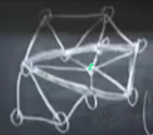

# Ders 1.26

[giriş bölümü atlandı]

Dersin son 10 dakikasında iki boyutlu sonlu öğeler (finite elements -FEM-)
konusuna giriş yapalım. Problem alanını temsil etmek için üçgenler kullanacağım,
ızgara üçgen bazlı yani. Kareler vs de olabilirdi..

Önemli nokta şu, üçgenler gelişigüzel noktalarda olabilir, düğümlerin nerede,
üçgenlerin ne şekillerde olacağını biz belirleriz. Bu FEM yaklaşımının güçlü
taraflarından biri. Üstteki ızgara fena değil, 180 dereeye yakın açılı üçgenler
yok (o zaman öteki açılar yamyassı hale gelirdi, üçgen ise yaramazdı). Tabii
yapısız dahi olsa ızgarayı yaratmak için bir program kullanmak iyi olur, benim
bir tez öğrencim böyle bir programı geçende yazdı [hoca bugünlerde pek çok
  kişinin kullandığı `distmesh` programından [1] bahsediyor herhalde].

Şimdi FEM ana fikrini hatırlayalım. Zayıf forma geçiş yapıyorduk değil mi?
Poisson için ne olur? Hatırlarsak Poisson, Laplace'in eşitliğin sağında bir
değer olan hali.

$$
\int \int
\frac{\partial u}{\partial x} \frac{\partial v}{\partial x} +
\frac{\partial u}{\partial y} \frac{\partial v}{\partial y}
\mathrm{d} x \mathrm{d} y =
\int \int f(x,y) v(x,y) \mathrm{d} x \mathrm{d} y 
$$

$v$'ler tüm mümkün test fonksiyonları. FEM fikri nedir? Bir deneme (trial)
fonksiyonu seç, ve çözümün yaklaşıksal formu bu deneme fonksiyonlarını bir
kombinasyonu olsun.

$$
U = U_1 \phi_1(x,y) + ... + U_n \phi_n(x,y) 
$$

Tabii [Galerkin yaklaşımına göre] deneme ile test fonksiyonları aynı, yani
$\phi = V$. Boylece $n$ tane denklem elde ediyorum. Zayıf formu $n$ kere kullanarak,
$n$ tane test ile $n$ tane denklem elde ediyorum. Her denklem için iki üstteki
formülde $v$, $\phi$'lerden biri oluyor, $u$ ise üstteki toplam, yerine koy,
bir denklem elde et.

Hangi $\phi$'nin seçildiği çok önemli. FEM'e kazandıran bu özelliği. Her ızgara
noktasında, her üçgende geçerli olacak basit, iyi huylu fonksiyonlar seçmem
(basit polinomlar mesela) ve onlar üzerinden ana fonksiyonu çözebilmem.  Bugün
lineer olanlarından bahsedeceğim, şapka fonksiyonları, çok boyutlu formda tabii
ki, yani piramit olacaklar. Üstteki figürde yeşile işaretli olan yerde mesela
bir piramit olsun, orada değer 1 olacak, piramitin üst noktası orada, ve o yerel
fonksiyon, o piramit için çevresindeki ve diğer her ızgara noktası için değer 0.

Dersin geri kalanında bu piramiti hayal edin.. Belki de ona çadır demek daha
doğru olur. Piramitin bazı nerede? Alttaki koyu çizgi,

Piramitin, çadırın 6 tane yüzü, düz kenarı var. İşte bu piramit, mesela $\phi_1$
olacaktır.. bir diğer çadır $\phi_2$ vs. Bu fonksiyonları bu şekilde kurduğum
zaman $x$ türevlerini alabilirim, $y$ türevlerini alabilirim, değil mi?
Çünkü düşünürsek, tipik bir üçgenin türevi hakkında ne biliyorum? Mesela
düzlemlerden biri için fonksiyon $a + bx + cy$ formülünde olsun, üç boyutlu
uzayda düzlemin formülü doğal olarak, üçgenin üç köşesi var, formülde üç tane
katsayı var, $a,b,c$. Bu durumda mesela $x$ türevi çok basit, cevap $b$. $y$
türevi aynı şekilde basit, sadece $c$. Bu durum üstteki entegral hesabını
basitleştirecek tabii ki, tüm FEM hesabı pat diye çözülebilecek. Tabii işin
zor tarafı hangi üçgenin hangi düğünlerle bağlantılı olduğunu takip etmek,
tüm çözüm matrisini oluştururken bunu hesaba katmak, vs. Fakat her öge
matrisi basit olacak. 

Kaynaklar

[1] DistMesh, [http://persson.berkeley.edu/distmesh/](http://persson.berkeley.edu/distmesh/)

