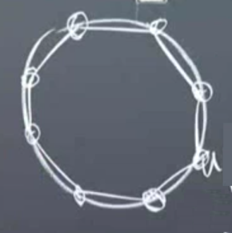
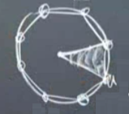
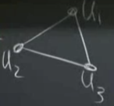
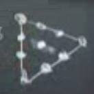

# Ders 1.27

Bu derse vereceğim ödevi tarif ederek başlayayım, ödevde Poisson denkleminin
çözümünü, ama sınırları kare değil çember olan bir ızgarada çözmenizi
isteyeceğim. Çözülecek denklem

$$
-u_{xx} - u_{yy} = 4
$$

Eşitliğin sağ tarafı $f$, ve bu $f$ sabit olduğu için $v$ ile çarpım sonrası
alınacak entegraller daha basit oluyor tabii, sabit çarpı deneme fonksiyonu,
kolay hesap.  Sınırda, çember üzerinde, $u = 0$ şartını koyuyoruz. Bu sistemi
çözeceğiz. Analitik çözümün ne olduğunu görmek zor değil, $u = 1 - x^2 - y^2$.
Yerine koyarsak doğrulaması kolay, iki kere $x$ türevi 2, $y$ türevi 2, toplam
4.

Çember içindeki ızgaraya önce bir poligonla başlıyorum. Bu arada araştırma
sorusu bağlamında aklımdaki sorulardan biri hesabın ortaya çıkaracağı hata
miktarı. Bazı ızgaralar diğerlerinden daha iyi olabilir.

Neyse, sınır şartımızı hatırlarsak düz çizgilerin çembere değdiği noktalarda
$u = 0$. $M$ tane köşe olsun, ve orta noktadan köşelere çizgiler çekerek
üçgenler oluşturalım, altta üçgenlerden biri görülüyor,

Üçgenin alt iki köşesinde tabii ki $u = 0$ şartı geçerli. İki üçgen arasındaki
sınırda ise doğal sınır şartı denilen Neumann şartı geçerli olacak, eğimin
sıfır olma şartı, yani $\mathrm{d} u / \mathrm{d} n = 0$. Orijinde ne yapmamız gerektiğini
şimdilik bilmiyoruz.

Gerçek bir problem işte burada. Muhakkak problem biraz yapay, çünkü analitik
çözümün ne olduğunu biliyoruz, ama mesela bu problemde hesap yapmak, hatanın
ne olacağını düşünmek, bunlar hala ilginç sorular ve ciddi işler. 

Bu problemi çözerken parçasal lineer öğeler (piecewise linear elements)
kullanmanızı isteyeceğim, daha önce bahsettiğim piramitler bunlar. Ama
bazılarınız karesel (quadratic) öğeler kullanmak isterse buna hayır demem.
Bu öğeler daha hassas / doğru sonuçlar verecektir. 

Şimdi ızgarayı daha detaylı şekilde yaratalım. Bir liste yaratacağız, bu listede
ızgara noktaları olacak, bu liste çözüm algoritmasına verilecek ve algoritma
oradan devam edecek. Çember içinde daha önce yarattığımız üçgenlerden iki
tanesini yanyana düşünelim, en sağ üstteki nokta nerededir? $(\cos \pi/8, \sin \pi/8)$ 
değil mi? Sonra en soldan en sağa $N$ tane (resimde $N=4$) düğüm daha koyarız, 
her aralık yatay eksende $h$ büyüklüğünde olabilir, ve $N h = \cos\pi/8$ tabii ki. 
Sonra dörtgenleri ortadan kesen çizgiler de ekliyorum ve alttaki şekil ortaya çıkıyor,

Izgara düğüm noktalarına indis atamak iyi olur, soldan sağa önce orta çizgi
üzerinde 1,2,3,4,5 diye gideriz, sonra üst kenar, ardından alt, 13 tane düğüm
olur. Üçgenlere de indis atarız, 14 tane üçgen var. Düğüm noktalarının listesi
(0,0), (h,0), (2h,0), .. diye gidecek. Peki üçgenler? Onları köşe indisleriyle
belirtebiliriz, her üçgen için üç tane.

Bu listeleri alan kod bir $K$ matrisi oluşturur, matris eşsiz (singular) olur
çünkü sınır şartları daha içinde yok. En sağ üç nokta sıfırlandıktan sonra
(sınır şartı onları etkiliyor) matris tersi çevrilebilir hale gelir, ve $Ku = f$
çözülür. Kodun yaptığı $K$ ve $f$'yi oluşturmak.

Üçgen şekilleri hakkında; üçgenlerin açıları ufak olmayacak şekilde seçin dedik
fakat probleme göre bu değisebilir, mesela bir uçak kanadının aerodinamik
simülasyonu için FEM kullanıyorsanız, havanın akışı yönünde ince ince üçgenler
koymak gerekebilir çünkü ilginç olan fiziki fenomen o boyutta vuku bulmaktadır.

Şimdi bir adım geriye atıp resme bir daha bakalım. Matrisi oluştururken temel
aldığımız formül Poisson / Laplace denklemlerini zayıf formu. Güçlü formdan
başlayalım,

$$
-u_{xx} - u_{yy} = f(x,y)
$$

Zayıf forma geçmek için iki tarafı bir deneme fonksiyonu ile çarpıyorum,
ve tüm alan üzerinden entegralini alıyorum,

$$
\int \int (-u_{xx} - u_{yy}) v(x,y) \mathrm{d} x \mathrm{d} y =
\int \int f(x,y) v(x,y)  \mathrm{d} x \mathrm{d} y
\qquad (1)
$$

Üstteki "tüm mümkün (admissable)'' $v(x,y)$'ler için yapılır. Ana fikir şu eğer
üstteki geniş bir $v$ ailesi için doğruysa bunun olmasının tek yolu sol tarafta
çarpılanların sağ tarafta çarpılanlara eşit olması, çıtlatılan temel yardımcı
önerim (lemma) bu.. Burada sözel olarak belirttik daha kuramsal şekilde de
ispatı var ama, ana fikir güçlü formun zayıf forma olan eşitliği.

Sonraki adım nedir? Eşitliğin sağ tarafı iyi ama sol taraf daha iyi olabilir,
sol tarafta ikinci türev var, ve benim piramit fonksiyonlarımın ikinci türevleri
yok. O zaman parçalı entegrasyon tekniğini uygularım, böylece türevi $u$'dan
$v$'ye geçirebilirim, $u$'da tek türev kalır ve piramitlerimi kullanabilirim.

Parçalı entegrasyon tekniğinin iki boyutlu versiyonunu kullanmam lazım. Green'in
formülü gerekli, ya da Gauss-Green formülü [2]. Şimdi (1)'de eşitliğin
sol tarafını alttaki gibi yazayım,

$$
\int \int -\mathrm{div} (\mathrm{grad} u) v \mathrm{d} x \mathrm{d} y
$$

Bu formülde  $\mathrm{div}$ $v$'ye gidince artı oluyor, devriği alınıyor $\mathrm{grad}$
oluyor, 

$$
= \int \int (\mathrm{grad} u) (\mathrm{grad} v) \mathrm{d} x \mathrm{d} y  + \oint (\mathrm{grad} u \cdot n) v
\qquad (2)
$$

Ya da farklı bir formda şöyle yazabilirim, 

$$
\int \int
\left(
\frac{\mathrm{d} u}{\mathrm{d} x} \frac{\mathrm{d} v}{\mathrm{d} x} +
\frac{\mathrm{d} u}{\mathrm{d} y} \frac{\mathrm{d} v}{\mathrm{d} y} 
\right) =
\int \int f(x,y) v(x,y)  \mathrm{d} x \mathrm{d} y
$$

Bizim örneklerimizde, bu derste deneme, test fonksiyonları sürekli, kesintili
süreksiz değil. O durumda matematikte bambaşka bir aleme giriyoruz, "süreksiz
(discontinuous) Galerkin'' denen alan bu, kendi uzmanları var, vs. Biz sürekli
(continuous) Galerkin, CG yapıyoruz.

Ve FEM'in özüne geliyoruz artık, iyi huylu, güzel polinomlardan oluşan
$\phi$'ler ile,

$$
U = U_1 \phi_1 (x,y) + ... + U_N \phi_N (x,y) 
$$

Resimde görülen ızgaradaki her düğüm için bir $\phi$, 13 tane olacak yani, sonra
$v$ ile $\phi$'yi aynı seçeceğim, ve böylece sonsuz boyut yerine 13 boyutta
çalışıyor olacağım. Sonra üstteki az boyuttaki alt uzayı, FEM uzayını, yani
formülünü alıyorum ve zayıf forma sokuyorum, ve onu 13 tane $v$ ile ayrı ayrı
ilintilendirip 'test ediyorum'. Sokma işlemini yapalım,

$$
\int \int
\left(
\frac{\mathrm{d} U}{\mathrm{d} x} \frac{\mathrm{d} V}{\mathrm{d} x} +
\frac{\mathrm{d} U}{\mathrm{d} y} \frac{\mathrm{d} V}{\mathrm{d} y} 
\right) =
\int \int f V  \mathrm{d} x \mathrm{d} y
$$

Bu entegral tüm alan üzerinden. Kullandığım $U$ bilinen fonksiyonların bir
kombinasyonu, ve $V$'ler kombine edilen aynı fonksiyonlardan seçilecek (Galerkin
yöntemi olduğu için). 

Tek boyut örneğine kıyasla hala yeni bir fikir eklemiş olmadık. Tek boyutta
yanyana düşen iki şapka fonksiyon türevlerinin entegralini almaktan bahsettik,
bir alternatif ise bir bölge seçip ona dokunan deneme fonksiyonlarından bir 2 x
2 öğe matrisi yaratmaktı. İki boyutta bu yöntem doğru yöntem. Seçilen alan üçgen
tabii ki, yani kod her üçgene teker teker bakacak ve onlardan ayrı matrisler
oluşturacak. Yani üstteki entegral her üçgen için oluşturulacak .

Başta P1 öğeleri kullanacağız demiştik, yani tek derece polinom. Her üçgen
için P1 öğesi nasıl oluştururuz? 

Üstteki üçgende tepe noktada $U_1$ yüksekliği, alt solda $U_2$ alt sağda $U_3$
yüksekliği var. Düğümlerdeki değerler bunlar. Üçgenin ortasında, yani o düz
yüzeyde (düz çünkü 1'inci derece polinom bunu verir) $U$ değeri $U = a+bx+cy$.
O zaman $U_1,U_2,U_3$ değerlerini biliyorsam $a,b,c$ katsayılarını da biliyorum
demektir (düzlem formülünde köşe noktaları düzlem formülünü belirler), diğer
yönde doğru muhakkak. Bu geçişi yapan bir 3 x 3 boyutunda bir matris var yani (3
x 1 vektör alan ve 3 x 1 vektör döndüren bir hesap doğal olarak o boyutta).

Düğüm değerleri ile katsayılar arasında bir tercüme yapıyoruz, bu gerekli çünkü
bilinmeyenler düğüm değerleri.. bilinmeyenler piramit fonksiyonunu çarpan
değerler, mesela üst köşede 1 yüksekliğindeki piramit fonksiyonunu başta $U_1$
ile çarpıyoruz, piramit o noktada 1'den başlayıp diğer köşelerde 0'a inen bir
şey hatırlarsak, aynı şekilde $U_2$ kendi köşesinde 1'den başlayıp diğerlerinde
0'a inen piramiti çarpıyor, $U_3$ de öyle. Ortadaki o düzlük te verilen
$a + bx + cy$ formülünde.

$U_1$,$U_2$,$U_3$ noktalarının nerede olduğunu biliyoruz, değil mi, onları
ızgarayı oluştururken biz seçtik. Bu noktalardan bir 3 x 3 matrisi
oluşturacağız, ki böylece $a,b,c$ katsayılarına geçiş yapabilelim.

Katsayılar niye lazım? Çünkü entegrasyon işlemini yaparken o katsayılar bize
lazım, $\mathrm{d} U / \mathrm{d} x$, $\mathrm{d} U / \mathrm{d} y$ türevleri için. 

P2 için formül

$$
U = a + bc + cy + dx^2 + exy + fy^2
$$

şekline geliyor. Katsayı sayısı arttı, 6 tane oldu. 6 tane bilinmeyen için 6
tane bilinen gerekir o zaman üçgen üzerinde 3 yerine 6 noktadan değer almam
lazım, 

Bazı noktalar üçgenin uçlarında, diğerleri ortalarda. Izgara içindeki diğer
üçgenleri de unutmayalım, 

Onların da benzer orta noktaları olacak, ve dikkat, bu noktalar, aynen köşe
noktalar gibi diğer üçgenler ile paylaşılıyor olacak. O paylaşım metotun
önemli bir özelliği.

Bu büyük ızgarada 16 düğüm var. Ve her üçgen içinde üstteki yeni $U$ formülü
işlemde. Bu durumda, bilinmeyen 6 değeri bilinen 6 değere ilintilendirmek için
bize bir 6 x 6 boyutunda matris gerekecek.

Peki her üçgen için çatı neye benzer?  Hafiften eğimli olur değil mi? İki
boyutlu parabol şeklinde yani. Bir soru daha soralım, mesela sol üst
üçgenin bu eğimli parabolu ile üst sağ üçgenin parabol çatısı birbiri ile
bağlantılı olur mu? Bir süreklilik var mıdır? Evet, çünkü dikkat edersek
bu iki üçgen arasında paylaşılan bir kenar var, orada üç tane nokta ortak.
Sürekliliği sağlamak için bu üç nokta yeterli mi? Bu sorunun cevabı FEM'i
batıran ya da çıkartan cevap olacak, ama cevap evet. Dikkat edersek
iki parabol yüzey arasındaki çizginin formülü nedir? Tek boyutlu parabol!
Bu tür eğrilerin formülünü belirtmek için üç tane katsayı yeterli değil mi?
Cevap evet. Demek ki o üç bağlantı noktası yeterli.

Küpsel öğeler peki? Onlar için 4 tane daha katsayı lazım, o zaman 4 tane
daha düğüm eklemem lazım. Yeni düğüm noktaları alttaki gibi dağıtılabilir,

Bu sefer üçgen ortasına da bir nokta koyduk, kalan noktalar kenarlarda 4'er
tane, ki bu 4 nokta daha önceki örnekte olduğu gibi geçişlilik için yeterli.

Ekler

Hocanın formülü (2)'yi türetmek için [2]'deki Gauss-Green formülünden başlarsak,

$$
\iint_R \mathrm{grad} v \cdot w  \mathrm{d} x \mathrm{d} y =
\iint_R v (-\mathrm{div} w) \mathrm{d} x \mathrm{d} y + \int_C v w \cdot n \mathrm{d} s
$$

Ya da

$$
\iint_R v (-\mathrm{div} w) \mathrm{d} x \mathrm{d} y  =
\iint_R \mathrm{grad} v \cdot w  \mathrm{d} x \mathrm{d} y - \int_C v w \cdot n \mathrm{d} s
$$

$w$ için $\mathrm{grad} u$ sokuyoruz,

$$
\iint_R -\mathrm{div} (\mathrm{grad} u) v \mathrm{d} x \mathrm{d} y  =
\iint_R \mathrm{grad} v \cdot \mathrm{grad} u  \mathrm{d} x \mathrm{d} y - \int_C (\mathrm{grad} u \cdot n) v \mathrm{d} s
$$

En sağdaki terimde eksi işaret var, hocada yok, derste bir yanlış yapılmış
olabilir.

Kod

[3]'te alınan Python kodu `femcode2.py` içinde bulunabilir.

Kaynaklar

[1] *18.085 SUMMER 2012 Site*,
    [https://math.mit.edu/classes/18.085/2012summer.html](https://math.mit.edu/classes/18.085/2012summer.html)

[2] Bayramlı, *Hesapsal Bilim, Ders 1.22*

[3] Bueler, [https://github.com/bueler/py_fem_distmesh2d](https://github.com/bueler/py_fem_distmesh2d)
    

