# Ayrıksal Fourier Transformu (Discrete Fourier Transform -DFT-)

Frekans Analizi, Periyodik Sinyaller

Bir periyodik sinyali nasıl analiz ederiz? Kendimiz bir sinyal oluşturmak
istesek bunu nasıl yapacağımızı düşünelim; $\sin$ ya da $\cos$
fonksiyonlarının bir periyotu vardır, $0,2\pi$ arasındaki değerler
$2\pi,4\pi$ arasında tekrar eder, vs.. Bazı ek özellikler; mesela $\cos$
sıfır noktasında 1 değerine sahip, fakat elimizdeki zaman serisi sağa ya da
sola "kaymış'' olabilir, buna faz kayması (phase shift) deniyor, yani
sıfır noktasında değer 1 olmayabilir. Ayrıca -1,+1 arasında gidip gelmek
yerine mesela -10,+10 arasında gidip gelinebilir, buna genlik deniyor
(amplitude). Bir diğer özellik $0,2\pi$ arasında tek bir periyot yerine
birden fazla periyot olabilmesi (frekans değişimi).

Frekans ile başlayalım, önce normal bir kosinüs sinyali,

```python
t = np.linspace(0,10,100)
plt.plot(t, np.cos(t))
plt.xlim(0,10)
plt.savefig('compscieng_1_30_04.png')
```

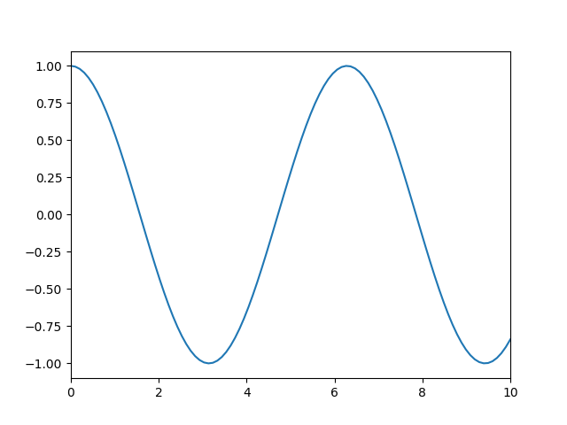

Her $\pi$ noktasını gösterelim,

```python
plt.plot(t, np.cos(t))
plt.axvline(0,lw='1',ls='dashed',color='r')
plt.axvline(np.pi,lw='1',ls='dashed',color='r')
plt.axvline(2*np.pi,lw='1',ls='dashed',color='r')
plt.axvline(3*np.pi,lw='1',ls='dashed',color='r')
plt.xlim(0,10)
plt.savefig('compscieng_1_30_05.png')
```

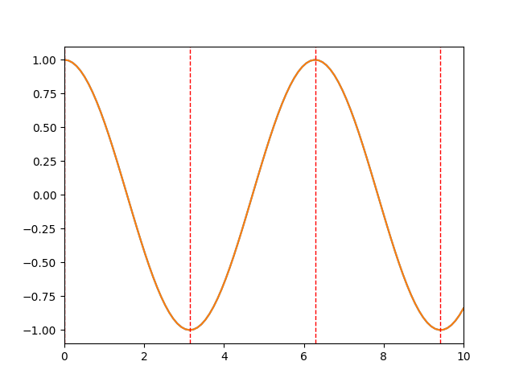

Bu sinyalde $\cos$'a verilen $t$ değerlerini iki ile çarpsam ne olur?
$0,2\pi$ arasında bir periyot için daha önceki $t$'lerin yarısı ile bu iş
yapılabilir, demek ki önceki tek periyot içinde şimdi sinyal iki kez tur
atacaktır. O zaman $\cos$ içinde bir sabit ile çarpım yapmak ile frekansı o
kadar arttırmış oldum,

```python
plt.plot(t, np.cos(2*t))
plt.axvline(0,lw='1',ls='dashed',color='r')
plt.axvline(np.pi,lw='1',ls='dashed',color='r')
plt.axvline(2*np.pi,lw='1',ls='dashed',color='r')
plt.axvline(3*np.pi,lw='1',ls='dashed',color='r')
plt.xlim(0,10)
plt.savefig('compscieng_1_30_06.png')
```

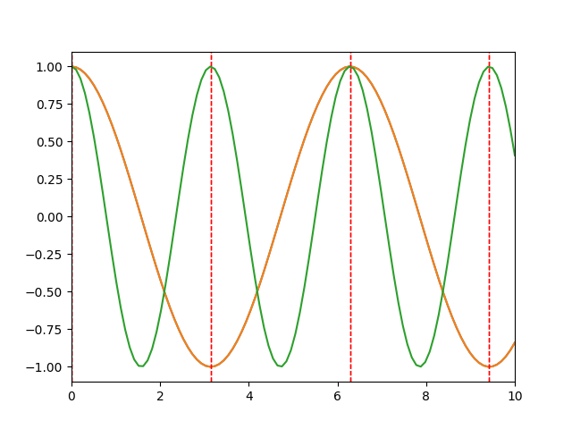

-1/+1 arasında gidip gelmeyi arttırmak en kolayı, $\cos$ hesabından elde
edilen değeri mesela 10 ile çarparsam genlik o kadar artar. Faz kaydırma
$\cos$ içinde bir toplam olabilir. Tüm resmi göstermek gerekirse, $A$
genlik, $f_0$ frekans, faz kayması $\phi$ olacak şekilde,

$$ 
x(t) = A \cos (2\pi f_0 t - \phi)
$$

Bu formülün grafiği,


Direk formüle bakarak $A$ hemen anlaşılabiliyor. Frekans $t$'yi çarpan
değerle orantılı, yanlız dikkat, bu değer her zaman $2\pi$'ye oranlı bir
şey, yani formül $\cos(10 t)$ gibi bir ifade içeriyorsa, $10 / 2\pi$ ile
$f_0$'yi çıkartmamız gerekir. Eğer $t$ saniye birimine sahipse, bir periyot
$T_0 = 1/f_0 = 0.5$ saniyedir, ve frekans 2 Hertz olacaktır. Eğer frekans
$w_0 = 2\pi f_o$ formunda gösterilirse, o zaman birim radyan / saniye olur.

Faz kayması $\phi$ sebebiyle tepe noktanın nerede olduğu da direk formülden
anlaşılamıyor, biraz ek hesap lazım, üstteki örnekte 3/16, bunu bulmak
için "kosinüse geçilen değerin sıfır olduğu yer'' gerekli,

$$ 0 = 2\pi \cdot 2 \cdot t  - 3\pi/4 
\implies t = 3\pi / (4 \cdot 4\pi)  
\implies t = 3/16
$$

Fakat hala faz kayması $3\pi/4$ diyebiliriz. 

Örneklemek (Sampling)

Sayısal, yani bilgisayar ortamında bilgiler ayrıksaldır, kimse bize üstteki
sürekli formül formatıyla sinyal parametrelerini vermez. Diyelim ki bir
sinyalin saniyede 10 tane örneklemini alıyoruz. O zaman 3 saniye sonra
elimizde 30 veri noktası olacak. Fakat her örneklem frekansı gerçek sinyali
anlamak için yeterli değildir. Nyquist teorisine göre örneklem gerçek
frekansın en az iki katı olmalıdır. Altta bazı örnekler görülüyor, en
alttaki örneklem frekansı dalga frekansı ile aynı, ve bu sinyali anlamak
için yeterli değil. Veri noktalarına bakarak onların ilk üç noktada bir
düz çizgi oluşturduğunu zannedebilirdik.

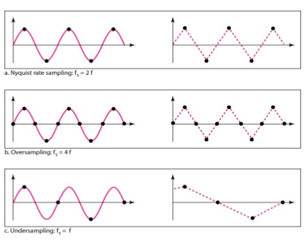

Tabii sadece ayrıksal frekansa bakarak sinyalin frekansının ne olduğunu
anlamak ta mümkün degil. Eğer bir şekilde gercek sinyalin kaç örneklemde
bir tekrar ettiğini bulursak, o zaman yaklaşık bir frekans bulabiliriz;
mesela bir sinüssel sinyalin 20 ölçümde bir tekrar ettiğini bulduk, ve
örneklem periyotu 0.05 milisaniye / örneklem ise (her iki örneklem arası
geçen zaman), o zaman

$$ 
\textrm{sinüs dalgası periyotu} =  
\frac{20 \textrm{ örneklem}}{periyot}
\frac{0.05 \textrm{ milisaniye}}{\textrm{örneklem}} = 1 milisaniye
$$

Demek ki periyot 1 / 1 milisaniye = 1 Khz. Ya örneklem periyotu 2
milisaniye olsaydı? O zaman sinüs dalga periyotu 40 milisaniye olurdu, ve
gerçek frekans 25 Hz olurdu. Söylemek istediğimiz ayrıksal durumda
Hz. bazında gerçek frekansın hesabı her zaman örneklem frekansına $f_s$'e
bağlıdır,

$$ f_s = 1 / t_s$$

Ayrıksal Fourier Transformu

[4]'te sürekli Fourier Transformunu gördük,

$$ X(f) = \int_{-\infty}^{\infty} x(t) e^{j2\pi ft} \mathrm{d} t $$

ki $x(t)$ zaman bazlı sürekli bir sinyaldir. Bilgisayarlar sayesinde
üstteki işlemi ayrıksal olarak yapabiliyoruz [2, sf. 46], 

$$ X(m) = \sum_{n=0}^{N-1} x(n) e^{-j2\pi nm / N} $$

$x(n)$ her $n$ anında, bir $n$ indisiyle erişilen, bir anlamda $x(t)$'den
"örneklenmiş'' sinyal verisi olacaktır, $e$ tabii ki doğal logaritma bazı,
$j$ ise hayali sayı $j = \sqrt{-1}$.  Euler ilişkisi $e^{-j\phi} =
\cos(\phi) - j\sin(\phi)$'den 
hareketle üstteki ayrıksal denklem alttakine eşittir,

$$ X(m) = \sum_{n=0}^{N-1} x(n) [ \cos(2\pi nm / N) - j \sin(2\pi nm / N)] 
\qquad (1)
$$

$X(m)$: $m$'inci DFT bileşeni / katsayısı - $X(0),X(1),..$ diye gidiyor

$m$: Frekans yöresindeki (domain) DFT çıktısının katsayı indisi

$x(n)$: Zaman yöresindeki bilginin ayrıksal verisi

$n$: Zaman verisi indisi

$N$: Giriş verisinden ve çıktı frekans noktalarından kaç tane olduğu

Örnek

Diyelim ki elimizde biri 1 kHz ve diğeri 2 kHz'lük frekanslardan oluşan bir
sinyal var, bu sinyalin sürekli hali şöyle,

$$ x(t) = \sin(2\pi \cdot 1000 \cdot t) + 0.5 \sin (2\pi \cdot t + 3\pi/4)$$

Sinyali örnekleme oranımız $f_s = 8000$, her saniye $f_s$ kadar örneklem
alıyoruz, her veri nokta arasındaki zaman farkı $t_s = 1/f_s$. Elimizdeki
bu hızda ardı ardına alınmış 8 tane veri noktası olsun, yani
$N=8$. Ayrıksal formül,

$$ x(n) = \sin(2\pi \cdot 1000 \cdot nt_s) + 0.5 \sin (2\pi \cdot nt_s + 3\pi/4) $$

Bu noktalarda $x(n)$ değerleri

```python
fs = 8000.; ts = 1/fs
def x(n):
    return np.sin(2*np.pi*1000*n*ts) + 0.5*np.sin(2*np.pi*2000*n*ts + 3*np.pi / 4)

for n in range(8): print np.round(x(n),4),
```

```
0.3536 0.3536 0.6464 1.0607 0.3536 -1.0607 -1.3536 -0.3536
```

Şimdi $x(n)$ girdisine DFT uygulayacağız. Eğer 1 kHz'un Fourier
katsayılarını merak ediyorsak, $X(1)$ hesaplarız, yani (1) formülü
kullanılacak, ki formül şuna benzer,

$$ X(1) = \sum_{n=0}^{7}  x(n)\cos(2\pi n / 8) - jx(n)\sin(2\pi n / 8) $$

Genel kodla gösterelim,

```python
def X(m):
    real = 0.0; imag = 0.0
    for n in range(8): 
        real += x(n)*np.cos(2*np.pi*m*n/8.)
        imag -= x(n)*np.sin(2*np.pi*m*n/8.)
    return np.round(real,4), imag

print X(1)
```

```
(-0.0, -4.0)
```

2 kHz için ne olur?

```python
print X(2)
```

```
(1.4141999999999999, 1.4142135623730947)
```

Bu sonuçlarda 1. kısım sayının reel tarafı, 2. kısmı pür kompleks
tarafı. Çoğunlukla bu elde edilen $X(m)$ sayısının büyüklüğü (magnitude) ile
ilgileniriz, bu hesap

$$ X_{\textrm{büyüklük}} = |X(m)| = \sqrt{X_{reel}(m)^2 + X_{kompleks}(m)^2}$$

olarak yapılıyor. `numpy.abs` çağrısı bu hesabı hayali sayılar
üzerinde otomatik olarak yapar.

```python
r,i = X(2)
print res, u'büyüklük', np.abs(complex(r,i))
```

```
-5.55111512313e-17j büyüklük 1.99999040998
```

Büyüklüğe bakılırsa 2 Khz frekansının katsayısı ufak değil, demek ki bu
frekans sinyal içinde var / önemli. 3 Khz'e bakalım,

```python
r,i = X(3)
print res, u'büyüklük', np.abs(complex(r,i))
```

```
-5.55111512313e-17j büyüklük 5.55111512313e-17
```

Çok ufak, demek ki bu frekans sinyal içinde mevcut değil.

Örnekte sürekli bir formül kullanarak $x(n)$ hesabı yapılmış olması
ayrıksallığın nerede başlayıp bittiği hakkında kafa karışıklığı yaratmasın;
analitik formül iki yöre arasında gidiş / geliş nasıl oluyor bunu göstermek
için verildi. Çoğunlukla elimizde sadece bir tek boyutlu bir dizi içinde
bir veri serisi olur, bu verinin hangi analitik formülden geldiğini
bilmeyiz (Fourier analizini onun için yapıyoruz zaten!), veri hakkında
eldeki diğer tek bilgi onun örneklem frekansı olur.

Bir örnek üzerinde daha görelim [3, sf. 152], bu sefer kütüphane çağrısı
`scipy.fft` ile analiz yapalım,

```python
import scipy

N = 64; n = np.arange(N) - 1; T = 0.05;
t = n*T; xbn = np.sin(w1*t)+ 0.5*np.sin(w2*t);
plt.stem(t,xbn)
plt.savefig('compscieng_1_30_08.png')
k = np.arange(N) - 1
Xb = scipy.fft(xbn);
plt.figure()
plt.stem(k,abs(Xb))
plt.savefig('compscieng_1_30_09.png')
```

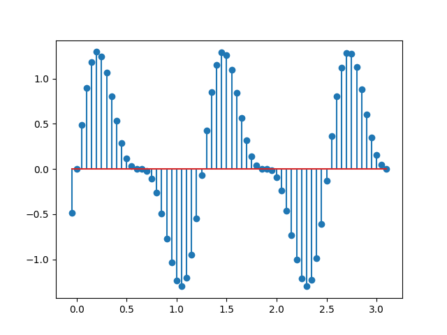
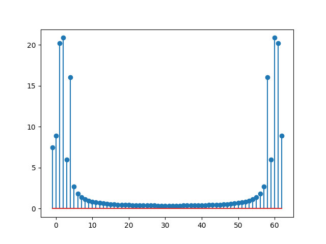

Üst sağdaki frekans analizine göre $k=2$ ve $5$'te büyüklük var, bu
değerler $k\omega_0 = 2\pi k / NT$ ile $\pi$ bazına çevirilebilir, $k=2$
için $2\pi k / 3.2 = 1.25 \pi$ olur, $k=5$ için $3.125 \pi$ elde ederiz.

Ders 15

[Strang hocanın notlarından. Üstteki DFT yöntemi toplamlar, döngüler, belli
indisler kullanarak yapılıyor. Altta Strang'in anlattığı yaklaşımla, bir
sinyalin belli frekansların katsayılarla ağırlıklanmış toplamı olduğu temel
Fourier formülüyle başlarız, fakat diğer yöne gitmek için pür lineer cebir
kullanırız, böylece katsayı hesabı bir matris tersi alma işlemi haline
gelir].

Ayrıksal (discrete) olarak Fourier modellemesi yapmak istiyorsak, elimizde
devamlı (continuous) f(x) fonksiyonu olmayacak, bir f(x) fonksiyonun belli
noktalarındaki değerleri (olduğunu farzettiğimiz) verileri içeren bir {\em
  vektör} olacak. Bu vektörün N elemanı var diyelim. Fonksiyon periyodik
olduğuna göre, x için $2\pi$'i N eşit parçaya böleriz (tahtadan alınan
resim altta). Bunu söylemekle fonksiyonun periyotunun $N$ olduğunu farz
etmiş oluyoruz, bir anlamda diyoruz ki eğer elimizde $N$ tane daha nokta
olsaydı, onlar elimizde olan değerlerle tıpatıp aynı olacaktı. Örneğimizde
N=4 olsun.


Ayrıca $F(x)$ formülü biraz değişecek. Elimizde sonsuz tane nokta olmadığına göre

$$ F(x) = \sum_{n=0}^{N} c_ne^{inx} $$

olması lazım. Şimdi, eğer bütün $c_k$ değerlerini biliyor olsaydık, bu
fonksiyon, x=0 noktasında hangi değere sahip olurdu?

$$ f(0) = c_0 + c_1 + c_2 + c_3 + c_4 = Y_0 $$

Sonraki $x$ değerleri $2\pi/N, 4\pi/N, ..$ için (çünkü her parça $2\pi/N$,
bir sonraki parça $2\pi/N + 2\pi/N$, bir kere topluyoruz, yani parçayı $2$
ile çarpıyoruz, sonra $3$ ile, vs) aşağıdaki gibi devam edeceğiz, ama ondan
önce bir $w$ değişkeni tanımlayalım, bu değişkeni $w=e^{2\pi i/N}$ olarak
alalım. Böylece $w^2$ dediğimizde üstel işlemlerde çarpım işlemi toplama
işlemine dönüşeceği için $e^{4i\pi/N}$ değeri elde edilebilir, $w^3$ ile
$e^{6i\pi/N}$ elde edilir, vs. Bu değerler bize lazım olacak değerler, $w$
sayesinde formüller daha temiz olacak. $F(2\pi/N)$ içindeki 3. terim
($n=2$) nedir?  $c_ne^{inx} = c_2e^{2i2\pi/N} = c_2e^{4i\pi/N} = c_2w^2$. O
zaman

$$ f(2\pi/N) = c_o + wc_1 + w^2c_2 + w^3c_3 = Y_1 $$

Devam edelim:

$$ f(4\pi/N) = c_o + w^2c_1 + w^4c_2 + w^6c_3 = Y_2  $$

$$ f(6\pi/N) = c_o + w^3c_1 + w^6c_2 + w^9c_3 = Y_3  $$

Elimizdeki dört toplam işlemine bakınca, bu toplamlar ve çarpımların aslında
lineer cebir üzerinden matrisler ile gösterilebildiğini farkedebiliriz. 

$$  
\left[ \begin{array}{c}
    Y_0 \\
    Y_1 \\
    Y_2 \\
    Y_3
\end{array} \right]
=
\left[ \begin{array}{cccc}
    1 & 1 & 1 & 1 \\
    1 & w & w^2 & w^3  \\
    1 & w^2 & w^4 & w^6  \\
    1 & w^3 & w^6 & w^9  
\end{array} \right]
\left[ \begin{array}{c}
    c_0 \\
    c_1 \\
    c_2 \\
    c_3
\end{array} \right] \\
$$

Her matris için bir değişken kullanırsak

$$ Y = WC $$

F(x)'ten (yani Y'den) C'ye gitmek istersek, elimizde $Y_n$ değerleri var, $w$
değerleri zaten sabittir, W bu sabit değere göre oluşturulur, o zaman, $c_n$
sayılarını nasıl buluruz?

$$ Y = WC  $$

$$ W^{-1}Y = W^{-1}WC  $$

$$ W^{-1}Y = C $$

Yani $W$ matrisinin tersini (inverse) alıp, onu $Y$ ile çarpınca elimize $C$
değerleri geçecek [1, sf. 340-370].

Güneş Benekleri

Güneşte periyodik olarak olan benekler, aşağı yukarı 11 senede bir ortaya
çıkarlar. Bu benekler uzun süredir gözlenmekte ve ölçülmektedir,
şiddetlerine göre, `sunspots.dat` adlı dosyada bulabiliriz. 

```python
tempdata = np.loadtxt('sunspots.dat')
year=tempdata[:,0]; sunspots=tempdata[:,1]
year=year[year<2001]; sunspots=sunspots[year<2001]
plt.plot(year,sunspots)
plt.title(u'Güneş Benekleri')
plt.savefig('compscieng_1_30_03.png')
```

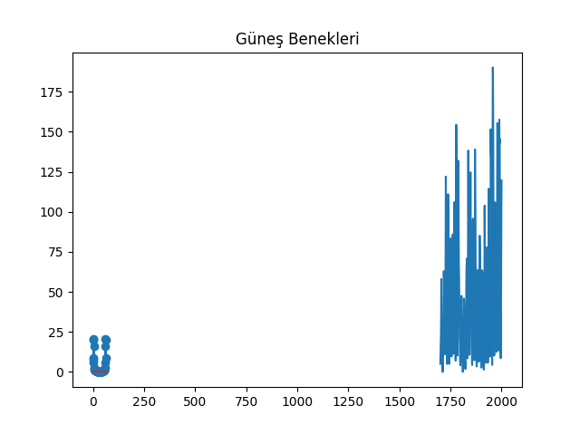

Benek verisindeki periyodik oluşu Fourier transformu ile analiz
edelim. Alttaki kod $w$, $W$'yi kullanarak üstteki çarpımlarla $C$
vektörünü bulacak. Bu vektör içindeki sayılar Fourier analizindeki belli
frekanslara, harmoniklere tekabül ediyor olacaklar. Bu $C$ değerlerinde
bazıları diğerlerinden daha güçlü bir etkidir, mesela 11 senelik periyot C
içinde daha belirgin olarak çıkmalı.

```python
import scipy

tempdata = np.loadtxt("sunspots.dat")

year=tempdata[:,0]

Y=tempdata[:,1]

N = len(Y)

w = np.exp((2*np.pi*1j)/N)

W = np.zeros((N,N), complex)
for i in range(N):
    for k in range(N):
        W[i,k] = w**(i*k)
        
C = np.dot(np.linalg.inv(W), Y) 
```

Periyotların grafiği,

```python
n=len(Y); print 'n=',n
power = np.abs(C[0:int(n/2)])**2
nyquist = 1./2
freq = np.array(map(float, np.array(arange(0,int(n/2))))) / (n/2)*nyquist
print 'len(freq)=',len(freq)
period=1./freq;
plt.plot(period,power)
plt.xlim(0,30)
plt.savefig('compscieng_1_30_02.png')
```

```
n= 305
len(freq)= 152
```


11 sene civarında belirgin bir frekans olduğunu görebiliyoruz. 

FFT

Bitirmeden önce FFT konusundan bahsedelim. $*D*$FT algoritması kodda
görüldüğü gibi bir W matrisi ortaya çıkarır ve önce tersini alma, sonra bu ters
ile bir çarpım işlemi yaparak C sonucunu üretir. $O$ notasyonunu kullanırsak
DFT'nin karmaşıklığı $O(N^2)$'dir. Bu iyi bir hızdır.

FFT algoritması üstteki çarpımın bazı özelliklerini kullanarak DFT'yi daha
da hızlandırır ve $O(\frac{1}{2}Nlog_2N)$ hızına getirir. FFT'den bu
makalede bahsetmeyeceğiz, aklımızda olsun, `scipy.fft` çağrısı bu
algoritmayı kullanır, örnek:

```python
C = scipy.fft(Y)
print C[:3]
```

```
[ 15318.00000000   +0.j           1153.09522938 +866.74784921j
    -72.35158374+1347.22954505j]
```

Soru

FFT yaklaşıksal bir algoritma mıdır? Yani DFT'nin elde değerlere "yakın''
değerler daha hızlı mı hesaplanıyor? 

Cevap

FFT ile DFT tıpatıp aynı katsayıları hesaplıyorlar, FFT sadece bu hesabı
daha hızlı yapıyor.

Lomb-Scargle

Daha önceki bir yazida güneş beneklerinin ortaya çıkışı verisinde
periyotlar bulmak için Fourier analizi kullanmıştık. Bu analizin eksik bir
tarafı istatistiki önemlilik (significance) hesabını göstermemesi. Daha iyi
bir yöntem Lomb-Scargle yöntemi, ki bu yönteme göre periyot bulmak pek çok
sinüs eğrisinin hangilerinin veriye daha iyi uyduğunu bulma problemine
çeviriliyor, problem bir tür en az kareler çözümü haline geliyor, arka
planda FFT kullanılıyor fakat problemin ana modeli artık FFT değil. Güneş
benekleri,

```python
tempdata = np.loadtxt('sunspots.dat')
year=tempdata[:,0]; sunspots=tempdata[:,1]
year=year[year<2001]; sunspots=sunspots[year<2001]
plt.plot(year,sunspots)
plt.title(u'Güneş Benekleri')
plt.savefig('tser_ar_06.png')
```

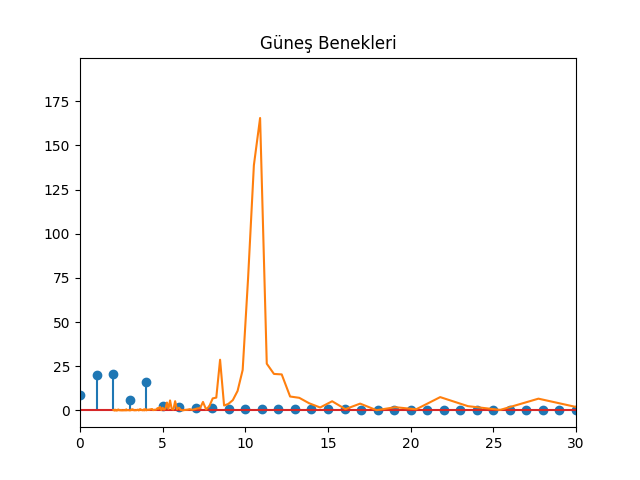

```python
from astroML.time_series import lomb_scargle
omega = np.linspace(1, 40, 200)

dy = 0.5 + 0.5 * np.random.random(len(sunspots))
sig = np.array([0.1, 0.01, 0.001])
PS, z = lomb_scargle(year, sunspots, dy, omega, generalized=True, significance=sig)

plt.plot(omega,PS)
plt.hold(True)

xlim = (omega[0], omega[-1])
for zi, pi in zip(z, sig):
    plt.plot(xlim, (zi, zi), ':k', lw=1)
    plt.text(xlim[-1] - 0.001, zi - 0.02, "$%.1g$" % pi, ha='right', va='top')
    plt.hold(True)
plt.title(u'Güneş Benekleri Periyotları')
plt.savefig('tser_ar_07.png')
```

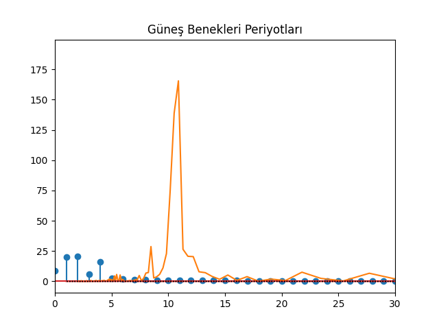

Grafikte 0.1, 0.01, 0.001 önemliliğini yatay çizgiler olarak görüyoruz; bu
çizgilerin üzerindeki her tepe noktası önemli bir periyottur.

Bir diğer örnek: Altta dünyada 500 kusur milyon yıl geriye giden canlı tükenme
yüzde grafiği görülüyor [7]. Mesela yaklaşık 66 milyon sene önce bir göktaşı
çarpmasıyla müthiş bir tükeniş yaşandı, zaten dinazorların yokolması bu olay ile
oldu. Bu olay grafikte açık bir şekilde görülüyor.

```python
import pandas as pd
ext = pd.DataFrame(pd.read_csv('extinct.csv',header=None))
ext2 = ext.set_index(np.linspace(542,1,len(ext)))
ext2[0].plot()
ext = ext[0]
plt.savefig('tser_ar_09.png')
```

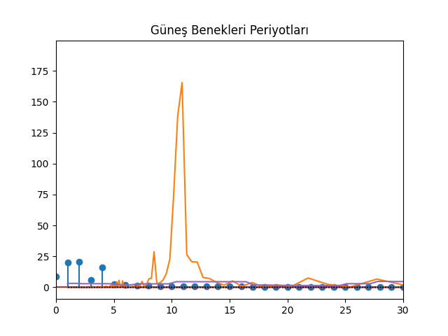

Soru şu: acaba bu verideki periyotlar hangileri? Tükenişte belli periyotlar var mı?

```python
from astroML.time_series import lomb_scargle

dy = 0.5 + 0.5 * np.random.random(len(ext))
omega = np.linspace(10, 100, 1000)
sig = np.array([0.1, 0.01, 0.001])
PS, z = lomb_scargle(ext.index, ext, dy, omega, generalized=True, significance=sig)

plt.plot(omega,PS)
plt.hold(True)

xlim = (omega[0], omega[-1])
for zi, pi in zip(z, sig):
    plt.plot(xlim, (zi, zi), ':k', lw=1)
    plt.text(xlim[-1] - 0.001, zi - 0.02, "$%.1g$" % pi, ha='right', va='top')
    plt.hold(True)
plt.title(u'Canlıların Tükenme Periyotları')
plt.savefig('tser_ar_08.png')
```

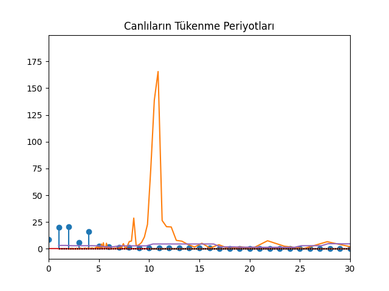

Grafiğe göre yaklaşık 25 milyon, 70 milyon yılda bir rutin tükenişler görülüyor.


Kaynaklar

[1] Strang, *Computational Science and Engineering*

[2] Lyons, *Understanding Digital Signal Processing, 2nd Edition*

[3] Wang, *Applied Numerical Methods Using Matlab*

[4] Bayramlı, Diferansiyel Denklemler, *Ders 15*

[7] Bayramlı, 
    *Grafikten Veri Çıkartmak*, 
    [https://burakbayramli.github.io/dersblog/sk/2017/01/grafikten-veri-cikartmak.html](https://burakbayramli.github.io/dersblog/sk/2017/01/grafikten-veri-cikartmak.html)


    


