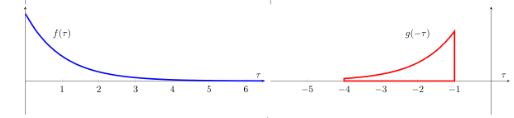
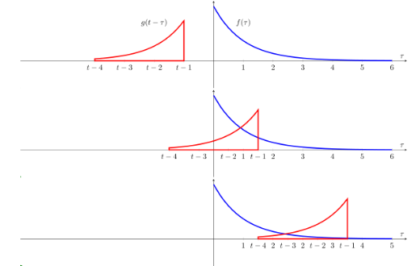
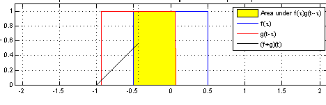
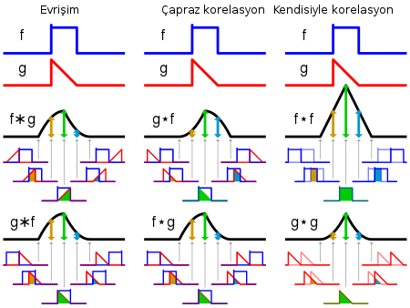

# Evrişim (Convolution)

Evrişim iki fonksiyon $f,g$ üzerinde tanımlı bir operasyondur, bu operasyon
iki fonksiyondan üçüncü bir fonksiyon yaratır. Operasyon bir entegral
üzerinden tanımlıdır, $g$'nin aynı görüntüsü / ters çevrilmiş halinin
alınıp, soldan (negatif sonsuzluk) sağa doğru kaydırılırken $f$ ile üst
üste gelen bölgenin alanını her $t$ için alınması durumudur, bu açıdan
evrişim bir tür ağırlıklı ortalama olarak görülebilir, $f$'in ağırlıklı
ortalaması $g$ üzerinden alınmaktadır. Matematiksel olarak,

$$f * g \equiv \int_{-\infty}^{\infty} f(\tau)g(t-\tau) \mathrm{d}\tau $$

Evrişim sırabağımsızdır, yani $f * g = g * f$, o zaman 

$$f * g \equiv \int_{-\infty}^{\infty} f(t-\tau)g(\tau) \mathrm{d}\tau $$

ifadesi de doğrudur. Örnek $f,g$ üzerine görelim, 


Her iki fonksiyonu bir geçici değişken $\tau$ üzerinden tanımlayabiliriz,
Sonra $g$'nin ayna görüntüsünü alırız, $g(\tau) \to g(-\tau)$



Şimdi bir zaman kaydırma faktörü $t$ ekleyebiliriz, bir $g(t-\tau)$ elde
ederiz, bunun etkisi her $t$ için $g$'yi istediğimiz noktaya
kaydırabilmektir. Bunu yaparken, mesela negatif sonsuzluktan pozitif
sonsuzluğa kaydırırken, her $t$ anında alınan entegralin sonuçları bize
evrişimi verir. Dikkat, kaydırma entegralin sonucu değil, sadece "her $t$
için'' vurgusu amacıyla bu kaydırma görüntüsü veriliyor, her $t$
noktasında, kaydırma nereye olursa olsun, $-\infty,\infty$ arasında
entegral alınmaktadır.



Ayrıksal olarak,

$$ (f * g) [n] \equiv \sum_{m=-\infty}^{\infty} f[m] g[n-m]  $$

Farklı fonksiyonlar üzerinde görelim, mesela kare fonksiyonunu kendisiyle
evrişimi, $f$ mavi, $g$ kırmızı, sarı bölgeler çakışma olan yerler, $g$'nin
her $t$ için evrişim entegral sonucu ise siyah çizgi ile gösteriliyor,





Şimdi $f$ kavisli bir fonksiyon, $g$ hala kare,


Evrişim ile çapraz korelasyon (cross-correlation) arasında bağlantılar var,
$t-\tau$ yerine $t+\tau$ kullanılırsa çapraz korelasyon elde ediliyor.



Örnek

```python
import scipy.signal
f = [1,2,3,4,5,6]
g = [5,4,3,2,1]
print scipy.signal.convolve(a,b)
```

```
[ 5 14 26 40 55 70 50 32 17  6]
```

$X+Y$ Dağılımı

Çoğu zaman $X,Y$'in bağımsız olduğu durumda bu rasgele değişkenlerin
toplamının dağılımını hesaplamak gerekir [2, sf 56]. Kümülatif fonksiyon
$F$ ile

$$ F_{Z+Y} = P(X+Y \le a) $$

$$ = \int \int_{x+y \le a}^{} f(x)g(y) \mathrm{d} x \mathrm{d} y $$

$f(x)g(y)$ kullanabildik çünkü $X,Y$ bağımsız. Alt sınırda bir değişiklik
yapalım, $x+y \le a$, o zaman $x \le a-y$. Demek ki

$$
= \int_{-\infty}^{\infty} \int_{-\infty}^{a-y} f(x)g(y) \mathrm{d} x \mathrm{d} y
$$

Entegralleri gruplayabiliriz, 

$$
= \int_{-\infty}^{\infty}
\bigg[ \int_{-\infty}^{a-y} f(x) \mathrm{d} x \bigg] g(y) \mathrm{d} y
$$

$$ = \int_{-\infty}^{\infty} F_X(a-y) g(y) \mathrm{d} y $$

Yoğunluğu almak için kümülatif fonksiyonun türevini alırsak, 

$$
f_{X+Y}(a) = \frac{d}{da} \int_{-\infty}^{\infty} F_X(a-y) g(y) \mathrm{d} y
$$

$$  = \int_{-\infty}^{\infty} \frac{d}{da} F_X(a-y) g(y) \mathrm{d} y $$

$$  = \int_{-\infty}^{\infty} f_X(a-y) g(y) \mathrm{d} y $$

Üstteki ifade bir evrişim operasyonu! Yani iki bağımsız rasgele değişkenin
toplamının yoğunluğu, değişkenlerin yoğunluklarının evrişimine eşittir!

[1, sf. 365]'de ayrıksal olarak üstteki hesaba değiniliyor, elde iki zar
var, zarın her yüzünün gelme ihtimali $p_i=1/6$, bu iki zarın mümkün her
türlü toplamının hesabı bir evrişim, $p * p$, 

```python
import scipy.signal
d = 1/6. * np.array([1.0,1.0,1.0,1.0,1.0,1.0])
print scipy.signal.convolve(d,d) 
print scipy.signal.convolve(d,d) * 36.
```

```
[ 0.02777778  0.05555556  0.08333333  0.11111111  0.13888889  0.16666667
  0.13888889  0.11111111  0.08333333  0.05555556  0.02777778]
[ 1.  2.  3.  4.  5.  6.  5.  4.  3.  2.  1.]
```

Sonuca göre toplam 12 gelme ihtimali 1/36 (en baştaki), 11 gelme ihtimali
2/36, vs.

Ek bilgiler için bkz [4] notları. 

Kaynaklar 

[1] Strang, *Computational Science and Engineering*

[2] Wikipedia, *Convolution*, [https://en.wikipedia.org/wiki/Convolution](https://en.wikipedia.org/wiki/Convolution)

[3] Ross, *Introduction to Probability Models 10th Edition*

[4] Bayramlı, Diferansiyel Denklemler, *Ders 21*


