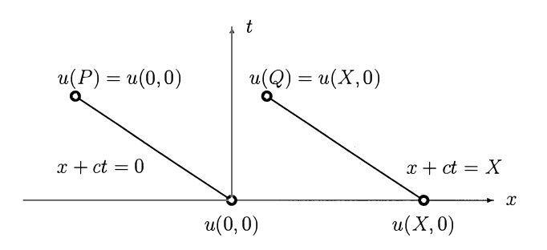

# Ders 2.3

Her hesapsal yöntemin doğruluğu ve stabilitesini bilmek isteriz. En basit
başlangıç değer problemi (initial value problem -IVP-) ile başlayalım,

$$
\frac{\partial u}{\partial t} =
c \frac{\partial u}{\partial x}
\qquad (1)
$$

Buna tek yön dalga denklemi diyebiliriz, iki yönlü dalga denklemi için üstteki
formülde ikinci türevlerin olması gerekirdi, o tür denklemde dalgalar iki yöne
de giderdi. Üstteki tek yöne dalga gönderiyor, basit, temiz bir denklem, birinci
derece, hız bağlamında sabit katsayılı. Başlangıç değer problemi için başlangıç
değeri $u(x,0)$ ile verilmiş olsun, ve benim ilgilendiğim $u(x,t)$ çözümü.

Bu çözümü bulmak zor olmaz, mesela ilk aklıma gelen pür üsteller, $e^{ikx}$.  Bu
çözümün bir özelliği sabit katsayısı var, sınırı yok, o zaman çözüm $e^{ikx}$'in
bir katı olacak, bu demektir ki değişken ayırma tekniğini uygulayabilirim, ve $u
= G(x,t) e^{ikx}$ şeklinde bir çözüm bekleyebilirim. Nasıl değişkenler ayrıldı
görüyoruz, $G$ içinde $x$, $t$'den ayrıldı, ve frekans $k$ büyüme faktörü $G$'yi
tanımlıyor.

Çözümü bulmak için içinde $G$'yi içeren $u$ formülünü ana türevsel denklem (1)'e
sokarım, ve $t$'li çözümü elde ederim, çünkü $e^{ikx}$ iptal olacak. Formüle
sokayım,

$$
\frac{\mathrm{d} G}{\mathrm{d} t} e^{ikx} = ikc G e^{ikx}
$$

Ustelli kismi iptal ederim, o terimler hic sifir olmazlar nasilsa,

$$
\frac{\mathrm{d} G}{\mathrm{d} t} \cancel{e^{ikx}} = ikc G \cancel{e^{ikx}}
$$

Böylece $G$ için basit bir denkleme erişiyorum,

$$
\frac{\mathrm{d} G}{\mathrm{d} t} = ikc G 
$$

Sonuç sabit bir katsayıya dayaniyor, $ick$ katsayısına. Nihai denklemin bir
basit diferansiyel denklem olduğunu da farkediyoruz, o zaman çözüm yine
bir üstel, $G = e^{ikc t}$. Bu $G$'yi $u$ çözümü içine koyunca, 

$$
u = G(x,t) e^{ikx}
$$

$$
u = e^{ikc t} e^{ikx} = e^{ik(x + ct)} 
$$

Çözüm bu işte. Değişkenleri ayırdık, büyüme faktörüne baktık, bir üsteli
denedik, farklılık (difference) metotları için de aynısını yapacağız. Von
Neumann'ın dahice fikri buydu, üstelleri takip et. Her frekansa bak, ve
$e^{ikx}$'in katlarına neler olduğuna bak. 

İlginç bir şey, tüm frekanslar $x+ct$ kombinasyonunu ortaya
çıkarıyor. Fourier'in de söylediği bu değil miydi? $e^{ikx}$ kombinasyonlarını
alın, onların çözümü $e^{ik(x + ct)}$'lerin kombinasyonu olacak. Yani
$x$'ler $x+ct$ oluyor bir bakıma. O zaman çözüm

$$
u(x,t) = u(x+ct, 0)
$$

Bu her $u$ için.

Bu çözümün ne olduğunu sezgisel olarak rahatça anlayabiliriz tabii, bu
tek yöne giden bir dalga. Cebirde açıkca görülüyor. $x,t$ düzleminde
bir resim çizince daha da iyi görülebilir. Bu resmi anlamak önemli
çünkü farklılık yöntemi ile üstteki denklemi çözmeye uğraşıyoruz.

Şimdi $u$'nun $(0,0)$ noktasındaki değerini düşünelim. Zaman geçtikten sonra
$x+ct$ çizgisindeki herhangi bir yerde, $P$'de olduğumuzu düşünelim, orada çözüm
hep aynı. Başlangıçtaki değer ne ise o çizgi (üstteki grafikte solda görülen)
üzerinde seyahat ediyor, $u$ değeri $(0,0)$'da ne $P$'de de o.

Üstte sağdaki çizgi aynı şekilde, orada da $X$ ile işaretli bir sabit değerde
başlayan değer çizgi üzerinde yukarı taşınacak, $Q$'da aynı $u$ değeri olacak.
[Dikkat, $x$ eksenindeki $X$ değeri $x+ct = X$ çizgisiyle temsil edilir
denmiyor, $x$ eksenindeki bir değer ile $.. =X$ şeklindeki bir çizginin
cebirsel bağlantısı yok, $ax+by+c=0$ denklemindeki sabitler grafiksel kesim
noktalarına tekabül etmezler].

Bu çizgilere karakteristik çizgiler (characteristic lines) ismi
veriliyor.

Gördüklerimiz dalga denklemlerine has bir özellik, işi denklemlerinde mesela
aynı durum görülmüyor. Tek boyuttayız tabii bunu unutmayalım, oldukca
basitleşitirilmiş bir ortam bu. Üç boyutta karakteristik köni var. Üç boyutta
düşünürsek, mesela bir ses çıkartıyorum, bir kelime telafuz ediyorum, benim
sesim bir ses dalgası bir üç boyuttaki dalga denklemini çözer, ya da parmağımı
sıklatsam mesela o ses başlangıç noktasından etrafa yayılır, bu yayılma
karakteristikler üzerinden olur. Yayılma pek çok yöne doğru muhakkak, tek
boyuttaki gibi tek çizgi değil, yüksek boyutlarda resim biraz daha çetrefil hale
geliyor, fakat ana fikri tek boyutta çok iyi görebiliyoruz.

Çözümün kendisinin, yani $u$'nun grafiğini de göstermek faydalı olabilir.
Diyelim ki başlangıçta duvar gibi duran, bir su kütlesi var, kabaca onu
bir adım (step) fonksiyonu ile gösterebiliriz, $x=0$ solunda 1 değerinde
sağında 0 değerinde. Bu IVP'ler için tipik bir başlangıç stili sayılabilir.

Bu grafikte çözümü nasıl gösterirdik? Yani $u(x,t)$ çözümü, grafiği nedir?
Grafik üstteki şeklin sola doğru hareket etmesiir. Dalga sola doğru $c$ hızıyla
gidiyor yani ($c$ pozitif ise). Dalga denkleminin her çözümü bu şekilde
davranır, bu örnekte bir su duvarı düşündük, ve o duvar sola doğru hareket etti.
Önemli nokta şu kütlesi bu hareket sırasında şekil değiştirmeyecektir, saçılma
(dışpersion) kelimesini kullanmak belki de doğru, o yoktür yani. Hareket
esnasında her frekans (eğer o su duvarını, dalgayı, bir kaç pür üstelin toplamı
olarak düşünürsem, ki bu tür bir Fourier'den biliyoruz ki mümkündür) aynı
hızda hareket ediyor, bu sebeple tüm dalga da o hızda hareket etmiş oluyor. 

[gerisi atlandı]

