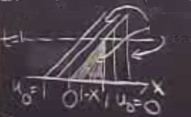
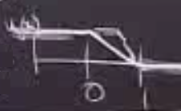
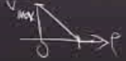
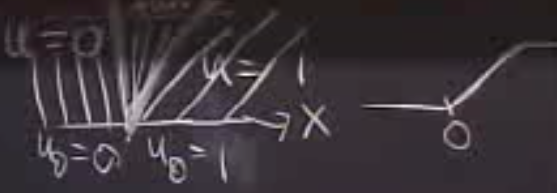

# Ders 2.8

[Lineer problemler atlandı]

Şimdi gayrı lineer problemlere gelelim. Alttaki model denkleme bakalım,

$$
u_t + u u_x = 0
\qquad (1)
$$

Bu denklem ile daha önce gördüğümüz alttaki denklem arasındaki fark bariz,

$$
u_t = c u_x
$$

Üstteki yatay iletim (advection) denkleminde sabit bir hız var, $c$. Ama iki
üstteki durumda hız $-u$, ya da $c$'nin yerine $-u$ koymuş oluyoruz.  O gayrı
lineer denklemi analiz etmek istiyoruz, daha önce olduğu gibi analitik olarak
çözmek isteriz, eğer mümkünse bir formüle erişmek isteriz.. Karakteristik
çizgiler bağlamında neler olduğuna bakmak isteriz.. Sonuçta tek bir uzay
değişkeni ve tek bir denklem var, buradan karakteristiklere bakarak işin
özünü görmek mümkün olmalı.

Ana denkleme eşdeğer olan bir form görelim,

$$
\frac{\partial u}{\partial t} +
\frac{\partial }{\partial x}
\underbrace{ \left( \frac{u^2}{2} \right)}_{f(u)} = 0
\qquad (2)
$$

Hatta üstteki forma daha "doğru'' form ismi verilebilir, eğer onu açsak (1)'e
erişirdik fakat üstteki denklemdeki parantez içindeki kısmın fiziksel bir anlamı
var, o kısma akış (flux) ismi veriliyor.

Fakat göreceğiz ki bu diferansiyel denklem aynı noktada iki tane çözüm ortaya
çıkartabiliyor, ve onlardan birini seçmemiz gerekiyor. Diğer bir deyişle çözüm
süreksiz (discontinuous) hale gelebiliyor. Mükemmel pürüzsüz bir başlangıç
fonksiyonu bir süre sonra süreksiz oluyor. Sürekli başlıyoruz, çözüm
karakteristik çizgiler üzerinde sabit, fakat iki karakteristik çizgi birbiriyle
çakıştığında ne olur? Daha önce çakışma olmadı çünkü ana denklem o türde
değildi. Burada mümkün!

O durumu alta çizdim,

Bakıyoruz sol taraftaki o kısımda başlangıç değerleri 1, onlar sabit $c$
durumunda olduğu gibi problemsiz sağ yukarı doğru gidiyorlar. Ama sağ kısma
bakarsak, $u_0=0$ durumu için, bu karakteristik çizgilerle bağlantılı hız
sıfır, orada dalga hareket etmiyor yani, karakteristik orada direk yukarı
çıkıyor, çünkü hiçbir şey olmuyor, $u$ değeri olduğu haliyle yukarı taşınıyor,
sağa, sola gidiş yok. Ama o orta kısımda bir şeyler oluyor, karalanmış
kısımdan bahsediyorum. Burada neler olduğunu iyi anlamamız gerekiyor.

Cebire girmeden belki grafikleyerek bir şeyler anlayabilirim, orta bölgedeki
karakteristik çizgilerin eğimi sıfır ile bir arasında, yani, şimdi $u_0(x)$'i
$t=0$ için grafiklersem,

Sol kısımda sabit 1'de gidiyorum, sağ kısımda sabit 0'da gidiyorum. Arada
lineer bir düşüş var. Üstteki grafikte değer 1, $1-x$, 0 değerlerinde..
Bu değerler iki üstteki grafikte yatay eksenın bölümlerine tekabül ediyor.
İki üstte $x,t$ uzayındayız dikkat, bir üstte ise $x,u$ uzayında.

Yani $t=1$ noktasına kadar karakteristikler tüm hikayeyi anlatıyorlar.  $u$'nun
nerede sıfır olduğunu, nerede 1 olduğunu biliyorum. $t=1$ noktasına kadar
diferansiyel denklem için durum iyi. Mesela $t=1/2$'de durum nedir? 

Bu durumda dalga biraz daha ilerlemiş durumdadır, iniş daha dik hale gelmiştir.
$t=1$'de tabii ki grafik tam dik hale gelmiş olacaktır.

Fakat $t=1$ sonrası için düşünürsek şimdi, aynı noktadan birden fazla
karakteristik geçiyor olacak. Orada 0'dan mı yoksa 1'den gelen değerleri mi baz
almak lazım? O çakışma bölgesinde neler oluyor? İşler karıştı çünkü benim
karakteristik takip etme kuralım bana iki tane sonuç verdi. Bize bir cevap
lazım, daha önemlisi, fiziksel olarak anlamlı bir cevap lazım.

Ortada bir şok dalgası, sok çizgisi var, fakat onun hakkında karakteristiklerden
iyi bilgi gelmiyor. Merak ettiğimiz şok cizgisi neye benzer, gidiş yolu nedir,
eğimi nedir? Onu ne kontrol eder? Ne yazık ki diferansiyel denklem bize burada
dert oluyor. Olanları anlamak için denklemin entegral formuna gitmek daha doğru
olabilir.

$$
\frac{\mathrm{d}}{\mathrm{d} t} \int_{x_L}^{x_R}
u \mathrm{d} x + \left[ f(u_{right}) - f(u_{left})  \right] = 0
\qquad (3)
$$

Tabii entegral alınca her şeyi daha pürüzsüz hale getirmiş oluyorum, ama aynı
anda muhafaza fiziksel kanununa sadık kalmış oluyorum. Formülün nereden
geldiğini görmek zor değil, (2)'nin $x$ üzerinden entegral alınmış hali aslında,
sol terimdeki zamansal türev hala orada, ama ikinci terimdeki yer türevi
yok olacak, ve entegral sınırları olarak bir noktadan diğerine diyelim şimdilik,
bunlar $x_{left}$, ve $x_{right}$, akış fonksiyonu için $u_{left}$ ve $u_{right}$.

Bu entegral muhafaza kanunu ne diyor? Entegral derken (2)'deki entegral terimden
bahsediyorum, o entegralin muhafazasından bahsediyoruz, diyor ki o entegralde
değişim var ise, o değişim sağdan dışarı çıkan ya da soldan içeri giren akışla
mümkün olabilir / onların toplamıdır. Tüm bunlar sıfıra eşit olduğu için
bir muhafaza beyanı oluyor bunlar. 

(1) formülüne bu arada Burgers'in denklemi (Burgers' equation) ismi veriliyor.
Fakat aslında tüm ismi ağdasız (inviscid) Burgers'in denklemi, çünkü denklem
sıfıra eşit. Bu formül ve tarihi hakkında birkaç kelime edelim, Cole adli
bilimci eşitliğin sağında bir $u_{xx}$ kullanmıştı ilk önce, taşınım $u u+x$
üzerinden, hala gayrı lineerdi. Bunlar Navier-Stokes denkleminde gördüğümüz
türden şeyler değil mi?  NS'te de daha genel durumda tabii, ama orada da bir
gayrı lineerlik var. Burger'in formülünde bu daha basitleştirilmiş bir durumda
tabii.

Neyse, bu basit formda gayrı lineer olsa da Cole (1)'i çözmeyi başardı. Bir
değişken değişim tekniği kullandı, aynı zamanda Hopf ta bu yaklaşımı
keşfetmişti. Bu değişken değişimi ile formül lineer hale geldi, ve çözüm böylece
yapıldı. Ardından bilimciler yayınım katsayısının sıfıra gitmesine izin
verdiler, böylece limite giderken ağdasız Burgers'ın denklemi elde
edildi. Böylece çözüme bakılıp onun limit sıfıra giderken nereye gittiği
incelenebiliyordu, vs.

Doğru çözümü bulmanın bir diğer yolu buydu işte, ağdalık yöntemi denen şey
budur. Sok dalgaları birbirine girdiğinde, neyi seçeceğimizi bilmediğimiz
durumlardan kullanılan çok önemli temel bir metottur. Yani çok boyutta bile,
gayrı lineer ortamda kullanılabilecek iyi bir yöntem bu, azıcık ağdalık
köy formüle sonra limitte sıfıra gitmesine izin ver.

Çünkü

$$
u_t = c u_x + d u_{xx}
$$

formunda düşünürsek, ikinci türev olduğu için $d u_{xx}$ terimi, $c u_x$
teriminden daha baskın hale geliyor, çünkü ikinci türevli terim çözümü daha
pürüzleştirir, ama $c u_x$ bildiğimiz gibi pürüzsüzlük getirmez, sadece taşınım
yapar, çözümü bir yerden diğerine taşır. Neyse baskın tarafı sıfıra
yaklaştırınca çözümü bulabilmiş oluyoruz. Bu bir yöntem. Aslında sayisal hesapta
sonlu farklılıklarla bu tekniği bir anlamda kullanıyoruz, uzay değişkeni için
bir ikinci farklılık ekleyip $\Delta t$'yi ufaltınca çözüme ulaşılabiliyor.

Herkesin sevdiği bir diğer örnek problem Trafik Akış problemi. Tek boyutta yine,
bu formülle trafik akışı modellenebiliyor. Modellenen ne olacak? Yoğunluk
olabilir, herhangi bir noktadaki yoğunluğu temsil edeceğiz, değişken $u$ yerine
$\rho$ kullanalım, çoğunlukla yoğunluk için bu kullanılır.

Tüm trafiğin akışı hızı $v$ olsun, yoğunluk ile hız arasında bir ilişki olmalı
muhakkak, $v(\rho)$ bize hızı versin o zaman. Aradaki ilişki ters yönde olacak
herhalde, yoğunluk artınca hız azalır, azalınca artar. 

Trafik akış probleminde akış fonksiyonu nedir (ikisinde de 'akış' kelimesi var,
ilginç oldu). Muhafaza kanunu arabaların muhafazası olacak, yolun bir parçasına
bakarsak, muhafaza kanunu diyecek ki oradaki araba sayısının değişimi, ki
(3)'teki ilk terim, o kısımdan çıkan ve oraya giren arabaların toplamına
eşittir. O zaman akış fonksiyonu $f(\rho) = v(\rho) \rho$ olacak, hız çarpı
yoğunluk bana arabaların nasıl aktığını söyler.

Bu problemde daha önce gördüğümüz karakteristik çakışma problemini aynen
göreceğiz. Bu problemde de şoklar (shock) olacak, ve yayılma dalgaları da (fan)
olacak. Şoklar karakteristikler, arabalar biraraya geldiğinde, yayılma dalgaları
karakteristikler yayıldığında olur.

Aslında yayılmayı hemen gösterebilirim, iki tane başlangıç değeri olabilir
mesela, $u_0 = 0$ ve $u_0 = 1$. Bu tür problemlere Riemann problemi deniyor
bu arada, ve muhafaza kanunu teorisinin en temiz çözüm yöntemi denebilir,
elde iki başlangıç 0 ve 1 olduğu durum. 1 ve 0 da olabilir, ama dikkat
o zaman durum farklı.

Orta kısımda bir yayılma dalgası ortaya çıkıyor, ve profil 0'dan 1'e ortada
pürüzsüz bir şekilde çıkıyor. 

Bir sonraki derste eğer varsa şok cizgisini bulacağım, ve şok mu yayılma mı
olduğunu ayırtetmeyi göstereceğim. Şok hızı $s$'yi bulmayı öğreneceğiz, ve şok
ile yayılma arasındaki seçim entropi hesabı üzerinden olacak.

