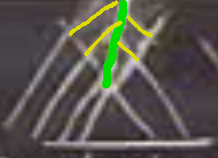

# Ders 2.9

Formüllerimizin tekrar üzerinden geçelim,

$$
\frac{\partial u}{\partial t} +
\frac{\partial }{\partial x} f(u) = 0
\qquad (1)
$$

$$
\frac{\mathrm{d}}{\mathrm{d} t} \int_{x_L}^{x_R} u \mathrm{d} x + f(u_R) - f(u_L) = 0
\qquad (2)
$$

$$
u(x,t) = u(x - f'(u) t, 0)
\qquad (3)
$$

İki formül tek sayısal, tek boyutta muhafaza kanununu gösteriyor. Yer tek
boyutlu, sadece $x$ var. Akış fonksiyonu $f(u)$. (1)'de diferansiyel form var ve
gördük ki bu form bir süreksiz (discontinuous) çözüm, süreksizlik ortaya
çıkarıyor. Bu sebeple denklemin entegre edilmiş formu (2) ile iş yapmaya karar
verdik. Mesela $u$'da yoğunluk olsaydı entegrasyon bize iki nokta arasındaki
kütleyi verirdi (çünkü kütle, yoğunluğun bir hacim üzerinden toplanmış halidir),
o zaman (2)'deki entegralin türevi kütlenin zamana göre değişimi olurdu, ve
diğer iki terimi de göz önüne alırsak, bu değişim sadece dışarı çıkan, eksi
giren akışa eşit olurdu. Muhafaza kanunu budur.

Diferansiyel denklemin çözümü (3) ile karakteristik çizgiler ortaya çıktı,
onları başlangıç zamanı $t=0$'dan takip edebiliyorduk. Başlangıçtaki değerler
çizgi boyunca taşınıyordu, problem karakteristikler çakıştığında ya da aynı
başlangıçtan farklı yönlere yayıldığında / dağıldığında (fan out) ortaya
çıkıyordu. Bu iki farklı durumu altta görüyoruz.

İki farklı problem üsttekiler ve ikisinin de farklı tedavisi var. Soldaki trafik
örneğinde kırmızı ışık yandığındaki durum, ışığa gelen arabalar orada tıkanıyor,
ışığın öteki tarafında yoğunluk az, ama gerisinde durum farklı, ve arabalar
hızlı bir şekilde durmalılar. O soru işareti olan yeri düşünelim, aynı noktaya
farklı yönlerden gelen iki değer nereye gider? Bu durumu halledecek bir kural
lazım. Aynı şekilde üst sağdaki durum için bir kural lazım. Orada soru işareti
boşlukta, ama orası bir değeri temsil ediyor, oraya nasıl gelinir, hiç bir
karakteristik oraya gitmiyorsa?

Birinci duruma bakalım önce, o çakışan bölümü silelim, orada olan şudur, bir şok
oluşur (yeşil çizgi), ve o bölgedeki karakteristikler o çizgiye "akar'',
enformasyonu ona aktarırlar. Bu önemli bir şey..

Peki şokun kendisinin özellikleri nedir? Ne hızda ilerler? Şok hızı nedir?  Bu
şoku $x,t$ düzleminde tanımlamak için (2)'deki entegral formu kullanmam lazım.
Entegral formu kullandım çünkü ortada bir süreksizlik var, o durumlarda
diferansiyel formlar anlamsız hale geliyor.

Aradığım şey şok anındaki zıplama koşulu (jump condition), ki bu koşul şokun
yerini bulmama yardım edecek. Bulmam gereken anahtar büyüklük şok hızı, $s(t)$
diyelim, onun sayesinde şokun nereye gittiğini hesaplayabilirim, zamana göre
nasıl yukarı gittiğini anlayabilirim.

Zıplama koşulunu şöyle gösteriyorum,

$$
s [u] = [f(u)]
$$

Bu ne demek? Köşeli parantez notasyonu kullandım, köşeli parantez zıplama demek,
onun da formülsel olarak nereden geldiğini sonra anlatacağım. Üstteki denklem
diyor ki, şok hızı $s$ çarpı $u$'daki zıplama, $f(u)$ içindeki zıplamaya
eşittir.  Burgers'ın denklemini düşünürsek akış $f(u) = u^2/2$ idi, iyi huylu
parabol bir şekil, neyse, o zaman

$$
s = [f(u)]/[u] = (u_R^2 - u_L^2) / 2 (u_R-u_L) = (u_R + u_L) / 2
$$

Üsttekileri açıklamak gerekirse, zıplama dediğimiz sağ değer eksi sol değer
demek, bu sebeple, mesela $f(u)$'daki zıplama, yani $[f(u)]$ deyince, ve
$f(u) = u^2/2$ olduğu için $u_R^2/2$ eksi $u_L^2/2$ diyoruz, biraraya koyunca
$(u_R^2 - u_L^2) / 2$ oluyor. $u$ zıplaması $[u]$ aynı şekilde $u_R - u_L$. 

Elde ettiğim $(u_R + u_L) / 2$ sonucu bana diyor ki şok hızı $u_R,u_L$'in
ortalaması, Burgers'ın denkleminde bu sağdan gelen karakteristik hızı
ile soldan gelen karakteristik hızının ortalaması demek.

Bu üstteki grafik, kabaca çizilmiş olsa da, doğru demek, yeşil çizgi tam yukarı
çıkıyor düşünsek bu her iki yandan karakteristiklerin ortasının gittiği yer
olurdu. Her iki tarafın ortası, bu çok önemli, bu demektir ki her yandan
karakteristikler şok çizgisine giriyorlar. Bu gayrı lineer ortamda şok cizgi
bir anlamda iki yandan enerjiyi emip azalıyor, entropiyi azaltıyor, birazdan
göreceğimiz üzere toplam varyasyonu azaltıyor. 

Peki zıplama notasyonunun formülsel temeli nedir? Temeli (2)'deki entegral
formdur. Diyelim ki, (2)'ye bakarak söylüyorum, şokun biraz soluyla biraz
sağı arasındaki bölgede entegral alıyorum. Bu normal, şokun içeriğini
yakalamak / kaydetmek için o şekilde entegral sınırı tanımlamam normal.

