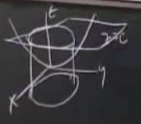
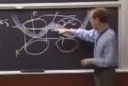
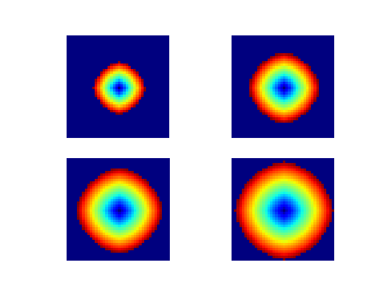
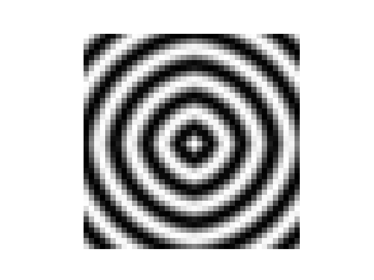
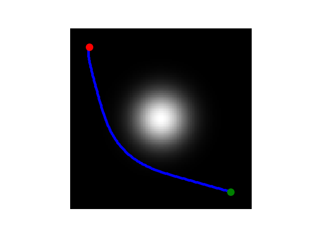

# Ders 2.11

Konumuz kesit seviyeleri (level sets). Bu alanda Sethian ve Osher otorite
sayılıyor, 80'li yıllarda yayınladıkları makale ve kitaplarda konuyu etraflıca
işlediler.

Elimizde bir eğri var diyelim (altta resimde $t=0$ anındaki)


ve bu "arayüz (interface)'' ya da duvar, bu eğri hareket ediyor. İlerliyor. Bu
ilerlemenin kendi normali (yani eğrinin her noktasındaki teğetine dik) yönünde
olduğunu düşünelim. Bu ilerleme şeklini biz empoze ediyoruz, sonra formüllerin
buna göre nasıl şekillendiğini göreceğiz. Bu ilerleme sonunda mesela $t=0$'da
görülen şekilden $t=1$'deki şekle gelinmiş olacak. En ideal şartlarda hızın
hiçbir noktada değişmediğini düşünebiliriz, yani hız sabit. O zaman birim
zamanda sabit hızda (diyelim o da 1), mesafe 1 katedilmiş olur.

Eğrinin nasıl tarif edildiği anahtar. Eğriyi, o eğri üzerindeki belli yerlerde
noktalar üzerinden mi temsil etsem? Ki o her nokta bir bilinmeyen / değişkenle
genel formüle dahil edilse? O noktaların her birinde ayrı bir normal
diferansiyel denklem (ordinary differential eqution) olabilirdi, o denklemi
takip ederek bir sonraki noktaya gidebilirdim, vs. 

Fakat kesit seviyeleri böyle işlemiyor. Hatta ilk akla gelen (gayet
doğal)parçacıklı üstteki fikir sayısal hesaplarda çabucak bazı engellere
tosluyor. Mesela üstteki resimdeki örnek idealdi dedik, parçacıklar $t=1$'da
biraz yayılırlar, çok değil, ama çok yayılıyor da olabilirlerdi. Ya da ters
yönde eğime göre noktalar aynı noktada toplanabilirdi, bu sayısal hesabı iyice
bozardı çünkü noktalar üst üste binerdi, aradaki farkları doğru dürüst
hesaplayamazdık.

Peki o zaman kesit seviyeleri bu problemleri nasıl çözüyor? Ondan önce kesit
seviyesi nedir? Kesit seviyesi bir ana fonksiyona göre tarif edilir, mesela
$\Phi(x,y)$'nin kesit seviyesi. Bu seviye $\Phi(x,y) = 0$ olabilir, yani
$\Phi(x,y)$'nin sıfırdaki kesit seviyesine bakabiliriz.

Kesitleri üç boyutlu yüzey üzerinde yapılan yatay kesitler olarak
düşünebiliriz. Üç boyutlu fonksiyonun o yatay düzlem üzerindeki hali, yansıması
bu kesittir. Birden fazla kesiti farklı kontur renkleri ile gösterebilirdik.
Mesela yeryüzeyi $x,y$ kordinatlarındaki yükseklik (dağlar) verisini konturlar
olarak göstermek klasik bir topografi tekniğidir. Yapay bir veri üzerinde
görelim, $x,y$ ve yükseklik deyince üç boyutlu bir fonksiyondan bahsediyoruz,
onun ayrıksal halini mesela 10x10 boyutunda bir matris ile
gösterebiliriz. Formül

$$\Phi(x,y) = \exp \left( -2 \log(2) ((x-x_0)^2 + (y-y_0)^2) / s^2 \right) $$

```python
from mpl_toolkits.mplot3d import Axes3D
from matplotlib import cm

def Phi(x, y):
    s = 1.5; x1 = 5.0; y1 = 5.0
    g = np.exp( -2 *np.log(2) * ((x-x1)**2+(y-y1)**2) / s**2)
    return g
  
D = 10
x = np.linspace(0,10,D)
y = np.linspace(0,10,D)
xx,yy = np.meshgrid(x,y)
zz = Phi(xx,yy)

fig, ax = plt.subplots(1, 1, subplot_kw={'projection': '3d'})
surf = ax.plot_surface(xx, yy, zz, cmap=cm.coolwarm,
                       linewidth=0, antialiased=False)
plt.savefig('2_11_02.png')

plt.figure()
contours = [0.1, 0.2, 0.3]
cs=plt.contour(xx,yy,zz,contours)
plt.clabel(cs,inline=1,fontsize=9)
plt.savefig('2_11_03.png')
```


Tam ortasına bir tepe koyduk, bir analitik fonksiyon kulladik ama bunu rahatlık
amacıyla yaptık, elle bazı değerleri matriste gerekli yerlere direk koysak aynı
sonucu elde ederdik. Üstteki matrisin değerlerini basarsak mesela şuna benzer,

```python
np.set_printoptions(precision=3,suppress=True)
print (zz)
```

```text
[[0.    0.    0.    0.    0.    0.    0.    0.    0.    0.   ]
 [0.    0.    0.    0.    0.    0.    0.    0.    0.    0.   ]
 [0.    0.    0.    0.002 0.007 0.007 0.002 0.    0.    0.   ]
 [0.    0.    0.002 0.033 0.149 0.149 0.033 0.002 0.    0.   ]
 [0.    0.    0.007 0.149 0.684 0.684 0.149 0.007 0.    0.   ]
 [0.    0.    0.007 0.149 0.684 0.684 0.149 0.007 0.    0.   ]
 [0.    0.    0.002 0.033 0.149 0.149 0.033 0.002 0.    0.   ]
 [0.    0.    0.    0.002 0.007 0.007 0.002 0.    0.    0.   ]
 [0.    0.    0.    0.    0.    0.    0.    0.    0.    0.   ]
 [0.    0.    0.    0.    0.    0.    0.    0.    0.    0.   ]]
```

Kontur grafiğinde üç tane konturu gösterdik, `contours` değişkeni
listesinde tanımlı.

Derse dönelim. Yani kesit seviyeleri bir eğriyi dolaylı (implicitely) tanımlamış
oluyor. İki boyutlu bir eğriyi bir sürü nokta üzerinden tanımlamak yerine, üç
boyutlu bir yüzeyin bir kesit üzerindeki yansıması üzerinden tanımlıyoruz, yani
$\Phi(x,y) = 0$ gibi. Yani bir eğri, $\Phi(x,y) = 0$ denklemini *çözen*
$x,y$ değerleri oluyor.

Basit bir örnek üzerinde görürsek, mesela $\Phi(x,y) = x^2 + y^2$. Bu
fonksiyonun kesit seviyelerini nasıl alırım? $\Phi$'yi bir sabite eşitleyerek bu
seviyeleri elde edebilirim, $\Phi(x,y) = x^2 + y^2 = c$. $c$ pozitif olduğunda
elde edilen sonuçlar çember olacaktır tabii, bu formül klasik, ünlü bir formül.

Üç boyutta $z=\Phi(x,y)$ $x,y,z$ kordinatında bir yüzeydir, bir kap şekli, onu
$z=c$ düzlemi ile kesersek o düzleme yansıyan eğri kesit seviyesi, bir
çember. Onu $x,y$ düzlemine indirirsek orada da bir çember görürüz. 



Kesit seviyelerin önemli bir avantajı üç boyuttaki tek fonksiyonu manipüle
etmeye izin vermesi, bu rahat, tek $\Phi$ ile mesela iki tane ayrı çember elde
edebilirdim.



Eğriyi ilerletmek için gradyan yönünü seçiyoruz. Bu yön eğrinin birim normali,

$$
\vec{n} = \frac{\mathrm{grad} \Phi}{|\mathrm{grad} \Phi|}
$$

Gradyanın 1 olduğu özel durum için, yani $|\mathrm{grad} \Phi| = 1$, üstteki formül
basitleşir.

Eğrinin hareketini tanımlayan bir diğer faktör eğriye etki eden hız alanı, yani
$v$. Bu alan her $x,y$ noktasında tanımlı $v(x,y)$ olarak gösterilebilir. Hepsi
bir arada olursa,

$$
\frac{\partial \Phi}{\partial t} + v \cdot \mathrm{grad} \Phi = 0 
\qquad (1)
$$

Üstteki formülasyonun detaylı türetilmesi için bkz [3].

$v$ bir alandır, her $x,y$ için farklı olabilir. $\Phi$'nin bir fonksiyonu da
olabilir. Yani hız eğrinin ne durumda olduğuyla bağlantılı olabilir, Çoğunlukla
$v$ mesela eğrinin kavisliliğine (curvature) bağlantılandırılır.

(1)'i şu şekilde tekrar yazarsak,

$$
\frac{\partial \Phi}{\partial t} + v \cdot
\frac{\mathrm{grad} \Phi}{|\mathrm{grad} \Phi|} |\mathrm{grad} \Phi| = 0 
$$

$\mathrm{grad} \Phi/|\mathrm{grad} \Phi|$ ifadesi egrinin normali $\vec{n}$, o zaman 

$$
\frac{\partial \Phi}{\partial t} + v \cdot n |\mathrm{grad} \Phi| = 0 
$$

elde ediyoruz, $v \cdot n$'e yeni bir isim verebilirim, ona hız diyelim. Normal
yöndeki hız, $F$, ve $\mathrm{grad}$ yerine $\nabla$ kullanırsak,

$$
\frac{\partial \Phi}{\partial t} + F |\nabla \Phi| = 0 
$$

Bu hız normal yöndedir. Ünlü kesit seviyesi formülü budur. Eğer $F$ sabit ise
biraz önce bahsettiğimiz yangının yayılma durumu ortaya çıkar. Ateş bildiğimiz
gibi yakabildiği her yere gitmek ister, sürekli ileri doğru ilerler. $F$'nin
illa sabit olması gerekmez, $\nabla \Phi$'nin bir fonksiyonu bile olabilir, o
zaman onu $F(\nabla \Phi)$ yapardım. Mesela

$$
\kappa = \mathrm{div} \left( \frac{\mathrm{grad} \Phi}{|\mathrm{grad} \Phi|} \right)
$$

Bu bir $F(\nabla \Phi)$ örneği, $\nabla \Phi$'nin bir fonksiyonu. Lineer değil
doğal olarak, gayrı lineer işlemler var.

Üstteki formül eğrinin kavisliliğiyle bir alaka kuruyor. Kavislilik üzerinden
eğri hareketi ilginç bir şey; mesela bir elipsi düşünelim, ve hareket içeri
doğru olsun.


Elipsin üst, kavisin daha az olduğu yerlerde içeri hareket (hızı) daha az, çok
olduğu yerlerde daha fazla ise, o zaman değişim ardından bir çembere
ulaşılacaktır. Hatta aslında hangi ilk şekilden başlarsak başlayalım, gidişat
aynı şekilde mükemmel bir çembere doğru olacaktır.

Şimdiye kadar gördüklerimiz kesit seviyeleri. Bu denklemlerin bir de hesapsal
olarak sonlu farklar (finite difference) yöntemiyle çözüm formülleri var. Bu
formüller oldukca çetrefil. 

Şimdi hızlı marş (fast marching) kouşuna gelelim. Hızlı marş eğri ilerletmenin
çok hızlı bir çözümü olduğu durumlar için. Çünkü bu özel durumda "dalga'' on
kısmı hep aynı şekilde ilerliyor. F'nin işareti hiç değişmiyor, yani hareket hep
aynı genel yönde. Bu durumda kesit seviyeleri formülü, sonlu farklar hesabı
yerine hızlı marş yöntemi kullanılabiliyor, çünkü çok farklı hareket şekli yok,
eğri gelip kendi üstüne dönemiyor, vs.

Hızlı mars yöntemi aslında geliş zamanı bazlı başka bir formülasyonu
çözüyor.

$$
|\nabla T| F = 1
$$

Eğer $T(x,y)$ fonksiyonunu yayılan dalga önünün $x,y$ noktasına geliş zamanını
temsil ettiğini düşünürsek, tek boyutta katedilen mesafe $x = F T$, bu basit bir
mesafe eşittir hız çarpı zaman sonucu. Mesafeye göre türev alırsak,

$$
1 = F \frac{\mathrm{d} T}{\mathrm{d} x}
$$

Çok boyuttaki $\nabla T$ kullanılabilir, çünkü gradyan $T$'nin kesit
seviyelerine dikgendir. O zaman

$$ \frac{1}{F} = |\nabla T| $$

denebilir. ya da 

$$ |\nabla T| T = 1$$

Hızlı marşı nasıl kodlarım? Eğri ilerleme hesabını eğriden ileri gidişin
mesafesi hesabına çevirebilirim. Eğriyi için alacak şekilde bir izgara
yaratabilirim,


Bu ızgarayı baz alarak eğriye olan bir uzaklığın fonksiyonu $d(x,y)$'i bulmak
istiyorum. Eğri içini hesaba katalım, orada eğriden geriye bir uzaklık olacak,
orada eksi, dışarıda artı.

Uzaklığı her izgara köşesi için hesaplamak istersem, ne yaparım?

Altta kısayol bulmak için hızlı marş yöntemini görüyoruz, kod [1,2]'yi baz aldı. 

```python
import pandas as pd
import numpy as np
import matplotlib.pyplot as plt
from scipy import ndimage
import util

def perform_fm(W, pstart, niter=np.inf, bound='sym', svg_rate=10):
    n = W.shape[0]
    neigh = np.array([[1, -1, 0, 0], [0, 0,  1, -1]])

    def symmetrize(x,n):
        if (x<0):
            x = -x;
        elif (x>=n):
            x = 2*(n-1)-x
        return x

    if bound=='per':
        boundary = lambda x: np.mod(x,n)
    else:
        boundary = lambda x: [symmetrize(x[0],n), symmetrize(x[1],n)] # todo

    ind2sub1 = lambda k: [int( (k-np.fmod(k,n))/n ), np.fmod(k,n)]
    sub2ind1 = lambda u: int( u[0]*n + u[1] )
    Neigh = lambda k,i: sub2ind1(boundary(ind2sub1(k) + neigh[:,i]))
    extract   = lambda x,I: x[I]
    extract1d = lambda x,I: extract(x.flatten(),I)

    nstart = pstart.shape[1]
    I = list( np.zeros( (nstart, 1) ) )
    for i in np.arange(0, nstart):
        I[i] = int( sub2ind1(pstart[:,i]) )

    D = np.zeros( (n,n) ) + np.inf # current distance
    for i in np.arange(0, nstart):
        D[pstart[0,i],pstart[1,i]] = 0

    S = np.zeros( (n,n) )
    for i in np.arange(0, nstart):
        S[pstart[0,i],pstart[1,i]] = 1 # open

    iter = 0
    q = 100  # maximum number of saves
    Dsvg = np.zeros( (n,n,q) )
    Ssvg = np.zeros( (n,n,q) )
    while ( not(I==[]) & (iter<=niter) ):
        iter = iter+1;
        if iter==niter:
            break
        j = np.argsort( extract1d(D,I)  )
        if np.ndim(j)==0:
            j = [j]
        j = j[0]
        i = I[j]
        a = I.pop(j)
        u = ind2sub1(i);
        S[u[0],u[1]] = -1
        J = []
        for k in np.arange(0,4):
            j = Neigh(i,k)
            if extract1d(S,j)!=-1:
                J.append(j)
                if extract1d(S,j)==0:
                    u = ind2sub1(j)
                    S[u[0],u[1]] = 1
                    I.append(j)
        DNeigh = lambda D,k: extract1d(D,Neigh(j,k))
        for j in J:
            dx = min(DNeigh(D,0), DNeigh(D,1))
            dy = min(DNeigh(D,2), DNeigh(D,3))
            u = ind2sub1(j)
            w = extract1d(W,j);
            Delta = 2*w - (dx-dy)**2
            if (Delta>=0):
                D[u[0],u[1]] = (dx + dy + np.sqrt(Delta))/ 2
            else:
                D[u[0],u[1]] = min(dx + w, dy + w)
        t = iter/svg_rate
        if (np.mod(iter,svg_rate)==0) & (t<q):
            print (t)
            Dsvg[:,:,int(t-1)] = D
            Ssvg[:,:,int(t-1)] = S

    Dsvg = Dsvg[:,:,:int(t-1)]
    Ssvg = Ssvg[:,:,:int(t-1)]
    return (D,Dsvg,Ssvg);
```

```python
def exo2(x0,W):
    n = W.shape[0]
    pstart = np.transpose(np.array([x0]))
    [D,Dsvg,Ssvg] = perform_fm(W, pstart, np.inf, 'sym',n*6)
    plt.figure();
    for i in np.arange(0,4):
        plt.subplot(2, 2, i+1)
        d = Dsvg[:,:,i]
        d[d==np.inf] = 0
        util.imageplot(d)
        plt.set_cmap('jet')        
    plt.savefig('out-450.png')
    return D
  
n = 40
W = np.ones( (n,n) )
x0 = [int(n/2), int(n/2)]

D = exo2(x0,W)

plt.figure()
displ = lambda D: np.cos(2*np.pi*5*D/np.max(D.flatten()) )
util.imageplot(displ(D))
plt.savefig('out-480.png')
```

```text
1.0
2.0
3.0
4.0
5.0
6.0
```






```python
def exo3(x0,W):
    n = W.shape[0]
    pstart = np.transpose(np.array([x0]))
    [D,Dsvg,Ssvg] = perform_fm(W, pstart, np.inf, 'sym',n*6)
    # display
    k = 8
    displ = lambda D: np.cos(2*np.pi*k*D / np.max(D.flatten()))
    plt.figure()
    util.imageplot(displ(D))
    plt.set_cmap('jet')
    plt.savefig('out-560.png')
    return D


n = 100
x = np.linspace(-1, 1, n)
[Y, X] = np.meshgrid(x, x)
sigma = .2
W = 1 + 8 * np.exp(-(X**2 + Y**2)/ (2*sigma**2))
util.imageplot(W)
plt.savefig('out-520.png')

x0 = [round(.1*n), round(.1*n)]
res = exo3(x0,W)
```

```text
1.0
2.0
3.0
4.0
5.0
6.0
7.0
8.0
9.0
10.0
11.0
12.0
13.0
14.0
15.0
16.0
```


```python
def exo4(tau,x0,x1,G):
    n = G.shape[0]
    Geval = lambda G,x: util.bilinear_interpolate(G[:,:,0], np.imag(x), np.real(x) ) + 1j * util.bilinear_interpolate(G[:,:,1],np.imag(x), np.real(x))
    niter = 1.5*n/tau;
    # init gamma
    gamma = [x1]
    xtgt = x0[0] + 1j*x0[1]
    for i in np.arange(0,niter):
        g = Geval(G, gamma[-1] )
        gamma.append( gamma[-1] - tau*g )
        if abs(gamma[-1]-xtgt)<1:
            break
    gamma.append( xtgt )
    return gamma
  
n = 100
x = np.linspace(-1, 1, n)
[Y, X] = np.meshgrid(x, x)
sigma = .2
W = 1 + 8 * np.exp(-(X**2 + Y**2)/ (2*sigma**2))
x0 = [round(.1*n), round(.1*n)]
D = exo3(x0,W)

G0 = util.grad(D)
d = np.sqrt(np.sum(G0**2, axis=2))
U = np.zeros((n,n,2))
U[:,:,0] = d
U[:,:,1] = d
G = G0 / U
tau = .8
x1 = round(.9*n) + 1j*round(.88*n)
gamma = [x1]

Geval = lambda G,x: util.bilinear_interpolate(G[:,:,0], np.imag(x), np.real(x) ) + 1j * util.bilinear_interpolate(G[:,:,1],np.imag(x), np.real(x))
g = Geval(G, gamma[-1] )
gamma.append( gamma[-1] - tau*g )
gamma = exo4(tau,x0,x1,G)

util.imageplot(W) 
plt.set_cmap('gray')
h = plt.plot(np.imag(gamma), np.real(gamma), '.b', linewidth=2)
h = plt.plot(x0[1], x0[0], '.r', markersize=20)
h = plt.plot(np.imag(x1), np.real(x1), '.g', markersize=20)
plt.savefig('out-760.png')
```

```text
1.0
2.0
3.0
4.0
5.0
6.0
7.0
8.0
9.0
10.0
11.0
12.0
13.0
14.0
15.0
16.0
```



Kaynaklar

[1] Peyre, *Dijkstra and Fast Marching Algorithms*,
[https://nbviewer.jupyter.org/github/gpeyre/numerical-tours/blob/master/python/fastmarching_0_implementing.ipynb](https://nbviewer.jupyter.org/github/gpeyre/numerical-tours/blob/master/python/fastmarching_0_implementing.ipynb)

[2] Peyre, [https://github/gpeyre/numerical-tours](https://github/gpeyre/numerical-tours)

[3] Bayramlı, Kısmi Türevsel Denklemler, *Kesit Seviyeleri*


