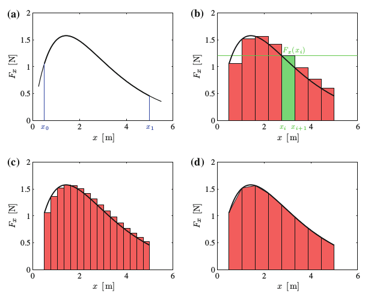
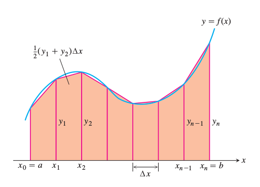

# Sayısal Entegrasyon (Numerical Integration) ve Sonlu Farklılıklar ile Sayısal Türev (Differentiation with Finite Differences)

Sayısal Türev

Sonlu farklılıklar (finite differences) ile yaklaşık türev almak için,
herhangi bir $x$ noktasında

$$
f'(x) = \frac{f(x + \epsilon) - f(x)}{\epsilon}
$$

hesabını yapabiliriz. Tek boyutta tek sayı $\epsilon$ ile adım atılıp $f$
üzerindeki değişiklik üzerinden hesap yapılır, çok boyutlu durumda birer
birer her kordinatta $\epsilon$ kadar adım atılır, ve bu adım üzerinden $f$
türevi alınıp o kordinat için kısmı türev olarak kaydedilir, $x =
\left[\begin{array}{ccc} x_0 & ... & x_n \end{array}\right]$ için

$$
f'(x) = \left[\begin{array}{c}
\frac{ f \left( [\begin{array}{ccc} x_0 + \epsilon & ... & x_n \end{array}]\right) - f(x)}{\epsilon} \\
\vdots \\
\frac{ f \left( [\begin{array}{ccc} x_0  & ... & x_n+\epsilon \end{array}]\right) - f(x)}{\epsilon} 
\end{array}\right]
$$

Alttaki kod [3]'teki `approx_fprime` metotunu
baz almıştır, 

```python
eps = np.sqrt(np.finfo(float).eps)

def _approx_fprime_helper(xk, f, epsilon):
    f0 = f(xk)
    grad = np.zeros((len(xk),), float)
    ei = np.zeros((len(xk),), float)
    for k in range(len(xk)):
        ei[k] = 1.0
        d = epsilon * ei
        df = (f(xk + d) - f0) / d[k]
        if not np.isscalar(df):
            try:
                df = df.item()
            except (ValueError, AttributeError):
                raise ValueError("The user-provided "
                                 "objective function must "
                                 "return a scalar value.")
        grad[k] = df
        ei[k] = 0.0
    return grad
```

Test olarak optimizasyonda bolca kullanılan Rosenbrock fonksiyonunu
kullanabiliriz. Altta hem analitik olarak hem de sayısal olarak hesaplanmış
türev sonuçlarını görebiliyoruz,

```python
rosen = lambda x: (1-x[0])**2 + 100*(x[1]-x[0]**2)**2

def rosen_d(x):
    return np.array([2*100*(x[1] - x[0]**2)*(-2*x[0]) - 2*(1.-x[0]), 2*100*(x[1]-x[0]**2)])

x = [0.5, 0.5]
res = _approx_fprime_helper(x, rosen, eps)
print ('analitik', res, 'sayisal', rosen_d(x))

x = [-0.5, 0.5]
res = _approx_fprime_helper(x, rosen, eps)
print ('analitik', res, 'sayisal', rosen_d(x))
```

```text
analitik [-50.99999928  50.00000149] sayisal [-51.  50.]
analitik [47.00000072 50.00000143] sayisal [47. 50.]
```

Sayısal Entegrasyon

Trapezoid Bazlı

$F(x)$ fonksiyonunu bazen sembolik olarak entegre etmek zor olabilir. Bu
durumlarda sayısal çözüm daha kullanışlı olabilir. Mesela $F(x)$'in $x_0$
ve $x_1$ arasındaki entegrali aslında bir alan hesabıdır, ve bu alanı, $x$
aralığını ufak parçalara bölerek, ve bu parçaları kullanarak yaklaşık bir
alan hesabı yapıp sonuçları toplayarak elde edebiliriz. 

$x_0$ ve $x_1$ arasını $N$ parçaya bölelim. 

Artık entegrali yaklaşık olarak 

$$
\int_{x_0}^{x_1} F(x) \mathrm{d} x \approx \sum_{i=1}^{N} F(x_i)
$$

hesaplayabiliriz. $N$ arttırıldıkça dikdörtgenler daha fazlalaşacak, ve
gerçek alana daha fazla yaklaşacağız. 

Üstteki metot Euler'in metotu olarak biliniyor, ve anlatması, kodlaması en rahat
olan yöntem bu. Bir diğer yöntem, trapezoid yöntemi olarak bilinir, ve daha iyi
yaklaşıksal yeteneğinin olduğu bilinmektedir. Bu yöntemle pek çok dikdörtgen
alanı yerine pek çok trapezoid alanı hesaplıyoruz [1, sf. 279].



$$
\sum_{i=1}^{N} \Delta x \frac{1}{2} [F(x_i) + F(x_{i+1})]
$$

Bu formül iki kenarı $a,b$ olan ve genişliği $\Delta x$ olan trapezoid'in
alanının $1/2(a+b)\Delta x$ olmasından ileri geliyor.

Örnek

$F(x) = 3 x e^{-0.7 x}$'in $x_0=0.5$ ve $x_1=5$ arasındaki entegralini
hesaplayalım,

Rutin `trapz` ile bunu yapabiliriz,

```python
x = np.linspace(0.5,5.0,1000)
y = 3.0*x*np.exp(-0.7*x)
W = np.trapz(y,x=x)
print (W)
```

```text
4.99249134896902
```

Trapezoidsel hesabı elle yapmak isteyenler için bazı kolaylaştırıcı ek
formüller [2, sf. 605] alttadır,



Trapezoidsel entegral $T$ ve $y_i = f(x_i)$ için 

$$
T = \frac{1}{2} (y_0 + y_1)\Delta x + \frac{1}{2} (y_1 + y_2)\Delta x +... +
\frac{1}{2} (y_{n-2} + y_{n-1})\Delta x + \frac{1}{2} (y_{n-1} + y_n)\Delta x
$$

$$
= \Delta x (\frac{1}{2}y_0 + y_1 + y_2 + ... + y_{n-1} + \frac{1}{2} y_n )
$$

$$
= \frac{\Delta x}{2} (y_0 + 2y_1 + 2y_2 + ... + 2y_{n-1} + y_n)
$$

Örnek

$n=4$ ile  $\int_{1}^{2} x^2 \mathrm{d} x$ hesabını yapalım. 

$\Delta x$ = 1/4 olur,

$$
T = \frac{\Delta x}{2} (y_0 + 2y_1 + 2y_2 + 2y_3 + y_4)
$$

$$
= \frac{1}{8} (1 + 2 (\frac{25}{16}) + 2(\frac{36}{16}) + 2 (\frac{49}{16}) + 4)
$$

$$
= \frac{75}{32} = 2.34375
$$

Çağrı `trapz` ile

```python
x = np.linspace(1.0,2.0,4)
y = x**2
T = np.trapz(y,x=x)
print (T)
```

```text
2.351851851851852
```

Üstteki hesap tabii ki analitik şekilde de çok rahat yapılabilir, 

$$
\int_{1}^{2} x^2 \mathrm{d} x = \frac{x^3}{3} \biggr|_{1}^{2} = 
\frac{8}{3}-\frac{1}{3} = 
\frac{7}{3}
$$

```python
print (7./3)
```

```text
2.3333333333333335
```

Kaynaklar

[1] Sorenssen, *Elementary Mechanics Using Python*

[2] Thomas, *Thomas's Calculus*

[3] Scipy,
    [https://github.com/scipy/scipy/blob/master/scipy/optimize/optimize.py](https://github.com/scipy/scipy/blob/master/scipy/optimize/optimize.py)


