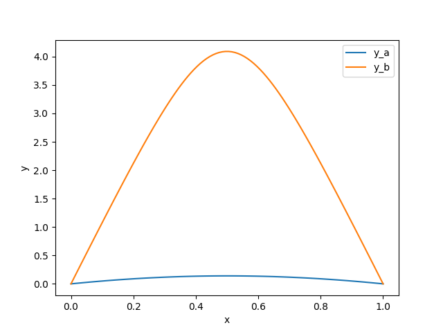
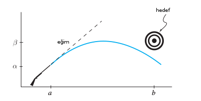
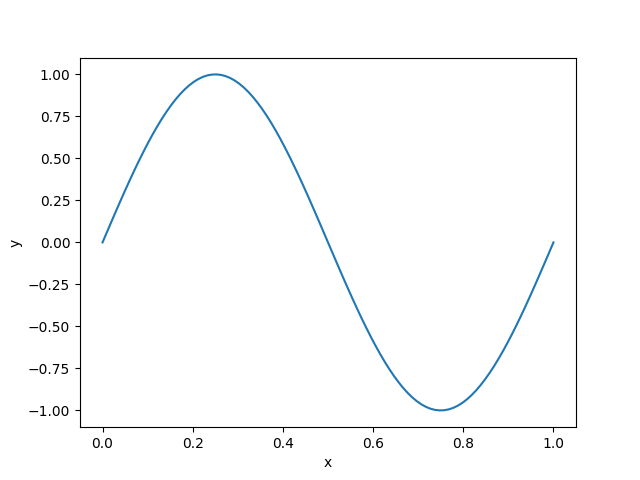
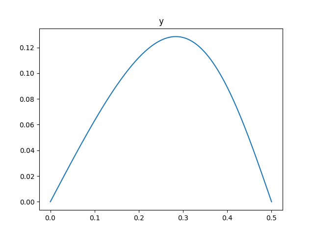
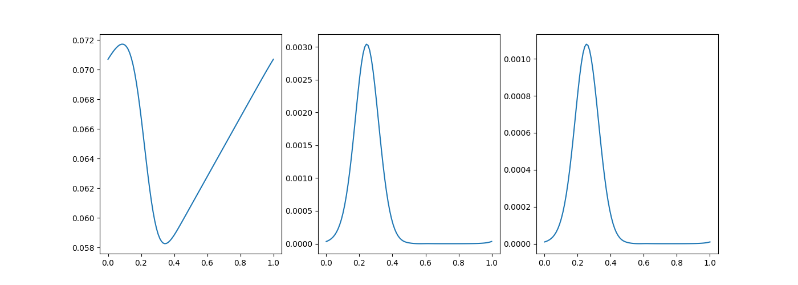

# İki Nokta Sınır Değerli Problemler (Two-Point Boundary Value Problems -TPBVP-)

BVP problemleri şu genel formda olan problemlerdir [1, sf. 287],

$$ 
x''(t) = f(t, x(t), x'(t)))
$$

$$x(t_0) = x_0, \quad x(t_f) = x_f$$ 

İkinci satır sınır şartlarını belirtiyor, zaman için $t_0,t_1,...t_f$
indisleri kullanılır, yani sistemin konumu $x(t)$'in başlangıçta $x_0$
bitişte $x_f$ noktasında olması isteniyor (bunlar gerçek tek sayı değerleri
olacak). Bilinmeyen bir başlangıç şartı var, bu $x'(0)$ şartı, diyelim
$x'(0) = z$. Bilinmeyen $z$'yi nasıl bulacağız? Genel yaklaşım olarak
bilinen az sayıda değişkeni ileri doğru entegre ederek sonda gelinen
noktaya bakılır, eldeki kısmı son nokta verisiyle karşılaştırılarak bir
hata üzerinden başlangıç düzeltilmeye uğraşılır, bu özyineli şekilde devam
eder. Çözüm yöntemi olarak ateş etme yöntemi (the shooting method) vardır,
farklı paketler farklı yaklaşımlar kullanabilir. 

Paket İle

$$
\frac{\mathrm{d} y}{\mathrm{d} x} = f(x, y, p) + \frac{S y}{x-a}
$$

$$
a \le x \le b, \quad bc(y(a), y(b), p) = 0
$$

ki $x$ tek boyutlu bağımsız değişken, $y(x)$ n-boyutlu vektör değerli
fonksiyon, $p$ $k$ boyutlu bilinmeyen parametrelerin vektörü, ki onu
$y(x)$'yi bulurken aynı anda bulmak gerekiyor. $bc$ ile sınır şartları
tanımlanıyor.


Bratu Problemi

Paket çözümleri de kullanılabilir [2, sf. 396]. Mesela `scipy`. Bratu
problemi

$$
y'' + k + \exp(y) = 0
$$

$$
y(0) = y(1) = 0
$$

Bu sistemi 1. derece bir denklemler sistemine değiştirelim,

$$
y_1' = y_2
$$

$$
y_2' = -\exp(y_1)
$$

```python
def fun(x, y):
    # k=1 farz edildi
    return np.vstack((y[1], -np.exp(y[0])))

def bc(ya, yb):
    return np.array([ya[0], yb[0]])

x = np.linspace(0, 1, 5)
```

Çağrı `bc` içinde sınır şartlarının artığı, hatası döndürülüyor. Daha
doğrusu `bc`'ye verilen iki parametre içinde başta ve sonda olmak
üzere $y = [y_1,y_2]$ formatında artık değerler var. Bu artıklardan
hangisinin belirlediğimiz sınır şartına ait olanı biz seçiyoruz. Mesela
`ya[0]` ve `yb[0]` ile içinde $y_1$'in başta ve sondaki değerini
seçmiş oluyoruz, ki zaten problemin sınır şartları onlar üzerinden
tanımlanmıştı. Eğer $y_1'$, yani $y_2$ üzerinde bir son şart olsaydı o
zaman `yb` 1. indisteki değeri döndürürdük. Ayrıca artıkler hep sıfıra
eşitlik üzerinden tanımlanır, eğer $y_1(0)=k$ gibi bir sınır değeri var
ise, $ya[0]-k$ döndürmemiz gerekir.

Bu problemin iki farklı çözümü var. Her iki çözümü de elde etmek için
$y$ için farklı başlangıç noktaları deneyeceğiz, bu seçenekleri $1$ ve
$2$ olarak işaretleyelim,

```python
y_1 = np.zeros((2, x.size))
y_2 = np.zeros((2, x.size))
y_2[0] = 3

from scipy.integrate import solve_bvp
res_1 = solve_bvp(fun, bc, x, y_1)
res_2 = solve_bvp(fun, bc, x, y_2)
```

```python
x_plot = np.linspace(0, 1, 100)
y_plot_1 = res_1.sol(x_plot)[0]
y_plot_2 = res_2.sol(x_plot)[0]

plt.plot(x_plot, y_plot_1, label='y_a')
plt.plot(x_plot, y_plot_2, label='y_b')
plt.legend()
plt.xlabel("x")
plt.ylabel("y")
plt.savefig('compscieng_app10boundary_03.png')
```



Top Atışı Metotu (Shooting Method)

Bir diğer çözüm yöntemi top atışı (silah anlamında) problemidir, güllenin
nereden atıldığı bilinir, düşmesi istenen bir yer vardır, ama hangi açıyla
(burada $x'(0))$ yukarı doğru tutulacağı bilinmez.



Bilinmeyen başlangıç şartlarından birini bulmak için bir yöntem tüm
bilinenleri kullanıp, bilinmeyen için bir tahmin yerine koymak, ve bu
sistemi entegre ederek sonuca gelmek. Sonuca gelindiğinde $x_f$'e ne kadar
yakın olunduğuna göre bir hata gradyanı oluşturup bu gradyanı $x'(0)$'te
düzeltme yapmak için kullanmak, ve süreci tekrarlamak. Bu işlem ardı ardına
yapılır ve istenen bitiş değerine gelince durulur. Bu yönteme ilham aldığı
temel örnekten hareketle atış metotu (the shooting method) adı veriliyor.

Gradyanı hesaplamak ve düzeltmede kullanmak için Sekant Yöntemini
kullanabiliriz [10]. Hata fonksiyonu $z$'nin fonksiyonudur,

$$ e(z) = x(t_f) - x_f $$

İstediğimiz $e(z)$'nin minimal olması, yani sıfıra eşit olması, $e(z) =
0$. Bu durumda bir kök bulma problemi ortaya çıkıyor,

$$ z_{n+1} = z_n - \frac{ \quad e(z_n) \quad }{\frac{\mathrm{d} e(z_n) }{\mathrm{d} z_n} }$$

Sekant yöntemi için

$$ z_{n+1} = z_n - 
\frac{ e(z_n)  }{\quad \dfrac{e(z_n) - e(z_{n-1})}{z_n - z_{n-1}} \quad }
$$

Örnek 

$$ x''(t) = 2x^2(t) + 4t x(t) x'(t)$$

$$ x(0) = \frac{1}{4}, \quad x(1) = \frac{1}{3}$$

Bu problemin analitik çözümü aslında biliniyor, 

$$x(t) = \frac{1}{4 - t^2}, \quad x'(t) = \frac{2t}{(4-t^2)^2} = 2t x^2(t)$$

Ama bilmeseydik nasıl çözerdik? Alttaki gibi. Önce $x_1'(t)$ için yeni bir
değişken tanımlayalım, $x_1'(t) = x_2(t)$ olsun, o zaman $x_2'(t)$ ana ODE
denklemimiz olabilir, çok boyutlu olarak

$$ 
\left[\begin{array}{c}
x_1'(t) \\ x_2'(t) 
\end{array}\right] 
=
\left[\begin{array}{c}
x_2(t) \\
2x_1^2(t) + 4t \cdot x_1(t)x_2(t)
\end{array}\right] 
$$

Sınır şartları

$$ 
\left[\begin{array}{c}
x_1(0) \\ x_2(0)
\end{array}\right]
=
\left[\begin{array}{c}
x_0 = 1/4 \\ x_f = 1/3
\end{array}\right]
$$

Kod, 

```python
import scipy as sp
import numpy.linalg as lin
from scipy.integrate import odeint

def rhs(u,t):
    x1, x2,  = u
    return [x2, (2*x1 + 4*t*x2)*x1]

def bvp_shoot(t0,tf,x0,xf,N,tol,kmax):
    dx0 = np.zeros(kmax)
    e = np.zeros(kmax)
    dx0[0]= (xf-x0)/(tf-t0);
    t=np.linspace(t0,tf,100)
    for k in range(1,kmax-1):
        x=odeint(rhs,[x0, dx0[k]], t)        
        e[k]=x[-1,0]-xf
        ddx= dx0[k]-dx0[k-1]
        if np.abs(e[k])<tol or np.abs(ddx)<tol: break
        deddx= (e[k]-e[k-1])/ddx;
        dx0[k+1] = dx0[k]-e[k]/deddx;
    return t, x

t0 = 0.; tf = 1.; x0 = 1/4.; xf = 1/3.;
N = 100.; tol = 1e-8; kmax = 10;

t,x = bvp_shoot(t0,tf,x0,xf,N,tol,kmax)
xo = 1.0 /(4.0 - t**2); err = lin.norm(x[:,0] - xo)/(N + 1.0)

plt.plot(t,x[:,0],'g') # bizim hesap
plt.plot(t,xo,'--r') # analitik bilinen
plt.savefig('compscieng_app10boundary_01.png')
```


Grafikte görüldüğü gibi iki çözüm birbirinin tıpkı aynısı. 

Sturm-Liouville

Yine paket ile devam edelim. Sturm-Liouville adlı bir problemi çözelim, 

$$
y'' + k^y = 0
$$

$$
y(0) = y(1) = 0
$$

Bu problemin $n$ bir tam sayı olmak üzere $k = n \pi$ için bariz / önemsiz
olmayan bir çözümünün $y=A\sin(kx)$ olduğu biliniyor. $A=1$ ile normalizasyon
sağlamak için bir sınır şart daha ekliyoruz,

$$
y'(0) = k
$$

Çünkü $y=A\sin(kx) \to y' = A k \cos(kx)$, ve $y'(0)$ dersek
$y'(0) = A k \cos(0)) = A k$ olacaktır, o zaman $y'(0) = k$ şartını
koyarsak $A=1$'i zorlamış oluruz. 

1. derece sisteme çevirirsek,

$$
y_1' = y_2
$$

$$
y_2' = -k^2 y_1
$$

Ayrıca $k\pi$ için bir çözüm aradığımız için $y$ değerlerinin aşağı yukarı
$\sin(2\pi x)$'yi takip etmesini sağlıyoruz,

```python
from scipy.integrate import solve_bvp

def fun(x, y, p):
    k = p[0]
    return np.vstack((y[1], -k**2 * y[0]))

def bc(ya, yb, p):
    k = p[0]
    return np.array([ya[0], yb[0], ya[1] - k])

x = np.linspace(0, 1, 5)
y = np.zeros((2, x.size))
y[0, 1] = 1
y[0, 3] = -1

sol = solve_bvp(fun, bc, x, y, p=[6])
print (sol.p)
```

```text
[6.2832946]
```

$k$'nin aşağı yukarı doğru değerde olduğunu görüyoruz. Tüm çözümü
grafikleyince beklenen sinüs eğrisini de göreceğiz, 

```python
x_plot = np.linspace(0, 1, 100)
y_plot = sol.sol(x_plot)[0]
plt.plot(x_plot, y_plot)
plt.xlabel("x")
plt.ylabel("y")
plt.savefig('compscieng_app10boundary_04.png')
```



Bilinmeyen Sabit Durumları

Her TPBVP problemi üstte görülen yazılımlara direk, olduğu gibi aktarılacak
durumda olmayabilir. Ama bu problemleri de bazı numaralar kullanarak
çözüm yazılımının beklediği hale çevirebiliriz. 

Mesela çoğu sınır değeri problemi bilinmeyen sabitler içerirler, ki çözüm
içi bu sabitlerin bilinmesi gereklidir. Bu tür problemler üstteki
yöntemlerle direk çözülemez. Ama bilinmeyen sabitleri de birer değişken
olarak kabul edersek, bu engelin etrafından dolaşabiliriz. Bu
"değişkenin'' ilk türevi tabii ki sıfır olacaktır, ve bu türevin sıfıra
eşit olma hali üzerinden sabiti diferansiyel denklem sistemimize dahil
edebiliriz. 

*Elastiklik* (elastica) problemi mekanik alanında standart bir problem
[3, sf. 221, 4, pg. 87]. İki ucundan kuvvet uygulanan bir esnek çubuğun
nasıl büküldüğünü modelliyor. Sabiti dahil etmeden ana sistem şöyle,

$$
x' = \cos (\phi) 
$$

$$
y' = \sin (\phi) 
$$

$$
\phi' = \kappa
$$

$$
\kappa' = F \cos (\phi)
$$

Bilinmeyen sabit $F$. Sınır değerleri,

$$
x(0) = 0
$$

$$
y(0) = 0
$$

$$
\kappa(0) = 0
$$

$$
y(0.5) = 0
$$

$$
\phi(0.5) = -\pi/2
$$

Görülen beş tane sınır değişkeniyle aslında problemi tamamen tanımlanmış
oluyor. Entegrasyondan ortaya çıkan dört tane sabit olacak, üstte beş tane
değer var. Hatta $F$'yi de bir sınır değeri olarak dahil edince hala çözüm
için yeterli öğe elimizde oluyor. Yeni sınır değeri

$$
F' = 0
$$

Dikkat, yani $F$'nin türevi her yerde sıfır olmalı (çünkü sabit).

```python
# x,y,\phi,\kappa, F
from scipy.integrate import solve_bvp

def fun(x, y):
    return np.vstack(( np.cos(y[2]),
                       np.sin(y[2]),
                       y[3],
                       y[4]*np.cos(y[2]),
                       np.zeros(x.shape[0]) ))

def bc(ya, yb):
    return np.array([ ya[0],
                      ya[1],
                      ya[3],
                      yb[1],
                      yb[2]+(np.pi/2) ])

x = np.linspace(0, 0.5, 400)
y = np.zeros((5, x.size))
sol = solve_bvp(fun, bc, x, y)
print (sol.y[4,0])
```

```text
-21.54910449259776
```

$F$ sabitinin degeri ustte goruluyor. 

Dikkat edilirse `fun` içinde $F$'ye sıfır değeri vermek için
`np.zeros(x.shape[0])` değeri tanımlandı, yani bir sıfır vektörü
tanımlandı.

Çözüm sonucu elde edilen $y$ değerlerini grafikleyelim,

```python
plt.plot(x,sol.y[1])
plt.title('y')
plt.savefig('compscieng_app10boundary_05.png')
```



Kızamık (Measles) Problemi

Problem [3, sf. 223, 5, 6, 7, sf. 13]'de görülebilir, nüfusta bir salgının
yayılması modellenmiştir. Nüfus dört farklı grup altında incelenir, bu
gruplar bağışıklı olanlar (immunes), $I$, bağışıksızlar (susceptible) $S$,
bulaştırmayan hasta (latents) $L$, ve bulaştıran hasta (infectives),
$I$. Toplam nufus sabit $N$ olsun, o zaman 

$$
S(t) + I(t) + L(t) + M(t) = N, \quad t \in [0,1]
$$

Model her grubun izafi oranını bağışıksızlar $y_1 = S/N$, bulaştırmayan
hasta $y_2 = L/N$, ve hasta olanlar $y_3 = I / N$ olarak
tanımlar. Hastalığın yayılma dinamiği şöyle tanımlanabilir, 

$$
y_1' = \mu - \beta y_1y_3
$$

$$
y_2' = \beta y_1y_3 -y_2 / \lambda
$$

$$
y_3' = y_2\lambda - y_3 / \eta
$$

$\beta$ bulaştırma oranı (sabiti). Bulaştırma oranını sezona bağlı
olabileceği için onu bir kosinüs fonksiyonu ile tanımlarız, 

$$
\beta = \beta_0 (1 + \cos(2 \pi t))
$$

ki $\beta_0 = 1575$, diğer sabitler ise $\mu = 0.02$, $\lambda = 0.0279$,
$\eta = 0.01$. Sinir sartlari 

$$
y(1) = y(0)
$$

Tabii $y$ bir vektör, $y = [y_1,y_2,y_3]$. Bu sınır şartının
tanımlanmasının sebebi periyodik bir çözüm arıyor olmamız. Bu tür sınır
şartı biraz garip olabilir, ve her sayısal paket bu tür şartın
tanımlanmasına izin vermeyebilir, fakat `scipy` izin
veriyor. Verilmiyorsa [3] kaynağında anlatılan ekstra değişkenler ve sabit
tanımlama numarasını kullanmak gerekiyor.

```python
from scipy.integrate import solve_bvp

mu = 0.02
l = 0.0279
eta = 0.01
def fun_measles(x, y):
    beta = 1575 * (1 + np.cos(2 * np.pi * x))
    return np.vstack((
        mu - beta * y[0] * y[2],
        beta * y[0] * y[2] - y[1] / l,
        y[1] / l - y[2] / eta
    ))


def bc_measles(ya, yb):
    return ya - yb

x_measles = np.linspace(0, 1, 5)
y_measles = np.full((3, x_measles.shape[0]), 0.01)

res_measles = solve_bvp(fun_measles, bc_measles, x_measles, y_measles)
```

```python
plt.figure(figsize=(14, 5))
x_measles_plot = np.linspace(0, 1, 100)
y_measles_plot = res_measles.sol(x_measles_plot)
plt.subplot(131)
plt.plot(x_measles_plot, y_measles_plot[0], label='$y_1$')
plt.subplot(132)
plt.plot(x_measles_plot, y_measles_plot[1], label='$y_2$')
plt.subplot(133)
plt.plot(x_measles_plot, y_measles_plot[2], label='$y_3$')
plt.savefig('compscieng_app10boundary_06.png')
```



Sinir Sistemi Tepkisi (Nerve Impulse)

Tekrar eden sınır şart durumunu bilinmeyen entegral limiti durumu ile
birleştiren bir problemi göreceğiz şimdi [8, sf. 27, 3, sf. 225, 6, 5,
sf. 173]. Bilinmeyen sınır şartı için bir numara yapabiliriz; Yeni bir
değişken $\tau$ tanımlıyoruz, ve bu değişken sadece $[0,1]$ aralığına
kısıtlanıyor. Bağımsız değişken $x$.  Şimdi $\tau = t/b$, ki $b$
bilinmeyen entegral sınırı,

$$
\frac{\mathrm{d} y}{\mathrm{d} x} = f(t,y)
$$

yerine 

$$
\frac{\mathrm{d} y}{\mathrm{d} \tau} = b f(t,y)
$$

$$
\frac{\mathrm{d} b}{\mathrm{d} \tau} = 0
$$

Bu nasıl oldu? 

$t = \tau b$ ise $\mathrm{d} x / \mathrm{d} \tau = b$. 

$$
\frac{\mathrm{d} y}{\mathrm{d} \tau} = \frac{\mathrm{d} y}{\mathrm{d} t} \frac{\mathrm{d} t}{\mathrm{d} \tau} = 
b f(x,y)
$$

Problem sorusuna gelelim. Diyelim ki hücre zar potansiyeli $y_1$,
geçirgenlik $y_2$, ve

$$
y_1' = 3 (y_1 + y_2 - 1/3 y_1^3 - 1.3)
$$

$$
y_2' = -(y_1 - 0.7 + 0.8 y_2) / 3
$$

Bu problem $[0,T]$ zaman diliminde tanımlanmıştır. Fakat bir problem
şu, $T$'nin ne olduğunu bilmiiyoruz, ve aynı $T$ bilinmeyeni sınır
şartlarının tanımlanmasında kullanılmış.  

$$
y_1(0) = y_1(T), \quad y_2(0) = y_2(T)
$$

Ana denklem,

$$
y_1' = 3 T (y_1 + y_2 - 1/3 y_1^3 - 1.3)
$$

$$
y_2' = -T (y_1 - 0.7 + 0.8 y_2) / 3
$$
 
Böylece problem $[0,1]$ arasında tanımlanmış oldu.  Sınır şartları böylece
$t=0,1$ üzerinden tanımlanabilir. Fakat üçüncü bir sınır şartı daha
lazım. Farklı bir açıdan eğer çözüm parçalarından birine bir değer atamak,
mesela $y_1(0) = 0$. O zaman $y_1(0) = y_1(T)$ yerine $y_1(T)=0$ da
kullanabiliriz. Böylece sınır şartları,

$$
y_1(0) = 0, \quad y_1(1) = 0, \quad y_2(0) = y_2(1)
$$

haline geldi. Bu problemi ekstra parametre seçeneğini kullanarak, bölmeden
(non-seperated) halde çözebiliriz [9, sf. 173]. 

```python
from scipy.integrate import solve_bvp

def fun(x, y, p):
    T = p[0]
    return np.vstack((
        3.0 * T *  (y[0] + y[1] - (y[0]**3)/3.0 - 1.3),
        -T / 3.0 * (y[0] - 0.7 + 0.8*y[1]) 
    ))

def bc(ya, yb, p):
    return np.array( [ ya[0], yb[0], ya[1]-yb[1] ]   )
                     
x = np.linspace(0, 1, 5)
y = np.zeros((2, x.size))
y[0] = np.sin(2 * np.pi * x)
y[1] = np.cos(2 * np.pi * x)
sol = solve_bvp(fun, bc, x, y, p=[2*np.pi])
print (sol.p)
```

```text
[10.71071556]
```

Üstteki $T$ değeri [9]'da bulunan ile aynı. 

Kaynaklar

[1] Yang, *Applied Numerical Methods using Matlab*

[2] Scipy, *Scipy Reference, 0.18.1*

[3] Cash, *Solving Differential Equations in R*

[4] Greenhill, *The applications of elliptic functions*

[5] Shampine, *A BVP Solver Based on Residual Control and the Matlab PSE*, 
    [http://www.orcca.on.ca/TechReports/TechReports/2001/TR-01-02.pdf](http://www.orcca.on.ca/TechReports/TechReports/2001/TR-01-02.pdf)

[6] Mayorov, *Github*, [https://gist.github.com/nmayorov/f8af5ca956c6a7f75ecdb578a2655894](https://gist.github.com/nmayorov/f8af5ca956c6a7f75ecdb578a2655894)

[7] Ascher, *Numerical Solution of BVPs for ODEs*

[8] Seydel, *From equilibrium to chaos*

[9] Shampine, *Solving ODEs in Matlab*

[10] Bayramlı, Diferansiyel Denklemler, *Kök Bulmak*


    

