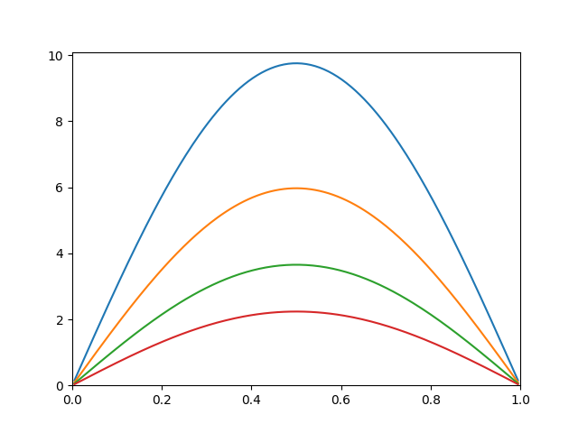
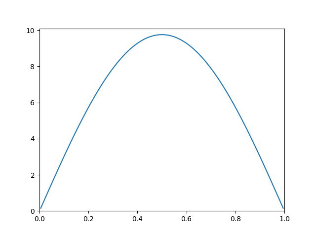
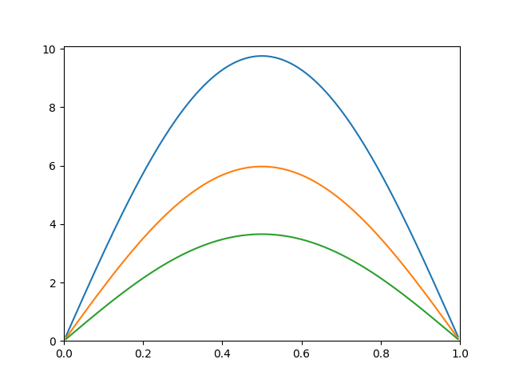
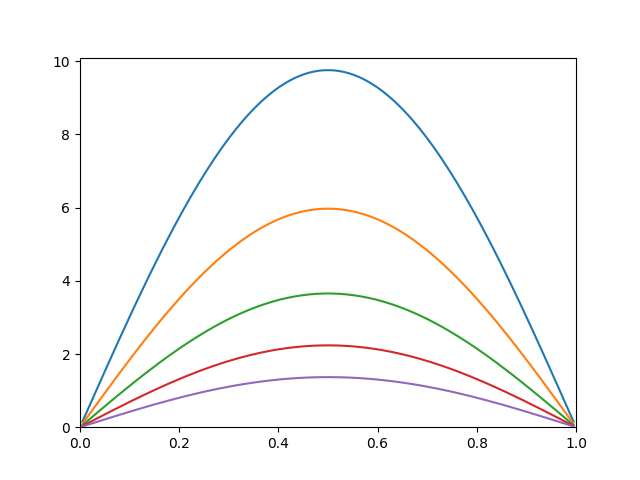

# Isı Denklemi (Heat Equation)

$$ \frac{\partial u}{\partial t} = \frac{\partial^2u}{\partial x^2} $$

olarak gösterilen denklem fizikte ısı denklemi olarak bilinir [1], u fonksiyonu
iki değişkenlidir $u(x,t)$. Örnek için bu denklemin çözümünü tek boyutta
göstereceğiz, yani bir genişliği önemli olmayan bir demir çubuğu üzerinde ısının
dağılması konusuna bakacağız, boyutu temsil için $x$ değişkeni kullanılacak. $t$
değişkeni zamanı temsil ediyor olacak. Başlangıç şartları (initial conditions)
olarak ısının t=0 anında demir çubuk üzerinde $x$'e bağlı bir sinüs fonksiyonu
ile dağıldığını farzedeceğiz, sınır şartları ise (boundary conditions) çubuğun
iki ucunun sıfır derecede tutulması olacak. Sonuçta ısının nereye gideceğini
tahmin ederek te söyleyebiliriz -- ısı demirin iki ucundan kaçarak tüm çubuk
boyunca sıfır dereceye inecektir.

Üstteki denklem bir kısmi diferansiyel denklemdir (partial differential 
equation).

Elimizde model olarak bir diferansiyel denklem varsa çözüm bulmak demek bir
fonksiyon bulmak demektir, bir sayı değil. Ayrıca çözüm için analitik değil
yaklaşıksal bir metot kullanacağız; yani öyle bir $u$ fonksiyonu bulacağız ki,
test / belli noktalarda gerçek fonksiyonla olabildiğince aynı sonuçlar verecek.

Çözümde sınırlı farklar (finite differences) denen bir metot kullanılacak. Bu
yaklaşıksal metotta calculus'un sonsuz ufaklıklar için kullanılan türevleri,
bildiğimiz sayısal çıkartma işlemi üzerinden tanımlanan "farklılıklara''
dönüşecekler. Mesela $d^2/dx^2$ nedir? $x$'e göre türevin türevidir, hesapsal
olarak ise farkın farkıdır. Sonsuzluktan yaklaşığa şöyle geçeriz: Eğer $u_{j,i}$
bir 2 boyutlu dizin üzerinde $u$ fonksiyonunun sayısal değerlerini taşıyor
olsaydı, ve $j, i$ indis değerleri $t, x$'i temsil ediyorlar ise, $x$ üzerinden
birinci türev yani birinci fark (first difference) şöyle olur:

$$ \frac{u_{j,i+1}-u_{j,i}}{h} $$

$h$ hangi değişkenin farkını alıyorsak, o farkın büyüklüğünü
tanımlayan aralık değeridir, $h=\Delta x$, ve $u_{j,ı+1} = u(t,x +
\Delta x)$.

İkinci fark, farkın farkıdır:

$$
\frac{1}{h}
\bigg[
\bigg( \frac{u_{j,i+1}-u_{j,i}}{h} \bigg) -
\bigg( \frac{u_{j,i}-u_{j,i-1}}{h} \bigg)
\bigg] 
$$

$$
= \frac{u_{j,i+1}-2u_{j,i}+u_{j,i-1}}{h^2} 
\qquad (1)
$$

Bu çarpımı tüm $i$ değerleri için ve matris üzerinden temsil etmenin yolu
şudur: Bir ikinci farklılıklar matrisi A yaratırız:

$$ 
A = \frac{1}{\Delta x^2}
\left[ \begin{array}{ccccccc}
-2 & 1 & 0 & 0 \ldots 0 & 0 & 0 \\
1 & -2 & 1 & 0 \ldots 0 & 0 & 0 \\
\vdots & \vdots & \vdots & \vdots & \vdots & \vdots \\
0 & 0 & 0 & 0 \ldots 1 & -2 & 1 \\
0 & 0 & 0 & 0 \ldots 0 & 1 & -2
\end{array} \right]
$$

Ve u değerlerini bir vektör içine çekeriz:

$$ U_j =
\left[ \begin{array}{c}
u_{j,0} \\
u_{j,1} \\
u_{j,2} \\
\vdots \\
u_{j,n}
\end{array} \right]
$$

$AU_j$ çarpımının (1) denklemindeki toplamları her u için teker teker
vereceğini görebiliriz. İndislerden $j$ zaman, $i$ mesafedir, yani üstteki
denklem şimdilik sadece mesafeyi yani $x$'i parçalara bölmüştür.

Zamanı da modele dahil edelim ve çözümü elde etmeye uğraşalım. Isı
denkleminin tamamını şimdiye kadar elde ettiklerimizi kullanarak ve
ayrıksal olarak yazalım:

$$
\frac{U_{j+1}-U_j}{\Delta t} = AU_j 
\qquad (2)
$$

$\frac{\partial^2u}{\partial x^2} \approx AU_j$, ve $\frac{\partial
  u}{\partial t} \approx (U_{j+1}-U_j) / \Delta t$ olarak
alındı. $U_j$ tanımındaki $j$ indisi zaman için kullanılıyor, mesafe
yani $x$'i temsil eden indislerin tamamı $U$'nun içinde var zaten.

Yaklaşıksal tekniklerden Crank-Nicholson'a göre $AU_j$'i ardı ardına
iki zaman indisi üzerinden hesaplanan bir ortalama olarak temsil
edebiliriz, yani

$$ AU_j \approx \frac{1}{2}(AU_{j+1}+AU_j) $$

Niye bu açılım yapıldı? Çünkü elimizde $U_{j+1}$ ve $U_j$ değerleri var, bu
değerleri tekrar ortaya çıkararak bir "denklem sistemi" yaratmış olacağız, iki
bilinmeyen için iki formül yanyana gelebilecek ve çözüme erişilebilecek. 

Üstteki formülü (2) denklemindeki $AU_j$ değerleri
için kullanalım ve tekrar düzenleyelim.

$$ \frac{\Delta t}{2}AU_{j+1} + \frac{\Delta t}{2}AU_j = U_{i+1} - U_i  $$

$$ U_{i+1} - \frac{\Delta t}{2}AU_{j+1} = U_i + \frac{\Delta t}{2}AU_j  $$

$$ (I - \frac{\Delta t}{2}A) U_{j+1} = (I + \frac{\Delta t}{2}A)U_i $$

Artık bu formülü lineer cebirden bilinen $Ax=b$ formuna sokarak
çözebiliriz. Forma göre formülün sağ tarafı $b$ olur, sol tarafta parantez içi A
olacak, $U_{j+1}$ ise bilinmeyen $x$ olacak (bizim $x$'ten farklı). Hesapsal
kodlar bir döngü içinde, her zaman dilimi için bilinmeyen $U_{j+1}$ değerini
bulacak. Döngünün sonunda yeni $U_{j+1}$ eski $U_j$ olacak ve hesap devam
edecek. 

Sınır Şartları

Her iki uçta $u$'nun sıfır olma şartı uygulamalı matematikte Dirichlet sınır
şartı olarak biliniyor. Bu şart $A$ matrisinin oluşturulması sırasında
kendiliğinden oluşuyor. Ufaltılmış bir matris üzerinde göstermek gerekirse, 

$$ \left[ \begin{array}{ccccc}
1 & -2 & 1 & 0 & 0 \\
0 & 1 & -2 & 1 & 0 \\
0 & 0 & 1 & -2 & 1
\end{array} \right]
$$

değerlerinin her satırının (1) denklemini temsil ettiğini söylemiştik.
Eğer şartlarımızdan biri $u_1$ ve $u_5$'un sıfır olması ise, çarpım
sırasında ona tekabül eden üstteki matrisin en soldaki ve en sağdaki
kolonlarını tamamen sıfır yapmamız yeterli olurdu, çünkü çarpım sırasında
$U_j$ içinde o kolonlar $u_1$ ve $u_5$ ile çarpılıp onu sıfır
yaparlardı. O zaman yeni matris şöyle olurdu:

$$ 
\left[ \begin{array}{ccccc}
0 & -2 & 1 & 0 & 0 \\
0 & 1 & -2 & 1 & 0 \\
0 & 0 & 1 & -2 & 0
\end{array} \right]
$$

Bu işler. Alternatif olarak sıfır kolon yerine, o kolonları tamamen matristen
atabilirdik, aynı şekilde $u$ değerlerini üretirken birinci ve sonuncu değerleri
de atmamız gerekirdi, nasıl olsa onlar "bilinmeyen" değişken değiller. Bu yeni
matris şöyle olurdu:

$$ \left[ \begin{array}{ccc}
-2 & 1 & 0  \\
1 & -2 & 1  \\
0 & 1 & -2 
\end{array} \right]
$$

Alttaki kod içinde `x = x[1:-1]` ibaresi $x$ ve dolaylı
olarak $u$'nun ilk ve son değerlerini atmak için kullanılmakta.

Seyrek (sparse) matrisler kullanarak çözüm altta.

```python
"""
	This program solves the heat equation
		u_t = u_xx
	with dirichlet boundary condition
		u(0,t) = u(1,t) = 0
	with the Initial Conditions
		u(x,0) = 10*sin( pi*x )
	over the domain x = [0, 1]
 
	The program solves the heat equation using a finite difference
	method where we use a center difference method in space and
	Crank-Nicolson in time.
"""
import scipy as sc
import scipy.sparse as sparse
import scipy.sparse.linalg
f, ax = plt.subplots()

 
# Number of internal points
N = 200
 
# Calculate Spatial Step-Size
h = 1/(N+1.0)
 
# Create Temporal Step-Size, TFinal, Number of Time-Steps
k = h/2
TFinal = 1
NumOfTimeSteps = 120
 
# Create grid-points on x axis
x = np.linspace(0,1,N+2)
x = x[1:-1]

# Initial Conditions
u = np.transpose(np.mat(10*np.sin(np.pi*x)))
 
# Second-Derivative Matrix
data = np.ones((3, N))
data[1] = -2*data[1]
diags = [-1,0,1]
D2 = sparse.spdiags(data,diags,N,N)/(h**2)

# Identity Matrix
I = sparse.identity(N)
 
# Data for each time-step
data = []
 
for i in range(NumOfTimeSteps):
	# Solve the System: 
	#
	# (I - k/2*D2) u_new = (I + k/2*D2)*u_old
	#
	A = (I -k/2*D2)
	b = ( I + k/2*D2 )*u
	u = np.transpose(np.mat(sparse.linalg.spsolve(A, b)))
        if i % 20 == 0:
            plt.plot(x, u)
            plt.axis((0,1,0,10.1))
            plt.savefig("heat-" + str(i))
            plt.hold(False)
```





Seyrek matrislerden olmadan, normal matris kullanarak olan çözüm altta.

```python
import scipy.linalg
f, ax = plt.subplots()

# Number of internal points
N = 200

# Calculate Spatial Step-Size
h = 1/(N+1.0)
k = h/2

x = np.linspace(0,1,N+2)
x = x[1:-1] # get rid of the '0' and '1' at each end

# Initial Conditions
u = np.transpose(np.mat(10*np.sin(np.pi*x)))

# second derivative matrix
I2 = -2*np.eye(N)
E = np.diag(np.ones((N-1)), k=1)
D2 = (I2 + E + E.T)/(h**2)

I = np.eye(N)

TFinal = 1
NumOfTimeSteps = 100

for i in range(NumOfTimeSteps):
    # Solve the System: 
    # (I - k/2*D2) u_new = (I + k/2*D2)*u_old
    A = (I - k/2*D2)
    b = np.dot((I + k/2*D2), u)
    u = scipy.linalg.solve(A, b)
    if i % 20 == 0:
        plt.plot(x, u)
        plt.axis((0,1,0,10.1))
        plt.savefig("heat-2-" + str(i))
        plt.hold(False)
```









Kaynaklar

[1] Bayramlı, *Fizik, Isı Denklemi*


