# Dalga Denklemi (Wave Equation)

Denklem [1],

$$
\frac{\partial^2 y}{\partial x^2}  =
\frac{1}{c^2}\frac{\partial^2 y}{\partial t^2}
$$

Denkleme yakından bakarsak onun bir kısmı türevsel denklem (PDE) olduğunu
görürüz. İki tane bağımsız değişken temel alınıyor, $x,t$. Ayrıca denklem
2. derece, çünkü ikinci türevi içeriyor. Bu bilgiler denklemi çözmek için
önemli [2].

Çözümde bir başlangıç şartı gerekli çünkü diferansiyel denklemleri "entegre
ederken'' daha doğrusu ileri doğru geçen zamanda hesaplarken bir başlangıç
noktası gerekiyor, bunun için bir teli kaldırıp (geçici bir süre üçgen haline
getirip) oradan bıraktığımızı düşünebiliriz, ki bu üçgen şekli alttaki gibi
modellenebilir,

$$
y(x,t=0)=\begin{cases}
1.25 x/L , &x\leq 0.8 L ,\\
(5-5x/L), &x> 0.8 L,
\end{cases} 
$$

İkinci bir başlangıç şartı daha lazım, 2. derece başlangıç şartı bu. Teli, ipi
gerip üçgen yaptım ama sonra durup tekrar bıraktım, bu da bir başlangıç şartı,
durağan durumdan başlama şartı.

$$
\frac{\partial y} {\partial t}(x,t=0) =0
$$

Çözüme bu şartlarla başlayabilirdik ama baştaki problem tanımını hatırlarsak ek
bazı şartlar daha koymuştuk, bu şartlar, kısıtlamalar her an için geçerli,
ipler iki ucundan (hareket etmeyen) duvarlara bağlı.

$$
y(0,t) \equiv 0, \quad y(L,t) \equiv 0
$$

[analitik çözüm atlandı]

Yaklaşıksal hesap için $x,t$ eksenleri düşünebiliriz, ve bu eksenlerde
sadece belli noktalardaki hesaplar yapılacak, $x$ için aralıklar $\Delta x$
genişliğinde, $t$ için $\Delta t$ genişliğinde, aralık büyüklüğünü biz
tanımlayacağız. Yani hesap noktaları $i=1,2,3,...$ için $i \Delta t$'de,
$x$ için $j=1,2,..$ ile $j \Delta t$'de.

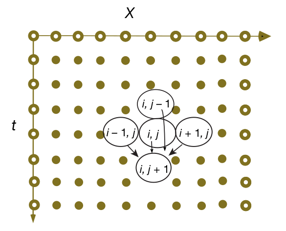

Yaklaşıksallıkta bir diğer kullanılacak teknik merkezi farklılıklar, burada $x$
için sola/sağa, $t$ için yukarı/aşağı olacak şekilde iki Taylor açılımı
yapıyoruz,


$$
y(x +\Delta x, t)  = y(x,t) +
\frac{\partial U}{\partial x}\Delta x + \frac{1}{2}
\frac{\partial^2 U}{\partial x^2}(\Delta x)^2 + \cdots
$$

$$
y(x -\Delta x, t)  = y(x,t) -
\frac{\partial U}{\partial x} \Delta x + \frac{1} {2}
\frac{\partial^2 U}{\partial x^2} (\Delta x)^2 - \cdots
$$

$$
y(x, y +\Delta t)  = y(x,t) +
\frac{\partial U}{\partial t}\Delta y + \frac{1}{2}
\frac{\partial^2 U}{\partial t^2}(\Delta t)^2 + \cdots
$$

$$
y(x, y -\Delta t) = y(x,t) -
\frac{\partial U}{\partial t} \Delta t + \frac{1} {2}
\frac{\partial^2 U}{\partial t^2} (\Delta t)^2 - \cdots
$$

Noktalı yerlerdeki terimleri yok sayıyoruz (2. derece yaklaşıklama yapmış olduk
yani, bu önemli, yaklaşık temsilin kuvvetini gösteriyor bir anlamda), sonra her
değişkenin iki açılımını birbiri ile topluyoruz. Toplama sonrası tek sayı
terimlerinin iptal olduğunu görürüz, ve kalanlar,

$$
\frac{\partial^2 y(x,t)}{\partial x^2} \simeq
\frac{y(x+\Delta x,t)+y(x-\Delta x,t)-2 y(x,t)}{(\Delta x)^2}
$$

$$
\frac{\partial^2 y(x,t)}{\partial t^2} \simeq
\frac{y(x,t+\Delta t) +y(x, y-\Delta t)-2 y(x,t)}{(\Delta t)^2}
$$

olacaktır. İndisler üzerinden belirtirsek,

$$
\frac{\partial^2 y }{\partial t^2} \simeq
\frac{y_{i,j+1}+y_{i,j-1}-2 y_{i,j}}{(\Delta t)^2}, \quad
\frac{\partial^2 y}{\partial x^2} \simeq
\frac{y_{i+1,j}+y_{i-1,j}-2 y_{i,j}} {(\Delta x)^2}.
$$

Üstteki formülleri dalga denklemindeki yerlerine koyarsak,

$$
\frac{y_{i,j+1}+y_{i,j-1}-2 y_{i,j}} {c^2 (\Delta t)^2}  =
\frac{y_{i+1,j}+y_{i-1,j}-2 y_{i,j}} {(\Delta x)^2}
\qquad (2)
$$

Tabii dikkat edersek geçmiş $j-1$ ve gelecek $j+1$ birbirine karışmış durumda,
bize lazım olan geleceğin hesabının eşitliğin sol tarafında olması geri kalan
her şey sağda olacak şekilde tekrar düzenlersek,

$$
y_{i,j+1}  = 2 y_{i,j}-y_{i,j-1}+ \frac{c^2 } {c'^{2}}
\left [ y_{i+1,j}+y_{i-1,j}-2 y_{i,j}\right], \quad c' { = }
\frac {\Delta x}{\Delta t}
\qquad (1)
$$

Hesap için üstteki resmi hatırlayalım, $i,j+1$ hücresine dört diğer hücreden ok
çizilmiş, aslında bu oklar üstteki formülün hesabını anlatıyor, o anki $t$
zamanından üç hesap ve geçmişten $i,j-1$ hesabına bakarak gelecekteki değeri
hesaplıyoruz. Bu hesaplama çok verimli olacak çünkü herhangi bir anda hafızada
tutulması gereken $y(i,j)$ haricinde sadece üç tane değer var. 

Son bir problem başlangıç anı ile alakalı, resimdeki bilinmesi gereken o üç
hücrenin başlangıç $j=1$ anında olduğunu düşünürsek, ve $j=2$'yi hesaplamamız
gerekiyor, eksi zamana doğru bir gidişat lazım, yani $j=-1$ zamanı. Başlangıç
bilgisi $j=1$ var, ama $j=-1$ yok. Buradaki bilgiyi nasıl alacağız?

Denklemsel olarak bir ek koşul daha ekleyerek, ilk başta hem teli çekip üçgen
haline getirmiştik, bir de başlangıç anında telin hızı sıfırdır diyeceğiz. Bu
mantıksız değil, tel çekildi, tutuluyor.. hareket yok. Denklem olarak
$\partial y / \partial t(x,0)$ sıfır diyeceğiz. Sonra bu denklemin merkezi
farklılık açılımını yapacağız ve oradan gelen eşitlikleri ana (1)'e sokarak
sadece $j=2$ için özel bir formül elde etmeyi umuyoruz.

$$
\frac{\partial y}{\partial t}(x,0) \simeq
\frac{y(x, \Delta t)- y(x, -\Delta t)}{2\Delta t}=0, \
\Rightarrow \ y_{i, 0} = y_{i,2}
$$

(1)'e sokunca

$$
y_{i,2} = y_{i,1}+ \frac{c^2} {c'^2}
\left [ y_{i+1,1}+y_{i-1,1}-2 y_{i,1}\right]
$$

Dikkat bu denklem sadece $j=2$ için. Bundan sonraki her $j$ için ana (1) formülü
işleyecektir.

Stabilite, von Neumann

Çözümün stabil olması için $c \le \frac{\Delta x}{\Delta t}$ şartının doğru
olması gerekir, ve çoğunlukla $\Delta x$ bizim kontrolümüzde olmaz, problemin
dayattığı bir büyüklük olur, $c$ fiziki modelin bir parçasıdır, o zaman $\Delta t$'nin
diğer verili parametrelere göre şarta uygun seçilmesi gerekir. Şarta von
Neumann ya da Courant stabilite şartı ismi veriliyor.

Türetmek için alttaki gibi bir yaklaşım [3] kullanılabilir. Fakat ilerlemeden
önce Euler denkleminden türetilen bazı ek formülleri görelim, bu formüller
birazdan işimize yarayacak. Euler formülü hatırlarsak,

$$
e^{ix} = \cos (x) + i\sin(x)
$$

Üstteki formülü $-x$ için yazarsak,

$$
e^{-ix} = \cos (-x) + i\sin(-x)
$$

olur. Kosinüs'ün simetrik davranışı, yani $\cos(-x)=\cos(x)$ ve
$-\sin(x)=\sin(-x)$ olması sebebiyle, üstteki 

$$
= \cos(x) - i\sin(x)
$$

olarak yazılabilir. Şimdi eğer $e^{ix}$ ve $e^{-ix}$'i toplarsak, önceden
gördüğümüz açılımlar üzerinden,

$$
e^{ix} + e^{-ix} = 2\cos(x)
$$

olur, çünkü eksi işaretli $\sin$ artı olanla beraber iptal olur. Tekrar
düzenlersek,

$$
\cos(x) = \frac{1}{2} (e^{ix} + e^{-ix})
\qquad (3)
$$

Benzer bir eşitliği $e^{ix} - e^{-ix}$ üzerinden elde edebiliriz,

$$
e^{ix} - e^{-ix} = 2i\sin(x)
$$

Tekrar düzenleyince aynen biraz önce bir $\cos$ tanımı elde ettiğimiz gibi
bir de $\sin$ tanımı elde ederiz,

$$
\sin(x) = \frac{1}{2i} (e^{ix} - e^{-ix})
$$

Dalga kısmi denklemi ne idi?

$$
\partial_t^2 y(x,t) = c(x)^2 \partial_x^2 y(x,t)
$$

[2] notasyonu $c$ yerine $c(x)$ kullanmış. Şimdi stabilite şartını türetmek için
çözümün basit bir düzlem dalgası (plane wave) olduğunu farz edeceğiz [1], yani
çözüm

$$
y(x,t) = e^{i(kx-\omega t)}
$$

formunda olacak. Bu formu ayrıksallaştırıp kısmı türevsel forma sokunca çıkan
eşitlikler üzerinden bir stabilite şartı elde etmek amacımız. [3] notasyonu
yerine [2]'imsi notasyon kullanacağız, yani $x,t$ indisleri $i,j$ yerine $j,n$,
herhalde hayali sayı $i$ ile karışıklık olmasın diye böyle seçilmiş. O zaman $x
\to j \Delta x$, $t \to n \Delta t$ olur.

Alttaki analitik soldaki formül ayrıksal şu hale gelir,

$$
y(x,t) = e^{i(kx - \omega t)} \to
y_{j,n} = e^{i(kj\Delta x - \omega n \Delta t)}
$$

Peki bu formülleri (2) bağlamında nasıl kullanacağız? Aslında bu çok basit.

Mesela $y_{j+1,n}$ için ayrıksal uzayda bir adım atmış oluyoruz, bu adımın
basit dalga formülünde karşılığı

$$
y_{j+1,n} = e^{i ( k(j+1)\Delta x - \omega n \Delta t )}
$$

Karışık gibi duruyor fakat $e$ bazlı işlem yapmanın faydasını göreceğiz şimdi,

$$
= e^{i k \Delta x} e^{i(k j \Delta x - \omega n \Delta t)}
$$

Bir $e$ bazlı terimi dışarı çekmiş olduk. Geri kalan sağdaki $e$ bloğuna bakınca
onun $y_{j,n}$ olduğunu görüyoruz! O zaman 

$$
y_{j+1,n} = e^{i k \Delta x} y_{j,n}
$$

Benzer bir işlemi $y_{j-1,n}$ için de gerçekleştirebiliriz, 

$$
y_{j-1,n} = e^{-i k \Delta x} e^{i(k j \Delta x - \omega n \Delta t)}
$$

$$
 = e^{-i k \Delta x} y_{j,n}
$$

Teknik ayrıksal zaman üzerinde de işliyor,

$$
y_{j,n+1}  = e^{-i k \Delta t} y_{j,n}
$$

$$
y_{j,n-1}  = e^{i k \Delta t} y_{j,n}
$$

O zaman bu öğeleri dalga denklemi (2)'ye sokabiliriz. O denklemi [2]'ye göre
birazcık değiştirip tekrar verelim,

$$
\frac{y_{j,n+1} - 2 y_{j,n} + y_{j,n-1} }{\Delta t^2} =
c_j^2 \left[ \frac{ y_{j+1,n} - 2 y_{j,n} + y_{j-1,n} }{\Delta x^2}  \right]
$$

Şimdi üstteki formülde sonlu ayrıksal terimleri, yani $y_{j,n+1}$, $y_{j,n-1}$,
$y_{j+1,n}$, ve $y_{j-1,n}$ terimlerini, biraz önce bulduğumuz üstel terimlerle
değiştirelim,

$$
e^{i(k j \Delta x - \omega n \Delta t)} \left[
\frac{ e^{i\omega \Delta t} - 2  + e^{-i\omega \Delta t}  }
     {\Delta t^2}\right] =
c^2 \left[
\frac{e^{ik\Delta x} - 2 + e^{-ik\Delta x}}
     {\Delta x^2}
\right] e^{i(k j \Delta x - \omega n \Delta t)}
$$

$c_j \to c$ geçişi her $j \Delta x$ noktasına göre tanımlanıyor muhakkak.

Devam edelim, son formülde basitleştirme yapılabilir, en sol ve sağdaki terimler
iptal olabilir,

$$
\left[
\frac{ e^{i\omega \Delta t} - 2  + e^{-i\omega \Delta t}  }
     {\Delta t^2}\right] =
c^2 \left[
\frac{e^{ik\Delta x} - 2 + e^{-ik\Delta x}}
     {\Delta x^2}
\right]
$$

Geri kalanları tekrar düzenleyelim,

$$
e^{i\omega \Delta t} + e^{-i\omega \Delta t} - 2 =
c^2 \frac{\Delta t^2}{\Delta x^2} [ e^{ik\Delta x} - e^{-ik\Delta x} - 2]
$$

Hayali terimlerden kurtulmak istiyoruz tabii, bu noktada (3)'teki kosinüs
tanımını tekrar hatırlayalım, onu kullanırsak, eşitliğin solundaki iki terim ve
sağındaki iki terim için ayrı ayrı,

$$
2 \cos(\omega \Delta t) - 2 = c^2 \frac{\Delta t^2}{\Delta x^2}
(2 \cos(k\Delta x) - 2)
$$

Herşeyi 2 ile bölelim,

$$
\cos(\omega \Delta t) - 1 = c^2 \frac{\Delta t^2}{\Delta x^2}
(\cos(k\Delta x) - 1)
\qquad (4)
$$

Şimdi bir diğer trigonometrik eşitliği kullanacağız [4],

$$
2\sin^2(x) = 1 - \cos (2x)
$$

Biraz degistirirsek,

$$
\sin (x) = \sqrt{1 - \cos (2x)}
$$

Ya da

$$
\sin (\frac{x}{2}) = \pm \sqrt{1 - \cos (x)}
$$

Bu eşitliğin (4) ifadesini nasıl basitleştireceğini görmek zor değil,

$$
\sin^2(\omega \frac{\Delta t}{r}) =
c^2 \frac{\Delta t^2}{\Delta x^2} \sin^2 (k \frac{\Delta x}{2} )
$$

Karelerden kurtulabiliriz,

$$
\sin(\omega \frac{\Delta t}{r}) =
c \frac{\Delta t}{\Delta x} \sin (k \frac{\Delta x}{2} )
$$

İşte bu basit denklem sayısal analizin en temel bulgularından birine götürdü
bizi.

Üstteki denklemin reel sonuçlara sahip olması için

$$
c \frac{\Delta t}{\Delta x} \le 1
$$

olmalıdır. Bu koşul artık ünlü olan Courant-Friedrichs-Lewy (CFL) koşulu, ya da
kriteridir. Bu koşul iki tür hızın arasında bir ilişki kurar, biri fiziksel hız,
ki fiziksel ortamda dalganın yayılma hızı bu, diğeri ise "algoritmik hız'' bir
anlamda, bizim tanımladığımız ızgaranın genişliği $\Delta x$ bölü yine bizim
seçtiğimiz zaman aralığı $\Delta t$.

```python
rho = 0.01;
ten = 40.;
c = np.sqrt(ten/rho)               
c1 = c;
ratio =  c*c/(c1*c1)  # CFL kriteri = 1
# dongunun her adiminda sadece uc zaman dilimi yeterli, o sebeple
# xi [_,3] boyutunda. 
xi = np.zeros((101,3), float)                            
k = range(0,101)

for i in range(0, 81):
   xi[i, 0] = 0.00125*i         
for i in range (81, 101):
   xi[i, 0] = 0.1 - 0.005*(i - 80) 

fig = plt.figure()  
for i in range(1,100): 
    xi[i,1] = xi[i,0] + 0.5*ratio*(xi[i+1,0] + xi[i-1,0] -2*xi[i,0])  
    
for j in range(100):
   for i in range(1, 100):              
      xi[i,2] = 2.*xi[i,1]-xi[i,0]+ratio*(xi[i+1,1]+xi[i-1,1]-2*xi[i,1])
   if j % 5 == 0:      
      plt.grid(True)
      plt.xlim(0, 101)
      plt.ylim(-0.15, 0.15)
      plt.plot(k,xi[k,2])
      plt.savefig('/tmp/string-%02d.png' % j)
      plt.clf()
   # bitti, 1,2 indisi yeni 0,1 olacak
   for m in range (0,101):
      xi[m, 0] = xi[m, 1]
      xi[m, 1] = xi[m, 2]
```

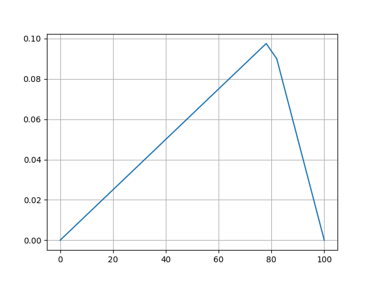

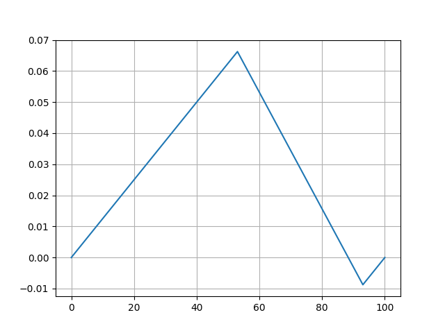


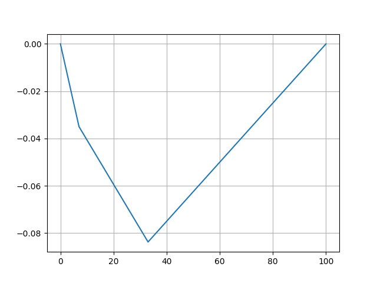

```python
import os
os.system("convert -loop 0 -delay 100 /tmp/string*.png string.gif")
```

Animasyonlu sonucu [5]'te bulabiliriz.

Tek Boyutlu Lineer Taşınım Akımı (Convection)

Tek boyutlu lineer taşınım akımı, ya da tek boyutlu lineer yatay iletim
(advection), CFD hakkında bir şeyler öğrenmek için güzel fırsatlar içeriyor. Bu
ufak denklemin bize ne kadar çok şey öğreteceğini görmek bizi
şaşırtabilir. Denklem,

$$
\frac{\partial u}{\partial t} +
c \frac{\partial u}{\partial x}  = 0
\qquad (2)
$$

Dikkat bu bir dalga denklemi olarak bilinir, fakat esas dalga denkleminin kısmi
türevsel formu ikinci kısmi türevi içeriyor, bkz [7]. Üstteki denklem verili
başlangıç şartlarına göre bir basit dalganın şekil değiştirmeden $c$ hızında
yayılmasını temsil eder. Başlangıç şartlarını $u(x,0) = u_0(x)$ olarak
gösterirsek, denklemin kesin analitik çözümü $u(x,y) = u_0(x-ct)$.

Üstteki formülü süreklilik denkleminin [8] bir formu olarak ta görebiliriz [9, sf. 557].
Süreklilik denklemi

$$
\frac{\partial \rho}{\partial t}  + \nabla \cdot (\rho \bar{u} ) = 0
$$

idi, bu formülü tek boyutta düşünürsek ve sabit hız $\bar{u} = c$ alırsak (2)'ye ulaşırız.


Denklemi hem zaman, hem uzay bağlamında ayrıksallaştıracağız. Türev tanımından
(ve limit ifadesini çıkartınca),

$$
\frac{\partial u}{\partial x} \approx
\frac{u(x+\Delta x) - u(x)}{\Delta x}
$$

olduğunu biliyoruz. Şimdi zamanda İleri Farklılık (Forward Difference), uzayda
Geriye Farklılık (Backward Difference) kullanalım.. Ve eğer $x$ eksenini $N$
parçaya ayırırsak ve bu parçaları $i=0,..,N$ ile indekslersek, ve en ufak zaman
adımını da $\Delta t$ ile gösterip o adımı $n$ ile indislersek,

$$
\frac{u_i^{n+1} - u_i^n}{\Delta t} + c \frac{u_i^{n} - u_{i-1}^n}{\Delta x} = 0
$$

ki $n$ ve $n+1$ ardı ardına olan iki zaman adımı, $i-1$ ve $i$ ise
ayrıksallaştırılmış iki $x$ yeri oluyor. Eğer başlangıç koşulları verilmiş ise o
zaman bu ayrıksal sistemde tek bilinmeyen $u_i^{n+1}$'dir. Denklemi tekrar
düzenlersek bilinmeyen için yeni bir formül elde edebiliriz,

$$
u_i^{n+1} = u_i^n - c \frac{\Delta t}{\Delta x} ( u_i^n - u_{i-1}^n )
\qquad (1)
$$

Yeri temsil eden $x$ eksenini eşit aralıklı parçalara böleceğiz, bir tek boyutlu
ızgara yaratacağız, genişlik 2 birim olacak, `nx` değişkeni kaç tane ızgara
noktası olduğunu tanımlayacak, `dx` iki nokta arasındaki uzaklık.

```python
import time, sys
nx = 41
dx = 2 / (nx-1)
nt = 25  
dt = .025
c = 1    
```

Başlangıç şartlarını tanımlamak lazım, başlangıç hızı $u_0$ aralık
$0.5 \leq x \leq 1$ içinde $u = 2$, diğer her yerde $u = 1$.

```python
u = np.ones(nx)
u[int(.5 / dx):int(1 / dx + 1)] = 2  
print(u)
```

```text
[1. 1. 1. 1. 1. 1. 1. 1. 1. 1. 2. 2. 2. 2. 2. 2. 2. 2. 2. 2. 2. 1. 1. 1.
 1. 1. 1. 1. 1. 1. 1. 1. 1. 1. 1. 1. 1. 1. 1. 1. 1.]
```

```python
plt.plot(np.linspace(0, 2, nx), u);
plt.savefig('compscieng_app45cfd1_01.png')
```


Üstteki bir fonksiyon türü aslında, ona görüntüsü sebebiyle "şapka fonksiyonu''
ismi de veriliyor.

Şimdi taşınım akımı denkleminin ayrıksal kodlamasına gelelim, burada sonlu
farklılık (finite difference) yaklaşımı kullanıyoruz, $u$ vektörü içindeki her
öge için (1) formülünü işleteceğiz.

```python
un = np.ones(nx)
for n in range(nt):
    un = u.copy() 
    for i in range(1, nx):
        u[i] = un[i] - c * dt / dx * (un[i] - un[i-1])        
```

Üstteki işlemle zamanı ileri sardık ve fonksiyon belli bir noktaya geldi. Nereye
geldi?

```python
plt.plot(np.linspace(0, 2, nx), u);
plt.savefig('compscieng_app45cfd1_02.png')
```

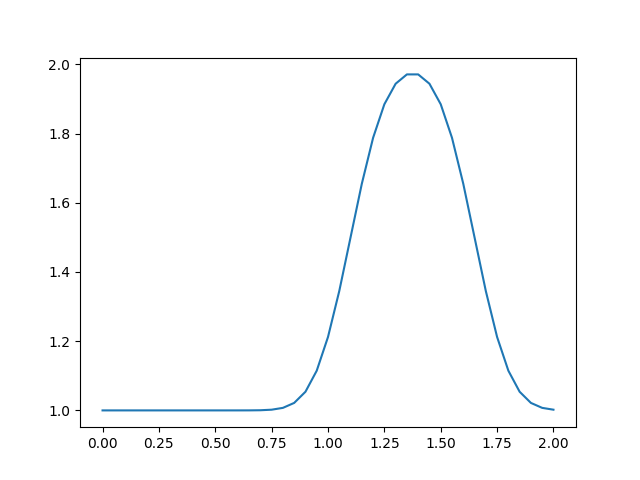

Evet, başlangıç fonksiyonu hakikaten sağa doğru taşındı. Fakat artık fonksiyon
bir şapka değil. Ne oldu? Sonuç yaklaşık temsilin kalitesiyle alakalı, `dx`
ve `dt` küçültüldükçe kalite artacaktır, ve şapkaya daha çok benzeyen
sonuçlar görülecektir. 

Gayrı Lineer Taşınım Akımı (Nonlinear Convection)

Şimdi biraz önceki teknikleri kullanarak gayrı lineer taşınım akımı
kodlayacağız, tek boyutta denklem,

$$
\frac{\partial u}{\partial t} +
u  \frac{\partial u}{\partial c}  = 0
$$

Dikkat edersek önceki denklemdeki $c$ ile çarpım yerine şimdi $u$ ile çarpım
var, bu sebeple formülün ikinci terimi gayrı lineer hale geldi. Eğer
ayrıksallaştırma işlemini tekrar uygularsak, alttaki sonuca erişiriz,

$$
u_i^{n+1} = u_i^n -  u_i^n \frac{\Delta t}{\Delta x} ( u_i^n - u_{i-1}^n )
$$

```python
nx = 41
dx = 2 / (nx - 1)
nt = 20
dt = .025 
u = np.ones(nx)
u[int(.5 / dx) : int(1 / dx + 1)] = 2  
un = np.ones(nx)
```

```python
un = np.ones(nx)
for n in range(nt):
    un = u.copy() 
    for i in range(1, nx):
        u[i] = un[i] - un[i] * dt / dx * (un[i] - un[i-1])        
```

```python
plt.plot(np.linspace(0, 2, nx), u);
plt.savefig('compscieng_app45cfd1_03.png')
```

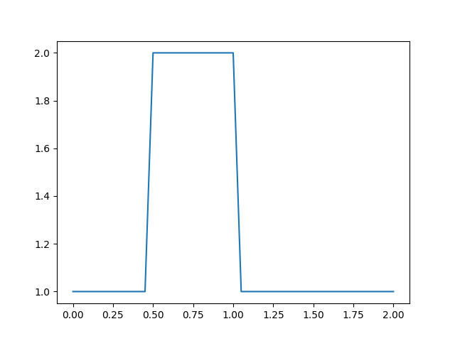

Yakınsama (Convergence)

Lineer taşınım hesabında ortaya çıkan tepe şeklinin ızgara çözünülürlüğü ile
alakalı olduğunu söylemiştik. Bunu birkaç farklı çözünürlük ile deneyerek
görelim. İlk gördüğümüz sonuç `nx=41` kullandı. Arttıralım,

```python
def linearconv(nx):
    dx = 2 / (nx - 1)
    nt = 20    
    dt = .025  
    c = 1

    u = np.ones(nx)
    u[int(.5/dx):int(1 / dx + 1)] = 2  

    un = np.ones(nx)

    for n in range(nt):
        un = u.copy() 
        for i in range(1, nx):
            u[i] = un[i] - c * dt / dx * (un[i] - un[i-1])
        
    plt.plot(np.linspace(0, 2, nx), u);

linearconv(61)
plt.savefig('compscieng_app45cfd1_04.png')
```

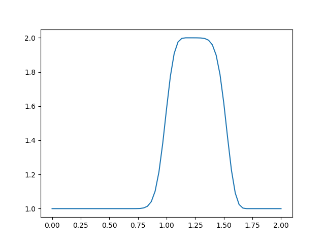

```python
linearconv(71)
plt.savefig('compscieng_app45cfd1_05.png')
```

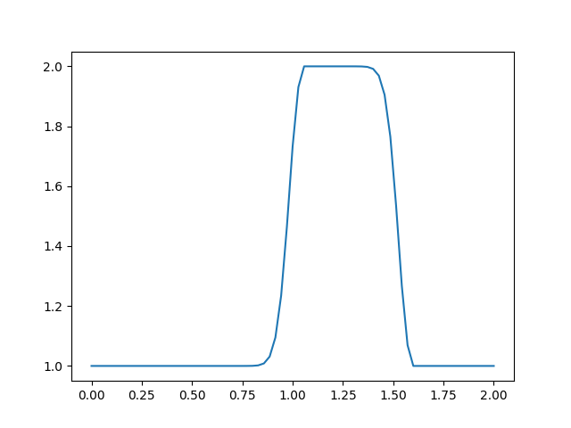

Gittikçe daha fazla şapka fonsiyonuna benzer sonuçlar alıyoruz. Şimdi dikkat,
bir kez daha arttıralım,

```python
linearconv(85)
plt.savefig('compscieng_app45cfd1_06.png')
```


Bu sonuç şapka fonksiyonuna benzemiyor. Ne oldu?

Hesaplananları düşünürsek, yer ekseni üzerinde dalganın hareketini hesaplıyoruz,
fakat her adımda $\Delta t = 0.025$ farzederk bu hesapları yapıyoruz. Üstteki
yanlış sonuçta $\Delta t$ zaman aralığında öyle bir adım attık ki bu adım
`dx`'in büyüklüğünden daha fazla. Bu durum ilk denemelerde ortaya çıkmadı
çünkü `dx` yeterince büyük tutulmuştu. Fakat onu küçültükçe bir noktada
hesap patladı.

Stabilite için $\Delta t$ adımını $\Delta x$ ile ilişkilendirecek bir formül
faydalıdır, böyle bir formül var,

$$
\sigma = \frac{u \Delta t}{\Delta x} \le \sigma_{max}
$$

$u$ dalganın hızı, $\sigma$ degiskeni Courant sayısı, ve $\sigma_{max}$
stabiliteyi sağlayacak üst limit. Çoğunlukla $\sigma_{max} = 1$ seçilir. Bu
ilişkinin türetilmesini [12]'de bulabiliriz.

Diffusion (Yayınım) Denklemi

Tek boyuttaki yayınım denklemi,

$$
\frac{\partial u}{\partial t} = \nu \frac{\partial^2 u}{\partial x^2}
$$

Dikkat edersek bu denklemde bir ikinci kısmı türev var. Denklemin o
kısmını Merkezi Farklar yaklaşımı ile ayrıksal hale getireceğiz, bu
yaklaşım İleri Farklar ve Geriye Farklar yaklaşımlarının birleştirilmesi ile
elde edilir.

Önce Taylor serilerini hatırlarsak, genel tanım

$$
f(x+h) = f(x) + h f'(x) + \frac{h^2}{2} f''(x) + ...
$$

Biz $u_{i+1}$ ve $u_{i-1}$ açılımını Taylor serisi ile yapmak istiyoruz, daha
önce belirttiğimiz gibi bir önceki ve sonraki $x$ değerleri $\Delta x$
uzaklığında, yani bir önceki

$$
u(x-\Delta x) = u(x) - \Delta x f'(x) + \frac{h^2}{2} u''(x) + ...
$$

İşaretin eksi olmasına dikkat, ve sonraki 

$$
u(x+\Delta x) = u(x) + \Delta x f'(x) + \frac{h^2}{2} u''(x) + ...
$$

Şimdi indisleriyle $u$ için ve [6]'deki formuyla yazalım,

$$
u_{i+1} = u_i + \Delta x \frac{\partial u}{\partial x}\bigg|_i +
\frac{\Delta x^2}{2} \frac{\partial ^2 u}{\partial x^2}\bigg|_i +
\frac{\Delta x^3}{3!} \frac{\partial ^3 u}{\partial x^3}\bigg|_i +
O(\Delta x^4)
$$

$$
u_{i-1} = u_i - \Delta x \frac{\partial u}{\partial x}\bigg|_i +
\frac{\Delta x^2}{2} \frac{\partial ^2 u}{\partial x^2}\bigg|_i -
\frac{\Delta x^3}{3!} \frac{\partial ^3 u}{\partial x^3}\bigg|_i +
O(\Delta x^4)
$$

Bir üstteki denklemin ilk hali $u_i = u_{i-1} ... $ ile ama ufak bir yer
değişimi ile görülen biçim elde edilmiş. 

Son iki formülü toplarsak bazı terimlerin ters işaretli olması sebebiyle iptal
olacağını görebiriliz. Ayrıca yaklaşık temsil açısından $O(\Delta x^4)$ ve daha
üstü kuvvetleri yok sayarsak, 

$$
u_{i+1} + u_{i-1} =
2u_i+\Delta x^2 \frac{\partial ^2 u}{\partial x^2}\bigg|_i +
O(\Delta x^4)
$$

$\frac{\partial ^2 u}{\partial x^2}\bigg|_i$ için çözersek ve tekrar düzenlersek,

$$
\frac{\partial ^2 u}{\partial x^2}=\frac{u_{i+1}-2u_{i}+u_{i-1}}{\Delta x^2} + O(\Delta x^2)
$$

$O(\Delta x^2)$ ifadesi $O(\Delta x^4)$ terimi $\Delta x^2$ ile bölününce ortaya çıktı.

Artık 1D yayınım formülünün nihai ayrıksal halini yazabiliriz,

$$
\frac{u_{i}^{n+1}-u_{i}^{n}}{\Delta t} =
\nu\frac{u_{i+1}^{n}-2u_{i}^{n}+u_{i-1}^{n}}{\Delta x^2}
$$

Daha önce olduğu gibi başlangıç koşuları tanımlı ise tek bilinmeyen
$u_{i}^{n+1}$, bu bilinmeyen eşitliğin solunda kalacak şekilde tekrar
düzenlersek,


$$
u_{i}^{n+1} =
u_{i}^{n}+\frac{\nu\Delta t}{\Delta x^2}(u_{i+1}^{n}-2u_{i}^{n}+u_{i-1}^{n})
$$

Üstteki denklem bize çözümü adım adım ilerletmemizi sağlayacak. Ama bir
başlangıç koşuluna ihtiyacımız var, daha önceki favorimize dönebiliriz, şapka
fonksiyonu. $t=2$'de $u=0$, $0.5\le x\le 1$ aralığında ise $u=1$. 

```python
nx = 41
dx = 2 / (nx - 1)
nt = 20 
nu = 0.3 
sigma = .2 
dt = sigma * dx**2 / nu 


u = np.ones(nx)     
u[int(.5 / dx):int(1 / dx + 1)] = 2 

un = np.ones(nx)

for n in range(nt): 
    un = u.copy() 
    for i in range(1, nx - 1):
        u[i] = un[i] + nu * dt / dx**2 * (un[i+1] - 2 * un[i] + un[i-1])
        
plt.plot(np.linspace(0, 2, nx), u);
plt.savefig('compscieng_app45cfd2_01.png')
```


2D Taşınım (2D Convection)

2 boyuta geçme zamanı geldi. 2D lineer taşınım akımını (convection) temsil eden
parçalı kısmi diferansiyel denklem,

$$
\frac{\partial u}{\partial t} +
c\frac{\partial u}{\partial x} +
c\frac{\partial  u}{\partial y} = 0
$$

Bu 1D lineer taşınım akımı ile neredeyse aynı formda, sadece şimdi tek yersel
boyut yerine iki tane boyutumuz var, $x$ ve $y$.

Ayrıksal hale getirmek için aynı yaklaşımı kullanacağız, zaman adımlarını ileri
farklar, konumsal değişkenleri ise geriye farklar yöntemi ile ayrıksal
yapacağız. 1D durumda $i$ altsimgesini konumda olan hareketlilik için
kullanmıştık,  $u_{i}^n-u_{i-1}^n$ mesela. Şimdi, 2D durumda, ikinci bir
altsimge $j$ ekliyoruz, $y$ boyutunu böylece indislemiş olacağız.

Tüm bunları kullanarak ayrıksal forma erişmek zor değil,

$$
\frac{u_{i,j}^{n+1}-u_{i,j}^n}{\Delta t} +
c\frac{u_{i, j}^n-u_{i-1,j}^n}{\Delta x} +
c\frac{u_{i,j}^n-u_{i,j-1}^n}{\Delta y}=0
$$

Daha önce olduğu gibi tek bilinmeyene göre tekrar düzenleyelim,

$$
u_{i,j}^{n+1} =
u_{i,j}^n-c \frac{\Delta t}{\Delta x}(u_{i,j}^n-u_{i-1,j}^n) -
c \frac{\Delta t}{\Delta y}(u_{i,j}^n-u_{i,j-1}^n)
$$

Denklemi alttaki başlangıç şartlarına göre çözeceğiz,

$$
u(x,y) = \begin{cases}
\begin{matrix}
2\ & 0.5 \leq x, y \leq 1   & \text{için}  \cr
1\ & \text{diğer her yerde}
\end{matrix}\end{cases}
$$

Sınır şartları

$$
u = 1\ \text{değeri } \begin{cases}
\begin{matrix}
x =  0,\ 2 \cr
y =  0,\ 2 \end{matrix}\end{cases}
\text{ için }
$$

```python
from mpl_toolkits.mplot3d import Axes3D    
from matplotlib import cm
nx = 81
ny = 81
nt = 100
c = 1
dx = 2 / (nx - 1)
dy = 2 / (ny - 1)
sigma = .2
dt = sigma * dx

x = np.linspace(0, 2, nx)
y = np.linspace(0, 2, ny)

u = np.ones((ny, nx)) ##create a 1xn vector of 1's
un = np.ones((ny, nx)) ##

u[int(.5 / dy):int(1 / dy + 1),int(.5 / dx):int(1 / dx + 1)] = 2 

fig, ax = plt.subplots(1, 1, subplot_kw={'projection': '3d'})
X, Y = np.meshgrid(x, y)                            
surf = ax.plot_surface(X, Y, u[:], cmap=cm.viridis)
plt.savefig('compscieng_app45cfd3_01.png')
```

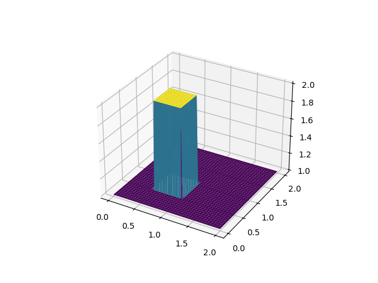

İki boyutta zamanı ileri saralım şimdi. Tüm $i$ ve $j$'leri işleyebilmek için
bir içiçe geçmiş döngü gerekiyor bize. Python dilinde `for` kullanmak çok
optimal değildir, ama alttaki kod neler olduğunu gösterebilmek için yardımcı
olacaktır.


```python
u = np.ones((ny, nx))
u[int(.5 / dy):int(1 / dy + 1), int(.5 / dx):int(1 / dx + 1)] = 2

for n in range(nt + 1): 
    un = u.copy()
    row, col = u.shape
    for j in range(1, row):
        for i in range(1, col):
            tmp1 = (c * dt / dx * (un[j, i] - un[j, i - 1]))
            tmp2 = (c * dt / dy * (un[j, i] - un[j - 1, i]))
            u[j, i] = (un[j, i] - tmp1 - tmp2)
            u[0, :] = 1
            u[-1, :] = 1
            u[:, 0] = 1
            u[:, -1] = 1

fig, ax = plt.subplots(1, 1, subplot_kw={'projection': '3d'})
surf2 = ax.plot_surface(X, Y, u[:], cmap=cm.viridis)
plt.savefig('compscieng_app45cfd3_02.png')
```

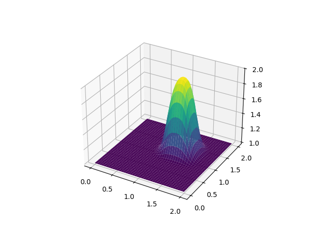

Burgers'in Denklemi

Bu denklem tek boyutta şuna benziyor

$$
\frac{\partial u}{\partial t} + u \frac{\partial u}{\partial x} =
\nu \frac{\partial ^2u}{\partial x^2}
$$

Görüldüğü gibi bu formül gayrı lineer taşınım akımı (convection) ile yayınım
(diffusion) formüllerinin birleşimi. O zaman denklemi önce gördüğümüz teknikler
ile ayrıksal hale getirebiliriz.

$$
\frac{u_i^{n+1}-u_i^n}{\Delta t} + u_i^n \frac{u_i^n - u_{i-1}^n}{\Delta x} =
\nu \frac{u_{i+1}^n - 2u_i^n + u_{i-1}^n}{\Delta x^2}
$$

Daha önce olduğu gibi başlangıç koşulumuz var, ona göre denklemi tekrar
düzenliyoruz,

$$
u_i^{n+1} =
u_i^n - u_i^n \frac{\Delta t}{\Delta x} (u_i^n - u_{i-1}^n) +
\nu \frac{\Delta t}{\Delta x^2}(u_{i+1}^n - 2u_i^n + u_{i-1}^n)
$$

Bu örnekte farklı bir başlangıç şartı kullanacağız.

$$
u = -\frac{2 \nu}{\phi} \frac{\partial \phi}{\partial x} + 4 
$$

$$
\phi = \exp \bigg(\frac{-x^2}{4 \nu} \bigg) + \exp \bigg(\frac{-(x-2 \pi)^2}{4 \nu} \bigg)
$$

Bu başlangıç şartlarına göre Burgers denkleminin analitik çözümü biliniyor,

$$
u = -\frac{2 \nu}{\phi} \frac{\partial \phi}{\partial x} + 4
$$

$$
\phi = \exp \bigg(\frac{-(x-4t)^2}{4 \nu (t+1)} \bigg) + \exp \bigg(\frac{-(x-4t -2 \pi)^2}{4 \nu(t+1)} \bigg)
$$

Sınır şartı

$$
u(0) = u(2\pi)
$$

Fakat başlangıç şartını belli ızgara noktalarında işletebilmek istiyoruz, fakat
üstteki formülde çetrefil bir form var, birşeylerin türevi vs var. Ne yapacağız? 
Paket `sympy` kullanılabilir.

```python
import sympy
from sympy.utilities.lambdify import lambdify
from sympy import init_printing
init_printing(use_latex=True)

x, nu, t = sympy.symbols('x nu t')
phi = (sympy.exp(-(x - 4 * t)**2 / (4 * nu * (t + 1))) +
       sympy.exp(-(x - 4 * t - 2 * sympy.pi)**2 / (4 * nu * (t + 1))))
phiprime = phi.diff(x)

u = -2 * nu * (phiprime / phi) + 4
ufunc = lambdify((t, x, nu), u)
print(ufunc(1, 4, 3))
```

```text
3.49170664206445
```

```python
nx = 101
nt = 100
dx = 2 * np.pi / (nx - 1)
nu = .07
dt = dx * nu

x = np.linspace(0, 2 * np.pi, nx)
un = np.empty(nx)
t = 0

u = np.asarray([ufunc(t, x0, nu) for x0 in x])
```

```python
plt.figure(figsize=(11, 7), dpi=100)
plt.plot(x, u, marker='o', lw=2)
plt.xlim([0, 2 * np.pi])
plt.ylim([0, 10]);
plt.savefig('compscieng_app45cfd2_02.png')
```


```python
for n in range(nt):
    un = u.copy()
    for i in range(1, nx-1):
        u[i] = un[i] - un[i] * dt / dx *(un[i] - un[i-1]) + nu * dt / dx**2 *\
                (un[i+1] - 2 * un[i] + un[i-1])
    u[0] = un[0] - un[0] * dt / dx * (un[0] - un[-2]) + nu * dt / dx**2 *\
                (un[1] - 2 * un[0] + un[-2])
    u[-1] = u[0]
        
u_analytical = np.asarray([ufunc(nt * dt, xi, nu) for xi in x])
```

```python
plt.figure(figsize=(11, 7), dpi=100)
plt.plot(x,u, marker='o', lw=2, label='Hesapsal')
plt.plot(x, u_analytical, label='Analitik')
plt.xlim([0, 2 * np.pi])
plt.ylim([0, 10])
plt.legend();
plt.savefig('compscieng_app45cfd2_03.png')
```

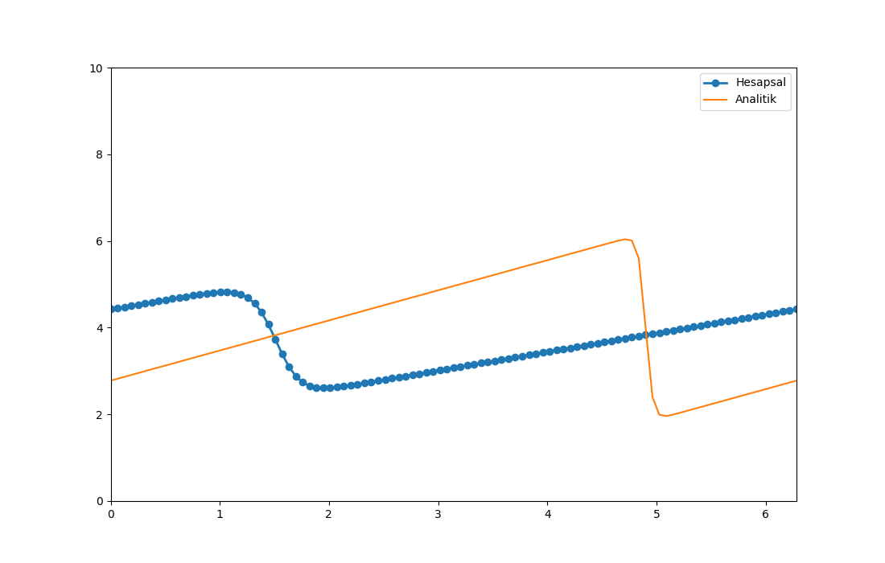

Alternatif Anlatim [9, sf. 559]

Tek boyutta Burgers'in denklemi,

$$
\frac{\partial u}{\partial t} + \epsilon u \frac{\partial u}{\partial x} = 0
$$

olarak ta gösterilebilir. Denklemin muhafazakar formu (ayrıksallaştırmada işi
kolaylaştırıyor),

$$
\frac{\partial u}{\partial t} + \epsilon \frac{\partial (u^2 / 2)}{\partial x} = 0
$$

$u^2$ nereden geldi? $u^2$ üzerinde $\partial / \partial x$ türevi uygulanınca
Zincirleme Kanunu ile $2 u \cdot \partial u / \partial x$ elde ederdik, o zaman
bu formülü 2 ile bölerek iki üstteki forma erisebiliriz.

Bu denklem taşınım formülünün bir şekli bir anlamda, eğer dalga hızı
$c = \epsilon u$ dersek. Dikkat edersek bu durumda dalga hızı dalga boyuna
(amplitude) oranlı hale geliyor, yani dalganın üst tarafında hız daha artacak.
Denkleme eklenen bir gayri lineerlik ilginç davranışlara yol açıyor. Taşınım
formülünde dalganın her kısmı aynı hızda hareket eder, "taşınır'', ve bu
sebeple dalga şeklinde bir değişim olmaz. Ama dalganın üst kısmı alt kısmına
göre daha hızlı hareket ederse şekil değişimi olur, dalganın üstü daha ileri
gider, şok dalgası (shock wave) denen durumu ortaya çıkartır. 

Kaynaklar

[1] Bayramlı, *Fizik, Isı ve Dalga Denklemleri*

[2] Igel, *Computers, Waves, Simulations, Coursera Lecture, Week 3, von Neumann Analysis*,
    [https://www.coursera.org/learn/computers-waves-simulations](https://www.coursera.org/learn/computers-waves-simulations)

[3] Landau, *Landau Computational Physics Course, Video Lectures*,
    [https://www.youtube.com/playlist?list=PLnWQ_pnPVzmJnp794rQXIcwJIjwy7Nb2U](https://www.youtube.com/playlist?list=PLnWQ_pnPVzmJnp794rQXIcwJIjwy7Nb2U)

[4] Bayramlı, *Diferansiyel Denklemler, Ekler, Trigonometri*

[5] Bayramlı, *Animasyon*,
    [https://raw.githubusercontent.com/burakbayramli/classnotes/master/compscieng/compscieng_app17wave/string.gif](https://raw.githubusercontent.com/burakbayramli/classnotes/master/compscieng/compscieng_app17wave/string.gif)

[6] Barba, *12 steps to Navier–Stokes, Ders 1*,
    [https://nbviewer.jupyter.org/github/barbagroup/CFDPython/tree/master/lessons/](https://nbviewer.jupyter.org/github/barbagroup/CFDPython/tree/master/lessons/)

[7] Bayramlı, *Fizik, Isı ve Dalga Denklemlerini Türetmek*

[8] Bayramlı, *Fizik, Akış Dinamiği*

[9] Landau, *Computational Physics*

[10] Mittleman, *Applied Electromagnetics ENGN1560 Brown Lecture*

[11] Logan, *Applied Mathematics, Third Edition*

[12] Bayramlı, *Hesapsal Bilim, Dalga Denklemi*

    

