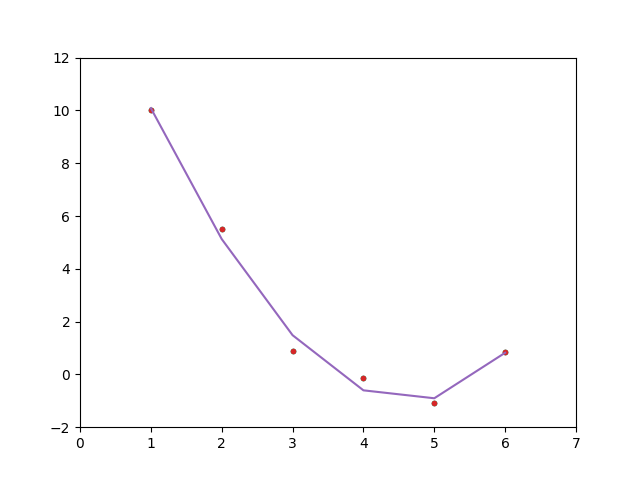
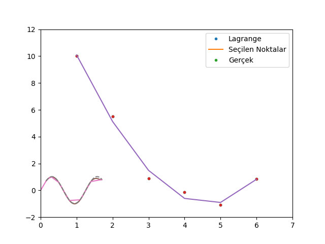
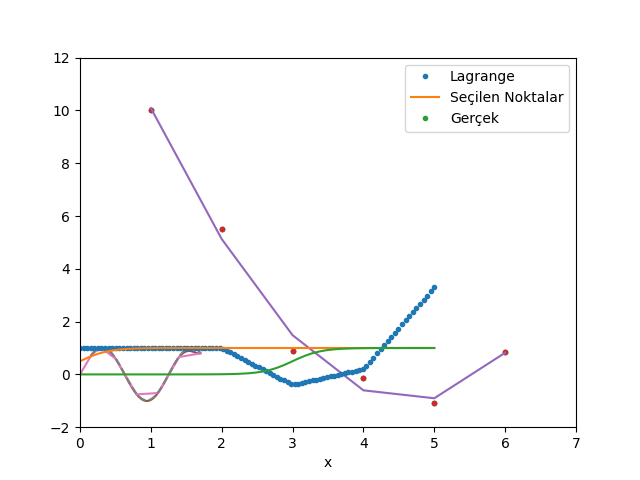
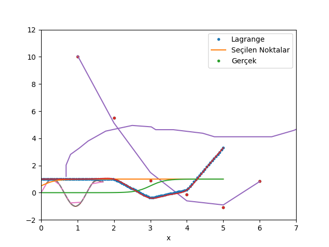
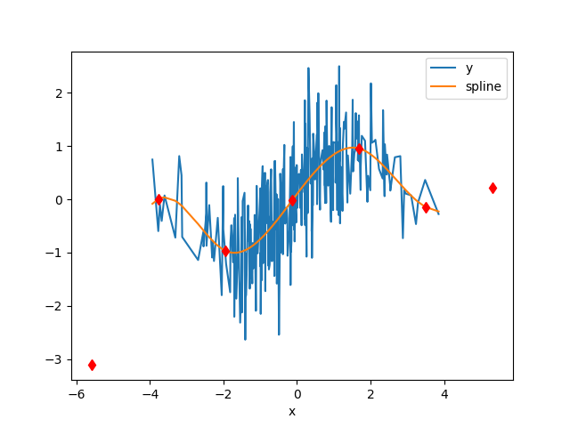
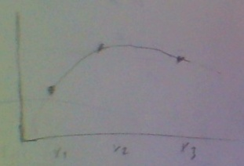
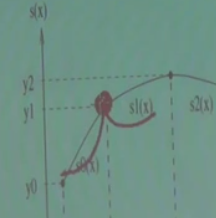
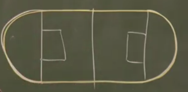
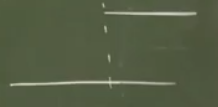

# Eğri Uydurma, Aradeğerleme (Interpolation)

Diyelim ki elimizde alttaki veri var.

```python
x = np.arange(1,7)
y = np.array([10, 5.49, 0.89, -0.14, -1.07, 0.84])
plt.plot(x,y,'.')
plt.ylim(-2,12)
plt.xlim(0,7)
plt.savefig('compscieng_1_21_01.png')
```


Bu veriye istediğimiz kadar bükümü olan bir eğri nasıl uydururuz?
"İstediğimiz kadar bükümü olan eğri'' polinom çağrısı yapabilir.. Mesela
bir polinom eğri,

$$ y = c_1 x^3 + c_2x^2 + c_3x + c_4 $$

olarak gösterilebilir. Mesela bazı gelişigüzel sabit değerler
$c_1=1,c_2-20,c_3=1,c_4=-4$ sabitlerinden alttaki görüntü çıkar,

```python
x2 = np.linspace(0,10,1000)
c_1 = 2.; c_2 = -20.; c_3 = 1.; c_4 = -4
y2 = c_1*x**3 + c_2*x**2 + c_3*x + c_4
plt.plot(x2,y2)
plt.savefig('compscieng_1_21_02.png')
```


Eğri iki kere bükülebiliyor çünkü formül küpsel. Karesel olsa sadece bir
kere bükülebilirdi. Peki karesel, ya da küpsel ya da daha üst derecedeki
polinomları veriye nasıl uydururuz? Acaba lineer regresyonu bir şekilde
kullanabilir miyiz? Ama lineer regresyon, adı üstünde, "lineer'', yani
doğrusal. Doğrusal olmayan bir şeyi nasıl uyduracağız? Şimdi lineer
regresyonun neyi uydurduğunu hatırlayalım,

$$ y = c_1 z_1 + c_2 z_2 + .. + c_nz_n $$

Bu çok boyutlu, her biri birer vektör olan $z_1,..,z_n$ ile tek vektör $y$
ilişkisini girdi olarak alıyor (üstteki formülü ya vektörsel işlem olarak
ya da $y,z_i$ öğelerinin teker teker formüle geçildiği şekilde
görebiliriz). 

Acaba şöyle bir numara yapamaz mıyız? Eğer elimizdeki tek boyutlu veriyi
alıp, onun tamamının bir kere karesini, bir kere küpünü, vs. ayrı ayrı alıp
her sonucu sanki ayrı bir boyutlarmış gibi lineer regresyona verirsek,
otomatik olarak eğri uydurmuş olmaz mıyız ?! Yani üstteki örnek için
$z_1=x^3,z_2=x^2,z_3=x,z_4=1$ olacak, matris formunda,

$$ A = 
\left[\begin{array}{rrrr}
x_1^3 & x_1^2 & x_1 & 1 \\
x_2^3 & x_2^2 & x_2 & 1 \\
\vdots & \vdots & \vdots & \vdots \\
x_m^3 & x_m^2 & x_m & 1 
\end{array}\right]
 $$

ki $x_i$, $x$ vektörünün tek bir öğesini temsil ediyor. Gerisi bildiğimiz En
Az Kareler yöntemi ile $Ax=b$'yi, ya da üstteki notasyona göre $Ac=y$
çözmek, $(A^TA)^{-1}A^Tc$ ile (tabii QR kullanmak daha iyi ama bu basit
örnek için önemli değil). Baştaki örneği çözelim mesela

```python
import scipy.linalg as lin
A = np.array([x**3, x**2, x, np.ones(len(x))]).T
res = np.dot(np.dot(lin.pinv(np.dot(A.T,A)),A.T),y)
print A, '\n\n', res
```

```
[[   1.    1.    1.    1.]
 [   8.    4.    2.    1.]
 [  27.    9.    3.    1.]
 [  64.   16.    4.    1.]
 [ 125.   25.    5.    1.]
 [ 216.   36.    6.    1.]] 

[  0.03925926   0.42313492  -6.5032672   16.12666667]
```

Kütüphane çağrısı `polyfit` kullanırsak,

```python
print np.polyfit(x,y,3)
```

```
[  0.03925926   0.42313492  -6.5032672   16.12666667]
```

Tıpatıp aynı sonuç çıktı, çünkü büyük bir ihtimalle `polyfit` aynı
tekniği kullanıyor! 

```python
plt.plot(x,y,'.')
plt.ylim(-2,12)
plt.xlim(0,7)
yy = res[0]*x**3 + res[1]*x**2 + res[2]*x + res[3]
plt.plot(x,y,'.')
plt.hold(True)
plt.plot(x,yy)
plt.savefig('compscieng_1_21_03.png')
```



Uyum fena değil! Not: eğri kesikli çıktı çünkü çok az sayıda veri var. 

Lagrange Aradeğerlemesi (Lagrange Interpolation)

En eski ve en yaygın uygulaması olan aradeğerleme fonksiyonlarından biri JL
Lagrange tarafından yayınlanmış olandır. Pratik faydalarının yaninda bu tekniğin
önemli bazı teorik sonuçları var, bu sebeple yaklaşık ya da olmayan entegrasyon
ve türev alma teknikleri fonksiyonun Lagrange aradeğerlemesi ile temsilini baz
alıyor [1, sf. 268].

Lagrange tekniğinin önemli bir özelliği yaklaşık temsil edilecek fonksiyondan
seçilen değerler üzerinde, o noktalarda aynen verinin söylediği değerleri tekrar
üretebilmesi. Yani eğer $f(x)$'i bir $f_h(x)$ ile yaklaşık temsil etmişsek, ve
eğer $f(1) = 3$ ise, aradeğerleme sonrası $f_h(1) = 3$ olacaktır, ve bu
üzerinden aradeğerleme yapılmış tüm veri noktaları için doğru olacaktır. Ayrıca
bir diğer özellik üzerinden aradeğerleme yapılan $x$ değerlerinin gelişigüzel
seçilebilmesi, eşit aralıkta alınma gibi bir zorunluluk yok.

Şimdi diyelim ki elde modellenen $f(x)$ için elde $n$ tane $x_1,x_2,...,x_n$
değeri var, ki

$$
f(x_i) = y_i, \qquad i=1,2,..,n
$$

Çözmek istediğimiz problem mümkün olan az derecede olan bir polinom $P_m(x)$
yaratmak öyle ki bu polinom eldeki $(x_i,y_i)$ veri noktalarını temsil
edebilsin, yani

$$
P_m(x_i) = y_i, \qquad i=1,2,..,n
$$

Burada $m$ altsembolü dereceyi göstermek için kullanılıyor.

Daha önce söylediğimiz gibi veri noktalarında aradeğerleme ve veri aynı sonuçta
olmalı.

Bu amaçla $n$ tane ayrı ayrı polinom $p_i(x)$ yaratacağız, ve bu polinomlar öyle
tasarlanacak ki $x_i$ noktasında biri aktif olacak, diğerleri yokolacak.  Bu
bize bir delta fonksiyonunu hatırlatabilir, bu doğru, şu sonucu istiyoruz,

$$
p_i(x_j) = \delta_{ij} = \left(
\begin{array}{ll}
1 & \textrm{eğer } j = i  \\
0 & \textrm{eğer } j \ne i 
\end{array} \right.
$$


ki $\delta_{ij}$ Kronecker delta fonksiyonu. Eger $p_i(x)$'lerin $j \ne i$
olacak sekilde $x_j$ noktalarında yokolmasını istiyorsak, onu $(x-x_j)$
faktörlerinin bir çarpımı olarak yazabiliriz,

$$
p_i(x) = C_i \prod_{j \ne i} (x-x_j)
$$

Sabit $C_i$ normalize edici bir değer. Üstteki çarpımda $(x-x_i)$ yok,
onu dışarıda bırakarak $p_i$ elde ettik. Bir faktör hep dışarıda olacağı
için $p_i(x)$ polinomunun derecesi hep $(n-1)$ olacaktır. Normalizasyon
sabiti $C_i$ hesaplamak için $p_i(x_i)=1$ olduğunu hatırlayalım ve
bu değeri elde etmek için $C_i = 1 / \prod_{j \ne i} (x_i - x_j)$
sabiti gerekecektir, o zaman

$$
p_i(x) = \frac
{\prod_{j \ne i} (x - x_j)}
{\prod_{j \ne i} (x_i - x_j)},
\quad i=1,2,..,n
$$

Her $p_i(x)$ polinomu $x_i$ haricinde diğer her noktada yokolacağı için $P_m$
polinomu $p_i(x)$'lerin bir lineer kombinasyonu, toplamı olarak temsil
edilebilir,

$$
P_m(x) =  \sum_{i=1}^{n} p_i (x) y_i
$$

Bir $x_j$ için hesap ne diyor?

$$
P_m(x_j) = \sum_{i=1}^{n} p_i(x_j) y_i =  \sum_{i=1}^{n} \delta_{ij} y_i = y_j
$$

Doğru gözüküyor. Genel formda şunu yazabiliriz,

$$
P_m (x) = \sum_{i=1}^{n}
\frac{\prod_{j \ne i} (x - x_j)}{\prod_{j \ne i} (x_i - x_j)}
$$

Eğer $n=2$ olsaydı, eldeki iki tane $(x_1,y_1)$ ve $(x_2,y_2)$ için

$$
P_1(x) =
\frac{(x-x_2)}{(x_1-x_2)} y_1 +
\frac{(x-x_1)}{(x_2-x_1)} y_2 
$$

Bu tabii ki iki noktadan geçen düz bir çizgiyi temsil ediyor.

Eğer $n=3$ olsaydı, üç noktadan geçen bir parabol elde edilirdi,

$$
P_2(x) =
\frac{(x-x_2)(x-x_3)}{(x_1-x_2)(x_1-x_3)} y_1 +
\frac{(x-x_1)(x-x_3)}{(x_2-x_1)(x_2-x_3)} y_2 +
\frac{(x-x_1)(x-x_2)}{(x_3-x_1)(x_3-x_2)} y_3
$$

Altta örnek olarak $\sin(5x)$'ten alınmış 8 veri noktası ile
aradeğerleme yapan bir örnek görüyoruz,

```python
def Lagrange(x, y, n, xi):
   yi = 0e0
   for i in range(1,n+1):
      p = 1e0
      for j in range(1,n+1):
          if (j != i): p *= (xi - x[j])/(x[i] - x[j])
      yi += p * y[i]

   return yi

n  = 8  
ni = 100

x = [0]*(n+1)                                                   
y = [0]*(n+1)

# f(x) = sin(5*x), x degerleri gelisiguzel secilmis 
x[1] = 0.15; x[2] = 0.2; x[3] = 0.3; x[4] = 0.5;
x[5] = 0.8 ; x[6] = 1.1; x[7] = 1.4; x[8] = 1.7
for i in range(1,n+1): y[i] = np.sin(5*x[i])

xx = []; yy = []; real = []
# x[1] ile x[8] arasinda esit aralikli x'ler yarat
# daha fazla nokta olsun
xis = np.linspace(x[1],x[-1],ni)
for i in range(1,ni+1):
   xi = xis[i-1]
   yi = Lagrange(x,y,n,xi)
   xx.append(xi)
   yy.append(yi)
   real.append(np.sin(5*xi)+0.02)

xx = np.array(xx)
yy = np.array(yy)
real = np.array(real)

plt.plot(xx,yy)
plt.plot(x,y)
plt.plot(xx,real,'--')
plt.legend(['Lagrange',u'Seçilen Noktalar','Gerçek'])

plt.savefig('compscieng_app20cfit1_01.png')
```



İlmikler (Knots)

[4], [5], yazılarındaki konuları genişletelim. Bu yazılardan biliyoruz ki basit
regresyon

$$ y_i = \beta_0 + \beta_1 x_i + \epsilon_i$$

denklemini temel alıyor, onu veriye uyduruyor. Bu uydurma için
kullandığımız $A,x,b$ matrisleri, vektörleri var. Sihirli formülü
biliyoruz, 

$$ \hat{y} = X(X^TX)^{-1}X^Ty $$

Şimdi bu formüldeki $X$ içindeki değerleri farklı "bazlar'' olarak görmek
faydalı olacaktır. Tek değişkenli durumda mesela bu baz

$$ X = 
\left[\begin{array}{cc}
1 & x_1 \\ \vdots & \vdots \\ 1 & x_n
\end{array}\right]
$$

Eğer karesel bir formülü uyduruyorsak, yani

$$ y_i = \beta_0 + \beta_1x_i + \beta_2x_i^2 + \epsilon_i $$

baz 

$$ X = 
\left[\begin{array}{ccc}
1 & x_1 & x_1^2\\ 
\vdots & \vdots & \vdots \\
1 & x_n & x_n^2
\end{array}\right]
$$

olur. Bu bakış açısını yorumlamak zor değil, regresyonun temeli
değişkenlerin katsayılarını bulmaktır, o zaman $1,x,x^2$ değişkenleri için
de, ya da herhangi bir başka baz bulmak için aynı teknik kullanılabilir
çünkü karesel, küpsel bazlar kullanıyor olsak bile bu değerleri önceden
hesaplayıp matrise koyduğumuz için kullandığımız sihirli formül hala lineer
bir problemi çözüyor. Hala değişkenler var, onlar bazı katsayılar ile
çarpılıp toplanarak veriye uydurulacak, ve sihirli formül bu en optimal
katsayıları bulacak.

Baz fikri ile devam edelim, alttaki veriye bakalım (gösterilen çizgilerin
daha bulunmamış olduğunu varsayalım),


Bu bir kırılmış değnek (broken stick) modeli, $x=0.6$ öncesinde belli bir
eğimi olan bir düz çizgi var, sonrasında başka bir eğrisi olan bir düz
çizgi var. Kırılma noktasını biliyoruz, ya da regresyonun hangi noktadan
geçmesini istediğimizi, ilmik noktasını (knot) biliyoruz, bu durumda baz
nedir? 

$$
(x-0.6)_{+}
$$ 

fonksiyonudur. Tanımdaki altsimge + şunu ifade eder: herhangi bir sayı $u$
eğer pozitif ise $u_{+} = u$'dur, eğer değil ise $u_{+} = 0$ değerine
sahiptir. Bunun amaçlarımız için mükemmel bir baz fonksiyonu olacağını
görebiliyoruz, 

$$y_i = \beta_0 + \beta_1x_i + \beta_{11}(x_i-0.6)_{+} + \epsilon_i $$

Bu fonksiyonun $0.6$'ya kadar belli bir eğimi olacak, fakat $0.6$ ardından
bu eğime bir "ek'' yapılmaya başlanacak, $\beta_{11}$ bu ekin ne kadar
olacağını yakalayacak. 

O zaman sihirli formüle verilecek matris

$$ 
X = 
\left[\begin{array}{ccc}
1 & x_1 & (x_1 - 0.6)_{+} \\ 
\vdots & \vdots & \vdots \\
1 & x_n & (x_n - 0.6)_{+}
\end{array}\right]
$$

Regresyon çözümü bize her baz için gerekli katsayıyı (kesiyi, eğimi)
verecektir. 

Daha abartarak (!) bir sürü ilmik üzerinden bir sürü baz tanımlayabilirdik,
o zaman ufak ufak pek çok düz çizgiyi veriye uydurmak mümkün olurdu, mesela

$$ X = 
\left[\begin{array}{cccccc}
1 & x_1 & (x_1 - 0.5)_{+} & (x_1 - 0.55)_{+} & \dots & (x_1 - 0.96)_{+}\\ 
\vdots & \vdots & \vdots & \ddots & \vdots \\
1 & x_1 & (x_1 - 0.5)_{+} & (x_1 - 0.55)_{+} & \dots & (x_1 - 0.96)_{+}
\end{array}\right]
$$


(Resimde ilmikler 400,500,.. gibi değerlerde, yani bazlar $(x_1-500)_{+}$
şeklinde olurdu)

Bilinen tek ilmik üzerinden en basit örneği görelim,

```python
import statsmodels.formula.api as smf
import pandas as pd

df = pd.read_csv('../../tser/tser_chgpt/2inclines.csv')
reslin = smf.ols('y ~ 1 + x + I((x-55)*(x>55))', data=df).fit()
print reslin.summary()
```

```
                            OLS Regression Results                            
==============================================================================
Dep. Variable:                      y   R-squared:                       0.957
Model:                            OLS   Adj. R-squared:                  0.956
Method:                 Least Squares   F-statistic:                     1081.
Date:                Thu, 12 Jan 2017   Prob (F-statistic):           4.96e-67
Time:                        14:27:42   Log-Likelihood:                -243.44
No. Observations:                 100   AIC:                             492.9
Df Residuals:                      97   BIC:                             500.7
Df Model:                           2                                         
Covariance Type:            nonrobust                                         
==========================================================================================
                             coef    std err          t      P>|t|      [95.0% Conf. Int.]
------------------------------------------------------------------------------------------
Intercept                 15.7364      0.701     22.447      0.000        14.345    17.128
x                          0.2956      0.019     15.422      0.000         0.258     0.334
I((x - 55) * (x > 55))     0.3530      0.040      8.926      0.000         0.275     0.432
==============================================================================
Omnibus:                       15.710   Durbin-Watson:                   2.312
Prob(Omnibus):                  0.000   Jarque-Bera (JB):                4.411
Skew:                          -0.025   Prob(JB):                        0.110
Kurtosis:                       1.972   Cond. No.                         148.
==============================================================================

Warnings:
[1] Standard Errors assume that the covariance matrix of the errors is correctly specified.
```

```python
df.set_index('x').y.plot()
plt.savefig('compscieng_app20_07.png')
```


Bulunan katsayılar üstteki grafiğe uyuyor. 

İlmik Seçmek

[6, sf. 65] bu tekniği bir adım ilerletiyor; eğer ilmik seçmek isteseydik
ne yapardık? Bu durumda üstteki gibi pek çok mümkün bazı regresyona
verirdik, ama bu sefer regülarizasyon üzerinden eğer ise yaramayanları
cezalandırırsak, çok küçülen katsayılar bizim için önemsiz sayılacaktır ve
katsayısı yüksek olanlar elde tutulabilir. Regularizasyon icin {\em
  Istatistik, Regresyon, Ridge, Lasso, Çapraz Sağlama, Regularize Etmek}.

[6]'in cezalandırma formülasyonu bize bir Ridge regresyonu veriyor. Alttaki
veride denedik,

```python
import pandas as pd
df = pd.read_csv('../../tser/tser_chgpt/cave.csv')
df.C.plot()
plt.savefig('compscieng_app20_06.png')
```


```python
import statsmodels.formula.api as sm
f = "C ~ 1 + Temp + I((Temp > 10)*(Temp-10)) + I((Temp > 15)*(Temp-15)) +" + \
    "I((Temp > 20)*(Temp-20)) + I((Temp > 25)*(Temp-25)) +" + \
    "I((Temp > 30)*(Temp-30)) + I((Temp > 35)*(Temp-35)) +" + \
    "I((Temp > 40)*(Temp-40)) + I((Temp > 45)*(Temp-45)) +" + \
    "I((Temp > 50)*(Temp-50)) + I((Temp > 55)*(Temp-55)) " 
model = sm.ols(formula=f, data=df).fit_regularized(L1_wt=0.0)
print model.summary()
```

```
                            OLS Regression Results                            
==============================================================================
Dep. Variable:                      C   R-squared:                       0.962
Model:                            OLS   Adj. R-squared:                  0.956
Method:                 Least Squares   F-statistic:                     177.4
Date:                Thu, 12 Jan 2017   Prob (F-statistic):           2.03e-50
Time:                        13:13:45   Log-Likelihood:                -185.82
No. Observations:                  90   AIC:                             395.6
Df Residuals:                      78   BIC:                             425.6
Df Model:                          11                                         
Covariance Type:            nonrobust                                         
================================================================================================
                                   coef    std err          t      P>|t|      [95.0% Conf. Int.]
------------------------------------------------------------------------------------------------
Intercept                       31.8192      1.354     23.494      0.000        29.123    34.515
Temp                             0.3800      0.204      1.863      0.066        -0.026     0.786
I((Temp > 10) * (Temp - 10))    -0.0764      0.497     -0.154      0.878        -1.065     0.912
I((Temp > 15) * (Temp - 15))    -0.0524      0.651     -0.081      0.936        -1.348     1.243
I((Temp > 20) * (Temp - 20))    -0.0027      0.673     -0.004      0.997        -1.342     1.337
I((Temp > 25) * (Temp - 25))    -0.1210      0.674     -0.179      0.858        -1.463     1.221
I((Temp > 30) * (Temp - 30))    -0.3380      0.674     -0.501      0.618        -1.681     1.005
I((Temp > 35) * (Temp - 35))    -0.0869      0.674     -0.129      0.898        -1.429     1.256
I((Temp > 40) * (Temp - 40))     0.1147      0.674      0.170      0.865        -1.227     1.457
I((Temp > 45) * (Temp - 45))     0.0320      0.670      0.048      0.962        -1.302     1.366
I((Temp > 50) * (Temp - 50))    -0.0149      0.598     -0.025      0.980        -1.205     1.176
I((Temp > 55) * (Temp - 55))    -0.6336      0.295     -2.144      0.035        -1.222    -0.045
==============================================================================
Omnibus:                        7.572   Durbin-Watson:                   1.924
Prob(Omnibus):                  0.023   Jarque-Bera (JB):                7.180
Skew:                          -0.575   Prob(JB):                       0.0276
Kurtosis:                       3.770   Cond. No.                         691.
==============================================================================

Warnings:
[1] Standard Errors assume that the covariance matrix of the errors is correctly specified.
```

İstatistiki modelleri irdelemek bilimden ziyada biraz sanattır, fakat
üstteki sonuçlarda (Temp-30) katsayısının mutlak değerinin orta bölgedeki
diğerlerine göre daha yüksek olduğunu görüyoruz. Grafiğe bakılınca bu
mantıklı gözüküyor.


Alternatif İlmik İfadeleri

Bazen sayısal hesaplarda üstte gördüğümüz $u_{+}$ ifadesinin $\max(0,x-a)$
ile formülize edildiğini görüyoruz. Yani, 

$$
y = \beta_0 + \beta_1 x + \beta_{2}(x-a)_{+} +  \beta_{3}(x-b)_{+} + ...
$$

yerine

$$
y = \beta_0 + \beta_1 x + \beta_{2}\max(0,x-a) +  \beta_{3}\max(0,x-b) + ...
$$

ki $a,b$ ilmik noktaları. Bu kullanım da aynı sonuç veriyor, düşünürsek
$\max$ ifadesi $x$ değeri $a$ değerini geçinceye kadar 0, ondan sonra $x-a$
verecek, bu da $u_{+}$ gibi bir kullanım ile aynı.

Mesela

```python
a,b,c,d = (1, -1.4, 2, 2.5)
x = np.linspace(0,5,100)
knots = [2,3,4]
def f(x):
    return a + \
           b*np.max([0,x-knots[0]]) + \
           c*np.max([0,x-knots[1]]) + \
           d*np.max([0,x-knots[2]])
	   
    
y = np.array([f(xx) for xx in x])
plt.plot(x,y,'.')
plt.savefig('compscieng_app20_10.png')
```


Rasgele bazı ağırlıklarla $x=2,3,4$ noktalarında aktif olan ilmiklerle
üstteki grafiği çıkarttık. Regresyon bağlamında bir optimizasyon rutinine
(illa lineer regresyon olması gerekmez) veriye bakarak bir hatanın minimize
edilmesi üzerinden en optimal $a,b,c,d$ ağırlıklarını buldurmak ta
mümkündür. 

Peki $\max$ yerine baska bir fonksiyon kullanabilir miydik? $\max$'in
sonucta yaptigi belli bir esik degerinden once 0 sonrasinda baska bir deger
vermek degil midir? Evet. Bu tur bir "karar'' fonksiyonu sigmoid ile de
elde edilebilir. 

```python
alpha = 5.0
def sig(x,a):
   return 1/(1+np.exp(-alpha*(x-a)))
x = np.linspace(-5,5,100)
```

```python
y = sig(x,0)
plt.plot(x,y)
plt.savefig('compscieng_app20_11.png')
```

```python
y = sig(x,3)
plt.plot(x,y)
plt.savefig('compscieng_app20_12.png')
```




Normal sigmoid üst soldaki, fakat $x-a$ ile onu da istediğimiz noktaya
kaydırabiliyoruz. $\alpha$ parametresi 0'dan 1'e geçişin ne kadar sert
olduğunu kontrol ediyor.

```python
rho = 7.0
def sig2(x,a):
   return (x-a)*1/(1+np.exp(-rho*(x-a)))

a,b,c,d = (1, -1.4, 2, 2.5)
x = np.linspace(0,5,100)
knots = [2,3,4]
def f(x):
    return a + \
           b*sig2(x,knots[0]) + \
           c*sig2(x,knots[1]) + \
           d*sig2(x,knots[2])
	       
y = np.array([f(xx) for xx in x])
plt.plot(x,y)
plt.savefig('compscieng_app20_13.png')
```


Daha yumuşak, pürüzsüz bir fonksiyon elde etmiş olduk. Bu birleşik eğrinin
türevini almak ta daha kolay olacaktır. Gerçi otomatik türev paketleri
artık içinde $\max$ bile olan ifadelerin türevini alabiliyor, fakat
üsttekinin sembolik türevi rahatça alınabilir, bu seçeneğin elde olması iyidir.

Küpsel Spline Eğrileri (Cubic Splines)

Baz seçerken elimizde pek çok seçenek var, mesela küpsel spline eğrileri
uydurmak için

$$ (1,x,x^2,x^3,(x-k_1)_{+}^3,(x-k_2)_{+}^3,(x-k_3)_{+}^3,.. )$$

gibi bir baz kullanabiliriz, ilmikler $k_1,..,k_K$ olarak gider, genel
olarak

$$ f(x) = \beta_0 + \beta_1x + \beta_2 x^2 + \beta_3 x^3 + 
\sum_{s=1}^{K} \beta_{3+s} (x-k_s)^3_{+}
$$

formülü verilir. Bu baza kırpılmış güç bazı (truncated power basis) ismi de
veriliyor. 

Bir örnek üzerinde görelim,

```python
import pandas as pd
dfcube = pd.read_csv('cube.csv')
df2 = dfcube.set_index('x')
df2.y.plot()
plt.savefig('compscieng_app20_09.png')
```



İlmik noktalarını seçelim, 8 ve 13 noktasında olsun,

```python
import pandas as pd
import statsmodels.api as sm

dfcube = pd.read_csv('cube.csv')
dfcube.loc[:,'1'] = 1.
dfcube.loc[:,'x2'] = dfcube.x**2
dfcube.loc[:,'x3'] = dfcube.x**3
k1 = dfcube.x-8; dfcube.loc[k1>0,'k1'] = k1**3
k2 = dfcube.x-13; dfcube.loc[k2>0,'k2'] = k2**3
dfcube = dfcube.fillna(0)
X = dfcube[['1','x','x2','x3','k1','k2']]
y = dfcube.y
f = sm.OLS(y,X).fit()
print f.params
```

```
1     1.586781
x     1.747705
x2   -0.381304
x3    0.030443
k1   -0.092883
k2    0.138559
dtype: float64
```

```python
dfcube['yy'] = f.params[0]*dfcube['1'] + f.params[1]*dfcube.x + \
               f.params[2]*dfcube.x2 + f.params[3]*dfcube.x3 + \
               f.params[4]*dfcube.k1 + f.params[5]*dfcube.k2 
dfcube['y'] = y
df2 = dfcube.set_index('x')
df2[['y','yy']].plot()
plt.hold(True)
plt.axvline(x=8,color='c')
plt.hold(True)
plt.axvline(x=13,color='c')
plt.savefig('compscieng_app20_08.png')
```


Kısıtlanmış Küpsel Spline Eğrileri (Restricted Cubic Splines)

Üstteki metot iyi işliyor, fakat bazen başta ve sondaki parçaların eğri
değil tam düz olması istenebiliyor, yani "eteklerde'' düzleştirme
amaçlanıyor. Bu özel formülasyon için bkz. [3, sf. 24]. Bu yaklaşımı baz
alan kod [1]'in Python çevrimini altta veriyoruz. Metota verilen isim
kısıtlanmış küpsel spline eğrileri, ya da doğal spline eğrileri (natural
splines). 

```python
import scipy.linalg as lin

def rcs(x,y,knots):
    n = len(y)
    k = knots
    X1 = x
    q = len(k)-1
    myX=np.zeros((n,len(knots)-2))

    for j in range(q-1):
    	tmp1 = (x-k[j])**3 * (x>k[j])
	tmp2 = (x-k[q-1])**3 * (x>k[q-1])*(k[q]-k[j])
	XX= tmp1-tmp2/(k[q]-k[q-1])
        tmp1 = (x-k[q])**3 * (x>k[q])
        tmp2 = (k[q-1]-k[j])
	XX = XX+tmp1*tmp2/(k[q]-k[q-1])
	myX[:,j]=XX

    X = np.hstack( (np.ones((n,1)),np.reshape(X1,(n,1)),myX) )
    bhat = np.linalg.lstsq(X,y)[0]
    bhatt = np.zeros(len(knots)+1)
    bhatt[len(bhat)] = (bhat[2:]*(k[0:-2]-k[-1])).sum()
    bhatt[len(bhat)] = bhatt[len(bhat)] / (k[-1]-k[-2])
    bhatt = np.hstack([bhatt, 0])    
    bhatt[-1] = (bhat[2:]*(k[0:-2]-k[-2])).sum()
    bhatt[-1] = bhatt[-1] / (k[-2]-k[-1])
    bhat = np.hstack((bhat, bhatt[-2:]))
    return bhat

def speval(x,coefs,knots):
    tmp = coefs[0] + coefs[1]*x 
    for k in range(len(knots)): 
         tmp = tmp + coefs[k+2]*((x-knots[k])**3)*(x>knots[k])
    return tmp
```


```python
import pandas as pd
x = np.random.randn(300)*np.sqrt(2)
e = np.random.randn(300)*np.sqrt(0.5)
y = np.sin(x)+e
df = pd.DataFrame([x,y]).T
df.columns = ['x','y']
df = df.sort_index(by='x')
print df.head()
knots=np.array([-5.5938, -3.7732, -1.9526, -0.1320, 1.6886, 3.5092, 5.3298]);
bhat = rcs(df.x,df.y,knots)
print bhat
df['spline'] = speval(df.x, bhat, knots)
df2 = df.set_index('x')
df2[['y','spline']].plot()
plt.hold(True)
for k in knots: plt.plot(k,speval(k,bhat,knots),'rd')
plt.savefig('compscieng_app20_01.png')
```

```
            x         y
156 -4.037867  0.786392
214 -3.442141  0.716684
101 -3.331777  0.400504
249 -3.178510 -1.019875
235 -3.131058  0.309575
[ 2.60209869  0.37061018 -0.09614395  0.3059325  -0.30256291 -0.05312331
  0.33303297 -0.24924314  0.06210785]
```



```python
import pandas as pd
dfcube = pd.read_csv('cube.csv')
dfcube = dfcube.sort_index(by='x')
knots=np.array([3,5,8,14,14.5]);
bhat = rcs(dfcube.x,dfcube.y,knots)
print bhat
dfcube['spline'] = speval(dfcube.x, bhat, knots)
df2 = dfcube.set_index('x')
df2[['y','spline']].plot()
plt.hold(True)
for k in knots: plt.plot(k,speval(k,bhat,knots),'rd')
plt.savefig('compscieng_app20_03.png')
```

```
[ 3.16368016  0.17418578  0.02336622 -0.01432746 -0.05277535  0.42087813
 -0.37714154]
```


Spline Eğrileri

Diyelim ki elimizde 4 $x_i,y_i$ noktası var, ve bu noktalardan geçen,
hepsinden *kesinlikle* geçen, yaklaşıksal bir eğri oluşturmak
istiyoruz. Spline yöntemi her iki nokta arasını farklı bir küpsel (üçüncü
derece) polinom ile temsil etmektir. Tekrar dikkat: tüm noktaları temsile
edebilecek farklı polinomları toplamıyoruz, her aralıkta başka bir polinom
fonksiyonu parçasını devreye sokuyoruz. Parçalar niye küpsel olarak
seçildi? Çünkü küpsel bir eğri yeterince kavis sağlayabilir ve aynı zamanda
çok fazla inişli çıkışlı, sivri değildir, yeterince pürüzsüz bir eğrinin
ortaya çıkmasını sağlar.


Her $i=0,..,n+1$ için 

$$ p(x) = p_i(x) = a_i + b_i(x-x_i) + c_i(x-x_i)^2 + d_i(x-x_i)^3
\qquad (1)
$$

kullanalım. Noktalar $x_i$ olarak gösteriliyor, ve her noktada aktif olan
bir $p_i$ spline olacak, o noktadan bir sonrakine kadar eğriyi bu $p_i$
tanımlayacak. Noktaların sayısını $n$ yerine $n+1$ olarak aldık böylece $n$
eğri parçası ile çalışmamız mümkün olacak. Her spline bir küpsel polinom ise
niye bu küpsel polinomu en basit şekliyle

$$ p(x) = a_i + b_ix + c_ix^2 + d_ix^3 $$

olarak tanımlamadık? Çünkü iki üstteki form ile çalışmak daha
rahat. Mesela, eğer $x$ için $x_i$ değrini verirsek, ki bu $x_1$ ya da
$x_2$ olabilirdi, o zaman parantez içinde $x_i - x_i$ sayesinde tüm 
terimler sıfır oluyor, geriye sadece $a_i$ kalıyor. 

Parçaların uçlarının birbirini tutması, ve tüm şeklin sürekli, akışkan bir
şekilde gözükmesi için ise birkaç koşulu bizim tanımlamamız, ve zorlamamız
gerekli. Önce en basit olanı: bir önceki parça ile bir sonraki parça
orta nokta üzerinde aynı değere sahip olmalı. $i=1,..,n+1$ için

$$ p_i (x_{i+1}) = p_{i+1}(x_{i+1}) $$

Bir diğer basit gereklilik, her $x_i$'ye tekabül eden spline fonksiyonun
elimizdeki $y_i$ değerini vermesi,

$$ p_i(x_i) = y_i $$

"Tüm noktalardan kesinlikle geçmeli'' demiştik. Son parça bir istisna
oluşturuyor, bu son parçanın fonksiyonu hem son noktayı, hem de ondan bir
önceki nokta için kullanılmalı, bir önceden en sona kadar aynı fonksiyon
üzerindeyiz. 

$$ p_{n}(x_n) = y_{n+1} $$

Sistemi daha detaylı olarak görmek gerekirse, tüm denklemleri yazalım,

$$ p_1(x)  = a_1 + b_1(x-x_1) + c_1(x-x_1)^2 + d_1(x-x_1)^3$$

$$ p_2(x)  = a_2 + b_2(x-x_2) + c_2(x-x_2)^2 + d_1(x-x_2)^3$$

$$ \vdots $$

$$ p_n(x)  = a_n + b_n(x-x_n) + c_n(x-x_n)^2 + d_3(x-x_n)^3$$

Üç noktalı şöyle bir grafik düşünelim,



Üstte bahsettiğimiz gibi, $p_1(x_1) = a_1 = y_1$ olacak, ve tüm indisler
için bu geçerli. Ayrıca $x_2$ noktasında bir önceki parça ve sonraki parça
aynı değere sahip olmalı demiştik, yani mesela $p_1$'in sonunda (üstteki
ilk parça) $x_2$ noktası vardır, ve aynı noktada $p_2$ başlayacaktır, o
noktada $$ p_1(x_2) = a_1 + b_1h_1 + c_1h_1^2 + d_1h_1^3  $$

ve bu denklem $p_2(x_2) = a_2 = y_2$'ye eşit. Bir de, daha önce gördük, $a_1 =
y_1$ ise, o zaman 

$$ y_2 = p_1(x_2) = y_1 + b_1h_1 + c_1h_1^2 + d_1h_1^3 $$

haline gelir. Hepsini birarada yazıyoruz ($y$'yi sağ tarafa aldık)

$$ y_1 + b_1h_1 + c_1h_1^2 + d_1h_1^3 = y_2 
\qquad (2) 
$$

$$ y_2 + b_2h_2 + c_2h_2^2 + d_2h_2^3 = y_3 $$

$$ \vdots $$

$$ y_n + b_nh_n + c_nh_n^2 + d_nh_n^3 = y_n $$

ki $h_1 \equiv x_2 - x_1$, $h_2 \equiv x_3 - x_2$ olarak tanımladık,
$\equiv$ işareti "tanımlamak (defined as)'' anlamına geliyor, $h$
harfi bir tür kısaltma olarak kullanıldı. Fakat kesintisizlik için
parçaların uçlarının bitişmesi yeterli değil. Mesela alttaki figürün de
uçları birleşiktir,


Demek ki ek bazı şartlar lazım. Bu ek şart "süreklilik'' olabilir. Mesela
alttaki örnek sürekli değildir.


Ya da daha iyisi, fonksiyonun her noktada "türevi alınabilir'' olma
şartı. Mesela altta koyu yuvarlaklı gösterilen noktada fonksiyonun türevi
alınamaz.



O zaman şartı koyalım -- Fonksiyonun her noktasında, ikinci türev sürekli
alınabilmeli. Bu çok ağır / net bir şart aslında, ve hakikaten çok pürüzsüz
(smooth) fonksiyonların oluşmasına sebep oluyor. Şimdi bunun ne anlamına
biraz daha yakından bakalım. Biliyoruz ki futbol sahalarının etrafında koşu
alanı vardır. Bu alan şöyledir.



Bu şekil iki ayrı figürün birleşimidir aslında, düz çizgiler ve iki tane
yarı çember. Üstteki düz çizgili kısım sonsuz kere türevi alınabilir bir
fonksiyondur. Değil mi? Düz çizgi sabit bir sayıdır, 1. türev sıfır, ikinci
türev yine sıfır, böyle gider. Peki yarı çember olan kısımlar? Aynı
şekilde. Peki her noktada durum böyle midir? Kritik noktalar ufak
yuvarlaklarla gösterilen yerler (altta)


Bu noktalarda kaç kere "sürekli türevler'' alınabilir? Cevap, sadece bir
kere. Çünkü iki kere türev alınınca ne olacağına bakalım, düz kısımda
ikinci, üçüncü, vs. türev sıfır. Peki yarı çember? Onun ikinci türevi sıfır
olmayan sabit bir sayı. O zaman fonksiyonun tamamının (düz çizgi ve yarı
çemberin beraber) 2. türevini grafiklesek, şöyle bir şekil ortaya çıkardı,



ve bu grafikte görüyoruz ki bir zıplama var. Bu zıplama yüzünden süreklilik
(2. türevde) bozulmuş oldu. O zaman spline düzgün, pürüzsüz olsun istiyorsak, her noktada, yani
bağlantı noktalarında, sağdaki ve soldaki parçanın birinci ve ikinci
türevinin aynı olması şartını koyabiliriz, o zaman bu noktalarda
fonksiyonun tamamı iki kere sürekli türevi alınabilir hale
gelir. Parçaların kendisi üzerinde bu şartı tanımlamaya gerek yok, çünkü
orada polinom kullanacağımızı belirttik zaten, polinomlar sonsuz kere
sürekli türevi alınabilen objelerdir. 

Denklem sistemimize iki tane daha şart gerekiyor. Bu şartlar fonksiyonun
ilk noktada ve son noktada ikinci türevinin sıfır olması şartı
olabilir. Her hangi yöndeki bir çizgi $y = ax + b$'nin iki kere türevi
alınınca sıfır gelir, yani bu şart fonksiyonumuzun son noktalarda,
fonksiyonun "aşağı yukarı aynı yönde'' olacak şekilde düz olarak devam
etmesi anlamına geliyor. Yaklaşıksal bağlamda fena bir şart değil. 

O zaman ana formüllerimize dönelim, ve mesela $p_1(x),p_2(x)$'in türevini
alalım,

$$ p_1'(x) = b_1 + 2c_1h_1 + 3d_1h_1^2 $$

$$ p_2'(x) = b_2 + 2c_2h_2 + 3d_2h_2^2 $$

$$ \vdots $$

Türevleri eşitleyelim $p_1'(x_2) = p_2'(x_2)$. 

$$ p_1'(x_2) = b_1 + 2c_1h_1 + 3d_1h_1^2 $$

$$  p_2'(x_2) = b_2 $$

Üstteki niye sadece $b_2$ oldu? Çünkü $x_i-x_i$ numarası onun için de
geçerli, geriye sadece $b_2$ kaldı. Hepsi bir arada

$$  b_1 + 2c_1h_1 + 3d_1h_1^2  = b_2 
\qquad (3)$$

$$  b_2 + 2c_2h_2 + 3d_2h_2^2 = b_3 $$

$$ \vdots $$

$$  b_{n-1} + 2c_{n-1}h_{n-1} + 3d_{n-1}h_{n-1}^2 =  b_n $$

İkinci türevler için benzer bir durum var, bu sefer sol taraftan $b$'ler
yokoluyor, 

$$ 2c_1 + 6d_1h_1 = 2c_2 
\qquad (4) $$

$$ 2c_2 + 6d_2h_2 = 2c_3 $$

$$ \vdots $$

$$ 2c_{n-1} + 6d_{n-1}h_{n-1} = 2c_n $$

İlk ve son ikinci türevi sıfıra eşitlemeyi unutmayalım. Son türev

$$ 2c_n + 6d_nh_n = 2c_{n+1} = 0 $$

İlk türev

$$ p_1''(x_1) =  c_1 + 6d_1(x_1-x_1)  = c_1 = 0$$

$$ 6d_1(x_1-x_1) $$ sıfır olur

Denklem (4)'den başlayan bölümü tekrar düzenlersek, 

$$ d_1 = \frac{ c_2 - c_1}{3h_1} 
\qquad (5) $$

$$ d_2 = \frac{ c_3 - c_2}{3h_2} $$

$$ \vdots $$

$$ d_n = \frac{ c_{n+1} - c_n}{3h_n} $$

Üstteki denklemleri (2) ve (3)'e geri koyarsak,

$$ b_1 + \frac{ c_2 + 2c_1}{3}h_1 = s_1 
\qquad (7) $$

$$ b_2 + \frac{ c_3 + 2c_2}{3}h_1 = s_2 $$

$$ \vdots $$

$$ b_n + \frac{ c_{n+1} + 2c_n}{3}h_n = s_n $$

ki $s_1 \equiv \frac{y_2 - y_1}{h_1}, s_2 \equiv \frac{y_3 - y_2}{h_2}$. 

(3) ifadesini alıp tekrar düzenlersek, 

$$  2c_1h_1 + 3d_1h_1^2  = b_2 - b_1$$

$3d_1h_1$ için başka bir ifade kullanabiliriz, eğer (5)'i tekrar
düzenlersek,

$$ 3h_1d_1 = c_2 - c_1$$

ve iki üstteki formüle koyarsak

$$  2c_1h_1 + (c_2 - c_1)h_1  = b_2 - b_1$$

$$  2c_1h_1 + c_2h_1 - c_1h_1  = b_2 - b_1$$

$$  c_1h_1 + c_2h_1  = b_2 - b_1$$

$$  (c_1 + c_2) h_1  = b_2 - b_1$$

Bu ifade tüm $i$ noktaları için geçerli, hepsi bir arada

$$  (c_1 + c_2) h_1  = b_2 - b_1 
\qquad (6)$$

$$  (c_2 + c_3) h_2  = b_3 - b_2$$

$$ \vdots $$

$$  (c_{n-1} + c_n) h_{n-1}  = b_n - b_{n-1}$$

(7)'deki ardı ardına gelen denklemleri birbirinden çıkartıp sonucu 3 ile
çarparsak, 

$$ c_1h_1 + 2c_2(h_1 + h_2) + c_3h_2 = 3(s_2 - s_1) $$

$$ c_2h_2 + 2c_3(h_2 + h_3) + c_4h_3 = 3(s_3 - s_2) $$

$$ \vdots $$

$$ c_{n-1}h_{n-1} + 2c_n(h_{n-1} + h_{n}) + c_{n+1}h_n = 3(s_n - s_{n-1}) $$

Bu formüller birarada düşünülürse, bilinmeyenleri $c_2,c_3,..,c_n$ olan
normal (ordinary) $n-1$ tane lineer denklemdirler, ve bir matris çarpımı
olarak düşünülebilirler. 

$c_1h_1$ matris formunda yok çünkü $c_1=0$. 

$$ 
\left[\begin{array}{cccccc}
2(h_1+h_2) & h_2 & 0 & 0 & ... & 0 \\
h_2 & 2(h_2+h_3) & h_3 & 0 & .. & 0  \\
0 & h_3 & 2(h_3+h_4) & h_4 & .. & 0 \\
0 & 0 & h_4 & 2(h_4+h_5) & ... & 0 \\
\vdots & \vdots & \vdots & \vdots & \ddots & \vdots  \\
0 & 0 & .. & 0 & h_{n-1} & 2(h_{n-1}+h_n) 
\end{array}\right]
\left[\begin{array}{r}
c_2 \\ c_3 \\ \vdots \\ c_n
\end{array}\right]
 $$

Bu denklem sağ tarafta suna eşit 

$$ 
\left[\begin{array}{r}
3(s_2 - s_1) \\
3(s_3 - s_2) \\
3(s_4 - s_3) \\
\vdots \\
3(s_n - s_{n-1}) 
\end{array}\right]
 $$

 Bir üçgen köşegen (tridiagonal) matris iki tane ikili köşegen (bidiagonal)
 matrisin çarpımına eşittir. LU çarpanlarına ayırma işlemi de, bkz [11], bize
 bu matrisleri sağlayacaktır.

$$ Ax = b $$

şu hale gelir

$$ LUx = b $$

Şimdi eğer $Ux = y$ kabul edersek, yani yeni bir değişkeni dahil edersek,
$L$'i bulduktan sonra

$$ Ly = b $$

kabul edebiliriz, ve bu formülü de $y$ için çözmek çok kolaydır. Sonra
çözülen $y$'yi alıp geriye sokma (backsubstitution) ile $x$'i buluruz, yani 

$$ Ux = y $$ 

denklemini çözeriz. 

```python
import scipy.linalg as lin

a = np.array( [[3.,-3.,0,0],
               [-3.,8.,-2.,0],
               [0,1.,2.,4.],
               [0,0,-2.,6.]])

p,l,u = lin.lu(a)

Ly = np.array([[7.,8.,2.,-3.]])

y = lin.solve(l,Ly.T)

x = lin.solve(u,y)
print x
```

```
[[ 5.44047619]
 [ 3.10714286]
 [ 0.26785714]
 [-0.41071429]]
```

Spline yöntemine dönersek, elimizdeki veri ve kod şöyle olsun

```python
import scipy.linalg as lin

xx = np.array([4.,9.,12.,16.,22.])

yy = np.array([157.,41.,145.,92.,7.])

h = np.diff(xx)

dy = np.diff(yy)

s = dy / h

ds = np.diff(s)

s3 = 3 * ds

a = np.array([[ 2*(h[0]+h[1]), h[1], 0],
              [ h[1], 2*(h[1]+h[2]), h[2]],
              [ 0, h[2], 2*(h[2]+h[3])]])

p,l,u = lin.lu(a)

y = lin.solve(l,s3.T)

c = lin.solve(u,y)
print c
```

```
[ 13.45756677 -13.90702275   2.64390455]
```

$c$'ler bulunduktan sonra $h$'lerle beraber kullanılarak $d$'ler bulunur,
vs, ve tüm spline parçalarının katsayıları ortaya çıkartılır.

Kodlar

Bazı kodlar altta bulunabilir. İlk önce SciPy ile B-spline, ilmikleri biz
dışarıdan tanımladık, 

```python
from scipy.interpolate import splev, splrep
x = np.linspace(0, 10, 10)
y = np.sin(x)
tck = splrep(x, y, t=[4,8]) # ilmikler t icinde
x2 = np.linspace(0, 10, 200)
y2 = splev(x2, tck)
plt.plot(x, y, 'o', x2, y2)
plt.savefig('compscieng_1_21_05.png')
```


Alttaki kodlar tüm eğrinin verideki her noktayı ilmik olarak görmesi
gerektiğine göre yazılmıştır, yani her veri noktası aynı zamanda bir
ilmiktir.

```python
import numpy as np

def Splines(data):
    np1=len(data)
    n=np1-1
    X,Y = zip(*data)
    X = [float(x) for x in X]
    Y = [float(y) for y in Y]
    a = Y[:]
    b = [0.0]*(n)
    d = [0.0]*(n)
    h = [X[i+1]-X[i] for i in xrange(n)]
    alpha = [0.0]*n
    for i in xrange(1,n):
        alpha[i] = 3/h[i]*(a[i+1]-a[i]) - 3/h[i-1]*(a[i]-a[i-1])
    c = [0.0]*np1
    L = [0.0]*np1
    u = [0.0]*np1
    z = [0.0]*np1
    L[0] = 1.0; u[0] = z[0] = 0.0
    for i in xrange(1,n):
        L[i] = 2*(X[i+1]-X[i-1]) - h[i-1]*u[i-1]
        u[i] = h[i]/L[i]
        z[i] = (alpha[i]-h[i-1]*z[i-1])/L[i]
    L[n] = 1.0; z[n] = c[n] = 0.0
    for j in xrange(n-1, -1, -1):
        c[j] = z[j] - u[j]*c[j+1]
        b[j] = (a[j+1]-a[j])/h[j] - (h[j]*(c[j+1]+2*c[j]))/3
        d[j] = (c[j+1]-c[j])/(3*h[j])
    splines = []
    for i in xrange(n):
        splines.append((a[i],b[i],c[i],d[i],X[i]))
    return splines,X[n]

def splinesToPlot(splines,xn,res):
    n=len(splines)
    perSpline = int(res/n)
    if perSpline < 3: perSpline = 3
    X=[]
    Y=[]
    for i in xrange(n-1):
        S = splines[i]
        x0 = S[4]
        x1 = splines[i+1][4]
        x = np.linspace(x0,x1,perSpline)
        for xi in x:
            X.append(xi)
            h=(xi-S[4])
            Y.append(S[0]+S[1]*h + S[2]*h**2 + S[3]*h**3)
    S=splines[n-1]
    x=np.linspace(S[4],xn,perSpline)
    for xi in x:
        X.append(xi)
        h=(xi-S[4])
        Y.append(S[0]+S[1]*h + S[2]*h**2 + S[3]*h**3)
    
    return X,Y
```

```python
import Spline
x = lambda n: np.linspace(-1,1,n)
f = lambda x: np.cos(np.sin(np.pi*x))
n = 5
E=200
data = zip(x(n),f(x(n)))
splines,xn = Spline.Splines(data)
X,Y = Spline.splinesToPlot(splines,xn,E)
plt.plot(X,Y,'r--')
plt.plot(x(300),f(x(300)),'k')
plt.savefig('compscieng_1_21_04.png')
```


Bir diğer örnek

```python
import numpy as np
from LUdecomp3 import *

def curvatures(xData,yData):
    n = len(xData) - 1
    c = np.zeros(n)
    d = np.ones(n+1)
    e = np.zeros(n)
    k = np.zeros(n+1)
    c[0:n-1] = xData[0:n-1] - xData[1:n]
    d[1:n] = 2.0*(xData[0:n-1] - xData[2:n+1])
    e[1:n] = xData[1:n] - xData[2:n+1]
    k[1:n] =6.0*(yData[0:n-1] - yData[1:n]) \
             / (xData[0:n-1] - xData[1:n]) \
             -6.0*(yData[1:n] - yData[2:n+1]) \
             / (xData[1:n] - xData[2:n+1])
    LUdecomp3(c,d,e)
    LUsolve3(c,d,e,k)
    return k    

def evalSpline(xData,yData,k,x):
    def findSegment(xData,x):
        iLeft = 0
        iRight = len(xData)- 1
        while 1:
            if (iRight-iLeft) <= 1: return iLeft
            i =(iLeft + iRight)/2
            if x < xData[i]: iRight = i
            else: iLeft = i
            
    i = findSegment(xData,x)
    h = xData[i] - xData[i+1]
    y = ((x - xData[i+1])**3/h - (x - xData[i+1])*h)*k[i]/6.0 \
        - ((x - xData[i])**3/h - (x - xData[i])*h)*k[i+1]/6.0 \
        + (yData[i]*(x - xData[i+1]) - yData[i+1]*(x - xData[i]))/h
    return y

if __name__ == "__main__": 

    xData = np.array([1,2,3,4,5],float)
    yData = np.array([0,1,0,1,0],float)
    k = curvatures(xData,yData)
    x = 1.5    
    print("y =",evalSpline(xData,yData,k,x))
    
```

```python
import pandas as pd, cubicSpline
df = pd.read_csv('in.csv')
res = cubicSpline.curvatures(np.array(df.x), np.array(df.y))
print res
```

```
[ 0.         -2.27960615  0.5983445  -2.14369027 -0.5421918  -0.9485407
  4.83823742  1.40244849 -0.82589911 -1.3439826   2.52298704  0.        ]
```

Kaynaklar

[1] Beu, *Introduction to Numerical Programming A Practical Guide for Scientists and Engineers Using Python and C/C++*

[2] Ruppert, *Semiparametric Regression*

[3] Harrell, *Regression Modeling Strategies, 2nd Edition*

[4] Bayramlı, Lineer Cebir, *Ders 16*

[5] Bayramlı, İstatistik, *Lineer Regresyon*

[6] Bantis, *Restricted Cubic Spline*, [https://uk.mathworks.com/matlabcentral/fileexchange/41241-restricted-cubic-spline](https://uk.mathworks.com/matlabcentral/fileexchange/41241-restricted-cubic-spline)

[7] Vrbik, *MATH 2P20 NUMERICAL ANALYSIS I Lecture Notes*, [http://spartan.ac.brocku.ca/~jvrbik/MATH2P20/notes.pdf](http://spartan.ac.brocku.ca/~jvrbik/MATH2P20/notes.pdf)

[8] Ertel, *Advanced Mathematics for Engineers Lecture No. 14*, [http://www.youtube.com/watch?v=3rHBCglD1LQ](http://www.youtube.com/watch?v=3rHBCglD1LQ)

[9] Ertel, *Advanced Mathematics for Engineers Lecture No. 15*, [http://www.youtube.com/watch?v=nA0YpqraP9A](http://www.youtube.com/watch?v=nA0YpqraP9A)

[10] Recktenwald, *Numerical Methods with MATLAB Implementations and Applications*

[11] Bayramlı, Lineer Cebir, *Ders 4*


