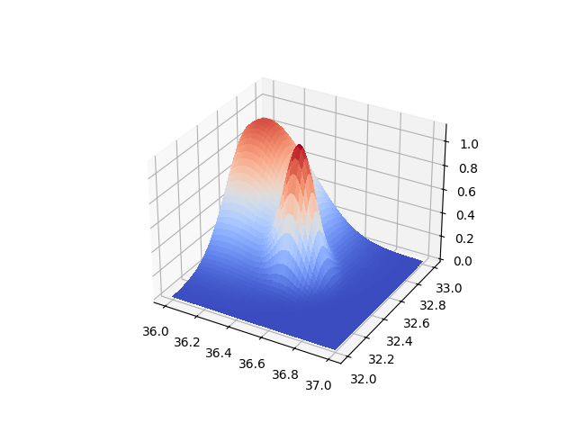
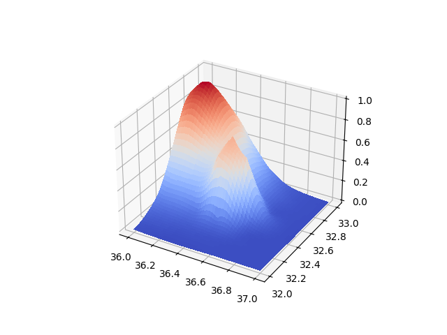
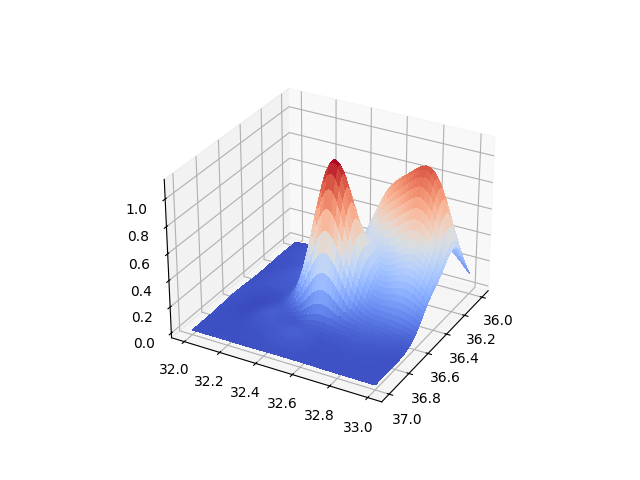
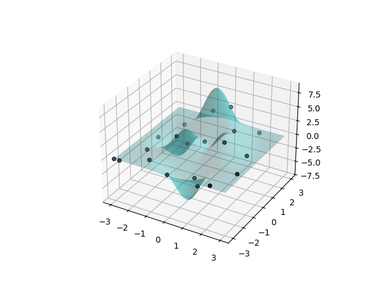

# Aradeğerleme (Interpolation) - Dairesel Baz Fonksiyonları (Radial Basis Functions -RBF-)

Ara değerlemek (interpolation), yani elde olan veriyi kullanıp olmayan hakkında
tahmin yapmaya uğraşmak için çok boyutlu ortamda RBF iyi işleyen bir
yaklaşım. Belki de zihinde en rahat canlandırılabilecek örnek yeryüzünde dağlara
ovalara tekabül eden yükseklik (elevation) verilerini alarak onlara sürekli tepe
fonksiyonları "uydurmak'' böylece dağların nerede olduğunu sürekli şekilde
saptamak. Temsil etmek istediğimiz (ama bilmediğimiz) fonksiyon $z=g(x,y)$
olarak gösterilebilecek bir fonksiyon, bir düzlemde herhangi bir $x,y$
noktasındaki yükseklik $z$. Bu fonksiyondan örneklenerek alınmış verilerle onu
yaklaşık olarak temsil etmek istiyoruz.

Düz verinin kendisini kullanmak bağlamında düşük çözünürlükte yükseklik verisi
ise yaramayabilir, mesela bir örneklem noktası dağın bir eteğinden diğeri öteki
yanındaki eteğinden alınmışsa bu dağ yok anlamına gelecektir. Peki o zaman niye
yükseklik verisinin geldiği yerden daha yüksek çözünürlüklü veri almıyoruz?  Bu
hem erişim hem de tutacağı yer bağlamında pahalı olabilir. 1 derecelik enlem /
boylam içinde, mesela 36-37 ve 32-33 arası diyelim, 100 metrelik çözünürlük
demek 0.001 derece değişimine tekabül eder, ve bu durumda 1 milyon veri noktası
alınması gerekecektir. Halbuki yükseklik verisinden yüzde 3 miktarında bile [2]
bir rasgele örneklem alırsak, bu noktalara RBF ile tepe fonksiyonları uydurarak
matematiksel, sürekli olan bir genel fonksiyon elde ederiz, ve uydurma iyi
işlerse artık istediğimiz çözünürlükte yükseklik verisi elde edebiliriz çünkü
elimizdeki sürekli fonksiyona istediğimiz her nokta için yükseliğin ne olduğunu
artık hesaplattırabiliriz.

Bu örneği 3 boyutta herhangi bir başka veri için de düşünmek mümkün; ama
yükseklik verisinde daha rahat, her örneklem noktasına konulan tepeler ve
onların birleşimi bize pürüzsüz, sürekli bir engebe şekli verir. RBF baz
fonksiyonları $\Phi(x) = f(||x-c||)$ şeklindedir, $f$ tepe, ya da farklı bir
fonksiyon olabilir, $||\cdot||$ norm fonksiyonudur, Öklitsel norm olabilir
mesela.

Burada $c$ üstüne baz fonksiyon konulan nokta, her örneklem veri noktası
yani. RBF eğitimi / uydurma metadolijisine göre herhangi bir veri noktası
dışındaki tüm diğer örneklem verileri o veri noktasının oluşumunu etkiler. Bu
anormal bir faraziye değil, bir dağın başında, ortasında, tepesinden alınmış
örneklemler varsa, mesela en alt ve en tepedeki veri ortadakini etkiler, yani o
bağlantıyı, ilişkiyi farzetmek normaldir. Orta nokta zirveyi tanımlayan
fonksiyona belli bir ağırlıkla bağlı, en alttakine başka bir şekilde bağlı,
vs. Bu ağırlıkların ne olacağını genel çözüm belirleyecektir. Eğer $f$ için
Gaussian'ımsı bir tepe fonksiyonu seçersek, yeni gözlemin baz fonksiyonları ile
arasındaki ilişki,

$$
h(x) = \sum_{i=1}^N w_n \times exp(-\gamma \|x-m_i\|^2)
$$

olarak gösterilebilir, $\gamma$ her noktanın etkisinin ne olduğunu
dışarıdan ayarlamak için genel bir sabit, ne kadar küçükse konulan tepe o
kadar kenarlara yayılır, daha büyük değerler daha noktasal olur. $N$ tane
baz fonksiyonu olacak, $N$ tane $m_i,y_i$, ya da $x_i,y_i$ verisine bakarak
bu fonksiyonları bulacağız. 

İki üstteki formüldeki $x-c$ kullanımına dikkat, bu aslında "diğer noktaları''
temsil etmenin akıllıca bir yolu, $c$ üzerinde $x-c$ sıfır değerdedir, bu o
noktayı temsil için diğer noktalar üzerindeki bazların devreye girmesi
gerektiğini modelde söyler.

Her bazın etkisi $w_n$ ağırlığı üzerinden modele yansıtılır. Bu ağırlıkların ne
olduğunu bulmak, nihai genel fonksiyonu bulmuş olmak anlamına gelir. Farklı
indislerle tekrar belirtmek gerekirse her veri noktası için şu doğru olmalı,

Bu bize $N$ tane veri noktası için $N$ tane denklem ve $N$ tane bilinmeyen
sağlar. Eldeki $(x_1,y_1),...,(x_N,y_N)$ verileri ile $w$'yi bulmamızı
sağlayacak regresyonu matris formunda şöyle gösterebiliriz,

$$
\underbrace{
\left[\begin{array}{rrr} 
    \exp(-\gamma \|x_1-m_1\|^2) & \cdots & \exp(-\gamma \|x_1-m_N\|^2)\\ 
    \exp(-\gamma \|x_2-m_1\|^2) & \cdots & \exp(-\gamma \|x_2-m_N\|^2)\\ 
    \vdots & \ddots & \vdots \\ 
    \exp(-\gamma \|x_N-m_1\|^2) & \cdots & \exp(-\gamma \|x_N-m_N\|^2)
\end{array}\right]
}_{\Phi}
\underbrace{
\left[\begin{array}{r}
 w_1  \\ w_2  \\ \vdots \\  w_N
\end{array}\right]}_{w}
=
\underbrace{
\left[\begin{array}{rrr} y_1  \\
 y_2  \\ \vdots \\  y_N
\end{array}\right]}_{y}
$$

Tabii aslında verilerin kendisi RBF merkezleriyle aynı şey olduğu için
şunu da söyleyebilirdik, 

$$
\underbrace{
\left[\begin{array}{rrr} 
    \exp(-\gamma \|x_1-x_1\|^2) & \cdots & \exp(-\gamma \|x_1-x_N\|^2)\\ 
    \exp(-\gamma \|x_2-x_1\|^2) & \cdots & \exp(-\gamma \|x_2-x_N\|^2)\\ 
    \vdots & \ddots & \vdots \\ 
    \exp(-\gamma \|x_N-x_1\|^2) & \cdots & \exp(-\gamma \|x_N-x_N\|^2)
\end{array}\right]
}_{\Phi}
\underbrace{
\left[\begin{array}{r}
 w_1  \\ w_2  \\ \vdots \\  w_N
\end{array}\right]}_{w}
=
\underbrace{
\left[\begin{array}{rrr} y_1  \\
 y_2  \\ \vdots \\  y_N
\end{array}\right]}_{y}
$$

Bu durumda $w = \Phi^{-1}y$ bize $w$ ağırlıklarını, yani nihai çözümü
verecektir. 

Bir örnek üzerinde görelim,

```python
from mpl_toolkits.mplot3d import Axes3D
import matplotlib.pyplot as plt
from matplotlib import cm
import numpy as np
import matplotlib.pyplot as plt
import numpy.linalg as lin
from scipy.spatial.distance import cdist
```

Şimdi direk bilinen iki RBF kullanalım, böylece her şeyin nasıl biraraya
geldiği ileride daha iyi anlaşılır. Bizim tanımladığımız ağırlıklar, ve iki
RBF ile şu şekilde bir grafik oluşturabilirdik,

```python
D = 50
gamma = 2.0

x = np.linspace(36,37,D)
y = np.linspace(32,33,D)

xx,yy = np.meshgrid(x,y)

xm = np.array([[36.06122449],
               [36.71428571]])
ym = np.array([[32.67346939],
               [32.32653061]])
	       
X = np.hstack((xm,ym))

Phi = np.exp(-gamma*cdist(X,X,metric='euclid'))

w = np.array([[0.5],[0.5]])

xxx = xx.reshape(D*D)
yyy = yy.reshape(D*D)

a = np.vstack((xxx,yyy))
d = cdist(X,a.T)
d = np.exp(-gamma * d)
dd = np.dot(w.T,d)
znew = dd.reshape(D,D)

fig, ax = plt.subplots(1, 1, subplot_kw={'projection': '3d'})
surf = ax.plot_surface(xx, yy, znew, cmap=cm.coolwarm,linewidth=0, antialiased=False)
plt.savefig('linear_app88rbf_04.png')
```


Bu kod üzerinde oynayarak farklı $\gamma$, ağırlıklar $w$ değerlerinin
grafikte değişime yol açtığı görülebilir. 

Burada RBF ile aslında analitik bir fonksiyon yaratmış olduk. Bir kez
ağırlıklarını aldıktan sonra (RBF merkezlerini zaten biliyoruz) herhangi
bir $x,y$ değeri için o noktadaki birleşik RBF sonucunu hesaplatabiliriz,
mesela üstteki fonksiyon için

$$
x_{m1} = [36.06, 32.67],
x_{m2} = [36.71, 32.32], 
x_{test} = [36.16, 32.77]
$$


$$
y = 0.5 \exp (-\gamma || x_{test} - x_{m1} ||^2) + 0.5 \exp (-\gamma || x_{test} - x_{m2} ||^2 )
$$

```python
x_test = [36.16, 32.77]
w1 = 0.5; w2 = 0.5
d1 = (x_test[0]-xm[0])**2 + (x_test[1]-ym[0])**2
d2 = (x_test[0]-xm[1])**2 + (x_test[1]-ym[1])**2
y_new = w1*np.exp(-gamma * d1) + w2*np.exp(-gamma * d2) 
print (y_new)
```

```text
[0.6637959]
```

Gerçek dünya şartlarına yaklaşırsak; bu tür durumlarda çok daha fazla baz
fonksiyon, örneklem kullanılır, altta `func` fonksiyonu örneklem
üretmek için kullanılacak, normal şartlarda bu fonksiyonu bilmiyoruz,
sadece ondan gelen örneklem verilerini biliyoruz. Bir örnek amaçlı, belli
bir şekli zorlamak için bunu yaptık.

```python
np.random.seed(0)

def func(x, y):
    s1 = 0.2; x1 = 36.5; y1 = 32.5
    s2 = 0.4; x2 = 36.1; y2 = 32.8
    g1 = np.exp( -4 *np.log(2) * ((x-x1)**2+(y-y1)**2) / s1**2)
    g2 = np.exp( -2 *np.log(2) * ((x-x2)**2+(y-y2)**2) / s2**2)    
    return g1 + g2 

D = 50
S = 100
gamma = 2.0

x = np.linspace(36,37,D)
y = np.linspace(32,33,D)

xx,yy = np.meshgrid(x,y)
zz = func(xx,yy)

fig, ax = plt.subplots(1, 1, subplot_kw={'projection': '3d'})
surf = ax.plot_surface(xx, yy, zz, cmap=cm.coolwarm,linewidth=0, antialiased=False)
plt.savefig('linear_app88rbf_01.png')
```



İki tane tepe var. Şimdi bu fonksiyondan rasgele örneklem alalım, ve $\Phi$
üzerinden RBF ağırlıklarını hesaplayalım,

```python
xxx = xx.reshape(D*D)
yyy = yy.reshape(D*D)
zzz = zz.reshape(D*D)

idx = np.random.choice(range(D*D),S)

xr = xxx[idx].reshape(S,1)
yr = yyy[idx].reshape(S,1)
zr = zzz[idx].reshape(S,1)
X = np.hstack((xr,yr))

Phi = np.exp(-gamma*cdist(X,X,metric='euclid'))

w = np.dot(lin.pinv(Phi),zr)
```

Ağırlıklarla fonksiyonu tekrar yaratmaya uğraşalım,

```python
a = np.vstack((xxx,yyy))
d = cdist(X,a.T)
d = np.exp(-gamma * d)
dd = np.dot(w.T,d)
znew = dd.reshape(D,D)

fig, ax = plt.subplots(1, 1, subplot_kw={'projection': '3d'})
surf = ax.plot_surface(xx, yy, znew, cmap=cm.coolwarm,linewidth=0, antialiased=False)
plt.savefig('linear_app88rbf_02.png')
```



Pek optimizasyon yapmadık, ama orijinale benzidiği söylenebilir.

Not: `cdist` bir veri matrisindeki her satır ile her diğer satır arasında
(tüm kombinasyonlar) mesafe hesabı yapar.

Yeni tek bir veri noktası için

```python
xnew = np.array([[36.5,32.5]])

print (np.multiply(w.T,np.exp(-gamma*lin.norm(X-xnew,axis=1))).sum())
```

```text
0.6423871447150906
```

Bu yaklaşımı tüm dünyanın yeryüzü dağ, tepe veri tabanını oluşturmak için
kullanabiliriz. 1 milyon veri yerine onun yüzden 3'u üzerinden RBF işlettikten
sonra $x,y,w$ değerlerini tutarız, gerisini atarız. Bu üç değer geniş bir
bölgeyi pürüzsüz fonksiyonlarla yaklaşık temsil etmenin en iyi yolu. Veri tabanı
sadece bu değerleri taşıyacak.

Bizim bu konuya girmemizin sebebi Google Elevation API ile aldığımız yükseklik
verilerini verimli şekilde kullanma ihtiyacı idi.

Simdi `scipy` ile ayni isleri yapalim,

```python
np.random.seed(0)

S = 200

x = np.linspace(36,37,D)
y = np.linspace(32,33,D)

xx,yy = np.meshgrid(x,y)
znew = func(xx,yy)
xx = xx.reshape(D*D)
yy = yy.reshape(D*D)
znew = znew.reshape(D*D)

from scipy.interpolate import Rbf
rbfi = Rbf(xx,yy,znew,function='gaussian')
znew = rbfi(xx,yy)

xx = xx.reshape(D,D)
yy = yy.reshape(D,D)
znew = znew.reshape(D,D)

fig, ax = plt.subplots(1, 1, subplot_kw={'projection': '3d'})
surf = ax.plot_surface(xx, yy, znew, cmap=cm.coolwarm,linewidth=0, antialiased=False)
plt.savefig('linear_app88rbf_05.png')
```


Not: `scipy` ile bize döndürülen ve ara değerleme için direk
çağırılabilen objeyi gerekli her türlü bilgiyi içinde taşıyor. Yani modeli
çıkartıp veriyi atıp, sadece bu objeyi (mesela `pickle` ile) diskte
saklayabiliriz, bu tek başına yeterlidir.

Modelleme `scipy` İle, Tekrar Yaratmak Elle Yazılan Fonksiyon İle

Bir diğer yaklaşım veriyi örneklemek, `scipy` ile RBF'leri yaratmak,
ama `sciy` parametrelerini kullanarak modeli kendimizin tekrar
yaratması. Bunun değişik sebepleri olabilir, belki veriyi modelleyen bir
yükseklik fonksiyonu üzerinde otomatik türev almak istiyoruz, ama
`scipy` içindeki versiyon ile bunu yapamıyoruz. Ya da motor kapağı
altında nelerin olup bittiğini daha iyi anlamak istiyoruz. 

Her neyse, yine iki tepeli ortamı yaratıyoruz, 

```python
from mpl_toolkits.mplot3d import Axes3D
import matplotlib.pyplot as plt
from matplotlib import cm

np.random.seed(0)

def func(x, y):
    s1 = 0.2; x1 = 36.5; y1 = 32.5
    s2 = 0.4; x2 = 36.1; y2 = 32.8
    g1 = np.exp( -4 *np.log(2) * ((x-x1)**2+(y-y1)**2) / s1**2)
    g2 = np.exp( -2 *np.log(2) * ((x-x2)**2+(y-y2)**2) / s2**2)    
    return g1 + g2 

D = 100

x = np.linspace(36,37,D)
y = np.linspace(32,33,D)

xx,yy = np.meshgrid(x,y)
zz = func(xx,yy)
```

Ve grafiklemeyi yapıyoruz,

```python
xx = xx.reshape(D,D)
yy = yy.reshape(D,D)
zz = func(xx,yy)

fig, ax = plt.subplots(1, 1, subplot_kw={'projection': '3d'})
ax.view_init(elev=29, azim=29)
surf = ax.plot_surface(xx, yy, zz, cmap=cm.coolwarm,linewidth=0, antialiased=False)
plt.savefig('linear_app88rbf_03.png')
```

Şimdi örneklem alıp RBF yaratalım,

```python
from scipy.interpolate import Rbf

S = 50
np.random.seed(0)
idx = np.random.choice(range(D*D),S)
xr = xx.reshape(D*D)[idx].reshape(S,1)
yr = yy.reshape(D*D)[idx].reshape(S,1)
zr = zz.reshape(D*D)[idx].reshape(S,1)

rbfi = Rbf(xr,yr,zr,function='gaussian',epsilon=0.15)
```


Modelleme Gaussian RBF'ler üzerinden yapıldı. Üstteki `rbfi` değişkenini
elde edince artık herhangi bir $x$,$y$ kordinatı üzerinde `rbfi(x,y)`
ile ara değerleme yaparak modelin hesapladığı bir $z$ değeri elde edebiliriz.

Peki arka planda bu hesaplama neye benziyor?  Dokümantasyona bakınca

`'gaussian': exp(-(r/self.epsilon)**2)`

ifadesini görüyoruz, burada `r` yeni nokta ile bir RBF baz fonksiyonu
arasındaki mesafe. Bir test noktası ile üstteki RBF'leri (D*D tane)
arasındaki mesafe şöyle hesaplanabilir,

```python
def dist_matrix(X, Y):
    sx = np.sum(X**2, 1)
    sy = np.sum(Y**2, 1)
    D2 =  sx[:, np.newaxis] - 2.0*X.dot(Y.T) + sy[np.newaxis, :] 
    D2[D2 < 0] = 0
    D = np.sqrt(D2)
    return D
    
test_1 = np.array([[36.0,32.0]])
test_1_dist = dist_matrix(test_1, rbfi.xi.T)
print (test_1_dist.shape)
print (test_1_dist[0][:10])
```

```text
(1, 50)
[0.4229176  1.08927112 0.72276945 0.76827462 0.96299239 1.21064725
 0.85578867 0.94970984 0.80965755 0.76794254]
```

O mesafeyi alıp eksi karesini hesaplayıp `exp`'ye vermek lazım. Tüm
RBF'leri de bir şekilde dahil etmek lazım tabii, o da hesaplanan ağırlıklar
ile üstteki sonucu çarpıp hepsini toplamakla olur. Gerekli parametreler
`rbfi` içinde,

```python
print (rbfi.epsilon)
print (rbfi.smooth)
print (rbfi.xi.shape)
print (rbfi.nodes.shape)
```

```text
0.15
0.0
(2, 50)
(50,)
```

Ağırlıklar `nodes`, RBF merkezleri `xi`, `epsilon` genel bir
pürüz parametresi. İki test noktası üzerinde görelim, dikkat burada {\em
  tüm} RBF'ler gözönüne alınacak,

```python
nodes = rbfi.nodes.reshape(1,len(rbfi.nodes))
def gaussian(r,eps): return np.exp(-(r/eps)**2)

def f_interp(newp, rbfi):
    nodes = rbfi.nodes.reshape(1,len(rbfi.nodes))
    newp_dist = dist_matrix(newp, rbfi.xi.T)
    return np.dot(gaussian(newp_dist, rbfi.epsilon), nodes.T)

test_2 = np.array([[36.0,32.0],[36.1,31.9]])
print (f_interp(test_2,rbfi))
```

```text
[[-0.00387063]
 [-0.00337065]]
```

Şimdi iki tepeli fonksiyonu RBF'ler üzerinde yaratalım,

```python
test_3 = np.column_stack((xx.ravel(), yy.ravel()))
znewnew = f_interp(test_3,rbfi).reshape(xx.shape)

fig, ax = plt.subplots(1, 1, subplot_kw={'projection': '3d'})
ax.view_init(elev=29, azim=29)
surf = ax.plot_surface(xx, yy, znewnew, cmap=cm.coolwarm,linewidth=0, antialiased=False)
plt.savefig('linear_app88rbf_06.png')
```



RBF Türev ve Hessian Matrisi

Ana formülü hatırlayalım, 

$$
f(x) = \sum_{i=1}^{m} \beta_i \phi(|| x-x_i||)
$$

ki $\beta_1,...,\beta_m$ öyle seçiliyor ki 

$$
f(x_i) = F(x_i), \quad i=1,2,...,m
$$

eşitliği tatmin edilsin. Burada $F$ modellenen ana fonksiyondur, ve $\phi$
bizim seçtiğimiz baz fonksiyondur. RBF'in türevi nedir? Analitik olarak
hesaplayabiliriz,

$$
\frac{\partial f(x)}{\partial x} = \beta^T \frac{\partial g}{\partial x} =
\sum_{i=1}^{m} \beta_i \phi'(r_i) \frac{\partial r_i}{\partial x} 
$$

öyle ki $\phi'(r) = \mathrm{d} \phi / \mathrm{d} r$, ve 

$$
r_i(x) = ||x-x_i|| = \sqrt{(x-x_i)^T(x-x_i)} 
\qquad (1)
$$

Ayrıca

$$
\frac{\partial r_i}{\partial x} = \frac{1}{r_i(x)} (x-x_i)^T
$$

Hepsi bir arada [4]

$$
\frac{\partial f(x)}{\partial x} = \sum_{i=1}^{m} \frac{\beta_i\phi'(r_i)}{r_i(x)}
(x-x_i)^T
$$

Hessian'ı alttaki gibi hesaplayabiliriz [3]. [4]'teki formül

$$
\frac{\partial^2 f(x)}{\partial x^2} = 
\sum_{i=1}^{m} \bigg\{ 
\phi'(r_i) I + \bigg[\phi''(r_i) - \frac{\phi'(r_i)}{r_i(x)} \bigg] 
(x-x_i) \frac{\partial r_i}{\partial x}
\bigg\}
\qquad (2)
$$

Türetmek için, radyal vektörler $\,w_k = (x - x_k)\in{\mathbb R}^n\,$
tanımlanır, dikkat bunların $\,dw_k = dx$ türevleri aynı. Şimdi vektörleri
tek bir matriste birleştirelim,

$$
\Omega = \big[\,w_1\;w_2\;\ldots\;w_m\big] \in {\mathbb R}^{n\times m} 
$$

$$
d\Omega = \big[\,dx\;dx\;\ldots\;dx\big] =  dx\,{\tt\large 1}^T 
$$

Dikkat $\,r_j=\|w_j\|\,$ öğelerinin kendisi $\,r\in{\mathbb R}^m$
vektörünün aynı zamanda ögesi.  Kartezyen baz vektörleri
$\,e_k\in{\mathbb R}^m$ üsttekini

$$w_k=\Omega\,e_k,\quad dx=d\Omega\,e_k,\quad r_j=e_j^Tr$$

şeklinde yazmamıza izin veriyor. RBF'i öğesel bazda uygulayarak indisli
toplam notasyonundan kurtulmuş oluyoruz. Şimdi türevleri, diferansiyelleri 

$$
g=\phi(r),\quad g'=\phi'(r),\quad g''=\phi''(r)\; \in{\mathbb R}^m 
$$

$$
dg=g'\odot dr,\quad dg'=g''\odot dr \; \in{\mathbb R}^m 
$$

ile yazabiliriz, ki $\odot$ öğesel bazlı Hadamard çarpımıdır.

Ayrıca vektörler köşegen matrisler arasında geçiş yapabilmek faydalıdır, ki
bu matrisleri büyük harfle belirteceğiz, mesela

$$
 R={\rm Diag}(r),\quad G=
{\rm Diag}(g),\quad G''={\rm Diag}(g'')\;\in{\mathbb R}^{m\times m} 
$$

$$
r = {\rm diag}(R),\quad g = {\rm diag}(G),\quad g''=\ldots 
$$

$$
r  = R{\tt\large 1},\quad g = G{\tt\large 1},\quad g''=\ldots 
$$

$$
dg = G'dr,\quad dg' = G''dr 
$$

ayrıca iş kolaylaştırması için alttaki tanım faydalı,

$$
P=R^{-1}\quad\implies PR=I,\;\;p\odot r = {\tt\large 1}
$$

Şimdi ana ilişkiyi yazalım ve türevini alalım,

$$
r\odot r = {\rm diag}(\Omega^T\Omega) 
$$

$$
2r\odot dr = {\rm diag}(\Omega^Td\Omega+d\Omega^T\Omega)
\;=\; 2{\,\rm {diag}}(\Omega^Td\Omega) 
$$

$$
R\,dr = {\rm diag}(\Omega^Tdx\,{\tt\large 1}^T) \;=\; \Omega^Tdx 
$$

$$
dr = P\Omega^Tdx 
$$

$$
\frac{\partial r}{\partial x} = P\Omega^T 
$$

$i^{th}$ bileşeni kontrol edersek (1) formülünü ortaya çıkartabileceğimizi
görüyoruz, demek ki doğru yoldayız,

$$
e_i^T\bigg(\frac{\partial r}{\partial x}\bigg) = e_i^TP\Omega^T 
$$

$$
\frac{\partial r_i}{\partial x} 
\;=\; \frac{1}{r_i}\;e_i^T\Omega^T
\;=\; \frac{w_i^T}{\|w_i\|} 
$$

Model fonksiyonu ($\beta$ $b$ kullandık daha kısa) 

$$f = b^Tg = b:g$$

İki nokta üst üste iz (trace) için Frobenius çarpım notasyonudur, mesela
$\;A:B = {\rm Tr}(A^TB)$. 

Şimdi Hessian

$$
dJ = d\Omega\,PG'B{\tt\large 1} + \Omega PdG'B{\tt\large 1} + \Omega\,dP\,G'B{\tt\large 1} 
$$

$$
= dx\,{\tt\large 1}^TPG'B{\tt\large 1} + \Omega PB\,dg' - \Omega (P\,dR\,P)G'B{\tt\large 1}
$$

$$
 = dx\,({\tt\large 1}^TPG'B{\tt\large 1}) +\Omega PB\,dg' -\Omega PG'PB\,dr
$$

$$
 = (G':PB)\,dx +\Omega PBG''\,dr -\Omega PG'PB\,dr
$$

$$
 = \Big((G':PB)I +\Omega PB(G'' - PG')P\Omega^T\Big)\,dx
$$

$$
H = \frac{\partial J}{\partial x}
 = (G':PB)I + \Omega PB(G''-PG')P\Omega^T
$$

$$
= \Big((p\odot b):g'\Big)\,I \;+\; 
\bigg(\frac{\partial r}{\partial x}\bigg)^T\Big(BG''-BPG'\Big)\bigg(\frac{\partial r}{\partial x}\bigg) 
$$

Pek öyle durmasa da bu formül (2) formülü ile aynı.

Akılda tutalım $(R,G,B)$ matrisleri köşegen ve birbirleri ile sırabağımsız
ilişkileri var, ama $\,\Omega\,$ matrisi tam matris ve diğer matrislerle
sırabağımsız ilişkiye giremiyor.

Autograd ile Gradyan ve Hessian

Otomatik türev üzerinden de üstteki hesapları yapabiliriz. Daha önceki
kodlarda iki dağlı veriden örneklem alıp RBF yaratmıştık, bu obje
`rbfi` içinde, oradan devam edersek,

```python
import autograd.numpy as anp
import autograd

def dist_matrix(X, Y):
    X = X.reshape(1, X.shape[0])
    sx = anp.sum(X**2, 1)
    sy = anp.sum(Y**2, 1)
    D2 =  sx[:, anp.newaxis] - 2.0*anp.dot(X,Y.T) + sy[anp.newaxis, :] 
    D = anp.sqrt(D2)
    return D
    
nodes = rbfi.nodes.reshape(1,len(rbfi.nodes))
def gaussian(r,eps): return anp.exp(-(r/eps)**2)

def f_interp(newp):
    nodes = rbfi.nodes.reshape(1,len(rbfi.nodes))    
    newp_dist = dist_matrix(newp, rbfi.xi.T)
    return anp.dot(gaussian(newp_dist, rbfi.epsilon), nodes.T)

test_1 = anp.array([36.0,32.0])
test_1_dist = dist_matrix(test_1, rbfi.xi.T)
print ('f',f_interp(test_1))

grbf = autograd.grad(f_interp)
hrbf = autograd.hessian(f_interp)
print ('gradyan',grbf(test_1))
print ('hessian',hrbf(test_1))
```

```text
f [[-0.00387063]]
gradyan [0.02331737 0.08191414]
hessian [[[[0.6466522  0.74921925]
   [0.74921925 1.92847522]]]]
```

Rasgele Noktalar Seçmek

Fonksiyonu RBF ile temsil etmek için gereken Rasgele noktaları Hammersley
noktaları adı verilen bir rasgele sayı üretme tekniği ile seçmek mümkün, bu
şekilde son derece çetrefil fonksiyonlar bile az sayıda örneklem noktaları
üzerinden temsil edilebiliyor [5]. Mesela altta 10 tane bu tür noktayı 2
boyut için seçtik. Sayılar 0 ile 1 arasında ama gereken aralığa
ölçeklenerek, toplanarak taşınabilir.

```python
import hammer
print (hammer.hammersley([2,3],10))
```

```text
[[0.     0.    ]
 [0.1    0.    ]
 [0.2    0.5   ]
 [0.3    0.25  ]
 [0.4    0.75  ]
 [0.5    0.125 ]
 [0.6    0.625 ]
 [0.7    0.375 ]
 [0.8    0.875 ]
 [0.9    0.0625]]
```

Mesela

```python
from mpl_toolkits.mplot3d import Axes3D

def peaks(x,y):
    z =  (3*(1-x)**2 * np.exp(-(x**2) - (y+1)**2) 
          - 10*(x/5 - x**3 - y**5) * np.exp(-x**2 - y**2)
          - 1/3 * np.exp(-(x+1)**2 - y**2)) 
    return(z)
 
n = 20
x = -3 + 6*hammer.hammersley([2,3],n)
z = peaks(x[:,0],x[:,1])
xx, yy = np.mgrid[-3:3:150j,-3:3:150j]
zz = peaks(xx,yy)
fig=plt.figure()
ax = fig.add_subplot(111,projection='3d')
ax.plot_surface(xx,yy,zz,rstride=1,cstride=1,color='c',alpha=0.3,linewidth=0)
ax.scatter(x[:,0],x[:,1],z,color='k',s=20)
plt.savefig('linear_app88rbf_07.png')
```



Görüldüğü gibi oldukca çetrefil bir fonksiyon bu, 

$$
f(x_1,x_2) = 3 (1 - x_1)^2 e^{-x_1^2-(-x_2^2 + 1)^2} - 
10 \bigg( \frac{x_1}{5} - x_1^3-x_2^5 \bigg) e^{-x_1^2 -x_2^2} - 
\frac{1}{3} e^{-(x_1 + 1)^2 - x_2^2}
$$

Ama Hammersley tekniği ile kritik noktalarından örneklem
alınabiliyor. [5]'te bu teknik ile üretilen yeni fonsiyonun gerçeğine
çok yakın olacağını görüyoruz, 20 tane nokta ile!


Kaynaklar

[1] Neto, *Radial Basis Functions*, [http://www.di.fc.ul.pt/~jpn/r/rbf/rbf.html](http://www.di.fc.ul.pt/~jpn/r/rbf/rbf.html)

[2] Pouderoux, *Adaptive Hierarchical RBF Interpolation for Creating Smooth Digital Elevation Models*
    [https://hal.archives-ouvertes.fr/hal-00308008/document](https://hal.archives-ouvertes.fr/hal-00308008/document)    

[3] Math Stackexchange, *The Hessian of a Radial Basis Function*, 
    [https://math.stackexchange.com/questions/3417706/the-hessian-of-a-radial-basis-function](https://math.stackexchange.com/questions/3417706/the-hessian-of-a-radial-basis-function)

[4] Mcdonald, *Global and local optimization using radial basis function response surface models*, 
    [https://www.sciencedirect.com/science/article/pii/S0307904X06002009](https://www.sciencedirect.com/science/article/pii/S0307904X06002009)

[5] Kroese, *Data Science and Machine Learning: Mathematical and Statistical Methods*


