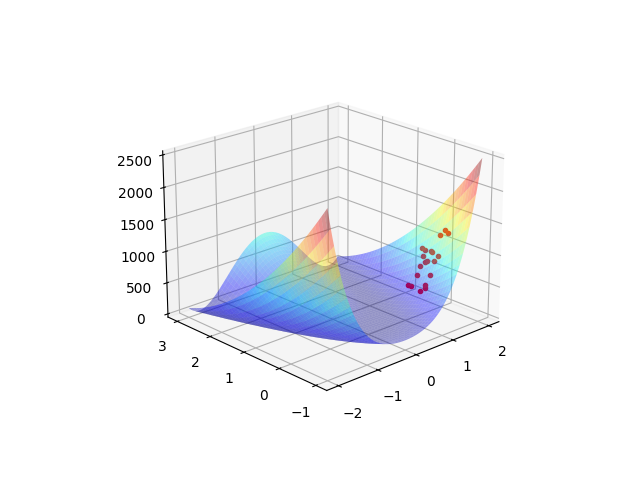
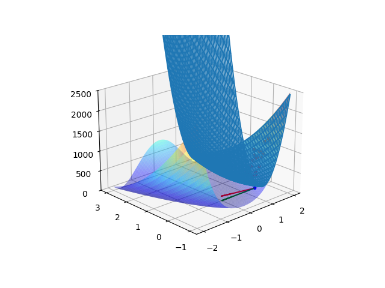

# Karesel Yaklaşıksallama (Quadratic Approximation)

Bir nokta etrafında, herhangi bir boyutta karesel yaklaşıksallama yapmak
için bir karesel baz fonksiyonu kullanabiliriz, mesela iki boyut için

$$
p(x) =
\left[\begin{array}{ccccc} x_1 & x_2 & x_1^2 & x_1x_2 & x_2^2 \end{array}\right]^T
$$

bir baz olabilir, ki $x=\left[\begin{array}{cc} x_1 & x_2 \end{array}\right]^T$ 
olmak üzere, böylece $f(x) = p(x)^T a$ çarpımı ile bir özgün fonksiyon 
yaratabiliriz, $a = [a_0, a_1, ...]$ içinde sabitler vardır bu sabitler 
fonksiyonu özgün olarak belirleyen değerlerdir. Bir anlamda

$$
f(x) = a_0 + a_1 x_1 + a_2 x_2 + a_3 x_1 x_2 + a_4 x_2^2
$$

çarpımının vektörsel halini görmüş olduk. 

Peki eğer $a$ katsayılarını bilmiyorsak, verilen bir deney verisi üzerinden
katsayıları nasıl buluruz? Üstteki temeli kullanarak bir veriye en az
kareler bağlamında en iyi uyan karesel denklemi uydurabiliriz, bunun için
her veri noktasını baz fonksiyon üzerinden genişletmemiz gerekir, yani üç
boyutlu bir fonksiyondan alınmış olacak
$x^1 = (x_1^1,x_2^1), x^2 = (x_1^2,x_2^2), ...,x^n = (x_1^n,x_2^n)$ ve ona
tekabül eden $y^1,y^2,...,y^n$ değerleri için

$$
\left[\begin{array}{ccccc}
 (x_1^1) & (x_2^1) & (x_1^1)^2 & (x_1^1)(x_2^1) & (x_2^1)^2  \\
\vdots & & & & \vdots \\
 (x_1^n) & (x_2^n) & (x_1^n)^2 & (x_1^n)(x_2^n) & (x_2^n)^2  \\
\end{array}\right] 
\mathbf{a} = 
\left[\begin{array}{c}
y^1 \\ \vdots \\ y^n
\end{array}\right]
$$

ortamını yaratmak gerekir. Bu problemi en az kareler stili ile
çözebiliriz. 

Fakat bizim icin daha faydali olabilecek bilgi, bir karesel fonksiyon
üzerinden ayrıca gradyan ve Hessian bilgisini de alabilmek. Bu bilginin
direk alınabileceği en kolay form

$$
f(x) = x^T A x
$$

formudur. Bu da çok boyutlu karesel fonksiyonları temsil etmenin bir diğer
yolu, ve gradyan $\nabla f (x) = 2 A x$ ve Hessian $\nabla^2 f(x) = 2 A$
($A$ simetrik ise) ile bu form üzerinden rahatça hesaplanabilir. O zaman
istediğimiz öyle bir en az kareler uygulaması ki, elde edilen katsayıları
direk $A$ öğeleri olarak alabilelim, ve bu $A$ üzerinden $\nabla f(x)$ ve
$\nabla^2 f(x)$ hesaplamak kolay olsun.

Üç boyutlu durumda ne olurdu? Üstteki karesel matris formunu şu şekilde
açalım, 

$$
x^T A x =
\left[\begin{array}{ccc}
x_1 & x_2 & x_3
\end{array}\right]
\left[\begin{array}{ccc}
a_{11} & a_{12} & a_{13} \\
a_{21} & a_{22} & a_{23} \\
a_{31} & a_{32} & a_{33} 
\end{array}\right]
\left[\begin{array}{c}
x_1 \\ x_2 \\ x_3
\end{array}\right]
$$

$$
= \left[\begin{array}{c}
x_1 a_{11} + x_2 a_{21} + x_3 a_{31} \\
x_1 a_{12} + x_2 a_{22} + x_3 a_{32} \\
x_1 a_{13} + x_2 a_{23} + x_3 a_{33} 
\end{array}\right]^T 
\left[\begin{array}{c}
x_1 \\ x_2 \\ x_3
\end{array}\right]
$$

$$
= x_1 x_1 a_{11} + x_1 x_2 a_{21} + x_1 x_3 a_{31} +
$$
$$
x_1 x_2 a_{12} + x_2 x_2 a_{22} + x_3 x_2 a_{32} +  
$$
$$
x_1 x_3 a_{13} + x_2 x_2 a_{23} + x_3 x_3 a_{33} 
$$

Buradan görülüyor ki $x_{i},x_{j}$ indislerinin $a_{ij}$ indisi ile direk
bağlantısı var. O zaman bir döngü içinde tüm $i,j$ kombinasyonlarını
yanyana  koyarak bir vektör oluşturursak burada elde edilen $A$ matrisi
içindeki öğeler beklenen yerlerde olacaktır. 

Bir pürüz daha kaldı, iki boyutlu ortamı düşünürsek $x_1^2$, $x_2^2$ var
ama tek başına $x_1$ yok, ayrıca tek başına bir sabit değer de gerekli, bu
lineer denklemlerdeki kesi (intercept) değeri gibi, karesel denklemi olduğu
gibi yukarı, aşağı kaydırabilmemizi sağlayacak. Bunun çözümü basit, üstteki
gibi üç boyuttaki denklemde $x_3$ yerine $1$ değerini verirsek, 

$$
x^T A x =
\left[\begin{array}{ccc}
x_1 & x_2 & 1
\end{array}\right]
\left[\begin{array}{ccc}
a_{11} & a_{12} & a_{13} \\
a_{21} & a_{22} & a_{23} \\
a_{31} & a_{32} & a_{33} 
\end{array}\right]
\left[\begin{array}{c}
x_1 \\ x_2 \\ 1
\end{array}\right]
$$

Bu bize 

$$
= x_1 x_1 a_{11} + x_1 x_2 a_{21} + x_1 a_{31} +
$$
$$
x_1 x_2 a_{12} + x_2 x_2 a_{22} + x_2 a_{32} +  
$$
$$
x_1 a_{13} + x_2 x_3 a_{23} +  a_{33} 
$$

$$
=  a_{11} x_1^2 + a_{21} x_1 x_2  + a_{31}x_1  +
$$
$$
a_{12}x_1 x_2  + a_{22}x_2^2 +  a_{32} x_2+  
$$
$$
a_{13} x_1  + a_{23} x_2 x_3 +  a_{33} 
$$

denklemini sağlar, yani iki boyutta tam bize gereken denklem. O zaman en az
kareler için üç boyutta hazırlayacağımız hesap bize iki boyut için gereken
sonucu verir. Tek hatırlamamız gereken gerekli noktalarda bir '1' değerini
vektöre eklemektir.

Şimdi optimizasyonun klasik problemlerinden Rosenbrock fonksiyonunu
görelim. Bu fonksiyonun belli noktalarından örneklem alacağız, ve bu
noktaları kullanarak o noktada bir karesel ara değerleme (interpolation)
yapacağız.

```python
from scipy.interpolate import Rbf
from mpl_toolkits.mplot3d import Axes3D
import matplotlib.pyplot as plt
from matplotlib import cm
import numpy as np
import autograd.numpy as anp
import autograd

def random_ball(num_points, dimension, radius=1):
    from numpy import random, linalg
    random_directions = random.normal(size=(dimension,num_points))
    random_directions /= linalg.norm(random_directions, axis=0)
    random_radii = random.random(num_points) ** (1/dimension)
    return radius * (random_directions * random_radii).T

np.random.seed(0)
N = 20

def rosenbrock(x):
    return (1 + x[0])**2 + 100*(x[1] - x[0]**2)**2

def Rosenbrock(x,y):
    return (1 + x)**2 + 100*(y - x**2)**2

def get_fvals_in_region(xcurr, f, radius):    
    b = random_ball(N, 2, radius)
    pts = xcurr+b
    vals = [f(p) for p in pts]
    return xcurr+b, np.array(vals)

x0 = [1.5,0]
xs,vs = get_fvals_in_region(x0, rosenbrock, 0.5)

res = []
for i in range(vs.shape[0]):
    res.append((xs[i,0],xs[i,1],vs[i]))
res = np.array(res).reshape(vs.shape[0], 3)

x = np.linspace(-2,2,250)
y = np.linspace(-1,3,250)
X, Y = np.meshgrid(x, y)
Z = Rosenbrock(X, Y)

fig, ax = plt.subplots(1, 1, subplot_kw={'projection': '3d'})
ax.plot3D(res[:,0],res[:,1],res[:,2],'r.')
ax.plot_surface(X,Y,Z,rstride = 5, cstride = 5, cmap = 'jet', alpha = .4, edgecolor = 'none' )

ax.view_init(21, -133)

plt.savefig('func_70_dfo_01.png')
```



Şimdi üstteki örneklem noktalarını kullanarak ona en yakın karesel
fonksiyonu bulalım,

```python
import itertools
import numpy.linalg as lin

def quad_interpolate(xi, yi):
    xi = np.hstack((xi, np.ones((1,len(xi))).T  ))
    D = xi.shape[1]
    print (D)
    X_train = []
    for row in xi:
        X_train.append([row[i]*row[j] for i,j in itertools.product(range(D),range(D)) ])
    X_train = np.array(X_train)
    print (X_train.shape)
    print (yi.shape)
    coef,_,_,_ = lin.lstsq(X_train, yi)
    return coef

xi = res[:,[0,1]]
yi = res[:,[2]]
coef = quad_interpolate(xi,yi)

print (coef)
```

```text
3
(20, 9)
(20, 1)
[[ 1549.94077306]
 [ -331.73935453]
 [-1646.09015508]
 [ -331.73935453]
 [  108.66378197]
 [  273.04187866]
 [-1646.09015508]
 [  273.04187866]
 [ 1960.85629284]]
```

```python
x = np.linspace(-2,2,250)
y = np.linspace(-1,3,250)
X, Y = np.meshgrid(x, y)
Z = Rosenbrock(X, Y)

fig, ax = plt.subplots(1, 1, subplot_kw={'projection': '3d'})
ax.plot3D(res[:,0],res[:,1],res[:,2],'r.')
ax.plot_surface(X,Y,Z,rstride = 5, cstride = 5, cmap = 'jet', alpha = .4, edgecolor = 'none' )

def q_interp(x1,x2):
    x = np.array([[x1,x2,1]])
    A = coef.reshape(3,3)
    res = np.dot(np.dot(x,A),x.T)
    return float(res)

Zi = np.array([q_interp(xx,yy) for xx,yy in zip(X.flatten(),Y.flatten())])
Zi = Zi.reshape(X.shape)
ax.plot_wireframe(X,Y,Zi)

coefs = coef.reshape(3,3)

g = (2 * np.dot(coefs[:2,:2],np.array(x0).reshape(2,1)))

gnorm = g / np.sum(g)

ax.set_zlim(0,2500)

ax.quiver(x0[0], x0[1], 0, -gnorm[0], -gnorm[1], 0, color='red')

hess = 2*coefs[:2,:2]
print (hess)
newton_dir = -np.dot(lin.inv(hess),g)
print (newton_dir)

d = newton_dir
print (d)

ax.quiver(x0[0], x0[1], 0, d[0], d[1], 0, color='green')

ax.plot3D([x0[0]], [x0[1]], [0.0], 'b.')

ax.view_init(21, -133)

plt.savefig('func_70_dfo_02.png')
```

```text
[[3099.88154613 -663.47870906]
 [-663.47870906  217.32756394]]
[[-1.5000000e+00]
 [ 1.6435158e-15]]
[[-1.5000000e+00]
 [ 1.6435158e-15]]
```



Görüldüğü gibi en az karelerle hesaplanan $A$ üzerinden Hessian ve Jacobian
hesabı çok kolay oldu. Bu değerlerle o noktada gradyan inişi ve Newton
adımı yönlerini hesapladık. 

Fakat dikkat etmek gerekir; her ne kadar yaklaşıklama Hessian ve Jacobian
için gerçeğe yakın değerler hesaplaşa bile, Newton hesabı açısından bu
yeterli olmayabilir, onu çizgi arama yöntemi ile birleştirmek gerekir [1].

Kaynaklar

[1] Bayramlı, *Fonksiyonel Analiz ve Optimizasyon - Newton'un Metodu*


