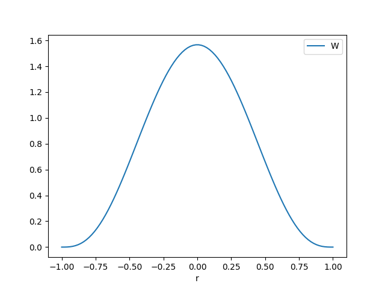
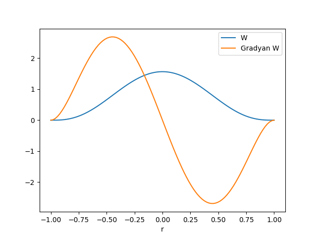
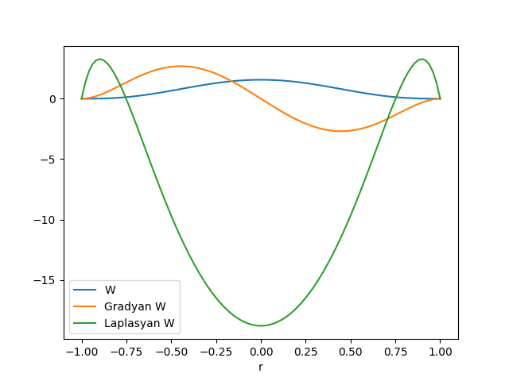
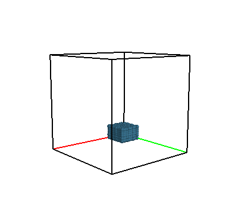
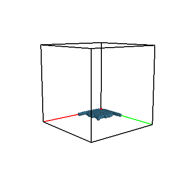
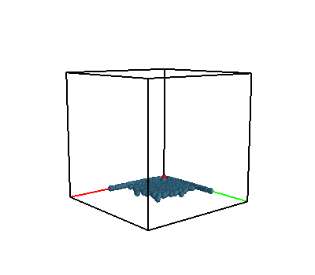
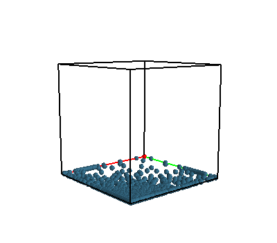

# Pürüzleştirilmiş Parcaçık Hidrodinamiği (Smoothed Particle Hydrodynamics -SPH-)

SPH sıvıların dinamik hareketini görmemizi sağlayan bir simulasyon
tekniğidir. Lagrangian bakış açısını temel alır, yani Euler aksine, bir sıvı
paketini takip edip nereye gittiğine, hangi değişimlere uğradığına
bakarız.

Önce akış dinamiğini formüllerini görelim,

Sıvının akışını simüle etmek pek çok alanda faydalı olabilecek bir
tekniktir. Sıvıların kendisine ek olarak gazları yoğunluğu daha az olan sıvı
olarak görebiliriz, hatta katı maddeler de akışkanlığı çok az sıvı gibi
düşünülebilirse, böylece aerodinamikten başlayıp, gemi tasarlamaya, oradan
oyunlarda duman simülasyonuna kadar giden geniş yelpazede teknikler kullanım
bulabilir.

SPH tekniği bu sıvı simülasyon yöntemlerinden birisidir. Navier-Stokes
denklemleri bir sıvının akışını tanımlar, bu denklem simülasyon ortamında
yaklaşık olarak çözülmelidir [13], bunu yapmanın iki yolu vardır. Önceki
anlatımdan hareketle herhalde cevabı tahmin edebiliriz, birisi Lagrange usulü
diğeri Euler usulü. SPH yöntemi Lagrange yaklaşımını takip eder, yani bir sıvı
paketini alıp onun zaman ve uzayda gidişini izler. Tek bir yere mıhlanmış
olmamanın (Euler usulü) pek çok avantajları var, mesela oyun grafiklerini
çizerken daha geniş bir alanda iş yapabilmek mümkün, farklı maddeler arasındaki
iletişim daha rahat halledilebiliyor, vs.

Formülasyon için temel fizikle başlayalım. Simüle ettiğimiz bir sıvı paketidir
demiştik, bu paketin ivmesini takip edelim mesela, bunun önemli olacagini tahmin
edebiliriz, oradan kuvvet, enerji bağlantıları var, $F=ma$ formülünden
hareketle, ve materyel türev ile

$$
m \frac{D \bar{u}}{D t} = F^{toplam}
$$

diyebiliriz. Daha önce materyel türevi yoğunluk üzerinde uygulamıştık, pek çok
farklı ölçüt üzerinde materyel türev kullanılabilir demiştik, ayrıca hız
$\bar{u}$ materyel türev içinde kullanılmakta, ama hızın kendisine de gayet
rahat bir şekilde materyel türev uygulanabilir.

Üstteki eşitliğin sağ tarafını detaylandırabiliriz, düşünelim, hangi kuvvetler
bir sıvı akışı sırasında sıvı paketi / parçacık üzerinde etki ediyor? Bunlar
sırasıyla basınç, ağdalık, ve yerçekim olurdu herhalde, bal gibi ağdalı bir
sıvıda parçalar birbirlerine yapışkandır, şu için daha az, bu bir
kuvvettir. Yerçekimi bir kuvvettir doğal olarak. Basınç ta öyle, biraz derine
dalan herkes etrafındaki suyun basıncını bir kuvvet olarak hisseder. O zaman,

$$
m \frac{D \bar{u}}{D t} = F^{\textrm{basınç}} + F^{\textrm{ağdalık}} + F^{\textrm{yerçekim}} 
$$

diyebiliriz. Kuvvetlerden en basiti yerçekimi, $F^{\textrm{yerçekim}} = m
\bar{g}$. İvme $\bar{g}$ bir vektör olarak gösterildi, bu $\bar{g} = (0, 0,
9.8)$ olurdu, sadece z ekseni üzerinde etki eden bir ivmelenme yani.

Diğer kuvvet basınç. Yüksek basınç bölgeleri alçak basınç bölgelerinde doğru bir
kuvvet uygular. Basıncın tüm sıvı için $p(\bar{x})$ değişkeninde olduğunu
düşünelim, peki basınç dengesizliğini matematiksel olarak göstermenin en basit
yolu nedir? Basıncın negatif gradyanını almak, $-\nabla p$ olur mu acaba?
Evet. Temel Calculus'tan hatırlarsak gradyan en dik iniş yönünü gösterir, o
zaman gradyanın negatifi yüksek basınç bölgesinden dışarı, alçak basınç
bölgesine doğru gösterecektir. Tabii ki bu etkiyi üzerinde olduğumuz sıvı
paketinin hacmi üzerinden entegre etmemiz gerekir, ama basit bir yaklaşıklama
olarak onu direk hacim $V$ ile çarpabiliriz. Tümü $F^{\textrm{basınç}} = - V
\nabla p$.

Üçüncü kuvvet ağdalık. Ağdalı bir sıvı deforme edilmeye karşı direnir. Bu
kuvveti kabaca "her parçacığı yanındaki diğer parçacıkların ortalama hızında
hareket etmesini zorlayan kuvvet'' olarak görebiliriz, bir diğer deyişle
birbirine yakın olan parçacıkların arasındaki hız farklarını minimize etmeye
uğraşan kuvvet. Şimdi, mesela görüntü işleme literatürünü düşünürsek, o alanda
çalışanlar bir ölçünün etrafındaki ortalamadan ne kadar saptığını hesaplamak
için bir diferansiyel operatör kullanır, bu operatör Laplasyan $\nabla \cdot
\nabla$.  Bu operatör, aynı şekilde hacim üzerinden entegre edilince bize
ağdalık kuvvetini verebilir, burada bir ek her sıvının farklı ağdalığını formüle
dahil edebilmek için bir de bir dinamik ağdalık sabiti (dynamic viscosity
coefficient) $\mu$ ile herşeyi çarpmak gerektiği, o zaman $F^{\textrm{ağdalık}}
= V \mu \nabla \cdot \nabla \bar{u}$ formülünü elde ediyoruz.

Hepsini bir araya koyunca,

$$
m \frac{D \bar{u}}{D t} = m\bar{g} - V \nabla p + V \mu \nabla \cdot \nabla \bar{u}
$$

Bu denklemi hacim ve kütle limite giderken düşüneceğiz, ama bu haliyle formül
problem çıkartabilir, o zaman her şeyi $V$ ile bölersek ve sonra limiti
düşünürsek daha iyi olur, $m/V$'yi sıvı yoğunluğu $\rho$ olarak tanımlayalım,

$$
\rho \frac{D \bar{u}}{D t} = \rho \bar{g} -
\nabla p +
\mu \nabla \cdot \nabla \bar{u}
$$

Bu denklem bazıları için tanıdık gelebilir.. Navier-Stokes denklemine benzemiyor
mu? Navier-Stokes ünlü denklemi,

$$
\frac{\partial \bar{u}}{\partial t} + \bar{u} + \frac{1}{\rho} \nabla p =
\bar{g} + \nu \nabla \cdot \nabla \bar{u}
$$

$$
\nabla \cdot \bar{u} = 0
$$

olarak gösterilir.

Neyse bizim türetişle devam edersek, her şeyi yoğunluk $\rho$ ile bölelim,

$$
\frac{D \bar{u}}{D t} + \frac{1}{\rho} \nabla p =
\bar{g}  + \frac{\mu}{\rho} \nabla \cdot \nabla \bar{u}
$$

Basitleştirme amacıyla kinematik ağdalık $\nu = \mu / \rho$ tanımlayalım, o
zaman 

$$
\frac{D \bar{u}}{D t} + \frac{1}{\rho} \nabla p =
\bar{g}  + \nu \nabla \cdot \nabla \bar{u}
$$

Sıkıştırılamazlığın (incompressibility) $\nabla \cdot \bar{u} = 0$ olduğunu daha
önce [5]'deki (2) formülünde görmüştük.

Devam edelim,

$$
\rho \frac{D \bar{u}}{D t} = F^{toplam} 
$$

denklemini gördük. Bu Newton'un $F=ma$ formülasyonun bir karşılığı. Bu denklemde
basınç, ağdalık gibi kuvvetler için terimler vardı. Toplam kuvvetleri açarsak,

$$
F^{toplam}  = F^{\textrm{basınç}} + F^{\textrm{ağdalık}} + F^{\textrm{yerçekim}} 
$$

Daha detaylı hali,

$$
\rho \frac{D \bar{u}}{D t} = 
- \nabla p + \mu \nabla \cdot \nabla \bar{u} + \rho \bar{g}
\qquad (1)
$$

Simulasyon için bize ivme gerekli. Kütle ve kuvvetten ivme, oradan sayısal
entegrasyon ile yer değişimi elde edilebilir, katı-gövde simulasyonunu kodlarken
[6]'da bu anlatılmıştı. O zaman eldeki $i$'inci parçacık için toplam kuvvet
$F_i$ hesaplarsak

$$
a_i = \frac{\mathrm{d} u_i}{\mathrm{d} t} = \frac{F_i}{\rho_i}
$$

ile ivmeyi buluruz, ve oradan devam ederiz.

Şimdi bize gereken $\nabla p(r_i)$ ve $\nabla^2 u(r_i)$ hesaplarını yaklaşık
yapabilmemizi sağlayacak bir metot kullanmak. SPH tekniği bunu sağlıyor.

Bir fonksiyon $A$ aradeğerleme (interpolation) / yaklaşıklama üzerinden temsil
edilebilir [1],

$$
A_I(r) = \int A(r') W(r-r',h) \mathrm{d} r'
$$

Belirtilmediği yerlerde $r = \bar{r}$, $u = \bar{u}$ kabul edilebilir, bunlar
vektör, $\mathrm{d} r'$ diferansiyel hacim öğesi. $A_I$ aradeğerlenmiş fonksiyon, $A$
yaklaşık göstermeye uğraştığımız fonksiyon. $A$ simulasyon ortamında hesaplanan
herhangi bir ölçüt olabilir, mesela herhangi bir $r=(x,y,z)$ noktasındaki
basınç, sıcaklık, yoğunluk, vs.

$W$ ağırlık fonksiyonudur, ya da çekirdek (kernel) fonksiyonu, sahip olması
gereken bir şart,

$$
\int_\Omega  W(r-r',h) \mathrm{d} r' = 1
$$

ve

$$
\lim_{h \to 0} W(r,h) = \delta(r)
$$

[4, sf. 11]. [4]'te bu tekniğin Dirac fonksiyonu ile bağlantıları
anlatıldı. Eğer $W = \delta$ dersek, yani çekirdek için Dirac fonksiyonu
kullanırsak, orijinal fonksiyonun kendisini elde ederiz.

SPH'in temel fikri entegral aradeğerlemeden geliyor, hatta ona bir tür Çekirdek
Yoğunluk Kestirme (Kernel Density Estimation) yöntemi de denebilir. Sıvıyı
ayrıksal parçalara bölüyoruz, ve takip edilen ölçüt ne ise çekirdek fonksiyonu
üzerinden bu ölçüt pürüzsüzleştiriliyor / etrafa yayılıyor / yumuşatılıyor. Yani
çekirdek yarıçapı içindeki diğer parçacıklar o an üzerinde olduğumuz parçacığın
neyini ölçüyorsak onu etkiliyor, mesela yakındaki parçacıkların basıncı ya da
yoğunluğu bizim basıncı, yoğunluğu etkiliyor. Kabaca düşünülünce aslında bu
bakış açısının sıvıların tabiatına son derece uygun olduğu anlaşılacaktır.

Ortalamanın alınma şekli RBF tekniği [11] ile ya da olasılıktaki beklenti
hesabına benziyor, RBF ile üzerinde olduğumuz veriyi etraftaki verilere Gaussian
uydurarak temsil etmeye uğraşırız, SPH ile üzerinde olduğumüz parçacık ölçümünü
etraftaki ölçütlerin (çoğunlukla Gaussian-ımsı) bir çekirdek üzerinden
ortalamasıyla temsil ederiz. Ortalama bir entegraldir, Olasılık Teorisi'nde
beklentinin alınması gibi, $x$ değerlerinin $f(x)$ üzerinden ağırlıklı
ortalaması $\int_{\-infty}^{\infty} x f(x) \mathrm{d} x$.

Yaklaşıklamayı sıvıya uygulamak için onu kütle öğelerine bölmemiz gerekli,
$i$'inci öğe $m_i$ kütlesine, $\rho_i$ yoğunluğuna, ve $r_i$ pozisyonuna sahip
olacak. $A$ ölçütü / hesabının $i$ parçacığındaki değeri $A_i$ ile
gösterilsin. Her parçacık için,

$$
A(r) = \int A(r') W(r-r',h) \mathrm{d} r'
$$

Yaklaşıklık için $A_I(r)$ da diyebilirdik, ya da $\approx$
kullanabilirdik. Şimdi,

$$
 = \int \frac{A(r')}{\rho(r')} W(r-r',h) \rho(r') \mathrm{d} r'
$$

$\rho(r')$'i hem bölen hem bölünene eklediğimiz için hiçbir değişim yaratmamış
olduk, ama böylece $\rho(r') \mathrm{d} r'$ ifadesi elde ettik ki ona parçacık kütlesi
diyebiliriz. Böylece parçacıkların kütleleri üzerinden bir toplam alabiliriz,

$$
A_s(r) = \sum_b m_b \frac{A_b}{\rho_b} W(r-r_b, h)
$$

Formülde kütle kullanımı daha faydalı çünkü kütle simülasyona başlamadan önce
bilinir, hatta çoğu parçacık için birbirinin aynısıdır. 

Üstteki toplamın teoride tüm parçacıklar üzerinden alındığı gösterildi, fakat
pratikte $r$'ye yakın olan diğer parçacıklar üzerinden alınır, çoğunlukla
çekirdek $2h$ gibi bir uzaklıkta zaten hızla sıfıra düştüğü için, ayrıca
performans açısından, çok uzaktaki parçacıkları göz önüne almaya gerek yoktur.

Bu formül bana herhangi bir $r$ noktasında hesaplayabileceğim bir $A$ kestirme
hesabı (estimation) vermiş oldu. Parcaçık bazlı simulasyon yaptığımız için her
$i$ parçacığı çevresindeki $j$ parçacıkları üzerinden bu kestirme hesabı
yapabileceğiz.

Bazı hesaplar formülün basit yan ürünü, mesela yoğunluk

$$
\rho_i = \rho(r_i) = \sum_j m_j \frac{\rho_j}{\rho_j} W(r_i-r_j, h) =
\sum_j m_j  W(r_i-r_j, h)
$$

Yani etraftaki parçacıkların kütlesi üzerinden alınan bir ağırlıklı ortalama
bana parçacığın yoğunluğunu veriyor.

Aradeğerlemenin bize sağladığı güzel bir özellik onun üzerinden mesela kolayca
gradyan alabilmem. Diyelim ki $A$ ölçümü basınç, yani $p$. O zaman (1)'de
görülen $-\nabla p$ formülünü üstteki entegral üzerinden açabilmem gerekir ($p$
ölçümünün ya da hesabının nereden geldiği ileride anlatılacak). $r$'de olan her
$i$ parçacığı için $p(r_i)$ diyelim,

$$
p(r_i) = \sum_j \frac{m_j p_j}{\rho_j} W(r_i-r_j,h)
$$

Bu denklemin gradyanını alabiliriz şimdi,

$$
\nabla p(r_i) = \sum \frac{m_j p_j}{\rho_j} \nabla W(r_i-r_j,h)
$$

Gradyan direk $W$ üzerinde uygulanmış oldu. Burada modellemeyi yapan kişi tabii
ki $W$'yi "gradyanı rahat alınan'' fonksiyonlar arasından da seçecektir,
böylece işi daha kolaylaşacaktır.

O zaman üstteki sonuç ile $-\nabla p$ yazarsak,

$$
F_i^{\textrm{basınç}} = - \sum_j \frac{m_j p_j}{\rho_j} \nabla W(r_i-r_j,h)
$$

elde ederiz.

Yanlız burada bir problem var, $j$ bölgesindeki basıncı kullanarak o fark
üzerinden $i$ üzerindeki kuvveti hesapladık, fakat basınç farkı dolayısıyla
$i$'nin $j$ üzerinde uyguladığı kuvvet aynı olmayabilir. Yani kuvvet simetrik
olmaz, fakat fizik kanunlarına göre etki-tepki aynı olmalıdır. Simulasyon
amacıyla çoğunlukla yapılan dışarıdan müdahele ile kuvveti simetrik hale
getirmektir, mesela bir yöntem basit aritmetik ortalama almak,

$$
F_i^{\textrm{basınç}} = - \nabla p(r_i) =
- \sum_j m_j \frac{p_i + p_j}{2 \rho_j} \nabla W(r_i-r_j,h)
$$

Ağdalık kuvvetine gelelim. İlk başta (1) bazlı olarak bu formül

$$
F_i^{\textrm{ağdalık}} = \mu \sum_j m_j \frac{u_j}{\rho_j} \nabla^2 W (r_i-r_j, h)
$$

olarak yazılabilirdi. Fakat simetriklik problemi burada da var, bu problem de
hıza olan bağlantıyı izafi hıza çevirerek çözülebilir, çünkü fiziksel olarak
düşünülürse esas önemli olan mutlak hızlar değil iki parçacığın hızlarının
farkı, ya da bir parçacığın diğerine baktığında gördüğü hız (ki bu izafi demek)
o zaman

$$
F_i^{\textrm{ağdalık}} = \mu \sum_j m_j \frac{u_j-u_i}{\rho_j} \nabla^2 W (r_i-r_j, h)
$$

daha uygun olur.

Çekirdek Fonksiyon Seçimi

SPH'in stabilitesi, doğruluğu ve hesap hızı pürüzleştirme çekirdeğinin doğru
seçilmiş olmasına bağlı [2]. Çekirdek fonksiyonlarını hangisinin, hangi
durumlarda iyi olacağı aktif bir araştırma alanıdır. Yaygın kullanılan bir
çekirdek `poly6` ismiyle bilinen 6. derece polinom çekirdeği. Bu fonksiyon,

$$
W_{poly6} (r, h) = \frac{315}{64 \pi h^9}
\left\{ \begin{array}{ll}
(h^2 - ||r||^2)^3 & 0 \le ||r|| \le h \\
0 & ||r|| > h
\end{array} \right.
$$

Gradyanı,

$$
\nabla W (r, h) =
- \frac{945}{32 \pi h^9} r ( h^2 - ||r||^2)^2
$$

Laplasyanı ise,

$$
\nabla^2 W (r, h) =
- \frac{945}{32\pi h^9} (h^2 - ||r||^2)(3 h^2 - 7||r||^2)
$$

Tek boyutta ve $h=1$ üzerinden her üç fonksiyonu grafikleyebiliriz,

```python
r = np.linspace(-1,1,100)
h = 1
import pandas as pd
df = pd.DataFrame(r)
df.columns = ['r']
df['W'] = (315./(64*np.pi*h**9)) * (h**2 - np.abs(r)**2)**3
df = df.set_index('r')
df.plot()
plt.savefig('compscieng_app40sph_01.png')
```



```python
df = pd.DataFrame(r)
df.columns = ['r']
df['W'] = (315./(64*np.pi*h**9)) * (h**2 - np.abs(r)**2)**3
df['Gradyan W'] = -945./(32*np.pi*h**9) * r * (h**2 - np.abs(r)**2)**2
df = df.set_index('r')
df.plot()
plt.savefig('compscieng_app40sph_02.png')
```



```python
df = pd.DataFrame(r)
df.columns = ['r']
df['W'] = (315./(64*np.pi*h**9)) * (h**2 - np.abs(r)**2)**3
df['Gradyan W'] = -945./(32*np.pi*h**9) * r * (h**2 - np.abs(r)**2)**2
df['Laplasyan W'] = -945./(32*np.pi*h**9) * \
                   (h**2-np.abs(r)**2) * \
                   (3*h**2 - 7**np.abs(r)**2)
df = df.set_index('r')
df.plot()
plt.savefig('compscieng_app40sph_03.png')
```



Basınç

Basınç kuvveti eğer basınç biliniyorsa hesaplanabilir, basıncın kendisini
hesaplamak için İdeal Gaz Kanunu gerekli [9], bu kanun

$$
p V = n R T
$$

ki $V = 1 / \rho$, yani birim kütleye düşen hacim, $n$ mol üzerinden kaç tane
gaz parçacığı olduğu, $R$ evrensel gaz sabiti, $T$ ise sıcaklık. SPH için sıvıda
eşsıcaklık (isothermal), ve parçacıkların sayısı simulasyon sırasında değişmez
kabul edilir, o zaman üstteki formülün sağ tarafında bir gaz sertlik (stiffness)
sabiti $k$ kullanılabilir [4, sf. 18], 

$$
p V = k
$$

$$
p \frac{1}{\rho} = k
$$

$$
p  = k \rho
$$

Sayısal kodlamalarda stabilite amaçlı olarak ayrıca bir de $\rho_0$ kullanılır,
ki her basınç hesabı için yoğunluğun bu baz $\rho_0$ ile olan farkı bazlı
alınır, nihai formül,

$$
p  = k (\rho - \rho_0)
$$

Simülasyon kodu alttadır. Simüle edilen bir blok sıvıyı havada asılı bir
durumdan bırakmak. Ne olacak? Yerçekim etkisiyle tabii ki sıvı parçacıkları
düşmeye başlayacaklar, ama normal sadece elastik çarpışma içeren simülasyondan
farklı olarak şimdi sıvı parçacıkları arasında ağdalık var, yani birbirlerine
yakın durmaya meyilliler. Ayrıca basınç var, tüm bunların etkisini simüle eden
program acaba sıvısal bir davranış gösterecek mi? Simülasyon animasyon / video
olarak [10]'da bulunabilir.

```python
from random import random
from collections import defaultdict 
import numpy as np, datetime
import sys, numpy.linalg as lin
from mayavi import mlab
import itertools

m = 0.1
R = 0.1
EPS = 0.1
BOUND_DAMPING = -0.6
mmin,mmax=0.0,2.0
BN = int(np.abs(mmax-mmin) / R) + 1
bins = np.linspace(mmin, mmax, BN)
G = np.array([0.0, 0.0, -9.8*2])

REST_DENS = 10.0
GAS_CONST = 0.5
MASS = 100.0
VISC = 20.0
DT = 0.1
H = 0.1 # kernel radius
PI = 3.14159
HSQ = H*H # radius^2 for optimization
POLY6 = 315.0/(65.0*PI*np.power(H, 9.));
SPIKY_GRAD = -45.0/(PI*np.power(H, 6.));
VISC_LAP = 45.0/(PI*np.power(H, 6.));
EPS = 0.05
BOUND_DAMPING = -0.5


idx27 = list(itertools.product( [-1,0,1], repeat=3  ))

class Simulation:
    def __init__(self):
        self.r   = R
        self.balls = []
        
    def init(self):
        i = 0
        for xs in np.linspace(0, 0.4, 10):
            for ys in np.linspace(0, 0.4, 10):
                for zs in np.linspace(0, 0.4, 10):
                    v = np.array([0.0, 0.0, 0.0])
                    f = np.array([0,0,0])
                    x = np.array([xs, ys, zs])
                    xi = np.digitize(xs, bins)
                    yi = np.digitize(ys, bins)
                    zi = np.digitize(zs, bins)                    
                    d = {'x': x, 'f':f, 'v': v, 'i': i, 'rho': 0.0, 'p': 0.0, 'grid': (xi,yi,zi)}
                    self.balls.append(d)
                    i += 1
        self.rvec   = np.ones(i) * self.r

    def get_neighbors(self, ball):
        neighbors = {}
        cx,cy,cz = ball['grid']
        for (xa,ya,za) in idx27:
            nx,ny,nz = cx+xa,cy+ya,cz+za
            if (nx,ny,nz) in self.grid_hash:
                tn = self.grid_hash[(nx,ny,nz)]
                for n in tn: neighbors[ n['i'] ] = n
        return neighbors
        
    def hash_balls(self):
        self.grid_hash = defaultdict(list)
        for i,b in enumerate(self.balls):
            xi = np.digitize(b['x'][0], bins)
            yi = np.digitize(b['x'][1], bins)
            zi = np.digitize(b['x'][2], bins)
            b['grid'] = (xi,yi,zi)
            self.grid_hash[(xi,yi,zi)].append(b)
            
    def computeDensityPressure(self):
        for i,pi in enumerate(self.balls):            
            pi['rho'] = 0.0                
            otherList = self.get_neighbors(pi)
            for (k,pj) in otherList.items():
                r2 = lin.norm(pj['x']-pi['x'])**2
                if  r2 < HSQ:
                    pi['rho'] += MASS*POLY6*np.power(HSQ-r2, 3.0)
            pi['p'] = GAS_CONST*(pi['rho'] - REST_DENS)
       
                
    def computeForces(self):
        for i,pi in enumerate(self.balls):
            fpress = np.array([0.0, 0.0, 0.0])
            fvisc = np.array([0.0, 0.0, 0.0])                
            otherList = self.get_neighbors(pi)
            for k,pj in otherList.items():
                if pj['i'] == pi['i']: continue
                rij = pi['x']-pj['x']
                r = lin.norm(rij)
                if r < H:
                    if np.sum(rij)>0.0: rij = rij / r
                    tmp1 = -rij*MASS*(pi['p'] + pj['p']) / (2.0 * pj['rho'])
                    tmp2 = SPIKY_GRAD*np.power(H-r,2.0)
                    fpress += (tmp1 * tmp2)
                    tmp1 = VISC*MASS*(pj['v'] - pi['v'])
                    tmp2 = pj['rho'] * VISC_LAP*(H-r)
                    fvisc += (tmp1 / tmp2)
            fgrav = G * pi['rho']
            pi['f'] = fpress + fvisc + fgrav
                        
    def integrate(self):
        for j,p in enumerate(self.balls):
            if p['rho'] > 0.0: 
                p['v'] += DT*p['f']/p['rho']
            p['x'] += DT*p['v']

            if p['x'][0]-EPS < 0.0:
                p['v'][0] *= BOUND_DAMPING
                p['x'][0] = 0.0
            if p['x'][0]+EPS > 2.0:
                p['v'][0] *= BOUND_DAMPING
                p['x'][0] = 2.0-EPS

            if p['x'][1]-EPS < 0.0:
                p['v'][1] *= BOUND_DAMPING
                p['x'][1] = 0.0
            if p['x'][1]+EPS > 2.0:
                p['v'][1] *= BOUND_DAMPING
                p['x'][1] = 2.0-EPS

            if p['x'][2]-EPS < 0.0:
                p['v'][2] *= BOUND_DAMPING
                p['x'][2] = 0.0
            if p['x'][2]+EPS > 2.0:
                p['v'][2] *= BOUND_DAMPING
                p['x'][2] = 2.0-EPS


        self.hash_balls()
                

    def update(self):
        self.hash_balls()
        self.computeDensityPressure()
        self.computeForces()
        self.integrate()                    
        
    def display(self, i):
        mlab.options.offscreen = True
        ball_vect = [[b['x'][0],b['x'][1],b['x'][2]] for b in self.balls]
        ball_vect = np.array(ball_vect)

        fig = mlab.figure(figure=None, fgcolor=(0., 0., 0.), bgcolor=(1, 1, 1), engine=None)
        color=(0.2, 0.4, 0.5)
        mlab.points3d(ball_vect[:,0], ball_vect[:,1], ball_vect[:,2], self.rvec, color=color, colormap = 'gnuplot', scale_factor=1, figure=fig)
        mlab.points3d(0, 0, 0, 0.1, color=(1,0,0), scale_factor=1.0)
        
        BS = 2.0
        mlab.plot3d([0.0,0.0],[0.0, 0.0],[0.0, BS], color=(0,0,0), tube_radius=None, figure=fig)
        mlab.plot3d([0.0,BS],[0.0, 0.0],[0.0, 0.0], color=(1,0,0), tube_radius=None, figure=fig)
        mlab.plot3d([0.0,0.0],[0.0, BS],[0.0, 0.0], color=(0,1,0), tube_radius=None, figure=fig)
        mlab.plot3d([0.0,0.0],[0.0, BS],[BS, BS], color=(0,0,0), tube_radius=None, figure=fig)
        mlab.plot3d([0.0,BS],[0.0,0.0],[BS,BS], color=(0,0,0), tube_radius=None, figure=fig)
        mlab.plot3d([BS,BS],[0.0,BS],[BS,BS], color=(0,0,0), tube_radius=None, figure=fig)
        mlab.plot3d([BS,0],[BS,BS],[BS,BS], color=(0,0,0), tube_radius=None, figure=fig)
        mlab.plot3d([0,0],[BS,BS],[BS,0], color=(0,0,0), tube_radius=None, figure=fig)
        mlab.plot3d([BS,BS],[0.0,0.0],[0.0,BS], color=(0,0,0), tube_radius=None, figure=fig)
        mlab.plot3d([BS,BS],[0.0,BS],[0.0,0.0], color=(0,0,0), tube_radius=None, figure=fig)
        mlab.plot3d([BS,0.0],[BS,BS],[0.0,0.0], color=(0,0,0), tube_radius=None, figure=fig)
        mlab.plot3d([BS,BS],[BS,BS],[0.0,BS], color=(0,0,0), tube_radius=None, figure=fig)

        mlab.view(azimuth=50, elevation=80, focalpoint=[1, 1, 1], distance=8.0, figure=fig)
        
        mlab.savefig(filename='/tmp/sim/out-%02d.png' % i)

if __name__ == '__main__':
    s = Simulation()
    s.init()
    for i in range(20):
        print (i)
        s.update()
        s.display(i)
        #exit()
```







Komşuları bulmak için [12]'deki ızgara bazlı yöntem kullanıldı. Bu yöntem, biraz
ek yapılarak mükkemmel sonuç verebilir, ve bu önemli çünkü SPH'in doğru
çalışabilmesi için *tüm* komşuların bulunabilmesi gerekir.


Kaynaklar

[1] Monaghan, *Smoothed particle hydrodynamics, 2005*

[2] Schuermann, *Particle-Based Fluid Simulation with SPH*,
    [https://lucasschuermann.com/writing/particle-based-fluid-simulation](https://lucasschuermann.com/writing/particle-based-fluid-simulation)

[3] Bayramlı, *Hesapsal Bilim, Ders 4*

[4] Kelager, *Lagrangian Fluid Dynamics Using Smoothed Particle Hydrodynamics*

[5] Bayramlı, *Fizik, Muhafaza Kanunları*

[6] Bayramlı, *Fizik, Simulasyon*

[7] Monaghan, *Introduction to SPH Part I*,
    [https://www.youtu.be/tAXHCAEgSuE](https://www.youtu.be/tAXHCAEgSuE)

[8] Müller, *Particle-Based Fluid Simulation for Interactive Applications*

[9] Bayramlı, *Fizik, Temel Fizik 3, Basınç, Çarpışma*

[10] Bayramlı, *Simulasyon Animasyonu*,
    [https://github.com/burakbayramli/classnotes/blob/master/compscieng/compscieng_app40sph/balls4.gif?raw=true](https://github.com/burakbayramli/classnotes/blob/master/compscieng/compscieng_app40sph/balls4.gif?raw=true)

[11] Bayramlı, *Istatistik, Dairesel Baz Fonksiyonları (Radial Basis Functions -RBF-)*

[12] Bayramlı, *Bilgisayar Bilim, Geometrik Anahtarlama (Spatial Hashing) ve Izgara (Grid) ile En Yakın Noktaları Bulmak*

[13] Schuermann, *Particle-Based Fluid Simulation with SPH*,
    [https://lucasschuermann.com/writing/particle-based-fluid-simulation](https://lucasschuermann.com/writing/particle-based-fluid-simulation)


