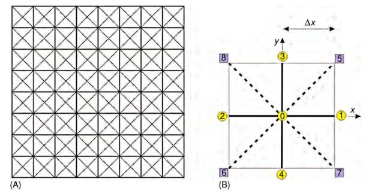
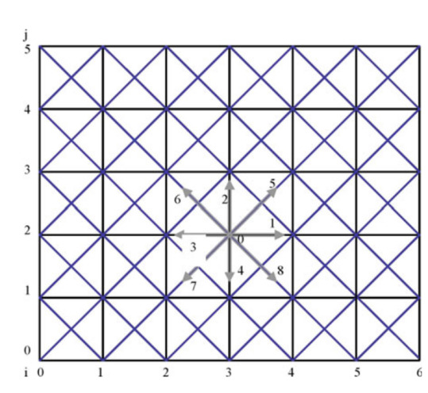
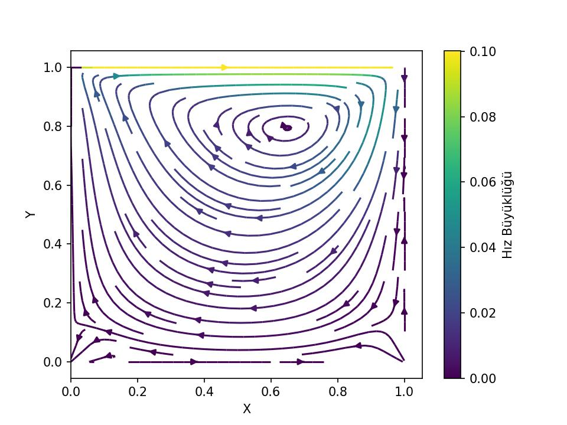

# Örgü (Lattice) Boltzmann Metodu

Bu yöntemde bir sıvı veya gazın sanal parçacıklardan oluştuğu
varsayılır ve bu sıvı parçacıkları bir simülasyon bölgesinde hareket
edebilir, diğer sıvı parçacıklarıyla çarpışabilir. Simülasyon alanı
bir örgü / ızgara sistemi olarak ele alınır ve sıvı parçacıkları
düğümden düğüme hareket eder; yani bir bölge içinde serbestçe hareket
edemezler. Bu yöntemin moleküler dinamik yöntemine kıyasla en önemli
farkı ızgara Boltzmann yönteminin sıvı parçacıklarının konumlarını ve
hızlarını değil, parçacıkların hız dağılım fonksiyonunu kullanarak
hesap yapmasıdır [3, sf. 24].

Bir diğer sınırlama hareket yönleri üzerinde yapılmıştır. Aşağıdaki
şekil iki boyutlu bir sistem için ızgara Boltzmann yöntemi
şekillenmiş. (A), bir simülasyon bölgesinin ızgara sistemine
bölündüğünü göstermektedir. (B) ise birim kare ızgara hücresinin
büyütülmüş halidir. Moleküllerin grupları veya kümeleri olarak ele
alınan sanal sıvı parçacıklarının yalnızca komşu düğümlere hareket
etmesine izin verilir, daha uzak düğümlere değil. Yani 0 düğümündeki
sıvı parçacıklarının bir sonraki zaman adımında orada kalmasına ya da
1, 2, .., 8 numaralı düğümlere hareket etmesine izin verilir. Bu
hareket kısıtlaması hareket hızını da standardize eder ve
basitleştirir. 1, 2, 3 ve 4 numaralı düğümlere hareket eden sıvı
parçacıklarının $c = \Delta x / \Delta t$ hızı olacaktır, 5, 6, 7 ve 8
numaralı düğümlere hareket edenlerin ise $\sqrt{2}c$ hızına sahip
olmalıdır; burada $\Delta x$ en yakın iki düğüm arasındaki ızgara
aralığı ve $\Delta t$ simülasyonlar için zaman aralığıdır. $\sqrt{2}c$
değeri, (B)'deki köşegen mesafenin $\sqrt{\Delta x^2 + \Delta x^2} =
\sqrt{2}\Delta x$ olduğu ve buradaki hızın $\sqrt{2}\Delta x / \Delta
t$, yani önceki $c$'nin $\sqrt{2}$ katı olacağı gerçeğinden
hesaplanabilir.



Bu yöntemin gerekli denklemlerini türetmeye başlayalım. Daha önce
[1]'de Boltzmann taşınım denkleminin şu şekilde olduğunu gördük:

$$\frac{\partial f}{\partial t} + c \cdot \nabla f = \Omega$$

$\Omega$, moleküller hareket ettikten sonra gerçekleşebilecek
çarpışmaları temsil eder; $dr\, dc$ aralığındaki molekül sayıları
arasındaki önce ve sonra arasındaki net farkı yakalar.

### Çarpışmalar

Hiç çarpışma olmasaydı, $f()$ bağlamında önceki sayım sonraki sayımla
tamamen aynı olurdu ve aralarındaki fark sıfır olurdu. Bunun olmadığı
durumlarda sıfırdan farklı bir $\Omega$'ya ihtiyaç duyarız. Bu,
$\Omega$'nın hesaplanmasının kolay olduğu anlamına gelmez. Gerçek bir
çarpışma sayımı sistemdeki tüm olası çarpışmaları hesaba katmak
zorunda olduğundan hesaplamak güçtür. Ancak çarpışma operatörünü
çözümün sonucunda önemli bir hata ortaya çıkarmadan basit bir
hesaplamayla yaklaşık olarak ifade etmek mümkündür [2, sf. 28].

$\Omega$'yı yaklaşık olarak ifade edebilmek için BGK yaklaşımı adı
verilen bir yöntem geliştirilmiştir. BGK kaba ama zekice bir
basitleştirmedir: tüm çarpışmaları hesaplamak yerine şu soruyu sorar:
"Mevcut dağılım denge durumundan ne kadar uzakta ve ne kadar hızlı
dengeye doğru meyili var?" Bu şu sonucu verir:

$$\Omega = \frac{1}{\tau}(f^{eq} - f)$$

burada $f^{eq}$, Maxwell-Boltzmann dağılımıdır — [1]'de türettiğimiz
denge dağılımı. Fiziksel fikir şudur: bir gazı yeterince uzun süre
kendi haline bırakırsanız, çarpışmalar onu bu denge durumuna
yönlendirir. Dolayısıyla $f^{eq}$, $f$'nin ulaşmaya çalıştığı yeri
temsil eder. Hatırlamak icin $f^{eq}$ formülünü tekrar verelim,

$$f^{eq} = \left(\frac{m}{2\pi k_B T}\right)^{3/2} \exp\left(-\frac{m|c-u|^2}{2k_BT}\right)$$

Birçok açıdan BGK modeli, sistemin durumunu fark terimi $(f^{eq} - f)$
aracılığıyla "algılar". $f^{eq}$ doğrudan yerel, gerçek zamanlı
makroskopik özelliklerden ($\rho$ ve $u$) hesaplandığından, sıvının
tam anlamıyla oraya meyillendirilmiş olma durumunda bulunması gereken
matematiksel durumu temsil eder.

- Sıvı zaten denge durumundaysa $f = f^{eq}$, yani $\Delta f =
  0$. Model, hiçbir düzeltmeye gerek olmadığını algılar.

- $f$ ile $f^{eq}$ birbirinden uzaklaşır ve $\Delta f$ büyürse, bu
  çarpışmaların olduğu anlamına gelir; bu fark, bir kontrol
  sistemindeki hata sinyali gibi algılanır moleküler sınır dışına ne
  kadar çıktığını tam olarak ölçer.

Sapma bu çıkarma işlemiyle algılandıktan sonra, BGK operatörü bu
değeri sistemi değiştirmek için hemen kullanır:

$$\Omega = \frac{1}{\tau}(f^{eq} - f)$$

Bu hata sinyalini $\frac{1}{\tau}$ meyillendirme / gevşeme faktörüyle
çarpar ve pasif bir ölçümü aktif bir geri yükleyici kuvvete
dönüştürür.

- Belirli bir hızda hareket eden çok fazla molekül varsa ($f >
  f^{eq}$), terim negatif olur ve çarpışma adımı o yöndeki mevcudiyeti
  azaltır.

- Çok az molekül varsa ($f < f^{eq}$), terim pozitif olur ve çarpışma
  adımı o yöndeki mevcudu artırır.

Değişiklik her zaman sapmayı doğrudan orantılıdır. Bir düğüm doğal
denge durumundan ne kadar uzaksa, onu yeniden dengeye sokmak için
değiştirme adımı o kadar agresif hale gelir. Bu, kendi kendini
düzenleyen matematiksel bir motordur: yüksek bozulma, büyük bir
düzeltici çarpışma tepkisini tetiklerken, sakin ve dengelenmiş bir
akış tamamen değişmeden geçer.

Bir not olarak belirtmek gerekir ki yukarıda açıklanan şema özünde
doğrusal bir meyillendirme / gevşeme modelidir; Newton'un soğuma
yasası $dT/dt = -(T - T_\infty)/\tau$ ile aynı matematiksel yapıya
sahiptir.

### Denge Dağılımı

Denge dağılımını daha kolay hesaplanabilir hale getirmek için üzerinde
bazı işlemler yapmamız gerekiyor. Gaussian $\exp(-|c|^2/2RT)$, ayrık
bir ızgara için çeşitli nedenlerle sorunludur:

- Sürekli $c$ için tanımlanmıştır

- Hiçbir zaman tam olarak sıfıra eşit olmadığından sonlu sayıda yön
  bağlamında budanamaz (truncate).

- Simülasyonda tekrar tekrar değerlendirilmesi pahalıdır

Bunu aşağıdaki adımlarla çözebiliriz, $f^{eq}$ denklemini biraz
masajlayarak onu farklı bir forma çevirelim.

$$
f^{eq} = \frac{\rho}{(2\pi RT)^{D/2}} \exp\left(-\frac{(c-u)^2}{2RT}\right)
$$

Üsteldeki kareyi açalım,

$$ = \frac{\rho}{(2\pi RT)^{D/2}}
\exp\left(-\frac{c \cdot c - 2c \cdot u + u \cdot u}{2RT}\right)
$$

Üstteki $c-u$ kullanımı hızı iki bileşene ayırıyor. Bu bilisenlerden
birisi $u$ ile belirtilen genel / global / toptan (bulk) hızdır,
diğeri mikro seviyedeki $c$ hızıdır. 9 tane yön altında incelenen hız
$c$ olacaktır, ve bu hız makro seviyedeki $u$'dan arta kalan dinamik
olarak incelenir, nihai dağılım formülüne verilen $c-u$ olur. 

Üstel $\exp$'yi iki blok halinde alalım,

$$ = \frac{\rho}{(2\pi RT)^{D/2}}
\exp\left(-\frac{c \cdot c}{2RT}\right)
\exp\left(\frac{2c \cdot u - u \cdot u}{2RT}\right)
\tag{1}
$$

Üstel fonksiyon bir Taylor serisi kullanılarak açılabilir, $\exp$ için
standart açılımı hatırlarsak,

$$\exp(x) = 1 + x + \frac{x^2}{2!} + \frac{x^3}{3!} + \cdots \tag{2}$$

Taylor açılımını ikinci üstel üzerinde uygulayalalım, 

$$
f^{eq} = \frac{\rho}{(2\pi RT)^{D/2}}
\exp\left(-\frac{c \cdot c}{2RT}\right)
\left(
  1 - \frac{-2c \cdot u + u \cdot u}{2RT} +
  \frac{(-2c \cdot u + u \cdot u)^2}{4R^2T^2} + \cdots
\right)
\tag{3}
$$

burada parantez içindeki ikinci terim (2)'deki $x$ terimidir, üçüncü
terim $x^2/2!$ terimidir; $O(u^3)$ terimleri atılır ve $(-2c \cdot u +
u \cdot u)^2 \approx 4(c \cdot u)^2$ sadeleştirmesi yapılır (çünkü
kare içindeki $u \cdot u$ terimi zaten $O(u^2)$ mertebesinde
olduğundan bütün ifadeyi $O(u^4)$ yapar), bu da (3)'ten (4)'e geçişi
sağlar. Devam edelim, ıkinci üstelin Taylor açılımı yapılarak $O(u^3)$
terimleri atıldığında:

$$
f^{eq} = \frac{\rho}{(2\pi RT)^{D/2}} \exp\left(-\frac{c \cdot c}{2RT}\right)
\left(1 + \frac{2c \cdot u - u \cdot u}{2RT} +
\frac{(c \cdot u)^2}{2R^2T^2}\right)
\tag{4}
$$

$W(c) = \frac{1}{(2\pi RT)^{D/2}} \exp\!\left(-\frac{c \cdot
c}{2RT}\right)$ ve $RT = c_s^2$ yerine koyarak:

$$
f^{eq} = \rho W(c) \left(1 + \frac{2c \cdot u - u \cdot u}{2c_s^2} +
\frac{(c \cdot u)^2}{2c_s^4}\right)
$$

$W(c) \to w_i$ ızgara yönü $i$ boyunca ayrıklaştırılarak:

$$
f^{eq}_i =
\rho w_i \left(1 + \frac{2c_i \cdot u - u \cdot u}{2c_s^2} +
\frac{(c_i \cdot u)^2}{2c_s^4}\right) + O(u^2) \tag{5}
$$

Izgara Boltzmann Yöntemi'nde "ızgara yönleri", sanal parçacıkların
hareket etmesine ve çarpışmasına izin verilen sabit, ayrık yolları
temsil eder. Sürekli fonksiyon $f(x, c, t)$, sonsuz hız yelpazesi,
sonsuz küçük aralıklarda parçacık yoğunluğunu izlerken, LBM bunu hız
uzayını $i$ alt indisiyle gösterilen sonlu bir vektörler kümesine
ayrıştırarak basitleştirir. Sonuç olarak, sürekli $f$, bir ayrık
dağılım fonksiyonları kümesine, $f_i$'ye bölünür; burada her $f_i(x, t)$, $x$
konumundaki $t$ zamanında $i$ kafes yönünde hareket eden parçacıkların
özgül yoğunluğunu temsil eder.

Örneğin, ilk figürdeki yaygın $D2Q9$ modelinde (2 boyut, 9 hız), $i$
indisi 0'dan 8'e kadar uzanır. Burada $f_0$ durağan parçacıkları
temsil eder, $f_1$'den $f_4$'e kadar olanlar $c$ hızında en yakın
komşulara yatay ve dikey yönde hareket eden parçacıkları temsil eder
ve $f_5$'ten $f_8$'e kadar olanlar $\sqrt{2}c$ hızında bir sonraki en
yakın komşulara çapraz hareketleri izler. Bu ayrıştırma, karmaşık bir
diferansiyel denklemi son derece verimli, yerelleştirilmiş cebirsel
hesaplamalara dönüştüren şeydir.

Devam edelim, $f^{eq}_i$, Taylor açılımlı Maxwell-Boltzmann (3.4) ile
$\rho$ ve $u$ kullanılarak hesaplanır:

$$
f^{eq}_i = w_i \rho \left(1 + \frac{c_i \cdot u}{c_s^2} +
\frac{(c_i \cdot u)^2}{2c_s^4} - \frac{u \cdot u}{2c_s^2}\right)
$$

Yani Taylor açılımı, üsteli ayrık bir ızgara üzerinde ele alınabilir
olan $c \cdot u$ cinsinden bir polinomla değiştirdi. Ardından yapılan
iki yerine koyma işlemi de iyi oldu,

- $W(c) = \exp(-c \cdot c / 2RT)(2\pi RT)^{-D/2}$, Gaussian'ı bir
  ağırlığa absorbe eder — ve bu ağırlık yalnızca $c$'nin büyüklüğüne
  bağlı olduğundan, her ayrık ızgara yönü $i$ için bir kez hesaplanan
  sabit bir $w_i$ sabitine dönüşür

- $RT = c_s^2$, termodinamiği ızgara ses hızına bağlar

Dolayısıyla (5)'te ayrıklaştırmanın ardından $f^{eq}_i$, sabit
katsayıları $w_i$, $c_i$, $c_s$ olan — hepsi önceden hesaplanabilir —
$u$ cinsinden yalnızca bir polinomdur. LBM'yi hesaplamsal açıdan bu
kadar çekici yapan da budur.

$O(u^2)$ budaması aynı zamanda yaklaşımın sınırlarını da bize söyler:
üstte gösterilen LBM yaklaşıksallığı bir düşük Mach sayısı
yaklaşımıdır. $|u|/c_s$'nin küçük olmadığı yüksek hızlı akışlar için
daha yüksek mertebeden terimler gerekecektir.

### Ana Denklemin Ayrıklaştırılması

Şimdi bir Taylor açılımına daha ihtiyaç duyacağız. Bu tekniği $f(..)$
için kullanmak istiyoruz.

Çok boyutlu durumda $f(x_1, x_2, \ldots)$'yi $a_1, a_2, \ldots$
etrafında açmak için şu genel açılımı hatırlayabiliriz,

$$
f(x_1, x_2, \ldots) \approx
f(a_1, a_2, \ldots) +
\frac{\partial f}{\partial x_1}(x_1 - a_1) +
\frac{\partial f}{\partial x_2}(x_2 - a_2) +
\cdots
$$

Bizim uygulamamız için küçük fark $x$, $t$ etrafında açılım yapmak
istememizdir; bir sonraki durum $x + c_i \Delta t$ ve $t + \Delta
t$'dir. Bu nedenle yukarıda görülen $x_1 - a_1$ ve $x_2 - a_2$ türü
ifadeleri şu şekilde yeniden belirtmemiz gerekir:

- $x + c_i \Delta t - x \to c_i \Delta t$
- $t + \Delta t - t \to \Delta t$

Artık Taylor açılımı şu hale gelir:

$$
f_i(x + c_i \Delta t, t + \Delta t) \approx f_i(x, t) +
\frac{\partial f_i}{\partial x} c_i \Delta t +
\frac{\partial f_i}{\partial t} \Delta t \tag{6}
$$

Ya da $\nabla$ gösterimini kullanarak şunu da söyleyebiliriz:

$$f_i(x + c_i \Delta t, t + \Delta t) = f_i(x, t) + \frac{\partial f_i}{\partial t} \Delta t + \nabla f_i \cdot c_i \Delta t + O(\Delta t^2)$$

Her iki taraftan $f_i(x, t)$'yi çıkarır ve tüm denklemi $\Delta t$'ye
böleriz:

$$\frac{f_i(x + c_i \Delta t, t + \Delta t) - f_i(x, t)}{\Delta t} = \frac{\partial f_i}{\partial t} + c_i \cdot \nabla f_i + O(\Delta t)$$

$\Delta t \to 0$ limitini alırsak, yüksek mertebeden $O(\Delta t)$ terimleri yok olur. Geriye şu kalır:

$$= \frac{\partial f_i}{\partial t} + c_i \cdot \nabla f_i$$

Bu form tanıdık geliyor mu? Elbette! Bu, daha önce türettiğimiz
Boltzmann taşınım denkleminin kendisidir ve bunun neye eşit olduğunu
biliyoruz:

$$\frac{\partial f_i}{\partial t} + c_i \cdot \nabla f_i = \frac{1}{\tau}(f^{eq}_i - f_i) \tag{7}$$

Dolayısıyla (6)'daki sol tarafın ayrıklaştırılması bize iki şey
sağladı. Birincisi algoritmanın nasıl ilerlediğini gösterdi, şöyle:

$$f_i(x + c_i \Delta t, t + \Delta t) = f^*_i(x, t)$$

Algoritmik açıdan bu saf bir bellek kopyalama işlemidir. Ardından $i$
yönü için $c_i$ hız vektörüne bakılır, az önce $x$ düğümünde
hesaplanan çarpışma sonrası $f^*_i$ değeri alınır ve bir sonraki zaman
adımı için tam olarak $x + c_i \Delta t$ konumundaki komşu düğümde $i$
yönüne karşılık gelen bellek yuvasına yazılır.

Denklem (6)'nın sol tarafından elde ettiğimiz ikinci kazanım, bunun
Boltzmann taşınım denklemine eşit olduğunu görmekti; dolayısıyla
(7)'nin sağ tarafı da doğru olacaktır. Çarpışma matematiğini
hesaplamak için bu gerçeği kullanabiliriz: her $i$ yönü için düğümün
mevcut $\rho$ ve $u$ değerlerini polinom formülüne koyarak $f^{eq}_i$
denge değerini hesaplarız, $f_i$'den $f^{eq}_i$'yi çıkarırız, bunu
$\frac{\Delta t}{\tau}$ (gevşeme faktörü) ile çarparız ve elde edilen
sonucu orijinal $f_i$'den çıkarırız.

### Kodlama

Altta yazacağımız simülasyonda kapak güdümlü alan / oyuk (lid-driven
cavity) içindeki sıvı akış problemini çözmeye uğraşacağız. Problem
tanımı şöyle: Bir oyuğun üstündeki kapak sabit bir hızda sürekli
soldan sağa gidiyor. Bu gidiş sırasında kapak alttaki su ile temasta
olduğu için temas edilen en üst seviyedeki suyu soldan sağa doğru
itecektir. Oyuk içindeki sağ, sol ve en alt kısmındaki duvarlar
sabittir, tabii hareket halindeki su onlara çarpınca geri sekme olur,
bu sekmenin diğer su molekülleri ile olan etkileşimi de
hesaplanmalıdır, tüm bu mekaniğin simulasyonda gösterilmesi gerekir.

Izgara, Global Akış

Kodlama için kullanılan ızgara D2Q9 ızgarası olacak, iki boyuttayız,
ve hareketsizlik dahil olmak üzere 9 tane yön var. Bu yönleri ve
onların numaralandırılmasını alttaki şekilde görüyoruz.



Sabit hızda kapak hareketin altındaki suya yapacağı sabit etkiyi
sisteme dahil etmenin en rahat yolu $u$ üzerinden olacaktır. Daha önce
$u$ değişkeninin global hareketi temsil ettiğini söylemiştik. O zaman,
mesela sisteme etki edecek bir "rüzgar" ya da bu örnekteki gibi sabit
hızdaki bir sıvı hareketini $u$ ile yaparız. Simulasyon sırasında
$u$'yu temsil eden matrisin en üst satırına bu sabit hız enjekte
edilebilir.

Sağ, sol, alt duvarları sabittir, bu duvarlara dokunan $u$
noktalarında hız sıfırlanmalıdır, ayrıca orada momentumun her zaman
sıfır olmalısı da gerekir, buna sıvı mekaniğinde kaymamazlık koşulu /
kayma-yok (no-slip condition) ismi veriliyor. Bu kaymazlık koşulunun
momentum kısmını elde etmek için de çarpışma sonrası yönsel yoğunluğu
(D2Q9'daki 9 tane yönden bahsediyoruz) *tamamen tersine* çevirmek
gerekir. Dikkat: Pong oyunu usulü topun duvardan bir açıyla
sekmesinden bahsetmiyoruz, alt sola doğru olan gidişi tam tersine,
*üst sağa* çevirmekten bahsediyoruz (Pong olsaydı "sekme" sonrası
gidiş sağ alta doğru olurdu).

Bu arada belirtelim hareket etmeyen duvara temas eden ince sıvı
tabakasının hızının sıfırlanması gerçekçi bir seçimdir, duvarlar
pürüzsüz değildir, pek çok girintisi çıkıntısı olan yapılardır, bu
noktalara temas eden sıvı moleküllerinin oraya yapıştığı deneylerde
saptanmıştır.

Hız yönünün tersini çevrilmesi gerekliliğini momentum muhafazasından
türetebiliriz. Bir duvar düğümünde $f_i$'leri gelen ve giden
popülasyonlara ayıralım.

- $f_i^+$ — $\mathbf{e}_i$'sı duvardan uzaklaşan yoğunluk

- $f_i^-$ — $\mathbf{e}_i$'sı duvara doğru işaret eden yoğunluk

ki $\mathbf{e}_i$ vektörleri LBM ızgara yapısının tanımladığı
yönlerdir. Akış sonrasında, $f_i^-$ molekülleri duvara henüz
ulaşmıştır. $f_i^+$ yoğunluğu ise bilinmeyendir — bunların sınır
koşulu tarafından belirlenmesi gerekir. Kayma-yok kısıtlaması şunu
söyler:

$$\sum_{i^+} f_i^+ \mathbf{e}_i^+ + \sum_{i^-} f_i^- \mathbf{e}_i^- = 0$$

Üstteki formül alttakinin açılmış hali, çünkü LBM'de $\mathbf{x}$
düğümündeki momentum şöyledir:

$$\rho \mathbf{u}(\mathbf{x}, t) = \sum_i f_i(\mathbf{x}, t)\, \mathbf{e}_i$$

Devam edelim, sıfıra eşit olmayı sağlamanın en basit yolu, her gelen
$i^-$ yönü için şunu ayarlamaktır:

$$f_{\bar{i}}^+ = f_i^-$$

burada $\bar{i}$, $i$'nin karşı yönüdür, yani $\mathbf{e}_{\bar{i}} =
-\mathbf{e}_i$. O halde:

$$\sum_{i^-} f_{\bar{i}}^+ \mathbf{e}_{\bar{i}}^+ + \sum_{i^-} f_i^-
\mathbf{e}_i^- = \sum_{i^-} f_i^- (-\mathbf{e}_i^-) + \sum_{i^-} f_i^-
\mathbf{e}_i^- = 0 $$

Her çift tam olarak birbirini iptal eder. Bu geri-sekme kuralıdır,
momentum toplamının sıfır olması talebi doğrultusunda doğrudan elde
edilir.

Yayılım (Streaming)

LBM yayılım mantigini olabildigince basitlestirir. Mevcut dagilimi
onceden tanimli hareket yonlerine sadece bir izgara hucresi uzerinden
kopyala. Kopyalama icin `np.roll` kullaniliyor, bazi ornekler asagida,


```python
A = np.array([[0,0,0],[0,1,1],[0,0,0]])
print (A)
A = np.roll(np.roll(A[:, :], -1, axis=0), 0, axis=1)
print (A)
A = np.roll(np.roll(A[:, :], 0, axis=0), 1, axis=1)
print (A)
```

```text
[[0 0 0]
 [0 1 1]
 [0 0 0]]
[[0 1 1]
 [0 0 0]
 [0 0 0]]
[[1 0 1]
 [0 0 0]
 [0 0 0]]
```

Bu kopyalama matrisin sınırlarından taşan değerlere döndürüp matrisin
diğer ucuna kopyalar.

Her neyse, bir soru akla gelebilir, eğer yayılım evresinde her hücre
yanindakine kopyalıyorsa, o zaman genel akış nasıl ortaya çıkıyor?
Çünkü A yanindaki B'ye kopyalar, sonra B geri A'ya kopyalar. Değişim
nerede? Bu doğru bir gözlem: eğer hiçbir çarpışma olmasaydı (ki daha
önce bahsettiğimiz gibi çarpışma miktarı denge dağılımına olan
uzaklıkla doğru orantılıdır) o zaman hakikaten giden moleküller
gelenler ile aynı olacaktı, yani hiçbir şey değişmeyecekti. 


```python
nx, ny = 101, 101

f   = np.zeros((nx, ny, 9))
ux   = np.zeros((nx, ny))
uy   = np.zeros((nx, ny))
rho = np.ones((nx, ny))

w  = np.array([1/9, 1/9, 1/9, 1/9, 1/36, 1/36, 1/36, 1/36, 4/9])
cx = np.array([1,  0, -1,  0,  1, -1, -1,  1,  0])
cy = np.array([0,  1,  0, -1,  1,  1, -1, -1,  0])

xl, yl = 1.0, 1.0
dx = xl / (nx - 1)
dy = yl / (ny - 1)
x  = np.linspace(0, xl, nx)
y  = np.linspace(0, yl, ny)

uo    = 0.10
alpha = 0.1
Re    = uo * (ny - 1) / alpha
omega = 1.0 / (3.0 * alpha + 0.5)

tol   = 1e-4
error = 10.0
erso  = 0.0
count = 0

# Kapak hizi
ux[:, -1] = uo

def collision(f, u, v, rho):
    t1 = u**2 + v**2                                    # (nx, ny)
    # t2[k] = ux*cx[k] + uy*cy[k] her k yonu icin 
    t2 = (ux[:, :, np.newaxis] * cx
        + uy[:, :, np.newaxis] * cy)                     # (nx, ny, 9)
    feq = (rho[:, :, np.newaxis] * w
           * (1.0 + 3.0*t2 + 4.5*t2**2
              - 1.5*t1[:, :, np.newaxis]))
    f = (1.0 - omega) * f + omega * feq
    return f


def stream(f):
    # Alttaki MATLAB circshift([+1,0]) cagrisinin benzeridir
    # MATLAB: circshift(A, [r,c]) tum satirlari r kadar, kolonlari c kadar kaydirir
    shifts = [(1,0),(0,1),(-1,0),(0,-1),(1,1),(-1,1),(-1,-1),(1,-1)]
    for k, (sr, sc) in enumerate(shifts):
        f[:, :, k] = np.roll(np.roll(f[:, :, k], sr, axis=0), sc, axis=1)
    return f


def boundary(f, uo):
    # --- sol duvar
    f[0, :, 0] = f[0, :, 2]
    f[0, :, 4] = f[0, :, 6]   
    f[0, :, 7] = f[0, :, 5]   

    # --- sag duvar
    f[-1, :, 2] = f[-1, :, 0] 
    f[-1, :, 6] = f[-1, :, 4] 
    f[-1, :, 5] = f[-1, :, 7] 

    # --- alt duvar
    f[:, 0, 1] = f[:, 0, 3]    
    f[:, 0, 4] = f[:, 0, 6]    
    f[:, 0, 5] = f[:, 0, 7]    

    # Üst sınır (top boundary) hareket eden kapak (Zou/He usulü) 
    # hesap iç x düğümleri üzerinden vektorize edilmiştir (index 1..nx-2)    
    i = slice(1, nx - 1)
    rhon = (f[i, -1, 8] + f[i, -1, 0] + f[i, -1, 2]
            + 2.0 * (f[i, -1, 1] + f[i, -1, 5] + f[i, -1, 4]))
    f[i, -1, 3] = f[i, -1, 1]                       
    f[i, -1, 7] = f[i, -1, 5] + rhon * üo / 6.0    
    f[i, -1, 6] = f[i, -1, 4] - rhon * üo / 6.0    

    return f


def ruv(f):
    rho = f.sum(axis=2)

    # Üst satırdaki yoğunluğu düzelt (hareket eden kapak için denge
    # dışı dışdeğerleme -extrapolation- yap)    
    rho[:, -1] = (f[:, -1, 8] + f[:, -1, 0] + f[:, -1, 2]
                  + 2.0 * (f[:, -1, 1] + f[:, -1, 5] + f[:, -1, 4]))

    ux = (f[:, :, 0] + f[:, :, 4] + f[:, :, 7]
       - f[:, :, 2] - f[:, :, 5] - f[:, :, 6]) / rho

    uy = (f[:, :, 1] + f[:, :, 4] + f[:, :, 5]
       - f[:, :, 3] - f[:, :, 6] - f[:, :, 7]) / rho

    return rho, ux, uy

while error > tol:
    f = collision(f, ux, uy, rho)
    f = stream(f)
    f = boundary(f, uo)
    rho, ux, uy = ruv(f)

    count += 1
    ers   = np.sum(ux**2 + uy**2)
    error = abs(ers - erso)
    erso  = ers

# Post-processing (mirrors result.m)
mid_x = (nx - 1) // 2
mid_y = (ny - 1) // 2

um = ux[mid_x, :] / uo   # centreline u-velocity vs y
vm = uy[:, mid_y] / uo   # centreline v-velocity vs x

fig, ax = plt.subplots()
X, Y = np.meshgrid(x, y)
speed = np.sqrt(ux**2 + uy**2)
strm = ax.streamplot(X, Y, ux.T, uy.T, color=speed.T, cmap='viridis', linewidth=1.5)
fig.colorbar(strm.lines, label=u'Hız Büyüklüğü')
ax.set_xlabel("X"); ax.set_ylabel("Y")
fig.savefig("compscieng_bpp43lbm_02.jpg", dpi=150)
```




[devam edecek]

Kaynaklar

[1] Bayramli, *Fizik - Sıvı ve Gaz Mekaniği - 2*

[2] Mohamad, *Lattice Boltzmann Method Fundamentals and Engineering Applications with Computer Codes*

[3] Satoh, *Introduction to Practice of Molecular Simulation*

